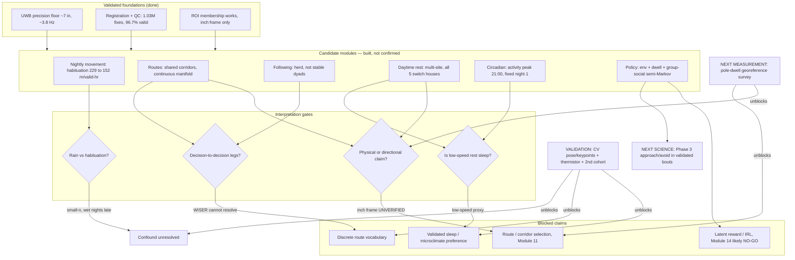

# Analysis Status Dashboard — example output

> Generated by `/analysis-status` (subagent `analysis-status-simplifier`) against
> `wiser/ANALYSIS_STATUS.md` as of **2026-07-12**. This is a **read-only reconstruction**
> — no conclusion was changed, no candidate promoted, no blocker cleared. Re-run `/analysis-status` after
> the tracker changes to refresh it.

---

## 1. Current state in one sentence

Several **WISER-native state and topology** results are **measurement-supported** — the locomotor state
machine, the semi-Markov dwell/transition topology (incl. group-social state predicting the leaving
hazard), the endpoint-graph route structure with *no* discrete vocabulary above ~7 in, and the ~21:00
activity-onset rhythm; **biological labels, physical-space interpretation, weather causality, and
sleep/microclimate mechanisms remain candidate** pending georeference, thermistors/ephys/interior CV,
and replication.

## 2. Decision map

## 3. What we actually know

> **Evidence tier tags:** `[measurement-supported]` = the WISER-native state/topology/statistical result
> is trustworthy *as a measurement* (survived its nulls + jitter-floor + auditor). `[candidate → gate]` =
> the biological/physical/causal reading is **not** yet supported and is gated on the named unblock.
> Measurement-supported ≠ publishable and never licenses the causal/physical claim.

| Scientific question | Current verdict | Human meaning | Why it is not stronger | Decisive next test |
|---|---|---|---|---|
| How good is the position measurement? | ✅ **[measurement-supported]** Jitter floor ~7 in (18 cm), ~3.8 Hz; **precision only** | Positions are trustworthy to ~a body-length, not to an absolute map location | Precision ≠ accuracy; the inch frame has an unverified offset origin | Pole-dwell georeference survey → `georeference_wiser.py` |
| Do rats reuse routes — is there a route *vocabulary*? | ⚠️ **[measurement-supported: NOT-A / topology]** **Continuous route manifold, NOT a discrete vocabulary** (Verdict C, floor-bounded); shared = the **endpoint graph**, not a path vocabulary | They revisit the same places by similar-ish paths, but there is no evidence of a finite catalogue of named routes | Bout scale is a **segmentation artifact** (moves 1:1 with the 3 s filter); legs need CV; frame unverified | Re-run the identical battery on **CV-validated decision legs** |
| Is following social bonding? | ⚠️ **[measurement-supported: structure]** **Herd / promiscuous, not stable dyads**, 2046 episodes median 3 s · **[candidate → CV+georef]** "Sen leads" = temporal order, not pursuit/geometry | Trailing is frequent but brief and partners reshuffle nightly; "leader" = who is ahead in time, not intent | Temporal order ≠ pursuit; camera map is a placeholder (recall unclaimed); n=5 | Mark video events → `audit_following_video.py` detector-recall |
| Where/when do rats rest, and does heat move them? | ⚠️ **[measurement-supported: multi-site topology]** all 5 switch house_1↔house_2 by **rate** · **[candidate → thermistor/ephys, georef]** hot-day doorway/near-water shift (doorway ρ≈+0.58); "sleep"; "house_2 cooler" | Resting spreads over several sites, not one; a *candidate* redistribution on hot days | Rest = **low-speed proxy** (not sleep); ambient-temp proxy, **no shelter thermistor**; house_2 not verified cooler (inch frame) | Shelter thermistor + ephys / interior CV |
| Is there a daily activity rhythm? | ⚠️ **[measurement-supported: activity-onset]** **peak 21:00 fixed from night 1**, only overnight depth habituates · **[candidate → ephys/CV]** sleep *depth* | A strong, synchronized dusk-onset rhythm was present from the start (not learned over days) | Rest = low-speed proxy at the jitter *ceiling* → compresses the swing; not ephys/CV-validated for sleep | Ephys / CV sleep-state validation |
| Does rain change nightly movement? | ⚠️ **[measurement-supported: movement decline]** habituation 229→152 m/valid-hr · **[candidate → replication]** **rain vs habituation NOT separable** (6/30 DiD CI spans 0) | Movement falls across nights, but the fall cannot be attributed to rain | Wet nights sit late in the sequence + raise dropout; n=5, single cohort | 2nd cohort, wet/dry balanced across sequence position |
| Is there an identifiable movement *policy*? | ⚠️ **[measurement-supported: semi-Markov + group-social predictor]** group-social **GO** (~0.012 bits, ~4% skill, day-shuffle z~30), individual **negligible** (~0.001 bits), time-invariant · **[candidate → georef, pair-resolved, n]** "the policy"; IRL | Leaving/where-to is mostly explained by layout + dwell + crowding, shared across animals; no personalized policy; no IRL | Inch frame (topology only); social is **group-level**, effect modest ~4%; n=5 | Pair-resolved social + more nights — **not** IRL |
| Does WISER daytime occupancy match the shelter cameras? | ⚠️ **[measurement-supported: asymmetric reconciliation]** CV precision≈1.0, **recall≈0.49–0.64 (lower bound)**; low κ=0.20 = base-rate + definition mismatch, **not** misalignment | When CV sees a rat inside it is right, but it misses wall-edge/huddle rats → CV is a **floor**, not a headcount | Only 2 shelters; wall-edge blind zone; asymmetric reconciliation, not symmetric agreement | Fog-free interior CH07/CH08 cross-check |

## 4. What was ruled out or corrected

1. **"8/10 animals relocated their sleep site."** — *Old:* a strong relocation signal. *Why it failed:*
   the displacement was **jitter-scale**; and a later 3-day read that swung to "only 2 animals" was
   **small-sample**. *Replacement:* over 11 days, **all 5 animals** switch house_1↔house_2 at least once —
   the real signal is the switch **rate**, not a stable/relocator dichotomy.

2. **"Route bouts have a ~4 s / ~100 in characteristic capacity."** — *Old:* a native decision-leg scale,
   read as "memoryless." *Why it failed:* the scale is a **segmentation artifact** — it moves 1:1 with the
   3 s min-bout filter; the un-truncated median run is **sub-second at the jitter floor** and the hazard is
   non-monotone with no 4 s breakpoint. *Replacement:* "memoryless / 4 s bout" is **retracted**; bouts are
   a provisional segmentation, not validated legs.

3. **"There is a discrete, shared route vocabulary."** — *Old:* a finite dictionary of reused routes.
   *Why it failed:* endpoints dominate (endpoint chord ≈ jitter, beats the route dictionary); no finite-K
   discrete scale resolvable above ~7 in. *Replacement:* **Verdict C — a continuous route manifold**;
   what is *shared* across animals is the **endpoint graph**, not a path vocabulary (PROVISIONAL until
   re-tested on CV-validated legs).

4. **The temperature-calibrated `sleep_end` window.** — *Old:* sleep ended at a per-day temperature
   threshold, making emergence look temperature-driven. *Why it failed:* it ran **past midnight on hot
   nights** and conflated the midnight nap with trunk-sleep end. *Replacement:* **RETIRED for `wake_hour`
   / `locomotor_emergence`** — emergence clusters ~20.8 h and is **circadian, not temperature-driven**
   (Spearman ≈ −0.02).

5. **"Movement is reorientation-punctuated" (decision boundaries).** — *Old:* pauses mark decision points
   between legs. *Why it failed:* pause heading-change is **not separable from WISER jitter** (matched
   +18° vs jitter-null +20°; reverses when headings are well-resolved; changepoint detector 30–77%
   false-positive). *Replacement:* **no reliable boundary class at WISER resolution**; decision-to-decision
   legs are `blocked_needs_cv`.

6. **Social state does not predict leaving (NO-GO).** — *Old:* a NO-GO from the raw point-in-ROI decision
   unit. *Why it failed:* that unit was **flicker-contaminated** (invalidating M4/M5). *Replacement:* on a
   jitter-tolerant **hysteretic ROI-state** unit, real-time **group** social state **predicts leaving
   (GO)** — Δbits ~0.012, +on all 8 nights, jitter-floor-safe; identity-agnostic (herd, not dyads).

## 5. Blocker chain

- **[measurement]** WISER frame not georeferenced → *prevents* every physical/directional/route/road/
  cooling claim (Module 11 route/corridor selection; "house_2 is cooler"; wall-running/thigmotaxis) →
  *resolve:* run the ≥6-pole dwell survey → `georeference_wiser.py` fits inch→field-cm.
- **[measurement]** ROIs confirmed **in the inch frame only** → *prevents* placing refuge/home/rest sites
  physically → *resolve:* the georeference survey + physical ROI placement (`place_wiser_rois.py`).
- **[measurement]** Sleep = low-speed proxy (not ephys/CV-validated) → *prevents* any "sleep" /
  microclimate-preference claim → *resolve:* shelter thermistor and/or ephys / interior CV (CH07/CH08).
- **[measurement]** WISER cannot resolve decision boundaries → *prevents* validated decision-to-decision
  legs **and** settling the route-vocabulary C-vs-B question → *resolve:* CV pose/keypoints.
- **[measurement]** Weather↔WISER alignment wall-clock only (±5 min) → *weakens* any weather-correlated
  activity claim → *resolve:* independent clock / sync verification.
- **[measurement]** Sub-1 m proximity below the ~7 in jitter floor → *prevents* fine social-distance
  claims → *resolve:* keep proximity thresholds ≥ 1 m.
- **[sample/design]** n=5, single cohort, wet nights late in sequence → *prevents* separating rain from
  habituation and any generalization → *resolve:* a 2nd cohort balanced dry-vs-wet across sequence position.
- **[implementation]** Video-audit camera map is a placeholder; `analyze_formal_recording.py` is a stub →
  *prevents* detector-recall/leader-geometry claims and real formal-session QC → *resolve:* calibrate the
  camera map + mark events; implement gap detection / smoothing / session QC.

## 6. Next three moves

1. **Measurement unblock — run the georeference survey.** Do the ≥6-pole dwell survey →
   `georeference_wiser.py`, and confirm ROIs physically. **Unlocks:** every spatial/directional claim,
   Module 11 (route/corridor selection), the roadway-vs-camera motif audit, and a real "cooler-house /
   shade" hypothesis. **Do not before it:** claim wall-running/thigmotaxis/route-vs-boundary/road/"cooler
   side," or treat inch-frame distances as physical.

2. **Next executable science — Phase 3 (approach/avoid) within already-validated active bouts.** Fit
   association (not attraction) within the validated bouts, and test pair-resolved vs group social coupling
   over more nights. **Unlocks:** the next module in the semi-Markov DAG with no new hardware.
   **Do not before it:** build the social-graph transformer (Module 13 is a *late challenger* only),
   attempt IRL / reward inference (Module 14 likely NO-GO), or read group-social coupling as dyadic bonds.

3. **Validation / replication — acquire the validating measurements.** Get CV pose/keypoints (decision
   legs + fog-free interior CH07/CH08 sleep cross-check), a shelter thermistor (validate "sleep" /
   microclimate), and a 2nd cohort balanced wet/dry across sequence position. **Unlocks:** promoting
   rest→sleep, resolving the route-vocabulary C-vs-B question on validated legs, and separating rain from
   habituation. **Do not before it:** call low-speed "sleep," claim a discrete route vocabulary, or
   attribute the movement drop to rain.

## 7. Scope-safe language

**Allowed now**
- "candidate," "in the unverified WISER **inch** frame," "**low-speed rest** proxy"
- "shared **corridor / endpoint** structure across animals"
- "**herd-like / promiscuous** following; **temporal** lead (Sen ahead in time)"
- "**activity-onset** rhythm peaking ~21:00, present from night 1"
- "**group-social** state predicts leaving hazard (~4% skill, identity-agnostic)"
- "CV visible-inside count is a **lower bound** on shelter occupancy"
- "**multi-site** daytime rest; all 5 animals switch houses by **rate**"

**Do not say yet**
- "sleep" / "sleep site" as validated (say **low-speed rest**)
- "route **memory**," "**discrete** route vocabulary," "route dictionary"
- "**leader** / follows / pursues" in the intentional sense
- "wall-running / thigmotaxis / runs along the road / **chooses the cooler house**"
- "confirmed / proven / established / demonstrates"
- "**rain reduces movement**" (confounded with habituation)
- "individual personality / **personalized** policy," "**social network / bonds**"
- "reward / goal / utility / optimal foraging" — anything from IRL

## 8. Provenance

- **Canonical status file:** `wiser/ANALYSIS_STATUS.md` — **READ** (full file).
- **Change logs (REFERENCED via the tracker's links; not re-opened for this example run):**
  `change_log/2026-07-11-bout-segmentation-validation.md`,
  `change_log/2026-07-11-decision-boundary-validation.md`,
  `change_log/2026-07-11-route-vocabulary-validation.md`,
  `change_log/2026-07-10-biological-day-sleep.md`,
  `change_log/2026-07-11-sleep-site-hierarchy.md`,
  `change_log/2026-07-10-decision-unit-hysteretic-social.md`,
  `change_log/2026-07-11-temporal-policy.md`,
  `change_log/2026-07-11-destination-settlement-rebuild.md`,
  `change_log/2026-07-11-locomotor-bout-initiation.md`,
  `change_log/2026-07-06-wiser-binning-resolution-fix.md`,
  `change_log/2026-07-10-d1-d2-eleven-day-consolidation.md`.
- **Canonical reports (REFERENCED):**
  `outputs/direction3_biological_day_sleep/direction3_biological_day_sleep_canonical_results.md`,
  `outputs/direction3_sleep_site/SCIENTIFIC_SUMMARY.md`,
  `outputs/audit/ROUTE_VOCAB_AUDIT_2026-07-11.md`.

> For a live invocation the subagent **opens** the specific change logs it needs to resolve a
> contradiction and flags each as read-vs-referenced accordingly; this example resolved every verdict
> from the tracker's own inline corrections, so the linked files are cited as referenced.
