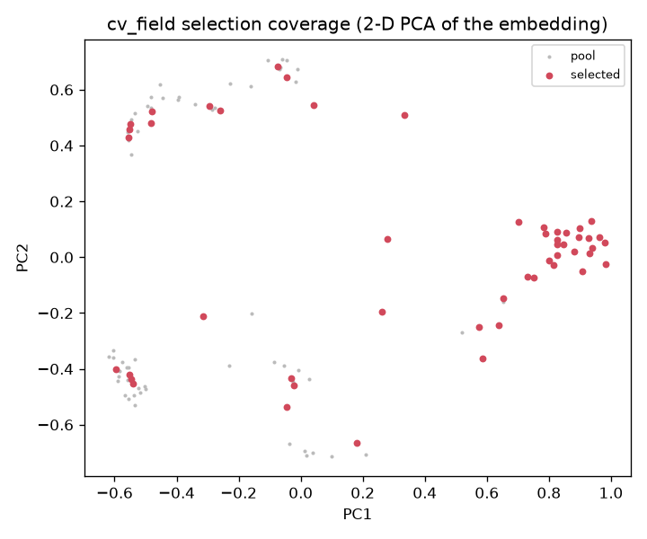

# cv_field labeling round 2 — 2026a

- **direction:** cv_field (whole-field CH01-CH04)  ·  **channels:** CH03, CH04
- **selection method:** uncertainty x diversity  ·  **budget:** 50  ·  **selected:** 50
- **pool size:** 110 candidate frames  ·  **embed backend:** dino
- **K (silhouette):** None  ·  **seed weights:** rat_field_div1
- **motion:** embedding the MOTION CROP (rat region), not the whole frame; reserved 12 quiet/random frames so still/resting rats + true negatives stay represented.

## Definitions

- **budget B** — number of frames selected this round for hand-labeling (count).
- **medoid** — the most-central real frame of a k-means cluster (a typical exemplar).
- **farthest-point coverage** — greedy k-center pick maximizing min-distance to the already-covered set (fills rare/edge regimes).
- **K (silhouette)** — number of k-means clusters chosen by maximizing the mean silhouette (robust on the L2-normalized embedding, where a likelihood BIC would over-segment).
- **uncertainty u in [0,1]** — max(confidence-margin about tau, count-instability under horizontal-flip TTA); higher = the detector is less sure.
- **acquisition a(f|A) = u^gamma · d(f,A)** — uncertainty-weighted k-center: selects frames that are both uncertain and far (min Euclidean distance) from the labeled set A in the L2-normalized embedding.

## Falsification guard

- single-Gaussian BIC -6642 vs k-means BIC -11021 (K=8); smooth model competitive: False.
- Clusters here are a **labeling heuristic only**, never a claim of behavioral discreteness.

## Coverage figure

## Whole-field measurement caveats (carry on every downstream number)

- scope is night-IR only (21:00–04:20); CH01/CH02 daytime color is corrupt and excluded.
- counts are a LOWER BOUND (`visible_count`): wall-edge blind band + huddle occlude animals.
- NO cross-camera identity yet (animal_id = <camera>:<track_id>) — no whole-field per-animal or cross-camera-headcount claims.
