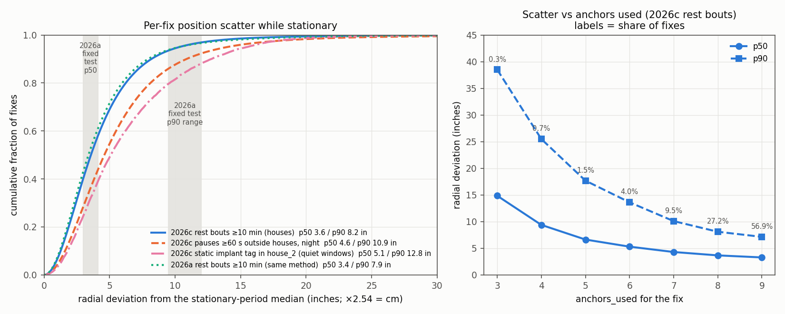
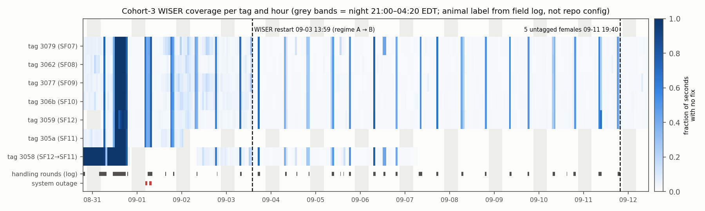
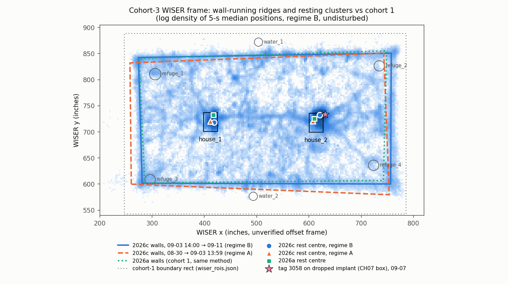

# Cohort-3 WISER measurement quality for whole-field CV cueing — `wiser_baseline` (2026c)

- **What this is:** a *measurement* report (precision, coverage, dropout, frame consistency, transform feasibility)
  for the cohort-3 WISER UWB tracks, written for the whole-field night-IR CV effort (CH03/CH04). It makes **no
  behavioural claim.**
- **Cohort / window:** 2026c, SF07–SF12. Paddock phase 2026-08-30 19:00 → 2026-09-12 10:10 EDT. Main analysis
  window ends 2026-09-11 19:40, when five untagged females were released; the time after that is reported
  separately as regime C.
- **Frame status:** WISER native **inches, unverified offset frame**. No georeference exists: `wiser/configs/wiser_to_field_transform.json` is absent, and none was written.
- **Run:** off-repo bulk `D:\Field2026_analysis_out\2026c\wiser_cohort3_accuracy_20260928_1405\` holds the CSVs,
  the figures, `run_manifest.json` and the analysis scripts `scripts/s00…s12` for provenance. The in-repo pointer
  is `run_manifest.json` next to this report.
- **Repo commit at run time:** `ed9e93ae541dd1c7b8434523e3498ed9ee5e0d79`. The existing library was reused
  unchanged: `wiser_io._connect_readonly`, `wiser_analysis_utils.add_speed / add_validity_flags / speed_noise_floor /
  apply_tag_cutoffs / _rect_membership`, and `field_transform.fit_similarity / fit_affine`.
- **Generated:** 2026-09-28.

---

## 0. Verdict for the CV effort

**What WISER is good enough for now in cohort 3**

1. **Timing and presence.** It tells you which tagged rats are in the arena, and when.
   - From 09-03 14:00 on, each tag has a fix in **98.1–98.5 % of night seconds**.
   - Gaps longer than 2 s cover only **0.11–0.33 % of night time** in every zone, and no gap is longer than 31 s.
   - Before 09-03 14:00 the figures are 94–96 % and ~3.6 %.
   - Whole-group silences mark the handling rounds, when the rats are out of the arena.
2. **In a house vs outside.** This is house-ROI membership in the inch frame, which needs no transform.
3. **Which end of the paddock, i.e. CH03 end vs CH04 end.**
   - The along-paddock scale is 0.99 physical in per WISER in, and the x direction does not depend on the unresolved mirror (below).
   - It is taken from the cohort-1 house identity (house_1 = CH05 box).
   - Error ≈ per-fix jitter (p90 ≈ 11 in = 28 cm) plus a frame-shape term ≤ 9 in.
   - At night (regime B), 11.9 % of fixes fall in the CH03-only end (paddock x < 90 in), 11.6 % in the CH04-only end (x > 390 in) and 76.5 % in between.
4. **Distance from the long centreline, |y − 120 in|.** This is also mirror-independent.

**What it is not usable for (yet)**

1. **Placing a search window in a CH03/CH04 image.**
   - The WISER frame has an **unresolved mirror**: which long wall is the A side (y = 0) is unknown.
   - Every available landmark (two houses on the centreline, four walls) fits equally well either way.
   - A wrong guess misplaces night positions by **p50 85 cm, p90 6.1 m**.
   - Following the task rule, **no transform and no transform-based localisation error is issued** (§5.5).
2. **Any cue finer than ~30 cm radius**, even with a perfect transform.
   - The stationary per-fix scatter alone is p90 ≈ 28 cm (19 cm for a 1-s median); moving rats are worse.
   - So separating rats that are closer than ~1 m, or head vs body, is below the WISER floor.
3. **The five untagged females** released 09-11 19:40. From then on, WISER covers 5 of the 10 animals.
4. **08-30 → 09-03 13:59 (regime A) with the later geometry.**
   - The frame then was shifted by 7–18 in and noisier: rest p90 ≈ 10.4 in vs 8.1 in.
   - It needs its own wall fit, or should be excluded.

**What would make it better**, detailed in §7:

1. Resolve the mirror bit with one video-confirmed off-axis correspondence.
2. Co-register WISER fixes with cv_field detections to fit a validated (affine or non-rigid) map and the clock offset.
3. Weight cues by `anchors_used`: p90 is 7 in at 9 anchors and 18–39 in at ≤ 5 anchors.
4. Use 1-s medians.
5. Treat regime A separately.

**Classification** (regime-aware-wiser-tracking categories). Precision and coverage are measurement results with
no behavioural content. The regime-A frame offset is a **likely measurement artifact**: the walls moved too. It is
still **mixed** for the rest-cluster part, because the resting spot inside a house can change. Physical
placement is **invalid** until the mirror and a transform exist.

---

## 1. Data sources

Q: and F: are original data and were read-only. Each file was copied to
`D:\Field2026_analysis_out\2026c\wiser_working\` and opened with `mode=ro` + `PRAGMA query_only=ON`.

**Source used: the four cohort-3 live-DB segment copies** in `F:\wiser\data\`. The identical names and sizes are
on `Q:\hc997\SocialFieldRat2026\3rd_rat\wiser\data\`. These copies are the only **complete** source. The daily
incremental `*.csv.gz` (same listing on `F:\wiser\Wiser_backup\incremental` and
`F:\3rd_rat\Wiser_backup\incremental`) miss two tails, because the 03:30 backup ran before those DB files were
closed:

- the `_3` tail 09-01 03:29:56 → 04:20:06 (~68.8 k rows);
- the `_3_2` tail 09-01 06:31:18 → 06:47:16 (~5.8 k rows).

| File (table `reports`) | Bytes | mtime (F:) | Rows | First → last fix (EDT) | sha256 (first 12) |
|---|---:|---|---:|---|---|
| `3rdcohort_Spike_2026_3.sqlite` | 196,575,232 | 2026-09-17 17:35 | 1,869,951 | 08-30 18:32:35 → 09-01 04:20:06 | `0fe2b6bfac7a` |
| `3rdcohort_Spike_2026_3_2.sqlite` | 10,743,808 | 2026-09-17 17:35 | 100,998 | 09-01 05:23:34 → 06:47:16 | `00e1afad632b` |
| `3rdcohort_Spike_2026_3_3.sqlite` | 395,927,552 | 2026-09-17 17:35 | 3,698,453 | 09-01 07:23:14 → 09-03 13:55:58 | `4bea8c3d1ba2` |
| `3rdcohort_Spike_2026_3_4.sqlite` | 1,666,756,608 | 2026-09-17 17:35 | 15,550,527 | 09-03 13:59:55 → 09-12 10:51:19 | `82ccadfde589` |

The four files hold 21,219,929 rows in total, with 0 duplicates on (shortid, timestamp, x, y). `location_z` is always 0.

Other files used:

- **`F:\wiser\Wiser_backup\snapshots\1stcohort_2026_2026-07-12.sqlite`** (2,283,528,192 B, table `Position`) is the
  cohort-1 canonical pin. It was used for the same-method comparison over 06-28 00:00 → 07-09 00:00 EDT:
  17,099,052 fixes after the `rat_identities.csv` cutoffs.
- **`F:\wiser\data\tag_reports.sqlite`** (157,167,616 B) was only checked. It has **0 rows in 08-30 → 09-12**; the
  days present are 06-21, 06-22, 07-14, 08-19 and 09-16. There is therefore no fixed-tag test for cohort 3.

Field-record facts were relayed by the `recording-inquiry` agent with citations:

- the tag map;
- the handling rounds;
- the WISER restarts;
- the house design layout.

Their sources are `field2026-sync/from-field/2026-09-21_cohort3-incident-log.md`,
`Field_2026_Social_Recording/BATTERY_LOG_cohort3.md` and `…/gen_calib_record_sheet.py`.

## 2. Tags (a tag is not an animal)

`wiser/configs/rat_identities.csv` has **no cohort-3 rows**. Results are therefore per **tag**. The animal
column below is the field incident log's mapping (entries 09-01 13:40, 09-02 08:10 and 09-07 19:40), shown as a
label only. It is not in any repo config.

| Tag (shortid) | Field-log animal | On-animal window used (EDT) | Fixes | Median Δt | Anchors median / ≥ 8 | 1-s coverage, night A / B / day B | Night gap-time (all regimes) | Rest p50 / p90 / RMSE (in) |
|---|---|---|---:|---:|---|---|---:|---|
| 3079 (12409) | SF07 | 08-30 19:00 → 09-12 10:10 | 3.79 M | 0.228 s | 9 / 79 % | 94.8 / 98.5 / 98.3 % | 1.3 % | 3.45 / 7.99 / 5.80 |
| 3062 (12386) | SF08 | same | 3.84 M | 0.227 s | 8 / 76 % | 94.7 / 98.4 / 98.3 % | 1.3 % | 3.66 / 8.40 / 6.03 |
| 3077 (12407) | SF09 | same | 3.82 M | 0.227 s | 9 / 79 % | 94.7 / 98.4 / 98.2 % | 1.3 % | 3.64 / 8.19 / 5.93 |
| 306b (12395) | SF10 | same | 3.85 M | 0.227 s | 9 / 78 % | 94.4 / 98.3 / 98.2 % | 1.4 % | 3.64 / 8.24 / 5.95 |
| 3059 (12377) | SF12 | 08-31 06:36 → 09-12 10:10 | 3.78 M | 0.226 s | 8 / 73 % | 95.8 / 98.1 / 98.0 % | 0.8 % | 3.41 / 7.90 / 5.58 |
| 305a (12378) | SF11 | 08-30 19:00 → 09-02 00:03 (battery died, 2.93 → 2.38 V) | 0.53 M | 0.228 s | 8 / 58 % | 95.4 / – / – | 3.2 % | 4.19 / 9.78 / 6.60 |
| 3058 (12376) | SF11 (remount) | 09-02 08:20 → 09-07 06:10:45 (implant came off) | 1.52 M | 0.227 s | 9 / 80 % | 95.3 / 98.5 / 98.3 % | 0.7 % | 3.63 / 8.33 / 5.84 |
| 3058 (12376) | SF12 (first tag) | 08-30 19:00 → 08-31 19:24 | 0.015 M | – | 7 / 45 % | 0 / – / – | – | – |

Exclusions and special windows for tag 3058:

- It is off-animal from 08-31 19:24 to 09-02 08:20, and after 09-07 08:17.
- From 09-07 06:12 to 08:17 it lay **static on the dropped implant in the CH07 box** (WISER house_2). This window is
  used as a static reference.
- As SF12's first tag it was essentially silent: 0 % of night seconds and 7 % of day seconds covered. SF12 therefore
  has **no usable WISER track on night 1**; 3059 starts at 08-31 06:36.
- The 09-11 females: whether they carried WISER tags was never stated in the field log. The data show **no
  additional shortid**.

## 3. Regimes and exclusions

| Regime | Window (EDT) | Why it is separate |
|---|---|---|
| **A** | 08-30 19:00 → 09-03 13:59 | DB segments `_3/_3_2/_3_3`. It ended with the BSOD and WISER restart at 09-03 13:56–13:59. Sampling is noisier and the frame is shifted (§5.3, §5.4). |
| **B** | 09-03 14:00 → 09-11 19:40 | Segment `_3_4`. Stable. **This is the reference regime.** |
| **C** | 09-11 19:40 → 09-12 10:10 | Population change: 5 untagged females present. |

Three kinds of time are masked out of the sensor-dropout and precision statistics. Together they are called
**out-of-arena / system time**:

- **handling rounds** from the field log, applied to all tags;
- **44 whole-group silences** ≥ 60 s, when all rats were out of the arena. They typically
  start 10–40 min before the first logged BLE Stop. Total duration 1,105 min.
- **3 system outages**, 137 min in total:
  - 09-01 04:20–05:23, BSOD;
  - 09-01 06:36–07:45, manual WISER restart inside the AM round;
  - 09-03 13:56–13:59, BSOD.

These periods are listed in `c3_all_tag_silences_merged.csv`. Weather was not joined.

## 4. Definitions

All positions are in the WISER native **inch** frame, which is unverified. Values are converted to cm with ×2.54,
and the reverse conversion is never needed. Local time is EDT: $t_\text{loc} = t_\text{UTC} - 4\,\text{h}$.
Symbols:

- $\mathbf p_i=(x_i,y_i)$ is fix $i$ of a tag, taken at time $t_i$.
- $\Delta_i=t_{i+1}-t_i$ is the interval to the next fix.
- $\mathbb 1[\cdot]$ is the indicator function.

### Night window $\mathcal N$
$$ t\in\mathcal N \iff 21{:}00 \le t_\text{loc} < 04{:}20\ (\text{next day}) $$
**Text:** this is the CV night-IR window. "Day" is its complement.

### Sampling interval and rate
The median interval is $\tilde\Delta=\operatorname{median}_i \Delta_i$ (s). The mean rate is $\bar r = N/T$ (Hz),
where $N$ is the number of fixes in a window of length $T$.
**Text:** $\tilde\Delta$ is how often a tag reports while it is visible. The value is ≈ 0.227 s, i.e. ≈ 4 Hz.
Cadence is bimodal, at 0.134 s and 0.27 s.

### Reference rate $r_\text{ref}$ and fraction of expected fixes $F$
$$ r_\text{ref} = \frac{Q_{0.95}\big(\{n_h\}\big)}{3600},\qquad F = \min\!\Big(1,\frac{N}{r_\text{ref}\,T}\Big) $$
$n_h$ is the number of fixes in each full clock hour of on-animal, undisturbed, main-period time.
**Text:** "expected" means the tag's own near-best hourly rate, 3.92–4.02 Hz per tag (≈ 14.3 k fixes/h). $F$
ranges over [0, 1]; 1 means no missing fixes relative to that rate.

### 1-s coverage $C$
$$ C=\frac{1}{|S|}\sum_{s\in S}\mathbb 1\big[n_s\ge 1\big] $$
$S$ is the set of 1-s bins in the window, and $n_s$ is the number of fixes in bin $s$.
**Text:** the fraction of seconds that contain at least one fix, i.e. whether a video frame has a WISER fix in
the same second. Range [0, 1]. A second can be empty during a normal 1–2 s cadence pause, so $C$ < 1 even without dropout.

### Gap, gap-time fraction $g$, gap rate, outage
Gap threshold: **$G = 2$ s**, i.e. ≈ 9 × $\tilde\Delta$. The p99 of the normal cadence is 1.08–1.6 s.
$$ g=\frac{\sum_i \Delta_i\,\mathbb 1[\Delta_i>G]}{\sum_i\Delta_i},\qquad \text{rate}_{>k}=\frac{\#\{i:\Delta_i>k\}}{\sum_i\Delta_i/3600} $$
**Text:**

- $g$ is the fraction of time spent inside gaps longer than 2 s. Range [0, 1].
- The rate is the number of gaps longer than $k$ s (with $k$ = 2, 10 or 60 s) per hour.
- A **long outage** is an interval longer than 60 s, or longer than 5 min.

Each interval is attributed to the zone and the time of the fix that starts it, i.e. the last known place. It is
excluded if it overlaps out-of-arena/system time.

### Out-of-arena / system mask $M_\text{out}$
$$ M_\text{out}=\bigcup_\text{rounds}[a,b)\ \cup \bigcup_{k}\big[s_k-2\,\text{min},\,e_k+2\,\text{min}\big) $$
$[s_k,e_k]$ are the **all-tag silences**: maximal runs of seconds in which no tag has a fix, lasting ≥ 60 s and
merged across breaks shorter than 120 s.
**Text:** these are periods when the rats are in the operator's hands or the WISER server is down. They are not
sensor dropout.

### Zones
Each zone is assigned from the smoothed position $\hat{\mathbf p}_i$ (below). The ROIs are the cohort-1 ones in
`wiser_rois.json`. Priority runs top to bottom:

| Zone | Rule |
|---|---|
| house_1 / house_2 | inside the rectangle grown by **14 in**, the library hysteretic buffer (≈ 2 × the 7-in jitter floor) |
| refuge_4 area; refuges 1–3; water | within radius + 14 in of the ROI centre |
| **outside_wall** | signed distance to the wall-ridge rectangle (below) $d<-15$ in |
| **wall_band** | $\lvert d\rvert\le15$ in |
| open | everything else |

### Smoothed position $\hat{\mathbf p}_i$ and smoothed speed $v_i$
This is the library `add_speed`:
$$ \hat{\mathbf p}_i=\operatorname{median}_{j=i-3}^{i+3}\mathbf p_j,\qquad v_i=\frac{\lVert\hat{\mathbf p}_{\text{hi}(i)}-\hat{\mathbf p}_{\text{lo}(i)}\rVert}{t_{\text{hi}(i)}-t_{\text{lo}(i)}} $$
lo and hi are the first and last fix inside $[t_i-0.5\,\text{s},\,t_i+0.5\,\text{s}]$. $v>60$ in/s is set to NaN.
**Text:** a jitter-suppressed position, and the speed over 1 s, in in/s.

### 5-s bin median $\tilde{\mathbf p}_k$
The coordinate-wise median of the fixes in 5-s bin $k$. Only bins with at least 5 fixes are used; a full bin holds ≈ 20.

### Stationary bout (the precision selector)
This is a greedy segmentation of each tag's 5-s bin medians. A bout is a maximal run of consecutive bins that
satisfies three conditions:

- successive bins are at most 30 s apart;
- every bin median lies within **$r_s$ = 8 in** of the run anchor;
- the run lasts ≥ **$T_\text{min}$**.

The run anchor is the first bin at the start, and it is reset to the median of the member bins every 12 bins (1 min).

$T_\text{min}$ takes one of two values:

- **10 min** ("rest bouts"). These fall almost entirely inside houses.
- **60 s** ("pauses"). These are used to measure the open field at night.

Why $r_s$ = 8 in:

- It is ≫ the noise of a 5-s median (≈ 2 in), so jitter alone never breaks a bout.
- It is < the 14-in "minimum resolvable" distance of `behavioral_policy_modules.yaml`.
- The sensitivity to $r_s$ = 5 and 12 in is reported.

Bouts overlapping handling are dropped.

### Radial deviation $r_i$ and its summaries: the cohort-1 fixed-test method
$$ r_i=\lVert\mathbf p_i-\operatorname{median}_{j\in B}\mathbf p_j\rVert_2 \quad(i\in B) $$
$$ \text{p}q=Q_q(\{r_i\}),\qquad \text{RMSE}=\sqrt{\tfrac1N\textstyle\sum_i r_i^2},\qquad \sigma_x=\operatorname{sd}(x_i-\tilde x_B) $$
**Text:**

- $r_i$ is the distance of each raw fix from its own stationary period's median. The deviations are pooled over
  bouts. Units are inches. This is **precision (repeatability), not accuracy.**
- The "1-s median" variant replaces $\mathbf p_i$ with the median of the fixes in each 1-s bin, which is what a
  per-second cue would use.
- For a resting animal $r_i$ includes real head motion, so it is an **upper bound** on sensor jitter. The selection
  itself biases it low (see "selection bias" in §5.2).

### Fixed-tag-equivalent (cohort-1 calibration)
$$ k_q=\frac{Q^{\text{fixed test}}_{q,\,2026a}}{Q^{\text{rest bouts}}_{q,\,2026a}},\qquad \hat Q^{\text{fixed}}_{q,\,2026c}=k_q\,Q^{\text{rest bouts}}_{q,\,2026c} $$
**Text:** this rescales the cohort-3 rest-bout statistics by the ratio that the *same* rest-bout method shows
against the cohort-1 fixed-position test. That test is `wiser/README.md`, 6 tags, and the table uses its mean.
It assumes the rest-bout / fixed-test relation carries over between cohorts.

### Speed noise floor
Library `speed_noise_floor`: the median, p95 and p99 of $v_i$ over fixes inside stationary bouts, in in/s.
**Text:** the smoothed speed a non-locomoting tag shows. Below p99, movement and jitter cannot be told apart.

### Motion-proxy residual $r^\text{res}_i=\lVert\mathbf p_i-\hat{\mathbf p}_i\rVert$
**Text:** the scatter of raw fixes about the 7-sample (~1.6 s) running median. For moving fixes ($v$ >
p99 floor) it mixes jitter with real path curvature, so it is only an **upper-bound proxy** for in-motion precision.

### Wall-running ridge and ridge rectangle
For each wall, the along-wall axis is cut into 10-in slices, excluding 30 in near the corners. In each slice, a
1-in histogram of 5-s medians is taken across the wall (smoothed over 3 bins), within ±30 in of the current
estimate. The **ridge point** is the **outermost** local maximum that is ≥ 50 % of the slice maximum, refined with
a parabolic fit. A Theil–Sen line is fitted to the ridge points, the fit is iterated twice, and the corners are
the intersections of adjacent lines.
**Text:**

- The ridge is where rats run along the physical wall. It is a physical landmark seen in WISER, set in from the
  wall by the head-tag offset $\delta$, assumed to be **2 in**.
- Side lengths are compared with the paddock minus $2\delta$, i.e. 476 × 236 in.
- The signed distance $d$ to the ridge rectangle is the minimum over the four lines, positive inside.

### Rest-cluster centre and ROI offset
The centre is the **duration-weighted median** of the bout medians of daytime (07–19 h) ≥ 10-min bouts that lie
within 40 in of a house ROI centre. The offset is the centre minus the ROI centre, in inches.
**Text:** this is where the tag sits when the animal rests in that house. The house interior is 18 × 24.6 in,
which allows ±9–12 in of offset for real reasons.

### Similarity / affine landmark fit (diagnostic only)
The similarity fit is Umeyama's reflection-free fit, `field_transform.fit_similarity`:
$$ \min_{s,R,\mathbf t}\ \sum_k\lVert s R\,\mathbf u_k+\mathbf t-\mathbf w_k\rVert^2 ,\qquad \text{residual}_k=\lVert sR\mathbf u_k+\mathbf t-\mathbf w_k\rVert $$
- $\mathbf u_k$ are the WISER landmarks: the 4 ridge corners and the 2 house rest centres.
- $\mathbf w_k$ are the paddock landmarks in inches from A0: the corners inset by $\delta$, and the design-layout
  house centres (134.9, 120.0) and (347.0, 119.1), each ±0.5 m.
- The affine version is `fit_affine`, which reports anisotropy $\lvert s_x-s_y\rvert/\bar s$ and shear.
- **Mirror hypotheses.** H+ assumes WISER +y = paddock +y. H− assumes WISER +y = paddock −y and is fitted on $(x,-y)$.

**Mirror discrepancy:**
$$ D(\mathbf p)=\lVert T_{+}(\mathbf p)-T_{-}(\mathbf p)\rVert $$
**Text:** $D$ is how far apart the two hypotheses place the same fix.

### Anchor-subset bias
The mean of $(x_i-\tilde x_B,\,y_i-\tilde y_B)$ inside regime-B bouts, grouped either by `anchors_used` or by which
anchor is missing from `anchors_list` (8-anchor fixes). Its magnitude is in inches.

## 5. Results

### 5.1 Inventory and coverage

The tags seen are 3058, 3059, 305a, 3062, 306b, 3077 and 3079. Nine anchor IDs appear in `anchors_list`: 1, 2, 5,
6, 12, 15, 19, 102 and 104. `anchors_used` is 3–9:

| anchors_used | Share of on-animal fixes |
|---|---|
| 9 | 46–55 % (26 % for 305a) |
| 8 | 25–32 % |
| < 4 | 0.4 % |

`calculation_error` is 0 in 68–69 % of fixes. It is not interpreted.

**Pooled 1-s coverage, outside out-of-arena/system time**

| Regime | Night | Day |
|---|---|---|
| A | 91.2 % (per tag 94–96 %, excluding the silent 3058a) | 93.2 % |
| B | **98.35 %** | **98.24 %** |
| C | 97.9 % | 98.1 % |

The fraction of expected fixes in regime B is **98.6–99.6 %** per tag. The median hourly $F$ over full
undisturbed hours is 0.985–0.994 for 3058b, 3059, 3062, 306b, 3077 and 3079; 305a, which was dying, had 0.88.

**Where the tags are at night** (regime B, share of night time):

| Zone | Share |
|---|---|
| houses | 46 % (house_2 33 %, house_1 13 %) |
| open | 26 % |
| wall band | 24 % |
| refuges 1–3 | 3.3 % |
| refuge_4 area | 0.6 % |
| water | 0.4 % |

So about half of night time is spent outside the houses, which is the CV-relevant fraction.

### 5.2 Precision

The figure below shows the per-fix scatter while stationary (left) and the scatter against `anchors_used` (right).

| Selector (undisturbed, main period unless noted) | Bouts / hours | p50 | p75 | p90 | p95 | RMSE | 1-s median p90 |
|---|---|---|---|---|---|---|---|
| **2026c rest bouts ≥ 10 min, all** | 1151 / 325 h | **3.57 in (9.1 cm)** | 5.61 | **8.19 in (20.8 cm)** | 10.33 (26.2 cm) | **5.87 in (14.9 cm)** | 6.23 in |
| — night / day | 171 / 42 h · 980 / 283 h | 3.75 / 3.55 | 5.91 / 5.56 | 8.66 / 8.12 | 10.87 / 10.24 | 6.05 / 5.84 | 6.42 / 6.18 |
| — regime A (night · day) | 33 · 116 | 4.41 · 4.38 | – | 10.59 · 10.22 | 13.52 · 12.89 | 7.15 · 7.12 | 7.4 · 7.3 |
| — regime B (night · day) | 138 · 864 | 3.64 · 3.47 | – | 8.25 · 7.87 | 10.26 · 9.88 | 5.80 · 5.69 | 6.3 · 6.1 |
| — regime C (night · day) | 10 · 27 | 3.54 · 3.57 | – | 7.99 · 8.54 | 9.87 · 11.32 | 5.59 · 6.18 | 6.0 · 6.0 |
| **2026c pauses ≥ 60 s outside houses, night** (CV-relevant) | 2022 / 67.6 h | **4.60 in (11.7 cm)** | 7.27 | **10.87 in (27.6 cm)** | 13.98 (35.5 cm) | **7.76 in (19.7 cm)** | **7.63 in (19.4 cm)** |
| 2026c pauses ≥ 60 s in houses, night | 3546 / 173 h | 4.48 | 7.22 | 10.87 | 13.81 | 7.46 | 8.11 |
| 2026c static implant tag in house_2, 06:12–08:17 (full) | 1 window, 2.1 h | 5.26 | 8.65 | 13.77 | 18.47 | 9.19 | – |
| — quiet sub-windows 06:23–06:44 / 06:55–07:24 | – | 5.59 / 4.71 | 8.68 / 8.35 | 12.50 / 12.99 | 15.23 / 15.65 | 8.36 / 7.91 | – |
| **2026a rest bouts ≥ 10 min, same method** | 1274 / 363 h | 3.39 | 5.35 | 7.94 | 10.30 | 5.89 | 6.00 |
| 2026a fixed-position test (`wiser/README.md`, 6 tags) | – | 3.0–4.1 | 5.0–6.3 | 9.5–12.0 | 12.5–15.7 | 6.4–7.9 | – |
| **2026c fixed-tag-equivalent** ($k_q$: 1.03 / 1.32 / 1.40 / 1.22) | – | **3.67 (9.3 cm)** | – | **10.84 (27.5 cm)** | 14.42 (36.6 cm) | **7.16 (18.2 cm)** | – |

All values are in inches unless marked.

**Reading.**

- **Cohort-3 precision is unchanged from cohort 1.** The same method gives 3.57/8.19/5.87 in (p50/p90/RMSE)
  against cohort 1's 3.39/7.94/5.89 in.
- On the fixed-test scale, cohort 3 is p50 ≈ 3.7 in, p90 ≈ 11 in and RMSE ≈ 7 in. That is inside the published
  cohort-1 range: p50 3–4, RMSE 6.4–7.9 in.
- Night is slightly worse than day. Pauses in the open field at night have the same scatter as pauses in houses:
  p90 ≈ 10.9 in in both.

**Selection bias and sensitivity.**

- The 10-min rule captures only **67 %** of the truly static implant window; the 60-s rule captures 92 %. So the
  ≥ 10-min numbers favour calm periods.
- Changing the bout radius $r_s$ gives, for p50/p90/RMSE:

  | $r_s$ | p50 | p90 | RMSE | Bout time |
  |---|---|---|---|---|
  | 5 in | 2.70 | 6.17 | 4.71 | 91 h |
  | 8 in | 3.57 | 8.19 | 5.87 | 325 h |
  | 12 in | 4.71 | 10.54 | 7.28 | 609 h |

- The static implant lay under huddling rats, the worst in-house case. Its scatter was ~1.3–1.7× the rest-bout scatter.

**Scatter vs `anchors_used`** (regime-B rest bouts, share of fixes in brackets):

| Anchors | p50 / p90 (in) | Share |
|---|---|---|
| 9 | 3.3 / 7.1 | 56.9 % |
| 8 | 3.7 / 8.1 | 27.2 % |
| 7 | 4.3 / 10.1 | 9.5 % |
| 6 | 5.3 / 13.6 | 4.0 % |
| 5 | 6.6 / 17.7 | 1.5 % |
| 4 | 9.4 / 25.5 | 0.7 % |
| 3 | 14.8 / 38.5 | 0.3 % |

The mean bias is ≤ 0.7 in for ≥ 5 anchors, and 5.9 in at 3 anchors.

**Speed noise floor** (library, in-bout fixes): median 1.71, p95 6.23, **p99 10.24 in/s (26 cm/s)**. The cohort-1
fixed test gave p99 12.46 in/s. The static implant's p99 was 10.1–15.8 in/s.

**Moving rats** (v > 10.24 in/s):

- They are 9.8 % of night fixes, against 5.0 % by day.
- Night speed is p50 14.3 in/s (36 cm/s) and p90 26.6 in/s (67 cm/s).
- The motion-proxy residual is p50 6.2 in and p90 17.5 in (44 cm). In bouts the same residual is 2.3 / 6.6 in.
- Moving precision is therefore **not measured**. It is ≤ ~2.7× the stationary value, and part of that bound is
  real path curvature.

### 5.3 Dropout and regimes

These statistics are computed outside out-of-arena/system time, with $G$ = 2 s, from the files
`c3_gaps_S_*.csv`.

| Stratum | Gap-time $g$ | Gaps > 2 s /h | > 10 s /h | > 60 s | Max gap |
|---|---|---|---|---|---|
| Regime B, night | **0.18 %** | 2.5 | 0.03 | 0 | 30.8 s |
| Regime B, day | 0.28 % | 3.4 | 0.06 | 1 | 95 s (outside-wall lobe) |
| Regime A, night | 3.65 % | 43 | 0.29 | 0 | 18.8 s |
| Regime A, day | 3.40 % | 40 | 0.38 | 0 | 43.6 s |
| Regime C, night / day | 0.48 % / 0.39 % | 2.6 / 3.4 | 0.41 / 0.06 | 0 / 1 | 30.7 / 177 s |

**By zone, regime B, night:**

| Zone | $g$ |
|---|---|
| house_1 | 0.21 % |
| house_2 | 0.21 % |
| open | 0.16 % |
| wall band | 0.15 % |
| refuges 1–3 | 0.23 % |
| **refuge_4 area** | **0.18 %** |
| water | 0.33 % |

- **There is no burrow-like dropout zone in cohort 3.** The cohort-1 `refuge_4` failure mode, a burrow below the
  anchor plane, is absent.
- Pooled over A+B, the refuge_4 area reaches 3.6 %. That comes from regime A as a whole, not from the location.

**Per night:** regime-B nights run 0.10–0.24 %. The exception is the 09-09 night (PM rain per field log), at 0.47 %
with a 31-s maximum. That is a small, possible wet-ground effect; weather was not joined.

**Long outages:**

- Outside out-of-arena/system time, only **2 tag-specific outages longer than 60 s** occurred in the whole cohort:
  1. 3058, 09-05 14:58–15:00, 1.6 min, in the outside-wall lobe just before SF11's logged 15:01 probe work;
  2. 3077, 09-12 07:42–07:45, 3.0 min, in house_2 in regime C.
- Every other long gap is whole-group handling (44 runs) or a system outage (3 runs) (§3, figure below).
- The "outside_wall" lobe (x ≈ 180–270, y ≈ 600–690) is populated mostly in and around handling rounds: 2.0 % of
  handling-time bins lie > 15 in beyond the wall ridge, against 0.4 % of undisturbed bins. It is probably the
  catching/carrying route, but that is not verified. It is 0.2 % of undisturbed night time.

The figure below shows per-tag, per-hour coverage.

### 5.4 Frame consistency

The figure below shows the wall-running ridges and resting clusters of both cohorts.

- **Cohort-1 boundary rect.** 99.97 % of undisturbed 5-s medians fall inside it. The rect is 539 × 346 in, far
  larger than the paddock (480 × 240 in), so it is a loose outer box, not the walls. It should not be used for
  edge or wall claims.
- **The walls are visible in WISER and the frame is near-metric.**
  - The regime-B ridge rectangle measures **475.1 (bottom) / 483.5 (top) × 241.0 (left) / 250.7 (right) in**. The
    expectation is 476 × 236.
  - The edges tilt by −0.17°, +1.00°, 1.70° and −0.26°.
  - A single similarity fit to the four corners gives scale **0.986** paddock-in per WISER-in, with residuals up to
    6.7 in. An affine fit gives anisotropy 3.4 %, shear 0.3° and RMSE 3.1 in.
  - So WISER inches ≈ physical inches (within ~1–4 %). There is a non-rigid bulge of ~10–15 in toward the high-x,
    high-y corner.
- **The frame is unchanged from cohort 1** on the three unobstructed walls. At matched positions, cohort 3 minus
  cohort 1 is:

  | Wall | Difference (in) |
  |---|---|
  | bottom | −1.9 / −4.2 / −6.5 |
  | top | +0.7 / −0.4 / −1.5 |
  | left | −4.4 / −3.5 / −2.5 |

  Cohort 1's high-x "wall" track lies ~9–13 in inside, because cohort-1 refuges and the tunnel along that wall
  deflected the run. That wall is not comparable.
- **The frame shifted inside cohort 3, at the 09-03 13:59 WISER restart.**

  | Measure (in) | Regime A | Regime B1 | Regime B2 |
  |---|---|---|---|
  | Bottom wall at x = 500 | 590.0 | 599.7 | 600.1 |
  | Top wall at x = 500 | 841.5 | 847.1 | 846.9 |
  | Left wall at y = 720 | 258.9 | 277.1 | 277.5 |
  | High-x wall at y = 720 | 748.2 | 756.1 | 757.9 |

  - The house rest centres moved by **(−7.2, +2.1)** for house_1 and **(−13.0, −11.7) in** for house_2 in regime A
    relative to B2. The daily house_2 centre jumps from (610.9, 721.1) on 09-03 to (619.7, 731.3) on 09-04.
  - Regime B is stable: B1 vs B2 differ by ≤ 1.1 in.
  - Anchor 102 was used in only 60 % of fixes in segment `_3`, against 95–98 % later. But its presence or absence
    inside a bout moves positions by ≤ 2.8 in, so **the cause is not identified**.
  - Treat regime A as its own frame.
- **Resting clusters coincide with the cohort-1 house ROIs.**
  - 100 % of cohort-3 daytime rest time lies within 40 in of the two house ROIs: house_2 80 %, house_1 20 %.
  - Offsets from the ROI centres are house_1 **6.7 in** (+6.7, −0.1) and house_2 **15.9 in** (+5.4, +14.9).
  - For comparison: cohort-1 rest gives 15.1 and 8.6 in; the cohort-1 fixed-test clusters give 17.6 and 16.0 in;
    the static implant in the CH07 box gives 23.5 in from the house_2 ROI centre.
  - These offsets are within the house footprint plus the ROI placement error.
- **House geometry.**
  - House separation is 201.3 in for the cohort-3 rest centres, 202.1 in for the ROIs and 193.0 in for cohort-1
    rest. The cohort-1 fixed-test clusters are 191.3 in apart, against 192 in measured in the field.
  - The design layout gives 212.1 in, but each design house centre is ±0.5 m.
  - Relative to the ridge rectangle, the houses sit at along-fractions 0.294 / 0.714 (design: 0.281 / 0.723) and
    across-fractions 0.482 / 0.530 (design: 0.500 / 0.496). The differences are ≤ 8.1 in.
- **Flag.** The frame is consistent with cohort 1 and with the houses not having moved, **except in regime A**.

### 5.5 CV usefulness: transform feasibility

These landmarks exist in both frames:

| Landmark | Paddock frame (inches from A0) | WISER | Usable? |
|---|---|---|---|
| house_1 = CH05 box, house_2 = CH06 box | design layout (134.9, 120.0), (347.0, 119.1), **±0.5 m** (`gen_calib_record_sheet.py`); CH05/CH06 fitted mounts (139.3, 124.8), (346.1, 129.8) | rest centres ±~10 in inside the footprint | yes, but approximate. Identity is from the cohort-1 κ (0.66 vs 0.33 swapped). For cohort 3 it assumes no house swap, which is not logged; the WISER positions are unchanged. |
| 4 wall corners | by definition (inset δ ≈ 2 in) | ridge corners | yes |
| refuges, water, food | not surveyed for cohort 3 | cohort-1 ROIs only | no |
| poles A0–C4 | surveyed | not visible to WISER | no |
| cohort-1 boundary rect | – | not the walls | no |

**The correspondences are ambiguous in one respect: the mirror.**

- Both houses lie on the long centreline, and the walls form a symmetric rectangle. Nothing off the axis
  distinguishes the A side (y = 0, CH01 side) from the C side (y = 240, CH02 side).
- The field record does not settle it either. Field_2026_Social_Recording's `README_camera_calibration.md` says the
  paddock frame is "deliberately aligned with the WISER UWB frame", but it records no sign, handedness or anchor
  positions.
- So the fit with the 6 landmarks gives **identical** results under H+ and H−:

  | Fit | Result |
  |---|---|
  | Similarity | scale **0.990**, rotation ∓0.74°, **RMSE 6.39 in (16 cm)**, max residual 8.7 in at the high-x/low-y corner |
  | Affine | RMSE 5.35 in, anisotropy 4.0 % |

- The two hypotheses place regime-B night fixes **p50 33 in (85 cm) and p90 240 in (6.1 m)** apart. Only 22 % of
  night fixes are within 11 in of their mirror image.
- **Per the task rule, I stop here.** No transform is issued, no residual-based search window is derived, and
  nothing is written to `wiser/configs/`. The fit JSON in the bulk folder carries a *diagnostic-only* warning.

Two quantities hold regardless of the mirror, and bound what any future cue can achieve:

1. **The WISER-intrinsic floor** on a search-window radius, with a perfect transform:
   - **~28 cm** at p90 per fix for a paused rat in the open at night;
   - ~19 cm for a 1-s median;
   - more for moving rats (upper bound 44 cm per fix), plus clock misalignment of v·Δt, i.e. 6.7 cm per 0.1 s at p90 speed.
2. **The frame-shape residual** that any similarity keeps: ~16 cm RMS and 22 cm max over the landmarks. An affine
   fit would reduce it.

Further terms enter only once a transform exists:

- tag-on-head vs body-centre offset, ≈ 10 cm;
- CH03/CH04 ground-mapping error, 7.6 / 13.7 cm median / p90, from the exploratory calibration_qc release;
- the WISER↔video clock offset, unverified. Both use the field-PC clock, but no shared event has been checked.

These are listed, not combined.

## 6. Regime context and failure modes

| Field | Value |
|---|---|
| Time range | 2026-08-30 19:00 → 2026-09-12 10:10 EDT (A 08-30 → 09-03 13:59 · B → 09-11 19:40 · C → 09-12 10:10) |
| Tags | 3079, 3062, 3077, 306b, 3059, 305a, 3058 (shortids 12409, 12386, 12407, 12395, 12377, 12378, 12376). Animal names only from the field log; `rat_identities.csv` has no cohort-3 rows. |
| Jitter floor / rate | stationary per-fix p50 3.6 in / p90 8.2 in (rest) · 10.9 in (open pauses, night); speed floor p99 10.2 in/s; ≈ 4 Hz (median Δt 0.227 s) |
| QC filters | handling and all-tag silences masked; tag epochs as §2; bins ≥ 5 fixes; `add_validity_flags` computed (low-anchor 0.44 %, gap 0.68 %, jump 0.75 % of rows), but no rows were dropped for precision, so the tails are kept |
| Frame status | inches, **unverified offset**; near-metric (scale 0.99) and consistent with cohort 1, **except regime A** |
| Spatial claim survives frame? | only topology and along-axis position (camera end), with ≥ 28-cm tolerance; **no physical/directional placement** (mirror unresolved) |
| Dropout | regime B night 0.18 % gap time, no outage > 31 s; no location-specific dropout; regime A ~3.6 % |
| Failure modes | regime-A frame shift and noise; low-anchor fixes (≤ 5 anchors: p90 18–39 in); non-rigid bulge ~10–15 in at the high-x/high-y corner; handling "lobe" positions outside the wall; tag 3058 off-animal periods; 305a battery decline; untagged females after 09-11 19:40 |
| Behaviour vs artifact | whole-group silences coincide with logged rounds → animals out (not dropout). Walls and rest clusters shift together at a software restart → frame artifact. Rest dispersion ≈ cohort 1 → system unchanged. |

## 7. What would be needed to do better

1. **Resolve the mirror.** This is one bit and is cheap. Either option works:
   - one CH03/CH04 frame, or a CH01 (A-side) vs CH02 (C-side) panorama frame, where a lone tagged rat is near a
     long wall while WISER shows that tag near a long wall (same field-PC clock);
   - the operator stating which WISER long side is the CH01/A side.

   After that, the 6-landmark fit becomes a usable **rough, unvalidated** map. Its residuals would be the 6.4 in
   RMS above, and the ±0.5 m house targets should be down-weighted.
2. **Co-register WISER with CV detections.** Match cv_field night detections (CH03/CH04, gate on) to WISER fixes over
   many isolated-rat events. Fit an affine or projective map (or thin-plate spline, for the bulge) with held-out
   residuals and the clock offset. Start from the regime-B ridge corners. This is the real georeference;
   `wiser/scripts/georeference_wiser.py` expects pole dwells, which can no longer be made.
3. **Verify WISER↔video timing on a shared event.** For example, the whole group exits house_2 at 09-05 08:47:08 in
   WISER, versus CH06/CH07.
4. **Use `anchors_used` ≥ 8 and 1-s medians** for cues. Drop or down-weight fixes with ≤ 5 anchors.
5. **Fit regime A separately**, or exclude 08-30 → 09-03 13:59, and ask the field record what changed at the 09-03
   restart.
6. **For cohort-3 WISER through the repo pipeline:** add a `wiser:` block and cohort-3 rows (with `valid_until`) to
   `rat_identities.csv`. Neither was done here: config changes were out of scope.

## 8. Reproduce

The scripts are in `<run>/scripts`. Run them in order with base Python (pandas, numpy, scipy, matplotlib). The
repo `wiser/src` must be on the path, which `common_c3.py` sets up.

| Script(s) | Step |
|---|---|
| `s01_load` | load the local copies |
| `s03_prepare` | epochs, `add_speed`, flags, bins |
| `s04_walls` | ridges |
| `s05_bouts_precision`, `s05b_open_pauses_and_bias` | precision |
| `s06_coverage_dropout`, `s06b_sensor_dropout` | coverage and dropout |
| `s07_cohort1_same_method` | cohort 1 |
| `s08_frame`, `s08b_regime_shift_anchor_bias`, `s08c_regimeA_anchor102` | frame |
| `s09_transform_feasibility` | feasibility |
| `s10_figures` | figures |
| `s11_summary_tables`, `s12_precision_by_regime` | tables |

`s00`, `s02`, `s02b`, `s04a`, `s07a` and `s08a` are diagnostics. The tag epochs and handling windows are
hard-coded in `common_c3.py` with their field-log sources.
**Not done:** no `change_log/` or `implementation_plan/` entry, no `analyses/registry.yaml` card and no summary
regeneration. These are follow-ups if this report is promoted.
