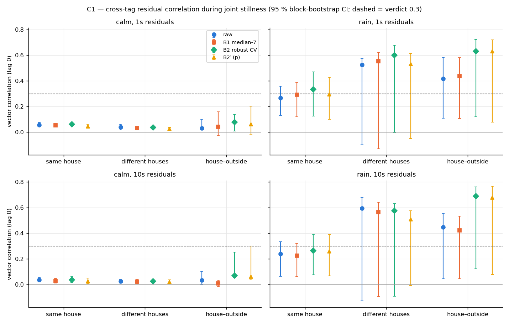
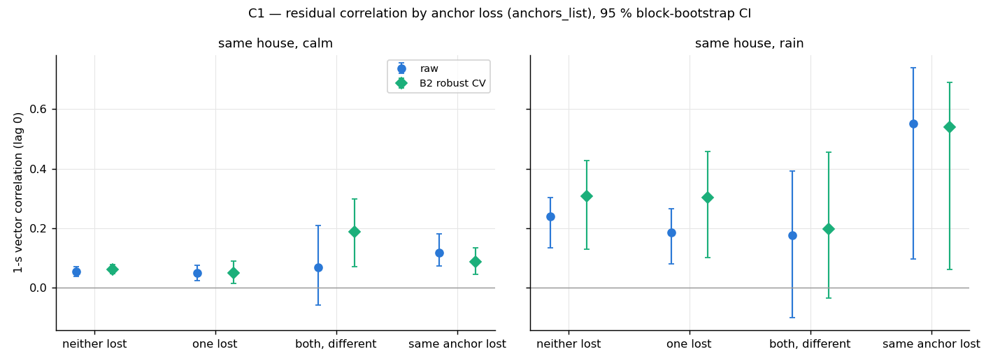
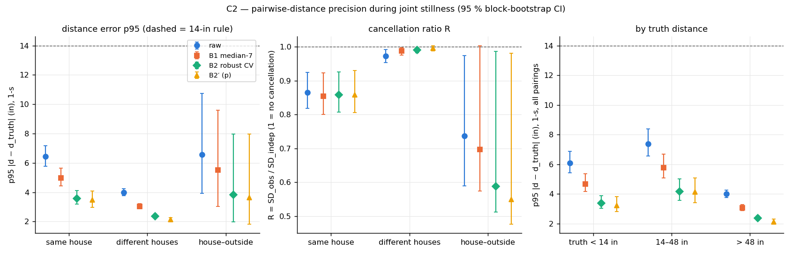
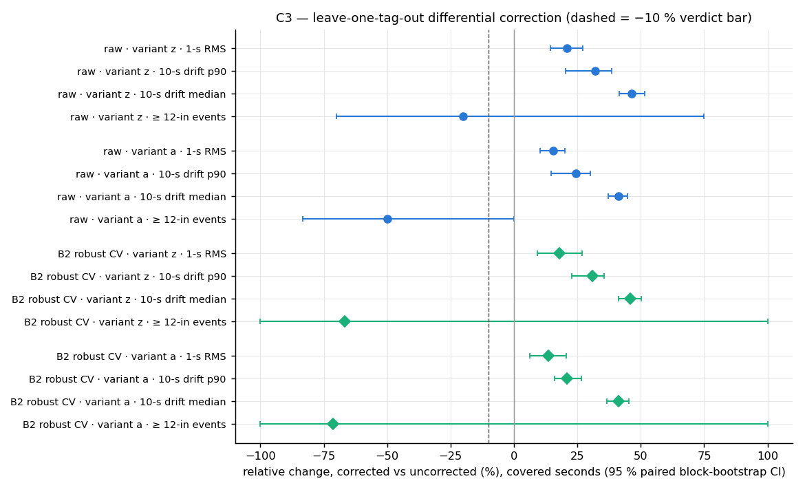
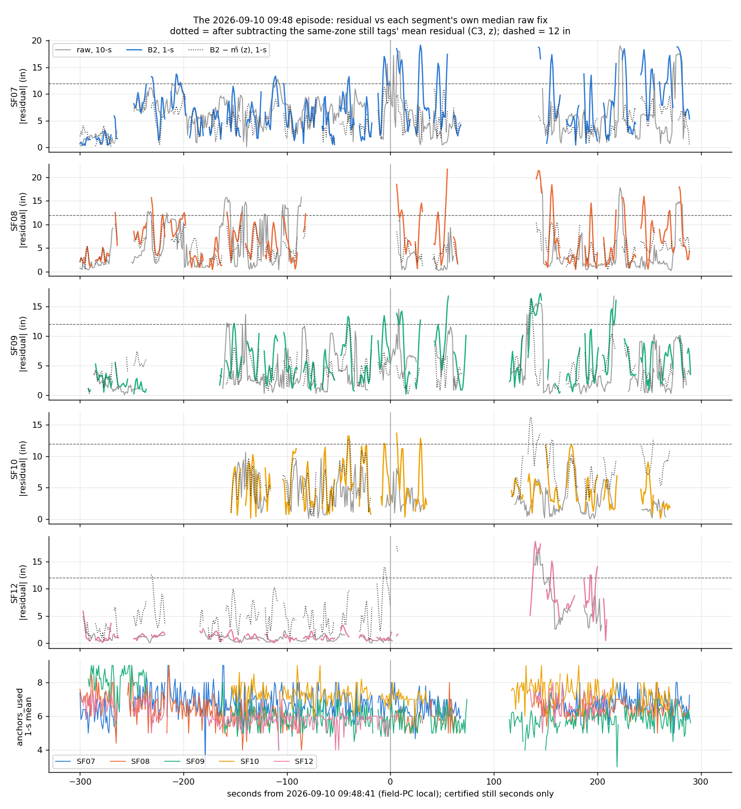

# WISER common-mode error across tags and pairwise-distance precision (2026c)

**Step C** of the A → B → C sequence approved by the user on 2026-10-03. **Plan (pre-registered, with amendments):** [`implementation_plan/2026-10-03-wiser-common-mode.md`](../../../../implementation_plan/2026-10-03-wiser-common-mode.md). **Driver:** `wiser/scripts/analyze_wiser_common_mode.py` (`--selftest`). **Config:** `wiser/configs/wiser_common_mode_2026c.json`.  
**Bulk run:** `D:\Field2026_analysis_out\2026c\wiser_common_mode_20261003_1124` (pointer `run_manifest_common_mode_2026c.json`). **Git:** b70f53e+dirty. **Inputs:** the failure audit's run `D:/Field2026_analysis_out/2026c/wiser_failure_audit_20261002_1511` (certified segments, truths, saved tracks raw/B1/B2/B2′) and the WISER fix caches (`anchors_list`); read-only, no SQLite, no IMU, no Kalman run.

All positions are in the unverified WISER inch frame; only distances and correlations are used. Joint stillness is almost all inside the two houses (often huddles), so the common mode between distant tags and in the open field is barely sampled; each segment's truth is its own median raw fix, so an offset constant over a whole segment is invisible.

## Verdict (pre-registered)

**Common mode: NOT MATERIAL.**

| criterion | B2 | raw |
|---|---|---|
| (1) pooled same-zone ρ_v, 10-s residuals, lag 0 (≥ 0.3, CI > 0) | 0.19 [0.06, 0.30] → fail | 0.17 [0.05, 0.26] → fail |
| (2) C3 variant z, 10-s drift p90 (≤ −10 %, CI < 0) | +30.9 % [+22.8, +35.5] → fail | +32.1 % [+20.3, +38.5] → fail |
| (2) C3 variant z, 1-s RMS (≤ −10 %, CI < 0) | +18.0 % [+9.2, +27.0] → fail | +20.8 % [+14.5, +27.2] → fail |
| both | no | no |

## Findings

- **The still error is mostly not shared.** Same-zone (in practice: same-house) B2 residuals correlate ρ_v = 0.04 [0.02, 0.06] in calm-dry periods and 0.27 [0.09, 0.39] in rain at 10 s (1 s: 0.06 | 0.33); tags in different houses 0.03 [0.01, 0.04] (calm). The shared part is stronger along the WISER x axis in rain (ρ_x 0.47 vs ρ_y 0.22, 1 s) — a frame-axis statement, not a physical direction.
- **Where it is shared, fewer / the same missing anchors are involved.** In rain, same-house 1-s raw correlation is 0.55 in the 6.5 % of seconds when both tags lost the same listed anchor (Δ vs neither lost 0.31 [-0.09, 0.46]; calm Δ 0.06 [0.02, 0.12]) and 0.33 when both used < 8 anchors (Δ 0.21 [0.07, 0.26]).
- **Shared ≥ 12-in excursions are rare and confined to one episode:** 33 of 281313 joint pair-seconds (0.012 %), 11 clusters, all on 2026-09-10 between 09:46:03 and 10:03:33 (rain day). Anchor 104 was lost by both tags in 42 % of their seconds vs 2.4 % of all joint seconds (enrichment 17.8) — a pointer to an anchor-side cause, not a correction.
- **Inter-animal distances of still animals are precise:** B2 1-s distance error p95 |ε| = 3.12 [2.88, 3.53] in (calm 2.68, rain 4.62; same house 3.58, different houses 2.38; raw 5.58). The shared error cancels only a little: R = 0.88 [0.82, 0.94] (calm 0.96, rain 0.81). The 14-in rule is unchanged; a tighter value for still animals is a proposal to the user.
- **Differential correction from other still tags hurts on average:** B2 1-s RMS +18.0 % [+9.2, +27.0] (calm +33.1 % [+30.1, +36.7], rain +1.9 % [-5.6, +16.1]), coverage 71 %. With a small shared share each reference adds its own independent error; the equal-noise model predicts × 1.28 in calm (observed × 1.33) and × 0.99 in rain (observed × 1.02); the correction only pays when ρ exceeds ≈ 1/(n_ref + 1) (0.42 calm, 0.28 rain). It does remove the shared episodes (≥ 12-in events 6 → 2).
- **09-10 09:48 episode:** B2 1-s RMS in the ± 5-min window, uncorrected → corrected (z): SF07 8.7 → 5.6, SF08 8.5 → 5.8, SF09 7.2 → 5.2, SF10 6.1 → 7.7, SF12 1.4 → 6.1 in — the displaced tags improve, the undisplaced ones get worse.

## Joint stillness

5218 pair overlaps ≥ 30 s, 91.3 pair-hours (certified still time of all tags: 96.1 tag-hours on the 1-s grid).

| zone pairing | calm overlaps | calm pair-h | rain overlaps | rain pair-h |
|---|---|---|---|---|
| same house | 1825 | 33.6 | 1194 | 22.3 |
| different houses | 2117 | 33.9 | 29 | 0.5 |
| house–outside | 22 | 0.5 | 19 | 0.3 |
| both outside | 4 | 0.1 | 8 | 0.1 |

Median truth distance per pairing: same house 9.8 in, different houses 203.9 in, house–outside 133.8 in, both outside 227.4 in.

## C1 — is the error shared?



Pooled vector correlation $\rho_v$ of the residuals (lag 0, overlap-centred) with 95 % block-bootstrap CIs; calm | rain.

| method | scale | same zone | same house | different houses | house–outside |
|---|---|---|---|---|---|
| raw | 1s | 0.06 [0.04, 0.07] \| 0.26 [0.13, 0.35] | 0.06 [0.04, 0.07] \| 0.27 [0.13, 0.36] | 0.04 [0.02, 0.06] \| 0.52 [-0.10, 0.57] | 0.03 [0.02, 0.10] \| 0.42 [0.11, 0.58] |
| raw | 10s | 0.04 [0.02, 0.06] \| 0.24 [0.07, 0.34] | 0.04 [0.02, 0.06] \| 0.24 [0.06, 0.34] | 0.03 [0.01, 0.04] \| 0.60 [-0.13, 0.68] | 0.03 [0.00, 0.10] \| 0.45 [0.05, 0.55] |
| B1 median-7 | 1s | 0.05 [0.04, 0.07] \| 0.29 [0.12, 0.38] | 0.05 [0.04, 0.07] \| 0.29 [0.12, 0.39] | 0.03 [0.02, 0.04] \| 0.55 [-0.13, 0.62] | 0.04 [-0.03, 0.16] \| 0.44 [0.11, 0.58] |
| B1 median-7 | 10s | 0.03 [0.01, 0.05] \| 0.23 [0.06, 0.32] | 0.03 [0.01, 0.05] \| 0.23 [0.06, 0.32] | 0.02 [0.01, 0.04] \| 0.56 [-0.09, 0.64] | 0.01 [-0.01, 0.03] \| 0.42 [0.05, 0.53] |
| B2 robust CV | 1s | 0.06 [0.05, 0.07] \| 0.33 [0.14, 0.46] | 0.06 [0.05, 0.08] \| 0.33 [0.12, 0.47] | 0.04 [0.02, 0.05] \| 0.60 [-0.00, 0.68] | 0.08 [0.01, 0.14] \| 0.63 [0.12, 0.72] |
| B2 robust CV | 10s | 0.04 [0.02, 0.06] \| 0.27 [0.09, 0.39] | 0.04 [0.02, 0.06] \| 0.27 [0.08, 0.39] | 0.03 [0.01, 0.04] \| 0.58 [-0.09, 0.63] | 0.07 [0.06, 0.25] \| 0.69 [0.12, 0.76] |
| B2′ (p) | 1s | 0.05 [0.03, 0.06] \| 0.29 [0.11, 0.42] | 0.05 [0.03, 0.06] \| 0.29 [0.10, 0.43] | 0.03 [0.01, 0.04] \| 0.53 [-0.05, 0.61] | 0.06 [-0.02, 0.20] \| 0.63 [0.08, 0.72] |
| B2′ (p) | 10s | 0.03 [0.01, 0.05] \| 0.26 [0.08, 0.39] | 0.03 [0.01, 0.05] \| 0.26 [0.07, 0.39] | 0.02 [0.01, 0.04] \| 0.51 [-0.01, 0.57] | 0.06 [0.04, 0.30] \| 0.68 [0.08, 0.77] |

Strata resting on fewer than 10 ten-minute blocks (their CIs are not reliable): different houses, rain: 0.4 pair-h in 3 blocks; house–outside, calm: 0.4 pair-h in 4 blocks; house–outside, rain: 0.2 pair-h in 4 blocks; both outside, calm: 0.1 pair-h in 2 blocks; both outside, rain: 0.1 pair-h in 5 blocks.

All periods pooled (calm + rain), same zone; per axis, day | night, lags and the truth-centred sensitivity:

| method | scale | ρ_v | ρ_x | ρ_y | day ρ_v | night ρ_v | lag −1 / +1 s ρ_v | lag −2 / +2 s ρ_v | truth-centred ρ_v | pair-h |
|---|---|---|---|---|---|---|---|---|---|---|
| raw | 1s | 0.19 [0.09, 0.26] | 0.33 [0.14, 0.42] | 0.11 [0.07, 0.16] | 0.19 [0.09, 0.27] | 0.16 [0.07, 0.27] | 0.01 / 0.02 | 0.00 / 0.00 | 0.19 [0.09, 0.27] | 45.3 |
| raw | 10s | 0.17 [0.05, 0.26] | 0.30 [0.05, 0.40] | 0.09 [0.04, 0.14] | 0.17 [0.04, 0.26] | 0.24 [0.04, 0.42] | 0.15 / 0.15 | 0.13 / 0.13 | 0.15 [0.04, 0.22] | 48.6 |
| B1 median-7 | 1s | 0.21 [0.08, 0.30] | 0.37 [0.13, 0.47] | 0.12 [0.06, 0.17] | 0.21 [0.07, 0.31] | 0.18 [0.05, 0.32] | 0.08 / 0.09 | 0.00 / 0.01 | 0.21 [0.08, 0.29] | 45.3 |
| B1 median-7 | 10s | 0.16 [0.05, 0.25] | 0.28 [0.05, 0.38] | 0.09 [0.04, 0.13] | 0.16 [0.03, 0.25] | 0.22 [0.02, 0.39] | 0.15 / 0.15 | 0.13 / 0.12 | 0.14 [0.04, 0.21] | 48.6 |
| B2 robust CV | 1s | 0.23 [0.09, 0.36] | 0.36 [0.10, 0.52] | 0.15 [0.08, 0.22] | 0.24 [0.08, 0.36] | 0.20 [0.07, 0.35] | 0.19 / 0.20 | 0.11 / 0.12 | 0.22 [0.08, 0.32] | 45.3 |
| B2 robust CV | 10s | 0.19 [0.06, 0.30] | 0.31 [0.07, 0.47] | 0.12 [0.05, 0.18] | 0.18 [0.05, 0.30] | 0.22 [0.03, 0.39] | 0.18 / 0.18 | 0.16 / 0.16 | 0.18 [0.06, 0.27] | 48.6 |
| B2′ (p) | 1s | 0.21 [0.07, 0.33] | 0.32 [0.08, 0.48] | 0.14 [0.06, 0.20] | 0.21 [0.06, 0.33] | 0.19 [0.05, 0.32] | 0.18 / 0.19 | 0.13 / 0.14 | 0.20 [0.06, 0.30] | 45.3 |
| B2′ (p) | 10s | 0.18 [0.05, 0.30] | 0.30 [0.06, 0.46] | 0.11 [0.04, 0.18] | 0.18 [0.04, 0.30] | 0.20 [0.03, 0.36] | 0.17 / 0.17 | 0.16 / 0.15 | 0.19 [0.04, 0.28] | 48.6 |

Per-overlap ρ_v (B2, 10-s, same zone, 3031 overlaps): median 0.11, IQR -0.13–0.34; share > 0.3: 29 %.

### Anchor sets (anchors_list)



1-s ρ_v (lag 0, overlap-centred) by anchor-loss category; difference vs "neither lost" with a paired CI. Same house, calm | rain.

| method | category | share of seconds (calm \| rain) | ρ_v calm | ρ_v rain | Δ vs neither, calm | Δ vs neither, rain |
|---|---|---|---|---|---|---|
| raw | anchors_list: neither lost | 93.8 % \| 84.3 % | 0.05 [0.04, 0.07] | 0.24 [0.13, 0.30] |  |  |
| raw | anchors_list: one lost | 4.9 % \| 9.0 % | 0.05 [0.02, 0.08] | 0.18 [0.08, 0.27] | -0.00 [-0.03, 0.02] | -0.05 [-0.11, -0.01] |
| raw | anchors_list: both lost different | 0.1 % \| 0.2 % | 0.07 [-0.06, 0.21] | 0.18 [-0.10, 0.39] | 0.01 [-0.11, 0.15] | -0.06 [-0.28, 0.11] |
| raw | anchors_list: shared lost | 1.2 % \| 6.5 % | 0.12 [0.07, 0.18] | 0.55 [0.10, 0.74] | 0.06 [0.02, 0.12] | 0.31 [-0.09, 0.46] |
| raw | anchors_used: neither low | 63.1 % \| 31.5 % | 0.06 [0.05, 0.07] | 0.13 [0.09, 0.17] |  |  |
| raw | anchors_used: one low | 27.9 % \| 36.9 % | 0.03 [0.02, 0.05] | 0.15 [0.08, 0.23] | -0.02 [-0.04, -0.01] | 0.02 [-0.03, 0.07] |
| raw | anchors_used: both low | 9.0 % \| 31.6 % | 0.09 [0.05, 0.14] | 0.33 [0.18, 0.41] | 0.03 [-0.00, 0.08] | 0.21 [0.07, 0.26] |
| B2 robust CV | anchors_list: neither lost | 93.8 % \| 84.3 % | 0.06 [0.05, 0.08] | 0.31 [0.13, 0.43] |  |  |
| B2 robust CV | anchors_list: one lost | 4.9 % \| 9.0 % | 0.05 [0.01, 0.09] | 0.30 [0.10, 0.46] | -0.01 [-0.05, 0.03] | -0.00 [-0.08, 0.06] |
| B2 robust CV | anchors_list: both lost different | 0.1 % \| 0.2 % | 0.19 [0.07, 0.30] | 0.20 [-0.03, 0.46] | 0.13 [0.01, 0.24] | -0.11 [-0.23, 0.09] |
| B2 robust CV | anchors_list: shared lost | 1.2 % \| 6.5 % | 0.09 [0.04, 0.13] | 0.54 [0.06, 0.69] | 0.03 [-0.02, 0.07] | 0.23 [-0.11, 0.31] |
| B2 robust CV | anchors_used: neither low | 63.1 % \| 31.5 % | 0.07 [0.06, 0.09] | 0.15 [0.12, 0.20] |  |  |
| B2 robust CV | anchors_used: one low | 27.9 % \| 36.9 % | 0.05 [0.03, 0.07] | 0.17 [0.10, 0.26] | -0.02 [-0.04, -0.01] | 0.02 [-0.04, 0.08] |
| B2 robust CV | anchors_used: both low | 9.0 % \| 31.6 % | 0.05 [0.03, 0.08] | 0.44 [0.13, 0.55] | -0.02 [-0.04, 0.00] | 0.28 [-0.01, 0.37] |

Per anchor (raw, all pairings and periods): seconds in which both tags lost that anchor, their 1-s ρ_v, and how often both 10-s residuals were ≥ 12 in then.

| anchor | shared-lost seconds | share | 1-s ρ_v | both ≥ 12 in (10-s) |
|---|---|---|---|---|
| 1 | 931 | 0.35 % | 0.09 [0.05, 0.15] | 0.0 % |
| 2 | 0 | 0.00 % | – [–, –] | – |
| 5 | 41 | 0.02 % | 0.38 [0.09, 0.70] | 0.0 % |
| 6 | 72 | 0.03 % | 0.15 [-0.10, 0.39] | 0.0 % |
| 12 | 1458 | 0.55 % | 0.14 [0.06, 0.24] | 0.0 % |
| 15 | 25 | 0.01 % | 0.23 [0.09, 0.51] | 0.0 % |
| 19 | 398 | 0.15 % | 0.17 [0.08, 0.27] | 0.0 % |
| 102 | 92 | 0.03 % | 0.30 [0.14, 0.51] | 0.0 % |
| 104 | 5959 | 2.25 % | 0.41 [0.07, 0.63] | 0.4 % |

### Shared excursions

33 of 281313 valid joint pair-seconds have both raw 10-s residuals ≥ 12 in; 12 events in 11 clusters. Largest clusters (raw 10-s; size = the larger of the two tags' smaller residual):

| start (local) | dur s | tags | pairings | size in | anchors_used mean | same anchor lost (share of seconds) | top shared-lost anchors |
|---|---|---|---|---|---|---|---|
| 2026-09-10 09:52:22 | 4 | SF07,SF08 | same house | 17.8 | 7.1 | 50 % | 104 50%; 12 25% |
| 2026-09-10 09:51:00 | 9 | SF08,SF09,SF12 | house outside | 15.5 | 6.3 | 50 % | 104 50% |
| 2026-09-10 09:53:17 | 7 | SF07,SF08 | same house | 14.9 | 6.9 | 71 % | 104 71% |
| 2026-09-10 09:48:49 | 1 | SF07,SF09 | same house | 14.6 | 6.5 | 0 % | – |
| 2026-09-10 09:46:21 | 1 | SF08,SF09 | same house | 13.6 | 6.2 | 0 % | – |
| 2026-09-10 09:56:00 | 3 | SF07,SF09 | same house | 13.3 | 7.0 | 33 % | 104 33% |
| 2026-09-10 09:46:03 | 1 | SF08,SF09 | same house | 12.2 | 5.0 | 0 % | – |
| 2026-09-10 09:59:38 | 1 | SF07,SF10 | same house | 12.2 | 7.0 | 0 % | – |
| 2026-09-10 10:03:33 | 1 | SF07,SF10 | same house | 12.1 | 7.5 | 0 % | – |
| 2026-09-10 09:46:05 | 1 | SF08,SF09 | same house | 12.1 | 5.5 | 0 % | – |
| 2026-09-10 09:54:10 | 1 | SF07,SF09 | same house | 12.0 | 6.5 | 0 % | – |

Anchor enrichment in the top clusters (share of event pair-seconds where both tags lost the anchor ÷ the same share over all joint pair-seconds):

| anchor | top clusters | all joint | enrichment | either tag lost: top / all |
|---|---|---|---|---|
| 1 | 0.0 % | 0.5 % | 0.0 | 0.0 % / 1.6 % |
| 2 | 0.0 % | 0.0 % | 0.0 | 0.0 % / 0.3 % |
| 5 | 0.0 % | 0.0 % | 0.0 | 6.1 % / 2.0 % |
| 6 | 0.0 % | 0.1 % | 0.0 | 0.0 % / 0.6 % |
| 12 | 3.0 % | 0.7 % | 4.4 | 3.0 % / 2.4 % |
| 15 | 0.0 % | 0.0 % | 0.0 | 0.0 % / 0.7 % |
| 19 | 0.0 % | 0.2 % | 0.0 | 0.0 % / 1.4 % |
| 102 | 0.0 % | 0.1 % | 0.0 | 0.0 % / 1.0 % |
| 104 | 42.4 % | 2.4 % | 17.8 | 54.5 % / 6.3 % |

## C2 — pairwise-distance precision



1-s distances, all periods; error $\varepsilon = d - d^{\text{truth}}$ (in). SD, p95 and R with 95 % block-bootstrap CIs.

| method | pairing | pair-h | mean ε | SD ε | p95 \|ε\| | p99 \|ε\| | SD_indep | R |
|---|---|---|---|---|---|---|---|---|
| raw | all pairings | 73.5 | 0.42 | 2.95 [2.71, 3.22] | 5.58 [5.12, 6.18] | 10.68 | 3.32 | 0.89 [0.84, 0.94] |
| raw | same house | 45.1 | 0.65 | 3.30 [2.99, 3.61] | 6.43 [5.78, 7.18] | 12.33 | 3.81 | 0.86 [0.82, 0.92] |
| raw | different houses | 27.6 | 0.05 | 2.17 [2.01, 2.34] | 3.98 [3.78, 4.22] | 6.83 | 2.23 | 0.97 [0.95, 0.99] |
| raw | house–outside | 0.6 | 0.23 | 3.31 [2.14, 4.99] | 6.58 [3.93, 10.73] | 12.62 | 4.49 | 0.74 [0.59, 0.97] |
| B1 median-7 | all pairings | 73.5 | 0.25 | 2.21 [2.01, 2.45] | 4.33 [3.93, 4.78] | 8.23 | 2.53 | 0.88 [0.82, 0.94] |
| B1 median-7 | same house | 45.1 | 0.39 | 2.51 [2.23, 2.79] | 4.97 [4.43, 5.62] | 9.48 | 2.94 | 0.85 [0.80, 0.92] |
| B1 median-7 | different houses | 27.6 | 0.03 | 1.55 [1.45, 1.69] | 3.03 [2.88, 3.23] | 5.12 | 1.57 | 0.99 [0.98, 1.00] |
| B1 median-7 | house–outside | 0.6 | 0.18 | 2.68 [1.64, 4.33] | 5.53 [3.03, 9.58] | 10.08 | 3.84 | 0.70 [0.57, 1.00] |
| B2 robust CV | all pairings | 73.5 | 0.13 | 1.61 [1.44, 1.82] | 3.12 [2.88, 3.53] | 5.93 | 1.84 | 0.88 [0.82, 0.94] |
| B2 robust CV | same house | 45.1 | 0.16 | 1.81 [1.58, 2.07] | 3.58 [3.18, 4.13] | 6.78 | 2.11 | 0.86 [0.81, 0.93] |
| B2 robust CV | different houses | 27.6 | 0.08 | 1.18 [1.11, 1.26] | 2.38 [2.23, 2.53] | 3.98 | 1.20 | 0.99 [0.98, 1.00] |
| B2 robust CV | house–outside | 0.6 | -0.15 | 1.85 [1.01, 3.26] | 3.83 [1.98, 7.97] | 7.97 | 3.15 | 0.59 [0.51, 0.99] |
| B2′ (p) | all pairings | 73.5 | 0.11 | 1.53 [1.35, 1.76] | 2.98 [2.68, 3.43] | 5.97 | 1.76 | 0.87 [0.82, 0.94] |
| B2′ (p) | same house | 45.1 | 0.15 | 1.75 [1.49, 2.04] | 3.48 [2.98, 4.08] | 6.88 | 2.04 | 0.86 [0.81, 0.93] |
| B2′ (p) | different houses | 27.6 | 0.06 | 1.08 [0.99, 1.17] | 2.12 [1.98, 2.28] | 3.73 | 1.08 | 1.00 [0.99, 1.00] |
| B2′ (p) | house–outside | 0.6 | -0.26 | 1.80 [0.94, 3.19] | 3.62 [1.83, 7.98] | 8.03 | 3.28 | 0.55 [0.48, 0.98] |

By truth distance (all pairings), calm | rain, 1-s and 10-s — p95 |ε| (in) and R:

| method | band | pair-h | p95 1-s calm \| rain | p95 10-s calm \| rain | R 1-s (all) | mean ε 1-s |
|---|---|---|---|---|---|---|
| raw | all | 73.5 | 4.68 \| 8.12 | 1.98 \| 3.62 | 0.89 [0.84, 0.94] | 0.42 |
| raw | <14 | 33.6 | 5.08 \| 8.12 | 2.12 \| 3.73 | 0.87 [0.82, 0.94] | 0.80 |
| raw | 14-48 | 11.5 | 6.38 \| 8.18 | 2.73 \| 3.68 | 0.83 [0.78, 0.90] | 0.21 |
| raw | >48 | 28.3 | 3.93 \| 7.43 | 1.68 \| 2.93 | 0.97 [0.95, 0.99] | 0.06 |
| B1 median-7 | all | 73.5 | 3.58 \| 6.47 | 2.03 \| 3.73 | 0.88 [0.82, 0.94] | 0.25 |
| B1 median-7 | <14 | 33.6 | 3.88 \| 6.47 | 2.17 \| 3.78 | 0.85 [0.80, 0.93] | 0.49 |
| B1 median-7 | 14-48 | 11.5 | 4.97 \| 6.47 | 2.83 \| 3.78 | 0.84 [0.77, 0.92] | 0.09 |
| B1 median-7 | >48 | 28.3 | 3.03 \| 5.88 | 1.73 \| 2.83 | 0.99 [0.98, 1.00] | 0.04 |
| B2 robust CV | all | 73.5 | 2.68 \| 4.62 | 2.08 \| 3.93 | 0.88 [0.82, 0.94] | 0.13 |
| B2 robust CV | <14 | 33.6 | 2.83 \| 4.53 | 2.17 \| 3.83 | 0.85 [0.79, 0.93] | 0.24 |
| B2 robust CV | 14-48 | 11.5 | 3.48 \| 4.83 | 2.88 \| 4.33 | 0.85 [0.77, 0.94] | -0.10 |
| B2 robust CV | >48 | 28.3 | 2.33 \| 3.38 | 1.77 \| 2.43 | 0.99 [0.98, 1.00] | 0.08 |
| B2′ (p) | all | 73.5 | 2.43 \| 4.53 | 2.08 \| 4.12 | 0.87 [0.82, 0.94] | 0.11 |
| B2′ (p) | <14 | 33.6 | 2.62 \| 4.47 | 2.17 \| 4.08 | 0.85 [0.79, 0.94] | 0.22 |
| B2′ (p) | 14-48 | 11.5 | 3.33 \| 4.88 | 2.93 \| 4.53 | 0.85 [0.78, 0.94] | -0.09 |
| B2′ (p) | >48 | 28.3 | 2.08 \| 3.48 | 1.77 \| 2.98 | 1.00 [0.99, 1.00] | 0.05 |

**Distance precision statement (pre-registered):** during joint stillness the B2 1-s inter-animal distance error has p95 |ε| = 3.12 in [2.88, 3.53] (all pairings and periods; per pairing and band in the tables). A single 1-s B2 distance therefore resolves a difference of about 3.1 in at 95 %; comparing two independent 1-s distances needs about √2 × that. **No change to the 14-in rule is made here**; a tighter value is a proposal to the user, and it holds only for still animals mostly in the houses (moving-animal distances have no truth here).

## C3 — differential correction, leave-one-tag-out



Covered seconds only (corrected and uncorrected on the same seconds); relative change with paired 95 % block-bootstrap CI.

| input | variant | coverage | 1-s RMS unc → cor (in) | Δ 1-s RMS | 10-s drift p90 unc → cor | Δ drift p90 | Δ drift median | ≥ 12-in events unc → cor | Δ whole-segment RMS |
|---|---|---|---|---|---|---|---|---|---|
| raw | z | 71.5 % | 3.53 → 4.27 | +20.8 % [+14.5, +27.2] | 4.54 → 6.00 | +32.1 % [+20.3, +38.5] | +46.5 % [+41.5, +51.6] | 10 → 8 | +14.9 % [+10.7, +18.7] |
| raw | a | 84.8 % | 3.51 → 4.06 | +15.5 % [+10.3, +20.2] | 4.58 → 5.70 | +24.3 % [+14.8, +30.1] | +41.2 % [+37.1, +44.7] | 10 → 5 | +12.8 % [+8.7, +16.3] |
| B2 robust CV | z | 71.5 % | 1.91 → 2.25 | +18.0 % [+9.2, +27.0] | 3.65 → 4.78 | +30.9 % [+22.8, +35.5] | +45.9 % [+41.1, +50.3] | 6 → 2 | +13.1 % [+6.9, +18.6] |
| B2 robust CV | a | 84.8 % | 1.89 → 2.15 | +13.6 % [+6.1, +20.7] | 3.72 → 4.49 | +20.8 % [+15.9, +26.6] | +41.2 % [+36.6, +45.3] | 7 → 2 | +11.3 % [+5.3, +16.8] |

By stratum (variant z): Δ 1-s RMS and Δ 10-s drift p90, coverage.

| input | stratum | coverage | Δ 1-s RMS | Δ drift p90 |
|---|---|---|---|---|
| raw | calm / all / all | 68.7 % | +32.5 % [+30.8, +34.3] | +39.6 % [+31.9, +44.6] |
| raw | rain / all / all | 80.4 % | +5.5 % [-0.8, +16.3] | +0.7 % [-14.2, +25.1] |
| raw | all / day / all | 76.2 % | +20.3 % [+13.8, +27.4] | +32.7 % [+20.7, +39.4] |
| raw | all / night / all | 46.2 % | +26.2 % [+16.6, +33.6] | +23.7 % [-6.3, +48.0] |
| raw | all / all / house | 72.2 % | +20.6 % [+14.1, +26.8] | +31.7 % [+19.3, +37.7] |
| raw | all / all / outside | 31.3 % | +39.0 % [+16.6, +60.3] | +179.4 % [-27.8, +342.0] |
| B2 robust CV | calm / all / all | 68.7 % | +33.1 % [+30.1, +36.7] | +31.9 % [+26.6, +38.8] |
| B2 robust CV | rain / all / all | 80.4 % | +1.9 % [-5.6, +16.1] | +5.6 % [-10.1, +22.9] |
| B2 robust CV | all / day / all | 76.2 % | +17.6 % [+9.4, +27.5] | +32.3 % [+24.9, +38.5] |
| B2 robust CV | all / night / all | 46.2 % | +22.9 % [+12.8, +32.8] | +18.1 % [-2.9, +36.4] |
| B2 robust CV | all / all / house | 72.2 % | +17.9 % [+9.1, +26.8] | +31.3 % [+22.7, +35.4] |
| B2 robust CV | all / all / outside | 31.3 % | +34.0 % [+16.0, +47.5] | +45.0 % [-13.5, +308.7] |

**Analytic check (added in this step, not pre-registered).** If $\mathbf e_k = \mathbf m + \mathbf n_k$ with a shared share ρ and independent errors of equal variance, subtracting the mean of $n$ references gives $\mathrm{Var}(\mathbf v)/\mathrm{Var}(\mathbf e) = (1-\rho)(1+1/n)$, so the correction helps only when ρ > 1/(n + 1). ρ = the truth-centred 1-s ρ_v of the matching pairing (same zone for z, all for a); n = the mean number of references over covered seconds.

| input | variant | set | ρ (1 s) | mean refs | break-even ρ | predicted RMS ratio | observed |
|---|---|---|---|---|---|---|---|
| B2 robust CV | a | all | 0.18 | 2.35 | 0.30 | 1.08 | 1.14 |
| B2 robust CV | a | calm | 0.04 | 2.30 | 0.30 | 1.18 | 1.23 |
| B2 robust CV | a | rain | 0.31 | 2.54 | 0.28 | 0.98 | 1.01 |
| B2 robust CV | z | all | 0.22 | 1.67 | 0.37 | 1.12 | 1.18 |
| B2 robust CV | z | calm | 0.05 | 1.36 | 0.42 | 1.28 | 1.33 |
| B2 robust CV | z | rain | 0.29 | 2.54 | 0.28 | 0.99 | 1.02 |
| raw | a | all | 0.15 | 2.35 | 0.30 | 1.10 | 1.15 |
| raw | a | calm | 0.05 | 2.30 | 0.30 | 1.17 | 1.22 |
| raw | a | rain | 0.28 | 2.54 | 0.28 | 1.00 | 1.05 |
| raw | z | all | 0.19 | 1.67 | 0.37 | 1.14 | 1.21 |
| raw | z | calm | 0.06 | 1.36 | 0.42 | 1.28 | 1.33 |
| raw | z | rain | 0.27 | 2.54 | 0.28 | 1.01 | 1.05 |

## The 2026-09-10 09:48 cluster



Certified still seconds within ± 5 min of 2026-09-10 09:48:41 (residual vs each segment's own truth):

| tag | certified s | max raw 10-s (in) at | max B2 10-s | anchors_used mean / min | most-lost anchors | B2 z: coverage, 1-s RMS \|e\| → \|e − m̂\| (max) | raw z: 1-s RMS \|e\| → \|e − m̂\| |
|---|---|---|---|---|---|---|---|
| SF07 | 504 | 19.0 at 09:52:23 | 17.5 | 6.7 / 3.0 | 104 22%; 15 2%; 102 1% | 97 %, 8.7 → 5.6 (22.1 → 11.2) | 12.1 → 9.7 |
| SF08 | 418 | 18.0 at 09:51:06 | 20.2 | 6.3 / 4.0 | 104 20%; 102 1%; 2 1% | 98 %, 8.5 → 5.8 (21.7 → 16.7) | 11.8 → 9.8 |
| SF09 | 459 | 16.7 at 09:52:17 | 15.2 | 6.1 / 3.0 | 104 21%; 2 1%; 6 1% | 93 %, 7.2 → 5.2 (19.8 → 16.2) | 10.2 → 8.6 |
| SF10 | 310 | 10.6 at 09:46:21 | 10.7 | 7.3 / 5.8 | 104 23%; 5 1%; 6 1% | 84 %, 6.1 → 7.7 (15.5 → 16.2) | 9.2 → 9.8 |
| SF12 | 331 | 17.5 at 09:51:04 | 17.8 | 6.1 / 4.0 | 1 5%; 104 5%; 19 5% | 77 %, 1.4 → 6.1 (5.9 → 17.9) | 2.3 → 9.5 |

Shared-excursion clusters in this window:

| start | dur s | tags | size in | top shared-lost anchors |
|---|---|---|---|---|
| 2026-09-10 09:52:22 | 4 | SF07,SF08 | 17.8 | 104 50%; 12 25% |
| 2026-09-10 09:51:00 | 9 | SF08,SF09,SF12 | 15.5 | 104 50% |
| 2026-09-10 09:53:17 | 7 | SF07,SF08 | 14.9 | 104 71% |
| 2026-09-10 09:48:49 | 1 | SF07,SF09 | 14.6 | – |
| 2026-09-10 09:46:21 | 1 | SF08,SF09 | 13.6 | – |
| 2026-09-10 09:46:03 | 1 | SF08,SF09 | 12.2 | – |
| 2026-09-10 09:46:05 | 1 | SF08,SF09 | 12.1 | – |

## Reproduction

Segments re-read: 4160; fix-count mismatches vs the audit: 0; max |recomputed − audit truth| 0.0000 in (float32 storage of the tracks). Per-tag still RMS on the 1-s grid vs the audit's per-fix RMS (they differ by construction; the plan expects the 1-s value ≤ the per-fix one): raw: all ≤; B2: NOT all ≤ (see the table and the note below); with each second weighted by its fix count: all ≤.

| tag | set | 1-s RMS raw | per-fix RMS raw | 1-s RMS B2 | 1-s RMS B2, fix-weighted | per-fix RMS B2 |
|---|---|---|---|---|---|---|
| SF07 | calm | 3.26 | 5.88 | 1.56 | 1.52 | 1.55 |
| SF07 | rain | 5.06 | 8.28 | 3.04 | 3.01 | 3.03 |
| SF08 | calm | 3.23 | 5.59 | 1.64 | 1.59 | 1.62 |
| SF08 | rain | 4.32 | 7.15 | 2.42 | 2.39 | 2.42 |
| SF09 | calm | 3.25 | 5.64 | 1.69 | 1.63 | 1.66 |
| SF09 | rain | 5.05 | 8.15 | 2.88 | 2.81 | 2.83 |
| SF10 | calm | 3.05 | 5.45 | 1.62 | 1.59 | 1.62 |
| SF10 | rain | 5.02 | 8.29 | 2.70 | 2.66 | 2.68 |
| SF12 | calm | 2.99 | 5.26 | 1.56 | 1.52 | 1.55 |
| SF12 | rain | 4.13 | 6.82 | 2.29 | 2.26 | 2.28 |
| pooled | calm | 3.16 | 5.57 | 1.62 | 1.57 | 1.60 |
| pooled | rain | 4.72 | 7.74 | 2.67 | 2.63 | 2.65 |

Note: the 1-s median cannot reduce B2's error much (B2 is already smooth at 1 s), so its 1-s and per-fix values differ mainly by weighting: every second counts once on the 1-s grid, while the per-fix RMS weights a second by its number of fixes, and seconds with few fixes (dropouts) carry larger errors. Weighted by fix count, the 1-s B2 value is below the per-fix one; the raw 1-s value is below the per-fix one either way (the median removes jitter).

## Caveats

- Joint stillness is almost entirely inside the two houses, often in huddles: the common mode between distant tags and in the open field is barely sampled (see the coverage table), and C3's references are almost always house-mates.
- The truth is each segment's own median raw fix: a common-mode offset constant over a segment is absorbed and invisible; overlap-centring additionally removes offsets constant over a pair overlap (the truth-centred sensitivity keeps them).
- Rain is three weather episodes (two nights, one day); 10-min blocks within them are not independent weather samples.
- anchors_list lists the anchors reported for a fix, a superset of those used; "lost" means not listed (certainly not used), so anchors listed but dropped by the solver are not seen.
- Distances are in the unverified WISER inch frame (frame-invariant); nothing here says where the houses are physically.


## Definitions

All positions are WISER **inches in the unverified offset frame**; only distances and correlations are reported, which
do not depend on the frame's origin or orientation. Times are field-PC local (EDT). Symbols: $i, j$ = tags (one per
animal: SF07, SF08, SF09, SF10, SF12); $\sigma_i$ = a certified still segment of tag $i$ (the failure audit's primary
segments, ≥ 30 s, 1 s trimmed at both ends; S50 or gate-v2 strict stillness of the head IMU, which carries the tag);
$[t^0_{\sigma}, t^1_{\sigma})$ its trimmed span; $\mathbf z_k$ = raw fix $k$ at IMU-aligned time $t_k$ ($t_k$ = WISER
time − the animal's lag $\tau^*$ of 0.10–0.20 s); $\hat{\mathbf p}_k$ = a method's position at fix $k$ (raw: $\mathbf z_k$;
B1, B2, B2′ as in the failure audit, at the fix times, saved in its `tracks/`).

### Truth of a still segment ($\mathbf c_\sigma$)
$$ \mathbf c_\sigma = \big(\operatorname{med}_{k\in\sigma} z_{k,x},\ \operatorname{med}_{k\in\sigma} z_{k,y}\big) $$
**Text:** the failure audit's truth, unchanged: the head is still, so the tag is one point; its estimate is the
coordinate-wise median of the segment's raw fixes. An error that is constant over the whole segment is absorbed into it and
is invisible here (every number below is a lower bound of the error, and of the common mode).

### 1-s and 10-s residuals ($\mathbf e^{(1)}_i(g)$, $\mathbf e^{(10)}_i(g)$)
$$ \tilde{\mathbf p}^{(L)}_i(g) = \operatorname{med}_{k:\ t_k\in[g-L/2,\ g+L/2)} \hat{\mathbf p}_k ,\qquad
   \mathbf e^{(L)}_i(g) = \tilde{\mathbf p}^{(L)}_i(g) - \mathbf c_{\sigma_i} $$
coordinate-wise medians on the integer seconds $g$ of the IMU-aligned clock, $L$ = 1 s (≥ 2 fixes) or 10 s (≥ 10 fixes, as
the audit's 10-s drift), with the window wholly inside the trimmed segment; otherwise undefined. **Text:** where WISER puts a
still head, relative to where it is, at the 1-s and 10-s time scales (in). 0 = perfect.

### Joint stillness (pair overlap $o$)
$$ o = [\max(t^0_{\sigma_i}, t^0_{\sigma_j}),\ \min(t^1_{\sigma_i}, t^1_{\sigma_j})),\qquad |o| \ge 30\ \text{s} $$
for every pair of tags and every pair of their segments. Pair-seconds = the grid seconds $g$ where both residuals are
defined (their windows then lie inside $o$). **Text:** both heads certified still at the same time; the ≥ 30-s rule is the
plan's (same as the primary segment rule).

### Zone and zone pairing
Zone of a segment = `house_1` / `house_2` when its truth lies inside the house ROI grown by 14 in, else `outside` (the audit's
`zone_detail`). Pairing of an overlap: **same house** (both in the same house), **different houses**, **house–outside**,
**both outside**. **Same zone** = same house or both outside (identical zone label); used by the verdict and by C3 variant z.

### Cross-tag residual correlation (C1; $\rho_x$, $\rho_y$, $\rho_v$)
Centred residuals $\mathbf{\bar e}_i(g) = \mathbf e_i(g) - \overline{\mathbf e_i}^{\,o}$, with $\overline{\mathbf e_i}^{\,o}$ =
the mean of $\mathbf e_i$ over the overlap's pair-seconds (both defined). Pooled sums over the pair-seconds $g$ of a stratum
(all its overlaps), at lag $\ell$ (tag $j$ taken at $g+\ell$, same overlap):
$$ S_{ab}^{(c)} = \sum_g \bar e_{a,c}(g)\,\bar e_{b,c}(g+\ell_{ab}),\qquad
   \rho_c = \frac{S_{ij}^{(c)}}{\sqrt{S_{ii}^{(c)} S_{jj}^{(c)}}}\ (c = x, y),\qquad
   \rho_v = \frac{\operatorname{tr} \mathbf S_{ij}}{\sqrt{\operatorname{tr}\mathbf S_{ii}\,\operatorname{tr}\mathbf S_{jj}}}
          = \frac{S^{(x)}_{ij}+S^{(y)}_{ij}}{\sqrt{(S^{(x)}_{ii}+S^{(y)}_{ii})(S^{(x)}_{jj}+S^{(y)}_{jj})}} $$
($\ell_{ij} = \ell$, $\ell_{ii} = \ell_{jj} = 0$ but restricted to the same seconds). **Text:** Pearson correlation of the two
tags' simultaneous errors per axis, and its vector form = the **common-mode share of variance**: if
$\mathbf e_i = \mathbf m + \mathbf n_i$ with a shared term $\mathbf m$ and independent $\mathbf n_i$ of equal variance,
$\rho_v = \operatorname{tr}\Sigma_m / (\operatorname{tr}\Sigma_m + \operatorname{tr}\Sigma_n)$. Range [−1, 1]; 0 = independent
errors, 1 = identical errors. Lags 0, ±1, ±2 s; scales 1 s and 10 s. Per-overlap values use the same formula on one overlap.
**Sensitivity (truth-centred):** the same with $\mathbf e$ instead of $\bar{\mathbf e}$ (second moments about the truth, so an
offset shared over a whole overlap counts as common mode); reported, not used by the verdict.

### Anchor loss (anchors_list)
Per fix, the cache's `anchors_list` = the anchors listed for the fix (a superset of the anchors used: anchors_used ≤ list
length in every fix; which listed anchors were used is not stored). Reference set of a segment
$\mathcal R_\sigma$ = anchors listed in ≥ 50 % of its fixes. An anchor $a\in\mathcal R_\sigma$ is **lost** in second $g$ when it is
listed in < 50 % of the fixes in $[g-0.5, g+0.5)$: $\mathcal L_i(g)$. Per pair-second: **neither lost**
($\mathcal L_i = \mathcal L_j = \varnothing$), **one lost** (exactly one non-empty), **both lost, different anchors**
(both non-empty, disjoint), **same anchor lost** ($\mathcal L_i\cap\mathcal L_j \ne \varnothing$). The 1-s, lag-0, overlap-centred
$\rho_v$ is computed within each category (sums restricted to its seconds, centring unchanged) and compared with "neither
lost" (difference with a paired bootstrap CI). Secondary: anchors_used, low = 1-s mean < 8; both low / one / neither.
**Text:** does the error become shared when both tags lose the same anchor? A pointer to an anchor-side cause, not a correction.

### Shared excursion and cluster
Pair-seconds with $\lVert\mathbf e^{(10)}_i\rVert \ge 12$ in **and** $\lVert\mathbf e^{(10)}_j\rVert \ge 12$ in (raw; 12 in = the
audit's crazy-drift size); a maximal run of consecutive such seconds within one overlap = an **event**, size
$=\max_g \min(\lVert\mathbf e^{(10)}_i\rVert, \lVert\mathbf e^{(10)}_j\rVert)$; events of all pairs that overlap in time (gap ≤ 1 s) = a
**cluster** (its tags = the union). Anchor enrichment = share of the top-20 clusters' event pair-seconds with anchor $a$ in
$\mathcal L_i\cap\mathcal L_j$ ÷ the same share over all valid joint pair-seconds. **Text:** moments when two or more still tags are
displaced ≥ 1 ft together, and which anchors were missing then.

### Pairwise-distance error (C2; $\varepsilon_{ij}$, SD, p95, p99, $R$)
$$ d_{ij}(g) = \lVert \tilde{\mathbf p}_i(g) - \tilde{\mathbf p}_j(g)\rVert,\quad d^{\text{truth}}_{ij} = \lVert\mathbf c_{\sigma_i}-\mathbf c_{\sigma_j}\rVert,\quad
   \varepsilon_{ij}(g) = d_{ij}(g) - d^{\text{truth}}_{ij} $$
$$ \mathrm{SD}_{\text{obs}} = \operatorname{SD}(\varepsilon),\qquad
   \mathrm{SD}^2_{\text{indep}} = \operatorname{Var}(\mathbf e_i\cdot\mathbf u) + \operatorname{Var}(\mathbf e_j\cdot\mathbf u),\qquad
   \mathbf u = \frac{\mathbf c_{\sigma_i}-\mathbf c_{\sigma_j}}{d^{\text{truth}}_{ij}},\qquad R = \mathrm{SD}_{\text{obs}}/\mathrm{SD}_{\text{indep}} $$
variances and SD pooled over the stratum's pair-seconds (about the stratum mean); p95 / p99 = quantiles of $|\varepsilon|$
(0.05-in histogram for the bootstrap; exact values also tabulated); mean $\varepsilon$ = bias. **Text:** how wrong an
inter-animal distance is while both animals are still (in). Since $\varepsilon \approx (\mathbf e_i - \mathbf e_j)\cdot\mathbf u$ for
$d^{\text{truth}} \gg$ the error, $R$ < 1 means the shared part of the two errors cancels in the distance, $R$ = 1 no
cancellation; for $d^{\text{truth}}$ < ~2 × the error the linearisation fails and $\varepsilon$ is biased upward (a distance
cannot be negative). Truth-distance bands: < 14 in, 14–48 in, > 48 in. **Resolvable distance difference** (stated, not adopted):
p95 $|\varepsilon|$ = the change in a single 1-s distance that exceeds its error 95 % of the time.

### Leave-one-tag-out differential correction (C3; $\hat{\mathbf m}_{-i}$)
$$ \hat{\mathbf m}_{-i}(g) = \frac{1}{|J_i(g)|}\sum_{j\in J_i(g)} \mathbf e^{(1)}_j(g),\qquad
   \mathbf v_i(g) = \mathbf e^{(1)}_i(g) - \hat{\mathbf m}_{-i}(g) $$
$J_i(g)$ = the other tags with a defined 1-s residual of the same method at $g$ (i.e. inside one of their certified segments);
variant **z**: only tags whose segment has the same zone label as $i$'s; variant **a**: any zone. Defined when
$|J_i(g)|\ge 1$ (**covered** seconds); coverage = covered seconds ÷ the target's certified seconds. Non-circular for the target:
$\hat{\mathbf m}_{-i}$ uses neither $i$'s fixes nor its truth. Inputs: raw-1-s and B2-1-s (the references use the same method).
**Metrics, on the covered seconds of each target segment, uncorrected $\mathbf e^{(1)}_i$ vs corrected $\mathbf v_i$ (same seconds):**
1-s RMS $=(\sum_g\lVert\cdot\rVert^2/N_{\text{cov}})^{1/2}$ pooled over segments; 10-s drift of a segment
$=\max_c \lVert\operatorname{med}\{\cdot(g): g\in[c-5, c+5)\}\rVert$ over 1-s centres $c$ with the window inside the segment's grid
and ≥ 5 covered seconds (coordinate-wise median), summarised by the median and p90 over segments; ≥ 12-in events = runs of
≥ 10 consecutive centres with that 10-s distance ≥ 12 in (the audit's crazy-drift rule on the 1-s series), counted per
covered hour. Secondary "whole-segment" versions use every certified second ($\mathbf v_i = \mathbf e_i$ where uncovered).
**Relative change** $=\theta_{\text{corrected}}/\theta_{\text{uncorrected}} - 1$; < 0 = the correction helps. **Text:** what
subtracting the simultaneous error of other still tags does to a tag's own still error.

### Expected C3 ratio (analytic check, added in this step)
$$ \frac{\mathrm{RMS}(\mathbf v)}{\mathrm{RMS}(\mathbf e)} \approx \sqrt{(1-\rho)\,(1 + 1/\bar n)},\qquad \text{break-even } \rho = \frac{1}{\bar n + 1} $$
under $\mathbf e_k = \mathbf m + \mathbf n_k$ (shared $\mathbf m$ of share $\rho$, independent $\mathbf n_k$ of equal variance);
$\rho$ = the truth-centred 1-s $\rho_v$ of the matching pairing, $\bar n$ = the mean number of references over covered seconds
(weighted by covered seconds). **Text:** each reference removes its share of the common mode but adds its own independent
error; the correction helps only when the shared share exceeds $1/(\bar n+1)$. A consistency check, not a criterion.

### Reproduction (1-s vs per-fix RMS)
1-s RMS $=(\sum_g\lVert\mathbf e^{(1)}(g)\rVert^2/N_g)^{1/2}$ over all certified grid seconds of a tag (each second weight 1);
fix-weighted: each second weighted by its fix count $n_1(g)$; per-fix RMS = the audit's $(\sum_k r_k^2/N)^{1/2}$ over the same
segments' fixes. **Text:** the plan's consistency check; the median of a second's fixes removes jitter, so the 1-s value should
not exceed the per-fix value.

### Block bootstrap (95 % CI)
Blocks = 10 min of clock time within a period (all pairs / tags in that window together, because simultaneous pairs share
tags and the common mode itself); the blocks holding a stratum's data are drawn with replacement 1000 times (seed
20261003 + section); every statistic is recomputed from the per-block sums (correlations, variances, RMS), per-block
0.05-in histograms (|ε| quantiles) or block-weighted lower quantiles over segments (drift median / p90); CI = 2.5–97.5 % of
the resampled values. Within a stratum the same resamples serve every method, scale, lag and category (paired comparisons);
C3's corrected and uncorrected values are computed on the same resample (paired relative change).

### Pre-registered verdict (plan)
**Material** if (1) the pooled same-zone $\rho_v$ of 10-s B2 residuals (lag 0, overlap-centred, all periods) is ≥ 0.3 with
its CI lower bound > 0, **and** (2) C3 variant z with B2 input reduces the target's 10-s drift p90 **or** its 1-s RMS by
≥ 10 % (relative change ≤ −10 % and CI upper bound < 0). **Material for raw only** when (1)–(2) hold for raw but not for B2;
otherwise **not material**. No change to the 14-in distance rule is made in this step.


## Rerun

```
python wiser/scripts/analyze_wiser_common_mode.py --cohort 2026c --workers 6
python wiser/scripts/analyze_wiser_common_mode.py --report-only <run_dir>
python wiser/scripts/analyze_wiser_common_mode.py --selftest
```
