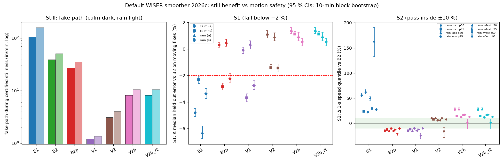
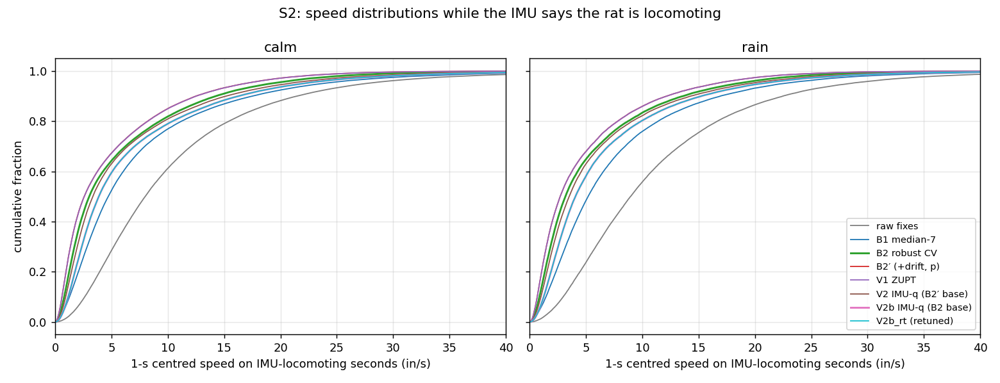
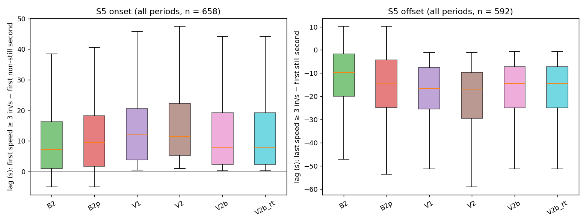

# Default WISER smoother for cohort 2026c, chosen by a pre-registered rule

**Step after the failure audit** — approved by the user 2026-10-02 ("do 1st first"). Plan [`implementation_plan/2026-10-02-wiser-default-smoother.md`](../../../../implementation_plan/2026-10-02-wiser-default-smoother.md) (written before any result; operational choices marked [op] there); driver `wiser/scripts/analyze_wiser_default_smoother.py` (`--selftest` ALL PASS); config `wiser/configs/wiser_default_smoother_2026c.json` (decision written into its `decision` block); bulk `D:\Field2026_analysis_out\2026c\wiser_default_smoother_20261002_1626`; inputs = the failure audit run `D:/Field2026_analysis_out/2026c/wiser_failure_audit_20261002_1511` (reused, not recomputed); git `530f413+dirty`. Measurement report: no behavioural claim; WISER inch frame unverified (only distances and speeds used).

## Executive summary

1. **Default: B2 (B2 robust CV)** — chosen by the pre-registered **no-survivor fallback** (no eligible method passed all of S1–S4; B2 fails only S3 — by 1 event (7 vs raw's 6 rain ≥ 12-in excursions; rate difference 0.04/still-h [-0.22, 0.35])). Fallback where the IMU QC fails: itself (position-only, needs no IMU). The same default results when S3 is judged by its CI (B2 is then the only survivor).
2. **Still benefit of B2:** calm-dry fake path 38.9 in/min (raw 268), rain 50.8; residual per-fix RMS 1.60 | 2.65 in (calm | rain); jumps 0 still / 0 motion.
3. **What the IMU methods offer and why they fail:** calm fake path V1 1.2, V2 3.1, V2b 8.2 in/min (circular: the IMU stillness also certifies the segments), but no candidate keeps the 1-s speed within ± 10 % of B2: B2′ -15 % / -12 %; V1 -15 % / -12 %; V2 +10 % / +8 %; V2b +28 % / +15 % (p50 / p95 on calm IMU-locomoting seconds; worst cases in the table).
4. **S1 (held-out moving fixes, vs B2):** B1 -6.3 % to -2.3 %; B2′ -2.9 % to +0.5 %; V1 -3.7 % to +0.4 %; V2 -1.4 % to +1.1 %; V2b +0.5 % to +1.3 % (B2′/V1 fail only on (s) with their delivered track p; with p + b they pass).
5. **S3 / S4:** rain excursions raw 6: B1 9, B2 7, B2′ 14, V1 5, V2 7, V2b 8; jumps: B1 36 still / 126 motion, V2 2 and V2b 3 motion jumps, all at B2-splice boundaries (in-filter forms: 0).
6. **Failed criteria:** B1 S1, S2, S3, S4; B2 S3; B2′ S1, S2, S3; V1 S1, S2; V2 S2, S3, S4; V2b S2, S3, S4; V2b_rt S2, S3, S4. Rain-specific choice: B2 (same).
7. **Sensitivity (never the decision):** S3 by CI → B2; V2b without the B2 splice (amendment 1) → B2; S1 with the p + b predictor → V1 (the fallback then ties B2, V1 at 1 failure each and takes the lowest fake path — trading V1's S2 failure for B2's S3 failure; a weakness of the fewest-failures fallback, not support for V1). V2b_rt retunes to V2b's own multipliers (0.01, 0.3, 10.0) (all at grid edges), so it is identical to V2b.
8. **Transitions (S5, reported only):** B2 starts moving a median 7.00 s after the first non-still IMU second (calm); V2b differs by 0.25 s at onsets and -0.75 s at offsets, V2 by 1.00 / -5.50 s.

## Decision table

Pooled primary ≥ 30-s certified segments for the still columns; S1/S2 worst case over calm/rain × schemes / subsets × quantiles. B2 is the S1/S2 reference (passes them by definition).

| method | eligible | calm fake path (in/min) [95 % CI] | rain fake path | S1 worst Δ moving | S1 | S2 worst speed Δ | S2 | S3 rain events (raw 6) | S3 | S4 jumps still / motion | S4 | S5 onset / offset Δ (s, calm) | outcome |
|---|---|---|---|---|---|---|---|---|---|---|---|---|---|
| B1 median-7 | yes | 107.0 [104.1, 109.6] | 158.4 | -6.3 % (rain, (a)) | **FAIL** | +161.2 % (rain wfast p50) | **FAIL** | 9 | **FAIL** | 36 / 126 | **FAIL** | -6.75 / 14.00 | eliminated |
| B2 robust CV | yes | 38.9 [38.2, 39.6] | 50.8 | ref | pass | ref | pass | 7 | **FAIL** | 0 / 0 | pass | ref | **DEFAULT** |
| B2′ (+drift, p) | yes | 27.1 [26.5, 27.6] | 35.6 | -2.9 % (calm, (s)) | **FAIL** | -21.7 % (rain wfast p50) | **FAIL** | 14 | **FAIL** | 0 / 0 | pass | 0.50 / -0.75 | eliminated |
| V1 ZUPT | yes | 1.2 [1.2, 1.2] | 1.4 | -3.7 % (calm, (s)) | **FAIL** | -25.4 % (rain wfast p50) | **FAIL** | 5 | pass | 0 / 0 | pass | 1.12 / -2.50 | eliminated |
| V2 IMU-q (B2′ base) | yes | 3.1 [3.0, 3.2] | 4.0 | -1.4 % (rain, (s)) | pass | -16.8 % (rain wfast p50) | **FAIL** | 7 | **FAIL** | 0 / 2 | **FAIL** | 1.00 / -5.50 | eliminated |
| V2b IMU-q (B2 base) | yes | 8.2 [8.0, 8.4] | 10.5 | +0.5 % (rain, (s)) | pass | +28.1 % (rain loco p50) | **FAIL** | 8 | **FAIL** | 0 / 3 | **FAIL** | 0.25 / -0.75 | eliminated |
| V2b_rt (retuned) | no | 8.2 [8.0, 8.4] | 10.5 | +0.5 % (rain, (s)) | pass | +28.1 % (rain loco p50) | **FAIL** | 8 | **FAIL** | 0 / 3 | **FAIL** | 0.25 / -0.75 | secondary (not eligible) |

**Rule outcome.** Survivors of S1–S4: none. No eligible method passed all four, so the pre-registered fallback took the eligible method(s) with the fewest failed criteria (B2, 1 failed each) and applied the fake-path choice. Calm-dry fake path among B2: B2 38.9 in/min; tied within 5 %: B2 → **B2**.

## 1. Inputs, reproduction and fallback

Periods, animals, exclusions and certified segments are the audit's (calm-dry days 09-05/07/08 08:00–18:00, nights 09-05…09-08 21:00–04:20; rain nights 09-03, 09-09 and day 09-10; SF07, SF08, SF09, SF10, SF12). The audit's saved tracks (every method at every fix, ± 10 min margins) and per-second IMU states are reused; V2b and V2b_rt are new Kalman runs on the same fixes; V1/V2 get the B2 fallback here (their audit form falls back to B2′ in-filter).

| check | result |
|---|---|
| V2 rebuilt from the saved in-window IMU states vs the audit's V2 (≥ 60 s from the window edges) | max 0.0293 in (V1 0.5977 in); whole window p99.9 0.1592 in (edges use margin states) |
| pilot tuning night reproduced (same code path as V2b_rt) | B2 median 4.0912 in (pilot 4.0911); V2 optimum [0.01, 0.3, 10.0] 3.9999 in (pilot [0.01, 0.3, 10.0] 3.9999) → OK |
| still metrics re-derived for a sample of 1780 segment × method rows (raw, B2, B2′, V2 audit form) vs the saved rows | max |Δ| RMS 0.0000 in, 10-s drift 0.0000 in, fake path 0.001 in/min, events 0, jumps 0 |
| segment fix counts / still-fix alignment | 0 mismatching segments; 0 unmatched still fixes of 1,636,133; max time offset 0.00 ms |
| night motion-side jumps in IMU-ok seconds vs the audit | raw 24595 (audit 24595); B1 81 (audit 81); B2p 0 (audit 0) |
| onset / offset events on the nights vs the audit | onset 217 (audit 217); offset 182 (audit 182) |
| WISER fix caches = the tracks' fixes | all match |
| B2 splice of V2b (amendment 1): deployable vs in-filter form at IMU-failed window fixes | max 25.0 in (worst animal-period p99 5.0 in); 60 of 13,459 ok↔failed boundaries add a step > 5 in (max extra step 24.2 in) |
| B2 splice of V2b_rt (amendment 1): deployable vs in-filter form at IMU-failed window fixes | max 25.0 in (worst animal-period p99 5.0 in); 60 of 13,459 ok↔failed boundaries add a step > 5 in (max extra step 24.2 in) |
| B2 splice of V1 (amendment 1): deployable vs audit (B2′-fallback) form at IMU-failed window fixes | max 105.2 in (worst animal-period p99 8.0 in); 173 of 13,459 ok↔failed boundaries add a step > 5 in (max extra step 17.1 in) |
| B2 splice of V2 (amendment 1): deployable vs audit (B2′-fallback) form at IMU-failed window fixes | max 105.2 in (worst animal-period p99 6.4 in); 51 of 13,459 ok↔failed boundaries add a step > 5 in (max extra step 20.3 in) |
| IMU fallback share (calm / rain) | window fixes 6.76 % / 15.96 %; analysis-mask seconds 1.88 % / 13.96 %; WISER-fast seconds 4.88 % / 4.49 % |
| audit finding (minor) | the audit's per-group still tables (`summary_still_{period,setkind,set,...}.csv`) take speed quantiles with row positions of the grouped frame instead of the full segment table: raw calm fake-speed p95 12.31 there vs 11.70 in/s correct (the audit report's pooled table is correct; path, RMS, drift, events and jumps are unaffected) |

## 2. Still metrics (primary; certified ≥ 30-s segments)

**Verdict:** IMU-switched process noise removes almost all fake motion during stillness on either base; on the B2 base (V2b) it does so without a drift state. These numbers are circular for V1/V2/V2b (the IMU stillness that drives them also certifies the segments): they show what the constraint removes, not independent evidence.

| set | method | still h | fake path in/min [CI] | fake speed p95 (in/s) | per-fix RMS (in) [CI] | p99 | 10-s drift med / p90 | 60-s drift med / p90 | ≥ 12-in events (/h) | jumps |
|---|---|---|---|---|---|---|---|---|---|---|
| calm | raw fixes | 74.6 | 268.2 [261.1, 274.7] | 11.70 | 5.57 [5.39, 5.73] | 18.3 | 1.50 / 3.81 | 0.60 / 1.83 | 3 (0.040) | 4108 |
| calm | B1 median-7 | 74.6 | 107.0 [104.1, 109.6] | 4.75 | 2.33 [2.23, 2.44] | 7.6 | 1.50 / 3.77 | 0.63 / 1.88 | 4 (0.054) | 30 |
| calm | B2 robust CV | 74.6 | 38.9 [38.2, 39.6] | 1.48 | 1.60 [1.53, 1.67] | 5.2 | 1.41 / 3.45 | 0.72 / 2.17 | 1 (0.013) | 0 |
| calm | B2′ (+drift, p) | 74.6 | 27.1 [26.5, 27.6] | 1.07 | 1.48 [1.41, 1.55] | 5.1 | 1.28 / 3.37 | 0.67 / 2.28 | 1 (0.013) | 0 |
| calm | V1 ZUPT | 74.6 | 1.2 [1.2, 1.2] | 0.05 | 1.24 [1.15, 1.35] | 4.0 | 0.99 / 2.61 | 0.81 / 2.05 | 1 (0.013) | 0 |
| calm | V2 IMU-q (B2′ base) | 74.6 | 3.1 [3.0, 3.2] | 0.15 | 1.06 [0.99, 1.12] | 3.8 | 0.91 / 2.51 | 0.61 / 2.21 | 1 (0.013) | 0 |
| calm | V2b IMU-q (B2 base) | 74.6 | 8.2 [8.0, 8.4] | 0.32 | 1.21 [1.14, 1.28] | 4.2 | 1.17 / 2.96 | 0.71 / 2.14 | 1 (0.013) | 0 |
| calm | V2b_rt (retuned) | 74.6 | 8.2 [8.0, 8.4] | 0.32 | 1.21 [1.14, 1.28] | 4.2 | 1.17 / 2.96 | 0.71 / 2.14 | 1 (0.013) | 0 |
| calm | V1, audit form | 74.6 | 1.2 [1.2, 1.2] | 0.05 | 1.24 [1.15, 1.35] | 4.0 | 0.99 / 2.61 | 0.81 / 2.05 | 1 (0.013) | 0 |
| calm | V2, audit form | 74.6 | 3.1 [3.0, 3.2] | 0.15 | 1.06 [0.99, 1.12] | 3.8 | 0.91 / 2.51 | 0.61 / 2.21 | 1 (0.013) | 0 |
| rain | raw fixes | 22.6 | 370.6 [344.7, 398.0] | 19.38 | 7.74 [7.19, 8.29] | 27.4 | 2.05 / 6.62 | 0.97 / 3.58 | 6 (0.266) | 4303 |
| rain | B1 median-7 | 22.6 | 158.4 [145.7, 172.4] | 8.40 | 3.84 [3.46, 4.25] | 15.6 | 2.09 / 6.72 | 0.99 / 3.88 | 9 (0.399) | 6 |
| rain | B2 robust CV | 22.6 | 50.8 [47.9, 54.2] | 2.14 | 2.65 [2.35, 2.99] | 10.8 | 1.91 / 5.50 | 1.17 / 4.49 | 7 (0.310) | 0 |
| rain | B2′ (+drift, p) | 22.6 | 35.6 [33.5, 38.1] | 1.53 | 2.61 [2.25, 2.97] | 11.0 | 1.83 / 5.68 | 1.13 / 4.40 | 14 (0.620) | 0 |
| rain | V1 ZUPT | 22.6 | 1.4 [1.3, 1.4] | 0.06 | 2.04 [1.68, 2.41] | 9.4 | 1.26 / 3.31 | 1.03 / 3.22 | 5 (0.221) | 0 |
| rain | V2 IMU-q (B2′ base) | 22.6 | 4.0 [3.7, 4.4] | 0.21 | 2.08 [1.71, 2.44] | 9.5 | 1.23 / 4.01 | 1.07 / 4.41 | 7 (0.310) | 0 |
| rain | V2b IMU-q (B2 base) | 22.6 | 10.5 [9.9, 11.2] | 0.45 | 2.13 [1.82, 2.44] | 8.9 | 1.60 / 4.67 | 1.13 / 4.02 | 8 (0.354) | 0 |
| rain | V2b_rt (retuned) | 22.6 | 10.5 [9.9, 11.2] | 0.45 | 2.13 [1.82, 2.44] | 8.9 | 1.60 / 4.67 | 1.13 / 4.02 | 8 (0.354) | 0 |
| rain | V1, audit form | 22.6 | 1.4 [1.3, 1.4] | 0.06 | 2.04 [1.68, 2.41] | 9.4 | 1.26 / 3.31 | 1.03 / 3.22 | 5 (0.221) | 0 |
| rain | V2, audit form | 22.6 | 4.0 [3.7, 4.4] | 0.21 | 2.08 [1.71, 2.44] | 9.5 | 1.23 / 4.01 | 1.07 / 4.41 | 7 (0.310) | 0 |

Day vs night (fake path in/min · per-fix RMS in · ≥ 12-in events · jumps):

| method | calm day | calm night | rain day | rain night |
|---|---|---|---|---|
| raw fixes | 270.2 · 5.60 · 3 · 3731 (64.3 h) | 255.9 · 5.36 · 0 · 377 (10.3 h) | 371.9 · 7.84 · 5 · 3530 (17.5 h) | 365.9 · 7.38 · 1 · 773 (5.0 h) |
| B1 median-7 | 107.5 · 2.35 · 3 · 30 (64.3 h) | 104.4 · 2.21 · 1 · 0 (10.3 h) | 157.2 · 3.88 · 8 · 5 (17.5 h) | 162.6 · 3.72 · 1 · 1 (5.0 h) |
| B2 robust CV | 38.9 · 1.61 · 1 · 0 (64.3 h) | 39.1 · 1.56 · 0 · 0 (10.3 h) | 50.7 · 2.73 · 7 · 0 (17.5 h) | 51.3 · 2.35 · 0 · 0 (5.0 h) |
| B2′ (+drift, p) | 27.1 · 1.49 · 1 · 0 (64.3 h) | 27.1 · 1.41 · 0 · 0 (10.3 h) | 35.6 · 2.70 · 13 · 0 (17.5 h) | 35.6 · 2.26 · 1 · 0 (5.0 h) |
| V1 ZUPT | 1.2 · 1.25 · 1 · 0 (64.3 h) | 1.2 · 1.12 · 0 · 0 (10.3 h) | 1.3 · 2.09 · 5 · 0 (17.5 h) | 1.4 · 1.85 · 0 · 0 (5.0 h) |
| V2 IMU-q (B2′ base) | 3.1 · 1.07 · 1 · 0 (64.3 h) | 3.2 · 0.96 · 0 · 0 (10.3 h) | 3.9 · 2.16 · 7 · 0 (17.5 h) | 4.3 · 1.77 · 0 · 0 (5.0 h) |
| V2b IMU-q (B2 base) | 8.2 · 1.22 · 1 · 0 (64.3 h) | 8.2 · 1.14 · 0 · 0 (10.3 h) | 10.5 · 2.21 · 8 · 0 (17.5 h) | 10.8 · 1.81 · 0 · 0 (5.0 h) |
| V2b_rt (retuned) | 8.2 · 1.22 · 1 · 0 (64.3 h) | 8.2 · 1.14 · 0 · 0 (10.3 h) | 10.5 · 2.21 · 8 · 0 (17.5 h) | 10.8 · 1.81 · 0 · 0 (5.0 h) |
| V1, audit form | 1.2 · 1.25 · 1 · 0 (64.3 h) | 1.2 · 1.12 · 0 · 0 (10.3 h) | 1.3 · 2.09 · 5 · 0 (17.5 h) | 1.4 · 1.85 · 0 · 0 (5.0 h) |
| V2, audit form | 3.1 · 1.07 · 1 · 0 (64.3 h) | 3.2 · 0.96 · 0 · 0 (10.3 h) | 3.9 · 2.16 · 7 · 0 (17.5 h) | 4.3 · 1.77 · 0 · 0 (5.0 h) |

## 3. S1 — held-out error on moving fixes (vs B2)

Hidden fixes in the period window with ≥ 7 anchors whose aligned second is IMU-QC-ok and not IMU-still. Δ = 1 − med(method)/med(B2); + = better than B2. 95 % CI: 10-min block bootstrap within the set. Fail below −2 %.

| method | calm (a) | calm (s) | rain (a) | rain (s) | S1 | p+b predictor (sensitivity) |
|---|---|---|---|---|---|---|
| B1 median-7 | -4.8 % [-5.1 %, -4.5 %] | -2.3 % [-2.6 %, -2.1 %] | -6.3 % [-6.8 %, -5.8 %] | -3.4 % [-3.7 %, -3.0 %] | **FAIL** | – |
| B2′ (+drift, p) | +0.3 % [+0.1 %, +0.5 %] | -2.9 % [-3.1 %, -2.6 %] | +0.5 % [+0.2 %, +0.7 %] | -2.3 % [-2.5 %, -1.8 %] | **FAIL** | +1.0 %, +2.0 %, +0.8 %, +1.7 % |
| V1 ZUPT | -0.1 % [-0.3 %, +0.1 %] | -3.7 % [-4.0 %, -3.4 %] | +0.4 % [+0.0 %, +0.6 %] | -2.8 % [-3.1 %, -2.4 %] | **FAIL** | +1.1 %, +2.0 %, +0.9 %, +1.7 % |
| V2 IMU-q (B2′ base) | +1.1 % [+0.8 %, +1.4 %] | -1.4 % [-1.7 %, -1.2 %] | +0.9 % [+0.6 %, +1.2 %] | -1.4 % [-1.7 %, -1.1 %] | pass | +2.1 %, +2.9 %, +1.6 %, +2.3 % |
| V2b IMU-q (B2 base) | +1.3 % [+1.2 %, +1.6 %] | +1.1 % [+0.9 %, +1.3 %] | +0.9 % [+0.6 %, +1.2 %] | +0.5 % [+0.2 %, +0.8 %] | pass | – |
| V2b_rt (retuned) | +1.3 % [+1.2 %, +1.6 %] | +1.1 % [+0.9 %, +1.3 %] | +0.9 % [+0.6 %, +1.2 %] | +0.5 % [+0.2 %, +0.8 %] | pass | – |

B2's median held-out error on moving fixes: calm (a) 4.336 in (n = 367,951), rain (a) 4.910 in (n = 172,803); (s): calm 3.863, rain 4.409 in. Other subsets (point Δ vs B2, scheme (a), calm | rain):

| method | all scored, calm | all scored, rain | IMU-still, calm | IMU-still, rain | IMU-locomoting, calm | IMU-locomoting, rain |
|---|---|---|---|---|---|---|
| B1 median-7 | -3.4 % | -5.0 % | -2.4 % | -2.1 % | -11.6 % | -14.3 % |
| B2′ (+drift, p) | +1.3 % | +1.2 % | +2.3 % | +2.9 % | -2.3 % | -1.6 % |
| V1 ZUPT | +0.1 % | +0.7 % | +0.2 % | +1.0 % | -2.3 % | -1.7 % |
| V2 IMU-q (B2′ base) | +3.0 % | +2.5 % | +5.1 % | +5.2 % | +3.3 % | +1.5 % |
| V2b IMU-q (B2 base) | +3.0 % | +2.1 % | +4.9 % | +4.7 % | +2.9 % | +0.9 % |
| V2b_rt (retuned) | +3.0 % | +2.1 % | +4.9 % | +4.7 % | +2.9 % | +0.9 % |
| B2′ p+b | +0.1 % | +0.6 % | -0.7 % | +0.3 % | +1.5 % | +0.8 % |
| V1 p+b | +2.0 % | +1.9 % | +2.8 % | +3.8 % | +1.5 % | +0.8 % |
| V2 p+b | +2.4 % | +2.2 % | +2.7 % | +3.8 % | +3.2 % | +1.3 % |

## 4. S2 — speed preservation (vs B2)

1-s centred speed at the centre of each second. (i) IMU-locomoting seconds; (ii) seconds whose WISER library 1-s median speed is ≥ 10 in/s (analysis mask, IMU not required). Δ = quantile(method)/quantile(B2) − 1. Fail outside ± 10 %.

| set | subset | n s | IMU-fail share | B2 p50 / p95 (Δ) | B1 p50 / p95 (Δ) | B2p p50 / p95 (Δ) | V1 p50 / p95 (Δ) | V2 p50 / p95 (Δ) | V2b p50 / p95 (Δ) | V2b_rt p50 / p95 (Δ) |
|---|---|---|---|---|---|---|---|---|---|---|
| calm | IMU-locomoting | 88,875 | 0.0 % | 3.02 / 19.11 | 4.71 / 23.66 (+56 % / +24 %) | 2.57 / 16.79 (-15 % / -12 %) | 2.58 / 16.83 (-15 % / -12 %) | 3.33 / 20.65 (+10 % / +8 %) | 3.87 / 21.93 (+28 % / +15 %) | 3.87 / 21.93 (+28 % / +15 %) |
| calm | WISER ≥ 10 in/s | 35,353 | 4.9 % | 8.56 / 25.34 | 12.78 / 32.77 (+49 % / +29 %) | 7.24 / 22.09 (-15 % / -13 %) | 7.31 / 22.26 (-15 % / -12 %) | 9.07 / 27.83 (+6 % / +10 %) | 9.97 / 29.64 (+16 % / +17 %) | 9.97 / 29.64 (+16 % / +17 %) |
| rain | IMU-locomoting | 41,469 | 0.0 % | 3.17 / 18.36 | 5.19 / 22.47 (+63 % / +22 %) | 2.71 / 16.48 (-15 % / -10 %) | 2.71 / 16.50 (-15 % / -10 %) | 3.51 / 19.46 (+11 % / +6 %) | 4.06 / 20.55 (+28 % / +12 %) | 4.06 / 20.55 (+28 % / +12 %) |
| rain | WISER ≥ 10 in/s | 24,183 | 4.4 % | 4.65 / 21.75 | 12.14 / 27.76 (+161 % / +28 %) | 3.64 / 19.47 (-22 % / -10 %) | 3.47 / 19.58 (-25 % / -10 %) | 3.87 / 23.44 (-17 % / +8 %) | 4.64 / 24.49 (-0 % / +13 %) | 4.64 / 24.49 (-0 % / +13 %) |

Δ with 95 % CIs (p50; p95):

| method | calm loco | rain loco | calm WISER-fast | rain WISER-fast | S2 |
|---|---|---|---|---|---|
| B1 median-7 | +56.0 % [+52.8 %, +59.1 %]; +23.8 % [+22.6 %, +25.2 %] | +63.5 % [+59.3 %, +68.3 %]; +22.4 % [+20.4 %, +24.4 %] | +49.3 % [+44.8 %, +53.8 %]; +29.3 % [+27.5 %, +31.1 %] | +161.2 % [+132.7 %, +190.3 %]; +27.6 % [+24.9 %, +30.5 %] | **FAIL** |
| B2′ (+drift, p) | -14.8 % [-16.5 %, -13.0 %]; -12.1 % [-12.6 %, -11.6 %] | -14.7 % [-16.0 %, -13.2 %]; -10.2 % [-11.1 %, -9.5 %] | -15.5 % [-16.3 %, -14.8 %]; -12.8 % [-13.7 %, -12.4 %] | -21.7 % [-23.7 %, -19.4 %]; -10.5 % [-11.3 %, -9.8 %] | **FAIL** |
| V1 ZUPT | -14.7 % [-16.3 %, -13.0 %]; -12.0 % [-12.5 %, -11.5 %] | -14.6 % [-16.0 %, -12.8 %]; -10.1 % [-10.9 %, -9.4 %] | -14.7 % [-15.5 %, -13.9 %]; -12.1 % [-12.9 %, -11.5 %] | -25.4 % [-30.8 %, -20.1 %]; -10.0 % [-10.9 %, -9.3 %] | **FAIL** |
| V2 IMU-q (B2′ base) | +10.4 % [+9.4 %, +12.0 %]; +8.0 % [+7.2 %, +8.8 %] | +10.6 % [+9.0 %, +12.8 %]; +6.0 % [+5.0 %, +7.0 %] | +5.9 % [+5.1 %, +6.9 %]; +9.8 % [+8.8 %, +11.2 %] | -16.8 % [-28.2 %, -7.8 %]; +7.8 % [+6.6 %, +8.7 %] | **FAIL** |
| V2b IMU-q (B2 base) | +28.0 % [+25.6 %, +30.8 %]; +14.7 % [+13.7 %, +15.8 %] | +28.1 % [+25.9 %, +30.8 %]; +11.9 % [+10.7 %, +13.1 %] | +16.5 % [+15.4 %, +17.7 %]; +17.0 % [+15.7 %, +18.4 %] | -0.1 % [-11.6 %, +8.9 %]; +12.6 % [+11.5 %, +14.0 %] | **FAIL** |
| V2b_rt (retuned) | +28.0 % [+25.6 %, +30.8 %]; +14.7 % [+13.7 %, +15.8 %] | +28.1 % [+25.9 %, +30.8 %]; +11.9 % [+10.7 %, +13.1 %] | +16.5 % [+15.4 %, +17.7 %]; +17.0 % [+15.7 %, +18.4 %] | -0.1 % [-11.6 %, +8.9 %]; +12.6 % [+11.5 %, +14.0 %] | **FAIL** |
| raw fixes | +164.6 % [+156.8 %, +172.6 %]; +43.9 % [+41.7 %, +46.3 %] | +182.3 % [+172.5 %, +193.5 %]; +54.4 % [+49.7 %, +59.7 %] | +83.4 % [+77.3 %, +89.9 %]; +45.7 % [+43.0 %, +48.3 %] | +236.4 % [+198.1 %, +274.3 %]; +63.6 % [+57.5 %, +69.8 %] | n/a |
| V1, audit form | -14.8 % [-16.5 %, -13.0 %]; -12.1 % [-12.6 %, -11.6 %] | -14.7 % [-16.0 %, -13.2 %]; -10.2 % [-11.1 %, -9.5 %] | -15.5 % [-16.3 %, -14.8 %]; -12.8 % [-13.6 %, -12.3 %] | -26.3 % [-32.4 %, -21.2 %]; -10.5 % [-11.3 %, -9.8 %] | n/a |
| V2, audit form | +10.5 % [+9.6 %, +12.0 %]; +8.1 % [+7.3 %, +8.9 %] | +10.6 % [+9.0 %, +12.8 %]; +6.1 % [+5.1 %, +7.0 %] | +4.8 % [+4.0 %, +5.9 %]; +9.6 % [+8.6 %, +10.7 %] | -18.0 % [-30.1 %, -8.7 %]; +7.7 % [+6.4 %, +8.6 %] | n/a |
| V2b in-filter (no splice) | +28.3 % [+26.0 %, +30.8 %]; +15.0 % [+14.0 %, +16.0 %] | +28.3 % [+26.0 %, +30.9 %]; +12.1 % [+10.8 %, +13.2 %] | +16.8 % [+15.7 %, +18.0 %]; +17.2 % [+15.9 %, +18.5 %] | +0.1 % [-11.6 %, +8.9 %]; +12.8 % [+11.6 %, +14.2 %] | n/a |
| V2b_rt in-filter (no splice) | +28.3 % [+26.0 %, +30.8 %]; +15.0 % [+14.0 %, +16.0 %] | +28.3 % [+26.0 %, +30.9 %]; +12.1 % [+10.8 %, +13.2 %] | +16.8 % [+15.7 %, +18.0 %]; +17.2 % [+15.9 %, +18.5 %] | +0.1 % [-11.6 %, +8.9 %]; +12.8 % [+11.6 %, +14.2 %] | n/a |

**Reading.** On IMU-locomoting seconds B2's median 1-s speed is only 3.0 in/s (p95 19.1): half of the seconds the IMU calls locomotion show almost no WISER displacement (in-place activity; the class has FPR 0.15). There a looser process noise passes more jitter, so V2b's +28 % at p50 is plausibly dominated by jitter rather than displacement; at p95 (real walking and running) V2b is +15 % and V2 +8 % relative to B2, B2′/V1 about 10–12 % slower. Whether B2 under-follows fast runs (it lags V2b by up to 25 in at IMU-failed fixes, which cluster in fast runs) or V2b over-follows cannot be decided without an independent motion truth; S1 slightly favours V2b on moving fixes. The rule is two-sided, so both directions fail.

## 5. S3 — ≥ 12-in excursions in rain (vs raw)

Crazy-drift events (10-s median ≥ 12 in from the segment truth for ≥ 10 s) in the primary ≥ 30-s segments. Fail when the rain count exceeds raw's (point counts, as written); the CI of the rate difference (per still-hour) is the sensitivity.

| method | calm events (/h) | rain events (/h) | rain − raw rate [95 % CI] | S3 | S3 by CI |
|---|---|---|---|---|---|
| raw fixes | 3 (0.040) | 6 (0.266) | 0.000 [0.000, 0.000] | ref | – |
| B1 median-7 | 4 (0.054) | 9 (0.399) | 0.133 [-0.086, 0.373] | **FAIL** | pass |
| B2 robust CV | 1 (0.013) | 7 (0.310) | 0.044 [-0.225, 0.347] | **FAIL** | pass |
| B2′ (+drift, p) | 1 (0.013) | 14 (0.620) | 0.354 [-0.045, 0.802] | **FAIL** | pass |
| V1 ZUPT | 1 (0.013) | 5 (0.221) | -0.044 [-0.365, 0.274] | pass | pass |
| V2 IMU-q (B2′ base) | 1 (0.013) | 7 (0.310) | 0.044 [-0.232, 0.342] | **FAIL** | pass |
| V2b IMU-q (B2 base) | 1 (0.013) | 8 (0.354) | 0.089 [-0.222, 0.476] | **FAIL** | pass |
| V2b_rt (retuned) | 1 (0.013) | 8 (0.354) | 0.089 [-0.222, 0.476] | **FAIL** | pass |
| V1, audit form | 1 (0.013) | 5 (0.221) | -0.044 [-0.365, 0.274] | n/a | – |
| V2, audit form | 1 (0.013) | 7 (0.310) | 0.044 [-0.232, 0.342] | n/a | – |

## 6. S4 — residual jumps

Jumps (> 30 in within ≤ 0.35 s) in the primary still segments and over the analysis mask of each period (days and nights). Fail unless both are 0.

| method | still jumps calm / rain | motion jumps calm day / calm night / rain day / rain night | of which IMU-QC-failed seconds | S4 |
|---|---|---|---|---|
| raw fixes | 4108 / 4303 | 6997 / 11363 / 6436 / 14333 | 1929 | ref |
| B1 median-7 | 30 / 6 | 33 / 34 / 5 / 54 | 7 | **FAIL** |
| B2 robust CV | 0 / 0 | 0 / 0 / 0 / 0 | 0 | pass |
| B2′ (+drift, p) | 0 / 0 | 0 / 0 / 0 / 0 | 0 | pass |
| V1 ZUPT | 0 / 0 | 0 / 0 / 0 / 0 | 0 | pass |
| V2 IMU-q (B2′ base) | 0 / 0 | 2 / 0 / 0 / 0 | 1 | **FAIL** |
| V2b IMU-q (B2 base) | 0 / 0 | 2 / 1 / 0 / 0 | 1 | **FAIL** |
| V2b_rt (retuned) | 0 / 0 | 2 / 1 / 0 / 0 | 1 | **FAIL** |
| V1, audit form | 0 / 0 | 0 / 0 / 0 / 0 | 0 | n/a |
| V2, audit form | 0 / 0 | 0 / 0 / 0 / 0 | 0 | n/a |
| V2b in-filter (no splice) | – / – | 0 / 0 / 0 / 0 | 0 | n/a |
| V2b_rt in-filter (no splice) | – / – | 0 / 0 / 0 / 0 | 0 | n/a |

## 7. S5 — onset / offset lag (reported, not in the rule)

Onset: first time the 1-s speed reaches 3 in/s minus the first non-still IMU second; offset: last such time minus the first still second. Δ vs B2 = median of the per-event difference [95 % CI]. All periods (days and nights).

| set | kind | events | B2 median lag (Δ vs B2) | B2p median lag (Δ vs B2) | V1 median lag (Δ vs B2) | V2 median lag (Δ vs B2) | V2b median lag (Δ vs B2) | V2b_rt median lag (Δ vs B2) | V2b_infilter median lag (Δ vs B2) |
|---|---|---|---|---|---|---|---|---|---|
| calm | onset | 488 | 7.00 s (n 303) | 8.75 (0.50 [0.50, 0.75]) | 11.25 (1.12 [0.75, 3.75]) | 11.75 (1.00 [0.50, 5.25]) | 7.75 (0.25 [0.25, 0.75]) | 7.75 (0.25 [0.25, 0.75]) | 7.75 (0.25 [0.25, 0.75]) |
| calm | offset | 428 | -9.75 s (n 283) | -15.62 (-0.75 [-3.25, -0.50]) | -17.00 (-2.50 [-5.50, -0.75]) | -18.00 (-5.50 [-8.75, -3.99]) | -14.75 (-0.75 [-3.25, -0.50]) | -14.75 (-0.75 [-3.25, -0.50]) | -14.75 (-0.75 [-3.25, -0.50]) |
| rain | onset | 170 | 7.50 s (n 117) | 11.75 (0.50 [0.50, 0.50]) | 13.38 (0.75 [0.50, 0.75]) | 11.00 (0.75 [0.00, 4.50]) | 8.50 (0.25 [0.00, 0.50]) | 8.50 (0.25 [0.00, 0.50]) | 8.50 (0.25 [0.00, 0.50]) |
| rain | offset | 164 | -9.62 s (n 120) | -12.00 (-0.50 [-3.25, -0.25]) | -15.25 (-7.25 [-11.50, -0.50]) | -16.75 (-5.00 [-11.00, -0.75]) | -13.62 (-0.50 [-4.75, -0.25]) | -13.62 (-0.50 [-4.75, -0.25]) | -13.62 (-0.50 [-4.75, -0.25]) |

## 8. V2b_rt — multipliers retuned on the pilot's tuning night (secondary)

Pilot objective on 2026-09-08/09 (scheme (a), pilot seeds, ≥ 7 anchors, IMU and +1 h IMU QC-ok), pre-registered V2 grid on the B2 base: best (m_still, m_active, m_loco) = **(0.01, 0.3, 10.0)**, median 4.0105 in vs B2 4.0912 in (+1.97 %); grid edge: m_still yes, m_active yes, m_loco yes. The same code reproduced the pilot's tuning night (OK, §1). V2b_rt is not eligible: it is tuned on `night_20260908`, which is also one of the calm evaluation nights.

## 9. Decision and sensitivity

- **Default WISER smoother for 2026c: B2 (B2 robust CV).** Fallback where the IMU QC fails: itself. Chosen by the no-survivor fallback: B2 fails S3.
- Rain-specific choice: B2.
- Sensitivity, S3 judged by its block-bootstrap CI instead of point counts: survivors B2 → B2.
- Sensitivity, S1 with the p + b predictor for the drift methods: survivors none → V1.
  This sensitivity changes the outcome only through the no-survivor fallback: with p + b, V1 fails S2 alone and ties B2 (S3 alone) at one failure, and the lower fake path wins. That trades a ≈ 15 % slower walking speed (S2) for one fewer rain excursion (S3, a difference inside its CI) — a weakness of counting failures equally, not evidence for V1.
- Sensitivity, V2b / V2b_rt without the B2 splice (amendment 1): V2b passes S4 (0 jumps) but still fails S2 and S3 → B2.
- Robustness: B2 is the default under the literal rule (fallback) and under S3-by-CI (where it is the sole survivor); every IMU method fails S2 in both readings, so the IMU does not enter the default track of 2026c under this rule.

## Do not do

- Do not read the still-period gains of V1/V2/V2b as evidence that the IMU makes WISER more accurate: they use the IMU stillness that defines the test.
- Do not use B1 (library median-7) or raw WISER for speed, path length or rest detection: they keep jumps and tens to hundreds of inches per minute of fake path in stillness.
- Do not use B2′'s position (or V1, which inherits it) for speed or distance where the rule failed it: check S2 above before any kinematic claim.
- Do not run an IMU-dependent default without its fallback: where the IMU QC fails (handling, saturation, missing samples, ADC lane) the track must be B2.
- Do not treat the default as drift-free: no candidate removes the slow drift (10-s drift ≈ 1–2 in calm, more in rain), and ≥ 12-in excursions still occur in rain.
- Do not generalise the still numbers to the open field (≥ 95 % of certified stillness is inside the houses) or to other cohorts without re-running this rule.
- Do not compare speeds across smoothers as if one were the truth: S2 measures preservation relative to B2; there is no independent motion truth here.
- Do not place positions in the paddock: distances are in the unverified WISER inch frame.
- Do not switch the default to V1 or B2′ on the strength of the p + b sensitivity: their delivered position p is ≈ 15 % slower than B2 in locomotion (S2).
- Do not use V2 / V2b speeds or path lengths as if more correct than B2's: they are 8–28 % faster and the direction of the truth is unknown without video or another motion reference.
- Do not splice an IMU method with B2 sample-by-sample without checking the boundaries: the splice adds steps up to ≈ 24 in where the IMU fails during fast runs.

## Definitions

All positions are WISER **inches in the unverified offset frame**; only distances and speeds (frame-invariant) are used.
Times are field-PC local (EDT). $k$ indexes the fixes of one tag; $\mathbf z_k$ = raw fix (in); $\hat{\mathbf p}^{(m)}_k$ =
method $m$'s position at fix $k$; $t_k=t_k^{\text{WISER}}-\tau^*$ = fix time aligned on the IMU clock ($\tau^*$ =
0.20 / 0.15 / 0.10 / 0.20 / 0.15 s for SF07 / 08 / 09 / 10 / 12); $s$ = an integer field-PC second.

### Candidate smoothers
B1: $\hat{\mathbf p}_k=\operatorname{med}_{j=k-3}^{k+3}\mathbf z_j$ (coordinate-wise). B2: per axis a constant-velocity state
$(p,v)$, $\mathbf x_k=F_k\mathbf x_{k-1}+\boldsymbol\eta_k$, $\mathrm{Cov}(\boldsymbol\eta_k)=q\begin{pmatrix}\Delta t^3/3&\Delta t^2/2\\\Delta t^2/2&\Delta t\end{pmatrix}$,
$z_k=p_k+\varepsilon_k$, $\varepsilon_k\sim\mathcal N(0,\sigma^2_{\mathrm{ax}}(A_k)/w_k)$ ($A_k$ = `anchors_used`, robust per-anchor SD of the pilot;
$w_k$ = χ² gate then two Huber IRLS passes, $k_H$ = 2.5), forward Kalman filter + RTS smoother; $q$ = 3 in²/s³.
B2′: adds $b_k=e^{-\Delta t/T_b}b_{k-1}+\xi_k$, $z_k=p_k+b_k+\varepsilon_k$ ($q$ = 1, $T_b$ = 15 s, $\sigma_b$ = 2.5 in); the delivered track is $p$.
V1: B2′ plus the pseudo-measurement $0=v_k+\epsilon$, $\epsilon\sim\mathcal N(0,0.25^2)$ (in/s)² at fixes in IMU-still seconds.
V2: B2′ with $q_k=m_{c(k)}\,q$, $c(k)$ = IMU class of the second containing $(t_{k-1}+t_k)/2$, $(m_0,m_{\text{still}},m_{\text{active}},m_{\text{loco}})$ = (1, 0.01, 0.3, 10).
**V2b:** the same switching and multipliers on B2 ($q_k=m_{c(k)}\cdot 3$ in²/s³, no $b$). **V2b_rt:** V2b with
$(m_{\text{still}},m_{\text{active}},m_{\text{loco}})$ chosen on the pilot's tuning night (below). **Text:** B1 is the library
median; B2/B2′ are position-only state-space smoothers; V1/V2/V2b use the head IMU's per-second state.

### IMU fallback and its share
$$ \hat{\mathbf p}^{(m),\text{dep}}_k=\begin{cases}\hat{\mathbf p}^{(m)}_k & \text{ok}(\lfloor t_k\rfloor)\\ \hat{\mathbf p}^{(B2)}_k & \text{otherwise}\end{cases},\qquad
\text{share}=\frac{\#\{k\in\text{window}:\neg\text{ok}(\lfloor t_k\rfloor)\}}{\#\{k\in\text{window}\}} $$
ok($s$) = the audit's per-second IMU QC (no missing samples, saturation, frozen chip, invalid, Fusion recovery, handling ± 5 min,
all-tag silence ± 120 s, own ADC lane, tag limits). **Text:** where the IMU cannot be trusted, an IMU method outputs B2.

### IMU per-second classes
still($s$) = ok ∧ $\overline{\text{VeDBA}}_{1s}<\theta_a$ (per animal 0.31–0.39 m/s²) ∧ $\overline{|\boldsymbol\omega|}_{1s}<10$ °/s;
locomoting($s$) = ok ∧ ¬still ∧ $\overline{\text{VeDBA}}_{1s}\ge3.93$ m/s² ∧ SBF($s$) ≥ 0.10 (4–7 Hz share of the vertical
linear acceleration, 2-s window); active = ok ∧ neither. Locomotion detector TPR 0.75 / FPR 0.15 vs WISER speed (pilot).

### Certified still segment and truth (from the audit, unchanged)
IMU-certified head stillness ≥ 30 s (gate-v2 strict windows on 09-08, S50 elsewhere), 1 s trimmed at both ends;
truth $\mathbf c_\sigma=\operatorname{med}_{k\in\sigma}\mathbf z_k$ (coordinate-wise). **Text:** the tag cannot move, so every
displacement of a track inside $\sigma$ is error; drift is a lower bound because the truth is itself WISER.

### Still metrics
Per-fix distance $r_k=\lVert\hat{\mathbf p}_k-\mathbf c_\sigma\rVert$; RMS $=(\frac1N\sum r_k^2)^{1/2}$, p99 = 99th percentile of $r_k$ (in).
Rolling-median drift $d^{(L)}_\sigma=\max_c\lVert\operatorname{med}_{t_k\in[c-L/2,c+L/2)}\hat{\mathbf p}_k-\mathbf c_\sigma\rVert$, $L$ = 10 s
(≥ 10 fixes) or 60 s (≥ 60 fixes, segments ≥ 120 s); reported as the median and p90 over segments (in).
≥ 12-in excursion (crazy-drift event): ≥ 10 consecutive 1-s centres with $\lVert\mathbf m^{(10)}(c)-\mathbf c_\sigma\rVert\ge12$ in; count and per still-hour.
Jump: consecutive fixes with $\lVert\hat{\mathbf p}_{k+1}-\hat{\mathbf p}_k\rVert>30$ in and $t_{k+1}-t_k\le0.35$ s.
Fake path $\Pi=\sum_s\lVert\tilde{\mathbf p}(s+1)-\tilde{\mathbf p}(s)\rVert/(N_s/60)$ (in/min) with $\tilde{\mathbf p}$ the linear
interpolation of the track inside inter-fix gaps ≤ 1 s, $N_s$ the valid 1-s steps, pooled over segments (sum of path / sum of time).
**Text:** inside certified stillness the true path, speed and displacement are zero; every number is invented by the tracker.

### S1 — held-out error on moving fixes
Schemes: (a) runs of $L\sim\mathcal U\{4..8\}$ hidden fixes separated by $G\sim\mathcal U\{1..47\}$ visible ones; (s) every 5th fix
hidden alone (random phase). Each method is rerun with the hidden fixes invisible; B1 predicts by the median of the 7 nearest visible fixes.
$$ e_k=\lVert\mathbf z_k-\hat{\mathbf p}^{(m)}_{-}(t_k)\rVert,\qquad D_m=1-\frac{\operatorname{med}_{k\in\mathcal K}e^{(m)}_k}{\operatorname{med}_{k\in\mathcal K}e^{(B2)}_k} $$
$\mathcal K$ = hidden fixes in the period window with $A_k\ge7$, ok($\lfloor t_k\rfloor$) and not IMU-still (moving). The prediction
is the delivered track ($p$ for drift methods; $p+b$ as a sensitivity). **Text:** + = the method predicts unseen moving fixes
better than B2; the hidden fix contains WISER noise and drift, so this is a floor-dominated safety check, not accuracy.
**Rule:** fail if $D_m<-0.02$ in calm or rain, in (a) or (s).

### S2 — speed preservation
$$ v_m(s)=\lVert\tilde{\mathbf p}^{(m)}(s+1)-\tilde{\mathbf p}^{(m)}(s)\rVert/1\,\text{s},\qquad \Delta_{q,m}=\frac{Q_q[v_m]}{Q_q[v_{B2}]}-1,\quad q\in\{0.5,0.95\} $$
over (i) IMU-locomoting seconds and (ii) seconds with the WISER library speed $u(s)=\operatorname{med}\{\text{speed\_inps\_smooth}_k:\lfloor t_k\rfloor=s,\ \text{valid}_k\}\ge10$ in/s
inside the analysis mask (window, no handling ± 5 min, no silence ± 120 s, tag valid; IMU not required). Seconds where any track is
undefined are dropped for all. **Text:** how much a method slows down (−) or speeds up (+) real movement relative to B2.
**Rule:** fail if $|\Delta_{q,m}|>0.10$ for any quantile, subset or set.

### S3 — rain excursions
$n^{(m)}_{\text{rain}}$ = ≥ 12-in excursion events of method $m$ in the rain primary ≥ 30-s segments. **Rule:** fail if
$n^{(m)}_{\text{rain}}>n^{(\text{raw})}_{\text{rain}}$ (point counts). **Text:** a smoother must not invent ≥ 1-ft displacements
of a still rat that raw WISER (judged by its own 10-s median) does not show.

### S4 — residual jumps
Fail unless the method has 0 jumps in the primary ≥ 30-s still segments (calm and rain) **and** 0 jumps over the analysis mask of every
period (pair midpoint second in the mask). **Text:** a > 30-in step within ≤ 0.35 s (> 86 in/s) is never a real head movement here.

### S5 — onset / offset lag (reported only)
Events: an IMU still run $[a,b)$ ≥ 10 s followed (onset) / preceded (offset) within 60 s by a locomoting second $s_L$ with no
still-run or unusable second in between, ≥ 10 s from the window edges. With $v_m(g)$ the 1-s centred speed on a 0.25-s grid:
$$ \lambda^{\text{on}}_m=\min\{g\in[b-5,\,s_L+20]:v_m(g)\ge3\}-b,\qquad \lambda^{\text{off}}_m=\max\{g\in[s_L-20,\,a+10]:v_m(g)\ge3\}+0.25-a $$
(s); $\Delta\lambda_m=\lambda_m-\lambda_{B2}$ per event. **Text:** how long after the head starts moving the track starts moving
(onset) and how long after the head stops the track stops (offset); + = later than the IMU.

### V2b_rt retuning objective
$\arg\min_{(m_s,m_a,m_l)\in\mathcal G}\operatorname{med}_{k\in\mathcal K_a}\lVert\mathbf z_k-\hat{\mathbf p}_{-}(t_k)\rVert$ (ties: RMSE)
over $\mathcal G=\{0.01,0.03,0.1,0.3,1\}\times\{0.3,1,3\}\times\{1,3,10\}$ on the tuning night 2026-09-08 21:00 → 09-09 04:20,
$\mathcal K_a$ = scheme-(a) hidden fixes (pilot seeds) with $A_k\ge7$, IMU and +1 h IMU QC-ok. **Text:** the pilot's own tuning objective,
now for the B2 base.

### Block bootstrap
$$ \theta^{*(b)}=\theta\big(\{\text{10-min animal-period blocks drawn with replacement within the set}\}\big),\ b=1..1000 $$
CI = 2.5–97.5 % of $\theta^*$; paired comparisons use the same draw for both methods. Quantiles inside the bootstrap use
histograms (0.005 in for held-out errors, 0.05 in/s for speeds, 0.1 in for drift); point estimates are exact.

### Decision rule (pre-registered)
Eliminate an eligible method failing S1, S2, S3 or S4; choose the lowest calm-dry fake path $\Pi$; candidates with
$\Pi\le1.05\,\Pi_{\min}$ are tied and the simplest wins (no drift state, then fewer tuned parameters, then no IMU:
B1 < B2 < V2b < B2′ < V1 < V2). No survivor: the eligible method(s) with the fewest failed criteria, then the same choice.
V2b_rt is scored but not eligible.

## Caveats

- The smoothing pilot's parameters were tuned on 2026-09-08/09, one of the calm nights; V2b_rt is tuned on the same night.
- Still-segment truth is the segment's own WISER median (drift is a lower bound); certified stillness is ≥ 95 % inside the houses.
- S3 rests on a handful of events (6 raw events in 22.6 rain still-hours); a one-event difference decides it under the literal rule.
- S2 has no independent truth: the IMU locomotion class has TPR 0.75 / FPR 0.15, and the WISER-speed subset is selected by WISER itself.
- S1 scores against hidden WISER fixes (floor-dominated, blind to drift); it is a safety check only.
- The rain set is three weather episodes; block CIs treat 10-min blocks as independent within a set and ignore the shared weather.
- V2b/V2b_rt use in-window IMU states only (the ± 10-min margins count as unusable → B2 dynamics); the audit's V1/V2 used margin states, which changes nothing ≥ 60 s inside the window (§1).

## Files

Bulk `D:\Field2026_analysis_out\2026c\wiser_default_smoother_20261002_1626`: `tracks/<SFxx>_<period>.npz` (deployable V1, V2, V2b, V2b_rt at every fix + IMU-ok mask + in-filter V2b/V2b_rt), `tables/` (still_metrics_new, still_fixes_new, still_pooled, still_setkind, still_bootstrap, s1_heldout, s2_speed, s3_excursions, s4_motion_jumps(_by_set), s5_events, s5_lags, v2b_rt_tuning*, reproduction_*, fallback_share), `s1/` (per-fix held-out errors), `seconds/` (per-second speeds), `speeds/` (still fake speeds), `summary.json`, `input_provenance.json`, logs. Re-aggregate without recomputing: `python wiser/scripts/analyze_wiser_default_smoother.py --report-only <run_dir>`. Pointer: `results/2026c/wiser_baseline/reports/run_manifest_default_smoother_2026c.json`.
