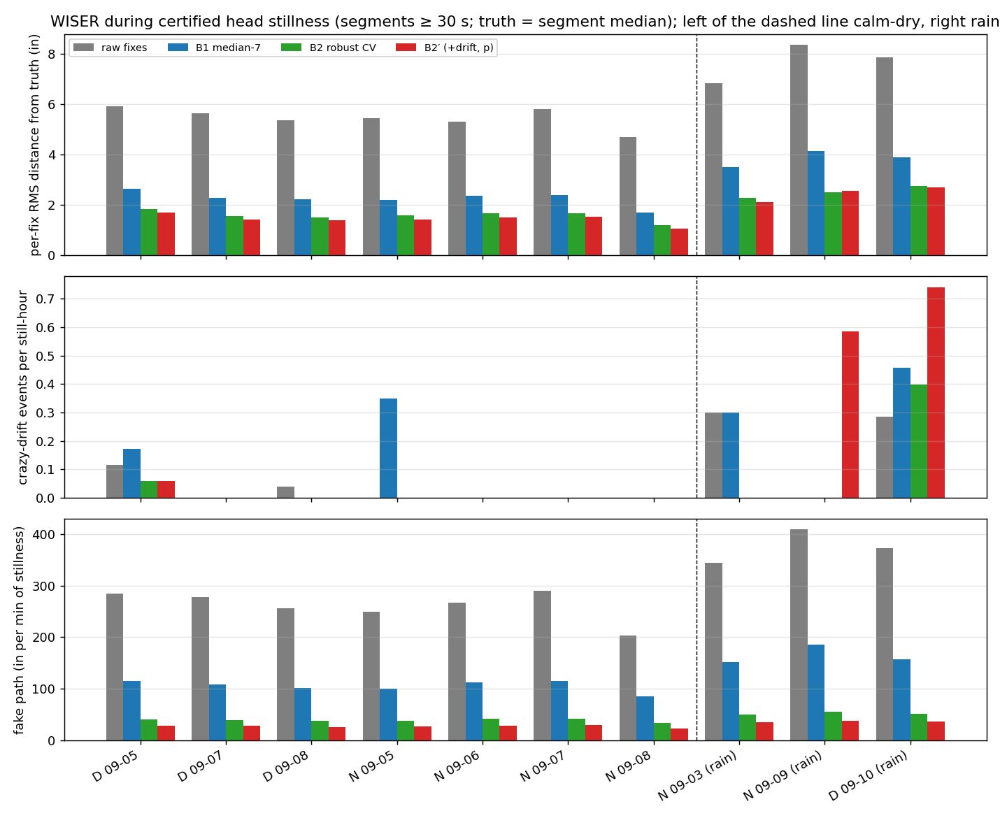
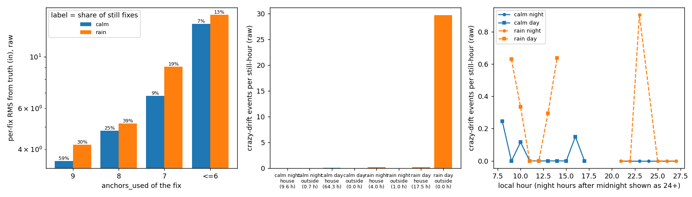
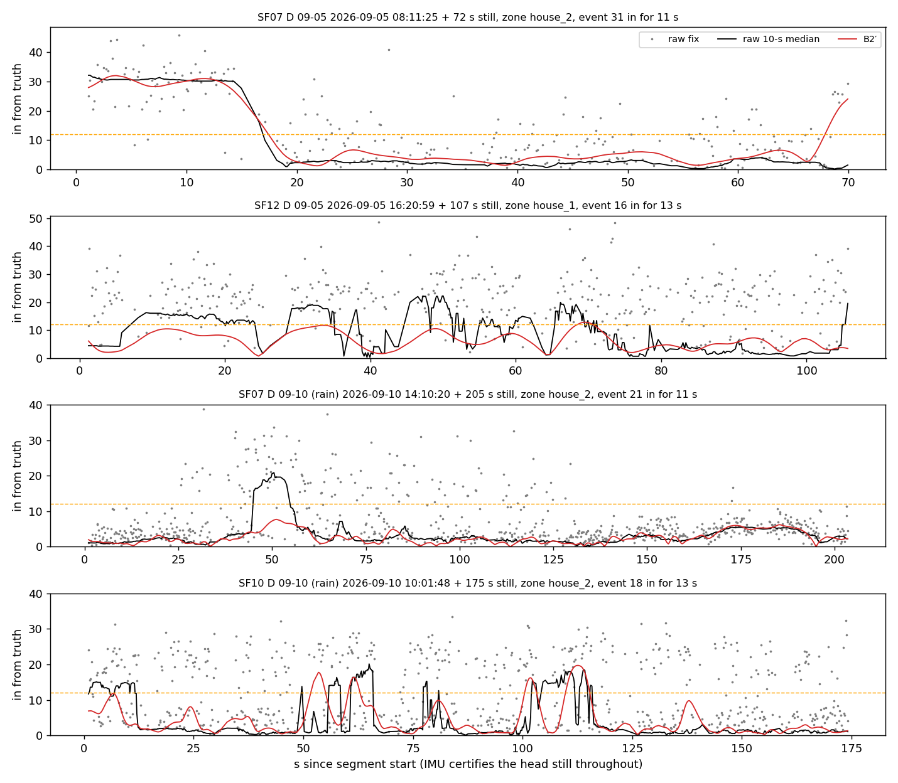
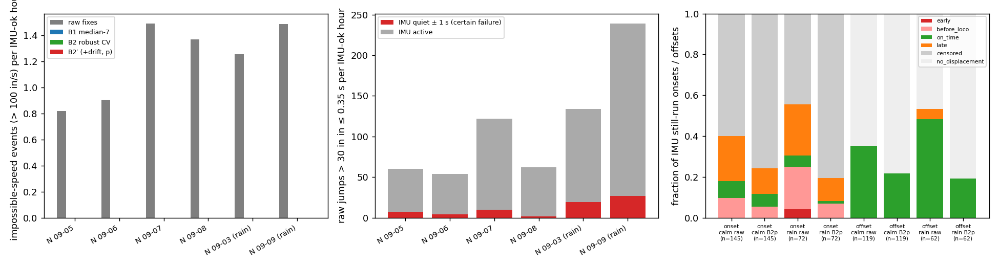
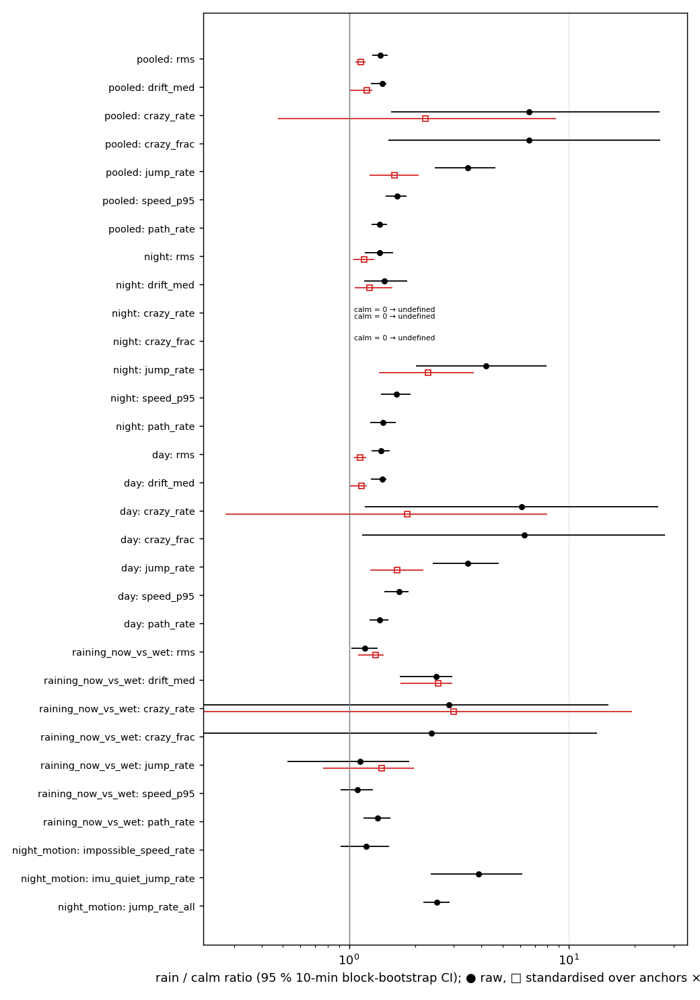

# WISER failure audit with the head IMU as the stillness truth (cohort 2026c)

**Step 1 of the new evaluation** — approved by the user 2026-10-02 ("搞吧"). Plan [`implementation_plan/2026-10-02-wiser-failure-audit.md`](../../../../implementation_plan/2026-10-02-wiser-failure-audit.md) (3 amendments: two before any audit number, one post hoc on the Q4 standardisation — §6); driver `wiser/scripts/analyze_wiser_failure_audit.py` (`--selftest` ALL PASS, 19 checks; the per-group still tables' speed quantiles were corrected on 2026-10-03, [`implementation_plan/2026-10-03-wiser-v1b-zupt.md`](../../../../implementation_plan/2026-10-03-wiser-v1b-zupt.md)); config `wiser/configs/wiser_failure_audit_2026c.json`; bulk `D:\Field2026_analysis_out\2026c\wiser_failure_audit_20261002_1511`; git `b70f53e+dirty`. Audit only: nothing is tuned, accepted or promoted here.

## Executive summary

1. **Truth:** 97 h of head stillness certified by the IMU in ≥ 30-s segments (calm-dry 74.6 h, rain 22.6 h; 98 % of the segments lie in the two houses). The 50-Hz rule reproduces the 100-Hz strict windows (time recall 0.99, precision 0.90).
2. **Jitter (Q1):** while the head is still, raw fixes sit **5.6 in RMS** from the still position on calm-dry periods (p90 7.3, p99 18.3 in) and **7.7 in** in the rain periods (p99 27.4 in); ≤ 6-anchor fixes 14 in vs 9-anchor 3.6 in.
3. **Drift (Q1):** slow drift is small and crazy drift rare: the worst 10-s median of a segment strays median **1.5 in** (p90 3.8), the 60-s median 0.6 in; ≥ 12 in for ≥ 10 s happened **3 times in 75 calm still-hours** (0.04/h) and 6 times in 23 rain still-hours (0.27/h). WISER does not wander far from a still rat — it jitters and jumps.
4. **Jumps and fake motion (Q1):** a still tag jumps > 30 in within ≤ 0.35 s **55/h** (rain 191/h) and accrues **268 in of fake path per minute** (fake speed p95 11.7 in/s).
5. **Smoothers (Q2):** B2′ cuts the still error to 1.5 in RMS, fake path to 27 in/min, p95 speed to 1.1 in/s and removes every jump, but **not the slow drift** (10-s drift 1.3 in vs raw 1.5; 60-s 0.7 vs 0.6 in); in the rain it creates more ≥ 12-in excursions than raw (14 vs 6).
6. **Motion side (Q3, nights):** raw WISER produces 1.1 impossible-speed (> 100 in/s) events/h calm, 1.4/h rain, and 77 / 192 jumps/h, 6 / 23 per h with a quiet IMU (certain failures; 91 % / 63 % from ≤ 6-anchor fixes); **B2/B2′ remove all of them**. WISER almost never moves while the head is still (early onsets 0 % calm / 4 % rain) or stays away after it stops (late settles 0 % / 5 %); its departure lags the first locomoting second by > 2 s in 22 % of onsets (ambiguous: WISER latency vs time to walk 1 ft).
7. **Rain (Q4): CONFIRMED, LARGELY VIA FEWER ANCHORS (the anchors × zone–standardised CI reaches 1)** by the pre-registered rule — but modest in size: median 10-s drift 2.0 vs 1.5 in (×1.41, anchors × zone ×1.21 [1.00, 1.28]), ×2.5 (4.9 in) in minutes when it was actually raining; per-fix RMS ×1.39 (standardised ×1.13), jumps ×3.5; crazy drift 6 vs 3 events. Much of it goes through lost anchors (9-anchor share 30 % vs 59 %); humidity, location and a 3-episode rain sample are confounded.
8. **The bar for V6 (Q5):** in still time an IMU constraint can at most remove what B2′ leaves — **1.5 in RMS, 27 in/min fake path, 1.3 in 10-s drift** (calm) — on 7 % of the night and 52 % of the day (≥ 30-s stillness); on the motion side B2′ leaves nothing of the measured failure types.

## 1. Periods, data and weather

Periods were decided with the user before the plan; field-PC local time. IMU-ok hours = 5 animals summed after every exclusion (handling windows ± 5 min, all-tag WISER silences ± 2 min, the logger's own ADC-lane windows, tag limits, IMU QC). Weather recomputed from the AWN cloud export (5-min rows): rain = increments of the console's daily-rain counter (rate integral in brackets).

| set | period | window | IMU-ok h | still ≥ 30 s h | fixes | 9-anchor | ≤ 6-anchor | rain mm | rain min | rain prev. 12 h | wind mean / gust p95 / max (mph) | RH mean (min–max) | T − Td (°C) |
|---|---|---|---|---|---|---|---|---|---|---|---|---|---|
| calm | `day_20260905` | 09-05 08:00 → 09-05 18:00 | 38.2 | 17.9 | 656,833 | 56 % | 9.6 % | 0.0 (0.0) | 0 | 0.0 | 2.8 / 9.2 / 12.5 | 76 (62–99) | 4.5 |
| calm | `day_20260907` | 09-07 08:00 → 09-07 18:00 | 37.4 | 21.2 | 621,751 | 61 % | 6.4 % | 0.0 (0.0) | 0 | 0.0 | 1.7 / 6.9 / 8.1 | 72 (49–99) | 5.8 |
| calm | `day_20260908` | 09-08 08:00 → 09-08 18:00 | 50.0 | 26.9 | 705,974 | 62 % | 5.6 % | 0.0 (0.0) | 0 | 0.0 | 1.3 / 5.8 / 6.9 | 59 (47–93) | 8.9 |
| calm | `night_20260905` | 09-05 21:00 → 09-06 04:20 | 35.5 | 2.9 | 522,860 | 72 % | 3.8 % | 0.0 (0.0) | 0 | 0.0 | 0.3 / 3.0 / 3.4 | 97 (92–99) | 0.5 |
| calm | `night_20260906` | 09-06 21:00 → 09-07 04:20 | 35.4 | 3.2 | 524,447 | 72 % | 2.9 % | 0.0 (0.0) | 0 | 0.0 | 0.1 / 1.1 / 1.1 | 98 (93–99) | 0.3 |
| calm | `night_20260907` | 09-07 21:00 → 09-08 04:20 | 35.6 | 2.5 | 514,609 | 63 % | 5.1 % | 0.0 (0.0) | 0 | 0.0 | 0.1 / 1.8 / 2.2 | 98 (94–99) | 0.3 |
| calm | `night_20260908` | 09-08 21:00 → 09-09 04:20 | 35.8 | 1.9 | 518,981 | 70 % | 3.1 % | 0.0 (0.0) | 0 | 0.0 | 0.3 / 2.2 / 2.2 | 90 (80–99) | 1.6 |
| rain | `night_20260903` | 09-03 21:00 → 09-04 04:20 | 35.9 | 3.4 | 523,084 | 47 % | 5.8 % | 20.1 (18.4) | 85 | 0.7 | 0.2 / 1.8 / 4.5 | 98 (94–99) | 0.3 |
| rain | `night_20260909` | 09-09 21:00 → 09-10 04:20 | 35.7 | 1.7 | 517,688 | 53 % | 6.1 % | 7.1 (7.2) | 65 | 7.9 | 0.2 / 2.2 / 3.4 | 98 (97–99) | 0.3 |
| rain | `day_20260910` | 09-10 08:00 → 09-10 18:00 | 30.6 | 17.9 | 683,937 | 38 % | 10.5 % | 0.0 (0.0) | 0 | 12.2 | 2.9 / 10.3 / 14.8 | 70 (55–98) | 6.1 |

The user's rain figures check out (09-03 night 18.4 mm by rate integral / 20.1 mm by counter; 09-09 night 7.2 / 7.1 mm; 09-10 day 0 mm during, 12.2 mm in the previous 12 h). Every night, calm or rain, is near saturation (RH ≈ 90–98 %, dew-point depression ≤ 1.6 °C → dew), so humidity does not separate the sets; wind is light everywhere at night. The 09-10 day ends at ≈ 14:40 for the IMU (ADC-lane sessions quarantined from 14:43, `cohorts/2026c.yaml ephys.adc_lane`), and the AM rounds cut 08:00–09:55 on 09-05 and 08:00–09:20 on 09-07.

## 2. Certified stillness: rule and validation

The strict gate-v2 windows (100 Hz; ≥ 1 s, accelerometer-direction sweep < 0.3°, ‖|ā| − g‖ < 0.03 g, |ω| < 3 °/s; **no WISER veto** — it would be circular here) are used on `day_20260908` / `night_20260908`. Elsewhere **S50**: the head-frame accelerometer is rebuilt exactly from the make_imu Fusion quaternion and earth linear acceleration, ellipsoid self-calibrated per animal-period like the A3 chain (amendment 1), and the same rule is applied on 0.1-s blocks. Windows are merged across gaps ≤ 2 s with no movement (every 50-Hz sample |ω| < 20 °/s and VeDBA < θ_a) into segments; 1 s is trimmed at both ends.

**Validation** on the four gate-v2 periods (19 of 20 animal-periods; SF12 `day_20260911` has no make_imu npz for its field-flagged session `3_20260911_094747.706`): S50 time recall **0.992** (min 0.869, SF07 `night_20260908`), precision **0.902** (min 0.781); within ≥ 30-s segments time recall 0.998, precision 0.889. The literal `up_head`-sweep variant fails (recall 0.29): Fusion's gravity estimate wanders more than 0.3° per second, so it is not used. Without the self-calibration the magnitude test rejected most still time (prototype recall 0.31 / 0.41), because make_imu calibrates the accelerometer with a scalar only.

Sensitivity on the two strict periods — the audit metrics do not depend on the rule (raw / B2′):

| still source | segments ≥ 30 s | still h | median segment RMS (in) | 10-s drift median / p90 (in) | crazy/h | jumps/h | fake path (in/min) |
|---|---|---|---|---|---|---|---|
| strict | 1200 | 28.1 | 4.02 / 0.89 | 1.39 / 3.47 | 0.036 | 44.4 | 252 / 26 |
| s50 | 1292 | 30.9 | 4.04 / 0.90 | 1.41 / 3.57 | 0.000 | 44.0 | 253 / 26 |
| s50_up | 511 | 12.3 | 4.20 / 0.96 | 1.45 / 3.65 | 0.000 | 43.4 | 258 / 26 |

**Where the truth exists:** certified stillness ≥ 30 s covers 52 % of the IMU-ok day and 7 % of the IMU-ok night (≥ 10 s: 64 % / 9 %); **98 %** of the ≥ 30-s segments (95.5 h of 97.2 h) lie in the house ROIs (+ 14 in). Long stillness outside is rare (1.7 h), so every Q1/Q2 number below describes WISER **at the houses**; median fix rate in the segments 3.96 Hz (p5 3.67 Hz: no dropout during stillness). Truth sensitivity: the ≥ 8-anchor median lies 0.13 in (p90 1.44 in) from the all-fix median.

## 3. Q1 — How bad is WISER during certified stillness?

**Verdict:** WISER **jitters and jumps but rarely drifts far** from a still rat. On calm-dry periods a single fix is 5.6 in RMS from the still position and 1 % of fixes are > 18 in away; a 10-s median strays ≤ 1.5 in (median segment), ≥ 12 in for ≥ 10 s only 3 times in 75 still-hours. The rain periods are worse on every metric.

Raw WISER, primary segments ≥ 30 s (truth = segment median; all distances in in, speeds in/s):

| set | kind | segments | still h | per-fix RMS | p50 | p90 | p99 | 10-s drift med / p90 / max | 60-s drift med / p90 | crazy-drift /h (n) | crazy time | jumps /h | fake speed p50 / p95 / p99 | fake path in/min |
|---|---|---|---|---|---|---|---|---|---|---|---|---|---|---|
| calm | day | 2791 | 64.3 | **5.60** | 2.67 | 7.38 | 18.8 | 1.48 / 3.82 / 30.8 | 0.61 / 1.86 | 0.047 (3) | 0.02 % | 58 | 3.2 / 11.8 / 22.2 | 270 |
| calm | night | 454 | 10.3 | **5.36** | 2.65 | 7.01 | 15.5 | 1.60 / 3.76 / 30.5 | 0.52 / 1.36 | 0.000 (0) | 0.00 % | 37 | 3.2 / 10.9 / 19.3 | 256 |
| rain | day | 707 | 17.5 | **7.84** | 3.26 | 11.06 | 27.9 | 2.00 / 6.45 / 24.8 | 0.95 / 3.73 | 0.285 (5) | 0.10 % | 201 | 4.0 / 19.9 / 31.3 | 372 |
| rain | night | 208 | 5.0 | **7.38** | 3.49 | 10.89 | 25.4 | 2.30 / 7.05 / 14.8 | 1.03 / 3.00 | 0.198 (1) | 0.06 % | 153 | 4.2 / 17.8 / 28.4 | 366 |

By `anchors_used` of the fix (per-fix RMS from truth, raw and B2′; share = fraction of still fixes):

| anchors | calm share | calm RMS raw / p90 / B2′ | rain share | rain RMS raw / p90 / B2′ |
|---|---|---|---|---|
| 9 | 59 % | 3.6 / 5.5 / 1.2 | 30 % | 4.2 / 6.5 / 1.7 |
| 8 | 25 % | 4.8 / 7.4 / 1.6 | 39 % | 5.2 / 7.8 / 2.1 |
| 7 | 9 % | 6.8 / 10.4 / 1.9 | 19 % | 9.0 / 15.6 / 3.2 |
| <=6 | 7 % | 13.8 / 18.9 / 2.2 | 13 % | 15.1 / 23.2 / 4.2 |

By animal (raw; calm | rain): SF07 5.9 | 8.3 in RMS, 79 | 250 jumps/h; SF08 5.6 | 7.1 in RMS, 47 | 151 jumps/h; SF09 5.6 | 8.2 in RMS, 53 | 212 jumps/h; SF10 5.4 | 8.3 in RMS, 43 | 210 jumps/h; SF12 5.3 | 6.8 in RMS, 53 | 138 jumps/h — no animal stands out; the error is the tag at the place, not the animal.

By zone (nights, raw): calm house 5.4 in RMS / 38 jumps/h (9.6 h) vs outside 4.0 in / 13 jumps/h (0.7 h); rain house 7.1 / 110 vs outside 8.5 / 328 (1.0 h). Days have no outside stillness to compare.

By local hour (raw, hours with ≥ 0.5 still-h): calm days stay within 5.1–6.7 in RMS and 38–98 jumps/h; the **wet day 09-10 is bad only in the morning** (09 h 10.2 in / 422 jumps/h, 10 h 10.5 in / 412 jumps/h) and calm-like from noon (12 h 5.5 / 52, 13 h 5.7 / 77, 14 h 6.0 / 72) — WISER recovers as the paddock dries. Rain nights are worst in the evening hours of the rain (`tables/summary_still_hour.csv`).

**What it implies for the IMU:** during stillness the IMU's job is to stop jitter and jumps from becoming fake motion and to pin the position; there is little slow drift for it to correct (the median 10-s excursion is ≈ 1.5 in, below the 4–7-in jitter floor).

## 4. Q2 — What do the position-only smoothers leave?

**Verdict:** B2′ (and B2) remove most of the jitter and **all** jumps and fake speed tails, but leave the slow drift where it was (10-s drift −15 %, 60-s drift +13 %) and, in the rain, follow sustained low-anchor clusters into more ≥ 12-in excursions than the raw 10-s median (14 vs 6 events; calm 1 vs 3). V1 / V2 use the IMU's own stillness, so their still-period numbers are **what an IMU stillness constraint removes by construction**, not evidence.

Pooled primary segments ≥ 30 s (calm-dry | rain):

| method | per-fix RMS | p90 | p99 | 10-s drift med / p90 | 60-s drift med / p90 | crazy-drift /h (n) | jumps /h | fake speed p95 | fake path in/min |
|---|---|---|---|---|---|---|---|---|---|
| raw fixes | 5.57 \| 7.74 | 7.33 \| 11.01 | 18.3 \| 27.4 | 1.50 / 3.81 \| 2.05 / 6.62 | 0.60 / 1.83 \| 0.97 / 3.58 | 0.040 (3) \| 0.266 (6) | 55.0 \| 190.6 | 11.70 \| 19.38 | 268 \| 371 |
| B1 median-7 | 2.33 \| 3.84 | 3.33 \| 5.18 | 7.6 \| 15.6 | 1.50 / 3.77 \| 2.09 / 6.72 | 0.63 / 1.88 \| 0.99 / 3.88 | 0.054 (4) \| 0.399 (9) | 0.4 \| 0.3 | 4.75 \| 8.40 | 107 \| 158 |
| B2 robust CV | 1.60 \| 2.65 | 2.33 \| 3.61 | 5.2 \| 10.8 | 1.41 / 3.45 \| 1.91 / 5.50 | 0.72 / 2.17 \| 1.17 / 4.49 | 0.013 (1) \| 0.310 (7) | 0.0 \| 0.0 | 1.48 \| 2.14 | 39 \| 51 |
| B2′ (+drift, p) | 1.48 \| 2.61 | 2.13 \| 3.47 | 5.1 \| 11.0 | 1.28 / 3.37 \| 1.83 / 5.68 | 0.67 / 2.28 \| 1.13 / 4.40 | 0.013 (1) \| 0.620 (14) | 0.0 \| 0.0 | 1.07 \| 1.53 | 27 \| 36 |
| B2′ p+b | 1.74 \| 2.89 | 2.54 \| 3.88 | 5.6 \| 11.8 | 1.37 / 3.53 \| 1.92 / 5.88 | 0.67 / 2.29 \| 1.14 / 4.56 | 0.013 (1) \| 0.709 (16) | 0.0 \| 0.0 | 2.18 \| 2.75 | 60 \| 71 |
| V1 ZUPT (IMU) *(IMU, circular)* | 1.24 \| 2.04 | 1.87 \| 2.50 | 4.0 \| 9.4 | 0.99 / 2.61 \| 1.26 / 3.31 | 0.81 / 2.05 \| 1.03 / 3.22 | 0.013 (1) \| 0.221 (5) | 0.0 \| 0.0 | 0.05 \| 0.06 | 1 \| 1 |
| V2 IMU-switched q (IMU) *(IMU, circular)* | 1.06 \| 2.08 | 1.48 \| 2.57 | 3.8 \| 9.5 | 0.91 / 2.51 \| 1.23 / 4.01 | 0.61 / 2.21 \| 1.07 / 4.41 | 0.013 (1) \| 0.310 (7) | 0.0 \| 0.0 | 0.15 \| 0.21 | 3 \| 4 |

Residual after B2′ as a share of raw (calm): RMS 27 %, p99 28 %, fake path 10 %, fake speed p95 9 %, 10-s drift 85 %, 60-s drift 113 %, jumps 0 %. B1 (the library median) keeps 42 % of the RMS and 40 % of the fake path. B2′'s `p + b` (the WISER-measurement predictor) is worse than its `p`, as it should be (b carries the measured wander).

**What it implies for the IMU:** a position-only smoother already does the easy part (outliers, jitter). What it cannot do is decide *when* the rat is still — it keeps 1.4–1.5 in of jitter and ≈ 27 in/min of fake path in every still minute and cannot tell a slow WISER excursion from a slow walk. That decision is exactly what the IMU provides.

## 5. Q3 — WISER failure while the animal moves (nights)

**Verdict:** the motion-side failures are **short outliers**, not lost tracks: 1.15 (calm) / 1.37 (rain) impossible-speed events and 77 / 192 jumps per IMU-ok hour in raw WISER, of which 6.0 / 23.1 per hour happen with a quiet IMU (certain failures). Every smoother removes the impossible speeds; B2 / B2′ remove every jump. WISER almost never moves while the head is still (early onsets 0 % / 4 %) or stays ≥ 1 ft away after it stops (late settles 0 % / 5 %); late departures after the first locomoting second (22 % / 25 %) cannot be separated from the time a rat needs to walk 1 ft.

| night | set | IMU-ok h | impossible-speed /h raw (n) | … with IMU still (n) | … with ≥ 1 loco s (n) | ≤ 6 anchors | B1 / B2 / B2′ | jumps /h raw | IMU-quiet jumps /h | jumps ≤ 6 anchors | B1 jumps /h | B2′ jumps /h |
|---|---|---|---|---|---|---|---|---|---|---|---|---|
| `night_20260905` | calm | 35.5 | 0.82 (29) | 8 | 8 | 66 % | 0.00 / 0.00 / 0.00 | 61 | 7.2 | 65 % | 0.08 | 0.00 |
| `night_20260906` | calm | 35.4 | 0.90 (32) | 9 | 9 | 84 % | 0.00 / 0.00 / 0.00 | 56 | 4.4 | 53 % | 0.03 | 0.00 |
| `night_20260907` | calm | 35.6 | 1.49 (53) | 8 | 15 | 89 % | 0.00 / 0.00 / 0.00 | 125 | 10.2 | 58 % | 0.67 | 0.00 |
| `night_20260908` | calm | 35.8 | 1.37 (49) | 6 | 18 | 86 % | 0.00 / 0.00 / 0.00 | 63 | 2.0 | 51 % | 0.14 | 0.00 |
| `night_20260903` | rain | 35.9 | 1.25 (45) | 3 | 16 | 78 % | 0.00 / 0.00 / 0.00 | 137 | 19.1 | 61 % | 0.28 | 0.00 |
| `night_20260909` | rain | 35.7 | 1.49 (53) | 6 | 20 | 79 % | 0.00 / 0.00 / 0.00 | 246 | 27.1 | 54 % | 1.07 | 0.00 |

IMU-quiet jumps come from ≤ 6-anchor fixes in 91 % (calm) / 63 % (rain) of cases (33 % from 7-anchor fixes in the rain). Jumps by zone and anchors: `tables/summary_motion_jumps_by_*.csv`.

**Onset / offset agreement** (IMU still runs ≥ 10 s with locomotion within 60 s; amendment 2):

| set | kind | n | early (WISER moves while the head is still) | before first loco s | on time ± 2 s | late > 2 s | censored / no displacement | median lag to loco (s) |
|---|---|---|---|---|---|---|---|---|
| calm | onset raw fixes | 145 | 0 % | 10 % | 8 % | 22 % | 60 % | 2.62 |
| calm | onset B2′ (+drift, p) | 145 | 0 % | 6 % | 6 % | 12 % | 76 % | 2.50 |
| calm | offset raw fixes | 119 | – | – | 35 % | 0 % | 65 % | -1.62 |
| calm | offset B2′ (+drift, p) | 119 | – | – | 22 % | 0 % | 78 % | -1.00 |
| rain | onset raw fixes | 72 | 4 % | 21 % | 6 % | 25 % | 44 % | 0.62 |
| rain | onset B2′ (+drift, p) | 72 | 0 % | 7 % | 1 % | 11 % | 81 % | 2.75 |
| rain | offset raw fixes | 62 | – | – | 48 % | 5 % | 47 % | -5.50 |
| rain | offset B2′ (+drift, p) | 62 | – | – | 19 % | 0 % | 81 % | -6.00 |

Most onsets are censored (WISER stays within 12 in for 20 s after the first locomoting second — consistent with activity in place, e.g. inside the house) and most offsets show no ≥ 12-in approach in the last 20 s, so the transitions are small. Where WISER does depart, it does so a median 2.6 s after the first locomoting second (calm) — the 1-s IMU state and a 12-in criterion cannot separate WISER latency from the time the rat needs to translate 1 ft. B2′ cannot see the head stop either, and V1/V2 depart later because their zero-velocity update holds the position while the IMU is still.

**What it implies for the IMU:** on the motion side the measured failure types are already handled by position-only smoothing; the IMU could only add value there by bridging real gaps or constraining heading, which this audit does not measure (gaps were not scored).

## 6. Q4 — Is "rain → more drift" confirmed?

**Verdict (pre-registered rule): CONFIRMED, LARGELY VIA FEWER ANCHORS (the anchors × zone–standardised CI reaches 1).**

*Amendment 3 (post hoc, after the first Q4 table):* the plan standardised segment metrics by zone only; that is a no-op here (pooled zone-standardised median-drift ratio 1.41 [1.26, 1.48] = raw) and gave CONFIRMED. The verdict rule asks for anchors × zone, so the segment's median anchors were added as a stratum; that version decides the verdict above. Both are in `tables/summary_rain_vs_calm_bootstrap.csv`.

Rain / calm ratios, raw WISER, 95 % CIs from 1000 resamples of 10-min blocks within each set. Standardised = rain strata re-weighted to the calm weights over anchors × zone (the fix's anchors for the per-fix RMS; the segment's median anchors for segment and event metrics); zone-only versions are in `tables/summary_rain_vs_calm_bootstrap.csv` (they equal the raw ratios: almost all still time is in the houses). "calm 0 → undefined": no calm event.

| metric | pooled | pooled, standardised | nights | nights, standardised | days | days, standardised |
|---|---|---|---|---|---|---|
| per-fix RMS | 1.39 [1.28, 1.50] | 1.13 [1.07, 1.19] | 1.38 [1.18, 1.58] | 1.17 [1.05, 1.30] | 1.40 [1.27, 1.53] | 1.12 [1.05, 1.19] |
| median 10-s drift | 1.41 [1.26, 1.48] | 1.21 [1.00, 1.28] | 1.45 [1.17, 1.84] | 1.24 [1.06, 1.58] | 1.41 [1.26, 1.48] | 1.14 [1.00, 1.21] |
| crazy-drift events / still-h | 6.61 [1.55, 25.91] | 2.22 [0.48, 8.73] | calm 0 → undefined (rain 0.20) | calm 0 → undefined (rain 0.12) | 6.11 [1.18, 25.49] | 1.84 [0.27, 7.99] |
| crazy-drift time share | 6.61 [1.51, 26.02] | n/a | calm 0 → undefined (rain 0.00) | n/a | 6.29 [1.15, 27.35] | n/a |
| jumps / still-h | 3.46 [2.46, 4.64] | 1.61 [1.24, 2.08] | 4.19 [2.01, 7.92] | 2.29 [1.37, 3.70] | 3.47 [2.40, 4.79] | 1.66 [1.24, 2.17] |
| fake speed p95 | 1.65 [1.46, 1.83] | n/a | 1.64 [1.40, 1.90] | n/a | 1.68 [1.44, 1.87] | n/a |
| fake path in/min | 1.38 [1.27, 1.49] | n/a | 1.43 [1.25, 1.64] | n/a | 1.38 [1.24, 1.51] | n/a |

Within anchor strata (pooled, raw) — per-fix RMS by the fix's anchors: 9: 1.17 [1.11, 1.24]; 8: 1.07 [1.00, 1.16]; 7: 1.33 [1.17, 1.50]; <=6: 1.09 [1.01, 1.18]; median 10-s drift by the segment's median anchors: 9: 1.15 [1.07, 1.32]; 8: 1.05 [0.95, 1.11]; 7: 1.67 [1.12, 2.40]; <=6: 1.51 [0.83, 3.04].

Night motion side (per IMU-ok hour): impossible speed 1.20 [0.92, 1.52]; IMU-quiet jumps 3.88 [2.35, 6.12]; all jumps 2.50 [2.18, 2.86].

Inside the rain periods, segments while it was raining (nearest 5-min weather row has rain rate > 0, ≥ 50 % of fixes) vs wet but not raining: per-fix RMS 1.18 [1.03, 1.34]; median 10-s drift 2.49 [1.70, 2.95]; crazy-drift events / still-h 2.85 [0.00, 15.13]; crazy-drift time share 2.38 [0.00, 13.43]; jumps / still-h 1.13 [0.52, 1.88]; fake speed p95 1.09 [0.91, 1.28]; fake path in/min 1.35 [1.16, 1.54].

**Reading:** the user's expectation holds in direction: rain makes WISER noisier on every metric — more jitter, ×3–4 jumps, and more drift (median 10-s drift 2.05 vs 1.45 in, ×1.41; p90 6.6 vs 3.8 in). Standardising over anchors × zone shrinks the drift effect to ×1.21 [1.00, 1.28] (nights only ×1.24 [1.06, 1.58]; medians on a 0.1-in grid, so the lower bound sits on the resolution), and the crazy-drift excess to ×2.2 [0.5, 8.7]: rain drift happens mostly in segments that have lost anchors. The effect is concentrated in the minutes when it is actually raining (median 10-s drift 4.9 in vs 2.0 in when wet but not raining, ×2.5, also after standardisation). In size it is modest: + 0.6 in of median drift, below the jitter floor, and ≥ 12-in drifts stay rare (6 events in 23 rain still-hours). The jitter increase likewise goes partly through lost anchors (rain still fixes: 9 anchors 30 % vs 59 %, ≤ 6 anchors 13 % vs 7 %; standardised RMS ratio ×1.13 vs raw ×1.39) and partly within strata. Wetness, not falling rain alone, matters: the day after the rain is as bad as the rain nights in the morning and recovers by noon (Q1, by local hour).

**Confounds:** (i) only three rain periods (two nights, one wet day) — effectively three weather episodes, so the block CIs (which treat 10-min blocks as independent within a set and ignore that all five tags share the weather) are optimistic; (ii) humidity/dew is 90–98 % on every night, calm or rain, so it cannot be separated; (iii) the animals' location differs (rain-night still time is 20 % outside vs 5 % calm); (iv) the rain night 09-03 starts 7 h after the 13:56 PC reboot that began regime B, and its pc_time tails are extrapolated for SF09/SF10/SF12; (v) the rain day 09-10 ends at ≈ 14:40 (ADC lane), so its hours differ from the calm days; (vi) weather–WISER alignment is ± 5 min (unverified).

**What it implies for the IMU:** in the rain the IMU constraint matters more (more jumps and jitter to suppress, fatter drift tail), but the dominant lever is anchor loss: any V6 must weight fixes by anchors (as B2/B2′ do) rather than treat rain as a separate regime.

## 7. Q5 — Size of the opportunity (the bar for V6)

During certified stillness the true position is constant, so an ideal IMU stillness constraint removes **all within-segment variation** (fake path and speed → 0, error about the segment truth → 0). What is left for it to remove is therefore what B2′ leaves (calm-dry, pooled ≥ 30-s segments):

| metric (calm-dry stillness) | raw | B2′ already removes | left after B2′ = removable by an IMU constraint in principle | V1 / V2 by construction |
|---|---|---|---|---|
| per-fix RMS (in) | 5.57 | 4.09 (73 %) | **1.48** | 1.24 / 1.06 |
| per-fix p99 (in) | 18.32 | 13.25 (72 %) | **5.07** | 4.03 / 3.84 |
| 10-s drift (median segment) (in) | 1.50 | 0.22 (15 %) | **1.28** | 0.99 / 0.91 |
| 10-s drift p90 (in) | 3.81 | 0.44 (12 %) | **3.37** | 2.61 / 2.51 |
| fake speed p95 (in/s) | 11.70 | 10.63 (91 %) | **1.07** | 0.05 / 0.15 |
| fake path (in/min) | 268.21 | 241.14 (90 %) | **27.06** | 1.22 / 3.11 |
| jumps (/h) | 55.04 | 55.04 (100 %) | **0.00** | 0.00 / 0.00 |
| crazy drift (/h) | 0.04 | 0.03 (67 %) | **0.01** | 0.01 / 0.01 |

Per still hour that is ≈ 41 m of invented path after B2′ (raw 409 m). The constraint applies to 7 % of the IMU-ok night and 52 % of the day in ≥ 30-s stillness (9 % / 64 % at ≥ 10 s). On the motion side B2′ already leaves 0 impossible-speed events and 0 jumps per hour, so there is no measured motion-side failure left for an IMU to remove; its possible contribution there (heading, gap bridging, in-place vs translating) is not measured by this audit.

**The bar:** a V6 that uses the IMU must beat B2′ on certified-still time by removing a meaningful part of **1.4–1.5 in RMS and ≈ 27 in/min of fake path** (rain: 2.3–2.7 in and ≈ 36 in/min) without adding error in motion, and should be scored against certified-still truth (this audit's segments), not against held-out WISER fixes. The 10-s drift that B2′ leaves (≈ 1.3–1.4 in calm) is below the jitter floor; it is not a reason to build V6.

## 8. Worst crazy-drift events — for a human video check

All 9 raw crazy-drift events in primary ≥ 30-s segments (the rule rarely fires), largest first; the list is topped up to ≈ 20 with the largest raw 10-s-median excursions of other segments that did not meet the rule (`short`: ≥ 12 in for < 10 s; `near`: < 12 in), with the span where the 10-s median is ≥ 12 in (± 5 s). Camera = hourly file under `F:\3rd_rat\<date>\<CH>\` with the offset into it at the event start, by file-name time (never the OSD; cameras switch to IR at night). house_2 → CH07 in-box + CH06 top-down, house_1 → CH08 + CH05, outside → CH01/CH02 panoramas. The agent has not looked at any frame.

**Common-mode cluster:** 4 tags (SF07, SF08, SF09, SF12) show ≥ 12-in excursions within 5 min of 2026-09-10 09:48:41 while each head is certified still (zones house_2, outside) — a shared cause (anchor geometry, a person or object near anchors) rather than a tag problem; check the panoramas at that time.

| # | type | animal | period | start → end (field-PC) | size (in) | dur (s) | anchors med (≤ 6 share) | zone | video |
|---|---|---|---|---|---|---|---|---|---|
| 1 | event | SF07 | `day_20260905` | 09-05 08:11:26 → 08:11:46 | 30.8 | 11 | 8 (12 %) | house_2 | CH07: CH07_2026-09-05_08-00-00_to_09-00-00.mp4 @ 686.6 s; CH06: CH06_2026-09-05_08-00-00_to_09-00-00.mp4 @ 686.6 s |
| 2 | event | SF07 | `day_20260910` | 09-10 14:11:00 → 14:11:20 | 20.6 | 11 | 6 (60 %) | house_2 | CH07: CH07_2026-09-10_14-00-01_to_15-00-01.mp4 @ 659.4 s; CH06: CH06_2026-09-10_14-00-00_to_15-00-00.mp4 @ 660.4 s |
| 3 | event | SF10 | `day_20260910` | 09-10 10:03:25 → 10:03:47 | 18.3 | 13 | 7 (18 %) | house_2 | CH07: CH07_2026-09-10_10-00-02_to_11-00-00.mp4 @ 203.0 s; CH06: CH06_2026-09-10_10-00-02_to_11-00-00.mp4 @ 203.0 s |
| 4 | event | SF12 | `day_20260910` | 09-10 09:50:54 → 09:51:13 | 17.9 | 10 | 7 (39 %) | outside | CH01: CH01_2026-09-10_09-00-01_to_10-00-02.mp4 @ 3053.1 s; CH02: CH02_2026-09-10_09-00-01_to_10-00-02.mp4 @ 3053.1 s |
| 5 | event | SF12 | `day_20260905` | 09-05 16:21:01 → 16:21:23 | 16.0 | 13 | 3 (100 %) | house_1 | CH08: CH08_2026-09-05_16-00-00_to_17-00-00.mp4 @ 1261.3 s; CH05: CH05_2026-09-05_16-00-01_to_17-00-01.mp4 @ 1260.3 s |
| 6 | event | SF09 | `day_20260910` | 09-10 09:50:50 → 09:51:13 | 15.5 | 14 | 5 (95 %) | house_2 | CH07: CH07_2026-09-10_09-00-01_to_10-00-02.mp4 @ 3049.0 s; CH06: CH06_2026-09-10_09-00-01_to_10-00-02.mp4 @ 3049.0 s |
| 7 | event | SF08 | `night_20260903` | 09-03 23:56:03 → 23:56:22 | 14.8 | 10 | 8 (9 %) | house_1 | CH08: CH08_2026-09-03_23-00-01_to_00-00-01.mp4 @ 3363.0 s; CH05: CH05_2026-09-03_23-00-00_to_00-00-00.mp4 @ 3364.0 s |
| 8 | event | SF10 | `day_20260910` | 09-10 13:48:37 → 13:48:58 | 13.7 | 12 | 7 (49 %) | house_2 | CH07: CH07_2026-09-10_13-00-01_to_14-00-01.mp4 @ 2916.0 s; CH06: CH06_2026-09-10_13-00-00_to_14-00-00.mp4 @ 2917.0 s |
| 9 | event | SF12 | `day_20260908` | 09-08 10:52:19 → 10:52:39 | 13.2 | 11 | 6 (69 %) | house_1 | CH08: CH08_2026-09-08_10-00-01_to_11-00-00.mp4 @ 3138.8 s; CH05: CH05_2026-09-08_10-00-00_to_11-00-00.mp4 @ 3139.8 s |
| 10 | short (≥ 12 in for < 10 s) | SF08 | `night_20260905` | 09-06 01:24:36 → 01:24:55 | 30.6 | 10 | 6 (69 %) | house_2 | CH07: CH07_2026-09-06_01-00-01_to_02-00-00.mp4 @ 1475.2 s; CH06: CH06_2026-09-06_01-00-00_to_02-00-00.mp4 @ 1476.2 s |
| 11 | short (≥ 12 in for < 10 s) | SF07 | `day_20260910` | 09-10 10:52:26 → 10:52:40 | 24.8 | 5 | 6 (78 %) | house_2 | CH07: CH07_2026-09-10_10-00-02_to_11-00-00.mp4 @ 3145.0 s; CH06: CH06_2026-09-10_10-00-02_to_11-00-00.mp4 @ 3145.0 s |
| 12 | short (≥ 12 in for < 10 s) | SF08 | `day_20260910` | 09-10 11:07:08 → 11:07:21 | 23.5 | 4 | 5 (85 %) | house_2 | CH07: CH07_2026-09-10_11-00-00_to_12-00-01.mp4 @ 428.8 s; CH06: CH06_2026-09-10_11-00-00_to_12-00-00.mp4 @ 428.8 s |
| 13 | short (≥ 12 in for < 10 s) | SF12 | `day_20260907` | 09-07 12:13:06 → 12:13:17 | 23.0 | 2 | 5 (88 %) | house_1 | CH08: CH08_2026-09-07_12-00-00_to_13-00-00.mp4 @ 786.7 s; CH05: CH05_2026-09-07_12-00-01_to_13-00-01.mp4 @ 785.7 s |
| 14 | short (≥ 12 in for < 10 s) | SF09 | `day_20260910` | 09-10 09:58:40 → 09:58:55 | 19.6 | 6 | 6 (98 %) | house_2 | CH07: CH07_2026-09-10_09-00-01_to_10-00-02.mp4 @ 3519.4 s; CH06: CH06_2026-09-10_09-00-01_to_10-00-02.mp4 @ 3519.4 s |
| 15 | short (≥ 12 in for < 10 s) | SF07 | `day_20260910` | 09-10 09:52:17 → 09:52:30 | 19.0 | 4 | 8 (28 %) | house_2 | CH07: CH07_2026-09-10_09-00-01_to_10-00-02.mp4 @ 3136.3 s; CH06: CH06_2026-09-10_09-00-01_to_10-00-02.mp4 @ 3136.3 s |
| 16 | short (≥ 12 in for < 10 s) | SF08 | `day_20260910` | 09-10 09:51:00 → 09:51:12 | 18.0 | 3 | 7 (37 %) | house_2 | CH07: CH07_2026-09-10_09-00-01_to_10-00-02.mp4 @ 3059.5 s; CH06: CH06_2026-09-10_09-00-01_to_10-00-02.mp4 @ 3059.5 s |
| 17 | short (≥ 12 in for < 10 s) | SF07 | `day_20260905` | 09-05 08:19:49 → 08:20:06 | 18.9 | 8 | 7 (45 %) | house_2 | CH07: CH07_2026-09-05_08-00-00_to_09-00-00.mp4 @ 1190.0 s; CH06: CH06_2026-09-05_08-00-00_to_09-00-00.mp4 @ 1190.0 s |
| 18 | short (≥ 12 in for < 10 s) | SF07 | `day_20260910` | 09-10 09:48:41 → 09:48:54 | 18.0 | 4 | 7 (45 %) | house_2 | CH07: CH07_2026-09-10_09-00-01_to_10-00-02.mp4 @ 2921.0 s; CH06: CH06_2026-09-10_09-00-01_to_10-00-02.mp4 @ 2921.0 s |
| 19 | short (≥ 12 in for < 10 s) | SF09 | `day_20260907` | 09-07 09:28:05 → 09:28:20 | 17.1 | 6 | 7 (33 %) | house_2 | CH07: CH07_2026-09-07_09-00-01_to_10-00-00.mp4 @ 1684.2 s; CH06: CH06_2026-09-07_09-00-00_to_10-00-00.mp4 @ 1685.2 s |
| 20 | short (≥ 12 in for < 10 s) | SF07 | `day_20260908` | 09-08 12:02:32 → 12:02:43 | 16.8 | 2 | 6 (63 %) | house_2 | CH07: CH07_2026-09-08_12-00-01_to_13-00-01.mp4 @ 151.6 s; CH06: CH06_2026-09-08_12-00-01_to_13-00-01.mp4 @ 151.6 s |

## 9. Do not do

- Do not score a smoother or a fusion only against held-out WISER fixes: that truth drifts with WISER and is floor-dominated. Score against certified-still segments (this audit) and physical plausibility.
- Do not read raw WISER path length or speed during rest: a still tag invents ≈ 270 in of path per minute (calm) and ≈ 370 in/min (rain).
- Do not treat a > 30-in jump or a > 100 in/s speed in raw WISER as movement — 8 % (calm) / 12 % (rain) of the night jumps and 19 % / 9 % of the impossible speeds occur while the IMU says still, and B2/B2′ remove them all.
- Do not claim that B2′ fixes drift: it leaves the 10-s drift almost unchanged, is slightly worse at 60 s, and in the rain follows low-anchor clusters into more ≥ 12-in excursions than the raw median.
- Do not generalise these still-time numbers to the open field: 95–100 % of certified still time is inside the houses.
- Do not use the literal `up_head` sweep of the 50-Hz npz as a stillness detector (recall 0.29), and do not apply the 0.03-g magnitude test to make_imu's accelerometer without the ellipsoid self-calibration.
- Do not pool rain and calm periods, and do not call rain → drift causal: rain acts mainly through lost anchors, and humidity, location and the 09-03 reboot are confounded.
- Do not present V1/V2 still-period gains as evidence for the IMU: they use the IMU stillness that defines the test.
- Do not make physical or directional claims from these numbers: distances are in the unverified WISER inch frame (frame-invariant), positions are not georeferenced.

## Definitions

All positions are WISER **inches in the unverified offset frame** (no physical/directional claim is made; only distances,
which are frame-invariant). Times are field-PC local (EDT). Symbols: $k$ indexes the fixes of one tag, $\mathbf z_k$ = raw
fix (in), $\hat{\mathbf p}_k$ = a method's position at fix $k$ (raw: $\hat{\mathbf p}_k=\mathbf z_k$), $t_k$ = fix time
aligned to the IMU clock, $t_k = t_k^{\text{WISER}} - \tau^*$ with $\tau^*$ = 0.20 / 0.15 / 0.10 / 0.20 / 0.15 s
(SF07 / 08 / 09 / 10 / 12); $\sigma$ = a still segment, $[t_\sigma^0+1\,\text{s},\,t_\sigma^1-1\,\text{s})$ its trimmed span,
$K_\sigma$ its fixes, $D_\sigma$ its trimmed duration.

### Rebuilt accelerometer and S50 (50-Hz certified stillness)
$$ \mathbf a^H = R(\mathbf q)^{\top}\big(\mathbf a^{E}_{\text{lin}} + g\,\hat{\mathbf z}\big),\qquad
   \mathbf a^{\text{cal}} = D\,(\mathbf a^H - \mathbf o) $$
where $\mathbf q$ = make_imu Fusion quaternion (head → world), $\mathbf a^{E}_{\text{lin}}$ = its earth-frame linear
acceleration (m/s²), $g$ = 9.81 m/s², $D=\mathrm{diag}(d_x,d_y,d_z)$ and $\mathbf o$ fitted per animal-period by
`fit_ellipsoid` (Huber, priors $d_i = 1\pm0.05$, $o_i = 0\pm0.5$ m/s²) on 0.5-s windows with median $|\boldsymbol\omega|<10$ °/s
and every per-axis SD $<0.15$ m/s². **Text:** the accelerometer that Fusion saw, recovered exactly from its outputs, then
self-calibrated like the A3 chain. **S50 windows:** 0.1-s block means $\bar{\mathbf a}_b$ of $\mathbf a^{\text{cal}}$; a
block is a candidate when all its samples are QC-valid and every $|\boldsymbol\omega| < 3$ °/s; a window $W$ grows block by
block while
$$ \max_{b\in W}\angle(\bar{\mathbf a}_b,\ \bar{\mathbf a}_W) < 0.3^\circ \quad\text{and}\quad \big|\,\lVert\bar{\mathbf a}_W\rVert - g\,\big| < 0.03\,g ,$$
kept when ≥ 1 s. Same thresholds as the gate-v2 strict rule (100 Hz), which is used where it exists.

### Still segment
Consecutive windows $W_i, W_{i+1}$ are merged when the gap $g_i = t^0_{W_{i+1}} - t^1_{W_i} \le 2$ s and every 50-Hz sample
in the gap is QC-valid with $|\boldsymbol\omega| < 20$ °/s and VeDBA $< \theta_a$ (per-animal still threshold, 0.31–0.39
m/s², `IMU_STILL_THR`) with no missing sample. **Text:** a gap too short and too quiet for the head to translate. Primary:
segments with $t^1_\sigma - t^0_\sigma \ge 30$ s; secondary ≥ 10 s. Coverage = window time / segment time.

### Truth of a still segment ($\mathbf c_\sigma$)
$$ \mathbf c_\sigma = \big(\operatorname{med}_{k\in K_\sigma} z_{k,x},\ \operatorname{med}_{k\in K_\sigma} z_{k,y}\big) $$
**Text:** the head does not move, so the tag position is one constant point; its best WISER estimate is the coordinate-wise
median of the raw fixes. Because it is itself WISER, any error that persists for most of the segment is absorbed into it:
every drift number below is a **lower bound**. Sensitivity: the median of the ≥ 8-anchor fixes ($\mathbf c'_\sigma$),
reported as $\lVert \mathbf c'_\sigma - \mathbf c_\sigma\rVert$.

### Per-fix distance, jitter RMS and quantiles
$$ r_k = \lVert \hat{\mathbf p}_k - \mathbf c_\sigma \rVert,\qquad \mathrm{RMS} = \Big(\tfrac{1}{N}\textstyle\sum_k r_k^2\Big)^{1/2} $$
pooled over all fixes of the group (in); p50 / p90 / p99 are quantiles of $r_k$. **Text:** how far a single fix is from
where the still head is. Range $[0,\infty)$; 0 = perfect.

### Rolling-median drift ($d^{(L)}$)
$$ \mathbf m^{(L)}(c) = \operatorname{med}_{k:\,t_k\in[c-L/2,\,c+L/2)} \hat{\mathbf p}_k,\qquad
   d^{(L)}_\sigma = \max_{c} \lVert \mathbf m^{(L)}(c) - \mathbf c_\sigma \rVert $$
centres $c$ every 1 s with the window wholly inside the trimmed segment and ≥ 10 ($L$ = 10 s) or ≥ 60 ($L$ = 60 s) fixes;
$d^{(60)}$ only for segments ≥ 120 s. **Text:** the worst slow offset that survives 10-s / 60-s median averaging — what
WISER says about where a still rat is, at the time scales used by behaviour analyses (in).

### Crazy-drift event
A maximal run of consecutive 1-s centres with $\lVert \mathbf m^{(10)}(c) - \mathbf c_\sigma\rVert \ge 12$ in lasting
≥ 10 s; size = the run's maximum distance; duration = number of centres (s); span reported as [first centre − 5 s, last
centre + 5 s]. Rate = events / still-hour; crazy time fraction = event seconds / still seconds. **Text:** WISER places a
still rat ≥ 1 ft away for ≥ 10 s (12 in ≈ 3–4 × the 9-anchor per-axis SD; given by the user).

### Jump
A consecutive fix pair with $\lVert\hat{\mathbf p}_{k+1}-\hat{\mathbf p}_k\rVert > 30$ in and $t_{k+1}-t_k \le 0.35$ s
(> 86 in/s implied). Rate per still-hour (Q1) or per IMU-ok hour (Q3).

### Fake speed and fake path
$$ v(t) = \lVert \tilde{\mathbf p}(t+0.5) - \tilde{\mathbf p}(t-0.5)\rVert / 1\,\text{s},\qquad
   \Pi = \frac{\sum_s \lVert \tilde{\mathbf p}(s+1) - \tilde{\mathbf p}(s)\rVert}{N_s/60} $$
$\tilde{\mathbf p}$ = linear interpolation of $\hat{\mathbf p}$ between fixes, defined only inside inter-fix gaps ≤ 1 s;
$t$ on a 0.25-s grid, $s$ on the integer-second grid, both inside the trimmed segment; $N_s$ = valid 1-s steps.
**Text:** during certified stillness the true speed and path are 0, so every in/s and every inch per minute is invented
by the tracker (in/s; in/min).

### Impossible-speed event (Q3)
A run of 0.25-s grid points with $v(t) > 100$ in/s (2.5 m/s; user criterion) in QC-ok IMU seconds, runs merged across
≤ 1 s; per IMU-ok hour; labelled by the IMU states of the seconds it covers.

### IMU states (per second, the smoothing pilot's rule)
QC-ok = no missing samples / saturation / frozen chip / invalid / Fusion recovery / handling ± 5 min / silence / ADC lane /
tag limits; still = $\overline{\text{VeDBA}}_{1s} < \theta_a$ and $\overline{|\boldsymbol\omega|}_{1s} < 10$ °/s;
locomoting = not still, $\overline{\text{VeDBA}}_{1s} \ge 3.93$ m/s² and stride-band fraction (4–7 Hz / 1–20 Hz of the
vertical linear acceleration, 2-s window) ≥ 0.10; else active. A jump is **IMU-quiet** when every second in
$[\lfloor t\rfloor-1, \lfloor t\rfloor+1]$ is QC-ok and still (a still head cannot jump 30 in: certain WISER failure).

### Onset / offset agreement (Q3)
Onset: an IMU still run $[a,b)$ ≥ 10 s followed by a first locomoting second $s_L$ within 60 s (no other ≥ 10-s still run
or unusable second in between); reference $\mathbf r = \operatorname{med}\{\hat{\mathbf p}_k: t_k\in[b-10,b-1)\}$ (≥ 10
fixes); departure $t_d$ = first time the centred 3-s median is ≥ 12 in from $\mathbf r$; classes early ($t_d < b-2$ s:
WISER moved while the head was still), before-loco ($t_d < s_L-2$), on-time ($|t_d-s_L|\le 2$), late ($t_d>s_L+2$),
censored (none within $s_L+20$ s). Offset: a still run preceded within 60 s by a last locomoting second $s_L$;
$\mathbf r$ = median over $[a+1, a+10)$; settle $t_s$ = last time the 3-s median is ≥ 12 in from $\mathbf r$ (+0.25 s);
late when $t_s - a > 2$ s (WISER still ≥ 1 ft away although the head is certified still), else on-time;
no-displacement when never ≥ 12 in away.

### Smoothers (Q2)
B1 = centred 7-sample coordinate-wise median (library `add_speed`); B2 = robust constant-velocity Kalman filter + RTS
smoother per axis, per-fix noise from `anchors_used`, χ² gate + Huber IRLS; B2′ = B2 with an AR(1) measurement drift
$b$ ($\tau_b$ = 15 s, $\sigma_b$ = 2.5 in), track = position state $p$ (the drift-free estimate; $p+b$ reported as B2′p+b);
V1 = B2′ + zero-velocity pseudo-measurement in IMU-still seconds; V2 = B2′ with process noise × (1, 0.01, 0.3, 10) by IMU
state. Parameters = the smoothing pilot's tuned values (unchanged). All run on every fix of the period ± 10 min.

### Rain / calm ratio and block bootstrap (Q4)
$$ \rho = \frac{\theta(\text{rain})}{\theta(\text{calm})},\qquad
   \theta^{*(b)} = \theta\big(\{\text{blocks drawn with replacement within each set}\}\big),\ b=1..1000 $$
$\theta$ = a statistic (pooled RMS, median segment drift, events per still-hour, …); blocks = 10 min of one animal-period
(segments by midpoint, fixes by segment); CI = 2.5–97.5 % of $\rho^{*}$. Medians and the speed p95 use 0.1-in / 0.05-in/s
histograms. **Standardised (anchors × zone):** per-fix RMS $\theta_{\text{std}} = (\sum_s w_s\,\overline{r^2}_{s})^{1/2}$
over strata $s$ = the fix's anchors_used {9, 8, 7, ≤ 6} × zone {house, outside}, $w_s$ = the calm share of fixes; event
rates $\sum_s w_s\,\lambda_s$ and the median drift (histograms re-weighted, $\sum_s w_s H_s/n_s$) over strata $s$ = the
segment's median anchors_used × zone, $w_s$ = the calm share of still-hours (rates) or segments (drift); both sets on the
strata present in both. Zone-only versions use the two zones. **Verdict rule (pre-registered):** confirmed if the
crazy-drift-rate or median-drift ratio CI lies above 1 pooled and nights-only and also after the anchors × zone
standardisation; "largely via fewer anchors" if only raw.

### Zone
house_1 / house_2 when the truth (or reference) point lies inside the ROI of `wiser/configs/wiser_rois.json` grown by
14 in; else outside (WISER frame — membership only, no physical claim).

## Caveats

- Truth = the median of the segment's own raw fixes: an error that lasts most of a segment (or a constant bias) is invisible, so drift is a lower bound and absolute accuracy is not measured.
- Still time is ≥ 95 % in the house ROIs; long stillness outside the houses is 1.7 h in total.
- The S50 rule keeps ≈ 10 % of time that the 100-Hz strict rule does not (precision 0.90; slow head sag, gyro-bias differences); the audit metrics are unchanged when S50 replaces the strict windows on 09-08.
- Per-second IMU states (Q3) use the smoothing pilot's thresholds (locomotion detector TPR 0.75 / FPR 0.15 on its tuning night); onset/offset lags mix WISER latency with the time a rat needs to translate 12 in.
- Fix times are aligned by the per-animal τ* (0.10–0.20 s) and 1 s is trimmed at both segment ends; residual lag cannot create 12-in excursions inside a still segment.
- Rain contrast: three periods; days vs nights differ in hours (09-10 ends ≈ 14:40); weather alignment ± 5 min; block bootstrap assumes independent 10-min blocks within a set.
- Jump counts: a single outlier fix produces two jumps (in and out), so jumps ≈ 2 × outlier fixes; the earlier '0.09 % of fixes during IMU stillness' used a different stillness rule and unit.
- B2/B2′/V1/V2 use the smoothing pilot's tuned parameters (tuning night 09-08/09), which overlaps `night_20260908` of this audit; nothing is re-tuned here.
- SF12 `day_20260911` (validation only) has no make_imu npz for its field-flagged session; the brief's '203 sessions exist' does not include it.

## Files

Bulk `D:\Field2026_analysis_out\2026c\wiser_failure_audit_20261002_1511`: `tables/` (segments.csv, segment_metrics.csv.gz, still_fixes.csv.gz, crazy_events.csv, still_jumps.csv.gz, motion_events.csv, motion_jumps.csv.gz, onsets_offsets.csv, motion_blocks.csv, still_windows.csv.gz, still_rule_validation.csv, weather_periods.csv, periods_info.csv, summary_*.csv, worst_crazy_events.csv), `tracks/<SFxx>_<period>.npz` (every method at every fix), `imu_seconds/`, `speeds/`, `summary.json`, `input_provenance.json`, logs. Re-score without recomputing: `python wiser/scripts/analyze_wiser_failure_audit.py --report-only <run_dir>`. New WISER fix caches (8 periods) in `D:\Field2026_analysis_out\2026c\wiser_fix_cache\` (index `index_failure_audit_2026c.csv`). Pointer: `results/2026c/wiser_baseline/reports/run_manifest_failure_audit_2026c.json`.

