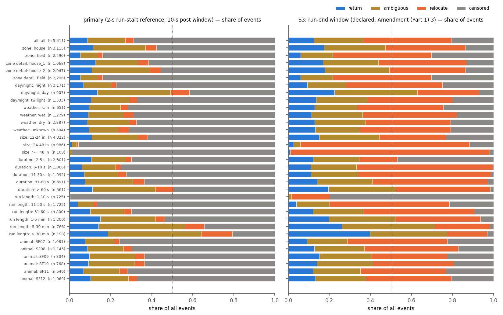
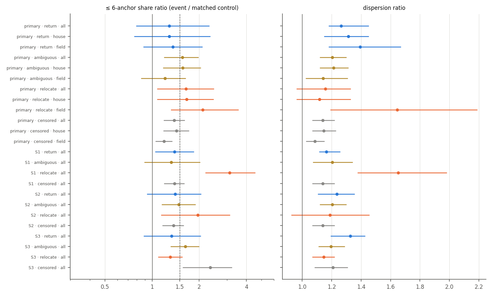
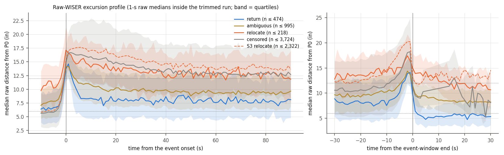

# WISER baseline 2026c — I1 return test: does WISER come back after an I1 event?

- **Status:** measurement report, 2026-10-05. Plan `implementation_plan/2026-10-05-wiser-i1-return-test-and-video-review.md` Part 1 (approved by the user 2026-10-05; committed d722ec0 before any result; operational details, one ambiguity and one structural property of the classifier in its *Amendment (Part 1) 1*, written before any number of this step; *Amendment (Part 1) 2*, written after the pooled numbers, fixes a profile-rendering bug, adds declared descriptive lines and aligns the verdict reader with Part 2 — no class, threshold or rule changed). Driver `wiser/scripts/analyze_wiser_i1_return.py`, config `wiser/configs/wiser_i1_return_2026c.json` (reading in `reading`), run `D:\Field2026_analysis_out\2026c\wiser_i1_return_20261005_2236`, git `173f610+dirty`. Input: the consistency audit's V3 I1 events and matched controls (`D:/Field2026_analysis_out/2026c/wiser_imu_consistency_20261005_2038`).
- **What this is:** for each of the audit's V3 I1 events (the V3 track moves ≥ 12 in during a stretch the head IMU never calls locomotion), the raw-fix position after the excursion is compared with the raw-fix position at the start of the run. A **return** (< 6 in) is read as WISER error, a **relocate** (≥ 12 in) as a real relocation, 6–12 in as ambiguous; **censored** = no valid post window inside the run. **No correction is applied and no behavioural claim is made.** Frame: WISER native inches, unverified offset origin (distances only).
- **Regime context (regime-aware-wiser-tracking):** the premise is that WISER's error is bounded and mean-reverting (certified stillness: per-fix RMS 5.6 in, worst 10-s median a median 1.5 in, ≥ 12 in for ≥ 10 s 3 times in 75 still-hours — measured mostly in the houses). A rat can also walk away and come back inside one run (a *return* that was real movement), and the head IMU's locomotion class has TPR 0.75 / FPR 0.15. The video verdicts of Part 2 are the ground truth for this classifier (§6).

## Pre-registered reading

| Quantity (primary classes, pooled) | value | rule | met |
|---|---|---|---|
| events: return / ambiguous / relocate / censored | 474 / 995 / 218 / 3,724 (of 5,411) | | |
| return share of the classifiable (non-censored) events | 28.1 % (n 1,687) | ≥ 50 % | no |
| ≤ 6-anchor share ratio of the return class, ρ_S [95 % CI] | 1.28 [0.79, 2.30] | ≥ 1.5 | no |
| its CI lower bound | 0.79 | > 1 | no |
| … and above the relocate class's ρ_S | relocate 1.65 [1.08, 2.47] (n 213 with controls) | CI_lo(return) > ρ_S(relocate) | no |
| (information) looser reading: ρ_S(return) > ρ_S(relocate) | | | no |

**Reading: NOT ESTABLISHED (otherwise branch)** → V3 stays, no correction. (Plan's label for this branch: *I1 is mainly real movement the IMU missed*.)

**Structural caveat — read with the reading (Amendment (Part 1) 3).** The audit's I1 window contains every second of the run whose V3 1-s median is ≥ 12 in from the run reference, so after $t_{\rm end}$ the V3 track is by construction back within 12 in. Verified: on all 1,687 classifiable events the V3 displacement over the post window stays below 12 in (max 11.9995 in). Hence a shift held until the IMU next reports locomotion is **censored**, never *relocate*, and the primary *relocate* class only collects events whose raw median sits ≥ 12 in from the raw start while the V3 track is < 12 in from its own reference (raw-vs-V3 differences; raw $\mathbf P_0$ vs V3 reference: median 1.64 in, p90 5.12 in). The primary relocate events are borderline (D median 13.3 in). The post window also starts at the first second below 12 in, i.e. on the excursion's tail. The ≥ 50 %-of-classifiable condition therefore compares a full return with a partial (6–12 in) one, not with a persistent relocation, and the relocate comparison rests on a class made of raw-vs-V3 differences. The declared run-end sensitivity S3 (§5) classes the persistent shifts; no rule uses it.

## Reading

- **Primary, all 5,411 events:** return 8.8 %, ambiguous 18.4 %, relocate 4.0 %, censored 68.8 %. **Excluding censored** (1,687): return 28.1 %, ambiguous 59.0 %, relocate 12.9 %.
- **S3 (run-end window; declared):** return 12.5 %, ambiguous 23.9 %, relocate 42.9 %, censored 20.6 %; excluding censored (4,294): return 15.8 %, ambiguous 30.1 %, relocate 54.1 %. Of the 3,724 primary-censored events, S3 classes 2,146 relocate, 424 ambiguous, 57 return and leaves 1,097 censored (§5).
- **≤ 6-anchor enrichment by primary class** (ρ_S [95 % CI]): return 1.28 [0.79, 2.30] (n 466); ambiguous 1.56 [1.20, 1.97] (n 981); relocate 1.65 [1.08, 2.47] (n 213); censored 1.38 [1.19, 1.61] (n 3,718). S3: return 1.33 [0.89, 2.04]; ambiguous 1.63 [1.32, 1.99]; relocate 1.30 [1.10, 1.55]; censored 2.35 [1.58, 3.22].
- **Dispersion ratio by primary class** (ρ_D [CI]): return 1.26 [1.18, 1.45]; ambiguous 1.20 [1.12, 1.30]; relocate 1.16 [0.96, 1.33]; censored 1.14 [1.07, 1.22]. No class stands out as bad geometry: every class's ≤ 6-anchor ratio is of the order of the audit's pooled I1 value (1.43), and the return class is the least enriched.
- **Sensitivities (§5):** S1 (10-s pre-onset reference) return 66.6 % of the classifiable (1,594), ρ_S(return) 1.39 [1.05, 1.84], ρ_S(relocate) 3.13 [2.20, 4.53]; S2 (30-s post window) return 32.4 %; S3 return 15.8 %. Evaluated on each variant's classes (information only), the reading rule is primary not met, S1 not met, S2 not met, S3 not met. S1 differs from the primary because 10 s before the onset the raw position is already a median 6.4–7.1 in from the run-start position (return / ambiguous classes): after the excursion WISER comes back near where it was just before the onset, which is itself away from where the run started.
- **The larger events persist:** 95.7 % of the 24-48 in and 99.0 % of the >= 48 in events are censored (they run to the end of the run); under S3, 93.4 % and 99.0 % of their classifiable events end ≥ 12 in from the start. Runs ≤ 10 s are 99.7 % censored; in runs > 30 min S3 return is 41.1 % of the classifiable.
- **Excursion profiles (§4):** the median raw distance from P0 is 5.6–7.1 in 10 s before the onset (1-s raw medians are noisy and the position has wandered since the run start) and peaks at 14.2–16.7 in 1–2 s after it; the return class falls back to 7.0 in by +15 s (7.6 in at +60 s), while the S3-relocate events stay at 15.4 in at +30 s and 13.6 in at +90 s (events still inside their run).
- Class shares by stratum: §2; enrichment within zone: §3; excursion profiles: §4; sensitivities: §5; video validation: §6.

Classification (regime-aware-wiser-tracking): a **measurement** result about WISER and the head IMU (no behavioural content). Classes are candidate explanations of I1 events, not confirmed errors or movements.

## 1. Coverage and reproduction

| animal | track days | fixes (unmasked) | masked fixes | V3 I1 events | τ* (ms) |
|---|---|---|---|---|---|
| SF07 | 14 | 3,462,035 | 322,647 | 1,081 | 200 |
| SF08 | 14 | 3,494,485 | 347,641 | 1,143 | 150 |
| SF09 | 14 | 3,473,769 | 342,204 | 804 | 100 |
| SF10 | 14 | 3,507,128 | 341,220 | 768 | 200 |
| SF11 | 9 | 1,888,684 | 193,901 | 546 | 150 |
| SF12 | 13 | 3,483,119 | 295,025 | 1,069 | 150 |
| **all** | 78 | 19,309,220 | 1,842,638 | **5,411** | |

**Reproduction of the audit's events from the production V3 track** (5,411 events, 5,411 evaluable): max |Δ reference| 0.00e+00 in, max |Δ size| 3.55e-15 in, onset mismatches 0, window-end mismatches 0, duration mismatches 0, runs without 2 consecutive ≥ 12-in seconds 0 → **PASS** (time base and fix set as in the audit).

Censoring reasons (primary): fixes<10 75, window<5s 3,649 (`window<5s` = the event window ends < 5 s before the end of the trimmed run — exactly at its end for 2,760 events; `fixes<10` = a ≥ 5-s window with < 10 raw fixes).

## 2. Class shares (primary)

Left: primary; right: S3 (run-end window, declared). Bars = share of all events; dotted line = 50 %.

| stratum | level | events | return | ambiguous | relocate | censored | classifiable | return (excl. censored) | ambiguous (excl.) | relocate (excl.) |
|---|---|---|---|---|---|---|---|---|---|---|
| all | all | 5,411 | 8.8 % | 18.4 % | 4.0 % | 68.8 % | 1,687 | 28.1 % | 59.0 % | 12.9 % |
| zone | house | 3,115 | 11.4 % | 25.6 % | 5.3 % | 57.7 % | 1,319 | 26.9 % | 60.5 % | 12.6 % |
| zone | field | 2,296 | 5.2 % | 8.6 % | 2.3 % | 84.0 % | 368 | 32.3 % | 53.5 % | 14.1 % |
| zone detail | house_1 | 1,068 | 12.5 % | 20.8 % | 5.2 % | 61.5 % | 411 | 32.4 % | 54.0 % | 13.6 % |
| zone detail | house_2 | 2,047 | 10.8 % | 28.1 % | 5.4 % | 55.6 % | 908 | 24.4 % | 63.4 % | 12.1 % |
| zone detail | field | 2,296 | 5.2 % | 8.6 % | 2.3 % | 84.0 % | 368 | 32.3 % | 53.5 % | 14.1 % |
| day/night | night | 3,171 | 6.8 % | 13.3 % | 2.6 % | 77.3 % | 721 | 29.8 % | 58.7 % | 11.5 % |
| day/night | day | 907 | 13.5 % | 35.7 % | 9.2 % | 41.7 % | 529 | 23.1 % | 61.2 % | 15.7 % |
| day/night | twilight | 1,333 | 10.3 % | 18.6 % | 3.9 % | 67.2 % | 437 | 31.4 % | 56.8 % | 11.9 % |
| weather | rain | 651 | 9.5 % | 15.2 % | 3.7 % | 71.6 % | 185 | 33.5 % | 53.5 % | 13.0 % |
| weather | wet | 1,279 | 9.0 % | 16.9 % | 4.9 % | 69.2 % | 394 | 29.2 % | 54.8 % | 16.0 % |
| weather | dry | 2,887 | 8.4 % | 20.6 % | 3.5 % | 67.5 % | 937 | 25.8 % | 63.5 % | 10.7 % |
| weather | unknown | 594 | 9.3 % | 14.3 % | 5.2 % | 71.2 % | 171 | 32.2 % | 49.7 % | 18.1 % |
| size | 12-24 in | 4,322 | 10.7 % | 22.5 % | 4.8 % | 62.0 % | 1,644 | 28.2 % | 59.1 % | 12.7 % |
| size | 24-48 in | 986 | 1.0 % | 2.3 % | 0.9 % | 95.7 % | 42 | 23.8 % | 54.8 % | 21.4 % |
| size | >= 48 in | 103 | 0.0 % | 1.0 % | 0.0 % | 99.0 % | 1 | 0.0 % | 100.0 % | 0.0 % |
| duration | 2-5 s | 2,301 | 10.4 % | 16.5 % | 3.2 % | 69.9 % | 692 | 34.7 % | 54.8 % | 10.5 % |
| duration | 6-10 s | 1,066 | 6.1 % | 16.3 % | 2.5 % | 75.0 % | 266 | 24.4 % | 65.4 % | 10.2 % |
| duration | 11-30 s | 1,092 | 7.1 % | 16.3 % | 4.2 % | 72.3 % | 302 | 25.8 % | 58.9 % | 15.2 % |
| duration | 31-60 s | 391 | 7.4 % | 23.3 % | 5.6 % | 63.7 % | 142 | 20.4 % | 64.1 % | 15.5 % |
| duration | > 60 s | 561 | 11.1 % | 30.8 % | 8.9 % | 49.2 % | 285 | 21.8 % | 60.7 % | 17.5 % |
| run length | 1-10 s | 725 | 0.1 % | 0.0 % | 0.1 % | 99.7 % | 2 | 50.0 % | 0.0 % | 50.0 % |
| run length | 11-30 s | 1,722 | 3.9 % | 7.4 % | 1.9 % | 86.7 % | 229 | 29.7 % | 55.9 % | 14.4 % |
| run length | 31-60 s | 800 | 10.1 % | 16.4 % | 3.6 % | 69.9 % | 241 | 33.6 % | 54.4 % | 12.0 % |
| run length | 1-5 min | 1,200 | 14.9 % | 27.0 % | 4.3 % | 53.8 % | 555 | 32.3 % | 58.4 % | 9.4 % |
| run length | 5-30 min | 766 | 14.1 % | 42.0 % | 9.5 % | 34.3 % | 503 | 21.5 % | 64.0 % | 14.5 % |
| run length | > 30 min | 198 | 18.7 % | 45.5 % | 15.2 % | 20.7 % | 157 | 23.6 % | 57.3 % | 19.1 % |
| run subtype | any_active | 5,411 | 8.8 % | 18.4 % | 4.0 % | 68.8 % | 1,687 | 28.1 % | 59.0 % | 12.9 % |
| animal | SF07 | 1,081 | 7.6 % | 14.1 % | 2.6 % | 75.8 % | 262 | 31.3 % | 58.0 % | 10.7 % |
| animal | SF08 | 1,143 | 8.7 % | 17.6 % | 4.2 % | 69.6 % | 348 | 28.4 % | 57.8 % | 13.8 % |
| animal | SF09 | 804 | 9.6 % | 22.1 % | 4.7 % | 63.6 % | 293 | 26.3 % | 60.8 % | 13.0 % |
| animal | SF10 | 768 | 9.1 % | 22.4 % | 4.9 % | 63.5 % | 280 | 25.0 % | 61.4 % | 13.6 % |
| animal | SF11 | 546 | 6.8 % | 17.4 % | 3.8 % | 72.0 % | 153 | 24.2 % | 62.1 % | 13.7 % |
| animal | SF12 | 1,069 | 10.2 % | 18.4 % | 4.2 % | 67.2 % | 351 | 31.1 % | 56.1 % | 12.8 % |

**Return distance D (primary, in):** classifiable (n 1,687) p10 3.6, p50 8.2, p90 12.5; return (n 474) p10 1.8, p50 4.4, p90 5.6; ambiguous (n 995) p10 6.7, p50 8.9, p90 11.2; relocate (n 218) p10 12.3, p50 13.3, p90 18.6.

## 3. Enrichment of each class's event windows vs the audit's matched controls

Dots = ratio event / control, bars = 95 % block-bootstrap CI; ≤ 6-anchor panel on a log scale, the reading's 1.5 dashed. Event window = the audit's I1 window (its ≥ 12-in seconds); controls = the audit's matched controls of those events.

| variant | class | zone | events (with controls / all) | controls | ≤ 6 share event | ≤ 6 share control | ρ_S [CI] | dispersion event / control (in) | ρ_D [CI] | ρ_F [CI] |
|---|---|---|---|---|---|---|---|---|---|---|
| primary | return | all | 466 / 474 | 2,249 | 20.2 % | 15.7 % | 1.28 [0.79, 2.30] | 3.35 / 2.65 | 1.26 [1.18, 1.45] | 1.15 [1.12, 1.18] |
| primary | return | house | 347 / 355 | 1,360 | 20.6 % | 16.0 % | 1.29 [0.77, 2.35] | 3.35 / 2.55 | 1.31 [1.15, 1.45] | 1.14 [1.12, 1.17] |
| primary | return | field | 97 / 119 | 225 | 14.7 % | 10.9 % | 1.36 [0.88, 2.09] | 4.95 / 3.55 | 1.39 [1.18, 1.67] | 1.18 [1.12, 1.24] |
| primary | ambiguous | all | 981 / 995 | 4,705 | 16.2 % | 10.3 % | 1.56 [1.20, 1.97] | 2.95 / 2.45 | 1.20 [1.12, 1.30] | 1.14 [1.13, 1.15] |
| primary | ambiguous | house | 779 / 798 | 3,207 | 16.3 % | 10.4 % | 1.56 [1.18, 2.03] | 2.85 / 2.35 | 1.21 [1.12, 1.31] | 1.14 [1.13, 1.15] |
| primary | ambiguous | field | 170 / 197 | 433 | 16.4 % | 13.6 % | 1.21 [0.86, 1.63] | 4.05 / 3.55 | 1.14 [1.03, 1.31] | 1.20 [1.13, 1.28] |
| primary | relocate | all | 213 / 218 | 1,002 | 18.4 % | 11.2 % | 1.65 [1.08, 2.47] | 2.95 / 2.55 | 1.16 [0.96, 1.33] | 1.14 [1.12, 1.17] |
| primary | relocate | house | 160 / 166 | 658 | 18.4 % | 11.1 % | 1.66 [1.08, 2.46] | 2.85 / 2.55 | 1.12 [0.96, 1.33] | 1.14 [1.12, 1.17] |
| primary | relocate | field | 42 / 52 | 115 | 26.0 % | 12.3 % | 2.10 [1.32, 3.54] | 5.35 / 3.25 | 1.65 [1.19, 2.19] | 1.12 [1.03, 1.25] |
| primary | censored | all | 3,718 / 3,724 | 18,458 | 17.5 % | 12.6 % | 1.38 [1.19, 1.61] | 3.25 / 2.85 | 1.14 [1.07, 1.22] | 1.16 [1.14, 1.17] |
| primary | censored | house | 1,722 / 1,796 | 5,641 | 18.3 % | 12.7 % | 1.43 [1.18, 1.71] | 3.15 / 2.75 | 1.15 [1.07, 1.23] | 1.15 [1.13, 1.17] |
| primary | censored | field | 1,834 / 1,928 | 5,219 | 14.0 % | 11.8 % | 1.19 [1.06, 1.34] | 3.75 / 3.45 | 1.09 [1.03, 1.15] | 1.18 [1.16, 1.20] |
| S1_pre10 | return | all | 1,050 / 1,062 | 5,077 | 15.1 % | 10.9 % | 1.39 [1.05, 1.84] | 2.85 / 2.45 | 1.16 [1.12, 1.26] | 1.15 [1.14, 1.16] |
| S1_pre10 | ambiguous | all | 451 / 459 | 2,134 | 16.6 % | 12.5 % | 1.32 [0.90, 2.01] | 2.95 / 2.45 | 1.20 [1.08, 1.34] | 1.14 [1.13, 1.15] |
| S1_pre10 | relocate | all | 67 / 73 | 285 | 33.5 % | 10.7 % | 3.13 [2.20, 4.53] | 4.05 / 2.45 | 1.65 [1.38, 1.98] | 1.13 [1.08, 1.20] |
| S1_pre10 | censored | all | 3,810 / 3,817 | 18,918 | 17.7 % | 12.7 % | 1.39 [1.20, 1.60] | 3.25 / 2.85 | 1.14 [1.07, 1.22] | 1.15 [1.14, 1.17] |
| S2_post30 | return | all | 548 / 556 | 2,620 | 21.6 % | 15.4 % | 1.40 [0.93, 2.04] | 3.15 / 2.55 | 1.24 [1.11, 1.35] | 1.15 [1.13, 1.18] |
| S2_post30 | ambiguous | all | 982 / 997 | 4,723 | 15.2 % | 10.3 % | 1.48 [1.16, 1.88] | 2.95 / 2.45 | 1.20 [1.12, 1.30] | 1.14 [1.13, 1.15] |
| S2_post30 | relocate | all | 160 / 164 | 750 | 23.9 % | 12.2 % | 1.96 [1.15, 3.13] | 3.15 / 2.65 | 1.19 [0.93, 1.45] | 1.14 [1.11, 1.18] |
| S2_post30 | censored | all | 3,688 / 3,694 | 18,321 | 17.1 % | 12.5 % | 1.37 [1.17, 1.58] | 3.25 / 2.85 | 1.14 [1.07, 1.22] | 1.16 [1.14, 1.17] |
| S3_runend | return | all | 664 / 678 | 3,161 | 18.1 % | 13.6 % | 1.33 [0.89, 2.04] | 3.25 / 2.45 | 1.33 [1.20, 1.43] | 1.15 [1.13, 1.17] |
| S3_runend | ambiguous | all | 1,282 / 1,294 | 6,213 | 18.9 % | 11.6 % | 1.63 [1.32, 1.99] | 3.05 / 2.55 | 1.20 [1.11, 1.29] | 1.14 [1.13, 1.15] |
| S3_runend | relocate | all | 2,315 / 2,322 | 11,473 | 16.0 % | 12.3 % | 1.30 [1.10, 1.55] | 3.15 / 2.75 | 1.15 [1.07, 1.22] | 1.16 [1.15, 1.17] |
| S3_runend | censored | all | 1,117 / 1,117 | 5,567 | 26.2 % | 11.1 % | 2.35 [1.58, 3.22] | 4.05 / 3.35 | 1.21 [1.09, 1.31] | 1.09 [1.03, 1.15] |

## 4. Raw-WISER excursion profiles

| class (primary) | onset −5 s | onset +5 s | onset +15 s | onset +30 s | onset +60 s | end −5 s | end +5 s | end +20 s |
|---|---|---|---|---|---|---|---|---|
| return | 6.6 (n 401) | 9.2 (n 406) | 7.0 (n 334) | 8.5 (n 268) | 7.6 (n 203) | 10.1 (n 412) | 4.8 (n 378) | 5.7 (n 207) |
| ambiguous | 7.8 (n 820) | 11.1 (n 847) | 10.0 (n 695) | 10.0 (n 597) | 9.2 (n 485) | 11.7 (n 842) | 9.4 (n 802) | 8.5 (n 435) |
| relocate | 10.2 (n 178) | 14.8 (n 186) | 13.7 (n 146) | 13.0 (n 125) | 12.1 (n 113) | 15.1 (n 186) | 14.3 (n 164) | 11.9 (n 90) |
| censored | 5.8 (n 2,593) | 16.2 (n 2,139) | 15.6 (n 1,106) | 14.0 (n 725) | 12.9 (n 451) | 14.0 (n 3,209) | 9.4 (n 4) | 6.7 (n 7) |
| S3 relocate | 6.1 (n 1,638) | 17.6 (n 1,867) | 16.9 (n 946) | 15.4 (n 618) | 13.6 (n 378) | 18.4 (n 2,030) | 13.4 (n 125) | 14.6 (n 35) |

Median raw distance from $\mathbf P_0$ (in) over the events with a 1-s raw median at that second inside the trimmed run (n in brackets; full table `tables/profiles.csv`).

## 5. Sensitivities

| variant | return | ambiguous | relocate | censored | return (excl. censored) | relocate (excl.) | ρ_S return [CI] | ρ_S relocate [CI] |
|---|---|---|---|---|---|---|---|---|
| primary (2-s run-start reference, 10-s post window) | 8.8 % | 18.4 % | 4.0 % | 68.8 % | 28.1 % | 12.9 % | 1.28 [0.79, 2.30] | 1.65 [1.08, 2.47] |
| S1: 10-s pre window before the onset | 19.6 % | 8.5 % | 1.3 % | 70.5 % | 66.6 % | 4.6 % | 1.39 [1.05, 1.84] | 3.13 [2.20, 4.53] |
| S2: 30-s post window | 10.3 % | 18.4 % | 3.0 % | 68.3 % | 32.4 % | 9.6 % | 1.40 [0.93, 2.04] | 1.96 [1.15, 3.13] |
| S3: run-end window (declared, Amendment (Part 1) 3) | 12.5 % | 23.9 % | 42.9 % | 20.6 % | 15.8 % | 54.1 % | 1.33 [0.89, 2.04] | 1.30 [1.10, 1.55] |

**Primary class (rows) × S3 class (columns):**

| primary \ S3 | return | ambiguous | relocate | censored |
|---|---|---|---|---|
| return | 324 | 136 | 9 | 5 |
| ambiguous | 263 | 666 | 56 | 10 |
| relocate | 34 | 68 | 111 | 5 |
| censored | 57 | 424 | 2,146 | 1,097 |

S3 censoring reasons: fixes<10 56, window<5s 1,061 (an onset < 5 s before the run end, or < 10 fixes).

**S3 shares by stratum** (share of all events; excl. censored in brackets):

| stratum | level | events | return | ambiguous | relocate | censored |
|---|---|---|---|---|---|---|
| all | all | 5,411 | 12.5 % (15.8 %) | 23.9 % (30.1 %) | 42.9 % (54.1 %) | 20.6 % |
| zone | house | 3,115 | 17.4 % (20.1 %) | 30.0 % (34.7 %) | 39.1 % (45.2 %) | 13.6 % |
| zone | field | 2,296 | 6.0 % (8.6 %) | 15.7 % (22.5 %) | 48.1 % (69.0 %) | 30.2 % |
| day/night | night | 3,171 | 9.3 % (12.3 %) | 18.8 % (25.0 %) | 47.1 % (62.7 %) | 24.9 % |
| day/night | day | 907 | 22.5 % (24.2 %) | 40.5 % (43.5 %) | 30.0 % (32.3 %) | 7.1 % |
| day/night | twilight | 1,333 | 13.5 % (16.8 %) | 24.9 % (31.1 %) | 41.8 % (52.1 %) | 19.8 % |
| size | 12-24 in | 4,322 | 15.1 % (19.6 %) | 29.2 % (38.0 %) | 32.6 % (42.4 %) | 23.1 % |
| size | 24-48 in | 986 | 2.5 % (2.9 %) | 3.2 % (3.7 %) | 82.5 % (93.4 %) | 11.8 % |
| size | >= 48 in | 103 | 1.0 % (1.0 %) | 0.0 % (0.0 %) | 97.1 % (99.0 %) | 1.9 % |
| duration | 2-5 s | 2,301 | 12.1 % (22.7 %) | 22.5 % (42.3 %) | 18.6 % (35.0 %) | 46.8 % |
| duration | 6-10 s | 1,066 | 10.9 % (10.9 %) | 22.2 % (22.3 %) | 66.5 % (66.8 %) | 0.4 % |
| duration | 11-30 s | 1,092 | 11.0 % (11.1 %) | 22.9 % (23.2 %) | 64.7 % (65.6 %) | 1.4 % |
| duration | 31-60 s | 391 | 14.1 % (14.5 %) | 26.9 % (27.6 %) | 56.3 % (57.9 %) | 2.8 % |
| duration | > 60 s | 561 | 19.4 % (19.7 %) | 33.0 % (33.5 %) | 46.0 % (46.7 %) | 1.6 % |
| run length | 1-10 s | 725 | 0.0 % (0.0 %) | 1.5 % (7.5 %) | 18.8 % (92.5 %) | 79.7 % |
| run length | 11-30 s | 1,722 | 3.8 % (4.9 %) | 16.2 % (20.6 %) | 58.5 % (74.5 %) | 21.5 % |
| run length | 31-60 s | 800 | 11.9 % (13.1 %) | 24.5 % (27.0 %) | 54.4 % (59.9 %) | 9.2 % |
| run length | 1-5 min | 1,200 | 19.8 % (21.1 %) | 32.3 % (34.5 %) | 41.6 % (44.4 %) | 6.3 % |
| run length | 5-30 min | 766 | 26.2 % (26.7 %) | 45.2 % (45.9 %) | 26.9 % (27.4 %) | 1.7 % |
| run length | > 30 min | 198 | 39.9 % (41.1 %) | 37.4 % (38.5 %) | 19.7 % (20.3 %) | 3.0 % |

## 6. Validation against the user's video verdicts (Part 2)

**Pending.** The video verdicts do not exist yet. When the Part-2 export is in `wiser/configs/wiser_event_review_2026c/`, run `python wiser/scripts/analyze_wiser_i1_return.py --with-verdicts wiser/configs/wiser_event_review_2026c/ --run D:/Field2026_analysis_out/2026c/wiser_i1_return_20261005_2236`: it matches the verdicts to these events, writes the confusion table (class × moved / stayed / cannot tell) and Cohen's κ (return ↔ stayed, relocate ↔ moved), and re-renders this report. Part 2 chose its events without these classes.

## 7. Caveats

- The structural property above: persistent shifts are censored in the primary; S3 classes them but no rule uses it, and S3 cannot tell a persistent shift from a WISER excursion that is still out when the run ends (both end ≥ 12 in away).
- Mean-reversion was measured mostly in the houses during certified stillness; outside it a WISER bias may persist longer, and a rat can walk away and return within one run (a *return* that was movement) — the video verdicts check both.
- Enrichment is circumstantial evidence; the ≤ 6-anchor fixes are also more common in the houses (within-zone rows in §3).
- The 6 / 12-in thresholds and the 5-s / 10-fix minimums were fixed in advance and are not tuned; positions are in the unverified WISER inch frame.

## Definitions

All positions in the WISER native **inch** frame (UNVERIFIED offset origin; only distances are used). Times are aligned
seconds $t^{\rm al} = t_{\rm WISER} - \tau^*_a$ (the field-PC / IMU clock; $\tau^*$ per animal from the production tracks);
lists give field-PC time. Symbols: an event $e$ of the audit (V3, I1) with trimmed run $[t^{e}_{r0}, t^{e}_{r1})$, onset
$t^{e}_{\rm on}$ and window end $t^{e}_{\rm end}$ (integer seconds); $k$ a raw fix with aligned time $t_k$, position
$\mathbf z_k = (x^{\rm raw}_k, y^{\rm raw}_k)$ and anchors $A_k$; only fixes with none of the masks `m_handling`, `m_silence`,
`m_tag_validity`, `m_adc_lane`, `m_off_animal` (the audit's fix set). $\operatorname{med}_{\rm c}$ = coordinate-wise median.

### The audit's I1 event (input, not redefined)
Run = maximal stretch of included seconds with IMU state still / active, ≥ 5 s, trimmed 2 s at both ends; $\tilde{\mathbf p}(s)$ =
$\operatorname{med}_{\rm c}$ of the V3 track at the fixes in $[s, s+1)$ (≥ 2 fixes); reference $\mathbf r$ = $\operatorname{med}_{\rm c}$ of
$\tilde{\mathbf p}$ over the first 2 s of the trimmed run; $d(s) = \lVert\tilde{\mathbf p}(s) - \mathbf r\rVert$; event iff $d \ge 12$ in for
≥ 2 consecutive seconds; window $W_e = \{s : d(s) \ge 12\}$ (inside the trimmed run); $t_{\rm on} = \min W_e$, $t_{\rm end} = \max W_e + 1$;
size $= \max_s d(s)$; duration $= |W_e|$ (s). **Text:** the V3 track moves ≥ 12 in from where the run started while the head IMU
never reports locomotion (consistency audit, `change_log/2026-10-05-wiser-imu-consistency.md`).

### Window median and validity
$$ \mathbf M[a, b) = \operatorname{med}_{\rm c}\{\mathbf z_k : t_k \in [a, b)\}, \qquad n[a,b) = \#\{k : t_k \in [a, b)\} $$
A post (or S1 pre) window is **valid** iff $b - a \ge 5$ s and $n[a, b) \ge 10$ fixes. **Text:** a robust position estimate from the
raw fixes alone (no smoother), required to rest on ≥ 5 s and ≥ 10 fixes. Thresholds 5 s / 10 fixes fixed in the plan **[op]**.

### Start and end positions ($\mathbf P_0$, $\mathbf P_1$)
$$ \mathbf P_0 = \mathbf M[t_{r0}, t_{r0} + 2), \qquad \mathbf P_1 = \mathbf M[t_{\rm end}, \min(t_{\rm end} + 10, t_{r1})) $$
**Text:** $\mathbf P_0$ = where WISER put the animal at the start of the run (the I1 reference window, raw fixes; ≥ 2 fixes);
$\mathbf P_1$ = where WISER puts it in the 10 s after the excursion's last ≥ 12-in second, inside the same no-locomotion run. Units in.

### Return distance and classes
$$ D = \lVert \mathbf P_1 - \mathbf P_0 \rVert, \qquad \text{class} = \begin{cases} \text{censored} & \text{post window not valid} \\ \text{return} & D < 6 \\ \text{ambiguous} & 6 \le D < 12 \\ \text{relocate} & D \ge 12 \end{cases} $$
**Text:** return = WISER came back to within 6 in of where it was (WISER error under the mean-reversion premise); relocate = it
settled ≥ 12 in away (a real relocation); ambiguous between; censored = no valid post window inside the run (the event runs into
the run end / next locomotion). Thresholds 6 / 12 in fixed in advance (≈ the 7-in jitter floor / the I1 threshold).
**Structural property (Amendment (Part 1) 3):** since $W_e$ holds every second with $d \ge 12$, $d(s) < 12$ on every second of the
primary post window; a shift held until the run end is therefore censored, and *relocate* arises only where the raw median
differs from V3 (or $\mathbf P_0$ from $\mathbf r$) by several inches.

### Sensitivities
S1: $\mathbf P_0^{(1)} = \mathbf M[\max(t_{\rm on} - 10, t_{r0}), t_{\rm on})$ (valid as above), with the primary $\mathbf P_1$. S2:
$\mathbf P_1^{(2)} = \mathbf M[t_{\rm end}, \min(t_{\rm end} + 30, t_{r1}))$ (same censored set as the primary). S3 (declared, no rule uses it):
$\mathbf P_1^{(3)} = \mathbf M[\max(t_{\rm on}, t_{r1} - 10), t_{r1})$ — where WISER is in the last 10 s before the IMU next reports
locomotion. Same classes and minimums. **Text:** S1 tests the start reference, S2 the post-window length, S3 classes the shifts
that persist to the end of the run (which the primary censors).

### Class shares
$$ s_c = \frac{n_c}{n_{\rm events}}, \qquad s^{\rm cl}_c = \frac{n_c}{n_{\rm return} + n_{\rm ambiguous} + n_{\rm relocate}} \quad (c \ne \text{censored}) $$
**Text:** share of all events, and share of the classifiable (non-censored) events, per stratum (the event's onset second for
zone / day-night / weather, as in the audit; bands of size, duration and trimmed run length; animal).

### Enrichment of a class (the audit's estimator, imported unmodified)
For the events $e$ of class $c$ that have matched controls (the audit's: same animal and bio-day, event-free evaluable runs of
trimmed length within $[0.5, 2]\times$, up to 5, weight $\omega = 1/k_e$), with window fix counts $n_w$, ≤ 6-anchor counts $n^{\le 6}_w$:
$$ \rho_S(c) = \frac{\sum_{e \in c} n^{\le 6}_{W_e} / \sum_{e \in c} n_{W_e}}{\sum_{w \in {\rm ctrl}(c)} \omega_w n^{\le 6}_w / \sum_{w \in {\rm ctrl}(c)} \omega_w n_w}, \qquad
   \rho_D(c) = \frac{\operatorname{wmed}\{\delta_k\}_{W_e,\, e \in c}}{\operatorname{wmed}\{\delta_k\}_{{\rm ctrl}(c)}} $$
$\delta_k = \lVert \mathbf z_k - \tilde{\mathbf p}_{\rm raw}(\lfloor t_k \rfloor)\rVert$ = raw-fix dispersion about its 1-s raw median (in). The fix-rate ratio
$\rho_F$ (fixes per second) is shown for information (it carries the audit's Amendment-2 window-construction asymmetry). CI: 2.5–97.5
percentiles of a block bootstrap (block = animal × 10-min field-PC bin of the window onset; events and controls resampled together;
1000 replicates). **Text:** $\rho_S > 1$ = the class's event windows hold more bad-geometry (≤ 6-anchor) fixes than matched windows —
circumstantial evidence that the class is WISER error.

### Pre-registered reading
$$ \text{dominates} \iff s^{\rm cl}_{\rm return} \ge 0.5 \ \wedge\ \rho_S({\rm return}) \ge 1.5 \ \wedge\ \mathrm{CI}_{\rm lo}(\rho_S({\rm return})) > 1 \ \wedge\ \mathrm{CI}_{\rm lo}(\rho_S({\rm return})) > \rho_S({\rm relocate}) $$
(primary classes, pooled; an undefined $\rho_S({\rm relocate})$ = the last condition not met; Amendment (Part 1) 6). **Text:** if
true, WISER in-place wandering dominates I1 → propose V8 as a new pre-registered test; otherwise V3 stays, no correction.

### Excursion profile
$$ \pi_c(u) = \operatorname{med}_{e \in c}\ \lVert \tilde{\mathbf p}_{\rm raw}(t^e_{\rm on} + u) - \mathbf P^e_0 \rVert, \qquad t^e_{\rm on} + u \in [t^e_{r0}, t^e_{r1}) $$
$\tilde{\mathbf p}_{\rm raw}(s)$ = $\operatorname{med}_{\rm c}$ of the raw fixes in $[s, s+1)$ (≥ 2 fixes); quartiles likewise; events without a value at
$u$ drop out ($n$ shown). End-aligned version with $t^e_{\rm end}$. **Text:** how far raw WISER is from the run-start position, second
by second, around the event. Units in.

### Reproduction
For every event, $\mathbf r$, size, duration, $t_{\rm on}$, $t_{\rm end}$ recomputed from the production V3 track with the definition
above and compared with the audit's event table (exact seconds; ≤ 1e-6 in). Also $\max_{s \in {\rm post}} d(s)$ (must be < 12 in on
classifiable events, the structural property) and $\lVert \mathbf P_0 - \mathbf r\rVert$ (raw vs V3 start position).

### Video-verdict agreement (`--with-verdicts`)
With $a_e = [{\rm class}_e = {\rm return}]$, $b_e = [{\rm verdict}_e = {\rm stayed}]$ on the $N$ events with class ∈ {return, relocate} and
verdict ∈ {stayed, moved}: $p_o = \frac1N\sum_e [a_e = b_e]$, $p_e = \bar a \bar b + (1 - \bar a)(1 - \bar b)$,
$$ \kappa = \frac{p_o - p_e}{1 - p_e} $$
CI: 2.5–97.5 percentiles of 1000 event bootstrap replicates. **Text:** agreement of the return / relocate classes with the
user's "stayed in place" / "moved" beyond chance (1 = perfect, 0 = chance). Nothing is re-tuned on the verdicts.

