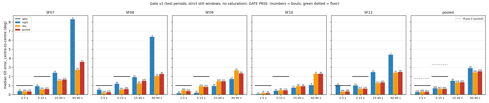
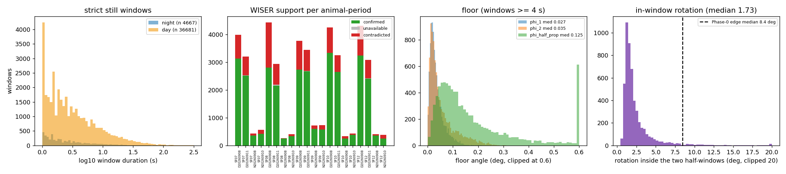
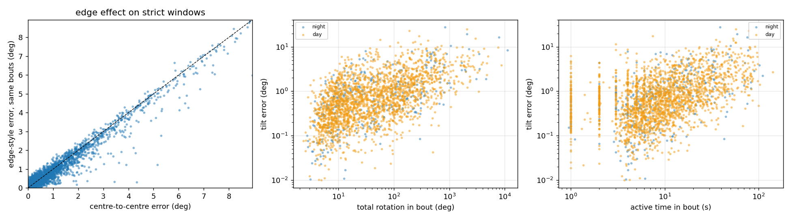
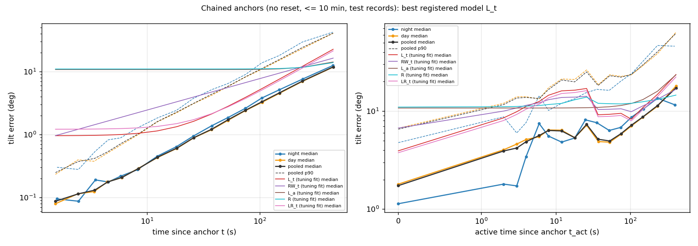
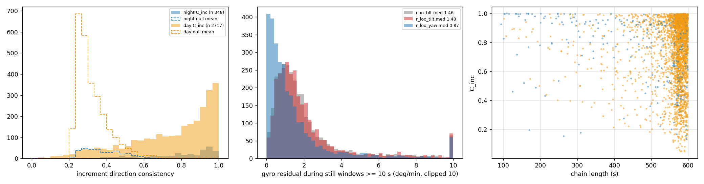
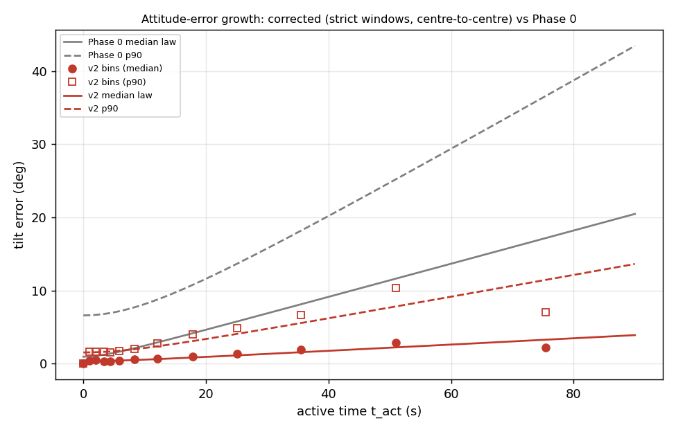

# Head-IMU attitude gate v2 (cohort 2026c): strict accelerometer-led still windows, centre-to-centre propagation, day sleep — **GATE PASS**; drift: **LINEAR IN TIME (bias-like)**

- **Status:** pre-registered in [`implementation_plan/2026-10-01-imu-attitude-gate-v2.md`](../../../../implementation_plan/2026-10-01-imu-attitude-gate-v2.md) (user approval 2026-10-01 "去吧"; two amendments recorded in the plan before the full run: (1) the two-part linearity verdict, from the synthetic self-test; (2) descriptive/exploratory additions after a tuning-only development pass — no rule, threshold or model choice changed). Model choice on the tuning periods (night 2026-09-08/09 + day 2026-09-08) and frozen in `selection.json` before the test periods were read; the gate evaluated once on the test periods (night 2026-09-10/11 + day 2026-09-11) with the Phase-0 thresholds unchanged. IMU attitude only; WISER only as a still-window veto.
- **Follows:** Phase 0 ([`change_log/2026-09-30-imu-attitude-phase0.md`](../../../../change_log/2026-09-30-imu-attitude-phase0.md), report [`wiser_baseline_imu_attitude_phase0_2026c.md`](wiser_baseline_imu_attitude_phase0_2026c.md) §8), whose functions are imported unchanged.
- **Run:** `python wiser/scripts/analyze_imu_attitude_gate_v2.py --cohort 2026c`; bulk `D:\Field2026_analysis_out\2026c\imu_attitude_gate_v2_20261001_0847` (`still_windows.csv.gz`, `bouts_all.csv.gz`, `floor.csv`, `model_selection_cv.csv`, `selection.json`, `fits.json`, `chain_records.csv.gz`, `chain_increments.csv`, `chain_curves.csv`, `bias_residuals.csv`, `growth_*.csv`, `sat_runs.csv.gz`, `human_checks.csv`, `summary.json`, `input_provenance.json`, `log.txt`); pointer `run_manifest_imu_attitude_gate_v2_2026c.json`; config `wiser/configs/imu_attitude_gate_v2_2026c.json` (`fitted` written by this run); git `9dd73e4+dirty`; runtime 12.2 min.
- **New day caches** (same roots and formats as the night caches, never overwriting; README.md written in each root): A1 `imu_raw_cache/<SFxx>/<session>__<start>_<end>.npz` (10 files, 622 MB, index `index_day_2026c.csv`); A3-equivalent `imu100_cache/<SFxx>/day_<date>.npz` (10 files, 823 MB); A2 `wiser_fix_cache/day_<date>/<SFxx>.csv.gz` (10 files, 46.6 MB, index `index_day_2026c.csv`).

## 1. Headline

1. **GATE PASS.** Test night + test day, active strict no-saturation bouts, selected model `scalar`, median centre-to-centre tilt error: **2–5 s 0.30 (0.27–0.32)° (n 812, threshold 1.0°)** and **5–15 s 0.62 (0.59–0.69)° (n 930, threshold 2.0°)**; 5/5 animals pass both bins (≥ 4 required). Floor ($\varphi_{1.0}$, test pooled median) **0.029°**; excess over the floor 0.27° / 0.60°.
   Phase 0 on its own bouts: 1.76° / 3.29° (FAIL). Same thresholds, unchanged.
2. **Information only (never the verdict), 2–5 s / 5–15 s:** night-only 0.27° (n 116) / 0.69° (n 108), 4/5 animals, PASS; day-only 0.31° (n 696) / 0.62° (n 822), 5/5 animals, PASS; without the WISER filter 0.31° (n 1179) / 0.64° (n 968), 5/5 animals, PASS; ≥ 2.0-s windows 0.32° (n 460) / 0.61° (n 660), 5/5 animals, PASS; edge-style propagation on the same bouts 0.30° (n 812) / 0.61° (n 930), 5/5 animals, PASS; 1.03 baseline 0.32° (n 812) / 0.66° (n 930), 5/5 animals, PASS.
3. **Strict still windows (all four periods, 5 animals):** 41,348 windows (night 4,667 in 73.2 valid h, 331 min still; day 36,681 in 90.0 h, 3614 min still). WISER: confirmed 31,370 (76 %), contradicted 9,891 (24 %, dropped), unavailable 87 (0 %, kept). Active bouts between kept ≥ 1-s windows: night 534, day 4,688.
4. **Floor (test, windows ≥ 4 s, n 4228):** $\varphi_{1.0}$ median 0.029° (p90 0.076), $\varphi_{2.0}$ 0.038° (p90 0.142), halves 0.083°, halves gyro-propagated centre-to-centre 0.127° (p90 0.470). Phase-0 floor (adjacent 0.5-s quiet windows) 0.048°.
5. **Model choice (tuning periods, 2-fold CV, pooled held-out median on 2–15 s bouts):** `scalar` 0.348°, `diag` 0.343°, `M` 0.348°, `M_rate` 0.347° → **`scalar`** (frozen before the test periods were read).
6. **Edge effect removed?** Rotation inside the two half-windows that the centre-to-centre test propagates: integrated |ω| median 1.76° (p90 4.29; this sum carries the gyro-noise floor of |ω|), net rotation median 0.37° (p90 0.74), vs 8.45° integrated |ω| in Phase 0's unpropagated 0.5-s edge windows; edge-style minus centre-to-centre error on the same bouts: median -0.042°. Residual error vs drivers (Spearman): rotation 0.55, active time 0.45, inner duration 0.61, in-window rotation 0.12; 1.69° per 100° turned, 0.07° per active second (medians).
7. **Is the drift linear? LINEAR IN TIME (bias-like); shape in clock time: linear (L_t-RW_t +0.2286); in active time: unresolved (L_a-RW_a -0.0309); driver: clock time (L_t beats L_a and R); best registered L_t; increments C_inc 0.82 vs null 0.30.** Held-out test log-likelihood per record (higher = better): `L_t` -3.7800, `LR_t` -3.8111, `LR_a` -3.9078, `RW_t` -4.0085, `RW_a` -4.1229, `L_a` -4.1538, `R` -4.4690. Day records (still-dominated): LINEAR IN TIME (bias-like); night records (active): LINEAR IN TIME (bias-like). Per animal (tuning fit, test LL among L_t / RW_t / L_a / R; no CIs): SF07 best RW_t (L_t − RW_t -0.005); SF08 best L_t (L_t − RW_t +0.203); SF09 best L_a (L_t − RW_t +0.714); SF10 best L_t (L_t − RW_t +0.186); SF12 best R (L_t − RW_t +0.417) — the pooled verdict is not uniform across animals.
8. **Gyro bias residual during still windows ≥ 10 s (test, n 1359):** leave-window-out tilt component median 1.53 °/min (p90 5.55), yaw |median| 0.94 °/min; in-sample (A3 bias) tilt 1.51 °/min. Exploratory anchor-ZARU (bias re-estimated from the anchor's own ≥ 10-s still window, same anchors): pooled median error 10–30 s 0.52 → 0.28°, 30–60 s 1.19 → 0.64°, 60–120 s 2.38 → 1.39°, 300–600 s 10.06 → 8.49° — a local bias update roughly halves the error for the first 1–2 min, then the bias has moved (§8).
9. **Corrected growth law (test bouts, t = active seconds):** $\sigma_\theta(t_{act})=\sqrt{0.30^2+(0.037\,t_{act})^2}$° (R² 0.84); p90 envelope $\sqrt{1.54^2+(0.151\,t_{act})^2}$° — Phase 0: $\sqrt{0.82^2+(0.193\,t)^2}$, p90 $\sqrt{6.61^2+(0.477\,t)^2}$ (k about 5× smaller now). **Over minutes the clock is t, not t_act** (the drift accumulates while the head is still): chain records give $\sigma_\theta(t)=\sqrt{0.78^2+(0.0227\,t)^2}$° (R² 0.99), p90 $\sqrt{3.07^2+(0.0921\,t)^2}$° for t up to 600 s since the last strict still window.
10. **What the PASS does and does not mean.** The bouts between strict still windows are gentle: median total rotation 8° (2–5 s) and 28° (5–15 s), and **no gate-eligible bout contains gyro clipping** (clipping happens in vigorous activity, which never lies between two strict windows ≤ 90 s apart). Restricted to bouts with Θ > 100°, the gate bins give 2-5 s 0.71° (n 18); 5-15 s 0.92° (n 231); with Θ > 400° in 5–15 s 1.86° (n 27). Rotation-matched against Phase 0 (§7), the error is 2–4× smaller for 50–400° of rotation and similar (2–4°) above 400°. The gate therefore says: across the activity that is bracketed by truly still windows, the calibrated gyro holds the vertical to well under the thresholds; it does not show that minutes of vigorous night activity are tracked — over minutes the bias drift (items 7–8, ≈ 2 °/min) dominates. Per the Phase-0 plan the gate decides whether inertial fusion with WISER is worth attempting; with this PASS it is, provided the filter re-estimates the gyro bias at every still window (zero-rate updates) and uses the clock-time growth law above as process noise.

## 2. Definitions

Head frame x nose, y left, z up (`make_imu.S`). 100-Hz samples k, $\Delta t$ = 0.01 s; $\mathbf a_k$ = calibrated accelerometer (A3 / A3-equivalent ellipsoid $D(\mathbf a-\mathbf o)$, m/s²); $\mathbf w_k-\mathbf b_k$ = Phase-0 gyro chain (Hampel → held-reading saturation reconstruction → 40-Hz Butterworth-4 zero-phase → `resample_poly(2,25)` → head frame) minus the A3 running-median bias (°/s); $\boldsymbol\omega_k=M(\mathbf w_k-\mathbf b_k)$ for a gyro model $M$ (rad/s in propagation); $\boldsymbol\omega^{A3}_k=1.03(\mathbf w_k-\mathbf b_k)$ without reconstruction (A3 `gyr`); $g$ = 9.81 m/s². Angles in degrees unless stated.

**Valid sample.** $v_k = [t_k\in\text{analysis window}]\wedge\neg\text{frozen}_k\wedge\neg\text{handling}_k\wedge[t_k<t_{imu\ valid}]$. **Text:** samples that may enter a still window, a bout or a chain. Analysis windows: nights 21:00 → 04:20, days 09-08 08:00 → 18:30 and 09-11 10:00 → 17:30 (field-PC local).

**Candidate block.** block $j$ = samples $[10j,10j+10)$; candidate iff all $v_k$, no `sat_acc`/`sat_gyr`, and $\max_k|\boldsymbol\omega^{A3}_k|<3$ °/s. **Text:** a 0.1-s piece in which the head may be still; the gyro test is auxiliary (3 °/s ≈ 10× the still gyro noise).

**Strict still window $W=[s,e)$.** $\max_{j\in W}\angle(\hat{\mathbf u}_j,\bar{\mathbf m}_W)<0.3^\circ\ \wedge\ \big||\bar{\mathbf m}_W|-g\big|<0.03g,\ \ \bar{\mathbf m}_W=\tfrac1{|W|}\sum_{j\in W}\mathbf m_j,\ \hat{\mathbf u}_j=\mathbf m_j/|\mathbf m_j|$. **Text:** grown greedily left to right over consecutive candidate blocks; closed when the next block would break either condition (that block starts the next window); kept if ≥ 1.0 s (gate) or ≥ 2.0 s (variant). Bounds the in-window rotation to ≈ 0.6°; a slowly rotating head at constant |a| is rejected (self-test).

**Window gravity and centre.** $\hat{\mathbf g}_W=\sum_{k\in W}\mathbf a_k/|\sum_{k\in W}\mathbf a_k|$, $c_W=\lfloor(s+e)/2\rfloor$. **Text:** the measured vertical (head frame) attributed to the window centre.

**WISER support.** span $[s-2\,\mathrm s, e+2\,\mathrm s]$; 1-s bin medians $\mathbf p_k$ of valid unmasked fixes; $\tilde{\mathbf p}$ = coordinate-wise median; available iff ≥ 3 bins and ≥ 50 % of the span's seconds; confirmed iff $\max_k|\mathbf p_k-\tilde{\mathbf p}|\le 6$ in, else contradicted. **Text:** the headstage tag did not move by more than 6 in (inches, WISER frame, unverified origin; IMU↔WISER lag 0.1–0.2 s ignored). Contradicted windows are dropped; unavailable ones kept. WISER cannot see head rotation.

**Floor $\varphi_L$, $\varphi_{half}$, $\varphi_{half,prop}$.** for kept windows with $e-s\ge 4$ s and midpoint $m$: $\varphi_L=\angle(\bar{\mathbf a}_{[m-L,m)},\bar{\mathbf a}_{[m,m+L)})$, L = 1, 2 s; $\varphi_{half}=\angle(\bar{\mathbf a}_{[s,m)},\bar{\mathbf a}_{[m,e)})$; $\varphi_{half,prop}$ = the same after propagating the first half's gravity from its centre to the second half's centre with $\boldsymbol\omega$. **Text:** the error the test reports with zero activity (acc noise + residual micro-motion, + still gyro drift for the propagated version). **Gate floor = pooled test median of $\varphi_{1.0}$.** Cross-orientation acc-calibration residuals (≈ 0.1°) are not included → lower bound.

**Bout, $T_{in}$, $T_{cc}$, active.** consecutive kept windows $W_i,W_{i+1}$ with all $v_k$ on $[c_i,c_{i+1})$; $T_{in}=(s_{i+1}-e_i)\Delta t$, $T_{cc}=(c_{i+1}-c_i)\Delta t$; active iff $\exists k\in[e_i,s_{i+1}):\neg\text{quiet}^{A3}_k$. **Text:** the activity between two strict still windows; binned by $T_{in}$ (2–5, 5–15, 15–40, 40–90 s; Phase-0 `pd.cut` convention); gaps without any A3 non-quiet sample are quasi-still gaps, not bouts.

**Centre-to-centre tilt error $e$.** $\mathbf g_{c_i}=\hat{\mathbf g}_{W_i}$, $\mathbf g_{k+1}=\mathrm{Exp}(-\boldsymbol\omega_k\Delta t)\mathbf g_k$ for $k=c_i..c_{i+1}-1$; $e=\angle(\mathbf g_{c_{i+1}},\hat{\mathbf g}_{W_{i+1}})$. **Text:** how far the gyro alone mis-tracks the vertical from one still window's centre to the next; no motion is left unpropagated at either edge. 0 = perfect; includes the floor.

**Edge-style error $e_{edge}$.** as $e$ but $\hat{\mathbf g}_{W_i}$ placed at $e_i$ and propagated over $[e_i,s_{i+1})$ only. **Text:** Phase 0's construction applied to the same bouts: the difference $e_{edge}-e$ is the edge effect left with strict windows.

**$t_{act}$, $\Theta$, in-window rotation.** $t_{act}=\Delta t\,\#\{k\in[c_i,c_{i+1}):\neg\text{quiet}^{A3}_k\}$; $\Theta=\sum_k|\boldsymbol\omega_k|\Delta t$; in-window rotation $=\sum_{k\in[c_i,e_i)\cup[s_{i+1},c_{i+1})}|\boldsymbol\omega_k|\Delta t$. **Text:** active seconds (s), total head rotation (°), and the rotation inside the two half-windows that Phase 0 left unpropagated (°).

**Saturated bout.** any raw gyro lane $|raw|\ge 32700$ in raw frames $[12.5c_i,12.5c_{i+1})$. **Text:** kept out of the gate; reported with the clipped stream and with Phase-0 reconstruction (treatment ii).

**Gyro models and fit.** scalar $(1+s)I$, diag $\mathrm{diag}(1+d_i)$, M $I+E$, M_rate $(1+c|\mathbf w-\mathbf b|^2/\omega_0^2)(I+E)$, $\omega_0$ = 1000 °/s; $\min\sum_i\rho_H(\boldsymbol\varepsilon_i/f)$, $\boldsymbol\varepsilon_i=\mathbf g_{c_{i+1}}-\hat{\mathbf g}_{W_{i+1}}$, $f$ = 3°. **Text:** Phase 0's models and Huber objective, fitted on tuning active no-sat bouts with 2 ≤ $T_{in}$ ≤ 15 s (night + day pooled per animal).

**Model selection.** 2-fold CV, fold $=\lfloor t_{0}/600\rfloor \bmod 2$ ($t_0$ = bout start, s since the period's window start); an animal contributes held-out errors only if both training folds have ≥ 20 bouts; lowest pooled held-out median wins, ties ≤ 0.05° → fewer parameters. **Text:** chosen on tuning data only and frozen (written to `selection.json`) before any test period was read; 200-draw bootstrap CIs of the selected parameters.

**Gate.** PASS iff $\mathrm{med}(e\mid 2\text{–}5\,s)\le 1.0^\circ\wedge \mathrm{med}(e\mid 5\text{–}15\,s)\le 2.0^\circ$ pooled and in ≥ 4/5 animals; floor clause: a failing bin with median − floor < 0.5° = test at its limit. **Text:** test night + test day, active strict no-saturation bouts, ≥ 1-s windows, WISER-filtered; 1000-draw bootstrap CIs for information. An animal with no bouts in a bin fails it.

**Chain and record.** anchor = kept window, thinned to centres ≥ 30 s apart; $q_{c_A}$ = tilt from $\hat{\mathbf g}_A$ (yaw 0), $q_{k+1}=q_k\otimes\mathrm{Exp}(\boldsymbol\omega_k\Delta t)$, no aiding; ends at $c_A$ + 600 s, an invalid sample, the period end or the first raw gyro saturation (primary); record at each later kept window $j$: $\boldsymbol\phi_j$ = rotation vector of the smallest rotation taking $\mathbf e_z$ to $R(q_{c_j})\hat{\mathbf g}_{W_j}$, $e_j=|\boldsymbol\phi_j|$, with $t$, $t_{act}$, $\Theta$ since the anchor. **Text:** accumulated tilt error without reset, as a horizontal vector in the anchor-initialised world frame (a fixed rotation of the anchor's head frame; its yaw drifts with the gyro).

**Chain models.** per-axis variance $\sigma_\theta^2$: `L_t` $\sigma_0^2+(bt)^2$; `RW_t` $\sigma_0^2+qt$; `R` $\sigma_0^2+(c\Theta)^2$; `LR_t` $\sigma_0^2+(bt)^2+(c\Theta)^2$; `L_a`, `RW_a`, `LR_a` with $t_{act}$; exploratory `RWR` $\sigma_0^2+q_\Theta\Theta$, `RW_t+R`. $\ell_i=\ln(e_i/\sigma_i^2)-e_i^2/(2\sigma_i^2)$ (Rayleigh), $E[e^2]=2\sigma_\theta^2$. **Text:** constant bias → error ∝ time (linear); white rate noise → ∝ √t (random walk); scale/misalignment errors → ∝ rotation. Fitted by maximum likelihood on tuning records (animals pooled); compared by held-out test log-likelihood per record and tuning AIC $=2k-2\ell$.

**Block bootstrap of test ΔLL.** blocks = (animal, period, ⌊anchor time / 600 s⌋); 1000 multinomial resamples of blocks; $\Delta\ell=\sum_{blocks}w_b(\ell^A_b-\ell^B_b)/\sum_b w_b n_b$. **Text:** 95 % CI of the per-record test-LL difference between two models, respecting the dependence of records within a chain and of overlapping chains.

**Increment consistency $C_{inc}$.** records ≥ 30 s apart along a chain, origin $\boldsymbol\phi=0$ at the anchor; $C_{inc}=|\sum_k\Delta\boldsymbol\phi_k|/\sum_k|\Delta\boldsymbol\phi_k|$; null: increment directions uniform on the circle (200 draws, magnitudes kept). **Text:** 1 = every increment in the same direction (constant bias, steady heading); at the null (≈ 1/√n) = independent increments (random walk). Chains with ≥ 3 increments.

**Gyro bias residual.** kept windows ≥ 10 s: $\mathbf r=\overline{\boldsymbol\omega}_W$ (in-sample, A3 bias) and $\mathbf r_{LOO}=M(\overline{\mathbf w}_W-\mathbf b_{LOO})$ with $\mathbf b_{LOO}$ = median of the quiet-second gyro medians within ± 300 s excluding the window's seconds (widened ×3 if < 20); tilt $|\mathbf r-(\mathbf r\cdot\hat{\mathbf g})\hat{\mathbf g}|$, yaw $\mathbf r\cdot\hat{\mathbf g}$; °/min. **Text:** the rate at which a still head's attitude estimate would drift; the leave-window-out version is the honest one (the in-sample bias contains the window itself).

**Growth law.** Phase-0 `fit_growth`: bins of $t$ (edges 0, 2, 3, 4, 5, 7, 10, 15, 22, 30, 45, 60, 90 s; ≥ 15 per bin), the floor at t = 0, $\sigma_\theta$ = median/1.1774; $\sigma_\theta(t)=\sqrt{\sigma_0^2+(kt)^2}$ and $p_{90}(t)=\sqrt{p_0^2+(k_{90}t)^2}$, weights √n. **Text:** fitted on test active no-sat bouts with $t=t_{act}$ (corrected law) and $t=T_{in}$; the chain version uses chain records vs $t_{act}$ with edges extended to 600 s.

**Spearman ρ.** rank correlation. **Text:** monotone association; used descriptively.

## 3. Data, day caches, regime context

| period | role | analysis window (field-PC local) | source |
|---|---|---|---|
| `night_20260908` | tuning | 2026-09-08 21:00:00 → 2026-09-09 04:20:00 | existing V4 caches |
| `day_20260908` | tuning | 2026-09-08 08:00:00 → 2026-09-08 18:30:00 | new day caches; sessions SF07 `5_20260908_071513.175`, SF08 `5_20260908_071754.325`, SF09 `6_20260908_072057.385`, SF10 `8_20260908_072352.245`, SF12 `5_20260908_072624.615` |
| `night_20260910` | test | 2026-09-10 21:00:00 → 2026-09-11 04:20:00 | existing V4 caches |
| `day_20260911` | test | 2026-09-11 10:00:00 → 2026-09-11 17:30:00 | new day caches; sessions SF07 `2_20260911_091615.116`, SF08 `3_20260911_091931.245`, SF09 `2_20260911_092224.167`, SF10 `2_20260911_092441.104`, SF12 `3_20260911_094747.706` |

| day A1 window | animal | session | frames | actual window | sat samples per lane | frozen | MB |
|---|---|---|---|---|---|---|---|
| day_20260908 | SF07 | `5_20260908_071513.175` | 48,751,078 | 2026-09-08 07:50:00 → 2026-09-08 18:40:00 | [0, 0, 0, 120, 0, 0] | 0 | 71 |
| day_20260908 | SF08 | `5_20260908_071754.325` | 48,750,916 | 2026-09-08 07:50:00 → 2026-09-08 18:39:59 | [0, 0, 0, 0, 0, 0] | 0 | 73 |
| day_20260908 | SF09 | `6_20260908_072057.385` | 48,751,258 | 2026-09-08 07:50:00 → 2026-09-08 18:39:59 | [0, 0, 0, 24, 0, 0] | 0 | 72 |
| day_20260908 | SF10 | `8_20260908_072352.245` | 48,751,112 | 2026-09-08 07:50:00 → 2026-09-08 18:40:00 | [0, 0, 0, 102, 0, 0] | 0 | 73 |
| day_20260908 | SF12 | `5_20260908_072624.615` | 48,750,936 | 2026-09-08 07:50:00 → 2026-09-08 18:39:59 | [0, 0, 0, 0, 0, 0] | 0 | 71 |
| day_20260911 | SF07 | `2_20260911_091615.116` | 35,250,768 | 2026-09-11 09:50:00 → 2026-09-11 17:39:59 | [0, 0, 0, 0, 0, 0] | 0 | 53 |
| day_20260911 | SF08 | `3_20260911_091931.245` | 35,250,656 | 2026-09-11 09:50:00 → 2026-09-11 17:40:00 | [0, 0, 0, 0, 0, 0] | 0 | 51 |
| day_20260911 | SF09 | `2_20260911_092224.167` | 34,950,752 | 2026-09-11 09:50:00 → 2026-09-11 17:35:59 | [0, 0, 0, 0, 0, 0] | 0 | 52 |
| day_20260911 | SF10 | `2_20260911_092441.104` | 35,250,800 | 2026-09-11 09:50:00 → 2026-09-11 17:39:59 | [7, 0, 0, 51, 0, 0] | 0 | 53 |
| day_20260911 | SF12 | `3_20260911_094747.706` | 35,250,667 | 2026-09-11 09:50:00 → 2026-09-11 17:40:00 | [7, 0, 0, 149, 0, 0] | 0 | 52 |

Regime record checked (field2026-sync incident log 2026-09-21, recording repo, `cv/configs/cohort3_handling_windows.json`, `cohorts/2026c.yaml`): no handling round, ADC-lane window or implant loss inside any analysis window. Carried as context, not masked: **construction near the paddock from ~07:50 on 09-08 (end never logged) — the tuning day is a disturbed day**; BLE-only anchor passes 09-08 12:15–12:41 and 09-11 16:51–16:58 (no handling); SF09's day cell ran low from 16:41 on 09-11 (auto-stop after the window); SF12's 09-11 day session is field-flagged for its neural connector only (the IMU is used, as instructed); SF12 shanks 1/4 loosening contact from 09-10 (neural).

## 4. Strict still windows and WISER support

| animal | period | valid h | windows | still min | median / p90 dur (s) | ≥ 2 s | ≥ 4 s | WISER confirmed / contradicted / unavailable | median WISER max dev (in) | active bouts | quasi-still gaps |
|---|---|---|---|---|---|---|---|---|---|---|---|
| SF07 | day_20260908 | 10.50 | 3988 | 404.9 | 2.5 / 12.0 | 2413 | 1309 | 3132 / 856 / 0 | 3.6 | 629 | 285 |
| SF08 | day_20260908 | 10.50 | 4435 | 380.8 | 2.1 / 9.9 | 2407 | 1159 | 2800 / 1634 / 1 | 4.7 | 476 | 506 |
| SF09 | day_20260908 | 10.50 | 3775 | 463.1 | 2.8 / 16.7 | 2394 | 1500 | 2730 / 1044 / 1 | 3.9 | 321 | 531 |
| SF10 | day_20260908 | 10.50 | 4254 | 427.5 | 2.6 / 13.1 | 2612 | 1513 | 3332 / 922 / 0 | 3.6 | 306 | 696 |
| SF12 | day_20260908 | 10.50 | 4315 | 444.5 | 2.6 / 13.5 | 2672 | 1502 | 3237 / 1073 / 5 | 3.8 | 721 | 250 |
| SF07 | night_20260908 | 7.33 | 434 | 28.7 | 2.2 / 8.3 | 252 | 130 | 361 / 73 / 0 | 3.4 | 58 | 26 |
| SF08 | night_20260908 | 7.33 | 265 | 21.3 | 2.0 / 9.9 | 136 | 73 | 247 / 18 / 0 | 3.1 | 23 | 34 |
| SF09 | night_20260908 | 7.33 | 723 | 44.1 | 1.8 / 6.7 | 335 | 139 | 603 / 120 / 0 | 3.3 | 48 | 85 |
| SF10 | night_20260908 | 7.33 | 334 | 27.9 | 1.8 / 11.1 | 151 | 77 | 248 / 86 / 0 | 3.7 | 23 | 76 |
| SF12 | night_20260908 | 7.33 | 405 | 30.8 | 2.6 / 10.0 | 253 | 138 | 357 / 48 / 0 | 2.8 | 32 | 36 |
| SF07 | day_20260911 | 7.50 | 3200 | 276.4 | 2.5 / 11.5 | 1894 | 1060 | 2510 / 677 / 13 | 3.7 | 483 | 262 |
| SF08 | day_20260911 | 7.50 | 2933 | 322.0 | 2.7 / 13.6 | 1867 | 1097 | 2160 / 742 / 31 | 4.1 | 395 | 255 |
| SF09 | day_20260911 | 7.50 | 3443 | 276.8 | 2.1 / 9.5 | 1855 | 958 | 2672 / 757 / 14 | 3.7 | 568 | 326 |
| SF10 | day_20260911 | 7.50 | 3257 | 297.5 | 2.6 / 11.8 | 2004 | 1152 | 2644 / 606 / 7 | 3.6 | 287 | 457 |
| SF12 | day_20260911 | 7.50 | 3081 | 320.4 | 2.7 / 12.8 | 1908 | 1110 | 2403 / 663 / 15 | 3.7 | 502 | 219 |
| SF07 | night_20260910 | 7.33 | 562 | 31.8 | 1.8 / 7.4 | 257 | 115 | 415 / 147 / 0 | 3.8 | 80 | 43 |
| SF08 | night_20260910 | 7.29 | 399 | 20.9 | 2.0 / 6.0 | 200 | 81 | 328 / 71 / 0 | 3.1 | 62 | 16 |
| SF09 | night_20260910 | 7.33 | 728 | 66.8 | 2.3 / 13.1 | 407 | 236 | 570 / 158 / 0 | 4.3 | 111 | 67 |
| SF10 | night_20260910 | 7.33 | 434 | 36.5 | 2.1 / 11.7 | 229 | 139 | 377 / 57 / 0 | 3.4 | 56 | 30 |
| SF12 | night_20260910 | 7.24 | 383 | 22.4 | 1.9 / 8.1 | 185 | 80 | 244 / 139 / 0 | 4.8 | 41 | 39 |

Bias identity check (Phase 0's b = w − gyr/1.03 against the stored 1-min nodes): max node interpolation error per period 0.007–0.495 °/s (the chain is A3's, so the exact bias is used).

## 5. Measurement floor

| set | n windows ≥ 4 s | φ1.0 median / p90 | φ2.0 | halves | halves, propagated |
|---|---|---|---|---|---|
| pooled_test | 4228 | 0.029 / 0.076 | 0.038 / 0.142 | 0.083 / 0.222 | 0.127 / 0.470 |
| test_day | 3798 | 0.028 / 0.076 | 0.038 / 0.142 | 0.083 / 0.223 | 0.126 / 0.462 |
| test_night | 430 | 0.030 / 0.077 | 0.039 / 0.143 | 0.093 / 0.216 | 0.136 / 0.491 |
| tuning_day | 4543 | 0.026 / 0.069 | 0.033 / 0.124 | 0.069 / 0.212 | 0.120 / 0.418 |
| tuning_night | 456 | 0.027 / 0.069 | 0.037 / 0.123 | 0.067 / 0.189 | 0.169 / 0.524 |
| test_SF07 | 853 | 0.035 / 0.085 | 0.048 / 0.160 | 0.109 / 0.234 | 0.156 / 0.484 |
| test_SF08 | 770 | 0.026 / 0.073 | 0.034 / 0.126 | 0.075 / 0.211 | 0.106 / 0.566 |
| test_SF09 | 801 | 0.030 / 0.076 | 0.041 / 0.147 | 0.091 / 0.219 | 0.141 / 0.603 |
| test_SF10 | 979 | 0.026 / 0.078 | 0.036 / 0.144 | 0.075 / 0.223 | 0.106 / 0.268 |
| test_SF12 | 825 | 0.027 / 0.071 | 0.034 / 0.129 | 0.076 / 0.211 | 0.149 / 0.581 |

**Is a WISER contradiction real motion? (descriptive; all strict windows ≥ 4 s of both roles, by WISER status):** if WISER-contradicted windows were truly moving, their accelerometer halves would disagree more.

| kind | WISER | n | φ_half median / p90 | φ_half,prop median | φ1.0 median |
|---|---|---|---|---|---|
| day | confirmed | 8300 | 0.075 / 0.218 | 0.122 | 0.027 |
| day | contradicted | 4019 | 0.087 / 0.211 | 0.161 | 0.025 |
| day | unavailable | 41 | 0.155 / 0.249 | 0.100 | 0.038 |
| night | confirmed | 886 | 0.081 / 0.210 | 0.155 | 0.029 |
| night | contradicted | 322 | 0.096 / 0.219 | 0.193 | 0.028 |

φ_half,prop exceeds φ_half: propagating the gyro across a still window adds error (still-gyro bias residual + angle random walk), i.e. the halves disagree less in the accelerometer than after gyro propagation — the head is still and the gyro is not perfect (see the bias residuals in §8).

## 6. Model choice (tuning periods only)

| animal | n fit bouts | CV | baseline 1.03 | scalar | diag | M | M_rate |
|---|---|---|---|---|---|---|---|
| SF07 | 483 | yes | 0.59 | 0.53 (train 0.53) | 0.54 (train 0.53) | 0.59 (train 0.57) | 0.58 (train 0.57) |
| SF08 | 340 | yes | 0.46 | 0.44 (train 0.44) | 0.44 (train 0.44) | 0.41 (train 0.42) | 0.42 (train 0.43) |
| SF09 | 228 | yes | 0.38 | 0.29 (train 0.29) | 0.28 (train 0.28) | 0.29 (train 0.28) | 0.29 (train 0.28) |
| SF10 | 187 | yes | 0.42 | 0.32 (train 0.34) | 0.30 (train 0.29) | 0.31 (train 0.29) | 0.31 (train 0.29) |
| SF12 | 555 | yes | 0.26 | 0.25 (train 0.25) | 0.25 (train 0.25) | 0.26 (train 0.25) | 0.26 (train 0.25) |
| pooled CV | | | | **0.348** | **0.343** | **0.348** | **0.347** |

Selected **`scalar`**; parameters per animal (refit on all tuning bouts; 95 % bootstrap CI):

| animal | s |
|---|---|
| SF07 | -0.0379 [-0.0755, -0.0219] |
| SF08 | -0.0486 [-0.0892, -0.0280] |
| SF09 | -0.0046 [-0.0090, -0.0002] |
| SF10 | +0.0007 [-0.0085, 0.0066] |
| SF12 | -0.0001 [-0.0063, 0.0049] |

## 7. GATE (pre-registered, thresholds unchanged)

| bin | threshold | pooled median (95 % CI) | p90 | n | excess over floor | pass |
|---|---|---|---|---|---|---|
| 2-5 s | ≤ 1.0° | 0.30 (0.27–0.32) | 1.07 | 812 | 0.27 | yes |
| 5-15 s | ≤ 2.0° | 0.62 (0.59–0.69) | 2.16 | 930 | 0.60 | yes |

| animal | 2–5 s median (n) | 5–15 s median (n) | passes both |
|---|---|---|---|
| SF07 | 0.34 (170) | 0.61 (221) | yes |
| SF08 | 0.25 (129) | 0.61 (180) | yes |
| SF09 | 0.38 (216) | 0.82 (243) | yes |
| SF10 | 0.14 (99) | 0.45 (110) | yes |
| SF12 | 0.33 (198) | 0.64 (176) | yes |

**Verdict: PASS** (5/5 animals; floor 0.029°). The thresholds were not moved.

**Information only (same rule, other sets):**

| set | 2–5 s median (n) | 5–15 s median (n) | animals passing | verdict |
|---|---|---|---|---|
| night_only | 0.27 (116) | 0.69 (108) | 4 | PASS |
| day_only | 0.31 (696) | 0.62 (822) | 5 | PASS |
| no_wiser_filter | 0.31 (1179) | 0.64 (968) | 5 | PASS |
| min_len_2s | 0.32 (460) | 0.61 (660) | 5 | PASS |
| edge_style_same_bouts | 0.30 (812) | 0.61 (930) | 5 | PASS |
| baseline_1.03 | 0.32 (812) | 0.66 (930) | 5 | PASS |
| model_scalar | 0.30 (812) | 0.62 (930) | 5 | PASS |
| model_diag | 0.29 (812) | 0.62 (930) | 5 | PASS |
| model_M | 0.29 (812) | 0.64 (930) | 5 | PASS |
| model_M_rate | 0.29 (812) | 0.65 (930) | 5 | PASS |
| tuning periods (selected model, in-sample for the fit) | 0.26 (864) | 0.43 (929) | 5 | PASS |

**Per bin, animal and period type (test, gate set; medians in °):**

| animal | kind | bin | n | e (centre-to-centre) | p90 | e_edge | baseline 1.03 | median T_in (s) | median t_act (s) | median Θ (°) | median in-window rotation (°) |
|---|---|---|---|---|---|---|---|---|---|---|---|
| SF07 | day | 2-5 s | 148 | 0.33 | 0.87 | 0.28 | 0.33 | 3.2 | 5.5 | 8 | 1.87 |
| SF07 | day | 5-15 s | 190 | 0.56 | 1.30 | 0.57 | 0.59 | 8.9 | 9.8 | 29 | 1.72 |
| SF07 | day | 15-40 s | 102 | 1.52 | 3.39 | 1.40 | 1.60 | 22.1 | 23.1 | 106 | 1.86 |
| SF07 | day | 40-90 s | 43 | 2.72 | 6.77 | 2.79 | 2.65 | 55.6 | 54.7 | 218 | 2.39 |
| SF07 | night | 2-5 s | 22 | 0.37 | 0.82 | 0.28 | 0.44 | 3.1 | 4.5 | 6 | 1.46 |
| SF07 | night | 5-15 s | 31 | 0.91 | 2.63 | 0.97 | 0.96 | 9.3 | 8.4 | 13 | 1.59 |
| SF07 | night | 15-40 s | 19 | 2.39 | 5.54 | 2.31 | 2.44 | 27.4 | 24.5 | 65 | 1.84 |
| SF07 | night | 40-90 s | 8 | 8.31 | 17.35 | 8.06 | 9.72 | 69.0 | 39.8 | 860 | 1.69 |
| SF08 | day | 2-5 s | 104 | 0.19 | 1.23 | 0.24 | 0.20 | 3.1 | 5.0 | 7 | 1.54 |
| SF08 | day | 5-15 s | 162 | 0.54 | 3.33 | 0.57 | 0.50 | 8.7 | 9.9 | 30 | 1.66 |
| SF08 | day | 15-40 s | 96 | 1.23 | 7.36 | 1.18 | 1.10 | 24.4 | 23.4 | 137 | 1.52 |
| SF08 | day | 40-90 s | 33 | 2.03 | 8.57 | 1.83 | 2.04 | 61.7 | 48.0 | 162 | 1.74 |
| SF08 | night | 2-5 s | 25 | 0.51 | 0.91 | 0.53 | 0.52 | 3.3 | 5.4 | 9 | 1.80 |
| SF08 | night | 5-15 s | 18 | 1.18 | 2.87 | 1.13 | 1.34 | 11.4 | 11.0 | 24 | 1.65 |
| SF08 | night | 15-40 s | 13 | 1.92 | 4.38 | 1.80 | 2.11 | 17.7 | 17.8 | 131 | 1.69 |
| SF08 | night | 40-90 s | 6 | 6.37 | 17.18 | 6.39 | 4.52 | 56.0 | 44.7 | 646 | 1.36 |
| SF09 | day | 2-5 s | 180 | 0.46 | 1.55 | 0.43 | 0.46 | 3.0 | 5.1 | 8 | 1.93 |
| SF09 | day | 5-15 s | 211 | 0.92 | 2.65 | 0.84 | 0.98 | 8.8 | 9.4 | 23 | 1.69 |
| SF09 | day | 15-40 s | 126 | 1.48 | 4.79 | 1.62 | 1.74 | 22.6 | 19.8 | 87 | 1.69 |
| SF09 | day | 40-90 s | 51 | 2.67 | 9.33 | 2.48 | 3.02 | 53.0 | 53.5 | 242 | 1.73 |
| SF09 | night | 2-5 s | 36 | 0.15 | 0.31 | 0.21 | 0.11 | 3.2 | 3.9 | 8 | 1.30 |
| SF09 | night | 5-15 s | 32 | 0.19 | 0.85 | 0.23 | 0.18 | 7.6 | 7.1 | 25 | 1.28 |
| SF09 | night | 15-40 s | 29 | 0.94 | 3.07 | 0.84 | 1.05 | 24.3 | 21.0 | 159 | 2.04 |
| SF09 | night | 40-90 s | 14 | 1.71 | 5.77 | 1.68 | 2.13 | 54.6 | 37.0 | 275 | 2.19 |
| SF10 | day | 2-5 s | 78 | 0.16 | 0.59 | 0.27 | 0.20 | 3.3 | 4.2 | 14 | 1.74 |
| SF10 | day | 5-15 s | 96 | 0.47 | 1.17 | 0.43 | 0.53 | 9.8 | 5.0 | 72 | 1.70 |
| SF10 | day | 15-40 s | 82 | 0.94 | 2.73 | 0.98 | 1.04 | 24.6 | 9.0 | 143 | 1.73 |
| SF10 | day | 40-90 s | 31 | 2.30 | 5.34 | 2.37 | 2.53 | 60.9 | 28.1 | 248 | 1.78 |
| SF10 | night | 2-5 s | 21 | 0.07 | 0.23 | 0.11 | 0.08 | 2.8 | 5.0 | 7 | 1.74 |
| SF10 | night | 5-15 s | 14 | 0.40 | 0.66 | 0.41 | 0.45 | 8.5 | 7.3 | 110 | 1.82 |
| SF10 | night | 15-40 s | 13 | 0.76 | 1.69 | 0.95 | 0.74 | 20.2 | 16.9 | 203 | 3.22 |
| SF10 | night | 40-90 s | 8 | 1.05 | 5.40 | 1.01 | 1.05 | 61.9 | 47.4 | 482 | 2.32 |
| SF12 | day | 2-5 s | 186 | 0.32 | 0.72 | 0.29 | 0.34 | 3.0 | 5.7 | 9 | 1.87 |
| SF12 | day | 5-15 s | 163 | 0.62 | 1.63 | 0.54 | 0.66 | 8.9 | 10.2 | 25 | 1.88 |
| SF12 | day | 15-40 s | 112 | 1.26 | 3.23 | 1.14 | 1.51 | 22.6 | 23.0 | 106 | 1.74 |
| SF12 | day | 40-90 s | 41 | 2.41 | 6.38 | 2.56 | 3.04 | 55.6 | 51.0 | 167 | 1.98 |
| SF12 | night | 2-5 s | 12 | 1.02 | 1.91 | 0.71 | 1.03 | 3.5 | 5.3 | 8 | 1.76 |
| SF12 | night | 5-15 s | 13 | 1.01 | 1.83 | 0.99 | 1.03 | 8.6 | 8.5 | 17 | 1.79 |
| SF12 | night | 15-40 s | 13 | 2.48 | 5.14 | 2.23 | 2.57 | 24.6 | 17.6 | 144 | 2.21 |
| SF12 | night | 40-90 s | 3 | 4.40 | 7.37 | 3.51 | 5.34 | 47.8 | 31.9 | 576 | 2.05 |
| SF07 | pooled | 2-5 s | 170 | 0.34 | 0.85 | 0.28 | 0.33 | 3.2 | 5.4 | 8 | 1.80 |
| SF07 | pooled | 5-15 s | 221 | 0.61 | 1.43 | 0.59 | 0.66 | 8.9 | 9.6 | 26 | 1.70 |
| SF07 | pooled | 15-40 s | 121 | 1.64 | 3.73 | 1.59 | 1.75 | 22.7 | 23.2 | 100 | 1.85 |
| SF07 | pooled | 40-90 s | 51 | 3.61 | 7.81 | 3.57 | 3.71 | 58.0 | 51.5 | 275 | 2.36 |
| SF08 | pooled | 2-5 s | 129 | 0.25 | 1.20 | 0.29 | 0.24 | 3.3 | 5.0 | 7 | 1.63 |
| SF08 | pooled | 5-15 s | 180 | 0.61 | 3.28 | 0.68 | 0.55 | 8.9 | 9.9 | 29 | 1.66 |
| SF08 | pooled | 15-40 s | 109 | 1.49 | 7.34 | 1.34 | 1.15 | 24.1 | 22.3 | 135 | 1.54 |
| SF08 | pooled | 40-90 s | 39 | 2.27 | 9.16 | 2.10 | 2.11 | 61.3 | 46.7 | 222 | 1.64 |
| SF09 | pooled | 2-5 s | 216 | 0.38 | 1.49 | 0.39 | 0.40 | 3.0 | 5.0 | 8 | 1.84 |
| SF09 | pooled | 5-15 s | 243 | 0.82 | 2.55 | 0.75 | 0.89 | 8.6 | 9.1 | 23 | 1.61 |
| SF09 | pooled | 15-40 s | 155 | 1.46 | 4.67 | 1.42 | 1.60 | 22.9 | 19.9 | 101 | 1.73 |
| SF09 | pooled | 40-90 s | 65 | 2.33 | 8.91 | 2.16 | 2.88 | 53.1 | 48.1 | 248 | 1.82 |
| SF10 | pooled | 2-5 s | 99 | 0.14 | 0.49 | 0.21 | 0.16 | 3.1 | 4.5 | 11 | 1.74 |
| SF10 | pooled | 5-15 s | 110 | 0.45 | 1.12 | 0.43 | 0.49 | 9.8 | 5.0 | 74 | 1.71 |
| SF10 | pooled | 15-40 s | 95 | 0.91 | 2.70 | 0.98 | 0.98 | 23.3 | 9.0 | 152 | 1.80 |
| SF10 | pooled | 40-90 s | 39 | 2.28 | 5.39 | 2.36 | 2.29 | 60.9 | 36.0 | 308 | 1.78 |
| SF12 | pooled | 2-5 s | 198 | 0.33 | 0.80 | 0.31 | 0.36 | 3.0 | 5.6 | 8 | 1.86 |
| SF12 | pooled | 5-15 s | 176 | 0.64 | 1.74 | 0.58 | 0.69 | 8.9 | 10.2 | 25 | 1.87 |
| SF12 | pooled | 15-40 s | 125 | 1.33 | 3.61 | 1.16 | 1.53 | 22.6 | 22.8 | 113 | 1.76 |
| SF12 | pooled | 40-90 s | 44 | 2.51 | 6.48 | 2.59 | 3.11 | 55.4 | 50.9 | 195 | 2.00 |
| pooled | night | 2-5 s | 116 | 0.27 | 0.84 | 0.33 | 0.29 | 3.2 | 4.8 | 7 | 1.68 |
| pooled | night | 5-15 s | 108 | 0.69 | 1.90 | 0.76 | 0.84 | 8.4 | 8.4 | 21 | 1.59 |
| pooled | night | 15-40 s | 87 | 1.53 | 4.61 | 1.34 | 1.71 | 23.0 | 18.8 | 143 | 2.04 |
| pooled | night | 40-90 s | 39 | 2.92 | 9.32 | 2.94 | 4.11 | 58.0 | 42.6 | 573 | 1.83 |
| pooled | day | 2-5 s | 696 | 0.31 | 1.09 | 0.30 | 0.32 | 3.1 | 5.2 | 8 | 1.83 |
| pooled | day | 5-15 s | 822 | 0.62 | 2.21 | 0.59 | 0.65 | 8.9 | 9.7 | 29 | 1.75 |
| pooled | day | 15-40 s | 518 | 1.33 | 4.63 | 1.25 | 1.43 | 22.9 | 21.2 | 109 | 1.71 |
| pooled | day | 40-90 s | 199 | 2.44 | 7.44 | 2.40 | 2.60 | 57.1 | 51.0 | 215 | 1.88 |
| pooled | pooled | 2-5 s | 812 | 0.30 | 1.07 | 0.30 | 0.32 | 3.1 | 5.2 | 8 | 1.79 |
| pooled | pooled | 5-15 s | 930 | 0.62 | 2.16 | 0.61 | 0.66 | 8.9 | 9.5 | 28 | 1.71 |
| pooled | pooled | 15-40 s | 605 | 1.36 | 4.67 | 1.29 | 1.45 | 23.0 | 20.9 | 112 | 1.73 |
| pooled | pooled | 40-90 s | 238 | 2.55 | 8.18 | 2.47 | 2.70 | 57.4 | 48.1 | 232 | 1.88 |

**Rotation-matched comparison with Phase 0 (descriptive).** The bouts between strict still windows are much less vigorous than Phase 0's bouts, so the gate numbers are not a like-for-like comparison. Within the same bins of total rotation Θ (°), median error (n):

| Θ bin (°) | phase0_test_night | v2_night | v2_day |
|---|---|---|---|
| (0.0, 50.0] | 0.50 (62) | 0.44 (208) | 0.43 (1307) |
| (50.0, 100.0] | 1.52 (77) | 0.57 (33) | 0.80 (284) |
| (100.0, 200.0] | 2.67 (80) | 1.17 (35) | 1.02 (265) |
| (200.0, 400.0] | 3.44 (70) | 0.87 (33) | 1.65 (183) |
| (400.0, 800.0] | 3.48 (57) | 3.62 (22) | 2.13 (117) |
| (800.0, 1000000000.0] | 6.50 (115) | 3.93 (19) | 3.58 (79) |
| all | 2.84 (461) | 0.73 (350) | 0.68 (2235) |

Phase 0's test-night bouts (`e_cal`, its selected `diag` model, unpropagated 0.5-s edge windows) vs v2 night and day gate bouts (`e_cc`). Durations differ within a Θ bin (Phase 0's bins by bout duration, v2 by $T_{in}$).

**Gate bins split by total rotation Θ (test, descriptive):**

| bin | Θ (°) | n | median e (°) | p90 (°) | animals with bouts |
|---|---|---|---|---|---|
| 2-5 s | <=50 | 742 | 0.28 | 1.03 | 5 |
| 2-5 s | 50-100 | 52 | 0.44 | 1.19 | 5 |
| 2-5 s | 100-200 | 14 | 0.77 | 1.42 | 3 |
| 2-5 s | 200-400 | 3 | 0.65 | 1.84 | 2 |
| 2-5 s | >400 | 1 | 0.71 | 0.71 | 1 |
| 2-5 s | >100 | 18 | 0.71 | 1.57 | 4 |
| 5-15 s | <=50 | 566 | 0.55 | 1.91 | 5 |
| 5-15 s | 50-100 | 133 | 0.55 | 1.62 | 5 |
| 5-15 s | 100-200 | 140 | 0.79 | 2.25 | 5 |
| 5-15 s | 200-400 | 64 | 1.00 | 3.30 | 5 |
| 5-15 s | >400 | 27 | 1.86 | 3.93 | 5 |
| 5-15 s | >100 | 231 | 0.92 | 2.89 | 5 |

**Saturated bouts:** none. Gyro clipping (Phase 0: 4,320 clipped runs over these nights, 80 % shake trains) happens in vigorous activity, and no such episode lies between two strict still windows ≤ 90 s apart; chains crossing clipping are compared in §8 (`through_saturation`). The Phase-0 reconstruction therefore never enters the gate.

## 8. Is the gyro drift linear? (chained anchors, no reset, ≤ 10 min)

6,945 chains, 390,996 records (chains stop at the first raw gyro saturation; 391,626 records when continuing through reconstructed saturation). Models fitted on tuning records, scored on test records.

**Plain answer to "is the gyro drift linear?"** — the empirical median tilt error of the test chains against the time since the anchor, and the ratio error / time (constant ratio = linear growth; for a random walk the ratio falls as $1/\sqrt t$):

| t bin (s) | pooled: n, median e (°), e/t (°/min), median t_act (s), median Θ (°) | day: n, median e (°), e/t (°/min), median t_act (s), median Θ (°) | night: n, median e (°), e/t (°/min), median t_act (s), median Θ (°) |
|---|---|---|---|
| 0–2 | 308, 0.09, 3.37, 0, 1 | 251, 0.08, 3.08, 0, 1 | 57, 0.10, 3.56, 0, 2 |
| 2–3 | 418, 0.11, 2.79, 0, 2 | 360, 0.11, 2.81, 0, 2 | 58, 0.09, 2.12, 0, 2 |
| 3–4 | 410, 0.13, 2.28, 0, 3 | 333, 0.12, 2.19, 0, 3 | 77, 0.19, 3.26, 0, 4 |
| 4–5 | 462, 0.18, 2.35, 0, 4 | 413, 0.18, 2.38, 0, 4 | 49, 0.18, 2.33, 0, 4 |
| 5–7 | 839, 0.21, 2.08, 0, 5 | 718, 0.21, 2.07, 0, 5 | 121, 0.22, 2.23, 3, 6 |
| 7–10 | 1236, 0.29, 2.05, 0, 8 | 1057, 0.29, 2.07, 0, 8 | 179, 0.28, 2.01, 2, 8 |
| 10–15 | 2004, 0.43, 2.10, 1, 12 | 1713, 0.43, 2.08, 1, 12 | 291, 0.45, 2.19, 3, 13 |
| 15–22 | 2647, 0.61, 1.98, 1, 19 | 2287, 0.60, 1.96, 1, 19 | 360, 0.64, 2.10, 2, 19 |
| 22–30 | 2941, 0.89, 2.05, 4, 28 | 2587, 0.88, 2.04, 3, 28 | 354, 0.94, 2.19, 22, 28 |
| 30–45 | 5334, 1.21, 1.94, 6, 44 | 4656, 1.19, 1.91, 5, 43 | 678, 1.38, 2.20, 30, 47 |
| 45–60 | 5061, 1.71, 1.96, 9, 70 | 4451, 1.68, 1.93, 8, 70 | 610, 1.85, 2.13, 29, 69 |
| 60–90 | 9961, 2.43, 1.95, 14, 118 | 8807, 2.40, 1.93, 13, 119 | 1154, 2.61, 2.09, 45, 113 |
| 90–120 | 9687, 3.32, 1.90, 27, 192 | 8581, 3.25, 1.86, 23, 190 | 1106, 3.79, 2.18, 72, 220 |
| 120–180 | 19035, 4.60, 1.84, 48, 313 | 16949, 4.52, 1.81, 46, 305 | 2086, 5.12, 2.06, 69, 412 |
| 180–300 | 36692, 7.06, 1.77, 89, 568 | 32786, 6.98, 1.75, 84, 547 | 3906, 7.58, 1.90, 126, 864 |
| 300–600 | 86422, 11.85, 1.59, 182, 1283 | 78229, 11.76, 1.58, 171, 1227 | 8193, 12.44, 1.68, 257, 2196 |

Reading: from ≈ 5 s to 10 min the ratio stays at ≈ 1.6–2.1 °/min while the median error grows 60-fold (0.2° → 12°), in day records (head mostly still, median t_act a small fraction of t) and night records alike — linear growth in clock time, with a slight flattening at 5–10 min (a slowly wandering bias; heading changes also rotate a body-fixed bias in the world frame). Below ≈ 5 s the floor and the angle random walk add to it. The same ≈ 2 °/min accounts for most of the gate-bout errors (≈ 0.3° over the ≈ 6–8 s from window centre to window centre of a 2–5 s bout). Caveat: the per-record error distribution is heavier-tailed than the Rayleigh model (p90/median ≈ 3.4 vs 1.8 at 5–10 min: the residual bias differs between chains and periods), so the fitted b below describes the root-mean-square growth and over-predicts the median by about 2×; the likelihood comparison of shapes is affected alike for all models.

**pooled** (tuning n 207,529, test n 183,467) — verdict: **LINEAR IN TIME (bias-like); shape in clock time: linear (L_t-RW_t +0.2286); in active time: unresolved (L_a-RW_a -0.0309); driver: clock time (L_t beats L_a and R); best registered L_t; increments C_inc 0.82 vs null 0.30**

| model | parameters (tuning fit; s0 °, b °/s, q °²/s, c °/°, qth °) | tuning AIC | test LL / record |
|---|---|---|---|
| `L_t` | s0 0.8112, b 0.0428 | 1522040.4 | -3.7800 |
| `RW_t` | s0 0.000147, q 0.4295 | 1538984.3 | -4.0085 |
| `R` | s0 9.321, c 0.005607 | 1716538.0 | -4.4690 |
| `LR_t` | s0 1.029, b 0.03991, c 0.001987 | 1511144.0 | -3.8111 |
| `L_a` | s0 9.131, b 0.04312 | 1669337.3 | -4.1538 |
| `RW_a` | s0 8.334, q 0.7117 | 1667743.0 | -4.1229 |
| `LR_a` | s0 3.059, b 0.04033, c 0.01283 | 1630735.2 | -3.9078 |
| `RWR` (exploratory) | s0 2.389e-05, qth 0.1968 | 1539870.0 | -3.9237 |
| `RW_t+R` (exploratory) | s0 1.474e-05, q 0.3585, c 0.002538 | 1517451.2 | -4.0214 |

| contrast (test ΔLL per record) | difference | 95 % block-bootstrap CI |
|---|---|---|
| L_t-RW_t | +0.2286 | [+0.1453, +0.3232] |
| L_a-RW_a | -0.0309 | [-0.0713, +0.0023] |
| LR_t-RW_t | +0.1974 | [+0.1192, +0.2770] |
| LR_a-RW_a | +0.2151 | [+0.0598, +0.4002] |
| best-second | +0.0312 | [+0.0030, +0.0641] |
| R-L_t | -0.6891 | [-0.8475, -0.5529] |
| L_a-L_t | -0.3739 | [-0.5975, -0.1425] |
| R-L_a | -0.3152 | [-0.5862, -0.1021] |
| LR_t-R | +0.6579 | [+0.5400, +0.7959] |
| LR_a-R | +0.5612 | [+0.3435, +0.8234] |

Rotation share of the modelled variance at the median test record: LR_t 0.01, LR_a 0.96, RW_t+R 0.03.

**day** (tuning n 189,300, test n 164,188) — verdict: **LINEAR IN TIME (bias-like); shape in clock time: linear (L_t-RW_t +0.2320); in active time: unresolved (L_a-RW_a -0.0283); driver: clock time (L_t beats L_a and R); best registered L_t; increments C_inc 0.82 vs null 0.30**

| model | parameters (tuning fit; s0 °, b °/s, q °²/s, c °/°, qth °) | tuning AIC | test LL / record |
|---|---|---|---|
| `L_t` | s0 0.972, b 0.0421 | 1400358.9 | -3.8092 |
| `RW_t` | s0 2.149e-05, q 0.4256 | 1411024.0 | -4.0412 |
| `R` | s0 9.369, c 0.005346 | 1564106.9 | -4.5018 |
| `LR_t` | s0 1.251, b 0.03859, c 0.002175 | 1387414.9 | -3.8483 |
| `L_a` | s0 8.986, b 0.04235 | 1522243.6 | -4.1747 |
| `RW_a` | s0 8.247, q 0.6769 | 1522268.8 | -4.1463 |
| `LR_a` | s0 3.418, b 0.03866, c 0.0121 | 1491342.9 | -3.8914 |
| `RWR` (exploratory) | s0 9.825e-06, qth 0.196 | 1409039.4 | -3.9356 |
| `RW_t+R` (exploratory) | s0 0.0001482, q 0.3479, c 0.002674 | 1387569.6 | -4.0537 |

| contrast (test ΔLL per record) | difference | 95 % block-bootstrap CI |
|---|---|---|
| L_t-RW_t | +0.2320 | [+0.1443, +0.3434] |
| L_a-RW_a | -0.0283 | [-0.0740, +0.0106] |
| LR_t-RW_t | +0.1928 | [+0.1189, +0.2822] |
| LR_a-RW_a | +0.2549 | [+0.1011, +0.4594] |
| best-second | +0.0392 | [-0.0003, +0.0885] |
| R-L_t | -0.6926 | [-0.8816, -0.5315] |
| L_a-L_t | -0.3655 | [-0.6213, -0.1110] |
| R-L_a | -0.3271 | [-0.6142, -0.0577] |
| LR_t-R | +0.6535 | [+0.5216, +0.8051] |
| LR_a-R | +0.6104 | [+0.3760, +0.9044] |

Rotation share of the modelled variance at the median test record: LR_t 0.02, LR_a 0.96, RW_t+R 0.03.

**night** (tuning n 18,229, test n 19,279) — verdict: **LINEAR IN TIME (bias-like); shape in clock time: linear (L_t-RW_t +0.1567); in active time: linear (L_a-RW_a +0.3860); driver: clock time (L_t beats L_a and R); best registered L_t; increments C_inc 0.82 vs null 0.30**

| model | parameters (tuning fit; s0 °, b °/s, q °²/s, c °/°, qth °) | tuning AIC | test LL / record |
|---|---|---|---|
| `L_t` | s0 0.1877, b 0.04652 | 120471.7 | -3.5943 |
| `RW_t` | s0 8.701e-05, q 0.4695 | 127799.6 | -3.7510 |
| `R` | s0 3.439, c 0.01706 | 147352.3 | -4.4514 |
| `LR_t` | s0 0.1877, b 0.04652, c 8.315e-07 | 120473.7 | -3.5943 |
| `L_a` | s0 10.15, b 0.06335 | 144913.1 | -4.0951 |
| `RW_a` | s0 4.208, q 6.924 | 140392.2 | -4.4811 |
| `LR_a` | s0 2.03, b 0.0652, c 0.01533 | 137140.4 | -4.2387 |
| `RWR` (exploratory) | s0 1.253e-05, qth 0.2044 | 130805.4 | -3.8382 |
| `RW_t+R` (exploratory) | s0 1.541e-05, q 0.4695, c 8.315e-07 | 127801.6 | -3.7510 |

| contrast (test ΔLL per record) | difference | 95 % block-bootstrap CI |
|---|---|---|
| L_t-RW_t | +0.1567 | [+0.0305, +0.2982] |
| L_a-RW_a | +0.3860 | [+0.1483, +0.6107] |
| LR_t-RW_t | +0.1567 | [+0.0305, +0.2982] |
| LR_a-RW_a | +0.2423 | [-0.0074, +0.5064] |
| best-second | +0.0000 | [-0.0000, +0.0000] |
| R-L_t | -0.8571 | [-1.1666, -0.5685] |
| L_a-L_t | -0.5008 | [-0.8322, -0.1403] |
| R-L_a | -0.3563 | [-0.7076, +0.0117] |
| LR_t-R | +0.8571 | [+0.5685, +1.1666] |
| LR_a-R | +0.2127 | [-0.0059, +0.5270] |

Rotation share of the modelled variance at the median test record: LR_t 0.00, LR_a 0.95, RW_t+R 0.00.

**through_saturation** (tuning n 208,109, test n 183,517) — verdict: **LINEAR IN TIME (bias-like); shape in clock time: linear (L_t-RW_t +0.2254); in active time: unresolved (L_a-RW_a -0.0312); driver: clock time (L_t beats L_a and R); best registered L_t; increments C_inc 0.82 vs null 0.30**

| model | parameters (tuning fit; s0 °, b °/s, q °²/s, c °/°, qth °) | tuning AIC | test LL / record |
|---|---|---|---|
| `L_t` | s0 0.7727, b 0.04318 | 1530140.4 | -3.7761 |
| `RW_t` | s0 3.676e-05, q 0.4383 | 1550365.4 | -4.0016 |
| `R` | s0 9.561, c 0.005086 | 1722930.4 | -4.4926 |
| `LR_t` | s0 1.028, b 0.03991, c 0.002002 | 1516749.3 | -3.8116 |
| `L_a` | s0 9.12, b 0.04413 | 1676093.2 | -4.1475 |
| `RW_a` | s0 8.301, q 0.7441 | 1674983.8 | -4.1163 |
| `LR_a` | s0 3.118, b 0.04026, c 0.01268 | 1638887.2 | -3.9094 |
| `RWR` (exploratory) | s0 9.058e-06, qth 0.1965 | 1545516.6 | -3.9244 |
| `RW_t+R` (exploratory) | s0 2.086e-05, q 0.3587, c 0.002532 | 1523104.8 | -4.0220 |

| contrast (test ΔLL per record) | difference | 95 % block-bootstrap CI |
|---|---|---|
| L_t-RW_t | +0.2254 | [+0.1444, +0.3178] |
| L_a-RW_a | -0.0312 | [-0.0723, +0.0028] |
| LR_t-RW_t | +0.1900 | [+0.1149, +0.2668] |
| LR_a-RW_a | +0.2069 | [+0.0551, +0.3880] |
| best-second | +0.0354 | [+0.0036, +0.0733] |
| R-L_t | -0.7165 | [-0.8911, -0.5689] |
| L_a-L_t | -0.3713 | [-0.5948, -0.1378] |
| R-L_a | -0.3452 | [-0.6237, -0.1272] |
| LR_t-R | +0.6811 | [+0.5586, +0.8287] |
| LR_a-R | +0.5832 | [+0.3625, +0.8540] |

Rotation share of the modelled variance at the median test record: LR_t 0.01, LR_a 0.96, RW_t+R 0.03.

**Direction consistency of the error increments (test chains with ≥ 3 increments ≥ 30 s apart, n 3065):** median $C_{inc}$ 0.82 vs median null 0.30; fraction above the chain's null p95 0.74; day 0.81 vs 0.30 (n 2717), night 0.83 vs 0.36 (n 348); cumulative-direction resultant 0.98 (persistent for a random walk too).

| animal | L_t b (°/s) | RW_t q (°²/s) | L_a b (°/s) | R c (°/°) | test LL L_t / RW_t / L_a / R |
|---|---|---|---|---|---|
| SF07 | 0.0662 | 1.117 | 0.06135 | 0.01077 | -3.8179 / -3.8133 / -4.0169 / -4.1775 |
| SF08 | 0.04918 | 0.5848 | 0.048 | 0.02365 | -4.2471 / -4.4505 / -4.2752 / -4.5623 |
| SF09 | 0.02468 | 0.1482 | 0.02746 | 0.005298 | -7.9532 / -8.6675 / -6.6552 / -8.1565 |
| SF10 | 0.02751 | 0.197 | 1.468e-06 | 0.01156 | -2.7774 / -2.9636 / -3.5385 / -3.2981 |
| SF12 | 0.02223 | 0.1243 | 0.01719 | 0.009214 | -4.8995 / -5.3161 / -6.0390 / -4.8810 |

**Exploratory (plan amendment 2): does a zero-rate bias update at the anchor remove the drift?** Same anchors (kept windows ≥ 10 s, thinned to ≥ 30 s), chains with the standard A3 bias vs with the anchor window's own mean calibrated gyro subtracted for the whole chain (median |anchor bias update| 1.85 °/min). Verdicts: standard — NOT RESOLVED; shape in clock time: linear (L_t-RW_t +0.1327); in active time: unresolved (L_a-RW_a -0.0030); driver: not separable (L_a-L_t -0.1604, R-L_t -0.4922, R-L_a -0.3318); best registered L_t; increments C_inc 0.82 vs null 0.31; anchor-ZARU — LINEAR IN TIME (bias-like); shape in clock time: linear (L_t-RW_t +0.3373); in active time: unresolved (L_a-RW_a +0.0010); driver: clock time (L_t beats L_a and R); best registered LR_t; increments C_inc 0.78 vs null 0.32.

| kind | t bin (s) | standard median / p90 (n) | anchor-ZARU median / p90 (n) |
|---|---|---|---|
| night | 0–10 | 0.25 / 0.96 (39) | 0.17 / 0.35 (39) |
| night | 10–30 | 0.59 / 1.57 (161) | 0.29 / 0.78 (161) |
| night | 30–60 | 1.24 / 3.15 (277) | 0.88 / 1.72 (277) |
| night | 60–120 | 2.80 / 11.48 (527) | 1.84 / 4.60 (527) |
| night | 120–300 | 5.98 / 14.25 (1454) | 5.03 / 10.42 (1454) |
| night | 300–600 | 11.52 / 19.20 (2474) | 10.22 / 20.28 (2474) |
| day | 0–10 | 0.21 / 0.82 (223) | 0.15 / 0.34 (223) |
| day | 10–30 | 0.51 / 1.81 (1500) | 0.28 / 0.78 (1500) |
| day | 30–60 | 1.19 / 3.88 (2397) | 0.63 / 1.72 (2397) |
| day | 60–120 | 2.35 / 7.53 (4816) | 1.36 / 3.77 (4816) |
| day | 120–300 | 5.10 / 15.92 (14974) | 3.54 / 8.86 (14974) |
| day | 300–600 | 9.82 / 29.95 (24722) | 8.28 / 21.66 (24722) |
| pooled | 0–10 | 0.22 / 0.84 (262) | 0.15 / 0.35 (262) |
| pooled | 10–30 | 0.52 / 1.78 (1661) | 0.28 / 0.78 (1661) |
| pooled | 30–60 | 1.19 / 3.76 (2674) | 0.64 / 1.72 (2674) |
| pooled | 60–120 | 2.38 / 7.66 (5343) | 1.39 / 3.87 (5343) |
| pooled | 120–300 | 5.23 / 15.82 (16428) | 3.64 / 9.09 (16428) |
| pooled | 300–600 | 10.06 / 28.84 (27196) | 8.49 / 21.45 (27196) |

**Gyro bias residual during strict still windows ≥ 10 s (°/min):**

| set | n | tilt, leave-window-out median / p90 | tilt, in-sample median / p90 | yaw, leave-window-out median / p90 | |yaw| median |
|---|---|---|---|---|---|
| pooled | 1359 | 1.53 / 5.55 | 1.51 / 5.11 | 0.05 / 2.78 | 0.94 |
| test_day | 1227 | 1.51 / 5.42 | 1.51 / 5.09 | 0.01 / 2.35 | 0.93 |
| test_night | 132 | 1.82 / 6.70 | 1.58 / 5.19 | 0.57 / 5.27 | 1.24 |
| tuning_day | 1518 | 1.41 / 3.83 | 1.40 / 3.85 | -0.01 / 1.89 | 0.80 |
| tuning_night | 130 | 1.92 / 7.17 | 1.95 / 6.61 | -0.14 / 1.87 | 1.14 |
| SF07 | 278 | 2.04 / 6.26 | 2.16 / 5.13 | 0.32 / 5.36 | 1.01 |
| SF08 | 251 | 1.14 / 7.02 | 1.10 / 10.94 | -0.09 / 1.74 | 0.69 |
| SF09 | 246 | 2.03 / 5.57 | 1.85 / 7.75 | 0.07 / 2.60 | 1.24 |
| SF10 | 301 | 1.18 / 2.38 | 1.16 / 2.27 | -0.49 / 1.30 | 0.93 |
| SF12 | 283 | 1.85 / 6.14 | 1.81 / 5.26 | 0.61 / 2.90 | 0.94 |

## 9. Corrected attitude-error growth law

**test bouts vs t_act (corrected law):** A $\sigma_\theta=\sqrt{0.305^2+(0.0368\,t)^2}$ (R² 0.84); B 0.224 + 0.0319 t (R² 0.88); p90 $\sqrt{1.54^2+(0.1505\,t)^2}$.

| t bin (s) | t mid | n | median e (°) | p90 e (°) |
|---|---|---|---|---|
| 0–0 | 0.0 | 4228 | 0.03 | 0.08 |
| 0–2 | 1.0 | 143 | 0.38 | 1.61 |
| 2–3 | 2.0 | 113 | 0.56 | 1.63 |
| 3–4 | 3.4 | 168 | 0.33 | 1.63 |
| 4–5 | 4.4 | 242 | 0.33 | 1.51 |
| 5–7 | 5.9 | 402 | 0.43 | 1.70 |
| 7–10 | 8.3 | 388 | 0.56 | 2.05 |
| 10–15 | 12.1 | 388 | 0.73 | 2.82 |
| 15–22 | 17.9 | 261 | 0.97 | 4.03 |
| 22–30 | 25.1 | 164 | 1.37 | 4.89 |
| 30–45 | 35.5 | 161 | 1.89 | 6.69 |
| 45–60 | 51.0 | 71 | 2.84 | 10.37 |
| 60–90 | 75.4 | 72 | 2.23 | 7.08 |

**test bouts vs T_in:** A $\sigma_\theta=\sqrt{0.244^2+(0.0403\,t)^2}$ (R² 0.93); B 0.182 + 0.0362 t (R² 0.96); p90 $\sqrt{1.24^2+(0.1439\,t)^2}$.

| t bin (s) | t mid | n | median e (°) | p90 e (°) |
|---|---|---|---|---|
| 0–0 | 0.0 | 4228 | 0.03 | 0.08 |
| 2–3 | 2.4 | 365 | 0.24 | 0.84 |
| 3–4 | 3.4 | 230 | 0.32 | 1.25 |
| 4–5 | 4.5 | 203 | 0.36 | 1.14 |
| 5–7 | 6.0 | 268 | 0.42 | 1.64 |
| 7–10 | 8.3 | 311 | 0.62 | 1.84 |
| 10–15 | 12.0 | 363 | 0.75 | 3.15 |
| 15–22 | 17.7 | 280 | 1.10 | 3.79 |
| 22–30 | 25.6 | 176 | 1.55 | 4.64 |
| 30–45 | 35.5 | 190 | 1.94 | 6.49 |
| 45–60 | 52.1 | 89 | 2.41 | 7.91 |
| 60–90 | 71.1 | 109 | 2.85 | 7.62 |

**chain records vs t_act:** A $\sigma_\theta=\sqrt{3.991^2+(0.0354\,t)^2}$ (R² 0.92); B 3.419 + 0.0273 t (R² 0.94); p90 $\sqrt{15.53^2+(0.1507\,t)^2}$.

| t bin (s) | t mid | n | median e (°) | p90 e (°) |
|---|---|---|---|---|
| 0–0 | 0.0 | 4228 | 0.03 | 0.08 |
| 0–2 | 0.0 | 23163 | 1.74 | 6.54 |
| 2–3 | 2.0 | 5478 | 3.92 | 11.66 |
| 3–4 | 3.0 | 4206 | 4.20 | 13.59 |
| 4–5 | 4.0 | 4248 | 4.87 | 13.77 |
| 5–7 | 6.0 | 7549 | 5.64 | 13.45 |
| 7–10 | 8.0 | 7069 | 6.35 | 16.58 |
| 10–15 | 12.0 | 8521 | 6.27 | 20.78 |
| 15–22 | 18.0 | 8897 | 5.35 | 19.88 |
| 22–30 | 25.9 | 7311 | 7.32 | 25.12 |
| 30–45 | 37.0 | 7183 | 5.16 | 18.24 |
| 45–60 | 53.0 | 6447 | 4.96 | 22.96 |
| 60–90 | 75.1 | 11370 | 5.89 | 22.19 |
| 90–120 | 103.2 | 8730 | 7.17 | 23.64 |
| 120–180 | 147.2 | 16272 | 8.72 | 29.54 |
| 180–300 | 232.1 | 25542 | 11.40 | 40.35 |
| 300–600 | 410.1 | 31479 | 17.24 | 62.11 |

**chain records vs t:** A $\sigma_\theta=\sqrt{0.781^2+(0.0227\,t)^2}$ (R² 0.99); B 0.535 + 0.0215 t (R² 1.00); p90 $\sqrt{3.07^2+(0.0921\,t)^2}$.

| t bin (s) | t mid | n | median e (°) | p90 e (°) |
|---|---|---|---|---|
| 0–0 | 0.0 | 4228 | 0.03 | 0.08 |
| 0–2 | 1.6 | 308 | 0.09 | 0.25 |
| 2–3 | 2.5 | 418 | 0.11 | 0.37 |
| 3–4 | 3.5 | 410 | 0.13 | 0.42 |
| 4–5 | 4.5 | 462 | 0.18 | 0.53 |
| 5–7 | 6.0 | 839 | 0.21 | 0.73 |
| 7–10 | 8.4 | 1236 | 0.29 | 1.02 |
| 10–15 | 12.4 | 2004 | 0.43 | 1.61 |
| 15–22 | 18.4 | 2647 | 0.61 | 2.28 |
| 22–30 | 25.9 | 2941 | 0.89 | 3.12 |
| 30–45 | 37.5 | 5334 | 1.21 | 4.37 |
| 45–60 | 52.3 | 5061 | 1.71 | 5.84 |
| 60–90 | 74.9 | 9961 | 2.43 | 8.26 |
| 90–120 | 104.9 | 9687 | 3.32 | 11.21 |
| 120–180 | 149.8 | 19035 | 4.60 | 15.55 |
| 180–300 | 239.3 | 36692 | 7.06 | 24.13 |
| 300–600 | 447.8 | 86422 | 11.85 | 40.80 |

Phase 0 (test night, unpropagated 0.5-s edge windows, t = bout duration): $\sigma_\theta=\sqrt{0.82^2+(0.193t)^2}$, p90 $\sqrt{6.61^2+(0.477t)^2}$.

## 10. Suggested human video checks (not done; the agent never judges images)

Times are field-PC local (the video file names are field-PC time; never use the burned-in OSD, which runs ≈ 59½ min behind). Each camera column gives the hourly segment under `F:\3rd_rat\<date>\<CH>\` and the offset from its file-name start. What a person would add: (a) still windows — the animal is visibly motionless for the whole window (validates the accelerometer rule and the WISER veto); (b) shake trains — a wet-dog shake / head twitch at that moment (validates the clipped-gyro class); (c) largest-error bouts — what the head did (fast turns, grooming, a collision, a headstage knock).

| type | animal | period | start | end | detail | CH01 | CH02 | CH03 | CH04 | CH05 | CH06 | CH07 | CH08 |
|---|---|---|---|---|---|---|---|---|---|---|---|---|---|
| strict still window | SF07 | day_20260911 | 2026-09-11 11:09:19.697 | 2026-09-11 11:09:24.097 | 4.4 s, WISER confirmed at (620, 731) in | CH01_2026-09-11_11-00-01_to_12-00-01.mp4 @ 558.7 s | CH02_2026-09-11_11-00-01_to_12-00-01.mp4 @ 558.7 s | CH03_2026-09-11_11-00-01_to_12-00-01.mp4 @ 558.7 s | CH04_2026-09-11_11-00-01_to_12-00-01.mp4 @ 558.7 s | CH05_2026-09-11_11-00-01_to_12-00-00.mp4 @ 558.7 s | CH06_2026-09-11_11-00-01_to_12-00-01.mp4 @ 558.7 s | CH07_2026-09-11_11-00-01_to_12-00-01.mp4 @ 558.7 s | CH08_2026-09-11_11-00-01_to_12-00-01.mp4 @ 558.7 s |
| strict still window | SF07 | day_20260908 | 2026-09-08 11:59:48.569 | 2026-09-08 11:59:52.669 | 4.1 s, WISER confirmed at (618, 732) in | CH01_2026-09-08_11-00-00_to_12-00-00.mp4 @ 3588.6 s | CH02_2026-09-08_11-00-00_to_12-00-01.mp4 @ 3588.6 s | CH03_2026-09-08_11-00-00_to_12-00-01.mp4 @ 3588.6 s | CH04_2026-09-08_11-00-00_to_12-00-01.mp4 @ 3588.6 s | CH05_2026-09-08_11-00-00_to_12-00-00.mp4 @ 3588.6 s | CH06_2026-09-08_11-00-01_to_12-00-01.mp4 @ 3587.6 s | CH07_2026-09-08_11-00-01_to_12-00-01.mp4 @ 3587.6 s | CH08_2026-09-08_11-00-00_to_12-00-00.mp4 @ 3588.6 s |
| strict still window | SF07 | night_20260908 | 2026-09-08 22:12:25.090 | 2026-09-08 22:12:29.190 | 4.1 s, WISER confirmed at (625, 735) in | CH01_2026-09-08_22-00-00_to_23-00-01.mp4 @ 745.1 s | CH02_2026-09-08_22-00-01_to_23-00-01.mp4 @ 744.1 s | CH03_2026-09-08_22-00-01_to_23-00-00.mp4 @ 744.1 s | CH04_2026-09-08_22-00-00_to_23-00-01.mp4 @ 745.1 s | CH05_2026-09-08_22-00-00_to_23-00-01.mp4 @ 745.1 s | CH06_2026-09-08_22-00-01_to_23-00-01.mp4 @ 744.1 s | CH07_2026-09-08_22-00-00_to_23-00-00.mp4 @ 745.1 s | CH08_2026-09-08_22-00-01_to_23-00-01.mp4 @ 744.1 s |
| strict still window | SF07 | night_20260910 | 2026-09-10 23:19:00.889 | 2026-09-10 23:19:04.289 | 3.4 s, WISER confirmed at (621, 715) in | CH01_2026-09-10_23-00-00_to_00-00-04.mp4 @ 1140.9 s | CH02_2026-09-10_23-00-01_to_00-00-04.mp4 @ 1139.9 s | CH03_2026-09-10_23-00-00_to_00-00-04.mp4 @ 1140.9 s | CH04_2026-09-10_23-00-00_to_00-00-04.mp4 @ 1140.9 s | CH05_2026-09-10_23-00-01_to_00-00-04.mp4 @ 1139.9 s | CH06_2026-09-10_23-00-00_to_00-00-04.mp4 @ 1140.9 s | CH07_2026-09-10_23-00-01_to_00-00-04.mp4 @ 1139.9 s | CH08_2026-09-10_23-00-00_to_00-00-04.mp4 @ 1140.9 s |
| strict still window | SF08 | day_20260908 | 2026-09-08 17:09:41.269 | 2026-09-08 17:10:03.269 | 22.0 s, WISER confirmed at (408, 715) in | CH01_2026-09-08_17-00-00_to_18-00-01.mp4 @ 581.3 s | CH02_2026-09-08_17-00-01_to_18-00-01.mp4 @ 580.3 s | CH03_2026-09-08_17-00-01_to_18-00-00.mp4 @ 580.3 s | CH04_2026-09-08_17-00-01_to_18-00-00.mp4 @ 580.3 s | CH05_2026-09-08_17-00-01_to_18-00-00.mp4 @ 580.3 s | CH06_2026-09-08_17-00-00_to_18-00-00.mp4 @ 581.3 s | CH07_2026-09-08_17-00-00_to_18-00-01.mp4 @ 581.3 s | CH08_2026-09-08_17-00-01_to_18-00-00.mp4 @ 580.3 s |
| strict still window | SF08 | day_20260911 | 2026-09-11 12:11:50.442 | 2026-09-11 12:11:53.542 | 3.1 s, WISER confirmed at (622, 733) in | CH01_2026-09-11_12-00-01_to_13-00-01.mp4 @ 709.4 s | CH02_2026-09-11_12-00-01_to_13-00-01.mp4 @ 709.4 s | CH03_2026-09-11_12-00-01_to_13-00-01.mp4 @ 709.4 s | CH04_2026-09-11_12-00-01_to_13-00-00.mp4 @ 709.4 s | CH05_2026-09-11_12-00-00_to_13-00-01.mp4 @ 710.4 s | CH06_2026-09-11_12-00-01_to_13-00-01.mp4 @ 709.4 s | CH07_2026-09-11_12-00-01_to_13-00-01.mp4 @ 709.4 s | CH08_2026-09-11_12-00-01_to_13-00-01.mp4 @ 709.4 s |
| strict still window | SF08 | night_20260908 | 2026-09-09 00:55:55.899 | 2026-09-09 00:56:04.099 | 8.2 s, WISER confirmed at (629, 729) in | CH01_2026-09-09_00-00-01_to_01-00-01.mp4 @ 3354.9 s | CH02_2026-09-09_00-00-01_to_01-00-00.mp4 @ 3354.9 s | CH03_2026-09-09_00-00-01_to_01-00-01.mp4 @ 3354.9 s | CH04_2026-09-09_00-00-01_to_01-00-00.mp4 @ 3354.9 s | CH05_2026-09-09_00-00-01_to_01-00-01.mp4 @ 3354.9 s | CH06_2026-09-09_00-00-00_to_01-00-00.mp4 @ 3355.9 s | CH07_2026-09-09_00-00-00_to_01-00-00.mp4 @ 3355.9 s | CH08_2026-09-09_00-00-01_to_01-00-01.mp4 @ 3354.9 s |
| strict still window | SF08 | night_20260908 | 2026-09-09 01:01:12.793 | 2026-09-09 01:01:50.692 | 37.9 s, WISER confirmed at (627, 730) in | CH01_2026-09-09_01-00-01_to_02-00-00.mp4 @ 71.8 s | CH02_2026-09-09_01-00-00_to_02-00-00.mp4 @ 72.8 s | CH03_2026-09-09_01-00-01_to_02-00-00.mp4 @ 71.8 s | CH04_2026-09-09_01-00-00_to_02-00-01.mp4 @ 72.8 s | CH05_2026-09-09_01-00-01_to_02-00-01.mp4 @ 71.8 s | CH06_2026-09-09_01-00-00_to_02-00-00.mp4 @ 72.8 s | CH07_2026-09-09_01-00-00_to_02-00-01.mp4 @ 72.8 s | CH08_2026-09-09_01-00-01_to_02-00-00.mp4 @ 71.8 s |
| strict still window | SF09 | day_20260908 | 2026-09-08 13:45:27.250 | 2026-09-08 13:45:31.650 | 4.4 s, WISER confirmed at (618, 725) in | CH01_2026-09-08_13-00-01_to_14-00-01.mp4 @ 2726.2 s | CH02_2026-09-08_13-00-01_to_14-00-01.mp4 @ 2726.2 s | CH03_2026-09-08_13-00-01_to_14-00-00.mp4 @ 2726.2 s | CH04_2026-09-08_13-00-00_to_14-00-01.mp4 @ 2727.2 s | CH05_2026-09-08_13-00-00_to_14-00-01.mp4 @ 2727.2 s | CH06_2026-09-08_13-00-01_to_14-00-01.mp4 @ 2726.2 s | CH07_2026-09-08_13-00-01_to_14-00-00.mp4 @ 2726.2 s | CH08_2026-09-08_13-00-00_to_14-00-00.mp4 @ 2727.2 s |
| strict still window | SF09 | day_20260908 | 2026-09-08 10:37:15.641 | 2026-09-08 10:37:25.841 | 10.2 s, WISER confirmed at (629, 730) in | CH01_2026-09-08_10-00-00_to_11-00-00.mp4 @ 2235.6 s | CH02_2026-09-08_10-00-00_to_11-00-00.mp4 @ 2235.6 s | CH03_2026-09-08_10-00-01_to_11-00-00.mp4 @ 2234.6 s | CH04_2026-09-08_10-00-00_to_11-00-00.mp4 @ 2235.6 s | CH05_2026-09-08_10-00-00_to_11-00-00.mp4 @ 2235.6 s | CH06_2026-09-08_10-00-00_to_11-00-01.mp4 @ 2235.6 s | CH07_2026-09-08_10-00-01_to_11-00-01.mp4 @ 2234.6 s | CH08_2026-09-08_10-00-01_to_11-00-00.mp4 @ 2234.6 s |
| strict still window | SF09 | night_20260908 | 2026-09-09 02:49:19.227 | 2026-09-09 02:49:28.227 | 9.0 s, WISER confirmed at (623, 735) in | CH01_2026-09-09_02-00-00_to_03-00-00.mp4 @ 2959.2 s | CH02_2026-09-09_02-00-00_to_03-00-01.mp4 @ 2959.2 s | CH03_2026-09-09_02-00-00_to_03-00-01.mp4 @ 2959.2 s | CH04_2026-09-09_02-00-01_to_03-00-00.mp4 @ 2958.2 s | CH05_2026-09-09_02-00-01_to_03-00-00.mp4 @ 2958.2 s | CH06_2026-09-09_02-00-00_to_03-00-00.mp4 @ 2959.2 s | CH07_2026-09-09_02-00-01_to_03-00-01.mp4 @ 2958.2 s | CH08_2026-09-09_02-00-00_to_03-00-00.mp4 @ 2959.2 s |
| strict still window | SF09 | night_20260908 | 2026-09-08 22:34:35.533 | 2026-09-08 22:34:40.933 | 5.4 s, WISER confirmed at (674, 842) in | CH01_2026-09-08_22-00-00_to_23-00-01.mp4 @ 2075.5 s | CH02_2026-09-08_22-00-01_to_23-00-01.mp4 @ 2074.5 s | CH03_2026-09-08_22-00-01_to_23-00-00.mp4 @ 2074.5 s | CH04_2026-09-08_22-00-00_to_23-00-01.mp4 @ 2075.5 s | CH05_2026-09-08_22-00-00_to_23-00-01.mp4 @ 2075.5 s | CH06_2026-09-08_22-00-01_to_23-00-01.mp4 @ 2074.5 s | CH07_2026-09-08_22-00-00_to_23-00-00.mp4 @ 2075.5 s | CH08_2026-09-08_22-00-01_to_23-00-01.mp4 @ 2074.5 s |
| strict still window | SF10 | day_20260911 | 2026-09-11 15:47:05.214 | 2026-09-11 15:47:11.814 | 6.6 s, WISER confirmed at (614, 734) in | CH01_2026-09-11_15-00-00_to_16-00-02.mp4 @ 2825.2 s | CH02_2026-09-11_15-00-02_to_16-00-02.mp4 @ 2823.2 s | CH03_2026-09-11_15-00-01_to_16-00-02.mp4 @ 2824.2 s | CH04_2026-09-11_15-00-01_to_16-00-02.mp4 @ 2824.2 s | CH05_2026-09-11_15-00-01_to_16-00-02.mp4 @ 2824.2 s | CH06_2026-09-11_15-00-00_to_16-00-02.mp4 @ 2825.2 s | CH07_2026-09-11_15-00-01_to_16-00-02.mp4 @ 2824.2 s | CH08_2026-09-11_15-00-00_to_16-00-02.mp4 @ 2825.2 s |
| strict still window | SF10 | day_20260911 | 2026-09-11 14:22:01.430 | 2026-09-11 14:22:06.430 | 5.0 s, WISER confirmed at (615, 729) in | CH01_2026-09-11_14-00-00_to_15-00-00.mp4 @ 1321.4 s | CH02_2026-09-11_14-00-01_to_15-00-02.mp4 @ 1320.4 s | CH03_2026-09-11_14-00-00_to_15-00-01.mp4 @ 1321.4 s | CH04_2026-09-11_14-00-01_to_15-00-01.mp4 @ 1320.4 s | CH05_2026-09-11_14-00-01_to_15-00-01.mp4 @ 1320.4 s | CH06_2026-09-11_14-00-00_to_15-00-00.mp4 @ 1321.4 s | CH07_2026-09-11_14-00-01_to_15-00-01.mp4 @ 1320.4 s | CH08_2026-09-11_14-00-00_to_15-00-00.mp4 @ 1321.4 s |
| strict still window | SF10 | night_20260910 | 2026-09-11 01:33:51.866 | 2026-09-11 01:33:59.566 | 7.7 s, WISER confirmed at (619, 732) in | CH01_2026-09-11_01-00-00_to_02-00-01.mp4 @ 2031.9 s | CH02_2026-09-11_01-00-00_to_02-00-00.mp4 @ 2031.9 s | CH03_2026-09-11_01-00-01_to_02-00-00.mp4 @ 2030.9 s | CH04_2026-09-11_01-00-01_to_02-00-00.mp4 @ 2030.9 s | CH05_2026-09-11_01-00-00_to_02-00-00.mp4 @ 2031.9 s | CH06_2026-09-11_01-00-01_to_02-00-01.mp4 @ 2030.9 s | CH07_2026-09-11_01-00-00_to_02-00-00.mp4 @ 2031.9 s | CH08_2026-09-11_01-00-01_to_02-00-01.mp4 @ 2030.9 s |
| strict still window | SF10 | night_20260910 | 2026-09-10 21:44:36.798 | 2026-09-10 21:44:58.897 | 22.1 s, WISER confirmed at (625, 736) in | CH01_2026-09-10_21-00-00_to_22-00-00.mp4 @ 2676.8 s | CH02_2026-09-10_21-00-00_to_22-00-01.mp4 @ 2676.8 s | CH03_2026-09-10_21-00-00_to_22-00-01.mp4 @ 2676.8 s | CH04_2026-09-10_21-00-00_to_22-00-01.mp4 @ 2676.8 s | CH05_2026-09-10_21-00-01_to_22-00-01.mp4 @ 2675.8 s | CH06_2026-09-10_21-00-00_to_22-00-00.mp4 @ 2676.8 s | CH07_2026-09-10_21-00-01_to_22-00-01.mp4 @ 2675.8 s | CH08_2026-09-10_21-00-00_to_22-00-00.mp4 @ 2676.8 s |
| strict still window | SF12 | day_20260911 | 2026-09-11 12:21:30.528 | 2026-09-11 12:21:39.228 | 8.7 s, WISER confirmed at (609, 729) in | CH01_2026-09-11_12-00-01_to_13-00-01.mp4 @ 1289.5 s | CH02_2026-09-11_12-00-01_to_13-00-01.mp4 @ 1289.5 s | CH03_2026-09-11_12-00-01_to_13-00-01.mp4 @ 1289.5 s | CH04_2026-09-11_12-00-01_to_13-00-00.mp4 @ 1289.5 s | CH05_2026-09-11_12-00-00_to_13-00-01.mp4 @ 1290.5 s | CH06_2026-09-11_12-00-01_to_13-00-01.mp4 @ 1289.5 s | CH07_2026-09-11_12-00-01_to_13-00-01.mp4 @ 1289.5 s | CH08_2026-09-11_12-00-01_to_13-00-01.mp4 @ 1289.5 s |
| strict still window | SF12 | day_20260908 | 2026-09-08 11:33:50.442 | 2026-09-08 11:33:54.942 | 4.5 s, WISER confirmed at (408, 721) in | CH01_2026-09-08_11-00-00_to_12-00-00.mp4 @ 2030.4 s | CH02_2026-09-08_11-00-00_to_12-00-01.mp4 @ 2030.4 s | CH03_2026-09-08_11-00-00_to_12-00-01.mp4 @ 2030.4 s | CH04_2026-09-08_11-00-00_to_12-00-01.mp4 @ 2030.4 s | CH05_2026-09-08_11-00-00_to_12-00-00.mp4 @ 2030.4 s | CH06_2026-09-08_11-00-01_to_12-00-01.mp4 @ 2029.4 s | CH07_2026-09-08_11-00-01_to_12-00-01.mp4 @ 2029.4 s | CH08_2026-09-08_11-00-00_to_12-00-00.mp4 @ 2030.4 s |
| strict still window | SF12 | night_20260908 | 2026-09-09 00:24:38.438 | 2026-09-09 00:24:46.937 | 8.5 s, WISER confirmed at (483, 711) in | CH01_2026-09-09_00-00-01_to_01-00-01.mp4 @ 1477.4 s | CH02_2026-09-09_00-00-01_to_01-00-00.mp4 @ 1477.4 s | CH03_2026-09-09_00-00-01_to_01-00-01.mp4 @ 1477.4 s | CH04_2026-09-09_00-00-01_to_01-00-00.mp4 @ 1477.4 s | CH05_2026-09-09_00-00-01_to_01-00-01.mp4 @ 1477.4 s | CH06_2026-09-09_00-00-00_to_01-00-00.mp4 @ 1478.4 s | CH07_2026-09-09_00-00-00_to_01-00-00.mp4 @ 1478.4 s | CH08_2026-09-09_00-00-01_to_01-00-01.mp4 @ 1477.4 s |
| strict still window | SF12 | night_20260908 | 2026-09-09 00:25:51.436 | 2026-09-09 00:25:55.036 | 3.6 s, WISER confirmed at (484, 710) in | CH01_2026-09-09_00-00-01_to_01-00-01.mp4 @ 1550.4 s | CH02_2026-09-09_00-00-01_to_01-00-00.mp4 @ 1550.4 s | CH03_2026-09-09_00-00-01_to_01-00-01.mp4 @ 1550.4 s | CH04_2026-09-09_00-00-01_to_01-00-00.mp4 @ 1550.4 s | CH05_2026-09-09_00-00-01_to_01-00-01.mp4 @ 1550.4 s | CH06_2026-09-09_00-00-00_to_01-00-00.mp4 @ 1551.4 s | CH07_2026-09-09_00-00-00_to_01-00-00.mp4 @ 1551.4 s | CH08_2026-09-09_00-00-01_to_01-00-01.mp4 @ 1550.4 s |
| shake train (gyro clipped) | SF08 | night_20260910 | 2026-09-10 22:08:58.456 | 2026-09-10 22:08:58.736 | 2 clipped readings, |a|max 6.6 g, net -7 deg | CH01_2026-09-10_22-00-00_to_23-00-00.mp4 @ 538.6 s | CH02_2026-09-10_22-00-01_to_23-00-01.mp4 @ 537.6 s | CH03_2026-09-10_22-00-01_to_23-00-00.mp4 @ 537.6 s | CH04_2026-09-10_22-00-01_to_23-00-00.mp4 @ 537.6 s | CH05_2026-09-10_22-00-01_to_23-00-01.mp4 @ 537.6 s | CH06_2026-09-10_22-00-00_to_23-00-00.mp4 @ 538.6 s | CH07_2026-09-10_22-00-01_to_23-00-01.mp4 @ 537.6 s | CH08_2026-09-10_22-00-00_to_23-00-00.mp4 @ 538.6 s |
| shake train (gyro clipped) | SF10 | night_20260908 | 2026-09-08 21:18:33.859 | 2026-09-08 21:18:34.179 | 3 clipped readings, |a|max 8.2 g, net -10 deg | CH01_2026-09-08_21-00-00_to_22-00-00.mp4 @ 1114.0 s | CH02_2026-09-08_21-00-00_to_22-00-01.mp4 @ 1114.0 s | CH03_2026-09-08_21-00-00_to_22-00-01.mp4 @ 1114.0 s | CH04_2026-09-08_21-00-01_to_22-00-00.mp4 @ 1113.0 s | CH05_2026-09-08_21-00-00_to_22-00-00.mp4 @ 1114.0 s | CH06_2026-09-08_21-00-01_to_22-00-01.mp4 @ 1113.0 s | CH07_2026-09-08_21-00-01_to_22-00-00.mp4 @ 1113.0 s | CH08_2026-09-08_21-00-01_to_22-00-01.mp4 @ 1113.0 s |
| shake train (gyro clipped) | SF08 | night_20260910 | 2026-09-10 21:47:22.312 | 2026-09-10 21:47:22.632 | 3 clipped readings, |a|max 6.4 g, net -33 deg | CH01_2026-09-10_21-00-00_to_22-00-00.mp4 @ 2842.4 s | CH02_2026-09-10_21-00-00_to_22-00-01.mp4 @ 2842.4 s | CH03_2026-09-10_21-00-00_to_22-00-01.mp4 @ 2842.4 s | CH04_2026-09-10_21-00-00_to_22-00-01.mp4 @ 2842.4 s | CH05_2026-09-10_21-00-01_to_22-00-01.mp4 @ 2841.4 s | CH06_2026-09-10_21-00-00_to_22-00-00.mp4 @ 2842.4 s | CH07_2026-09-10_21-00-01_to_22-00-01.mp4 @ 2841.4 s | CH08_2026-09-10_21-00-00_to_22-00-00.mp4 @ 2842.4 s |
| shake train (gyro clipped) | SF07 | night_20260908 | 2026-09-08 22:35:53.812 | 2026-09-08 22:35:54.092 | 2 clipped readings, |a|max 6.8 g, net -5 deg | CH01_2026-09-08_22-00-00_to_23-00-01.mp4 @ 2153.9 s | CH02_2026-09-08_22-00-01_to_23-00-01.mp4 @ 2152.9 s | CH03_2026-09-08_22-00-01_to_23-00-00.mp4 @ 2152.9 s | CH04_2026-09-08_22-00-00_to_23-00-01.mp4 @ 2153.9 s | CH05_2026-09-08_22-00-00_to_23-00-01.mp4 @ 2153.9 s | CH06_2026-09-08_22-00-01_to_23-00-01.mp4 @ 2152.9 s | CH07_2026-09-08_22-00-00_to_23-00-00.mp4 @ 2153.9 s | CH08_2026-09-08_22-00-01_to_23-00-01.mp4 @ 2152.9 s |
| shake train (gyro clipped) | SF08 | night_20260908 | 2026-09-08 22:57:58.110 | 2026-09-08 22:57:58.430 | 3 clipped readings, |a|max 9.4 g, net 32 deg | CH01_2026-09-08_22-00-00_to_23-00-01.mp4 @ 3478.2 s | CH02_2026-09-08_22-00-01_to_23-00-01.mp4 @ 3477.2 s | CH03_2026-09-08_22-00-01_to_23-00-00.mp4 @ 3477.2 s | CH04_2026-09-08_22-00-00_to_23-00-01.mp4 @ 3478.2 s | CH05_2026-09-08_22-00-00_to_23-00-01.mp4 @ 3478.2 s | CH06_2026-09-08_22-00-01_to_23-00-01.mp4 @ 3477.2 s | CH07_2026-09-08_22-00-00_to_23-00-00.mp4 @ 3478.2 s | CH08_2026-09-08_22-00-01_to_23-00-01.mp4 @ 3477.2 s |
| shake train (gyro clipped) | SF10 | night_20260908 | 2026-09-08 21:46:32.179 | 2026-09-08 21:46:32.499 | 3 clipped readings, |a|max 8.2 g, net 18 deg | CH01_2026-09-08_21-00-00_to_22-00-00.mp4 @ 2792.3 s | CH02_2026-09-08_21-00-00_to_22-00-01.mp4 @ 2792.3 s | CH03_2026-09-08_21-00-00_to_22-00-01.mp4 @ 2792.3 s | CH04_2026-09-08_21-00-01_to_22-00-00.mp4 @ 2791.3 s | CH05_2026-09-08_21-00-00_to_22-00-00.mp4 @ 2792.3 s | CH06_2026-09-08_21-00-01_to_22-00-01.mp4 @ 2791.3 s | CH07_2026-09-08_21-00-01_to_22-00-00.mp4 @ 2791.3 s | CH08_2026-09-08_21-00-01_to_22-00-01.mp4 @ 2791.3 s |
| shake train (gyro clipped) | SF10 | night_20260910 | 2026-09-11 03:53:43.084 | 2026-09-11 03:53:43.444 | 4 clipped readings, |a|max 8.6 g, net 20 deg | CH01_2026-09-11_03-00-01_to_04-00-01.mp4 @ 3222.2 s | CH02_2026-09-11_03-00-00_to_04-00-01.mp4 @ 3223.2 s | CH03_2026-09-11_03-00-01_to_04-00-00.mp4 @ 3222.2 s | CH04_2026-09-11_03-00-01_to_04-00-00.mp4 @ 3222.2 s | CH05_2026-09-11_03-00-00_to_04-00-01.mp4 @ 3223.2 s | CH06_2026-09-11_03-00-01_to_04-00-01.mp4 @ 3222.2 s | CH07_2026-09-11_03-00-00_to_04-00-00.mp4 @ 3223.2 s | CH08_2026-09-11_03-00-01_to_04-00-00.mp4 @ 3222.2 s |
| shake train (gyro clipped) | SF10 | night_20260910 | 2026-09-11 03:19:04.595 | 2026-09-11 03:19:04.955 | 4 clipped readings, |a|max 8.7 g, net 4 deg | CH01_2026-09-11_03-00-01_to_04-00-01.mp4 @ 1143.7 s | CH02_2026-09-11_03-00-00_to_04-00-01.mp4 @ 1144.7 s | CH03_2026-09-11_03-00-01_to_04-00-00.mp4 @ 1143.7 s | CH04_2026-09-11_03-00-01_to_04-00-00.mp4 @ 1143.7 s | CH05_2026-09-11_03-00-00_to_04-00-01.mp4 @ 1144.7 s | CH06_2026-09-11_03-00-01_to_04-00-01.mp4 @ 1143.7 s | CH07_2026-09-11_03-00-00_to_04-00-00.mp4 @ 1144.7 s | CH08_2026-09-11_03-00-01_to_04-00-00.mp4 @ 1143.7 s |
| shake train (gyro clipped) | SF10 | night_20260908 | 2026-09-08 21:31:37.696 | 2026-09-08 21:31:38.056 | 4 clipped readings, |a|max 8.8 g, net 8 deg | CH01_2026-09-08_21-00-00_to_22-00-00.mp4 @ 1897.8 s | CH02_2026-09-08_21-00-00_to_22-00-01.mp4 @ 1897.8 s | CH03_2026-09-08_21-00-00_to_22-00-01.mp4 @ 1897.8 s | CH04_2026-09-08_21-00-01_to_22-00-00.mp4 @ 1896.8 s | CH05_2026-09-08_21-00-00_to_22-00-00.mp4 @ 1897.8 s | CH06_2026-09-08_21-00-01_to_22-00-01.mp4 @ 1896.8 s | CH07_2026-09-08_21-00-01_to_22-00-00.mp4 @ 1896.8 s | CH08_2026-09-08_21-00-01_to_22-00-01.mp4 @ 1896.8 s |
| shake train (gyro clipped) | SF10 | night_20260908 | 2026-09-09 03:11:09.046 | 2026-09-09 03:11:09.366 | 3 clipped readings, |a|max 6.7 g, net 28 deg | CH01_2026-09-09_03-00-00_to_04-00-01.mp4 @ 669.1 s | CH02_2026-09-09_03-00-01_to_04-00-01.mp4 @ 668.1 s | CH03_2026-09-09_03-00-01_to_04-00-00.mp4 @ 668.1 s | CH04_2026-09-09_03-00-00_to_04-00-01.mp4 @ 669.1 s | CH05_2026-09-09_03-00-00_to_04-00-00.mp4 @ 669.1 s | CH06_2026-09-09_03-00-00_to_04-00-01.mp4 @ 669.1 s | CH07_2026-09-09_03-00-01_to_04-00-01.mp4 @ 668.1 s | CH08_2026-09-09_03-00-00_to_04-00-00.mp4 @ 669.1 s |
| shake train (gyro clipped) | SF10 | night_20260908 | 2026-09-09 03:42:18.518 | 2026-09-09 03:42:18.838 | 3 clipped readings, |a|max 6.9 g, net 11 deg | CH01_2026-09-09_03-00-00_to_04-00-01.mp4 @ 2538.6 s | CH02_2026-09-09_03-00-01_to_04-00-01.mp4 @ 2537.6 s | CH03_2026-09-09_03-00-01_to_04-00-00.mp4 @ 2537.6 s | CH04_2026-09-09_03-00-00_to_04-00-01.mp4 @ 2538.6 s | CH05_2026-09-09_03-00-00_to_04-00-00.mp4 @ 2538.6 s | CH06_2026-09-09_03-00-00_to_04-00-01.mp4 @ 2538.6 s | CH07_2026-09-09_03-00-01_to_04-00-01.mp4 @ 2537.6 s | CH08_2026-09-09_03-00-00_to_04-00-00.mp4 @ 2538.6 s |
| shake train (gyro clipped) | SF08 | night_20260910 | 2026-09-11 02:02:56.632 | 2026-09-11 02:02:56.992 | 4 clipped readings, |a|max 8.4 g, net 7 deg | CH01_2026-09-11_02-00-01_to_03-00-01.mp4 @ 175.7 s | CH02_2026-09-11_02-00-00_to_03-00-00.mp4 @ 176.7 s | CH03_2026-09-11_02-00-00_to_03-00-01.mp4 @ 176.7 s | CH04_2026-09-11_02-00-00_to_03-00-01.mp4 @ 176.7 s | CH05_2026-09-11_02-00-00_to_03-00-00.mp4 @ 176.7 s | CH06_2026-09-11_02-00-01_to_03-00-01.mp4 @ 175.7 s | CH07_2026-09-11_02-00-00_to_03-00-00.mp4 @ 176.7 s | CH08_2026-09-11_02-00-01_to_03-00-01.mp4 @ 175.7 s |
| shake train (gyro clipped) | SF09 | night_20260908 | 2026-09-08 21:48:27.116 | 2026-09-08 21:48:27.396 | 2 clipped readings, |a|max 7.3 g, net -0 deg | CH01_2026-09-08_21-00-00_to_22-00-00.mp4 @ 2907.2 s | CH02_2026-09-08_21-00-00_to_22-00-01.mp4 @ 2907.2 s | CH03_2026-09-08_21-00-00_to_22-00-01.mp4 @ 2907.2 s | CH04_2026-09-08_21-00-01_to_22-00-00.mp4 @ 2906.2 s | CH05_2026-09-08_21-00-00_to_22-00-00.mp4 @ 2907.2 s | CH06_2026-09-08_21-00-01_to_22-00-01.mp4 @ 2906.2 s | CH07_2026-09-08_21-00-01_to_22-00-00.mp4 @ 2906.2 s | CH08_2026-09-08_21-00-01_to_22-00-01.mp4 @ 2906.2 s |
| shake train (gyro clipped) | SF12 | night_20260910 | 2026-09-11 03:59:47.468 | 2026-09-11 03:59:47.828 | 4 clipped readings, |a|max 8.6 g, net 7 deg | CH01_2026-09-11_03-00-01_to_04-00-01.mp4 @ 3586.6 s | CH02_2026-09-11_03-00-00_to_04-00-01.mp4 @ 3587.6 s | CH03_2026-09-11_03-00-01_to_04-00-00.mp4 @ 3586.6 s | CH04_2026-09-11_03-00-01_to_04-00-00.mp4 @ 3586.6 s | CH05_2026-09-11_03-00-00_to_04-00-01.mp4 @ 3587.6 s | CH06_2026-09-11_03-00-01_to_04-00-01.mp4 @ 3586.6 s | CH07_2026-09-11_03-00-00_to_04-00-00.mp4 @ 3587.6 s | CH08_2026-09-11_03-00-01_to_04-00-00.mp4 @ 3586.6 s |
| shake train (gyro clipped) | SF12 | night_20260910 | 2026-09-10 23:05:27.511 | 2026-09-10 23:05:27.791 | 2 clipped readings, |a|max 7.9 g, net -7 deg | CH01_2026-09-10_23-00-00_to_00-00-04.mp4 @ 327.6 s | CH02_2026-09-10_23-00-01_to_00-00-04.mp4 @ 326.6 s | CH03_2026-09-10_23-00-00_to_00-00-04.mp4 @ 327.6 s | CH04_2026-09-10_23-00-00_to_00-00-04.mp4 @ 327.6 s | CH05_2026-09-10_23-00-01_to_00-00-04.mp4 @ 326.6 s | CH06_2026-09-10_23-00-00_to_00-00-04.mp4 @ 327.6 s | CH07_2026-09-10_23-00-01_to_00-00-04.mp4 @ 326.6 s | CH08_2026-09-10_23-00-00_to_00-00-04.mp4 @ 327.6 s |
| shake train (gyro clipped) | SF08 | night_20260910 | 2026-09-10 23:47:12.357 | 2026-09-10 23:47:12.677 | 3 clipped readings, |a|max 7.8 g, net 19 deg | CH01_2026-09-10_23-00-00_to_00-00-04.mp4 @ 2832.5 s | CH02_2026-09-10_23-00-01_to_00-00-04.mp4 @ 2831.5 s | CH03_2026-09-10_23-00-00_to_00-00-04.mp4 @ 2832.5 s | CH04_2026-09-10_23-00-00_to_00-00-04.mp4 @ 2832.5 s | CH05_2026-09-10_23-00-01_to_00-00-04.mp4 @ 2831.5 s | CH06_2026-09-10_23-00-00_to_00-00-04.mp4 @ 2832.5 s | CH07_2026-09-10_23-00-01_to_00-00-04.mp4 @ 2831.5 s | CH08_2026-09-10_23-00-00_to_00-00-04.mp4 @ 2832.5 s |
| shake train (gyro clipped) | SF12 | night_20260910 | 2026-09-10 22:56:05.368 | 2026-09-10 22:56:05.688 | 3 clipped readings, |a|max 8.1 g, net 33 deg | CH01_2026-09-10_22-00-00_to_23-00-00.mp4 @ 3365.5 s | CH02_2026-09-10_22-00-01_to_23-00-01.mp4 @ 3364.5 s | CH03_2026-09-10_22-00-01_to_23-00-00.mp4 @ 3364.5 s | CH04_2026-09-10_22-00-01_to_23-00-00.mp4 @ 3364.5 s | CH05_2026-09-10_22-00-01_to_23-00-01.mp4 @ 3364.5 s | CH06_2026-09-10_22-00-00_to_23-00-00.mp4 @ 3365.5 s | CH07_2026-09-10_22-00-01_to_23-00-01.mp4 @ 3364.5 s | CH08_2026-09-10_22-00-00_to_23-00-00.mp4 @ 3365.5 s |
| shake train (gyro clipped) | SF08 | night_20260908 | 2026-09-08 22:45:34.210 | 2026-09-08 22:45:34.530 | 3 clipped readings, |a|max 9.2 g, net -37 deg | CH01_2026-09-08_22-00-00_to_23-00-01.mp4 @ 2734.3 s | CH02_2026-09-08_22-00-01_to_23-00-01.mp4 @ 2733.3 s | CH03_2026-09-08_22-00-01_to_23-00-00.mp4 @ 2733.3 s | CH04_2026-09-08_22-00-00_to_23-00-01.mp4 @ 2734.3 s | CH05_2026-09-08_22-00-00_to_23-00-01.mp4 @ 2734.3 s | CH06_2026-09-08_22-00-01_to_23-00-01.mp4 @ 2733.3 s | CH07_2026-09-08_22-00-00_to_23-00-00.mp4 @ 2734.3 s | CH08_2026-09-08_22-00-01_to_23-00-01.mp4 @ 2733.3 s |
| shake train (gyro clipped) | SF10 | night_20260908 | 2026-09-09 00:54:02.250 | 2026-09-09 00:54:02.650 | 5 clipped readings, |a|max 10.1 g, net -30 deg | CH01_2026-09-09_00-00-01_to_01-00-01.mp4 @ 3241.3 s | CH02_2026-09-09_00-00-01_to_01-00-00.mp4 @ 3241.3 s | CH03_2026-09-09_00-00-01_to_01-00-01.mp4 @ 3241.3 s | CH04_2026-09-09_00-00-01_to_01-00-00.mp4 @ 3241.3 s | CH05_2026-09-09_00-00-01_to_01-00-01.mp4 @ 3241.3 s | CH06_2026-09-09_00-00-00_to_01-00-00.mp4 @ 3242.3 s | CH07_2026-09-09_00-00-00_to_01-00-00.mp4 @ 3242.3 s | CH08_2026-09-09_00-00-01_to_01-00-01.mp4 @ 3241.3 s |
| shake train (gyro clipped) | SF10 | night_20260908 | 2026-09-09 01:42:41.022 | 2026-09-09 01:42:41.342 | 3 clipped readings, |a|max 8.0 g, net 26 deg | CH01_2026-09-09_01-00-01_to_02-00-00.mp4 @ 2560.1 s | CH02_2026-09-09_01-00-00_to_02-00-00.mp4 @ 2561.1 s | CH03_2026-09-09_01-00-01_to_02-00-00.mp4 @ 2560.1 s | CH04_2026-09-09_01-00-00_to_02-00-01.mp4 @ 2561.1 s | CH05_2026-09-09_01-00-01_to_02-00-01.mp4 @ 2560.1 s | CH06_2026-09-09_01-00-00_to_02-00-00.mp4 @ 2561.1 s | CH07_2026-09-09_01-00-00_to_02-00-01.mp4 @ 2561.1 s | CH08_2026-09-09_01-00-01_to_02-00-00.mp4 @ 2560.1 s |
| largest-error test bout | SF08 | night_20260910 | 2026-09-11 00:59:03.797 | 2026-09-11 01:00:06.145 | e 27.4 deg, T_in 61.3 s, rotation 831 deg | CH01_2026-09-11_00-00-04_to_01-00-00.mp4 @ 3539.8 s | CH02_2026-09-11_00-00-04_to_01-00-00.mp4 @ 3539.8 s | CH03_2026-09-11_00-00-04_to_01-00-01.mp4 @ 3539.8 s | CH04_2026-09-11_00-00-04_to_01-00-01.mp4 @ 3539.8 s | CH05_2026-09-11_00-00-04_to_01-00-00.mp4 @ 3539.8 s | CH06_2026-09-11_00-00-04_to_01-00-01.mp4 @ 3539.8 s | CH07_2026-09-11_00-00-04_to_01-00-00.mp4 @ 3539.8 s | CH08_2026-09-11_00-00-04_to_01-00-01.mp4 @ 3539.8 s |
| largest-error test bout | SF09 | day_20260911 | 2026-09-11 10:51:40.656 | 2026-09-11 10:53:00.604 | e 25.0 deg, T_in 77.4 s, rotation 2081 deg | CH01_2026-09-11_10-00-00_to_11-00-01.mp4 @ 3100.7 s | CH02_2026-09-11_10-00-01_to_11-00-01.mp4 @ 3099.7 s | CH03_2026-09-11_10-00-01_to_11-00-01.mp4 @ 3099.7 s | CH04_2026-09-11_10-00-01_to_11-00-01.mp4 @ 3099.7 s | CH05_2026-09-11_10-00-00_to_11-00-01.mp4 @ 3100.7 s | CH06_2026-09-11_10-00-01_to_11-00-01.mp4 @ 3099.7 s | CH07_2026-09-11_10-00-00_to_11-00-01.mp4 @ 3100.7 s | CH08_2026-09-11_10-00-01_to_11-00-01.mp4 @ 3099.7 s |
| largest-error test bout | SF09 | day_20260911 | 2026-09-11 10:45:34.215 | 2026-09-11 10:46:52.663 | e 22.9 deg, T_in 77.3 s, rotation 190 deg | CH01_2026-09-11_10-00-00_to_11-00-01.mp4 @ 2734.2 s | CH02_2026-09-11_10-00-01_to_11-00-01.mp4 @ 2733.2 s | CH03_2026-09-11_10-00-01_to_11-00-01.mp4 @ 2733.2 s | CH04_2026-09-11_10-00-01_to_11-00-01.mp4 @ 2733.2 s | CH05_2026-09-11_10-00-00_to_11-00-01.mp4 @ 2734.2 s | CH06_2026-09-11_10-00-01_to_11-00-01.mp4 @ 2733.2 s | CH07_2026-09-11_10-00-00_to_11-00-01.mp4 @ 2734.2 s | CH08_2026-09-11_10-00-01_to_11-00-01.mp4 @ 2733.2 s |
| largest-error test bout | SF07 | night_20260910 | 2026-09-10 22:56:54.171 | 2026-09-10 22:58:03.119 | e 19.4 deg, T_in 67.4 s, rotation 2078 deg | CH01_2026-09-10_22-00-00_to_23-00-00.mp4 @ 3414.2 s | CH02_2026-09-10_22-00-01_to_23-00-01.mp4 @ 3413.2 s | CH03_2026-09-10_22-00-01_to_23-00-00.mp4 @ 3413.2 s | CH04_2026-09-10_22-00-01_to_23-00-00.mp4 @ 3413.2 s | CH05_2026-09-10_22-00-01_to_23-00-01.mp4 @ 3413.2 s | CH06_2026-09-10_22-00-00_to_23-00-00.mp4 @ 3414.2 s | CH07_2026-09-10_22-00-01_to_23-00-01.mp4 @ 3413.2 s | CH08_2026-09-10_22-00-00_to_23-00-00.mp4 @ 3414.2 s |
| largest-error test bout | SF08 | day_20260911 | 2026-09-11 16:54:47.126 | 2026-09-11 16:55:18.026 | e 17.6 deg, T_in 29.2 s, rotation 286 deg | CH01_2026-09-11_16-00-02_to_17-00-01.mp4 @ 3285.1 s | CH02_2026-09-11_16-00-02_to_17-00-00.mp4 @ 3285.1 s | CH03_2026-09-11_16-00-02_to_17-00-01.mp4 @ 3285.1 s | CH04_2026-09-11_16-00-02_to_17-00-01.mp4 @ 3285.1 s | CH05_2026-09-11_16-00-02_to_17-00-00.mp4 @ 3285.1 s | CH06_2026-09-11_16-00-02_to_17-00-00.mp4 @ 3285.1 s | CH07_2026-09-11_16-00-02_to_17-00-00.mp4 @ 3285.1 s | CH08_2026-09-11_16-00-02_to_17-00-00.mp4 @ 3285.1 s |
| largest-error test bout | SF07 | night_20260910 | 2026-09-10 23:12:53.498 | 2026-09-10 23:14:23.396 | e 16.5 deg, T_in 88.7 s, rotation 7869 deg | CH01_2026-09-10_23-00-00_to_00-00-04.mp4 @ 773.5 s | CH02_2026-09-10_23-00-01_to_00-00-04.mp4 @ 772.5 s | CH03_2026-09-10_23-00-00_to_00-00-04.mp4 @ 773.5 s | CH04_2026-09-10_23-00-00_to_00-00-04.mp4 @ 773.5 s | CH05_2026-09-10_23-00-01_to_00-00-04.mp4 @ 772.5 s | CH06_2026-09-10_23-00-00_to_00-00-04.mp4 @ 773.5 s | CH07_2026-09-10_23-00-01_to_00-00-04.mp4 @ 772.5 s | CH08_2026-09-10_23-00-00_to_00-00-04.mp4 @ 773.5 s |
| largest-error test bout | SF12 | day_20260911 | 2026-09-11 15:02:14.246 | 2026-09-11 15:03:12.695 | e 15.5 deg, T_in 39.6 s, rotation 2973 deg | CH01_2026-09-11_15-00-00_to_16-00-02.mp4 @ 134.2 s | CH02_2026-09-11_15-00-02_to_16-00-02.mp4 @ 132.2 s | CH03_2026-09-11_15-00-01_to_16-00-02.mp4 @ 133.2 s | CH04_2026-09-11_15-00-01_to_16-00-02.mp4 @ 133.2 s | CH05_2026-09-11_15-00-01_to_16-00-02.mp4 @ 133.2 s | CH06_2026-09-11_15-00-00_to_16-00-02.mp4 @ 134.2 s | CH07_2026-09-11_15-00-01_to_16-00-02.mp4 @ 133.2 s | CH08_2026-09-11_15-00-00_to_16-00-02.mp4 @ 134.2 s |
| largest-error test bout | SF09 | day_20260911 | 2026-09-11 15:54:29.641 | 2026-09-11 15:55:04.740 | e 14.6 deg, T_in 34.1 s, rotation 56 deg | CH01_2026-09-11_15-00-00_to_16-00-02.mp4 @ 3269.6 s | CH02_2026-09-11_15-00-02_to_16-00-02.mp4 @ 3267.6 s | CH03_2026-09-11_15-00-01_to_16-00-02.mp4 @ 3268.6 s | CH04_2026-09-11_15-00-01_to_16-00-02.mp4 @ 3268.6 s | CH05_2026-09-11_15-00-01_to_16-00-02.mp4 @ 3268.6 s | CH06_2026-09-11_15-00-00_to_16-00-02.mp4 @ 3269.6 s | CH07_2026-09-11_15-00-01_to_16-00-02.mp4 @ 3268.6 s | CH08_2026-09-11_15-00-00_to_16-00-02.mp4 @ 3269.6 s |
| largest-error test bout | SF09 | day_20260911 | 2026-09-11 10:44:24.717 | 2026-09-11 10:45:18.766 | e 14.0 deg, T_in 53.0 s, rotation 411 deg | CH01_2026-09-11_10-00-00_to_11-00-01.mp4 @ 2664.7 s | CH02_2026-09-11_10-00-01_to_11-00-01.mp4 @ 2663.7 s | CH03_2026-09-11_10-00-01_to_11-00-01.mp4 @ 2663.7 s | CH04_2026-09-11_10-00-01_to_11-00-01.mp4 @ 2663.7 s | CH05_2026-09-11_10-00-00_to_11-00-01.mp4 @ 2664.7 s | CH06_2026-09-11_10-00-01_to_11-00-01.mp4 @ 2663.7 s | CH07_2026-09-11_10-00-00_to_11-00-01.mp4 @ 2664.7 s | CH08_2026-09-11_10-00-01_to_11-00-01.mp4 @ 2663.7 s |
| largest-error test bout | SF09 | day_20260911 | 2026-09-11 15:53:38.042 | 2026-09-11 15:54:17.941 | e 13.0 deg, T_in 38.4 s, rotation 240 deg | CH01_2026-09-11_15-00-00_to_16-00-02.mp4 @ 3218.0 s | CH02_2026-09-11_15-00-02_to_16-00-02.mp4 @ 3216.0 s | CH03_2026-09-11_15-00-01_to_16-00-02.mp4 @ 3217.0 s | CH04_2026-09-11_15-00-01_to_16-00-02.mp4 @ 3217.0 s | CH05_2026-09-11_15-00-01_to_16-00-02.mp4 @ 3217.0 s | CH06_2026-09-11_15-00-00_to_16-00-02.mp4 @ 3218.0 s | CH07_2026-09-11_15-00-01_to_16-00-02.mp4 @ 3217.0 s | CH08_2026-09-11_15-00-00_to_16-00-02.mp4 @ 3218.0 s |

## 11. Caveats, deviations, verification

- The tilt error is measured against accelerometer means in strict windows; the floor (§5) is part of every number; cross-orientation accelerometer-calibration residuals (≈ 0.1°) are not in the floor.
- Strict windows are rare during activity, so night bouts are the activity *between* the few strict windows of an active night, and day bouts are mostly posture shifts during sleep; the two regimes differ in what the gyro must track.
- WISER can veto only translation (tag on the headstage); the 6-in radius is close to the WISER jitter of 1-s medians, so contradictions include jitter (§4 reports the medians of the maximum deviation).
- The chained-anchor frame's yaw drifts with the gyro, which rotates the apparent direction of a constant world-frame tilt error; the increment consistency is computed over ≥ 30-s steps within ≤ 10 min.
- The tuning day (09-08) had construction near the paddock; the test day (09-11) did not. The day caches are A3-equivalent (same chain, per-window self-calibrated ellipsoid and bias).
- **Deviations from the plan:** (1) amendment 1 (two-part linearity verdict, from the synthetic self-test) before any real-data run; (2) amendment 2 after a tuning-only development pass (`D:\Field2026_analysis_out\2026c\imu_attitude_gate_v2_20261001_0833`, kept; it showed tuning-period numbers only): descriptive additions (net in-window rotation, floor by WISER status, rotation-matched comparison with Phase 0) and the exploratory anchor-ZARU chains — no rule, threshold or model choice changed; (3) analysis windows 21:00 → 04:20 (not Phase 0's whole cached 20:50 → 05:30), as specified; (4) the Phase-0 exploratory g-sensitivity models were not refitted; (5) the gate-bins-by-rotation table and the error/time table were added at report time from the saved run outputs (descriptive).
- **Verification:** `--selftest` ALL PASS, 13 checks (strict detector rejects a 2 °/s rotation at constant |a| that the Phase-0 rule accepts; centre-to-centre removes a planted 7° edge bias to 0.003°; anchor-ZARU removes a planted constant bias; chained-anchor fits recover a planted bias (b within 25 %, LINEAR IN TIME) and a planted random walk (q within 35 %, RANDOM-WALK-LIKE); WISER classes); the selection was written to `selection.json` before the test periods were loaded (log); the day A3 files reproduce A3's chain: their stored 1-min bias nodes match the exact bias implied by the Phase-0 chain (b = w − gyr/1.03) to 0.02–0.20 °/s (per-period maximum; nights 0.007–0.50 °/s), and the exact bias is what is used; no raw file, existing cache file or existing script was modified; no commit.
