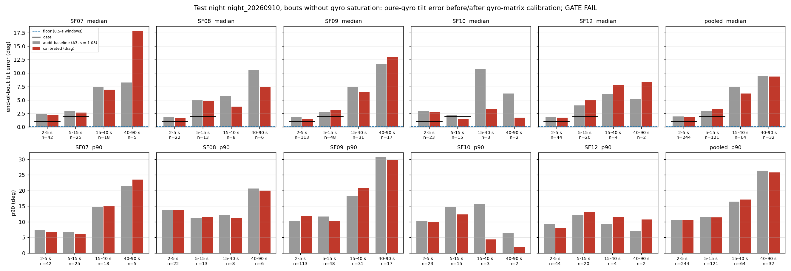
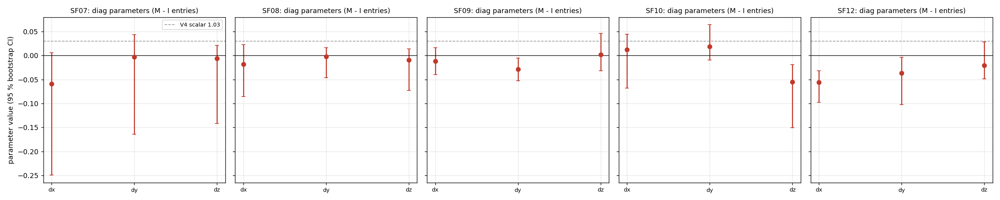
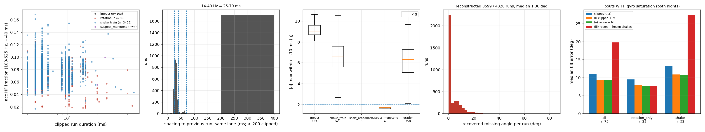
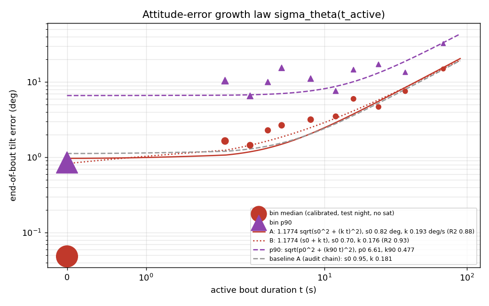
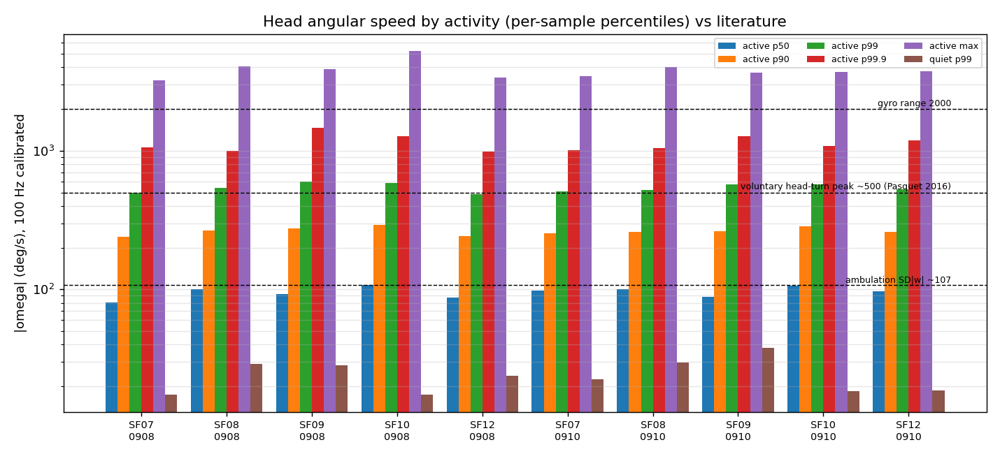
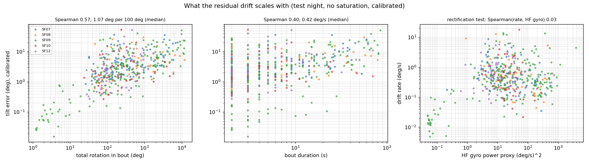

# Head-IMU attitude, Phase 0 (cohort 2026c): gyro self-calibration, saturation, attitude-error model, and the fusion gate — **GATE FAIL**

- **Status:** pre-registered in [`implementation_plan/2026-09-30-imu-attitude-phase0.md`](../../../../implementation_plan/2026-09-30-imu-attitude-phase0.md) (user approval 2026-09-30 "phase0 开始"); all rules fixed before coding; gyro matrices and the model choice fitted on the **tuning night night_20260908** only; the gate evaluated once on the **test night night_20260910**. IMU only — **no WISER fusion was run**.
- **Follows:** the V4 audit ([`change_log/2026-09-29-wiser-ins-fusion.md`](../../../../change_log/2026-09-29-wiser-ins-fusion.md) §*Audit of the V4 result*), whose bout construction and gravity-propagation test are reused unchanged (`audit_20260930/coning_test.py`).
- **Run:** `python wiser/scripts/analyze_imu_attitude_phase0.py --cohort 2026c`; bulk `D:\Field2026_analysis_out\2026c\imu_attitude_phase0_20260930_1203` (per-bout `bouts_all.csv`, `floor.csv`, `sat_runs.csv`, `sat_bouts.csv`, `per_second/`, `omega_distribution.csv`, `model_selection_cv.csv`, `fits.json`, `growth_table.csv`, `summary.json`, `input_provenance.json`, `log.txt`); pointer `run_manifest_imu_attitude_phase0_2026c.json`; git `efaced8+dirty`; runtime 6.1 min. Config `wiser/configs/imu_attitude_phase0_2026c.json` (rules; `fitted` written by this run).
- **A4 cache:** `D:/Field2026_analysis_out/2026c/imu16_cache/<SFxx>/night_<date>.npz` (10 files, 390 MB) + `README.md` next to the root — format in §6.
- **Inputs (read-only caches):** A1 raw 1250-Hz IMU lanes and A3 100-Hz calibrated IMU of the V4 run (`input_provenance.json` lists paths, sizes, sha256 heads). Raw `E:` was not read.

## 1. Headline

1. **GATE FAIL.** Test night, bouts without gyro saturation, calibrated pipeline (`diag`): median end-of-bout tilt error **1.76°** for 2–5 s bouts (threshold 1.0°, n = 244, 95 % CI 1.52–2.22) and **3.29°** for 5–15 s (threshold 2.0°, n = 121, CI 2.57–3.70); 0/5 animals pass both bins individually (≥ 4 required). Audit baseline on the same bouts: 1.93° / 2.96°. Measurement floor (0a, 0.5-s windows, test night pooled): **0.05°**; excess over the floor 1.71° / 3.24°.
2. **Gyro-matrix calibration (0b)** — selected by tuning-night CV: `diag` (pooled CV medians: scalar 2.776, diag 2.631, M 3.438, M_rate 3.465, scalar_gsens 3.561, M_gsens 4.469°). Test-night medians baseline → calibrated: 2-5 s 1.93 → 1.76°; 5-15 s 2.96 → 3.29°; 15-40 s 7.47 → 6.23°; 40-90 s 9.41 → 9.38°.
3. **What the residual drift scales with (test night, calibrated):** Spearman(e, rotation) 0.57 vs Spearman(e, duration) 0.40; 1.07° per 100° turned (p90 5.98); 0.42 °/s of activity (p90 2.37); rectification test: Spearman(drift rate, HF gyro power) 0.03, (rate, HF acc power) 0.01, (rate, mean |a_h|) 0.36; error-vector consistency 0.07.
4. **Saturation (0c):** 4320 clipped gyro runs over the 10 animal-nights: impact 103, shake_train 3455, short_broadband 0, suspect_monotone 4, rotation 758; 3599 reconstructed (median missing angle 1.36°, p90 10.10°; median reconstructed peak 2335 °/s); 240 shake trains, |net angle| median 13.34°.
5. **Attitude-error growth law (0e, test night):** σ_θ(t) = sqrt(0.82² + (0.193 t)²) ° (R² 0.88); p90 envelope sqrt(6.61² + (0.477 t)²)°.

## 2. Definitions

Head frame: x nose, y left, z up (`make_imu.S`, v_B = S v_H). $\mathbf w_k$ = 100-Hz head-frame gyro after Hampel, saturation reconstruction, 40-Hz zero-phase Butterworth-4 and resample_poly 2/25 (°/s); $\mathbf b_k$ = A3 running-median bias (1-min nodes, linear interpolation); $\mathbf a_k$ = A3 calibrated accelerometer (ellipsoid $D(\mathbf a-\mathbf o)$, m/s²); $\Delta t$ = 0.01 s; $g$ = 9.81 m/s².

**Quiet sample.** A3 `quiet`: 1-s window with median |ω| < 10 °/s and | k_a·median|a| − g | < 0.05 g, no bad samples (make_imu rule). **Text:** the quasi-static state in which the accelerometer direction is taken as gravity.

**IMU update rate (measured here).** All six analogin lanes are sample-and-hold: ≈ 190 updates/s (hold 5–7 logger samples, mean 6.6 ≈ 5.3 ms; ≈ 5 % of updates skipped; acc and gyro synchronous). The 1250-Hz lanes are the logger's clock, not the sensor's; a clipped run of ~7 raw samples is one clipped gyro reading. **Text:** the effective gyro/acc bandwidth is ≤ 95 Hz; nothing faster than ~5 ms is resolved.

**Bout.** Maximal run of non-quiet samples $[a,b)$ with $2 \le (b-a)\Delta t \le 90$ s and 0.5 s of data on both sides; $\hat{\mathbf g}_{start}$ = normalised mean of $\mathbf a$ over $[a-50,a)$, $\hat{\mathbf g}_{end}$ over $[b,b+50)$. Bins 2–5, 5–15, 15–40, 40–90 s. **Text:** an episode of head activity bracketed by two gravity measurements; identical to the audit's construction.

**Gravity propagation and end-of-bout tilt error ($e$).** $\mathbf g_{k+1}=\mathrm{Exp}(-\boldsymbol\omega_k\Delta t)\,\mathbf g_k$ (Rodrigues, head frame), $\mathbf g_a=\hat{\mathbf g}_{start}$; $e=\angle(\mathbf g_b,\hat{\mathbf g}_{end})$ in degrees; error vector $\boldsymbol\varepsilon=\mathbf g_b-\hat{\mathbf g}_{end}$. **Text:** how far the gyro alone mis-tracks the vertical across the bout; 0 = perfect; it contains the floor below. Units °.

**Audit baseline.** $\boldsymbol\omega = 1.03\,(\mathbf w^{A3}-\mathbf b)$, i.e. A3 `gyr` (the audit's `lp100_s1.03`). **Text:** the V4 gyro chain, scalar scale only, clipped samples as recorded.

**Floor ($\varphi_L$, 0a).** For consecutive non-overlapping windows $w_1,w_2$ of length $L$ inside a quiet run (no saturation/frozen), $\varphi_L=\angle(\bar{\mathbf a}_{w_1},\bar{\mathbf a}_{w_2})$. **Text:** the tilt-error the test would report for a bout of zero activity (acc noise + residual micro-motion); the gate is read against the L = 0.5 s median. Excludes cross-orientation accelerometer-calibration residuals (A3 held-out gravity residual 0.016 m/s² ≈ 0.1°) → a lower bound. *Bridged floor*: $w_1$ propagated with the calibrated gyro through $d$ s of quiet, compared with the window after the gap (floor + still drift).

**Gyro models (0b).** scalar $\boldsymbol\omega=(1+s)(\mathbf w-\mathbf b)$; diag $\boldsymbol\omega=\mathrm{diag}(1+d_i)(\mathbf w-\mathbf b)$; **M** $\boldsymbol\omega=(I+E)(\mathbf w-\mathbf b)$, $E\in\mathbb R^{3\times3}$ free (scale, non-orthogonality, gyro-to-accelerometer misalignment); **M_rate** $\boldsymbol\omega=(1+c\,|\mathbf w-\mathbf b|^2/\omega_0^2)(I+E)(\mathbf w-\mathbf b)$, $\omega_0$ = 1000 °/s. **Objective:** $\sum_i\rho_H(\boldsymbol\varepsilon_i/f)$ over tuning-night bouts of 2–15 s without saturation/frozen samples, Huber $\rho_H(z)=z^2$ for $|z|\le1$ else $2|z|-1$ per component, $f$ = 3° (scipy `least_squares`, loss huber, trf, bounds |E| ≤ 0.3, |c| ≤ 1, start E = 0.03 I). **Text:** the matrix that makes the gyro close the start→end gravity loop best; bouts with error < 3° count quadratically, larger ones linearly.

**Model selection.** 2-fold CV on the tuning night (folds = alternating 10-min blocks of bout start time); score = pooled (5 animals) held-out median $e$ on 2–15 s bouts; the lowest wins, a model within 0.05° of it with fewer parameters is preferred. **Bootstrap CI:** 200 resamples of the fit bouts with replacement, refit, 2.5/97.5 percentiles per entry.

**Drift scaling.** Spearman rank correlations of $e$ with the bout duration and with the total rotation $\Theta=\sum_k|\boldsymbol\omega_k|\Delta t$ (°); $e/\Theta\cdot100$ (° per 100° turned); $e/T$ (°/s); error-vector consistency $|\overline{\boldsymbol\varepsilon}|/\overline{|\boldsymbol\varepsilon|}$ (1 = same direction in the head frame every bout, 0 = random). **Rectification test:** Spearman of the drift rate $e/T$ with $P_{HF}$ = mean squared first difference of the raw 1250-Hz gyro (resp. acc) over the bout, summed over the three lanes (a first-difference high-pass proxy, (°/s)² resp. (m/s²)²), and with $\overline{|\mathbf a_h|}$ = mean norm of the head-frame acceleration component perpendicular to the propagated gravity (m/s²). **Reading rule (pre-registered):** error ∝ rotation → calibration incomplete; ∝ duration and correlated with vibration power → rate-independent (rectified) bias.

**Clipped run and features (0c).** Consecutive raw samples with |raw| ≥ 32700 on one gyro lane (rail = 1996 °/s). Duration (samples / ms), sign, entry/exit slope (linear fit over the 4 unclipped samples before/after, °/s per ms), |a|_max within ±10 ms (g), acc saturation within ±10 ms, $W_{acc}$ = fraction of the mean-removed acc power in 100–625 Hz within ±40 ms (rfft), spacing to the previous/next run on the same lane (ms). **Train:** runs whose onsets are ≤ 70 ms apart. **Classes (priority order):** `impact` (acc clipped within ±10 ms) → `shake_train` (train ≥ 2 runs, spacing 25–70 ms, alternating sign in ≥ 50 % of successive pairs) → `short_broadband` (≤ 3 samples and $W_{acc}$ ≥ 0.5) → isolated: `suspect_monotone` if the implied net rotation over run ± 25 ms is ≥ 60° with |a|_max < 2 g, else `rotation`.

**Reconstruction and missing angle.** For every run not `impact`/`short_broadband` with clean shoulders: $\ln|\omega(t)|=p_0+p_1t+p_2t^2$ least-squares through the 2 + 2 innermost **held readings** (reading centres; fallback 3 + 3) around the run — chosen on synthetic sample-and-hold pulses (median recovered/true missing angle 1.00, p10 0.92, p90 1.9; the plain quadratic recovers 0.7–0.85, outer readings sit in the pulse tails); accepted if $p_2<0$, the extremum lies inside the run ± 1 sample and the peak ≤ 3 rails; clipped samples ← max(fit, rail) with the run's sign; $\Delta\theta=\sum_k(|\hat\omega_k|-\omega_{rail})\Delta t_{raw}$ (°). **Net angle** of a train = $\sum\omega\,\Delta t_{raw}$ of the reconstructed lane over first onset − 25 ms → last end + 25 ms (°; ≈ 0 for a shake). **Treatments on saturation bouts:** (i) clipped + M, (ii) reconstructed + M (**used for A4**), (iii) (ii) with ω := 0 inside shake-train spans.

**Per-second |ω| statistics.** $|\boldsymbol\omega|$ of the calibrated 100-Hz stream; per-sample percentiles in active (non-quiet) and quiet seconds; `wmax_raw_unclipped` = largest raw |ω| in samples where no gyro lane is saturated. **Text:** how fast the head turns, for the literature comparison in §5.

**Attitude pipeline (0d).** $q_{k+1}=q_k\otimes\mathrm{Exp}(\boldsymbol\omega_k\Delta t)$ (q: head → world, [w,x,y,z]); in quiet samples $q\leftarrow q\otimes\mathrm{Exp}(-\kappa\,\hat{\mathbf g}_h\times\hat{\mathbf a})$ with $\hat{\mathbf g}_h=R(q)^\top\mathbf e_z$, $\kappa=\Delta t/\tau$, τ = 0.25 s (no correction in non-quiet samples; yaw never corrected → arbitrary, continuous); frozen samples hold q. $\mathbf f=R(q)\mathbf a-g\mathbf e_z$; $\mathbf f_{xy}$ low-passed (Butterworth-4 zero-phase) at 2 Hz (also 1, 4) and decimated 100 → 16 Hz (resample_poly 4/25). Quiet-tilt check = median angle between $\hat{\mathbf g}_h$ and $\hat{\mathbf a}$ over quiet samples.

**Band powers.** $P_{band}(x)$ = 0.5-s centred mean of the squared Butterworth-4 zero-phase band-pass of the 100-Hz norm $x\in\{|\boldsymbol\omega|,|\mathbf a|\}$, bands 2–4, 4–8, 8–12, 12–20 Hz, sampled on the 16-Hz grid. **Text:** behaviour features (locomotion, grooming, sniffing, shakes); never integrated.

**Growth law (0e).** Test-night calibrated no-saturation bouts binned by duration (edges 0, 2, 3, 4, 5, 7, 10, 15, 22, 30, 45, 60, 90 s; ≥ 15 bouts) plus the floor at t = 0; $\sigma_\theta$ = per-axis SD of the 2-D tilt error with median angle $=1.1774\,\sigma_\theta$ (Rayleigh). **A:** $\sigma_\theta(t)=\sqrt{\sigma_0^2+(kt)^2}$; **B:** $\sigma_0+kt$; **p90:** $\sqrt{p_0^2+(k_{90}t)^2}$ on the bin p90s; weighted least squares (weights √n). **Text:** the attitude process-noise law a filter must use; $t$ = seconds since the last quiet sample.

**Gate.** Test night, no-gyro-saturation bouts, calibrated pipeline; PASS iff pooled median $e$ ≤ 1.0° (2–5 s) **and** ≤ 2.0° (5–15 s) **and** ≥ 4 of 5 animals satisfy both. CIs = 1000 bout-bootstrap draws of the median (information only).

## 3. 0a — Measurement floor

Pooled test-night floor: L = 0.5 s median 0.05° (n = 10920), L = 1.0 s median 0.05° (n = 5177), L = 2.0 s median 0.07° (n = 2445).

| night | animal | adjacent 0.5 s med / p90 | 1 s | 2 s | bridged 0.5 s + 1 s quiet | + 2 s | + 5 s |
|---|---|---|---|---|---|---|---|
| night_20260908 | SF07 | 0.06 / 0.80 (n 1456) | 0.08 / 1.29 (n 707) | 0.14 / 1.86 (n 340) | 0.17 / 0.92 (n 707) | 0.27 / 0.92 (n 463) | 0.54 / 1.44 (n 219) |
| night_20260908 | SF08 | 0.06 / 0.96 (n 1737) | 0.05 / 1.26 (n 818) | 0.04 / 1.31 (n 386) | 0.12 / 0.94 (n 818) | 0.13 / 0.82 (n 523) | 0.17 / 1.11 (n 244) |
| night_20260908 | SF09 | 0.04 / 0.75 (n 4249) | 0.04 / 0.89 (n 2001) | 0.05 / 0.83 (n 929) | 0.10 / 0.65 (n 2001) | 0.13 / 0.64 (n 1284) | 0.19 / 0.73 (n 606) |
| night_20260908 | SF10 | 0.04 / 0.39 (n 3301) | 0.03 / 0.39 (n 1589) | 0.04 / 0.50 (n 757) | 0.08 / 0.32 (n 1589) | 0.08 / 0.32 (n 1035) | 0.14 / 0.37 (n 490) |
| night_20260908 | SF12 | 0.05 / 0.80 (n 2517) | 0.05 / 0.97 (n 1202) | 0.07 / 1.17 (n 566) | 0.11 / 0.85 (n 1202) | 0.14 / 0.85 (n 766) | 0.27 / 0.78 (n 356) |
| night_20260910 | SF07 | 0.06 / 0.98 (n 2226) | 0.06 / 1.42 (n 1056) | 0.11 / 1.79 (n 499) | 0.15 / 0.90 (n 1056) | 0.20 / 0.93 (n 682) | 0.44 / 1.16 (n 319) |
| night_20260910 | SF08 | 0.06 / 1.39 (n 998) | 0.06 / 1.91 (n 465) | 0.06 / 2.36 (n 215) | 0.13 / 1.27 (n 465) | 0.16 / 1.34 (n 292) | 0.24 / 1.87 (n 137) |
| night_20260910 | SF09 | 0.05 / 0.96 (n 3478) | 0.06 / 1.27 (n 1611) | 0.09 / 1.57 (n 749) | 0.08 / 0.86 (n 1611) | 0.11 / 0.84 (n 1026) | 0.19 / 1.00 (n 476) |
| night_20260910 | SF10 | 0.03 / 0.31 (n 1774) | 0.03 / 0.36 (n 859) | 0.04 / 0.47 (n 413) | 0.06 / 0.27 (n 859) | 0.07 / 0.27 (n 562) | 0.11 / 0.38 (n 273) |
| night_20260910 | SF12 | 0.05 / 0.71 (n 2444) | 0.06 / 1.03 (n 1186) | 0.08 / 1.49 (n 569) | 0.16 / 0.76 (n 1186) | 0.19 / 0.76 (n 767) | 0.32 / 1.14 (n 360) |

The floor falls with window length as the acc noise averages out; the bridged variants add the still-drift of the calibrated gyro over the quiet gap.

## 4. 0b — Gyro self-calibration

**Tuning-night CV (2–15 s no-sat bouts; held-out median tilt error, °):**

| animal | n | baseline 1.03 | scalar | diag | M | M_rate | scalar_gsens | M_gsens |
|---|---|---|---|---|---|---|---|---|
| SF07 | 24 | 2.70 | n/a (train 2.41) | n/a (train 2.29) | n/a (train 2.64) | n/a (train 1.95) | n/a (train 1.55) | n/a (train 2.24) |
| SF08 | 52 | 2.86 | 2.30 (train 2.30) | 2.48 (train 2.20) | 3.78 (train 2.47) | 3.56 (train 2.53) | 3.91 (train 2.44) | 6.40 (train 2.57) |
| SF09 | 141 | 3.35 | 3.22 (train 3.04) | 3.29 (train 3.26) | 3.57 (train 3.14) | 3.47 (train 3.20) | 3.66 (train 2.99) | 4.24 (train 3.12) |
| SF10 | 59 | 1.63 | 1.43 (train 1.34) | 1.47 (train 1.48) | 2.53 (train 1.50) | 2.44 (train 1.61) | 2.36 (train 1.50) | 2.94 (train 1.44) |
| SF12 | 73 | 3.83 | 3.80 (train 3.76) | 3.77 (train 3.41) | 4.36 (train 3.60) | 4.45 (train 3.62) | 4.35 (train 3.79) | 5.93 (train 3.36) |
| pooled | | | **2.776** | **2.631** | **3.438** | **3.465** | **3.561** | **4.469** |

Selected among the pre-registered models (scalar, diag, M, M_rate): **`diag`**. `scalar_gsens` / `M_gsens` (ω = M(w − b) + K a, K = gyro g-sensitivity) are **post-hoc exploratory** models added after the SF09 development run showed the drift rate correlating with linear acceleration; they never enter the selection or the gate.

**Fitted matrices (`diag`, tuning night; 95 % bootstrap CI):**

| animal | dx | dy | dz |
|---|---|---|---|
| SF07 | -0.0590 [-0.2494, +0.0057] | -0.0026 [-0.1642, +0.0433] | -0.0063 [-0.1420, +0.0214] |
| SF08 | -0.0179 [-0.0856, +0.0230] | -0.0020 [-0.0462, +0.0164] | -0.0096 [-0.0730, +0.0136] |
| SF09 | -0.0116 [-0.0398, +0.0159] | -0.0286 [-0.0523, -0.0055] | +0.0019 [-0.0320, +0.0457] |
| SF10 | +0.0121 [-0.0676, +0.0443] | +0.0185 [-0.0091, +0.0642] | -0.0550 [-0.1508, -0.0187] |
| SF12 | -0.0560 [-0.0973, -0.0317] | -0.0367 [-0.1026, -0.0034] | -0.0209 [-0.0490, +0.0280] |

**All fitted models per animal (tuning night; M − I entries row-major, then c or K row-major):**

| animal | model | parameters |
|---|---|---|
| SF07 | scalar | s -0.0227 |
| SF07 | diag | dx -0.0590, dy -0.0026, dz -0.0063 |
| SF07 | M | xx -0.0727, xy +0.0037, xz +0.0169, yx -0.0393, yy -0.0123, yz -0.0340, zx -0.0101, zy +0.0040, zz +0.0217 |
| SF07 | M_rate | xx -0.0456, xy +0.0176, xz +0.0160, yx +0.0104, yy -0.0319, yz -0.0589, zx -0.0081, zy +0.0979, zz +0.0914, c -0.4508 |
| SF07 | scalar_gsens | s -0.0489, Kxx -0.2903, Kxy +0.0059, Kxz +0.0087, Kyx +0.0707, Kyy -0.4283, Kyz -0.0050, Kzx +0.0039, Kzy +0.0791, Kzz -0.2989 |
| SF07 | M_gsens | xx -0.2323, xy +0.0009, xz +0.0321, yx -0.2056, yy -0.2205, yz -0.2393, zx +0.3000, zy +0.2805, zz +0.1147, Kxx +0.3046, Kxy +0.2223, Kxz +0.2251, Kyx -0.0942, Kyy +0.3429, Kyz -0.0420, Kzx +0.2506, Kzy -0.1963, Kzz +0.2109 |
| SF08 | scalar | s -0.0021 |
| SF08 | diag | dx -0.0179, dy -0.0020, dz -0.0096 |
| SF08 | M | xx -0.0283, xy -0.0175, xz +0.0248, yx +0.0041, yy +0.0021, yz -0.0092, zx +0.0226, zy +0.0558, zz -0.0514 |
| SF08 | M_rate | xx -0.0307, xy -0.0166, xz +0.0247, yx +0.0025, yy -0.0001, yz -0.0086, zx +0.0225, zy +0.0566, zz -0.0535, c +0.0186 |
| SF08 | scalar_gsens | s -0.0086, Kxx +0.6136, Kxy -0.0283, Kxz -0.0095, Kyx +0.0031, Kyy +0.6626, Kyz -0.0109, Kzx +0.0536, Kzy -0.0104, Kzz +0.6641 |
| SF08 | M_gsens | xx -0.0305, xy -0.0204, xz +0.0221, yx +0.0199, yy -0.0080, yz -0.0068, zx +0.0295, zy +0.0314, zz -0.0379, Kxx +0.2353, Kxy -0.0335, Kxz +0.0044, Kyx -0.0059, Kyy +0.2630, Kyz -0.0133, Kzx +0.0448, Kzy -0.0011, Kzz +0.2851 |
| SF09 | scalar | s -0.0157 |
| SF09 | diag | dx -0.0116, dy -0.0286, dz +0.0019 |
| SF09 | M | xx -0.0010, xy +0.0049, xz -0.0458, yx +0.0137, yy -0.0296, yz -0.0156, zx -0.0041, zy -0.0323, zz +0.0103 |
| SF09 | M_rate | xx -0.0123, xy +0.0068, xz -0.0478, yx +0.0218, yy -0.0362, yz -0.0214, zx -0.0063, zy -0.0279, zz -0.0038, c +0.1070 |
| SF09 | scalar_gsens | s -0.0156, Kxx -0.0633, Kxy -0.0063, Kxz +0.0054, Kyx +0.0003, Kyy -0.0216, Kyz -0.0011, Kzx +0.0271, Kzy +0.0114, Kzz -0.0501 |
| SF09 | M_gsens | xx -0.0007, xy +0.0035, xz -0.0452, yx +0.0157, yy -0.0294, yz -0.0171, zx -0.0046, zy -0.0266, zz +0.0094, Kxx +0.0163, Kxy -0.0150, Kxz +0.0049, Kyx -0.0026, Kyy +0.0400, Kyz +0.0053, Kzx +0.0182, Kzy +0.0075, Kzz +0.0184 |
| SF10 | scalar | s -0.0065 |
| SF10 | diag | dx +0.0121, dy +0.0185, dz -0.0550 |
| SF10 | M | xx +0.0001, xy -0.0339, xz +0.0019, yx -0.0106, yy +0.0214, yz +0.0246, zx -0.0257, zy -0.0396, zz -0.0653 |
| SF10 | M_rate | xx -0.0022, xy -0.0351, xz -0.0010, yx -0.0030, yy +0.0121, yz +0.0182, zx -0.0186, zy -0.0486, zz -0.0704, c +0.2184 |
| SF10 | scalar_gsens | s -0.0074, Kxx +0.3877, Kxy +0.0235, Kxz -0.0162, Kyx -0.0078, Kyy +0.4282, Kyz +0.0108, Kzx -0.0120, Kzy -0.0063, Kzz +0.4076 |
| SF10 | M_gsens | xx -0.0128, xy -0.0365, xz -0.0114, yx -0.0213, yy +0.0420, yz +0.0506, zx -0.0001, zy -0.0474, zz -0.1040, Kxx +0.5090, Kxy +0.0168, Kxz -0.0266, Kyx -0.0196, Kyy +0.5382, Kyz +0.0021, Kzx -0.0299, Kzy +0.0077, Kzz +0.5070 |
| SF12 | scalar | s -0.0315 |
| SF12 | diag | dx -0.0560, dy -0.0367, dz -0.0209 |
| SF12 | M | xx -0.0850, xy -0.0119, xz -0.0037, yx +0.0125, yy -0.0574, yz +0.0480, zx -0.0360, zy -0.0039, zz -0.0029 |
| SF12 | M_rate | xx -0.0767, xy -0.0137, xz -0.0038, yx +0.0194, yy -0.0579, yz +0.0477, zx -0.0349, zy -0.0020, zz +0.0049, c -0.0476 |
| SF12 | scalar_gsens | s -0.0481, Kxx -0.3053, Kxy +0.0833, Kxz +0.0189, Kyx -0.0260, Kyy -0.3845, Kyz -0.0084, Kzx +0.0235, Kzy +0.0584, Kzz -0.3972 |
| SF12 | M_gsens | xx -0.0785, xy -0.0131, xz +0.0012, yx +0.0443, yy -0.0615, yz +0.0484, zx -0.0180, zy +0.0057, zz -0.0043, Kxx -0.0546, Kxy +0.1091, Kxz -0.0103, Kyx -0.0241, Kyy -0.1132, Kyz -0.0215, Kzx -0.0220, Kzy +0.0519, Kzz -0.1699 |

**Test night, bouts without gyro saturation — median (p90) tilt error in °, baseline → every model (held-out; `e_cal_norecon` = selected model on the clipped stream, `e_cal_shakefrozen` = (iii)):**

| animal | bin | n | baseline | scalar | diag | M | M_rate | scalar_gsens | M_gsens | cal_norecon | cal_shakefrozen |
|---|---|---|---|---|---|---|---|---|---|---|---|
| SF07 | 2-5 s | 42 | 2.42 (7.4) | 1.99 (6.7) | 2.26 (6.8) | 2.45 (7.4) | 2.65 (7.9) | 2.74 (7.4) | 9.88 (25.4) | 2.26 (6.8) | 2.26 (6.8) |
| SF07 | 5-15 s | 25 | 2.96 (6.7) | 2.52 (6.0) | 2.68 (6.1) | 3.35 (7.9) | 4.90 (15.6) | 4.95 (9.8) | 23.89 (44.1) | 2.68 (6.1) | 2.68 (6.1) |
| SF07 | 15-40 s | 18 | 7.38 (14.8) | 8.22 (12.6) | 6.92 (15.0) | 7.35 (19.6) | 9.80 (30.1) | 16.46 (27.6) | 51.43 (87.7) | 6.92 (15.0) | 6.92 (15.0) |
| SF07 | 40-90 s | 5 | 8.23 (21.4) | 7.41 (22.8) | 17.82 (23.5) | 14.83 (30.2) | 16.53 (24.0) | 3.93 (21.2) | 38.67 (67.3) | 17.82 (23.5) | 17.82 (23.5) |
| SF08 | 2-5 s | 22 | 1.81 (13.9) | 1.65 (13.7) | 1.65 (13.9) | 1.73 (14.1) | 1.74 (14.1) | 1.98 (13.7) | 1.80 (13.6) | 1.65 (13.9) | 1.65 (13.9) |
| SF08 | 5-15 s | 13 | 4.90 (11.1) | 4.36 (11.6) | 4.81 (11.6) | 5.22 (13.3) | 5.29 (13.4) | 5.30 (11.2) | 4.80 (12.1) | 4.81 (11.6) | 4.81 (11.6) |
| SF08 | 15-40 s | 8 | 5.77 (12.2) | 3.51 (11.4) | 3.77 (11.1) | 7.47 (13.3) | 7.62 (13.2) | 4.74 (12.5) | 9.44 (18.4) | 3.77 (11.1) | 3.77 (11.1) |
| SF08 | 40-90 s | 6 | 10.59 (20.6) | 7.56 (19.7) | 7.47 (19.9) | 12.11 (25.0) | 12.12 (25.1) | 6.94 (16.7) | 12.28 (27.5) | 7.47 (19.9) | 7.47 (19.9) |
| SF09 | 2-5 s | 113 | 1.75 (10.2) | 1.54 (11.3) | 1.50 (11.8) | 1.80 (12.9) | 1.87 (14.1) | 1.40 (11.6) | 1.84 (13.0) | 1.50 (11.8) | 1.50 (11.8) |
| SF09 | 5-15 s | 48 | 2.73 (11.7) | 2.66 (9.0) | 3.13 (10.4) | 3.15 (11.5) | 3.99 (14.1) | 2.93 (9.0) | 3.38 (11.2) | 3.13 (10.4) | 3.13 (10.4) |
| SF09 | 15-40 s | 31 | 7.48 (18.4) | 6.85 (20.8) | 6.40 (20.7) | 6.53 (18.4) | 8.42 (23.9) | 8.17 (20.3) | 7.39 (18.4) | 6.40 (20.7) | 6.40 (20.7) |
| SF09 | 40-90 s | 17 | 11.75 (30.7) | 10.72 (29.8) | 12.96 (29.7) | 11.95 (44.8) | 16.98 (48.4) | 11.53 (29.0) | 14.69 (43.3) | 12.96 (29.7) | 12.96 (29.7) |
| SF10 | 2-5 s | 23 | 2.98 (10.2) | 2.90 (9.9) | 2.78 (10.0) | 2.73 (10.2) | 2.74 (10.2) | 2.36 (10.2) | 2.57 (10.8) | 2.78 (10.0) | 2.78 (10.0) |
| SF10 | 5-15 s | 15 | 2.30 (14.6) | 2.28 (13.2) | 1.45 (12.3) | 2.20 (12.5) | 3.34 (12.7) | 2.44 (14.0) | 3.12 (12.0) | 1.45 (12.3) | 1.45 (12.3) |
| SF10 | 15-40 s | 3 | 10.73 (15.7) | 6.04 (7.8) | 3.30 (4.4) | 2.97 (5.5) | 3.21 (7.4) | 7.66 (9.5) | 6.87 (15.3) | 3.30 (4.4) | 3.30 (4.4) |
| SF10 | 40-90 s | 2 | 6.20 (6.4) | 3.86 (3.9) | 1.75 (1.9) | 3.94 (4.6) | 4.55 (5.0) | 6.51 (7.9) | 7.61 (8.4) | 1.75 (1.9) | 1.75 (1.9) |
| SF12 | 2-5 s | 44 | 1.87 (9.4) | 1.71 (8.4) | 1.72 (8.0) | 1.92 (7.9) | 1.95 (8.0) | 2.71 (7.6) | 2.60 (7.4) | 1.72 (8.0) | 1.72 (8.0) |
| SF12 | 5-15 s | 20 | 4.01 (12.2) | 3.79 (12.6) | 5.04 (13.0) | 5.73 (13.8) | 5.87 (13.7) | 5.55 (13.5) | 9.81 (16.6) | 5.04 (13.0) | 5.04 (13.0) |
| SF12 | 15-40 s | 4 | 6.09 (9.4) | 7.71 (10.8) | 7.77 (11.6) | 6.10 (13.9) | 5.48 (13.9) | 11.04 (20.7) | 9.91 (26.7) | 7.77 (11.6) | 7.77 (11.6) |
| SF12 | 40-90 s | 2 | 5.20 (7.2) | 7.82 (9.8) | 8.38 (10.7) | 9.92 (12.2) | 9.60 (12.0) | 7.32 (8.8) | 28.66 (33.6) | 8.38 (10.7) | 8.38 (10.7) |
| pooled | 2-5 s | 244 | 1.93 (10.6) | 1.69 (10.8) | 1.76 (10.6) | 2.08 (11.6) | 1.97 (12.3) | 2.05 (10.6) | 2.65 (15.0) | 1.76 (10.6) | 1.76 (10.6) |
| pooled | 5-15 s | 121 | 2.96 (11.6) | 2.92 (11.0) | 3.29 (11.4) | 3.73 (13.0) | 4.24 (14.9) | 4.01 (11.6) | 5.66 (24.5) | 3.29 (11.4) | 3.29 (11.4) |
| pooled | 15-40 s | 64 | 7.47 (16.4) | 6.95 (16.3) | 6.23 (17.1) | 6.70 (17.2) | 8.41 (26.7) | 8.82 (23.8) | 11.22 (66.5) | 6.23 (17.1) | 6.23 (17.1) |
| pooled | 40-90 s | 32 | 9.41 (26.3) | 8.59 (24.7) | 9.38 (25.8) | 11.92 (34.5) | 14.27 (32.6) | 9.45 (23.7) | 15.42 (44.6) | 9.38 (25.8) | 9.38 (25.8) |

**Drift scaling after calibration (test night, no sat):**

| set | n | ρ(e, dur) | ρ(e, Θ) | ρ(dur, Θ) | ° per 100° med (p90) | °/s med (p90) | consistency | mean dir (head) | ρ(rate, HF gyr) | ρ(rate, HF acc) | ρ(rate, |a_h|) | ρ(e, ω_max) |
|---|---|---|---|---|---|---|---|---|---|---|---|---|
| pooled | 461 | 0.40 | 0.57 | 0.82 | 1.07 (5.98) | 0.42 (2.37) | 0.07 | [-0.58, -0.38, -0.72] | 0.03 | 0.01 | 0.36 | 0.51 |
| SF07 | 90 | 0.47 | 0.41 | 0.89 | 1.18 (6.96) | 0.43 (2.23) | 0.22 | [-0.66, 0.46, -0.6] | -0.42 | -0.40 | -0.01 | 0.24 |
| SF08 | 49 | 0.43 | 0.53 | 0.92 | 0.90 (5.02) | 0.43 (1.84) | 0.12 | [-0.16, -0.95, 0.27] | -0.45 | -0.46 | 0.15 | 0.45 |
| SF09 | 209 | 0.39 | 0.69 | 0.76 | 0.89 (6.00) | 0.36 (2.35) | 0.11 | [0.75, -0.6, -0.28] | 0.31 | 0.30 | 0.57 | 0.67 |
| SF10 | 43 | 0.10 | 0.18 | 0.92 | 1.30 (5.87) | 0.57 (2.59) | 0.37 | [-0.91, -0.34, -0.22] | -0.26 | -0.22 | 0.19 | 0.11 |
| SF12 | 70 | 0.45 | 0.54 | 0.88 | 1.41 (7.05) | 0.50 (2.14) | 0.17 | [-0.91, 0.3, -0.27] | 0.09 | -0.03 | 0.26 | 0.45 |
| pooled_baseline | 461 | 0.42 | 0.60 | 0.82 | 1.10 (6.01) | 0.47 (2.54) | 0.07 | [-0.58, -0.38, -0.72] | 0.07 | 0.05 | 0.33 | 0.55 |

Audit reference (SF09 / SF12, baseline): ρ(e, Θ) 0.70 / 0.45, ρ(e, dur) 0.41 / 0.33, 1.01 / 1.38 ° per 100°, 0.41 / 0.51 °/s, consistency 0.15 / 0.20.

## 5. 0c — Saturation

**Clipped gyro runs per animal-night and class:**

| night | animal | impact | shake_train | short_broadband | suspect_monotone | rotation | total |
|---|---|---|---|---|---|---|---|
| night_20260908 | SF07 | 1 | 219 | 0 | 0 | 79 | 299 |
| night_20260908 | SF08 | 7 | 399 | 0 | 1 | 63 | 470 |
| night_20260908 | SF09 | 5 | 451 | 0 | 2 | 94 | 552 |
| night_20260908 | SF10 | 35 | 661 | 0 | 0 | 61 | 757 |
| night_20260908 | SF12 | 0 | 70 | 0 | 0 | 59 | 129 |
| night_20260910 | SF07 | 1 | 175 | 0 | 0 | 71 | 247 |
| night_20260910 | SF08 | 16 | 432 | 0 | 0 | 73 | 521 |
| night_20260910 | SF09 | 2 | 183 | 0 | 0 | 75 | 260 |
| night_20260910 | SF10 | 16 | 533 | 0 | 0 | 45 | 594 |
| night_20260910 | SF12 | 20 | 332 | 0 | 1 | 138 | 491 |

Runs per lane (sensor lane 4 = head yaw z, 5 = head −x, 6 = head −y): {'4': 4309, '5': 9, '6': 2}. Duration (ms): median 5.60, p90 10.40, p99 15.20, max 46.40. Inter-run spacing histogram (edges [0.0, 25.0, 40.0, 70.0, 200.0, 'inf'] ms): [430, 2047, 109, 5, 1710] of 4301 runs with a predecessor. Median |a|_max by class (g): impact 8.97, rotation 6.32, shake_train 6.63, suspect_monotone 1.73; median $W_{acc}$ by class: impact 0.06, rotation 0.07, shake_train 0.07, suspect_monotone 0.06.

**Shake trains:** 240 trains (median size 3 runs), |net angle| over the train median 13.34° (p90 31.06°), fraction with |a| > 2 g 1.00. **Suspect monotone runs:** 4 (median |net| 106.35°), by animal {'SF08': 1, 'SF09': 2, 'SF12': 1} — SF12 (loosening contact on shanks 1/4 from 09-10 afternoon) is to be compared with the others here. **Reconstruction:** 3599 runs reconstructed, 618 failed (shoulders not clean or fit rejected); missing angle median 1.36° (p90 10.10°); reconstructed peak median 2335 °/s (p90 3448).

**Bouts containing gyro saturation (both nights, all animals) — median tilt error (°) per treatment:**

| bouts containing | n | clipped (A3 baseline) | (i) clipped + M | (ii) reconstructed + M (A4) | (iii) + frozen across shakes |
|---|---|---|---|---|---|
| all | 75 | 10.95 | 9.34 | 9.41 | 19.80 |
| rotation_only | 23 | 9.50 | 7.98 | 7.77 | 7.77 |
| shake | 52 | 13.13 | 10.88 | 10.75 | 27.51 |

**Head angular speed (calibrated 100-Hz |ω|, °/s) by activity, against the literature (voluntary head-turn peak ≈ 500 °/s and ambulation SD ≈ 107 °/s, Pasquet 2016; immobility < 12–20 °/s; shakes/twitches > 1000–2000 °/s for tens of ms):**

| night | animal | active p50 | p90 | p99 | p99.9 | p99.99 | max | active SD | quiet p50 | quiet p99 | max raw unclipped | active s with sat | sat fraction |
|---|---|---|---|---|---|---|---|---|---|---|---|---|---|
| night_20260908 | SF07 | 81 | 238 | 500 | 1053 | 2011 | 3207 | 114 | 1.1 | 17.4 | 2457 | 0.48 % | 0.006 % |
| night_20260908 | SF08 | 101 | 267 | 537 | 992 | 2268 | 4039 | 120 | 1.1 | 29.1 | 2578 | 0.66 % | 0.011 % |
| night_20260908 | SF09 | 92 | 276 | 597 | 1468 | 2247 | 3856 | 137 | 0.9 | 28.3 | 2667 | 0.89 % | 0.012 % |
| night_20260908 | SF10 | 108 | 292 | 587 | 1272 | 2418 | 5231 | 134 | 0.8 | 17.5 | 2719 | 0.94 % | 0.019 % |
| night_20260908 | SF12 | 88 | 242 | 488 | 991 | 1804 | 3354 | 110 | 1.1 | 23.7 | 2892 | 0.25 % | 0.003 % |
| night_20260910 | SF07 | 98 | 254 | 511 | 1009 | 1964 | 3446 | 114 | 1.1 | 22.4 | 2524 | 0.43 % | 0.005 % |
| night_20260910 | SF08 | 100 | 260 | 520 | 1048 | 2245 | 4017 | 118 | 1.2 | 29.8 | 2563 | 0.73 % | 0.012 % |
| night_20260910 | SF09 | 89 | 263 | 570 | 1277 | 2060 | 3650 | 129 | 0.7 | 37.8 | 2712 | 0.50 % | 0.006 % |
| night_20260910 | SF10 | 107 | 285 | 569 | 1082 | 2254 | 3690 | 128 | 0.7 | 18.5 | 2557 | 0.70 % | 0.015 % |
| night_20260910 | SF12 | 97 | 258 | 528 | 1194 | 2117 | 3748 | 120 | 1.2 | 18.7 | 2481 | 0.73 % | 0.011 % |

Grooming, scratching and shaking epochs are not excluded anywhere in Phase 0; the body is stationary in them, so a translation filter should treat them as zero-velocity states (the A4 `shake` flag and the 4–20 Hz band powers mark them).

## 6. 0d — Attitude pipeline and the A4 cache

| animal / night | samples (16 Hz) | MB | quiet-tilt check (median °) |
|---|---|---|---|
| SF07/night_20260908 | 499212 | 39.4 | 0.29 |
| SF08/night_20260908 | 499211 | 39.4 | 0.26 |
| SF09/night_20260908 | 499214 | 38.4 | 0.20 |
| SF10/night_20260908 | 499212 | 39.3 | 0.21 |
| SF12/night_20260908 | 499211 | 39.4 | 0.27 |
| SF07/night_20260910 | 499212 | 39.4 | 0.21 |
| SF08/night_20260910 | 486947 | 38.9 | 0.26 |
| SF09/night_20260910 | 499214 | 38.7 | 0.20 |
| SF10/night_20260910 | 493253 | 39.3 | 0.29 |
| SF12/night_20260910 | 484500 | 38.1 | 0.24 |

**Where f_xy is trustworthy (descriptive).** Gravity aiding happens only in quiet samples, so the tilt uncertainty grows with `t_active`; a tilt error δθ leaks g·sin δθ into f_xy. Fraction of 16-Hz samples per `t_active` band, with the median |f_xy_2hz| (m/s²) and median σ_θ (°) in the band:

| animal / night | still | t_active < 2 s | 2–5 s | 5–15 s | 15–60 s | ≥ 60 s | σ_θ median (all) |
|---|---|---|---|---|---|---|---|
| SF07 / night_20260908 | 5 % | 5 % · |f| 0.01 · σ 0.8 | 0 % · |f| 0.24 · σ 1.0 | 1 % · |f| 0.41 · σ 2.1 | 3 % · |f| 1.21 · σ 6.9 | 91 % · |f| 7.72 · σ 384.5 | 321.0 |
| SF07 / night_20260910 | 7 % | 8 % · |f| 0.01 · σ 0.8 | 1 % · |f| 0.27 · σ 1.1 | 3 % · |f| 0.55 · σ 2.0 | 8 % · |f| 1.13 · σ 6.8 | 80 % · |f| 4.68 · σ 81.4 | 57.1 |
| SF08 / night_20260908 | 6 % | 6 % · |f| 0.01 · σ 0.8 | 1 % · |f| 0.31 · σ 1.1 | 2 % · |f| 0.45 · σ 2.1 | 8 % · |f| 0.87 · σ 6.9 | 82 % · |f| 3.28 · σ 84.3 | 63.2 |
| SF08 / night_20260910 | 3 % | 4 % · |f| 0.01 · σ 0.8 | 1 % · |f| 0.25 · σ 1.1 | 2 % · |f| 0.44 · σ 2.0 | 7 % · |f| 0.71 · σ 7.1 | 86 % · |f| 3.11 · σ 97.2 | 79.3 |
| SF09 / night_20260908 | 14 % | 16 % · |f| 0.00 · σ 0.8 | 2 % · |f| 0.38 · σ 1.1 | 6 % · |f| 0.70 · σ 2.0 | 18 % · |f| 1.39 · σ 6.8 | 59 % · |f| 3.31 · σ 40.6 | 17.7 |
| SF09 / night_20260910 | 11 % | 13 % · |f| 0.00 · σ 0.8 | 2 % · |f| 0.33 · σ 1.0 | 5 % · |f| 0.68 · σ 2.0 | 14 % · |f| 1.31 · σ 6.8 | 66 % · |f| 3.43 · σ 48.7 | 26.5 |
| SF10 / night_20260908 | 11 % | 12 % · |f| 0.00 · σ 0.8 | 1 % · |f| 0.20 · σ 1.1 | 2 % · |f| 0.35 · σ 2.0 | 8 % · |f| 0.80 · σ 6.9 | 77 % · |f| 3.40 · σ 92.9 | 59.3 |
| SF10 / night_20260910 | 6 % | 6 % · |f| 0.00 · σ 0.8 | 1 % · |f| 0.19 · σ 1.1 | 1 % · |f| 0.40 · σ 2.0 | 5 % · |f| 0.83 · σ 7.1 | 86 % · |f| 3.50 · σ 109.4 | 89.9 |
| SF12 / night_20260908 | 8 % | 9 % · |f| 0.00 · σ 0.8 | 1 % · |f| 0.32 · σ 1.1 | 3 % · |f| 0.50 · σ 2.0 | 10 % · |f| 0.98 · σ 6.8 | 76 % · |f| 3.47 · σ 76.8 | 50.6 |
| SF12 / night_20260910 | 8 % | 9 % · |f| 0.01 · σ 0.8 | 1 % · |f| 0.26 · σ 1.0 | 1 % · |f| 0.46 · σ 1.9 | 2 % · |f| 1.01 · σ 6.9 | 88 % · |f| 7.09 · σ 513.1 | 414.9 |

Reading: without WISER (or any other) aiding, the pure-IMU horizontal specific force is only meaningful within a few seconds of a quiet window; over most of an active night it is dominated by gravity leakage — which is precisely why σ_θ is stored per sample and why this cache is an input to a fusion, not a result.

Format (also in `D:/Field2026_analysis_out/2026c/imu16_cache/README.md`): `t_unix_ms` (IMU clock, τ* not applied; grid j ↔ 100-Hz sample 6.25 j); `f_xy_2hz` / `f_xy_1hz` / `f_xy_4hz` float32 (n, 2) m/s² world-frame horizontal specific force, gravity removed — **yaw arbitrary (0 at the night start) but continuous**; `f_z_2hz`; `q_wh` float32 (n, 4) [w, x, y, z], v_world = R(q) v_head, nearest 100-Hz sample; `sigma_theta_deg` (per-axis SD of the tilt error at the sample's `t_active_s`, law A) and `p90_theta_deg`; flags `still`, `dyn`, `sat`, `recon`, `shake`, `frozen`, `invalid` (any within the 62.5-ms support); band powers `bp_w_<lo>_<hi>`, `bp_a_<lo>_<hi>` for 2–4, 4–8, 8–12, 12–20 Hz; `calib_json` (M, c, acc ellipsoid, all parameters, growth laws, sources, git) and `meta_json`. Gravity aiding happens only in quiet samples (τ = 0.25 s); there is no dynamic pull. A tilt error δθ biases f_xy by g·sin δθ (1° = 0.17 m/s²).

## 7. 0e — Attitude-error growth law

| t bin (s) | t mid | n | median e (°) | p90 e (°) |
|---|---|---|---|---|
| 0–0 | 0.0 | 10920 | 0.05 | 0.85 |
| 2–3 | 2.0 | 108 | 1.65 | 10.42 |
| 3–4 | 3.0 | 64 | 1.45 | 6.54 |
| 4–5 | 4.0 | 43 | 2.28 | 9.99 |
| 5–7 | 5.0 | 53 | 2.66 | 15.41 |
| 7–10 | 8.0 | 53 | 3.17 | 11.10 |
| 10–15 | 12.0 | 36 | 3.49 | 7.60 |
| 15–22 | 16.0 | 28 | 5.98 | 14.59 |
| 22–30 | 24.0 | 27 | 4.67 | 17.15 |
| 30–45 | 37.0 | 22 | 7.54 | 13.46 |
| 60–90 | 68.5 | 16 | 14.91 | 32.40 |

**A (adopted, written into A4):** σ_θ(t) = sqrt(0.822² + (0.1930·t)²) °, R² 0.88. **B:** σ_θ = 0.701 + 0.1758·t, R² 0.93. **p90 envelope:** sqrt(6.61² + (0.4773·t)²) °. Baseline chain for comparison: σ₀ 0.954, k 0.1814 °/s. Per animal (A: σ₀, k): SF07 0.04, 0.840; SF08 0.04, 0.200; SF09 0.05, 0.349; SF10 0.04, 0.200; SF12 0.04, 0.797.

## 8. GATE (pre-registered)

| bin | threshold | pooled median (95 % CI) | n | baseline | excess over floor | pass |
|---|---|---|---|---|---|---|
| 2-5 s | ≤ 1.0° | 1.76 (1.52–2.22) | 244 | 1.93 | 1.71 | no |
| 5-15 s | ≤ 2.0° | 3.29 (2.57–3.70) | 121 | 2.96 | 3.24 | no |

| animal | 2–5 s median (n) | 5–15 s median (n) | passes both |
|---|---|---|---|
| SF07 | 2.26 (42) | 2.68 (25) | no |
| SF08 | 1.65 (22) | 4.81 (13) | no |
| SF09 | 1.50 (113) | 3.13 (48) | no |
| SF10 | 2.78 (23) | 1.45 (15) | no |
| SF12 | 1.72 (44) | 5.04 (20) | no |

**Verdict: FAIL** (0/5 animals; floor 0.05°). The thresholds were not moved.

**Post-hoc diagnostic (not the gate; declared in the plan amendment after the SF09 development pass):** the registered test propagates the gyro only across the non-quiet samples, while its two 0.5-s gravity windows sit in *quiet* seconds that may still contain slow head motion (≤ 10 °/s median). Over the test-night gate bouts the integrated |ω| inside the two edge windows (`edge_rot_deg`) has a median of 8.45° and correlates with the tilt error at Spearman 0.62. Restricting to bouts whose edge windows are still:

| subset | n | 2–5 s median (baseline) n | 5–15 s median (baseline) n | animals passing both (≥ 5 bouts per bin) | per-animal 2–5 s | per-animal 5–15 s |
|---|---|---|---|---|---|---|
| edge_rot_lt_2deg | 25 | 0.06 (0.06) 19 | 0.10 (0.10) 4 | 0 | SF09 0.06 | SF09 0.10 |
| edge_rot_lt_1deg | 17 | 0.05 (0.05) 12 | 0.12 (0.13) 3 | 0 | SF09 0.05 | SF09 0.12 |

**Confound:** the bouts with < 2° of edge motion are themselves nearly motionless (median total rotation 2.95° vs 205.69–208.50° in the gate bouts), so their tiny error is not evidence about active bouts. The matched comparison below controls for activity: within each bin of total rotation Θ, bouts are split at the bin's median edge motion.

| Θ bin (°) | n | edge motion median (°) | e median, low-edge half | e median, high-edge half | Spearman(edge, e) within bin | Θ median low / high |
|---|---|---|---|---|---|---|
| (0.0, 50.0] | 62 | 3.3 | 0.11 | 1.49 | 0.79 | 4 / 39 |
| (100.0, 200.0] | 80 | 9.5 | 1.55 | 4.84 | 0.72 | 134 / 148 |
| (200.0, 400.0] | 70 | 9.1 | 1.81 | 5.96 | 0.68 | 277 / 269 |
| (400.0, 800.0] | 57 | 9.3 | 2.58 | 4.81 | 0.57 | 520 / 581 |
| (50.0, 100.0] | 77 | 8.3 | 1.17 | 2.24 | 0.47 | 73 / 78 |
| (800.0, 1000000000.0] | 115 | 9.8 | 4.22 | 8.35 | 0.28 | 2014 / 2866 |

Log-log regression over the gate bouts: $e \propto \Theta^{0.31}\,\mathrm{edge}^{0.75}\,T^{0.02}$ — motion inside the two 0.5-s gravity windows is the strongest single predictor of the test's error; duration adds nothing once rotation and edge motion are in.

| bin | edge-motion tertile | n | e median (baseline) | Θ median (°) | edge motion median (°) |
|---|---|---|---|---|---|
| 2-5 s | high | 81 | 6.33 (6.80) | 139 | 20.6 |
| 2-5 s | low | 88 | 1.02 (1.23) | 69 | 3.8 |
| 2-5 s | mid | 75 | 1.59 (1.49) | 94 | 8.2 |
| 5-15 s | high | 40 | 6.48 (6.47) | 511 | 23.6 |
| 5-15 s | low | 36 | 1.64 (2.20) | 385 | 3.7 |
| 5-15 s | mid | 45 | 3.36 (3.17) | 601 | 8.5 |

Reading: the registered verdict stands (the pre-registered floor criterion — excess over the 0.05° floor < 0.5° — is not met). But the error the test reports is carried to a large part by head motion inside its own "quiet" gravity windows, which the audit's construction does not propagate; the pre-registered floor (adjacent windows inside long quiet runs) does not capture it. A Phase-1 gate must either propagate the gyro through the edge windows (compare with de-rotated accelerometer means) or require the edge windows to be still (edge motion < ~2°) with enough such bouts.

## 9. Prior work used (coordinator's literature audit, 2026-09-30)

- Pasquet et al. 2016, *Sci Rep* (https://www.nature.com/articles/srep35689): voluntary rat head turns peak ≈ 500 °/s, 30–50°; free ambulation SD|ω| ≈ 107 °/s; immobility < 12–20 °/s; 2 Hz is the validated gravity/tilt band (also Fayat et al. 2021).
- Dickerson et al. 2012 (https://pubmed.ncbi.nlm.nih.gov/22904256/): wet-dog shakes 14–18 Hz; DISSeCT 2025, *PLOS Biol* (https://journals.plos.org/plosbiology/article?id=10.1371/journal.pbio.3003431): > 1000 °/s and > 2 g in rats; Halberstadt & Geyer 2013: head twitches 30–40 Hz; scratching 7–12 Hz; marmoset > 1000 °/s, lovebird saccades up to 2700 °/s in 30–45 ms.
- MEMS gyros cancel common-mode linear shocks; a loosening headstage produces genuine sensor rotation the skull does not share (→ `suspect_monotone`).
- The 2–20 Hz band (locomotion 4–8, grooming ≈ 4, sniffing 8–12, shakes 14–18 Hz) is behaviour: band powers in A4, never integrated.

## 10. Caveats, deviations, verification

- The tilt error is measured against 0.5-s accelerometer means in quiet seconds; the floor (§3) is part of every number, and cross-orientation accelerometer-calibration residuals (≈ 0.1°) are not in the floor.
- The `quiet` flag has 1-s granularity, so a bout's true activity may start/stop up to 1 s inside the quiet seconds at ≤ 10 °/s median rate.
- Yaw in A4 is arbitrary per night; f_xy axes are an unknown rotation of the paddock frame and drift with the residual bias (still-run drift ≈ 2.3 °/min from V4).
- Bias b is the A3 running median (not refitted); M multiplies (w − b), so a bias error propagates as M·δb.
- The growth law is fitted on the test night as pre-registered (a descriptive uncertainty, not a tuning parameter for the gate); A4 covers both nights with it.
- **Deviations from the plan as first written (all before any real-data run):** the saturation section was amended after the literature audit (train-structure classes, log-quadratic instead of quadratic reconstruction after a synthetic prototype, treatments (i)–(iii), band powers in A4); the plan carries the amendment. Others, if any, are listed in the change log.
- **Verification:** the Phase-0 gyro chain (Hampel → 40-Hz Butterworth-4 → resample_poly 2/25 → head frame) is A3's chain, so the bias is taken exactly as A3 applied it (b = w − gyr_A3/1.03); the 1-min bias nodes stored in A3 would have been off by up to 4.95e-01 °/s (median over nights of the per-night max); `--selftest` on synthetic data (known M and rate term recovered, saturation classes and missing angle, floor, attitude pipeline, growth-law fit) passes; no raw file, cache or earlier script was modified.
