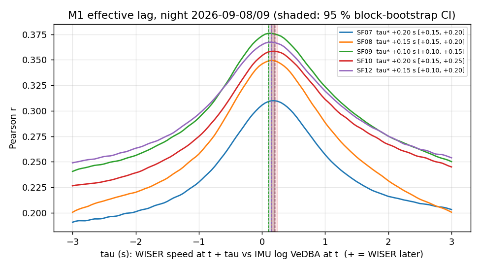
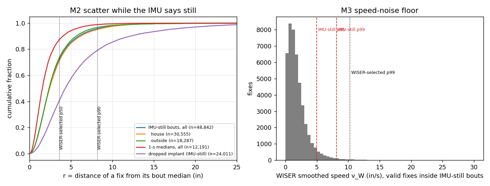
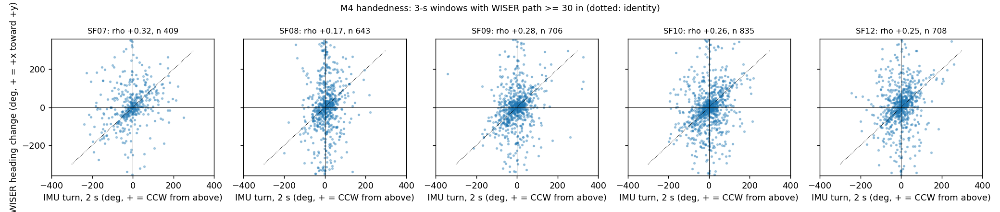

# IMU ↔ WISER calibration pilot — `wiser_baseline` (2026c)

- **What this is:** a *measurement* report. The head IMU of the WILD neurologgers is used as an independent sensor to measure the WISER UWB tracks' effective clock lag, precision floor, speed-noise floor and frame handedness, and how the library rest proxy agrees with head stillness. **No behavioural claim.**
- **Window:** regime-B night 2026-09-08/09: 2026-09-08 20:00:00 → 2026-09-09 06:00:00 field-PC local (EDT), regime B of the accuracy report. Animals and tags (hex, shortid): SF07 = 3079 (12409), SF08 = 3062 (12386), SF09 = 3077 (12407), SF10 = 306b (12395), SF12 = 3059 (12377). Two still events: SF11 dropped implant with tag 3058 in the CH07 box (house_2) (06:12–08:12, 2026-09-07) and SF07 motionless at a paddock corner (behaviour log 2026-09-09 22:33-23:06, rec_s 14100-15500).
- **Frame status:** WISER native inches, unverified offset origin; nothing here places a position in the paddock. M4 tests only the handedness (mirror) of the WISER axes.
- **Plan:** [`implementation_plan/2026-09-29-imu-wiser-calibration-pilot.md`](../../../../implementation_plan/2026-09-29-imu-wiser-calibration-pilot.md) (approved by the user 2026-09-29, after the read-only IMU audit). Acceptance criteria were fixed there, before any result.
- **Run:** `python wiser/scripts/analyze_imu_wiser_calibration.py --cohort 2026c`; bulk `D:\Field2026_analysis_out\2026c\imu_wiser_calibration_pilot_20260929_1232` (per-second tables, bouts, windows, bootstrap, `summary.json`, `input_provenance.json`); pointer `run_manifest_imu_calibration_pilot_2026c.json` next to this report. Git `c9a5e6f+dirty`; runtime 41 s.

## 0. Verdicts

| Metric | Result | Acceptance (pre-registered) | Verdict |
|---|---|---|---|
| M1 effective lag | τ* +0.10 … +0.20 s (spread 0.10 s); CI widths 0.05–0.10 s | every CI ≤ 0.3 s and spread ≤ 0.2 s | **PASS** |
| M2 jitter floor (IMU-selected) | p50/p90/RMSE 2.39/5.95/4.98 in (-33%/-27%/-15% vs 3.57/8.19/5.87); bouts all/house/outside 89/60/29 | ≥ 20 bouts per stratum; > 20 % difference = selector bias | **PASS**; selector-bias flag **RAISED** |
| M3 speed floor | pooled p95/p99 over IMU-still bouts 4.97/8.11 in/s (per animal p99 7.00–9.43); over all IMU-still seconds p99 9.07 | reported vs 6.23/10.24 in/s | reported |
| M4 handedness | Spearman ρ +0.17 … +0.32; sign agreement 65%–71% | same sign on all 5, \|ρ\| ≥ 0.3, ≥ 70 % agreement | **INCONCLUSIVE** |
| M5 rest agreement | κ 0.01–0.02 | reported | reported |

Classification (regime-aware-wiser-tracking): all five results are **measurement** results (no behavioural content). M4, if it passes, remains a **candidate** until one video event confirms the turn sense (plan).

**Reading, per metric** (details and caveats in §2–§9):

1. **M1.** WISER speed lags IMU movement by +0.10 … +0.20 s (median +0.15 s) on every animal; r falls by 0.057–0.081 one second either side of τ*. This is an *effective* lag (WISER latency + head-vs-body kinematics + residual clock offsets of both pc-time paths); for per-second joins it is below one bin.
2. **M2.** While the IMU says the head is still, WISER scatter is **LOWER** than the WISER-selected numbers (2.39/5.95/4.98 vs 3.57/8.19/5.87 in). The flag is raised because the selectors differ, and the direction says the WISER-selected precision is **pessimistic, not optimistic**: its 8-in bout radius also admits real small movements. The same holds against the WISER-selected ≥ 60-s night pauses of the accuracy report and at matched `anchors_used` (§3), and there is no bout-duration trend (post hoc, §3). Category: **mixed** — a still head can sit on a slightly moving body, so this remains an upper bound on jitter.
3. **M3.** Same direction: the speed-noise floor over IMU-still time is p95/p99 4.97/8.11 in/s against 6.23/10.24 in/s.
4. **M4.** Every animal shows ρ > 0 (and the y-mirror control flips it), which points to a right-handed WISER frame, but the pre-registered strength criteria (not met: |ρ| ≥ 0.3 and ≥ 70 % agreement on every animal) decide: **INCONCLUSIVE**. The handedness stays unresolved by this pilot.
5. **M5.** At night the library rest proxy (`rest_mask`, v < 10.24 in/s) is true in 74%–78% of seconds while the head is still in only 7%–13%: κ ≈ 0.02. It marks *not locomoting*, not *still*; it must not be read as a stillness or sleep measure at night without the IMU. Daytime (the main rest period) is not covered here.

## 1. Data, masks and what they removed

- **WISER:** `D:/Field2026_analysis_out/2026c/wiser_working/3rdcohort_Spike_2026_3_4.sqlite` (table `reports`), opened `mode=ro` + `query_only`; sha256 prefix checked against the accuracy report (`82ccadfde589`). 956,552 rows in the three query windows (± 5 min pads), de-duplicated on (shortid, timestamp, x, y).
- **IMU:** make_imu 50-Hz `.imu.npz` under the cohort's `ephys.analysis_root/imu` (full-precision `t_pc_ms`; the per-second CSV is not used), files regenerated on 2026-09-29 by commit `6451d6c` (frozen flag, `invalid`, integer `t_pc_ms`); sizes, mtimes and sha256 in `input_provenance.json`. Raw `analogin.dat` (read-only) only for §6–7.
- **Still thresholds θ_a** (`IMU_STILL_THR`, m/s²): SF07 0.387, SF08 0.307, SF09 0.325, SF10 0.325, SF11 0.387, SF12 0.365; |ω| < 10 °/s.

Seconds of the 10-h night removed per reason (reasons overlap; *any* = the union):

| Animal | seconds | nodata | saturated | frozen flag | frozen rule | invalid | NaN | unreliable | handling | silence | tag validity | **any** | QC-ok | IMU-still |
|---|---|---|---|---|---|---|---|---|---|---|---|---|---|---|
| SF07 | 36000 | 0 | 170 | 0 | 0 | 0 | 0 | 890 | 0 | 0 | 0 | **987** | 35013 | 3958 |
| SF08 | 36000 | 0 | 253 | 0 | 0 | 0 | 0 | 618 | 0 | 0 | 0 | **771** | 35229 | 2562 |
| SF09 | 36000 | 0 | 301 | 0 | 0 | 0 | 0 | 831 | 0 | 0 | 0 | **992** | 35008 | 4413 |
| SF10 | 36000 | 0 | 312 | 0 | 0 | 0 | 0 | 830 | 0 | 0 | 0 | **989** | 35011 | 3645 |
| SF12 | 36000 | 0 | 106 | 0 | 0 | 0 | 0 | 377 | 0 | 0 | 0 | **443** | 35557 | 3566 |

WISER fixes in the night window per tag (library flags):

| Animal | fixes | valid | low-anchor (< 4) | gap | jump |
|---|---|---|---|---|---|
| SF07 | 143,316 | 142,261 | 213 | 531 | 342 |
| SF08 | 143,285 | 141,857 | 202 | 504 | 748 |
| SF09 | 143,773 | 142,409 | 223 | 601 | 567 |
| SF10 | 143,937 | 142,408 | 255 | 694 | 616 |
| SF12 | 145,355 | 143,705 | 281 | 825 | 573 |

The handling windows and padded silences do not reach into the night window, so the out-of-arena mask removes nothing here; it is applied for completeness.
IMU-side removals summed over the five animals: nodata 0, saturated 1142, frozen_flag 0, frozen_rule 0, invalid 0, nan 0, unreliable 3546 s.

## Definitions

Units: WISER positions in **inches** in the WISER native frame (unverified offset origin; no georeference); IMU
acceleration in m/s², angular rate in °/s. Times are field-PC time: WISER `timestamp` (Unix ms) and the IMU's
`t_pc_ms` (make_imu, from the per-session `pc_time_fit.json`), both on the field-PC clock. Symbols: $a$ = animal,
$s$ = field-PC second, $b$ = 0.25-s bin, $i$ = WISER fix, $B$ = bout, $\mathbb 1[\cdot]$ = indicator.

### IMU per-second movement ($\mathrm{VeDBA}_{1s}$, $|\omega|_{1s}$)
$$ \mathrm{VeDBA}(t)=\lVert\mathbf a_H(t)-\bar{\mathbf a}_H(t)\rVert,\qquad \mathrm{VeDBA}_{1s}(s)=\frac1{n_s}\sum_{t\in s}\mathrm{VeDBA}(t),\qquad |\omega|_{1s}(s)=\frac1{n_s}\sum_{t\in s}\lVert\boldsymbol\omega_H(t)\rVert $$
$\mathbf a_H$ = calibrated head-frame acceleration, $\bar{\mathbf a}_H$ its 2-s running mean, $\boldsymbol\omega_H$ =
bias-corrected angular velocity, sums over the 50-Hz make_imu samples whose field-PC time falls in second $s$ ($n_s$ ≈ 50).
**Text:** head movement intensity (m/s²) and angular speed (°/s) per second; ≈ 0.05 m/s² when still, ≈ 3 m/s² active.

### IMU-still second and IMU-still bout
$$ \mathrm{still}_a(s)=\mathrm{ok}_a(s)\wedge \mathrm{VeDBA}_{1s}(s)<\theta_a \wedge |\omega|_{1s}(s)<10\ ^\circ/\mathrm s $$
$\theta_a$ = per-animal valley of the bimodal log-VeDBA histogram (`IMU_STILL_THR` in `ephys/imu_lfp_state_check.py`,
2026-09-28; values in the Data section). A **bout** is a maximal run of consecutive still seconds lasting ≥ 60 s.
**Text:** the head is not moving by an independent sensor; the thresholds were fixed before this pilot.

### QC mask $\mathrm{ok}_a(s)$
$$ \mathrm{ok}_a(s)=\neg\big(\text{nodata}\vee\text{sat}\vee\text{frozen}\vee\text{frozen-rule}\vee\text{invalid}\vee\text{NaN}\vee\text{unreliable}\vee\text{handling}\vee\text{silence}\vee\text{tag-validity}\big) $$
- nodata: < 40 of 50 samples in the second; sat / frozen / invalid / NaN: any sample saturated at full scale, flagged
  `frozen` (make_imu: all six raw lanes 1–6 identical ≥ 0.5 s), `invalid` (after `ephys.imu_valid_until`) or blanked;
  unreliable: > 50 % of samples in Fusion acceleration-/overrange-recovery or start-up (make_imu's per-second rule);
- frozen-rule (the audit's derived-signal rule, cross-check): samples in a run of ≥ 0.5 s with
  $|\Delta|\omega||<10^{-4}$ °/s and VeDBA $<10^{-3}$ m/s², padded ± 2 s;
- handling: a window in `cv/configs/cohort3_handling_windows.json`; silence: an all-tag WISER silence ± 2 min
  (`c3_all_tag_silences_merged.csv`, accuracy run); tag-validity: outside the tag's `valid_from`/`valid_until`
  (`rat_identities_2026c.csv`).
**Text:** a second enters any metric only when the IMU is live, on the animal, unsaturated and the animal is in the
arena and not handled.

### WISER smoothed position and speed ($\hat{\mathbf p}_i$, $v_i$) — library `add_speed`
$$ \hat{\mathbf p}_i=\operatorname{median}_{j=i-3}^{i+3}\mathbf p_j,\qquad v_i=\frac{\lVert\hat{\mathbf p}_{\mathrm{hi}(i)}-\hat{\mathbf p}_{\mathrm{lo}(i)}\rVert}{t_{\mathrm{hi}(i)}-t_{\mathrm{lo}(i)}} $$
lo/hi = first/last fix inside $[t_i-0.5\,\mathrm s,\,t_i+0.5\,\mathrm s]$; $v>60$ in/s → NaN. **Text:** jitter-suppressed
locomotion speed (in/s), centred in time. **Valid fix** (library `add_validity_flags`): `anchors_used` ≥ 4, no gap
(Δt ≤ 5 × the tag's median Δt), no jump (raw speed ≤ 200 in/s).

### Alignment
WISER times are shifted onto the IMU clock by the animal's $\tau^\*$ (M1): $t_i^{\mathrm{al}}=t_i-\tau^\*_a$. The
dropped implant uses the median $\tau^\*$ of the five animals (a static device is insensitive to it).

### M1 — effective lag $\tau^\*$
$$ x_b=\log_{10}\!\Big(\tfrac1{n_b}\textstyle\sum_{t\in b}\mathrm{VeDBA}(t)+0.01\Big),\qquad y_b(\tau)=v_W(c_b+\tau),\qquad \tau^\*=\arg\max_{\tau\in\{-3,-2.95,\dots,3\}\,\mathrm s}\ \mathrm{corr}_{\mathrm{Pearson}}\big(x_b,\,y_b(\tau)\big) $$
$c_b$ = centre of 0.25-s bin $b$; $v_W(t)$ = linear interpolation of $v_i$ over valid fixes, defined only where the two
bracketing fixes are ≤ 1 s apart; the same bins (all samples QC-ok, all $\tau$ defined) are used for every $\tau$.
**Text:** the shift (s) at which WISER speed best follows IMU movement; **+ = WISER later than the IMU**. It is an
*effective* lag = clock offset + WISER's internal processing latency + head-vs-body kinematics — not a pure clock
offset. The 0.01 m/s² offset keeps the log finite and is well below the still mode (~0.05 m/s²).

### M1 — 95 % CI by block bootstrap
$$ \tau^{\*(k)}=\arg\max_\tau \mathrm{corr}\big(x,y(\tau)\big)\ \text{on blocks } \{B_{j}^{(k)}\}_{j=1}^{K}\ \text{drawn with replacement},\quad k=1..1000;\qquad \mathrm{CI}=\big[Q_{0.025},Q_{0.975}\big]\big(\{\tau^{\*(k)}\}\big) $$
Blocks = the $K$ non-overlapping 300-s blocks of the night that contain bins. **Text:** 300 s is long compared with
movement bouts (seconds to a minute), so within-block autocorrelation is kept; CI width in s.

### M2 — radial deviation (non-circular jitter floor)
$$ r_i=\big\lVert\mathbf p_i-\operatorname{median}_{j\in B}\mathbf p_j\big\rVert_2,\quad i\in B;\qquad \mathrm pq=Q_q(\{r_i\}),\qquad \mathrm{RMSE}=\sqrt{\tfrac1N\textstyle\sum_i r_i^2} $$
$B$ = the raw fixes (all anchors, the baseline's method) whose aligned time lies in an IMU-still bout trimmed by 1 s at
each end; bouts need ≥ 30 fixes. Variants: *valid fixes* (median and $r$ over valid fixes); *1-s medians*
$r_s=\lVert\tilde{\mathbf p}_s-\operatorname{median}_B\mathbf p\rVert$ with $\tilde{\mathbf p}_s$ the coordinate-wise median
of the fixes in aligned second $s$. **Zone**: *house* if the bout median lies inside house_1 or house_2 of
`wiser_rois.json` grown by 14 in (library buffer ≈ 2 × the 7-in jitter floor), else *outside*. **Text:** WISER
scatter (in) while an independent sensor says the head is still — precision, not accuracy; still an upper bound on
sensor jitter where the body moves under a still head (breathing, shifting), but free of the WISER-side selection.
**Selector-bias flag:** $|Q^{\mathrm{IMU}}/Q^{\mathrm{WISER\text{-}sel}}-1|>0.20$ for p50, p90 or RMSE against
3.57 / 8.19 / 5.87 in.

### M3 — speed-noise floor over IMU-still time
$$ F_q=Q_q\big(\{v_i: i\ \text{valid},\ t^{\mathrm{al}}_i\in \text{IMU-still bout (trimmed)}\}\big),\quad q\in\{0.5,0.95,0.99\} $$
and the same over all IMU-still seconds. **Text:** the smoothed WISER speed (in/s) a tag shows while the head is still;
compare with the WISER-selected p99 = 10.24 in/s. Below $F_{0.99}$ locomotion and jitter cannot be told apart.

### M4 — heading change (WISER) and integrated turn (IMU)
$$ \mathbf d_k=\tilde{\mathbf p}_{s_0+k}-\tilde{\mathbf p}_{s_0+k-1}\ (k=1,2,3),\qquad \Delta\psi_W=\sum_{k=1}^{2}\operatorname{atan2}\!\big(d_{k,x}d_{k+1,y}-d_{k,y}d_{k+1,x},\ \mathbf d_k\!\cdot\!\mathbf d_{k+1}\big),\qquad \Delta\psi_I=\int_{s_0+1}^{s_0+3}\omega_{\mathrm{turn}}(t)\,dt $$
$\tilde{\mathbf p}_s$ = aligned 1-s median of ≥ 2 valid fixes; windows start every 3 s ($s_0$), need all four medians,
four QC-ok IMU seconds and path $\sum_k\lVert\mathbf d_k\rVert\ge 30$ in (≈ 10 in/s, the speed floor). The IMU span
$[s_0+1,s_0+3)$ runs from the mid-time of $\mathbf d_1$ to that of $\mathbf d_3$. $\omega_{\mathrm{turn}}=\boldsymbol\omega_H\cdot\hat{\mathbf u}$
(make_imu `turn_dps`, $\hat{\mathbf u}$ = head-frame up vector from the 6-axis AHRS). **Signs:** $\Delta\psi_W>0$ = the
path turns from WISER $+x$ toward $+y$; $\Delta\psi_I>0$ = counter-clockwise seen from above (right-hand rule about
up). **Statistics:** Spearman $\rho(\Delta\psi_W,\Delta\psi_I)$; Theil–Sen slopes $b_{I|W}$ ($\Delta\psi_I$ on
$\Delta\psi_W$) and $b_{W|I}$; sign agreement $A=\frac{1}{|S|}\sum_{S}\mathbb 1[\operatorname{sgn}\Delta\psi_W=\sigma\operatorname{sgn}\Delta\psi_I]$
over $S=\{|\Delta\psi_I|>45^\circ\}$ with $\sigma$ = the sign of the pooled median $\rho$. **Text:** $\rho>0$ means
WISER's (x, y, up) is right-handed (+x → +y counter-clockwise from above); $\rho<0$ means a mirrored frame. Because both
regressors carry noise (WISER jitter; head turns that do not turn the path), each slope is attenuated; the IMU/WISER
scale factor lies between $b_{I|W}$ and $1/b_{W|I}$ — a bracket containing 1 is consistent with a correct gyro scale.
**Mirror control:** the same statistics with WISER $y\to-y$ must flip the sign of $\rho$.

### M5 — rest-proxy agreement
$$ \mathrm{rest}_W(s)=\mathbb 1\Big[\tfrac1{n_s}\textstyle\sum_{i\in s}\mathbb 1[v_i<10.24\ \mathrm{in/s}]\ge 0.5\Big],\qquad \kappa=\frac{p_o-p_e}{1-p_e},\quad p_e=p_Ip_W+(1-p_I)(1-p_W) $$
$v_i<10.24$ is the library REST proxy `wiser_analysis_utils.rest_mask` (smoothed speed below the stationary p99
speed-noise floor — here the cohort-3 value; NaN speed = not resting), over valid fixes in aligned second $s$. $p_o$ =
observed agreement with IMU stillness, $p_I,p_W$ = the two positive rates. Sensitivity = $P(\mathrm{rest}_W\mid\mathrm{still})$,
specificity = $P(\neg\mathrm{rest}_W\mid\neg\mathrm{still})$, over QC-ok seconds with ≥ 1 valid fix. **Text:** how far
"WISER says not locomoting" matches "the head is still"; κ ∈ [−1, 1], 0 = chance agreement. The two constructs differ
by design (a grooming or eating rat stays in place while its head moves), so specificity is expected to be the weak side.

## 2. M1 — effective lag

| Animal | τ* (s) | 95 % CI (s) | CI width (s) | r(τ*) | r(0) | bins used | hours | 300-s blocks | boundary |
|---|---|---|---|---|---|---|---|---|---|
| SF07 | +0.20 | [+0.15, +0.20] | 0.05 | 0.310 | 0.306 | 57,659 | 4.00 | 120 | no |
| SF08 | +0.15 | [+0.15, +0.20] | 0.05 | 0.349 | 0.346 | 58,464 | 4.06 | 120 | no |
| SF09 | +0.10 | [+0.10, +0.15] | 0.05 | 0.376 | 0.373 | 57,625 | 4.00 | 120 | no |
| SF10 | +0.20 | [+0.15, +0.25] | 0.10 | 0.358 | 0.354 | 57,612 | 4.00 | 120 | no |
| SF12 | +0.15 | [+0.10, +0.20] | 0.10 | 0.367 | 0.365 | 58,958 | 4.09 | 120 | no |

Bins used = the 0.25-s bins whose IMU samples are all QC-ok **and** where $v_W$ is defined at every τ from −3 to +3 s (the pre-registered same-bins rule). That keeps SF07 40%, SF08 41%, SF09 40%, SF10 40%, SF12 41% of the night's bins: SF07 14.9%, SF08 15.0%, SF09 14.7%, SF10 14.6%, SF12 14.1% of the night lies in inter-fix intervals > 1 s (normal cadence pauses; the median interval is ≈ 0.23 s), and fixes without a neighbour within ± 0.5 s have no `add_speed` value (SF07 9,286, SF08 9,257, SF09 9,418, SF10 9,349, SF12 9,422 fixes). A 6-s span without any such pause is required, so dense-cadence periods are kept; nothing suggests this biases the lag.

Median τ* over the five animals: **+0.15 s**; spread 0.10 s. Verdict **PASS** (CIs all ≤ 0.3 s; spread ≤ 0.2 s).

Reading: the field-PC timestamps of both sensors carry their own error — the IMU's `pc_time` fit residual is 9–61 ms (native) on these sessions and the BLE PC-time path is a 10–100 ms-class coordinate — so a common lag reflects WISER's own latency plus head-vs-body kinematics as much as any clock offset.

## 3. M2 — non-circular jitter floor

| Stratum | bouts | bout hours | fixes | p50 | p75 | p90 | p95 | RMSE | 1-s median p50 / p90 / RMSE |
|---|---|---|---|---|---|---|---|---|---|
| all (all fixes) | 89 | 3.5 | 48,842 | 2.39 | 3.83 | 5.95 | 7.77 | 4.98 | 1.54 / 4.02 / 3.73 |
| all (valid fixes) | 89 | 3.5 | 48,485 | 2.39 | 3.83 | 5.92 | 7.70 | 4.01 | 1.54 / 4.02 / 3.73 |
| zone house | 60 | 2.2 | 30,555 | 2.42 | 3.91 | 6.17 | 8.14 | 5.24 | 1.60 / 4.31 / 4.29 |
| zone outside | 29 | 1.3 | 18,287 | 2.35 | 3.71 | 5.63 | 7.18 | 4.52 | 1.46 / 3.51 / 2.51 |
| animal SF07 | 20 | 0.7 | 9,235 | 2.41 | 3.95 | 6.35 | 8.76 | 5.52 | 1.54 / 4.42 / 2.95 |
| animal SF08 | 12 | 0.5 | 6,777 | 2.32 | 3.68 | 5.45 | 7.04 | 4.64 | 1.53 / 3.86 / 3.79 |
| animal SF09 | 23 | 0.9 | 13,065 | 2.39 | 3.80 | 5.69 | 7.28 | 4.54 | 1.48 / 3.61 / 2.57 |
| animal SF10 | 20 | 0.8 | 11,572 | 2.61 | 4.26 | 6.70 | 8.69 | 5.89 | 1.71 / 4.60 / 5.65 |
| animal SF12 | 14 | 0.6 | 8,193 | 2.15 | 3.44 | 5.16 | 6.70 | 3.75 | 1.36 / 3.57 / 2.33 |
| dropped implant, IMU-still runs ≥ 60 s | 16 | 1.70 | 24,011 | 4.30 | 7.33 | 12.18 | 16.75 | 8.10 | 3.19 / 8.48 / 5.92 |
| SF07 corner event, IMU-still bouts | 5 | – | 2,451 | 3.15 | 4.86 | 8.44 | 12.95 | 7.40 | 1.97 / 5.12 / 4.71 |
| *baseline: WISER-selected rest bouts ≥ 10 min, 2026c* | 1151 | 325 | – | 3.57 | 5.61 | 8.19 | 10.33 | 5.87 | – / 6.23 / – |
| *WISER-selected pauses ≥ 60 s at night, in houses (accuracy report)* | 3546 | 173 | – | 4.48 | – | 10.87 | – | 7.46 | – |
| *WISER-selected pauses ≥ 60 s at night, outside houses (accuracy report)* | 2022 | 67.6 | – | 4.6 | – | 10.87 | – | 7.76 | – |

Against the WISER-selected baseline, the IMU-selected pooled scatter differs by p50 -33%, p90 -27%, RMSE -15%: the selector-bias flag (> 20 %) is **RAISED**. Bout counts per stratum: all 89, house 60, outside 29 (≥ 20 required) → **PASS**.

By `anchors_used` (IMU-still bouts, pooled; a bout counts in every stratum it has fixes in), next to the accuracy report's regime-B WISER-selected rest bouts at the same anchor count:

| anchors | share of fixes | bouts | p50 | p90 | RMSE | WISER-selected rest bouts p50 / p90 |
|---|---|---|---|---|---|---|
| 3 | 0.1% | 35 | 9.90 | 111.46 | 62.95 | 14.8 / 38.5 |
| 4 | 0.3% | 44 | 5.80 | 22.91 | 20.77 | 9.4 / 25.5 |
| 5 | 0.7% | 70 | 7.49 | 18.75 | 17.36 | 6.6 / 17.7 |
| 6 | 2.1% | 88 | 5.63 | 12.20 | 13.22 | 5.3 / 13.6 |
| 7 | 5.7% | 89 | 3.21 | 7.97 | 5.53 | 4.3 / 10.1 |
| 8 | 20.4% | 89 | 2.72 | 6.71 | 4.28 | 3.7 / 8.1 |
| 9 | 70.7% | 89 | 2.21 | 5.07 | 3.31 | 3.3 / 7.1 |

**Post hoc (added after the first run to read the flag's direction; no verdict uses it):** scatter by IMU-still bout duration.

| bout duration | bouts | fixes | p50 | p90 | RMSE |
|---|---|---|---|---|---|
| 60–120 s | 40 | 12,603 | 2.41 | 5.85 | 4.94 |
| 120–300 s | 48 | 34,412 | 2.39 | 6.01 | 5.00 |
| ≥ 300 s | 1 | 1,827 | 2.33 | 5.61 | 4.81 |

Reading: the IMU-selected scatter is lower than the WISER-selected rest bouts overall, at every anchor count, and than the WISER-selected ≥ 60-s night pauses (same minimum duration; all cohort-3 nights), and it does not grow from 1-min to 5-min bouts. The likeliest reading is that the WISER-side selector (5-s medians within 8 in) admits real small movements of the animal, so the published WISER precision is conservative. It is not proof: the IMU-still set is small (night only) and a still head can still ride a moving body.

## 4. M3 — speed-noise floor over IMU-still time

| Animal | fixes in bouts | p50 | p95 | **p99** | fixes in all still seconds | p50 | p95 | p99 |
|---|---|---|---|---|---|---|---|---|
| SF07 | 8,604 | 1.47 | 5.32 | **9.06** | 14,413 | 1.49 | 5.18 | 8.67 |
| SF08 | 6,319 | 1.45 | 4.53 | **7.32** | 9,414 | 1.55 | 5.05 | 8.38 |
| SF09 | 12,087 | 1.51 | 4.74 | **7.24** | 16,028 | 1.55 | 5.05 | 8.03 |
| SF10 | 10,765 | 1.61 | 5.60 | **9.43** | 13,390 | 1.71 | 6.32 | 11.50 |
| SF12 | 7,630 | 1.31 | 4.37 | **7.00** | 13,238 | 1.50 | 5.45 | 8.88 |
| pooled | 45,405 | 1.48 | 4.97 | **8.11** | 66,483 | 1.56 | 5.43 | 9.07 |
| *baseline (WISER-selected bouts)* | – | 1.71 | 6.23 | **10.24** | – | – | – | – |

## 5. M4 — frame handedness and gyro scale

| Animal | windows | Spearman ρ | p | b(I\|W) | 1/b(W\|I) | windows \|Δψ_I\| > 45° | same-sign fraction | ρ after y → −y |
|---|---|---|---|---|---|---|---|---|
| SF07 | 409 | 0.324 | 1.9e-11 | 0.28 | 2.08 | 187 | 0.71 | -0.324 |
| SF08 | 643 | 0.171 | 1.2e-05 | 0.06 | 2.10 | 174 | 0.65 | -0.171 |
| SF09 | 706 | 0.281 | 3.1e-14 | 0.17 | 1.91 | 248 | 0.67 | -0.281 |
| SF10 | 835 | 0.259 | 2.7e-14 | 0.18 | 2.01 | 338 | 0.69 | -0.259 |
| SF12 | 708 | 0.250 | 1.6e-11 | 0.15 | 1.84 | 261 | 0.66 | -0.250 |

Verdict: **INCONCLUSIVE** (same sign on all five: yes; every |ρ| ≥ 0.3: no; every sign agreement ≥ 70 %: no).

Reading: ρ is positive on 5 of 5 animals, each with p ≤ 1e-05, and mirroring y flips every one — the turn senses are related, and the sign points to a right-handed WISER frame (given the gyro convention below). But the association is weak (a 2-s window of 1-s-median path headings is noisy, and heads turn without the path turning), so the pre-registered bar is not met. The gyro-scale brackets [b(I|W), 1/b(W|I)] all contain 1 (a weak check: the brackets are wide).

**Sign conventions and what they assume.**
- *IMU:* `turn_dps` = ω·û. A dot product of two vectors written in the same orthonormal basis does not depend on that basis' handedness or on the axis map S (orthogonal), so + = counter-clockwise seen from above **provided each gyro axis reports the right-hand-rule rate about the same positive axis as the accelerometer axis of the same index** (the usual MEMS datasheet convention). The CE64's IMU chip and datasheet are not documented here, so this is an assumption; the audit's phrase 'right-handed MEMS chip' is the common case of it. û is the up direction (Fusion `get_gravity`, NWU: the accelerometer's at-rest reading), confirmed by make_imu's synthetic self-test.
- *WISER:* + = rotation from +x toward +y. That is counter-clockwise from above iff (x, y, up) is right-handed. The paddock/calibration frame is x along the paddock, y across, z up (`calibration_qc` report §1), used with proper rotations, i.e. right-handed; the user states (2026-09-28) that the WISER axes point the same way. Under that statement the expectation is ρ > 0; ρ < 0 on all animals would contradict it (a mirrored WISER frame, the accuracy report's unresolved H− hypothesis) — or the gyro convention above.
- *Gyro scale:* the scale factor lies between b(I|W) and 1/b(W|I) (each slope is attenuated by noise in its regressor: WISER jitter on one side, head turns that do not turn the path on the other). A bracket containing 1 is consistent with the ±2000 °/s scale; it is a weak check.

## 6. M5 — WISER rest proxy vs IMU stillness

| Animal | seconds | IMU-still share | rest_W share | agreement | κ | sensitivity | specificity | PPV | NPV |
|---|---|---|---|---|---|---|---|---|---|
| SF07 | 34,142 | 11.3% | 77.8% | 29.4% | 0.01 | 82.1% | 22.7% | 11.9% | 90.9% |
| SF08 | 34,370 | 7.3% | 76.1% | 28.6% | 0.01 | 82.5% | 24.3% | 7.9% | 94.6% |
| SF09 | 34,074 | 12.6% | 75.4% | 32.6% | 0.02 | 81.6% | 25.5% | 13.7% | 90.6% |
| SF10 | 34,048 | 10.4% | 73.7% | 32.9% | 0.02 | 81.8% | 27.2% | 11.6% | 92.8% |
| SF12 | 34,456 | 10.0% | 76.0% | 30.6% | 0.02 | 82.8% | 24.8% | 10.9% | 92.8% |

Reading: sensitivity is high (when the head is still, WISER almost always reports sub-floor speed) but specificity is low (most seconds with a moving head are also sub-floor for WISER: the animal moves its head without locomoting — grooming, eating, exploring in place). PPV ≈ the still share, so κ ≈ 0. This is a difference of constructs, not a WISER fault; it matters wherever `rest_mask` is read as rest or sleep.

## 7. Still events

**Dropped implant (fixed-tag reference), 2026-09-07 06:12:00 → 08:12:00.** After `imu_valid_until` (SF11 06:10:00) the regenerated make_imu files blank this IMU (`invalid`), so its stillness was measured from the raw `analogin.dat` (lanes 1–6, read in place; 1250 → 100 Hz with make_imu's filter; VeDBA and |ω| after removing the window's median gyro; no AHRS needed for these rotation-invariant magnitudes). Timing from the npz logger→PC map (pc_time verdict: OK-native [last touch 10.8 h, tail 1.5 h extrapolated]; only minutes-level timing matters for a static device). No handling/tag-validity mask is applied: the IMU itself shows any disturbance.

- IMU: 6,884 of 7,200 QC-ok seconds still (95.6%); VeDBA_1s p50/p99/max 0.021/0.804/4.237 m/s²; |ω|_1s p50/p99/max 0.19/27.34/259.24 °/s; raw-lane freeze 0.0 s; saturated 0.00 s; 116 non-still runs.
- Largest non-still runs (start, seconds, max VeDBA_1s): 06:28:54 5 s 4.24; 07:21:02 3 s 2.56; 06:30:01 7 s 2.37; 06:30:13 4 s 2.26; 06:54:31 2 s 2.20; 06:29:44 14 s 1.88; 06:29:01 2 s 1.81; 06:50:38 3 s 1.78.
- WISER tag 12376: 28,312 fixes in the window; bout zones house.

| Selection | fixes | p50 | p90 | p95 | RMSE |
|---|---|---|---|---|---|
| whole window, about the window median | 28,312 | 5.30 | 13.81 | 18.54 | 9.20 |
| 06:12–07:24 (before the handling window) | 16,918 | 5.76 | 14.91 | 19.29 | 9.61 |
| IMU-still runs ≥ 60 s, about each run's median | 24,011 | 4.30 | 12.18 | 16.75 | 8.10 |
| same, 1-s medians | 5,992 | 3.19 | 8.48 | 12.34 | 5.92 |
| *accuracy report, 06:12–08:17 full* | – | 5.26 | 13.77 | – | 9.19 |

Implant scatter by `anchors_used` (IMU-still runs): 3: n 886, p50 16.27, p90 24.22; 4: n 789, p50 11.11, p90 19.47; 5: n 1378, p50 8.30, p90 19.43; 6: n 2045, p50 5.53, p90 16.83; 7: n 2578, p50 4.87, p90 12.44; 8: n 6901, p50 3.86, p90 9.17; 9: n 9434, p50 3.63, p90 7.56.

Reading: the device lay in the CH07 box under huddling rats (accuracy report §5.2; behaviour log 09-07); only 39% of its fixes used 9 anchors (on-head tags at night: 71%), and even at 9 anchors its scatter (p50 3.63 in) exceeds the on-head IMU-still value (2.21 in). It is a true fixed tag but a worst-case in-house placement (low, shielded by bodies), not the typical on-animal floor.

**SF07 at a paddock corner, 2026-09-09 22:33:00 → 23:06:00.** 1014 of 1951 QC-ok seconds IMU-still (52%); VeDBA_1s median 0.279 m/s², |ω|_1s median 7.0 °/s; 5 IMU-still bouts ≥ 60 s (outside); 7,822 WISER fixes. Whole-window scatter (about the window median) p50/p90/RMSE 5.88/124.42/128.18 in (this includes the departure below). The behaviour-log entry is an observation (WISER live view), used as a seed, not ground truth; this was the 09-09 evening with PM rain (the accuracy report's wettest regime-B night, gap time 0.47 %).
- WISER keeps the tag in place (per-minute medians within 24 in of the first 10 min's median) until **23:01**, then it leaves. Over that span the IMU is still in 1014 of 1655 QC-ok seconds and active in 641; the longest active run starts 22:58:11 and lasts 76 s (median VeDBA_1s 3.09 m/s², |ω|_1s 194 °/s) while the WISER position does not move — the M5 construct gap in one event: 'motionless' by WISER is not 'still' by the head.

## 8. Frozen-IMU rule: verification and hits

Primary QC is make_imu's new `frozen` flag (all six raw lanes identical ≥ 0.5 s). The audit's derived-signal rule cannot fire on the regenerated files where frozen samples are blanked (NaN), so it was verified on the raw lanes: ± 10 min around each known freeze edge, raw → 100 Hz → |ω| and VeDBA exactly as in make_imu (minus the AHRS), then the rule.

| Session | expected | make_imu `frozen` flag runs (start → end, s) | probe | derived-signal rule runs | raw-lane rule runs |
|---|---|---|---|---|---|
| SF12 14_20260902_191103.245 | 09-02 19:39:38 → 09-03 00:22:00 | 09-02 19:39:36 → 09-03 00:22:17 (16962) | onset 19:29:38–19:49:38 | 19:39:37 → 19:49:36 (599.9) | 19:39:36 → 19:49:37 (601.9) |
| SF12 14_20260902_191103.245 | 09-02 19:39:38 → 09-03 00:22:00 | 09-02 19:39:36 → 09-03 00:22:17 (16962) | offset 00:12:00–00:22:17 | 00:12:01 → 00:22:16 (615.8) | 00:12:00 → 00:22:17 (617.8) |
| SF07 9_20260906_194035.495 | 09-07 07:56:40 → 09-07 08:06:06 | 09-07 07:56:37 → 09-07 08:06:07 (570) | onset 07:46:40–08:06:07 | 07:56:38 → 08:06:06 (567.5) | 07:56:37 → 08:06:07 (569.5) |
| SF07 9_20260906_194035.495 | 09-07 07:56:40 → 09-07 08:06:06 | 09-07 07:56:37 → 09-07 08:06:07 (570) | offset 07:56:06–08:06:07 | 07:56:38 → 08:06:06 (567.5) | 07:56:37 → 08:06:07 (569.5) |

Hits in the pilot night (per animal: seconds carrying the make_imu flag / the derived rule; the derived rule can only fire on unblanked samples): SF07 0 / 0; SF08 0 / 0; SF09 0 / 0; SF10 0 / 0; SF12 0 / 0.

## 9. Caveats

- **One night, five animals, regime B.** 09-08 20:00 → 09-09 06:00 (no handling inside; construction noise from 09-08 ~07:50 has no logged end; the BLE ad-feed outage was the previous night). Regime A (08-30 → 09-03 13:59, shifted and noisier frame) and regime C (after the 09-11 females) are not covered.
- **Masks.** Section 1 lists what each rule removed, per animal and per reason.
- **Tag-table discrepancy (not affecting this night).** wiser/configs/rat_identities_2026c.csv puts tag 3059 (12377) on SF12 from 2026-08-30 19:00, but the accuracy report's first 3059 fix is 2026-08-31 06:36 (SF12's first tag 3058 was essentially silent). Does not affect the 09-08/09 night.
- **Precision, not accuracy.** M2 scatter is about each bout's own median; it says nothing about where the tag is in the paddock. A still head can sit on a body that shifts a little (breathing, settling), so M2 remains an upper bound on sensor jitter — but one selected without WISER.
- **WISER's own filtering is unknown.** If the positioning engine smooths more when a tag is at rest (common in UWB systems with a tag motion sensor), the IMU-still scatter measures that engine state; it is still the precision a still animal gets.
- **Alignment of the event windows.** The dropped implant is aligned with the five-animal median τ*; for a static device the lag is immaterial.
- **M4 is a candidate at best.** It rests on the gyro-sign convention above (undocumented chip) and on WISER path turns reflecting head turns on average; a single video event with a known turn direction would confirm it.
- **IMU inputs were regenerated during this work** (commit `6451d6c`, 2026-09-29): the pilot read the new files only; their hashes are in `input_provenance.json`.

