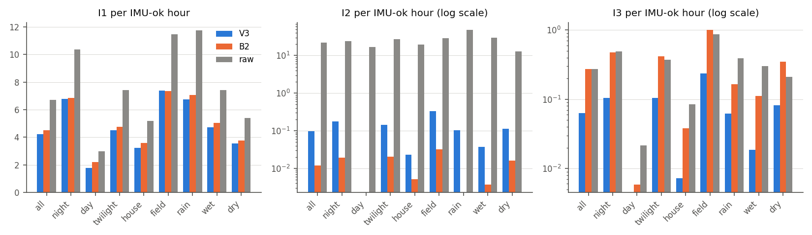
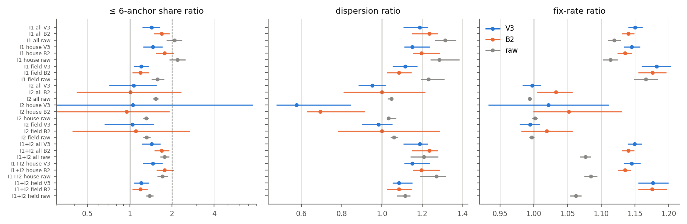
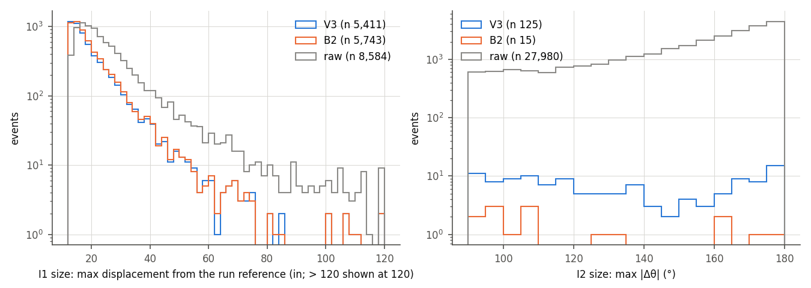

# WISER baseline 2026c — IMU–WISER consistency audit: where does WISER move or turn while the head IMU says it cannot?

- **Status:** measurement report, 2026-10-05. Plan `implementation_plan/2026-10-05-wiser-imu-consistency-audit.md` (approved by the user 2026-10-05, "搞"; committed ff3c75c before any result; operational details in its Amendment 1, written before any number; Amendment 2, written after the first run's pooled numbers, fixes a CSV time-precision bug that changed only the event-list times and adds a declared post-hoc sensitivity — no definition, threshold or rule changed; run `wiser_imu_consistency_20261005_1721` superseded). Driver `wiser/scripts/analyze_wiser_imu_consistency.py`, config `wiser/configs/wiser_imu_consistency_2026c.json` (verdict in `decision`), run `D:\Field2026_analysis_out\2026c\wiser_imu_consistency_20261005_2038`, git `951300d+dirty`.
- **What this is:** a measurement of the residual inconsistencies between the production default WISER tracks and the head IMU — I1 (the track moves ≥ 12 in during a stretch the IMU never calls locomotion), I2 (the path turns ≥ 90° in 2 s while the head turns < 20°), I3 (head turn ≥ 90°, path < 20°; reported only). **No correction is applied and no behavioural claim is made.** Frame: WISER native inches, unverified offset origin (distances and turn differences only).
- **Regime context (regime-aware-wiser-tracking):** an event is a WISER error, a loco-detector miss (TPR 0.75 / FPR 0.15) or a real movement the IMU state does not capture (e.g. being pushed in a huddle). The evidence that events are WISER's fault is their enrichment in bad-geometry fixes (≤ 6 anchors, wide dispersion) relative to matched windows — circumstantial; the video check decides. House interiors have worse geometry by default → enrichment is also reported within zone.

## Verdict

| Pre-registered quantity (V3, pooled, all included hours) | value [95 % CI] | rule | met |
|---|---|---|---|
| I1 + I2 rate per IMU-ok hour | 4.333 [4.179, 4.487] | ≥ 1 | yes |
| ≤ 6-anchor share ratio, event / matched control | 1.43 [1.23, 1.64] (event 17.4 % vs control 12.2 %) | ≥ 2 | no |
| CI lower bound of that ratio | 1.23 | > 1 | yes |
| IMU-ok hours / events in the enrichment | 1,277.6 h / 5,503 | | |

**NOT MATERIAL.** Per the plan, V3 stays as is; the per-fix QC flags are the deliverable. Per-type results follow.

## Reading

- V3 per IMU-ok hour (1,278 h): I1 4.24 (5,411 events), I2 0.10 (125), I3 0.06 (80); B2: I1 4.50, I2 0.01, I3 0.27; raw medians: I1 6.72, I2 21.90, I3 0.27.
- **V3 I1 by stratum:** night 6.76, day 1.77, twilight 4.50; house 3.22, field 7.39; rain 6.73, wet 4.72, dry 3.55. **V3 I2:** night 0.17, day 0.00; house 0.02, field 0.33.
- **The filters already remove most of the raw inconsistencies:** I2 falls from 21.90 (raw medians) to 0.01 (B2) and 0.10 (V3) per hour; I1 from 6.72 to 4.50 and 4.24. Matched by run, 405 B2 I1 events are absent in V3 and 73 appear only in V3; 0 V3 I1 events fall in all-still runs (V3's ZUPT pins them), so the residual I1 sits in runs with at least one IMU-active second.
- **I1 grows with run length:** the share of V3 runs with an event rises from 1.5 % (1–10 s), 12.4 % (11–30 s), 18.1 % (31–60 s), 27.8 % (1–5 min), 39.1 % (5–30 min), 63.1 % (> 30 min) (§4) — as compatible with slow repositioning, huddle shifts or a slow WISER bias inside long rests as with transient WISER errors (the reference is the start of the run).
- **Enrichment V3 I1** (≤ 6-anchor share ratio): all 1.43 [1.24, 1.63]; house 1.46 [1.26, 1.70]; field 1.21 [1.07, 1.36].
- **Enrichment V3 I2** (≤ 6-anchor share ratio): all 1.07 [0.72, 1.54]; house 1.05 [0.00, 7.47]; field 1.04 [0.67, 1.47].
- **Enrichment V3 I1+I2** (≤ 6-anchor share ratio): all 1.43 [1.23, 1.64]; house 1.46 [1.24, 1.70]; field 1.21 [1.08, 1.36].
  V3 I1 dispersion ratio 1.19 [1.11, 1.23], fix-rate ratio 1.15 [1.14, 1.16]. B2 / raw I1 share ratios: B2 1.69 [1.50, 1.91], raw 2.09 [1.85, 2.34].
  Post hoc (Amendment 2): with both windows restricted to seconds holding ≥ 2 raw fixes, the V3 I1 share ratio is 1.44 [1.26, 1.65] and the fix-rate ratio 0.99 [0.98, 1.00] — the fix-rate excess above is the window-construction asymmetry, the ≤ 6-anchor excess is not.
- **Reading of the enrichment:** V3 event windows hold more ≤ 6-anchor fixes than matched windows (CI above 1, in both zones), so part of the residual events is bad WISER geometry; but the excess is well below the pre-registered 2×, smaller than in B2 and in the raw medians (V3 already discounts low-anchor fixes), and V3's I2 windows are not enriched at all. Most residual events are therefore not explained by geometry: they are as compatible with loco-detector misses (the largest I1 events are 70–120-in displacements in tens of seconds at 8–9 anchors) and real slow movement as with WISER errors. The video check of §5 decides individual cases.
- **I2 in V3** is rare (0.10 per IMU-ok hour, none by day); the largest are path reversals (|Δθ| ≈ 170–180°) at speeds just above the 10-in/s floor with good geometry — candidates for back-and-forth movement or WISER noise at low speed, to be checked on video. **I3** (head turn without a path turn, reported only) is 0.06 per hour in V3 and 0.27 in B2 / raw.
- Within zone and per track: §3. Sizes and V3 vs B2: §4. Event lists for the video check: §5. Flags: §6. Reproduction: §7.

Classification (regime-aware-wiser-tracking): a **measurement** result about WISER and the head IMU (no behavioural content). Rates count candidate inconsistencies, not errors.

## 1. Coverage

| animal | days | IMU-ok s (cache) | included h | runs (≥ 5 s) | run hours (trimmed) | candidate pairs V3 / B2 / raw | masked fixes | τ* (ms) |
|---|---|---|---|---|---|---|---|---|
| SF07 | 14 | 840,288 | 233.4 | 13,461 | 177.5 | 5,008 / 5,293 / 19,789 | 322,647 | 200 |
| SF08 | 14 | 840,537 | 233.5 | 13,727 | 189.2 | 4,710 / 5,476 / 23,634 | 347,641 | 150 |
| SF09 | 14 | 840,225 | 233.4 | 13,523 | 178.7 | 8,087 / 9,409 / 26,078 | 342,204 | 100 |
| SF10 | 14 | 828,780 | 230.2 | 12,443 | 172.8 | 10,355 / 11,748 / 29,703 | 341,220 | 200 |
| SF11 | 9 | 446,791 | 124.1 | 6,938 | 100.7 | 2,141 / 2,326 / 10,609 | 193,901 | 150 |
| SF12 | 13 | 802,815 | 223.0 | 12,759 | 172.8 | 8,430 / 9,285 / 28,558 | 295,025 | 150 |
| **all** | | 4,599,436 | **1,277.6** | 72,851 | 991.6 | 38,731 / 43,537 / 138,371 | 1,842,638 | |

Candidate pairs = 0.5-s centres meeting the speed rule (≥ 10 in/s at c ± 1) with IMU-ok support (the I2 / I3 exposure).

## 2. Rates per IMU-ok hour

| track | type | pooled [95 % CI] | night | day | twilight | house | field | rain | wet | dry |
|---|---|---|---|---|---|---|---|---|---|---|
| V3 | I1 | 4.235 [4.082, 4.386] | 6.765 | 1.768 | 4.504 | 3.222 | 7.387 | 6.730 | 4.720 | 3.548 |
| V3 | I2 | 0.098 [0.081, 0.117] | 0.175 | 0.000 | 0.145 | 0.023 | 0.331 | 0.103 | 0.037 | 0.113 |
| V3 | I3 | 0.063 [0.047, 0.077] | 0.105 | 0.000 | 0.105 | 0.007 | 0.235 | 0.062 | 0.018 | 0.082 |
| V3 | I1+I2 | 4.333 [4.179, 4.487] | 6.940 | 1.768 | 4.649 | 3.245 | 7.718 | 6.833 | 4.757 | 3.661 |
| B2 | I1 | 4.495 [4.348, 4.637] | 6.867 | 2.184 | 4.744 | 3.576 | 7.354 | 7.050 | 5.052 | 3.764 |
| B2 | I2 | 0.012 [0.005, 0.019] | 0.019 | 0.000 | 0.020 | 0.005 | 0.032 | 0.000 | 0.004 | 0.016 |
| B2 | I3 | 0.272 [0.240, 0.305] | 0.471 | 0.006 | 0.419 | 0.038 | 1.001 | 0.165 | 0.111 | 0.350 |
| B2 | I1+I2 | 4.507 [4.360, 4.649] | 6.887 | 2.184 | 4.764 | 3.581 | 7.387 | 7.050 | 5.056 | 3.779 |
| raw | I1 | 6.719 [6.513, 6.940] | 10.360 | 2.981 | 7.430 | 5.196 | 11.456 | 11.754 | 7.403 | 5.404 |
| raw | I2 | 21.900 [20.984, 22.878] | 23.898 | 16.825 | 27.531 | 19.548 | 29.215 | 47.779 | 30.064 | 12.829 |
| raw | I3 | 0.275 [0.243, 0.310] | 0.489 | 0.021 | 0.375 | 0.085 | 0.865 | 0.393 | 0.303 | 0.209 |
| raw | I1+I2 | 28.619 [27.614, 29.723] | 34.258 | 19.806 | 34.961 | 24.744 | 40.671 | 59.533 | 37.467 | 18.234 |

IMU-ok hours per stratum: night 469, day 513, twilight 296, house 967, field 311, rain 97, wet 271, dry 814, unknown 96. Weather *unknown* = no on-site AWN row in the hour: the station record has a gap 09-02 21:15 → 09-03 15:05 (the 09-03 rain night of the earlier audits), 09-10 22:00–24:00, and nothing after 09-12 11:05.

**I1 by subtype** (V3 / B2 / raw, per IMU-ok hour; all_still = every trimmed second still, any_active = at least one active second):

| subtype | V3 pooled | V3 house | V3 field | B2 pooled | B2 house | B2 field | raw pooled | raw house | raw field |
|---|---|---|---|---|---|---|---|---|---|
| all_still | 0.000 (0) | 0.000 (0) | 0.000 (0) | 0.001 (1) | 0.001 (1) | 0.000 (0) | 0.002 (3) | 0.003 (3) | 0.000 (0) |
| any_active | 4.235 (5,411) | 3.222 (3,115) | 7.387 (2,296) | 4.494 (5,742) | 3.575 (3,456) | 7.354 (2,286) | 6.716 (8,581) | 5.192 (5,020) | 11.456 (3,561) |

**Per animal** (V3, per IMU-ok hour):

| animal | IMU-ok h | I1 | I2 | I3 | I1 + I2 |
|---|---|---|---|---|---|
| SF07 | 233.4 | 4.631 (1,081) | 0.137 (32) | 0.060 (14) | 4.768 (1,113) |
| SF08 | 233.5 | 4.895 (1,143) | 0.026 (6) | 0.047 (11) | 4.921 (1,149) |
| SF09 | 233.4 | 3.445 (804) | 0.099 (23) | 0.056 (13) | 3.543 (827) |
| SF10 | 230.2 | 3.336 (768) | 0.169 (39) | 0.117 (27) | 3.505 (807) |
| SF11 | 124.1 | 4.399 (546) | 0.048 (6) | 0.032 (4) | 4.448 (552) |
| SF12 | 223.0 | 4.794 (1,069) | 0.085 (19) | 0.049 (11) | 4.879 (1,088) |

## 3. Enrichment of event windows vs matched controls

Dots = ratio event / control, bars = 95 % block-bootstrap CI (≤ 6-anchor panel on a log scale with the rule's 2× dashed; dispersion and fix-rate panels linear).

| track | type | zone | events (with controls / all) | controls | ≤ 6 share event | ≤ 6 share control | ≤ 6 share ratio [CI] | dispersion event / control (in) | dispersion ratio [CI] | fix rate event / control (Hz) | fix-rate ratio [CI] |
|---|---|---|---|---|---|---|---|---|---|---|---|
| V3 | I1 | all | 5,378 / 5,411 | 26,414 | 17.4 % | 12.2 % | 1.43 [1.24, 1.63] | 3.15 / 2.65 | 1.19 [1.11, 1.23] | 4.37 / 3.80 | 1.15 [1.14, 1.16] |
| V3 | I1 | house | 3,008 / 3,115 | 10,866 | 18.0 % | 12.3 % | 1.46 [1.26, 1.70] | 3.05 / 2.65 | 1.15 [1.11, 1.24] | 4.36 / 3.81 | 1.15 [1.13, 1.16] |
| V3 | I1 | field | 2,143 / 2,296 | 5,992 | 14.3 % | 11.9 % | 1.21 [1.07, 1.36] | 3.85 / 3.45 | 1.12 [1.06, 1.17] | 4.44 / 3.76 | 1.18 [1.16, 1.20] |
| V3 | I2 | all | 125 / 125 | 625 | 6.4 % | 6.0 % | 1.07 [0.72, 1.54] | 5.85 / 6.15 | 0.95 [0.89, 1.02] | 4.80 / 4.81 | 1.00 [0.98, 1.01] |
| V3 | I2 | house | 10 / 22 | 13 | 3.7 % | 3.5 % | 1.05 [0.00, 7.47] | 3.25 / 5.65 | 0.58 [0.48, 0.84] | 4.78 / 4.67 | 1.02 [0.93, 1.11] |
| V3 | I2 | field | 103 / 103 | 467 | 6.9 % | 6.6 % | 1.04 [0.67, 1.47] | 6.15 / 6.25 | 0.98 [0.90, 1.05] | 4.78 / 4.81 | 0.99 [0.98, 1.01] |
| V3 | I1+I2 | all | 5,503 / 5,536 | 27,039 | 17.4 % | 12.2 % | 1.43 [1.23, 1.64] | 3.15 / 2.65 | 1.19 [1.11, 1.23] | 4.38 / 3.81 | 1.15 [1.14, 1.16] |
| V3 | I1+I2 | house | 3,018 / 3,137 | 10,879 | 18.0 % | 12.3 % | 1.46 [1.24, 1.70] | 3.05 / 2.65 | 1.15 [1.11, 1.24] | 4.36 / 3.81 | 1.15 [1.13, 1.16] |
| V3 | I1+I2 | field | 2,246 / 2,399 | 6,459 | 14.2 % | 11.7 % | 1.21 [1.08, 1.36] | 3.85 / 3.55 | 1.08 [1.05, 1.15] | 4.45 / 3.78 | 1.18 [1.16, 1.20] |
| B2 | I1 | all | 5,632 / 5,743 | 27,224 | 17.2 % | 10.2 % | 1.69 [1.50, 1.91] | 3.15 / 2.55 | 1.24 [1.15, 1.27] | 4.38 / 3.84 | 1.14 [1.13, 1.15] |
| B2 | I1 | house | 3,280 / 3,457 | 11,589 | 17.7 % | 10.0 % | 1.77 [1.55, 2.05] | 3.05 / 2.55 | 1.20 [1.16, 1.29] | 4.37 / 3.85 | 1.14 [1.13, 1.14] |
| B2 | I1 | field | 2,146 / 2,286 | 5,945 | 14.7 % | 12.3 % | 1.19 [1.06, 1.35] | 3.85 / 3.55 | 1.08 [1.03, 1.14] | 4.44 / 3.78 | 1.18 [1.16, 1.20] |
| B2 | I2 | all | 15 / 15 | 75 | 3.4 % | 3.3 % | 1.01 [0.42, 2.31] | 5.55 / 5.55 | 1.00 [0.81, 1.21] | 4.95 / 4.79 | 1.03 [1.01, 1.06] |
| B2 | I2 | house | 3 / 5 | 3 | 1.6 % | 1.7 % | 0.95 [0.00, 1.90] | 3.15 / 4.55 | 0.69 [0.63, 0.91] | 5.08 / 4.83 | 1.05 [1.00, 1.13] |
| B2 | I2 | field | 10 / 10 | 44 | 4.1 % | 3.7 % | 1.11 [0.39, 2.66] | 5.95 / 5.95 | 1.00 [0.78, 1.29] | 4.90 / 4.81 | 1.02 [0.98, 1.06] |
| B2 | I1+I2 | all | 5,647 / 5,758 | 27,299 | 17.2 % | 10.2 % | 1.69 [1.51, 1.89] | 3.15 / 2.55 | 1.24 [1.15, 1.27] | 4.38 / 3.84 | 1.14 [1.13, 1.15] |
| B2 | I1+I2 | house | 3,283 / 3,462 | 11,592 | 17.7 % | 10.0 % | 1.77 [1.57, 2.04] | 3.05 / 2.55 | 1.20 [1.16, 1.29] | 4.37 / 3.85 | 1.14 [1.13, 1.14] |
| B2 | I1+I2 | field | 2,156 / 2,296 | 5,989 | 14.7 % | 12.3 % | 1.19 [1.05, 1.33] | 3.85 / 3.55 | 1.08 [1.03, 1.14] | 4.44 / 3.78 | 1.18 [1.16, 1.20] |
| raw | I1 | all | 8,378 / 8,584 | 40,126 | 19.0 % | 9.1 % | 2.09 [1.85, 2.34] | 3.35 / 2.55 | 1.31 [1.26, 1.37] | 4.31 / 3.85 | 1.12 [1.11, 1.13] |
| raw | I1 | house | 4,694 / 5,023 | 15,441 | 19.3 % | 8.8 % | 2.19 [1.94, 2.48] | 3.15 / 2.45 | 1.29 [1.24, 1.38] | 4.30 / 3.86 | 1.11 [1.10, 1.12] |
| raw | I1 | field | 3,369 / 3,561 | 9,513 | 17.4 % | 11.1 % | 1.58 [1.44, 1.74] | 4.25 / 3.45 | 1.23 [1.20, 1.31] | 4.38 / 3.76 | 1.17 [1.15, 1.18] |
| raw | I2 | all | 27,980 / 27,980 | 139,900 | 30.2 % | 19.8 % | 1.53 [1.47, 1.58] | 6.55 / 6.25 | 1.05 [1.03, 1.05] | 4.61 / 4.64 | 0.99 [0.99, 1.00] |
| raw | I2 | house | 16,470 / 18,899 | 37,462 | 35.0 % | 26.8 % | 1.31 [1.26, 1.35] | 6.25 / 6.05 | 1.03 [1.03, 1.07] | 4.58 / 4.57 | 1.00 [1.00, 1.01] |
| raw | I2 | field | 8,902 / 9,081 | 28,170 | 21.9 % | 16.6 % | 1.32 [1.26, 1.39] | 7.05 / 6.65 | 1.06 [1.04, 1.08] | 4.67 / 4.68 | 1.00 [0.99, 1.00] |
| raw | I1+I2 | all | 36,358 / 36,564 | 180,026 | 22.7 % | 12.8 % | 1.77 [1.66, 1.89] | 4.05 / 3.35 | 1.21 [1.14, 1.28] | 4.41 / 4.09 | 1.08 [1.07, 1.08] |
| raw | I1+I2 | house | 21,164 / 23,922 | 52,903 | 23.3 % | 13.6 % | 1.71 [1.59, 1.85] | 3.75 / 2.95 | 1.27 [1.19, 1.32] | 4.37 / 4.03 | 1.08 [1.08, 1.09] |
| raw | I1+I2 | field | 12,271 / 12,642 | 37,683 | 20.1 % | 14.5 % | 1.39 [1.32, 1.46] | 5.75 / 5.15 | 1.12 [1.08, 1.14] | 4.54 / 4.28 | 1.06 [1.05, 1.07] |

**Post hoc sensitivity (Amendment 2, declared; no rule uses it):** an I1 event window consists only of seconds with a 1-s median (≥ 2 fixes), a control window is contiguous and may include seconds with 0–1 fixes. Restricting both to seconds with ≥ 2 raw fixes:

| track | zone | events | ≤ 6 share event | ≤ 6 share control | ≤ 6 share ratio [CI] | fix-rate ratio [CI] |
|---|---|---|---|---|---|---|
| V3 | all | 5,378 | 17.4 % | 12.1 % | 1.44 [1.26, 1.65] | 0.99 [0.98, 1.00] |
| V3 | house | 3,008 | 18.0 % | 12.2 % | 1.48 [1.25, 1.72] | 0.99 [0.98, 0.99] |
| V3 | field | 2,143 | 14.3 % | 11.8 % | 1.22 [1.09, 1.36] | 1.01 [1.00, 1.02] |
| B2 | all | 5,632 | 17.2 % | 10.1 % | 1.71 [1.51, 1.93] | 0.99 [0.98, 0.99] |
| B2 | house | 3,280 | 17.7 % | 9.9 % | 1.79 [1.55, 2.05] | 0.98 [0.98, 0.99] |
| B2 | field | 2,146 | 14.7 % | 12.2 % | 1.21 [1.06, 1.35] | 1.00 [0.99, 1.01] |
| raw | all | 8,378 | 19.0 % | 9.0 % | 2.11 [1.89, 2.36] | 0.97 [0.96, 0.98] |
| raw | house | 4,694 | 19.3 % | 8.7 % | 2.21 [1.94, 2.51] | 0.97 [0.96, 0.97] |
| raw | field | 3,369 | 17.4 % | 10.9 % | 1.60 [1.44, 1.78] | 0.99 [0.99, 1.00] |

## 4. Size distributions and V3 vs B2

| track | type | quantity | n | p10 | p50 | p90 | p99 | max |
|---|---|---|---|---|---|---|---|---|
| V3 | I1 | size (in) | 5,411 | 13.1 | 16.9 | 29.7 | 55.9 | 120.0 |
| V3 | I1 | duration (s) | 5,411 | 2.0 | 7.0 | 65.0 | 572.1 | 5,972.0 |
| V3 | I2 | \|Δθ\| (°) | 125 | 96.0 | 126.4 | 175.9 | 179.7 | 179.9 |
| V3 | I3 | \|Δψ\| (°) | 80 | 91.2 | 110.2 | 136.7 | 204.3 | 226.4 |
| B2 | I1 | size (in) | 5,743 | 13.2 | 17.2 | 29.7 | 55.7 | 119.9 |
| B2 | I1 | duration (s) | 5,743 | 2.0 | 7.0 | 68.0 | 556.2 | 5,972.0 |
| B2 | I2 | \|Δθ\| (°) | 15 | 93.7 | 106.8 | 167.6 | 176.3 | 177.1 |
| B2 | I3 | \|Δψ\| (°) | 348 | 92.9 | 111.1 | 165.9 | 227.2 | 306.3 |
| raw | I1 | size (in) | 8,584 | 15.1 | 21.7 | 40.2 | 85.6 | 143.4 |
| raw | I1 | duration (s) | 8,584 | 2.0 | 8.0 | 75.0 | 588.3 | 5,970.0 |
| raw | I2 | \|Δθ\| (°) | 27,980 | 112.4 | 159.7 | 176.9 | 179.7 | 180.0 |
| raw | I3 | \|Δψ\| (°) | 351 | 93.3 | 111.3 | 155.8 | 231.4 | 250.5 |

**I1 events per track, matched by run** (the runs are IMU-defined and identical for every track):

| subtype | V3 | B2 | raw | V3 ∧ B2 | B2 only (removed by V3) | V3 only | raw ∧ V3 | raw only |
|---|---|---|---|---|---|---|---|---|
| all | 5,411 | 5,743 | 8,584 | 5,338 | 405 | 73 | 5,093 | 3,491 |
| all_still | 0 | 1 | 3 | 0 | 1 | 0 | 0 | 3 |
| any_active | 5,411 | 5,742 | 8,581 | 5,338 | 404 | 73 | 5,093 | 3,488 |

**I1 by run length** (trimmed length; runs are IMU-defined, so the run counts are the same for every track):

| run length | runs | run hours | evaluable | V3 events (share of runs, per run-hour) | B2 events | raw events |
|---|---|---|---|---|---|---|
| 1–10 s | 47,940 | 51.9 | 90 % | 725 (1.5 %, 13.97) | 715 | 1,534 |
| 11–30 s | 13,896 | 68.0 | 92 % | 1,722 (12.4 %, 25.33) | 1,714 | 2,530 |
| 31–60 s | 4,428 | 52.0 | 91 % | 800 (18.1 %, 15.37) | 806 | 1,233 |
| 1–5 min | 4,314 | 151.5 | 92 % | 1,200 (27.8 %, 7.92) | 1,289 | 1,792 |
| 5–30 min | 1,959 | 416.4 | 90 % | 766 (39.1 %, 1.84) | 990 | 1,248 |
| > 30 min | 314 | 251.8 | 89 % | 198 (63.1 %, 0.79) | 229 | 247 |

## 5. Event lists for the user's video check (V3)

Camera = hourly file under `F:\3rd_rat\<date>\<CH>\` with the offset into it at the event onset, by **file-name time** (field-PC; never the OSD). house_1 → CH08 in-box + CH05 top-down, house_2 → CH07 + CH06, open field → CH01 / CH02 panoramas; IR (monochrome) at night. **The agent has not looked at any frame.** Full tables: `tables/event_list_I1_V3.csv`, `tables/event_list_I2_V3.csv` in the run dir.

### 5a. The 30 largest I1 (by size)

| # | animal | onset (field-PC) | peak | size (in) | dur (s) | subtype | run (s) | zone | anchors med (≤ 6 share) | video at onset |
|---|---|---|---|---|---|---|---|---|---|---|
| 1 | SF07 | 2026-09-01 02:21:16.2 | 02:22:05.2 | 120.0 | 33 | any_active | 125 | house_2 | 8 (9 %) | CH07: CH07_2026-09-01_02-00-00_to_03-00-01.mp4 @ 1276.2 s; CH06: CH06_2026-09-01_02-00-01_to_03-00-01.mp4 @ 1275.2 s |
| 2 | SF07 | 2026-09-05 04:06:32.2 | 04:07:13.2 | 118.8 | 36 | any_active | 120 | house_2 | 9 (3 %) | CH07: CH07_2026-09-05_04-00-01_to_05-00-01.mp4 @ 391.2 s; CH06: CH06_2026-09-05_04-00-01_to_05-00-01.mp4 @ 391.2 s |
| 3 | SF07 | 2026-09-06 20:33:08.2 | 20:33:37.2 | 110.1 | 34 | any_active | 57 | field | 9 (2 %) | CH01: CH01_2026-09-06_20-00-01_to_21-00-00.mp4 @ 1987.2 s; CH02: CH02_2026-09-06_20-00-00_to_21-00-00.mp4 @ 1988.2 s |
| 4 | SF12 | 2026-09-03 21:05:26.1 | 21:06:03.1 | 109.1 | 34 | any_active | 42 | field | 9 (3 %) | CH01: CH01_2026-09-03_21-00-00_to_22-00-01.mp4 @ 326.1 s; CH02: CH02_2026-09-03_21-00-00_to_22-00-01.mp4 @ 326.1 s |
| 5 | SF07 | 2026-09-03 01:20:05.2 | 01:20:32.2 | 107.6 | 20 | any_active | 39 | field | 7 (10 %) | CH01: CH01_2026-09-03_01-00-00_to_02-00-01.mp4 @ 1205.2 s; CH02: CH02_2026-09-03_01-00-01_to_02-00-01.mp4 @ 1204.2 s |
| 6 | SF12 | 2026-09-01 01:43:10.1 | 01:44:52.1 | 106.9 | 81 | any_active | 143 | field | 7 (31 %) | CH01: CH01_2026-09-01_01-00-01_to_02-00-00.mp4 @ 2589.2 s; CH02: CH02_2026-09-01_01-00-01_to_02-00-00.mp4 @ 2589.2 s |
| 7 | SF11 | 2026-09-05 03:28:52.1 | 03:29:26.1 | 101.8 | 31 | any_active | 607 | house_1 | 9 (1 %) | CH08: CH08_2026-09-05_03-00-01_to_04-00-01.mp4 @ 1731.2 s; CH05: CH05_2026-09-05_03-00-00_to_04-00-00.mp4 @ 1732.2 s |
| 8 | SF07 | 2026-09-04 04:02:58.2 | 04:03:09.2 | 101.5 | 13 | any_active | 21 | field | 9 (5 %) | CH01: CH01_2026-09-04_04-00-01_to_05-00-00.mp4 @ 177.2 s; CH02: CH02_2026-09-04_04-00-01.mp4 @ 177.2 s |
| 9 | SF12 | 2026-09-01 03:43:06.1 | 03:43:26.1 | 84.1 | 16 | any_active | 36 | field | 8 (18 %) | CH01: CH01_2026-09-01_03-00-00_to_04-00-01.mp4 @ 2586.2 s; CH02: CH02_2026-09-01_03-00-00_to_04-00-01.mp4 @ 2586.2 s |
| 10 | SF07 | 2026-09-02 03:34:05.2 | 03:34:30.2 | 84.0 | 17 | any_active | 166 | house_2 | 7 (47 %) | CH07: CH07_2026-09-02_03-00-00_to_04-00-01.mp4 @ 2045.2 s; CH06: CH06_2026-09-02_03-00-01_to_04-00-01.mp4 @ 2044.2 s |
| 11 | SF10 | 2026-09-12 03:46:14.2 | 03:47:04.2 | 80.3 | 43 | any_active | 58 | field | 9 (4 %) | CH01: CH01_2026-09-12_03-00-00_to_04-00-01.mp4 @ 2774.2 s; CH02: CH02_2026-09-12_03-00-00_to_04-00-01.mp4 @ 2774.2 s |
| 12 | SF07 | 2026-09-03 00:41:42.2 | 00:41:59.2 | 80.2 | 18 | any_active | 21 | field | 8 (9 %) | CH01: CH01_2026-09-03_00-00-00_to_01-00-00.mp4 @ 2502.2 s; CH02: CH02_2026-09-03_00-00-00_to_01-00-01.mp4 @ 2502.2 s |
| 13 | SF07 | 2026-09-01 23:10:34.2 | 23:10:43.2 | 76.0 | 10 | any_active | 13 | field | 8 (2 %) | CH01: CH01_2026-09-01_23-00-01_to_00-00-01.mp4 @ 633.2 s; CH02: CH02_2026-09-01_23-00-01_to_00-00-00.mp4 @ 633.2 s |
| 14 | SF08 | 2026-08-31 21:46:10.1 | 21:46:46.1 | 75.7 | 37 | any_active | 41 | field | 7 (31 %) | CH01: CH01_2026-08-31_21-00-01_to_22-00-00.mp4 @ 2769.2 s; CH02: CH02_2026-08-31_21-00-00_to_22-00-01.mp4 @ 2770.2 s |
| 15 | SF08 | 2026-09-03 05:13:25.1 | 05:14:30.1 | 75.3 | 45 | any_active | 79 | house_2 | 8 (17 %) | CH07: CH07_2026-09-03_05-00-01_to_06-00-01.mp4 @ 804.1 s; CH06: CH06_2026-09-03_05-00-01_to_06-00-01.mp4 @ 804.1 s |
| 16 | SF12 | 2026-09-07 22:40:32.1 | 22:40:51.1 | 74.0 | 16 | any_active | 27 | field | 8 (11 %) | CH01: CH01_2026-09-07_22-00-00_to_23-00-01.mp4 @ 2432.2 s; CH02: CH02_2026-09-07_22-00-01_to_23-00-01.mp4 @ 2431.2 s |
| 17 | SF07 | 2026-09-02 20:39:03.2 | 20:39:23.2 | 73.7 | 16 | any_active | 26 | field | 8 (7 %) | CH01: CH01_2026-09-02_20-00-00_to_21-00-01.mp4 @ 2343.2 s; CH02: CH02_2026-09-02_20-00-01_to_21-00-01.mp4 @ 2342.2 s |
| 18 | SF07 | 2026-09-04 23:07:08.2 | 23:08:29.2 | 73.5 | 41 | any_active | 184 | house_1 | 9 (2 %) | CH08: CH08_2026-09-04_23-00-00_to_00-00-00.mp4 @ 428.2 s; CH05: CH05_2026-09-04_23-00-01_to_00-00-01.mp4 @ 427.2 s |
| 19 | SF12 | 2026-09-02 04:34:47.1 | 04:35:31.1 | 73.1 | 65 | any_active | 72 | field | 8 (18 %) | CH01: CH01_2026-09-02_04-00-00_to_05-00-01.mp4 @ 2087.2 s; CH02: CH02_2026-09-02_04-00-00_to_05-00-00.mp4 @ 2087.2 s |
| 20 | SF11 | 2026-09-03 02:02:46.1 | 02:06:27.1 | 71.4 | 23 | any_active | 400 | house_1 | 7 (25 %) | CH08: CH08_2026-09-03_02-00-01_to_03-00-00.mp4 @ 165.2 s; CH05: CH05_2026-09-03_02-00-00_to_03-00-00.mp4 @ 166.2 s |
| 21 | SF07 | 2026-09-05 23:02:59.2 | 23:04:01.2 | 71.1 | 56 | any_active | 69 | field | 9 (2 %) | CH01: CH01_2026-09-05_23-00-01_to_00-00-01.mp4 @ 178.2 s; CH02: CH02_2026-09-05_23-00-01_to_00-00-00.mp4 @ 178.2 s |
| 22 | SF12 | 2026-08-31 21:18:31.1 | 21:19:05.1 | 71.1 | 16 | any_active | 39 | field | 7 (32 %) | CH01: CH01_2026-08-31_21-00-01_to_22-00-00.mp4 @ 1110.2 s; CH02: CH02_2026-08-31_21-00-00_to_22-00-01.mp4 @ 1111.2 s |
| 23 | SF07 | 2026-09-02 02:14:36.2 | 02:15:00.2 | 69.5 | 22 | any_active | 29 | field | 7 (33 %) | CH01: CH01_2026-09-02_02-00-00_to_03-00-00.mp4 @ 876.2 s; CH02: CH02_2026-09-02_02-00-01_to_03-00-01.mp4 @ 875.2 s |
| 24 | SF12 | 2026-09-09 04:37:47.1 | 04:37:54.1 | 69.3 | 8 | any_active | 12 | field | 8 (18 %) | CH01: CH01_2026-09-09_04-00-01_to_05-00-01.mp4 @ 2266.2 s; CH02: CH02_2026-09-09_04-00-01_to_05-00-01.mp4 @ 2266.2 s |
| 25 | SF07 | 2026-09-05 00:52:10.2 | 00:52:48.2 | 69.2 | 28 | any_active | 45 | house_2 | 9 (1 %) | CH07: CH07_2026-09-05_00-00-00_to_01-00-00.mp4 @ 3130.2 s; CH06: CH06_2026-09-05_00-00-00_to_01-00-00.mp4 @ 3130.2 s |
| 26 | SF12 | 2026-09-02 03:24:29.1 | 03:24:40.1 | 69.1 | 11 | any_active | 22 | field | 6 (54 %) | CH01: CH01_2026-09-02_03-00-00_to_04-00-00.mp4 @ 1469.2 s; CH02: CH02_2026-09-02_03-00-01_to_04-00-00.mp4 @ 1468.2 s |
| 27 | SF11 | 2026-09-07 02:28:18.1 | 02:28:25.1 | 68.9 | 8 | any_active | 12 | field | 9 (0 %) | CH01: CH01_2026-09-07_02-00-00_to_03-00-00.mp4 @ 1698.2 s; CH02: CH02_2026-09-07_02-00-00_to_03-00-01.mp4 @ 1698.2 s |
| 28 | SF07 | 2026-09-03 02:19:58.2 | 02:20:30.2 | 68.4 | 17 | any_active | 113 | field | 8 (6 %) | CH01: CH01_2026-09-03_02-00-01_to_03-00-01.mp4 @ 1197.2 s; CH02: CH02_2026-09-03_02-00-01_to_03-00-00.mp4 @ 1197.2 s |
| 29 | SF11 | 2026-08-31 21:57:13.1 | 21:57:22.1 | 67.7 | 10 | any_active | 13 | field | 8 (14 %) | CH01: CH01_2026-08-31_21-00-01_to_22-00-00.mp4 @ 3432.2 s; CH02: CH02_2026-08-31_21-00-00_to_22-00-01.mp4 @ 3433.2 s |
| 30 | SF07 | 2026-09-02 00:51:18.2 | 00:51:40.2 | 67.2 | 21 | any_active | 99 | house_2 | 7 (41 %) | CH07: CH07_2026-09-02_00-00-00_to_01-00-00.mp4 @ 3078.2 s; CH06: CH06_2026-09-02_00-00-02_to_01-00-01.mp4 @ 3076.2 s |

### 5b. The 30 largest I2 (by |Δθ|)

| # | animal | window start (field-PC) | centre of max | Δθ (°) | Δψ (°) | speeds c∓1 (in/s) | zone | anchors med (≤ 6 share) | video at window start |
|---|---|---|---|---|---|---|---|---|---|
| 1 | SF07 | 2026-09-10 23:59:46.7 | 23:59:48.7 | 180 | 11 | 12 / 12 | field | 9 (0 %) | CH01: CH01_2026-09-10_23-00-00_to_00-00-04.mp4 @ 3586.7 s; CH02: CH02_2026-09-10_23-00-01_to_00-00-04.mp4 @ 3585.7 s |
| 2 | SF12 | 2026-09-09 23:29:12.1 | 23:29:14.1 | 180 | -11 | 10 / 11 | field | 9 (0 %) | CH01: CH01_2026-09-09_23-00-01_to_00-00-01.mp4 @ 1751.2 s; CH02: CH02_2026-09-09_23-00-01_to_00-00-01.mp4 @ 1751.2 s |
| 3 | SF07 | 2026-09-10 22:00:16.7 | 22:00:18.7 | -180 | 13 | 11 / 14 | house_2 | 9 (0 %) | CH07: CH07_2026-09-10_22-00-01_to_23-00-01.mp4 @ 15.7 s; CH06: CH06_2026-09-10_22-00-00_to_23-00-00.mp4 @ 16.7 s |
| 4 | SF10 | 2026-09-07 05:16:09.2 | 05:16:11.2 | -179 | -15 | 14 / 20 | field | 9 (0 %) | CH01: CH01_2026-09-07_05-00-01_to_06-00-01.mp4 @ 968.2 s; CH02: CH02_2026-09-07_05-00-01_to_06-00-00.mp4 @ 968.2 s |
| 5 | SF07 | 2026-09-02 22:39:25.7 | 22:39:27.7 | 178 | -13 | 13 / 11 | house_1 | 7 (36 %) | CH08: CH08_2026-09-02_22-00-00_to_23-00-01.mp4 @ 2365.7 s; CH05: CH05_2026-09-02_22-00-01_to_23-00-01.mp4 @ 2364.7 s |
| 6 | SF07 | 2026-09-04 23:18:56.2 | 23:18:58.2 | -178 | -11 | 17 / 14 | field | 9 (0 %) | CH01: CH01_2026-09-04_23-00-01_to_00-00-01.mp4 @ 1135.2 s; CH02: CH02_2026-09-04_23-09-56_to_00-00-02.mp4 @ 540.2 s |
| 7 | SF07 | 2026-09-01 23:06:16.7 | 23:06:18.7 | -177 | -17 | 12 / 10 | field | 9 (5 %) | CH01: CH01_2026-09-01_23-00-01_to_00-00-01.mp4 @ 375.7 s; CH02: CH02_2026-09-01_23-00-01_to_00-00-00.mp4 @ 375.7 s |
| 8 | SF12 | 2026-09-07 05:16:11.6 | 05:16:13.6 | 177 | -11 | 10 / 10 | house_2 | 9 (0 %) | CH07: CH07_2026-09-07_05-00-00_to_06-00-00.mp4 @ 971.6 s; CH06: CH06_2026-09-07_05-00-01_to_06-00-01.mp4 @ 970.6 s |
| 9 | SF10 | 2026-09-03 01:05:39.2 | 01:05:41.2 | 177 | 20 | 11 / 18 | field | 8 (0 %) | CH01: CH01_2026-09-03_01-00-00_to_02-00-01.mp4 @ 339.2 s; CH02: CH02_2026-09-03_01-00-01_to_02-00-01.mp4 @ 338.2 s |
| 10 | SF08 | 2026-09-09 23:12:31.6 | 23:12:33.6 | 177 | 9 | 13 / 12 | field | 8 (11 %) | CH01: CH01_2026-09-09_23-00-01_to_00-00-01.mp4 @ 750.6 s; CH02: CH02_2026-09-09_23-00-01_to_00-00-01.mp4 @ 750.6 s |
| 11 | SF09 | 2026-09-01 22:38:25.6 | 22:38:27.6 | 177 | 17 | 11 / 15 | field | 8 (12 %) | CH01: CH01_2026-09-01_22-00-01_to_23-00-01.mp4 @ 2304.6 s; CH02: CH02_2026-09-01_22-00-01_to_23-00-01.mp4 @ 2304.6 s |
| 12 | SF07 | 2026-09-09 05:02:22.2 | 05:02:24.2 | -177 | 2 | 20 / 19 | field | 9 (10 %) | CH01: CH01_2026-09-09_05-00-01_to_06-00-00.mp4 @ 141.2 s; CH02: CH02_2026-09-09_05-00-01_to_06-00-00.mp4 @ 141.2 s |
| 13 | SF09 | 2026-09-09 01:58:55.1 | 01:58:57.1 | 176 | 5 | 11 / 12 | field | 9 (0 %) | CH01: CH01_2026-09-09_01-00-01_to_02-00-00.mp4 @ 3534.1 s; CH02: CH02_2026-09-09_01-00-00_to_02-00-00.mp4 @ 3535.1 s |
| 14 | SF09 | 2026-09-06 04:23:15.1 | 04:23:17.1 | -176 | 2 | 12 / 12 | field | 9 (0 %) | CH01: CH01_2026-09-06_04-00-01_to_05-00-01.mp4 @ 1394.1 s; CH02: CH02_2026-09-06_04-00-01_to_05-00-00.mp4 @ 1394.1 s |
| 15 | SF10 | 2026-09-07 03:59:38.7 | 03:59:40.7 | 176 | 4 | 12 / 14 | field | 9 (0 %) | CH01: CH01_2026-09-07_03-00-00_to_04-00-01.mp4 @ 3578.7 s; CH02: CH02_2026-09-07_03-00-01_to_04-00-01.mp4 @ 3577.7 s |
| 16 | SF10 | 2026-09-07 04:00:38.7 | 04:00:40.7 | -175 | 5 | 16 / 11 | house_2 | 9 (5 %) | CH07: CH07_2026-09-07_04-00-00_to_05-00-00.mp4 @ 38.7 s; CH06: CH06_2026-09-07_04-00-02_to_05-00-01.mp4 @ 36.7 s |
| 17 | SF10 | 2026-09-08 01:29:06.2 | 01:29:08.2 | 174 | -3 | 12 / 10 | house_2 | 9 (0 %) | CH07: CH07_2026-09-08_01-00-00_to_02-00-01.mp4 @ 1746.2 s; CH06: CH06_2026-09-08_01-00-00_to_02-00-02.mp4 @ 1746.2 s |
| 18 | SF09 | 2026-09-02 19:40:38.6 | 19:40:40.6 | -173 | 1 | 14 / 13 | field | 8 (10 %) | CH01: CH01_2026-09-02_19-00-00_to_20-00-00.mp4 @ 2438.6 s; CH02: CH02_2026-09-02_19-00-00_to_20-00-01.mp4 @ 2438.6 s |
| 19 | SF10 | 2026-09-07 05:15:52.2 | 05:15:54.2 | -172 | 8 | 12 / 16 | field | 9 (0 %) | CH01: CH01_2026-09-07_05-00-01_to_06-00-01.mp4 @ 951.2 s; CH02: CH02_2026-09-07_05-00-01_to_06-00-00.mp4 @ 951.2 s |
| 20 | SF10 | 2026-09-08 01:27:35.7 | 01:27:37.7 | -171 | -16 | 16 / 11 | house_2 | 9 (0 %) | CH07: CH07_2026-09-08_01-00-00_to_02-00-01.mp4 @ 1655.7 s; CH06: CH06_2026-09-08_01-00-00_to_02-00-02.mp4 @ 1655.7 s |
| 21 | SF10 | 2026-09-08 03:38:59.7 | 03:39:01.7 | 171 | -15 | 10 / 10 | field | 9 (0 %) | CH01: CH01_2026-09-08_03-00-00_to_04-00-01.mp4 @ 2339.7 s; CH02: CH02_2026-09-08_03-00-01_to_04-00-01.mp4 @ 2338.7 s |
| 22 | SF09 | 2026-09-03 03:31:43.6 | 03:31:45.6 | 171 | -4 | 10 / 11 | field | 8 (6 %) | CH01: CH01_2026-09-03_03-00-01_to_04-00-00.mp4 @ 1902.6 s; CH02: CH02_2026-09-03_03-00-00_to_04-00-00.mp4 @ 1903.6 s |
| 23 | SF08 | 2026-09-11 19:51:57.6 | 19:51:59.6 | -170 | 10 | 16 / 17 | house_1 | 9 (0 %) | CH08: CH08_2026-09-11_19-00-01_to_20-00-01.mp4 @ 3116.7 s; CH05: CH05_2026-09-11_19-00-01_to_20-00-00.mp4 @ 3116.7 s |
| 24 | SF10 | 2026-09-07 05:16:42.7 | 05:16:44.7 | 169 | 14 | 17 / 18 | field | 9 (5 %) | CH01: CH01_2026-09-07_05-00-01_to_06-00-01.mp4 @ 1001.7 s; CH02: CH02_2026-09-07_05-00-01_to_06-00-00.mp4 @ 1001.7 s |
| 25 | SF10 | 2026-09-05 01:16:48.7 | 01:16:50.7 | 169 | -4 | 12 / 21 | field | 9 (0 %) | CH01: CH01_2026-09-05_01-00-00_to_02-00-00.mp4 @ 1008.7 s; CH02: CH02_2026-09-05_01-00-00_to_02-00-00.mp4 @ 1008.7 s |
| 26 | SF07 | 2026-09-08 00:59:46.7 | 00:59:48.7 | 168 | 0 | 10 / 11 | field | 9 (0 %) | CH01: CH01_2026-09-08_00-00-01_to_01-00-00.mp4 @ 3585.7 s; CH02: CH02_2026-09-08_00-00-01_to_01-00-00.mp4 @ 3585.7 s |
| 27 | SF10 | 2026-09-07 05:15:34.7 | 05:15:36.7 | 167 | 2 | 10 / 19 | field | 9 (0 %) | CH01: CH01_2026-09-07_05-00-01_to_06-00-01.mp4 @ 933.7 s; CH02: CH02_2026-09-07_05-00-01_to_06-00-00.mp4 @ 933.7 s |
| 28 | SF07 | 2026-09-08 03:13:32.7 | 03:13:34.7 | -167 | -11 | 18 / 14 | field | 8 (0 %) | CH01: CH01_2026-09-08_03-00-00_to_04-00-01.mp4 @ 812.7 s; CH02: CH02_2026-09-08_03-00-01_to_04-00-01.mp4 @ 811.7 s |
| 29 | SF09 | 2026-09-07 02:57:21.1 | 02:57:23.1 | 167 | 18 | 13 / 11 | field | 9 (0 %) | CH01: CH01_2026-09-07_02-00-00_to_03-00-00.mp4 @ 3441.1 s; CH02: CH02_2026-09-07_02-00-00_to_03-00-01.mp4 @ 3441.1 s |
| 30 | SF09 | 2026-09-01 22:30:10.6 | 22:30:12.6 | 166 | -14 | 10 / 18 | field | 8 (15 %) | CH01: CH01_2026-09-01_22-00-01_to_23-00-01.mp4 @ 1809.6 s; CH02: CH02_2026-09-01_22-00-01_to_23-00-01.mp4 @ 1809.6 s |

## 6. QC flags

Per fix of the production V3 track, every day of SF07–SF12 (78 files, 21,151,858 fixes): `qc_i1` set on 880,843 fixes (4.164 %), `qc_i2` on 2,420 (0.011 %; I1 windows can be long — duration p90 65 s, p99 ≈ 570 s — hence the I1 share). Cache: `D:/Field2026_analysis_out/2026c/wiser_default_tracks_qc/<label>/<YYYYMMDD>.csv.gz` (columns `t_ms`, `qc_i1`, `qc_i2`, `i1_event_id`, `i2_event_id`; same row order as the production file; README + index there). The production tracks are not modified. Join: `pd.read_csv(qc).merge(track, on='t_ms')` or positional.

## 7. Reproduction of Phase 0 from the production caches

All 1,374 W = 2 s pairs of Phase 0 (grid matched 1,374): max |Δθ difference| raw 0.0050° (n 1,234), V3 0.0050° (n 902); max |Δψ difference| 0.0050° (p99 0.0030°); missing values: raw 0, V3 0, Δψ 0; gyro span ok here on 100.0 % of them. Tolerance 0.1° → **PASS**.
For information (Amendment 1.2): Δψ approximated from the per-second `turn_net_deg` (piecewise-linear ψ between second boundaries) differs from the 50-Hz value by median 6.34°, p95 22.60°, max 50.8° — the reason the 50-Hz npz is used.

## 8. Caveats

- No ground truth: an event is a WISER error, a loco-detector miss or a real movement the IMU state does not capture; enrichment is circumstantial, the video check decides.
- Head turn ≠ body turn (scanning), hence the strict asymmetric I2 rule; I3 is expected to be mostly scanning / turning in place.
- I1's reference is the start of the run: a genuine slow repositioning (or a WISER bias shift) inside a long run keeps every later second ≥ 12 in away, so durations can be long; such events dilute the enrichment toward 1, which is the intended reading.
- Weather: rain inside the 09-02 21:15 → 09-03 15:05 station gap is not seen, so the hours right after the gap may be classed dry instead of wet.
- Positions are in the unverified WISER inch frame; zones use the house ROIs + 14 in.
- The 12-in / 90° / 20° thresholds were set in advance and are not tuned.

## Definitions

All positions in the WISER native **inch** frame (UNVERIFIED offset origin; only distances and turn differences are used).
Times: aligned time $t^{\rm al} = t_{\rm WISER} - \tau^*_a$ (the IMU / field-PC clock; $\tau^*$ per animal from the production
tracks); event lists give field-PC time ($t^{\rm al} + \tau^*$). Symbols: $a$ animal, $s$ a field-PC second $[s, s+1)$, $k$ a
fix with aligned time $t_k$ and position $\mathbf z_k$ (raw fix, or the V3 / B2 track value at the fix), $A_k$ its anchors.

### Included second ($\mathrm{inc}(s)$) and IMU-ok hours
$$ \mathrm{inc}(s) = \mathrm{ok}(s) \wedge \neg\exists k: \lfloor t_k \rfloor = s \wedge \mathrm{mask}_k \wedge s < t^{\rm lost}_a $$
$\mathrm{ok}$ = the IMU-seconds cache's QC (≥ 40 of 50 samples, no saturated / frozen / invalid sample, Fusion recovery in < half,
not in handling ± 5 min, all-tag silences ± 120 s, the ADC-lane window, or outside tag validity); $\mathrm{mask}_k$ = any of
`m_handling`, `m_silence`, `m_tag_validity`, `m_adc_lane`, `m_off_animal`; $t^{\rm lost}$ = SF11's implant loss (cohort YAML).
**Text:** the seconds this audit covers; masked fixes are dropped from every estimate. IMU-ok hours $H = \sum_s \mathrm{inc}(s) / 3600$
(the denominator of every rate).

### 1-s median position ($\tilde{\mathbf p}(s)$)
$$ \tilde{\mathbf p}(s) = \operatorname{med}_{\rm coord}\{\mathbf z_k : t_k \in [s, s+1)\}, \quad \text{defined when } \ge 2 \text{ fixes} $$
**Text:** the track's position in second $s$ (coordinate-wise median). Units in. Computed separately for raw, V3 and B2.

### No-locomotion run, trimming, reference (I1)
A run $[a, b)$ = maximal stretch of consecutive included seconds with IMU state still (1) or active (2), $b - a \ge 5$ s; trimmed
run $[a + 2, b - 2)$; reference $\mathbf r = \operatorname{med}_{\rm coord}\{\tilde{\mathbf p}(s) : s \in [a+2, a+4),\ \tilde{\mathbf p}(s)\text{ defined}\}$
(a run with none is *not evaluable*). **Text:** a stretch the head IMU never calls locomotion; the 2-s trims absorb
loco-detector misses at the run edges (pre-registered, not tuned).

### I1 — displacement without locomotion
$$ d(s) = \lVert \tilde{\mathbf p}(s) - \mathbf r \rVert, \qquad \text{event} \iff \exists s: d(s) \ge 12 \wedge d(s+1) \ge 12 \ (s, s+1 \in \text{trimmed run}) $$
Size $= \max_s d(s)$ (in) over the trimmed run; duration $= \#\{s : d(s) \ge 12\}$ (s); window = the union of those seconds; onset =
the first. Subtype: *all_still* (every trimmed second still) or *any_active*. **Text:** the track moves ≥ 12 in away from where the
run started for ≥ 2 s while the IMU never reports locomotion. At most one event per run. Threshold 12 in pre-registered
(≈ 1.7 × the 7-in WISER jitter; the failure audit's crazy-drift bound).

### Pair quantities on the 0.5-s grid (Phase-0 estimators)
$m(t) = \operatorname{med}_{\rm coord}\{\mathbf z_k : t_k \in [t - 0.5, t + 0.5)\}$ (≥ 3 fixes), $\mathbf d(h) = m(h + 0.5) - m(h - 0.5)$,
1-s speed $v(h) = \lVert \mathbf d(h) \rVert / 1\,\mathrm s$, heading $\theta(h) = \operatorname{atan2}(d_y, d_x)$; for a centre $c$:
$$ \Delta\theta(c) = \mathrm{wrap}\big(\theta(c+1) - \theta(c-1)\big), \qquad \Delta\psi(c) = \bar\psi(c+1) - \bar\psi(c-1), \quad \bar\psi(h) = \operatorname{mean}\{\psi(u) : u \in [h - 0.5, h + 0.5)\} $$
$\psi(u) = \int \omega_z$ = the integrated make_imu head turn rate (+ = counter-clockwise seen from above), 50 Hz,
$\mathrm{wrap}(x) = ((x + 180) \bmod 360) - 180$. **Text:** the path's heading change and the head's turn over the same 2 s
(W = 2 s, Phase 0). Candidate pair: $v(c-1) \ge 10$ and $v(c+1) \ge 10$ in/s, every second overlapping $[c - 2, c + 2)$ included and
every 50-Hz sample of $[c - 1.5, c + 1.5)$ valid (`sample_valid`).

### I2 — path turn without head turn; I3 — head turn without path turn
$$ \mathrm{I2}(c) \iff |\Delta\theta(c)| \ge 90^\circ \wedge |\Delta\psi(c)| < 20^\circ, \qquad \mathrm{I3}(c) \iff |\Delta\psi(c)| \ge 90^\circ \wedge |\Delta\theta(c)| < 20^\circ $$
on candidate pairs; qualifying centres closer than 2 s (overlapping pair windows) merge into one event; window
$[c_{\rm first} - 2, c_{\rm last} + 2)$ (the fixes entering the headings); size = $\max|\Delta\theta|$ (I2) / $\max|\Delta\psi|$ (I3).
**Text:** I2 = the WISER path turns ≥ 90° within 2 s while the head turns < 20° (a body turn of ≥ 90° essentially always turns
the head); I3 = the head turns ≥ 90° while the path stays within 20° (expected scanning / turning in place; reported only).
Thresholds 90° / 20° pre-registered.

### Rates
$$ \mathrm{rate}_{\mathcal S} = \frac{\#\{\text{events with onset second in } \mathcal S\}}{\sum_{s \in \mathcal S} \mathrm{inc}(s) / 3600} \quad [\text{per IMU-ok hour}] $$
Strata $\mathcal S$: night 21:00–04:20 | day 08:00–18:00 | twilight (rest); zone house | field (below); weather of the clock hour
rain | wet | dry | unknown (below); animal. CI: 10-min block bootstrap (blocks = animal × 10-min field-PC bin; events
and seconds resampled together), 1000 replicates, 2.5–97.5 percentiles.

### Zone of a second
house if $\tilde{\mathbf p}_{\rm V3}(s)$ lies inside a house ROI (`wiser_rois.json` house_1 / house_2) grown by 14 in on every side,
else field; seconds without $\tilde{\mathbf p}$ take the last defined zone (else the next). A window's zone = that of its first
second. **Text:** the same rule for events and exposure.

### Weather class of an hour $[H, H + 1\,\mathrm h)$ (on-site AWN station, 5-min rows)
rain: ≥ 1 row with rain rate > 0 in the hour; wet: not rain and the last rain row before $H$ is ≤ 12 h earlier; dry: otherwise;
unknown: no row in the hour (before 08-31).

### Matched controls
Same animal, same noon-to-noon bio-day, same track, up to 5 per event drawn at random (seed fixed). I1: evaluable event-free
runs with trimmed length $L_c \in [0.5, 2] L_e$; control window = $\min(D, L_c)$ consecutive seconds starting at
$a_c + 2 + \min(o, L_c - \min(D, L_c))$ ($D$ = event duration, $o$ = onset offset in the event's trimmed run). I2: candidate pairs that
are not I2 centres and whose window $[c - 2, c + 2)$ does not overlap an I2 event window, ≥ 4 s apart. **Text:** the same kind of
window at a time the track did not produce an event.

### Enrichment ratios (event / control)
With window fix counts $n_w$, ≤ 6-anchor counts $n^{\le 6}_w$, durations $T_w$ and control weights $\omega_w = 1/k_e$ ($k_e$ = number of
controls of the event $e$ the control belongs to; events weight 1; events without a control left out):
$$ S = \frac{\sum_w \omega_w n^{\le 6}_w}{\sum_w \omega_w n_w}, \quad \rho_S = \frac{S_{\rm event}}{S_{\rm control}}; \qquad
   \rho_F = \frac{\sum_{\rm ev} n_w / \sum_{\rm ev} T_w}{\sum_{\rm ct} \omega_w n_w / \sum_{\rm ct} \omega_w T_w}; \qquad
   \rho_D = \frac{\operatorname{wmed}\{\delta_k\}_{\rm event}}{\operatorname{wmed}\{\delta_k\}_{\rm control}} $$
$\delta_k = \lVert \mathbf z^{\rm raw}_k - \tilde{\mathbf p}_{\rm raw}(\lfloor t_k \rfloor) \rVert$ = raw-fix dispersion about its 1-s raw median (in; weighted median on
0.1-in bins). **Text:** $\rho_S > 1$ = event windows hold more bad-geometry fixes than matched windows (circumstantial evidence that
the event is WISER's fault); $\rho_D > 1$ = wider raw scatter; $\rho_F < 1$ = fewer fixes (dropout). CI: 10-min block bootstrap
(block = animal × 10-min bin of the window onset; events and controls resampled together), 1000 replicates.

### Pre-registered decision
$$ \text{MATERIAL} \iff \mathrm{rate}^{\rm V3}_{\rm I1+I2} \ge 1\ \mathrm{h}^{-1} \wedge \rho_S^{\rm V3, I1+I2} \ge 2 \wedge \mathrm{CI}_{\rm lo}(\rho_S) > 1 $$
(pooled over all included hours and both zones). Otherwise NOT MATERIAL: V3 stays as is; the QC flags are the deliverable.

### QC flags
Per fix of the production V3 track: `qc_i1` = 1 when $t^{\rm al}_k$ lies in a V3 I1 event window (the union of its ≥ 12-in seconds),
`qc_i2` = 1 when it lies in a V3 I2 event window $[c_{\rm first} - 2, c_{\rm last} + 2)$; `i1_event_id` / `i2_event_id` = the event
(per animal, −1 = none). Masked fixes are flagged too if they fall inside a window (they never do: windows lie in included seconds).

### Reproduction (Phase 0)
$\max |\mathrm{wrap}(\Delta\theta_{\rm here} - \Delta\theta_{\rm Phase\,0})|$ (raw and V3) and $\max|\Delta\psi_{\rm here} - \Delta\psi_{\rm Phase\,0}|$ over all of
Phase 0's W = 2 s pairs; pass ≤ 0.1°.

