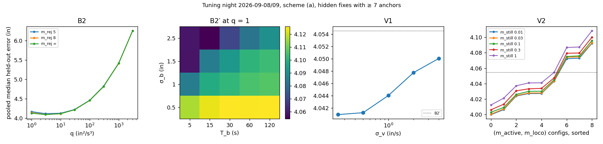
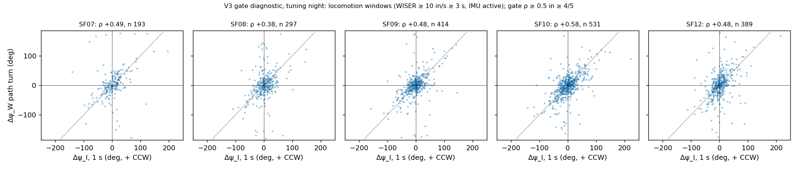
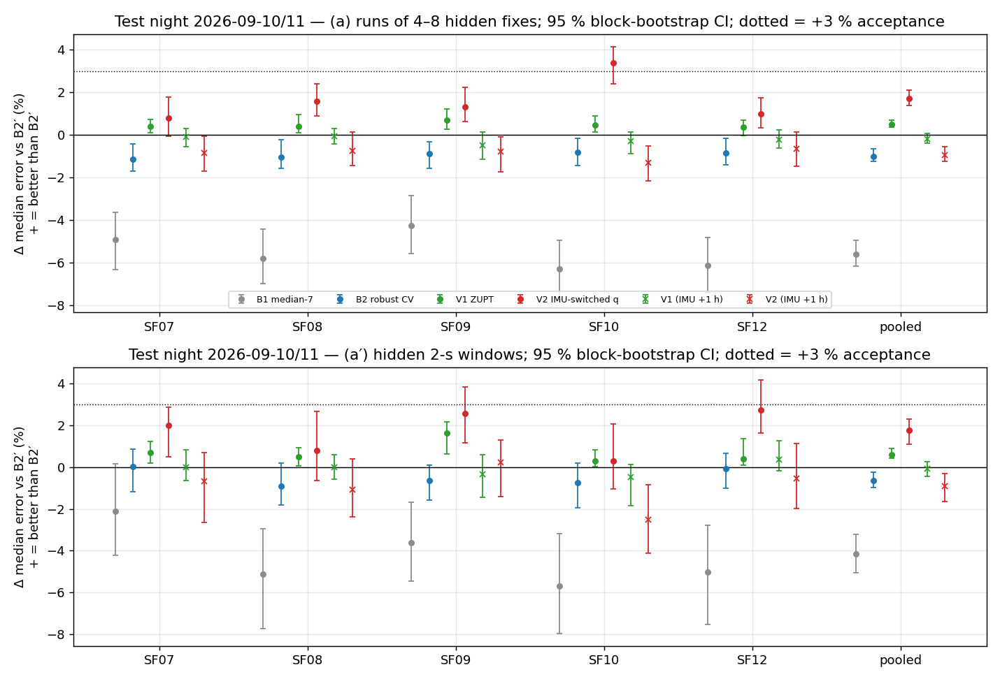
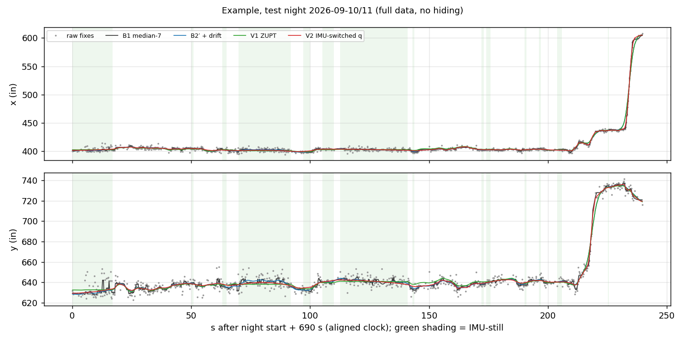

# WISER + head-IMU smoothing pilot — `wiser_baseline` (2026c)

- **What this is:** a *measurement* report. Question: can the head IMU (same rigid headstage as the WISER tag; user, 2026-09-29) improve WISER UWB position estimates **beyond a good position-only smoother**? Scored by predicting held-out WISER fixes. **No behavioural claim.**
- **Nights:** tuning 2026-09-08 21:00:00 → 2026-09-09 04:20:00 (every hyperparameter, noise model, threshold fitted here only); test 2026-09-10 21:00:00 → 2026-09-11 04:20:00 (named in the plan before any result). Field-PC local time (EDT).
- **Animals and tags (shortid):** SF07 = 12409, SF08 = 12386, SF09 = 12407, SF10 = 12395, SF12 = 12377.
- **Frame status:** WISER native inches, unverified offset origin; nothing here places a position in the paddock.
- **Plan:** [`implementation_plan/2026-09-29-wiser-imu-smoothing-pilot.md`](../../../../implementation_plan/2026-09-29-wiser-imu-smoothing-pilot.md) (approved by the user 2026-09-29, "开始"). Design, grids, acceptance and deviations were fixed there before coding.
- **Run:** `python wiser/scripts/analyze_wiser_imu_smoothing.py --cohort 2026c`; bulk `D:\Field2026_analysis_out\2026c\wiser_imu_smoothing_pilot_20260929_2119` (per-fix errors, bootstrap tables, tuning grids, V3 pairs, calibration deviations, `summary.json`, `input_provenance.json`, `log.txt`); pointer `run_manifest_imu_smoothing_pilot_2026c.json`. Git `a6e5d28+dirty`; runtime 8.6 min; numba True.

## 0. Verdicts

| IMU variant | (a) animals with Δ ≥ 3 % & CI > 0 | (a) control no-gain | (a) pooled moving Δ | (a′) animals | (a′) control no-gain | (a′) pooled moving Δ | **Verdict** |
|---|---|---|---|---|---|---|---|
| V1 ZUPT | 0/5 | 5/5 | +0.1 % | 0/5 | 5/5 | +0.1 % | **FAIL** |
| V2 IMU-switched q | 1/5 | 5/5 | +1.8 % | 0/5 | 5/5 | +1.0 % | **FAIL** |
| V3 heading-aided | gate: ρ ≥ 0.5 in 1/5 animals | | | | | | **SKIPPED — head turn does not constrain the path** |

Pooled test-night held-out error (in), hidden fixes with ≥ 7 anchors, and Δ vs B2′ (95 % block-bootstrap CI):

| Method | (a) median | (a) RMSE | (a) Δ median vs B2′ | (a′) median | (a′) RMSE | (a′) Δ median vs B2′ |
|---|---|---|---|---|---|---|
| B1 median-7 | 4.15 | 7.65 | -5.6 % [-6.2 %, -5.0 %] | 4.37 | 9.29 | -4.1 % [-5.0 %, -3.2 %] |
| B2 robust CV | 3.97 | 6.51 | -1.0 % [-1.2 %, -0.7 %] | 4.22 | 7.31 | -0.6 % [-1.0 %, -0.3 %] |
| B2′ + drift | 3.93 | 6.46 | (reference) | 4.19 | 7.26 | (reference) |
| V1 ZUPT | 3.91 | 6.44 | +0.5 % [+0.4 %, +0.7 %] | 4.17 | 7.25 | +0.6 % [+0.4 %, +0.9 %] |
| V2 IMU-switched q | 3.86 | 6.23 | +1.7 % [+1.4 %, +2.1 %] | 4.12 | 6.99 | +1.8 % [+1.1 %, +2.3 %] |
| V1 (IMU +1 h) | 3.94 | 6.62 | -0.2 % [-0.4 %, +0.1 %] | 4.20 | 7.42 | -0.1 % [-0.4 %, +0.3 %] |
| V2 (IMU +1 h) | 3.97 | 6.61 | -0.9 % [-1.2 %, -0.6 %] | 4.23 | 7.48 | -0.9 % [-1.6 %, -0.3 %] |
| B2′ (p only) | 3.95 | 6.62 | -0.6 % [-1.0 %, -0.2 %] | 4.15 | 7.37 | +1.1 % [+0.7 %, +1.6 %] |

Position-only smoothers vs the library B1 (pooled, test night): B2 robust CV (a) +4.4 % [+3.8 %, +4.9 %], (a′) +3.4 % [+2.5 %, +4.3 %]; B2′ + drift (a) +5.3 % [+4.7 %, +5.8 %], (a′) +4.0 % [+3.1 %, +4.9 %].

Classification (regime-aware-wiser-tracking): every result here is a **measurement** result. The held-out target is a WISER fix (head position + WISER's own slow drift + white noise), so a gain means better prediction of WISER, which is necessary but not sufficient for better head position; §6 (static references) is the check on position itself.

**Reading.**

1. **The gain is in position-only smoothing.** On the test night B2′ predicts held-out fixes better than the library median by +5.3 % (a) and +4.0 % (a′) in median error, and much more in RMSE (-18.5 % for B1 vs B2′ on (a): the median-7 has heavy tails). The difference is largest on IMU-locomoting fixes (B1 vs B2′ -13.0 %). The drift term adds little over B2 (-1.0 % for B2 vs B2′).
2. **The head IMU adds 0.5–1.8 % beyond B2′ (pooled), below the pre-registered 3 %.** V1 +0.5 % / +0.6 % and V2 +1.7 % / +1.8 % ((a) / (a′), pooled; CIs above 0). The gain sits where the IMU is informative: on IMU-still fixes (only 13 % of scored fixes) V1 gains +3.4 % (a) and +4.8 % (a′), V2 +3.2 % / +4.6 %; V2 also gains on locomoting fixes on (a) (+2.7 %). The +1 h controls show no gain (V1 -0.2 %, V2 -0.9 % on (a)), so the small gain is specific to the aligned IMU. Animals passing the per-animal bar: V2 (a): SF10.
3. **Head turn does not pass the gate for heading aid**: ρ = 0.49, 0.38, 0.48, 0.58, 0.48 (1-s turns while running); the association is moderate but below the pre-registered ρ ≥ 0.5 in 4 of 5 animals, so V3 was not built.
4. **Static references agree with (1):** on the six cohort-1 fixed tags the median RMSE about the true (median) position falls from 7.03 in (raw) to 4.56 (B1), 3.91 (B2) and 3.80 in (B2′ position output); the dropped implant shows the same order in its first quiet window and little difference between the smoothers in the second (§6).
5. **Smoothing changes derived kinematics a lot:** median path length 18,210 in/h (raw) → 10,283 (B1) → 5,715 (B2′); share of fixes > 15 in beyond the wall ridge 0.52 % → 0.085 % → 0.026 %. Distances from any of these tracks are smoothing-scale dependent (§7).

## 1. Data, masks and what they removed

- **WISER:** `D:/Field2026_analysis_out/2026c/wiser_working/3rdcohort_Spike_2026_3_4.sqlite` (table `reports`), opened `mode=ro` + `query_only`; sha256 prefix checked (`82ccadfde589`). Duplicate rule applied (Definitions): tuning night 150 (tag, timestamp) groups → 150 rows dropped of 521,433 (0 identical xy); test night 88 groups → 88 of 525,572.
- **IMU:** make_imu 50-Hz npz (regenerated with frozen/invalid flags, commit `6451d6c`). Still thresholds θ_a (`IMU_STILL_THR`, m/s²): SF07 0.387, SF08 0.307, SF09 0.325, SF10 0.325, SF12 0.365; |ω| < 10 °/s.
- **τ\* (s, tuning night, previous pilot M1):** SF07 +0.20, SF08 +0.15, SF09 +0.10, SF10 +0.20, SF12 +0.15 — applied unchanged on the test night.

**Tuning night** (seconds of the 21:00–04:20 window removed per reason; reasons overlap):

| Animal | session | pc_time verdict | fixes | ≥ 7 anchors | seconds | nodata | saturated | frozen flag | frozen rule | unreliable | handling | silence | ADC lane | QC-ok | IMU-still | shifted-IMU ok |
|---|---|---|---|---|---|---|---|---|---|---|---|---|---|---|---|---|
| SF07 | `8_20260908_193733.435` | OK-native | 103,339 | 97.8 % | 26400 | 0 | 121 | 0 | 0 | 569 | 0 | 0 | 0 | 25766 | 3940 | 25957 |
| SF08 | `8_20260908_193958.035` | OK-native | 103,350 | 97.0 % | 26400 | 0 | 194 | 0 | 0 | 482 | 0 | 0 | 0 | 25804 | 2062 | 25846 |
| SF09 | `9_20260908_194312.545` | OK-native | 103,612 | 97.5 % | 26400 | 0 | 228 | 0 | 0 | 593 | 0 | 0 | 0 | 25679 | 4377 | 25755 |
| SF10 | `12_20260908_194550.363` | OK-native | 103,864 | 96.6 % | 26400 | 0 | 237 | 0 | 0 | 620 | 0 | 0 | 0 | 25658 | 3563 | 25760 |
| SF12 | `8_20260908_194824.915` | OK-native | 104,813 | 95.6 % | 26400 | 0 | 75 | 0 | 0 | 280 | 0 | 0 | 0 | 26077 | 3211 | 26103 |

**Test night** (seconds of the 21:00–04:20 window removed per reason; reasons overlap):

| Animal | session | pc_time verdict | fixes | ≥ 7 anchors | seconds | nodata | saturated | frozen flag | frozen rule | unreliable | handling | silence | ADC lane | QC-ok | IMU-still | shifted-IMU ok |
|---|---|---|---|---|---|---|---|---|---|---|---|---|---|---|---|---|
| SF07 | `12_20260910_204411.854` | OK-native (accepted: RTC Resync 20:42:04 | 104,163 | 97.4 % | 26400 | 0 | 115 | 0 | 0 | 439 | 0 | 0 | 0 | 25893 | 3544 | 25998 |
| SF08 | `2_20260910_210245.604` | OK-native | 103,959 | 97.0 % | 26400 | 167 | 203 | 0 | 0 | 457 | 0 | 0 | 157 | 25666 | 2328 | 25798 |
| SF09 | `15_20260910_204912.017` | OK-native | 104,546 | 97.6 % | 26400 | 0 | 108 | 0 | 0 | 269 | 0 | 0 | 0 | 26072 | 5268 | 26057 |
| SF10 | `9_20260910_205611.775` | OK-native | 104,888 | 97.8 % | 26400 | 0 | 169 | 0 | 0 | 472 | 0 | 0 | 0 | 25843 | 3078 | 25820 |
| SF12 | `15_20260910_210518.445` | OK-native | 105,524 | 94.2 % | 26400 | 320 | 139 | 0 | 0 | 363 | 0 | 0 | 299 | 25630 | 3220 | 25750 |

No handling window or all-tag silence falls inside either night window. On the test night SF08 and SF12 start their lane-off sessions at 21:02:45 and 21:05:18 (after the ADC-lane night pieces, quarantined), so their first minutes have no IMU (`nodata`); SF07's session carries the chain verdict 'inconsistent' but is accepted on its native fit (39 anchors, 32 ms; `cohorts/2026c.yaml ephys.pc_time_accept`).

## Definitions

Units: WISER positions in **inches** in the WISER native frame (unverified offset origin; no georeference); IMU
acceleration m/s², angular rate °/s. Times are field-PC time (WISER `timestamp`, the IMU's `t_pc_ms`). Symbols:
$a$ = animal, $i$ = WISER fix, $k$ = filter step (one per fix), $s$ = field-PC second, $A_i$ = `anchors_used`,
$\mathbf z_i=(x_i,y_i)$ = the raw fix.

### Duplicate rule
Rows sharing (tag, `timestamp`) are collapsed to one: the row with the largest $A_i$; ties → the smallest `reportid`.
**Text:** one fix per timestamp; the higher-anchor solve is the more precise one (static SD table below).

### Aligned time
$t^{\mathrm{al}}_i=t_i-\tau^*_a$ with $\tau^*_a$ the tuning-night effective lag of the previous pilot (M1). **Text:**
puts WISER on the IMU clock; it does not change any position-only result (all times shift together).

### IMU per-second classes (IMU QC mask, still rule: previous pilot, reused unmodified)
$$ \mathrm{still}(s)=\mathrm{ok}(s)\wedge\mathrm{VeDBA}_{1s}(s)<\theta_a\wedge|\omega|_{1s}(s)<10^\circ/\mathrm s,\qquad
\mathrm{loco}(s)=\mathrm{ok}(s)\wedge\neg\mathrm{still}(s)\wedge \mathrm{VeDBA}_{1s}(s)\ge\theta_L\wedge \mathrm{SBF}(s)\ge\rho_L $$
$$ \mathrm{SBF}(s)=\frac{\sum_{4\le f\le7\,\mathrm{Hz}}|\hat a_\uparrow(f)|^2}{\sum_{1\le f\le20\,\mathrm{Hz}}|\hat a_\uparrow(f)|^2} $$
$\hat a_\uparrow$ = FFT of the Hann-windowed vertical earth-frame linear acceleration (`lin_acc_earth_ms2[:,2]`,
unaffected by yaw drift) over $[s-0.5,s+1.5)$ (100 samples); active = ok ∧ ¬still ∧ ¬loco; state 0 = not ok.
$\mathrm{ok}(s)$ = the previous pilot's mask (nodata, saturated, frozen flag and rule, invalid, NaN, unreliable,
handling, all-tag silence ± 2 min, tag validity) ∧ outside the cohort YAML's `ephys.adc_lane.on_windows`.
**Text:** still = the head does not move (thresholds fixed before this pilot); locomoting = strong head acceleration
with stride-band (4–7 Hz) power; $(\theta_L,\rho_L)$ maximise Youden's $J=\mathrm{TPR}-\mathrm{FPR}$ against WISER
1-s median speed ≥ 10 in/s (positives) vs < 3 in/s (negatives) over ok, non-still tuning-night seconds.

### Per-anchor measurement noise $\sigma_{\mathrm{ax}}(A)$
$$ d_{i,\mathrm{ax}}=\mathrm{ax}_i-\operatorname{median}_{j\in B}\mathrm{ax}_j,\qquad \sigma_{\mathrm{ax}}(A)=1.4826\cdot\operatorname{median}_{i:A_i=A}\big|d_{i,\mathrm{ax}}-\operatorname{median}(d_{\mathrm{ax}})\big| $$
$B$ = a tuning-night IMU-still bout (≥ 60 s, trimmed 1 s each end, ≥ 30 fixes), ax ∈ {x, y}, $A\le3$ pooled.
**Text:** robust per-axis SD (in) of a fix about the still head's position, by anchor count; the core of the error
distribution (outliers are left to the robust weights). $R_i=\mathrm{diag}(\sigma^2_x(A_i),\sigma^2_y(A_i))$.

### B1 — library median smoother
Full data: $\hat{\mathbf p}_i=\operatorname{median}_{j=i-3}^{i+3}\mathbf z_j$ (coordinate-wise, as `add_speed`).
Held-out: $\hat{\mathbf z}_h=\operatorname{median}\{\mathbf z_j: j\in\mathcal N_7(h)\}$, $\mathcal N_7(h)$ = the 7 visible
fixes with the smallest $|t_j-t_h|$. **Text:** the current library position, used as the reference baseline.

### B2 — robust constant-velocity Kalman/RTS smoother
Per axis, state $\mathbf x=(p,v)$; between steps $\Delta t=t_k-t_{k-1}$:
$$ \mathbf x_k=\begin{pmatrix}1&\Delta t\\0&1\end{pmatrix}\mathbf x_{k-1}+\boldsymbol\eta_k,\quad
\mathrm{Cov}(\boldsymbol\eta_k)=q\begin{pmatrix}\Delta t^3/3&\Delta t^2/2\\\Delta t^2/2&\Delta t\end{pmatrix},\qquad
z_k=p_k+\varepsilon_k,\ \varepsilon_k\sim\mathcal N(0,\sigma^2_{\mathrm{ax}}(A_k)/w_k) $$
Forward Kalman filter, then the Rauch–Tung–Striebel smoother (means). **Outliers:** pass 0 inflates $R_k$ by
$d_k^2/13.8$ when the 2-D innovation Mahalanobis distance $d_k^2=\sum_{\mathrm{ax}}\nu^2_{k,\mathrm{ax}}/S_{k,\mathrm{ax}}>\chi^2_{2,0.999}=13.8$;
passes 1–2 are IRLS: $m_k^2=\sum_{\mathrm{ax}}(z_{k,\mathrm{ax}}-\hat z_{k,\mathrm{ax}})^2/\sigma^2_{\mathrm{ax}}(A_k)$ from
the previous smoothed track, $w_k=1$ ($m_k\le2.5$), $2.5/m_k$ ($2.5<m_k\le m_{\mathrm{rej}}$), 0 (rejected, $m_k>m_{\mathrm{rej}}$).
Hidden fixes enter as steps without an update; $\hat{\mathbf z}_h=\hat{\mathbf p}(t_h)$. **Text:** a continuous-time
correlated-random-walk smoother (Johnson et al. 2008) with per-fix error from `anchors_used` and robust outlier
weights; $q$ (in²/s³) sets how fast velocity may change; $m_{\mathrm{rej}}$ and $q$ tuned.

### B2′ — B2 with slow measurement drift
State $(p,v,b)$ per axis, $b_k=\phi_k b_{k-1}+\xi_k$, $\phi_k=e^{-\Delta t/T_b}$, $\mathrm{Var}(\xi_k)=\sigma_b^2(1-\phi_k^2)$,
$z_k=p_k+b_k+\varepsilon_k$ with white variance $\sigma^2_w(A)=\max(\sigma^2_{\mathrm{ax}}(A)-\sigma_b^2,\ \sigma^2_{\mathrm{ax}}(A)/4)$.
Held-out prediction $\hat{\mathbf z}_h=\hat{\mathbf p}(t_h)+\hat{\mathbf b}(t_h)$ (the expected measurement); position
output $\hat{\mathbf p}$. **Text:** WISER's slow correlated wander (seconds to minutes) is modelled as part of the
measurement, not of the head; $T_b$ (s) and $\sigma_b$ (in) tuned.

### V1 — zero-velocity pseudo-measurement (ZUPT)
At every step $k$ (visible or hidden) whose aligned second is IMU-still, per axis an extra update $0=v_k+\epsilon$,
$\epsilon\sim\mathcal N(0,\sigma_v^2)$. **Text:** the IMU says the head (and the tag on it) does not move; $\sigma_v$
(in/s) sets how hard that is enforced; tuned.

### V2 — IMU-switched process noise
$q_k=m_{c(k)}\,q_{B2'}$ with $c(k)$ the IMU class of the second containing the interval midpoint
$(t_{k-1}+t_k)/2$: $m_0=1$ (IMU unusable), $m_s$ (still), $m_a$ (active), $m_l$ (locomoting). **Text:** a
state-switching movement model driven by the IMU (Michelot & Blackwell 2019); tuned multipliers.

### +1 h-shifted IMU control
V1 and V2 rerun with every IMU-derived input (classes, ZUPT, QC) taken from $s+3600$ instead of $s$. **Text:** keeps
the IMU's statistics but breaks its link to the WISER track; a real IMU gain must vanish.

### Held-out schemes and error
(a): per tag, hide runs of $L\sim\mathcal U\{4..8\}$ consecutive fixes separated by $G\sim\mathcal U\{1..47\}$ visible fixes
($E[\text{hidden}]=6/30=20\,\%$), fixed seed. (a′): hide every fix in a random 10 % of the night's 2-s windows.
$$ e_h=\lVert\mathbf z_h-\hat{\mathbf z}_h\rVert_2 $$
over the **scored set**: hidden fixes with $A_h\ge7$ whose aligned second is ok for both the IMU and the shifted IMU.
Subsets: still = IMU-still second; moving = ok ∧ ¬still; loco = IMU locomoting. **Text:** how well each method predicts a
fix it has not seen (in). Why smoothing cannot game it: the hidden fix is $\mathbf z_h=\mathbf p_h+\mathbf b_h+\boldsymbol\varepsilon_h$
with $\boldsymbol\varepsilon_h$ independent of every visible fix, so
$$ E[e_h^2]=E\lVert\mathbf p_h+\mathbf b_h-\hat{\mathbf z}_h\rVert^2+E\lVert\boldsymbol\varepsilon_h\rVert^2 ,$$
the second term is the same for every method; a method lowers $e$ only by predicting the predictable part better, and
over- and under-smoothing are both penalised. The target includes WISER's drift $\mathbf b_h$, so (a) rewards
predicting the drift too; the static references test the head position itself.

### Relative median improvement and its CI
$$ \Delta_M=1-\frac{\operatorname{median}(e_M)}{\operatorname{median}(e_{\mathrm{ref}})},\qquad
\Delta^{\mathrm{RMSE}}_M=1-\frac{\mathrm{RMSE}(e_M)}{\mathrm{RMSE}(e_{\mathrm{ref}})} $$
over the same fixes (ref = B2′ unless stated). 95 % CI: 1000 paired block-bootstrap replicates — the 5-min blocks
of the night are drawn with replacement (within each animal for the pooled value), both methods get the same draw,
$\Delta$ is recomputed (weighted median), CI = 2.5–97.5 % quantiles. **Text:** + = the method's typical error is that
fraction smaller than B2′'s; blocks of 5 min keep the within-block autocorrelation.

### Acceptance (pre-registered)
Per IMU variant on the test night, on (a) or (a′): (i) $\Delta\ge3\,\%$ with CI lower bound > 0 in ≥ 4 of 5 animals;
(ii) the +1 h control's CI lower bound ≤ 0 (no significant gain) in ≥ 4 of 5 animals; (iii) pooled $\Delta$ on moving
fixes ≥ −2 %. ACCEPTED = (i) ∧ (ii) ∧ (iii); INCONCLUSIVE = (i) in exactly 3 animals, or (i) ∧ ¬(ii); else FAIL.

### V3 gate diagnostic
$$ \mathbf d_s=\tilde{\mathbf p}_s-\tilde{\mathbf p}_{s-1},\qquad \Delta\psi_W(s)=\operatorname{atan2}(d_{s,x}d_{s+1,y}-d_{s,y}d_{s+1,x},\ \mathbf d_s\!\cdot\!\mathbf d_{s+1}),\qquad \Delta\psi_I(s)=\int_s^{s+1}\omega_{\mathrm{turn}}\,dt $$
$\tilde{\mathbf p}_s$ = aligned 1-s median of ≥ 2 valid fixes; pairs inside locomotion windows = runs of ≥ 3 s with
WISER 1-s median speed ≥ 10 in/s and IMU ok ∧ ¬still. Spearman $\rho(\Delta\psi_I,\Delta\psi_W)$ and Theil–Sen slopes per
animal. **Gate:** V3 only if $\rho\ge0.5$ in ≥ 4 of 5 animals. **Text:** does the head's turn predict the path's turn
over one second while the animal runs? (Head yaw ≠ travel direction: Hou et al. 2020.)

### Static-reference error (b)
$$ \mathbf p^*=\operatorname{median}_{i\in W}\mathbf z_i,\quad \mathrm{bias}=\big\lVert\overline{\hat{\mathbf p}}_W-\mathbf p^*\big\rVert,\quad
\mathrm{RMSE}=\sqrt{\tfrac1{|W|}\textstyle\sum_{i\in W}\lVert\hat{\mathbf p}_i-\mathbf p^*\rVert^2} $$
$W$ = the fixes of a static window, $\hat{\mathbf p}_i$ = the method's full-data position at fix $i$. **Text:** how far a
method's track of a tag that did not move stays from its (constant) median position, in inches.

### Track plausibility (c)
On a 0.25-s grid (linear interpolation only inside inter-fix gaps ≤ 1 s): $v(t)=\lVert\hat{\mathbf p}(t+0.5)-\hat{\mathbf p}(t-0.5)\rVert/1\,\mathrm s$,
$a(t)=\lVert\hat{\mathbf p}(t+0.5)-2\hat{\mathbf p}(t)+\hat{\mathbf p}(t-0.5)\rVert/0.25\,\mathrm s^2$; path length
$=\sum\lVert\hat{\mathbf p}(s+1)-\hat{\mathbf p}(s)\rVert$ on the 1-s grid, per hour; wall excursion = share of fixes with
signed distance to the regime-B wall-ridge rectangle $d<-15$ in (accuracy report). **Text:** method-agnostic speed
(in/s), acceleration (in/s²), distance (in/h) and out-of-paddock share; speed during IMU-still seconds is circular for
the IMU variants (reported only). Smoothing scale changes speed and distance (Noonan et al. 2019; Gupte et al. 2022).

## 2. Prior work (web audit, 2026-09-29)

- UWB+IMU fusion gains of 27–53 % are reported against **raw** UWB, never against a tuned position-only smoother; this pilot's reference is B2′, not raw.
- Robust smoothing with a per-fix error model and outlier handling is expected to give most of the gain: Johnson et al. 2008, continuous-time correlated random walk ([ESA](https://esajournals.onlinelibrary.wiley.com/doi/10.1890/07-1032.1)); Wen et al. 2021 ([NAVIGATION](https://navi.ion.org/content/68/2/315)); Fleming et al. — DOP-type quality numbers can mislead ([bioRxiv](https://www.biorxiv.org/content/10.1101/2020.06.12.130195v2)); here `calculation_error` is useless and `anchors_used` is the error proxy.
- IMU-driven state switching: Michelot & Blackwell 2019 ([MEE](https://besjournals.onlinelibrary.wiley.com/doi/10.1111/2041-210X.13154)) → V2.
- Smoothing scale changes speed and distance: Noonan et al. 2019 ([Mov. Ecol.](https://movementecologyjournal.biomedcentral.com/articles/10.1186/s40462-019-0177-1)); Gupte et al. 2022 ([J. Anim. Ecol.](https://besjournals.onlinelibrary.wiley.com/doi/10.1111/1365-2656.13610)) → §7.
- Held-out validation of state-space predictions: Jonsen et al. 2020 ([arXiv](https://arxiv.org/abs/2005.00401)) → schemes (a)/(a′).
- Head yaw ≠ travel direction: Hou et al. 2020 ([PMC](https://pmc.ncbi.nlm.nih.gov/articles/PMC7664376/)) → the V3 gate. Rat head-acceleration gait bands: Alves et al. 2016 ([PMC](https://pmc.ncbi.nlm.nih.gov/articles/PMC4976156/)) → the 4–7 Hz stride band.
- No study of head-IMU + UWB on rodents was found.

## 3. Tuning (night 2026-09-08/09 only)

**Per-anchor noise** (robust SD, in, per axis; plain SD in brackets; IMU-still bouts of the tuning night, 89 bouts, 48,797 fixes):

| anchors | fixes | σ_x robust (SD) | σ_y robust (SD) |
|---|---|---|---|
| ≤ 3 | 56 | 6.48 (46.22) | 8.56 (25.43) |
| 4 | 128 | 4.20 (16.53) | 7.23 (12.02) |
| 5 | 344 | 5.03 (14.59) | 7.59 (9.30) |
| 6 | 1,002 | 3.55 (10.59) | 5.64 (7.92) |
| 7 | 2,769 | 2.32 (2.94) | 3.23 (4.67) |
| 8 | 9,944 | 1.73 (2.08) | 3.01 (3.75) |
| 9 | 34,554 | 1.39 (1.62) | 2.47 (2.88) |

Autocorrelation of 9-anchor deviations inside IMU-still bouts (bout-mean removed; lag ± 15 %): 0.25 s x 0.23 / y 0.13; 0.5 s x 0.16 / y 0.08; 1 s x 0.16 / y 0.08; 2 s x 0.15 / y 0.07; 5 s x 0.12 / y 0.06; 10 s x 0.10 / y 0.05; 20 s x 0.05 / y 0.03; 30 s x 0.01 / y 0.01; 60 s x -0.04 / y -0.02. Bout-centring biases long-lag values low.

**IMU locomotion class:** VeDBA_1s ≥ **3.929 m/s²** and SBF ≥ **0.10**; Youden J 0.602 (TPR 0.751, FPR 0.150; 9,284 WISER-locomoting vs 39,729 WISER-slow seconds).

| Method | tuned values | pooled median held-out error (a), tuning night (in) |
|---|---|---|
| B2 | q = 3 in²/s³, m_rej = ∞ (k = 2.5, gate χ² = 13.8, 2 IRLS passes) | 4.091 |
| B2′ | q = 1 in²/s³, T_b = 15 s, σ_b = 2.5 in | 4.055 |
| V1 | σ_v = 0.25 in/s | 4.041 |
| V2 | m_still / m_active / m_loco = 0.01 / 0.3 / 10 | 4.000 |

Tuning-night Δ vs B2′ (pooled, same statistics as the test): B1 median-7 (a) -5.2 % [-5.8 %, -4.5 %]; B2 robust CV (a) -0.9 % [-1.2 %, -0.5 %]; V1 ZUPT (a) +0.3 % [+0.3 %, +0.5 %]; V2 IMU-switched q (a) +1.3 % [+1.1 %, +1.8 %]; V1 (IMU +1 h) (a) -0.6 % [-0.8 %, -0.3 %]; V2 (IMU +1 h) (a) -1.4 % [-1.8 %, -1.0 %].

All tuned values are written to `wiser/configs/wiser_imu_smoothing_2026c.json` → `tuned` (marked as fitted on 2026-09-08/09); full grids in the bulk `csv/tuning_grid_*.csv`.

**Grid edges:** B2′ q = 1, σ_b = 2.5 in, σ_v = 0.25 in/s, m_still = 0.01, m_active = 0.3, m_loco = 10 sit on the edge of their pre-registered grid, so the optimum may lie outside it.

**Post hoc, tuning night only** (added after the first run because of the edge hits; no verdict uses it; nothing of it was evaluated on the test night): a wider grid (B2 q ∈ {0.1, 0.3, 1, 3}; B2′ q ∈ {0.1, 0.3, 1} × T_b ∈ {15, 30, 60} × σ_b ∈ {2.5, 4, 6}; V1 σ_v ∈ {0.03, 0.1, 0.25}; V2 m_still ∈ {0.001, 0.003, 0.01} × m_active ∈ {0.1, 0.3, 1} × m_loco ∈ {10, 30, 100}) gives B2 q = 3 (4.091 in), B2′ q = 0.1, T_b = 15 s, σ_b = 4 in (4.024 in), V1 σ_v = 0.03 (gain vs that B2′ +0.05 %), V2 multipliers 0.01/0.1/30 (gain +0.71 %). Pre-registered grid, for comparison: V1 +0.34 %, V2 +1.35 % on the tuning night.

## 4. V3 gate diagnostic (tuning night)

| Animal | turn pairs | Spearman ρ | p | Theil–Sen Δψ_W on Δψ_I | Theil–Sen Δψ_I on Δψ_W |
|---|---|---|---|---|---|
| SF07 | 193 | 0.492 | 3.5e-13 | 0.658 | 0.520 |
| SF08 | 297 | 0.380 | 1.3e-11 | 0.540 | 0.300 |
| SF09 | 414 | 0.476 | 8.7e-25 | 0.563 | 0.525 |
| SF10 | 531 | 0.580 | 4.2e-49 | 0.680 | 0.598 |
| SF12 | 389 | 0.479 | 1.1e-23 | 0.770 | 0.354 |

Gate: ρ ≥ 0.5 in 1 of 5 animals → **V3 skipped: over one second of running, the head turn does not constrain the path turn well enough to aid the smoother**.

## 5. Test night 2026-09-10/11 — held-out results

**(a) runs of 4–8 hidden fixes** — median error (in) per animal and Δ vs B2′ [95 % CI]:

| Animal | scored | B1 | B2 | B2′ | V1 | V2 | Δ B1 | Δ B2 | Δ V1 | Δ V2 | Δ V1 +1 h | Δ V2 +1 h |
|---|---|---|---|---|---|---|---|---|---|---|---|---|
| SF07 | 19,428 | 3.94 | 3.80 | 3.76 | 3.74 | 3.73 | -4.9 % [-6.3 %, -3.6 %] | -1.1 % [-1.7 %, -0.4 %] | +0.4 % [+0.1 %, +0.7 %] | +0.8 % [-0.1 %, +1.8 %] | -0.1 % [-0.6 %, +0.3 %] | -0.9 % [-1.7 %, -0.1 %] |
| SF08 | 19,532 | 4.15 | 3.97 | 3.92 | 3.91 | 3.86 | -5.8 % [-7.0 %, -4.4 %] | -1.0 % [-1.6 %, -0.2 %] | +0.4 % [+0.1 %, +0.9 %] | +1.6 % [+0.9 %, +2.4 %] | -0.1 % [-0.4 %, +0.3 %] | -0.8 % [-1.4 %, +0.1 %] |
| SF09 | 19,617 | 3.93 | 3.80 | 3.77 | 3.74 | 3.72 | -4.3 % [-5.6 %, -2.9 %] | -0.9 % [-1.6 %, -0.3 %] | +0.7 % [+0.3 %, +1.2 %] | +1.3 % [+0.6 %, +2.2 %] | -0.5 % [-1.1 %, +0.1 %] | -0.8 % [-1.7 %, -0.1 %] |
| SF10 | 19,542 | 4.33 | 4.10 | 4.07 | 4.05 | 3.93 | -6.3 % [-7.7 %, -4.9 %] | -0.8 % [-1.4 %, -0.2 %] | +0.5 % [+0.1 %, +0.9 %] | +3.4 % [+2.4 %, +4.1 %] | -0.3 % [-0.9 %, +0.1 %] | -1.3 % [-2.1 %, -0.5 %] |
| SF12 | 18,818 | 4.42 | 4.20 | 4.17 | 4.16 | 4.13 | -6.1 % [-7.4 %, -4.8 %] | -0.8 % [-1.4 %, -0.2 %] | +0.4 % [-0.0 %, +0.7 %] | +1.0 % [+0.3 %, +1.7 %] | -0.2 % [-0.6 %, +0.2 %] | -0.7 % [-1.5 %, +0.1 %] |
| pooled | 96,937 | 4.15 | 3.97 | 3.93 | 3.91 | 3.86 | -5.6 % [-6.2 %, -5.0 %] | -1.0 % [-1.2 %, -0.7 %] | +0.5 % [+0.4 %, +0.7 %] | +1.7 % [+1.4 %, +2.1 %] | -0.2 % [-0.4 %, +0.1 %] | -0.9 % [-1.2 %, -0.6 %] |

By IMU state (pooled; Δ vs B2′ [CI]; n = scored fixes):

| Subset | n | B2′ median (in) | Δ B1 | Δ B2 | Δ V1 | Δ V2 | Δ V1 +1 h | Δ V2 +1 h |
|---|---|---|---|---|---|---|---|---|
| still | 12,636 | 2.79 | -2.1 % [-3.5 %, -1.0 %] | +0.8 % [+0.0 %, +1.5 %] | +3.4 % [+2.5 %, +4.2 %] | +3.2 % [+2.4 %, +4.1 %] | +0.2 % [+0.0 %, +0.4 %] | -0.8 % [-1.9 %, +0.1 %] |
| moving | 84,301 | 4.14 | -6.1 % [-6.8 %, -5.6 %] | -0.9 % [-1.2 %, -0.6 %] | +0.1 % [+0.0 %, +0.1 %] | +1.8 % [+1.4 %, +2.2 %] | -0.3 % [-0.5 %, -0.0 %] | -0.8 % [-1.2 %, -0.5 %] |
| loco | 21,978 | 5.47 | -13.0 % [-14.7 %, -11.2 %] | -1.8 % [-2.4 %, -1.4 %] | -0.0 % [-0.1 %, +0.0 %] | +2.7 % [+1.7 %, +3.5 %] | -1.2 % [-1.8 %, -0.4 %] | -1.3 % [-2.3 %, -0.6 %] |

RMSE-based Δ vs B2′ (pooled, all scored fixes): B1 median-7 -18.5 % [-20.4 %, -16.5 %]; B2 robust CV -0.9 % [-1.0 %, -0.7 %]; V1 ZUPT +0.2 % [+0.1 %, +0.3 %]; V2 IMU-switched q +3.5 % [+3.0 %, +4.0 %].

**(a′) hidden 2-s windows** — median error (in) per animal and Δ vs B2′ [95 % CI]:

| Animal | scored | B1 | B2 | B2′ | V1 | V2 | Δ B1 | Δ B2 | Δ V1 | Δ V2 | Δ V1 +1 h | Δ V2 +1 h |
|---|---|---|---|---|---|---|---|---|---|---|---|---|
| SF07 | 9,475 | 4.17 | 4.08 | 4.09 | 4.06 | 4.00 | -2.1 % [-4.2 %, +0.1 %] | +0.0 % [-1.2 %, +0.9 %] | +0.7 % [+0.2 %, +1.2 %] | +2.0 % [+0.5 %, +2.9 %] | +0.0 % [-0.6 %, +0.8 %] | -0.7 % [-2.6 %, +0.7 %] |
| SF08 | 9,763 | 4.42 | 4.24 | 4.20 | 4.18 | 4.17 | -5.1 % [-7.7 %, -3.0 %] | -0.9 % [-1.8 %, +0.2 %] | +0.5 % [+0.1 %, +0.9 %] | +0.8 % [-0.6 %, +2.7 %] | -0.0 % [-0.6 %, +0.6 %] | -1.1 % [-2.4 %, +0.4 %] |
| SF09 | 9,765 | 4.08 | 3.96 | 3.93 | 3.87 | 3.83 | -3.6 % [-5.5 %, -1.7 %] | -0.6 % [-1.6 %, +0.1 %] | +1.6 % [+0.6 %, +2.2 %] | +2.6 % [+1.2 %, +3.8 %] | -0.3 % [-1.4 %, +0.6 %] | +0.2 % [-1.4 %, +1.3 %] |
| SF10 | 9,848 | 4.62 | 4.40 | 4.37 | 4.36 | 4.36 | -5.7 % [-7.9 %, -3.2 %] | -0.8 % [-1.9 %, +0.2 %] | +0.3 % [+0.0 %, +0.8 %] | +0.3 % [-1.0 %, +2.1 %] | -0.5 % [-1.9 %, +0.1 %] | -2.5 % [-4.1 %, -0.9 %] |
| SF12 | 9,418 | 4.65 | 4.43 | 4.43 | 4.41 | 4.31 | -5.0 % [-7.5 %, -2.8 %] | -0.1 % [-1.0 %, +0.7 %] | +0.4 % [+0.1 %, +1.4 %] | +2.7 % [+1.6 %, +4.2 %] | +0.4 % [-0.2 %, +1.3 %] | -0.5 % [-2.0 %, +1.1 %] |
| pooled | 48,269 | 4.37 | 4.22 | 4.19 | 4.17 | 4.12 | -4.1 % [-5.0 %, -3.2 %] | -0.6 % [-1.0 %, -0.3 %] | +0.6 % [+0.4 %, +0.9 %] | +1.8 % [+1.1 %, +2.3 %] | -0.1 % [-0.4 %, +0.3 %] | -0.9 % [-1.6 %, -0.3 %] |

By IMU state (pooled; Δ vs B2′ [CI]; n = scored fixes):

| Subset | n | B2′ median (in) | Δ B1 | Δ B2 | Δ V1 | Δ V2 | Δ V1 +1 h | Δ V2 +1 h |
|---|---|---|---|---|---|---|---|---|
| still | 6,149 | 2.79 | -0.0 % [-1.5 %, +2.0 %] | +0.7 % [-0.5 %, +1.6 %] | +4.8 % [+3.6 %, +5.9 %] | +4.6 % [+3.3 %, +5.8 %] | +0.2 % [-0.1 %, +0.5 %] | -1.3 % [-2.5 %, +0.3 %] |
| moving | 42,120 | 4.43 | -5.4 % [-6.5 %, -4.4 %] | -0.9 % [-1.1 %, -0.4 %] | +0.1 % [+0.0 %, +0.2 %] | +1.0 % [+0.4 %, +1.7 %] | -0.2 % [-0.6 %, +0.1 %] | -1.3 % [-1.8 %, -0.5 %] |
| loco | 11,213 | 6.15 | -14.9 % [-17.5 %, -12.1 %] | -1.0 % [-1.8 %, -0.3 %] | -0.0 % [-0.1 %, +0.1 %] | +0.2 % [-1.6 %, +2.0 %] | -1.6 % [-2.8 %, -0.7 %] | -1.5 % [-3.2 %, -0.3 %] |

RMSE-based Δ vs B2′ (pooled, all scored fixes): B1 median-7 -27.9 % [-31.9 %, -23.7 %]; B2 robust CV -0.7 % [-0.9 %, -0.4 %]; V1 ZUPT +0.2 % [+0.2 %, +0.3 %]; V2 IMU-switched q +3.8 % [+2.7 %, +5.0 %].

The example (x and y against time, full data, one animal of the test night; green = IMU-still) is chosen by a fixed rule: the first 4-min stretch with ≥ 60 s IMU-still and ≥ 20 s IMU-locomoting.

## 6. Static references (position-only methods, full data)

| Reference | tag | window | fixes | method | bias (in) | RMSE (in) | p50 (in) | p90 (in) |
|---|---|---|---|---|---|---|---|---|
| implant 12376 (2026-09-07) | 12376 | quiet 06:23-06:44 | 4,899 | raw fixes | 0.80 | 8.36 | 5.59 | 12.50 |
| implant 12376 (2026-09-07) | 12376 | quiet 06:23-06:44 | 4,899 | B1 median-7 | 0.61 | 5.40 | 3.79 | 8.62 |
| implant 12376 (2026-09-07) | 12376 | quiet 06:23-06:44 | 4,899 | B2 robust CV | 0.87 | 4.55 | 3.22 | 7.31 |
| implant 12376 (2026-09-07) | 12376 | quiet 06:23-06:44 | 4,899 | B2′ (p only) | 0.88 | 4.40 | 3.08 | 7.00 |
| implant 12376 (2026-09-07) | 12376 | quiet 06:23-06:44 | 4,899 | B2′ + drift | 0.88 | 4.55 | 3.18 | 7.27 |
| implant 12376 (2026-09-07) | 12376 | quiet 06:55-07:24 | 6,885 | raw fixes | 1.47 | 7.91 | 4.71 | 12.99 |
| implant 12376 (2026-09-07) | 12376 | quiet 06:55-07:24 | 6,885 | B1 median-7 | 1.43 | 6.31 | 3.41 | 12.30 |
| implant 12376 (2026-09-07) | 12376 | quiet 06:55-07:24 | 6,885 | B2 robust CV | 1.47 | 6.19 | 3.17 | 12.90 |
| implant 12376 (2026-09-07) | 12376 | quiet 06:55-07:24 | 6,885 | B2′ (p only) | 1.47 | 6.15 | 3.10 | 12.87 |
| implant 12376 (2026-09-07) | 12376 | quiet 06:55-07:24 | 6,885 | B2′ + drift | 1.48 | 6.25 | 3.22 | 12.85 |
| cohort-1 fixed test (2026-06-21/22) | 12378 | whole window | 237,992 | raw fixes | 1.51 | 7.91 | 3.05 | 10.84 |
| cohort-1 fixed test (2026-06-21/22) | 12378 | whole window | 237,992 | B1 median-7 | 1.11 | 5.52 | 1.82 | 8.81 |
| cohort-1 fixed test (2026-06-21/22) | 12378 | whole window | 237,992 | B2 robust CV | 1.19 | 4.85 | 1.44 | 8.54 |
| cohort-1 fixed test (2026-06-21/22) | 12378 | whole window | 237,992 | B2′ (p only) | 1.02 | 4.71 | 1.38 | 8.52 |
| cohort-1 fixed test (2026-06-21/22) | 12378 | whole window | 237,992 | B2′ + drift | 1.02 | 4.81 | 1.59 | 8.50 |
| cohort-1 fixed test (2026-06-21/22) | 12380 | whole window | 233,705 | raw fixes | 1.54 | 7.85 | 3.39 | 12.03 |
| cohort-1 fixed test (2026-06-21/22) | 12380 | whole window | 233,705 | B1 median-7 | 1.01 | 5.51 | 2.11 | 9.45 |
| cohort-1 fixed test (2026-06-21/22) | 12380 | whole window | 233,705 | B2 robust CV | 1.07 | 5.08 | 1.69 | 8.75 |
| cohort-1 fixed test (2026-06-21/22) | 12380 | whole window | 233,705 | B2′ (p only) | 0.92 | 5.01 | 1.71 | 8.66 |
| cohort-1 fixed test (2026-06-21/22) | 12380 | whole window | 233,705 | B2′ + drift | 0.91 | 5.10 | 1.89 | 8.78 |
| cohort-1 fixed test (2026-06-21/22) | 12386 | whole window | 249,327 | raw fixes | 0.33 | 6.44 | 3.88 | 9.49 |
| cohort-1 fixed test (2026-06-21/22) | 12386 | whole window | 249,327 | B1 median-7 | 0.46 | 4.22 | 2.60 | 6.68 |
| cohort-1 fixed test (2026-06-21/22) | 12386 | whole window | 249,327 | B2 robust CV | 0.37 | 3.54 | 2.22 | 6.08 |
| cohort-1 fixed test (2026-06-21/22) | 12386 | whole window | 249,327 | B2′ (p only) | 0.33 | 3.45 | 2.18 | 5.89 |
| cohort-1 fixed test (2026-06-21/22) | 12386 | whole window | 249,327 | B2′ + drift | 0.33 | 3.63 | 2.39 | 6.00 |
| cohort-1 fixed test (2026-06-21/22) | 12395 | whole window | 236,220 | raw fixes | 1.00 | 7.20 | 3.18 | 9.99 |
| cohort-1 fixed test (2026-06-21/22) | 12395 | whole window | 236,220 | B1 median-7 | 0.54 | 4.70 | 2.03 | 6.38 |
| cohort-1 fixed test (2026-06-21/22) | 12395 | whole window | 236,220 | B2 robust CV | 0.44 | 4.04 | 1.66 | 5.68 |
| cohort-1 fixed test (2026-06-21/22) | 12395 | whole window | 236,220 | B2′ (p only) | 0.30 | 3.94 | 1.68 | 5.51 |
| cohort-1 fixed test (2026-06-21/22) | 12395 | whole window | 236,220 | B2′ + drift | 0.30 | 4.05 | 1.85 | 5.63 |
| cohort-1 fixed test (2026-06-21/22) | 12407 | whole window | 249,150 | raw fixes | 0.91 | 6.74 | 3.34 | 10.94 |
| cohort-1 fixed test (2026-06-21/22) | 12407 | whole window | 249,150 | B1 median-7 | 0.73 | 4.23 | 2.28 | 7.24 |
| cohort-1 fixed test (2026-06-21/22) | 12407 | whole window | 249,150 | B2 robust CV | 0.77 | 3.67 | 2.18 | 6.26 |
| cohort-1 fixed test (2026-06-21/22) | 12407 | whole window | 249,150 | B2′ (p only) | 0.67 | 3.51 | 1.97 | 6.02 |
| cohort-1 fixed test (2026-06-21/22) | 12407 | whole window | 249,150 | B2′ + drift | 0.67 | 3.65 | 2.14 | 6.11 |
| cohort-1 fixed test (2026-06-21/22) | 12409 | whole window | 250,559 | raw fixes | 0.68 | 6.86 | 4.10 | 9.76 |
| cohort-1 fixed test (2026-06-21/22) | 12409 | whole window | 250,559 | B1 median-7 | 0.64 | 4.42 | 2.96 | 6.67 |
| cohort-1 fixed test (2026-06-21/22) | 12409 | whole window | 250,559 | B2 robust CV | 0.56 | 3.78 | 2.63 | 6.04 |
| cohort-1 fixed test (2026-06-21/22) | 12409 | whole window | 250,559 | B2′ (p only) | 0.52 | 3.66 | 2.57 | 5.73 |
| cohort-1 fixed test (2026-06-21/22) | 12409 | whole window | 250,559 | B2′ + drift | 0.52 | 3.80 | 2.70 | 5.90 |

Cohort-1 fixed tags, median over the 6 tags: raw fixes RMSE 7.03 in, p90 10.42 in; B1 median-7 RMSE 4.56 in, p90 6.96 in; B2 robust CV RMSE 3.91 in, p90 6.17 in; B2′ (p only) RMSE 3.80 in, p90 5.95 in; B2′ + drift RMSE 3.93 in, p90 6.05 in.

Truth = the raw median position of the window (the cohort-1 fixed-test convention), so the bias column only shows how far the smoothed track's *mean* sits from the raw *median*. The implant lay in the CH07 box under huddling rats (worst-case in-house placement; accuracy report §5.2); only its quiet windows are scored. The cohort-1 tags use the cohort-3 per-anchor noise table (transfer; different anchor layout and mounting). B2′ (p only) is the head-position output of B2′; B2′ (p + b) the expected measurement.

## 7. Track plausibility (test night, full data)

| Animal | method | v p50 | v p95 | v p99 (in/s) | v > 60 in/s | a p99 (in/s²) | a > 400 in/s² | path (in/h) | beyond wall > 15 in | v during IMU-still p50 / p95 |
|---|---|---|---|---|---|---|---|---|---|---|
| SF07 | raw fixes | 4.61 | 16.5 | 29.2 | 0.08 % | 139 | 0.07 % | 16,972 | 0.277 % | 3.37 / 12.31 |
| SF07 | B1 median-7 | 2.28 | 10.6 | 23.0 | 0.00 % | 49 | 0.00 % | 9,522 | 0.034 % | 1.44 / 5.07 |
| SF07 | B2 robust CV | 1.24 | 8.2 | 17.3 | 0.00 % | 10 | 0.00 % | 6,093 | 0.007 % | 0.62 / 1.76 |
| SF07 | B2′ + drift | 0.92 | 7.1 | 14.9 | 0.00 % | 7 | 0.00 % | 5,009 | 0.000 % | 0.44 / 1.34 |
| SF07 | V1 ZUPT | 0.88 | 7.1 | 14.9 | 0.00 % | 7 | 0.00 % | 4,808 | 0.000 % | 0.02 / 0.07 |
| SF07 | V2 IMU-switched q | 0.72 | 8.0 | 19.1 | 0.00 % | 17 | 0.00 % | 5,147 | 0.008 % | 0.06 / 0.40 |
| SF08 | raw fixes | 4.87 | 17.8 | 32.3 | 0.09 % | 148 | 0.05 % | 18,210 | 0.835 % | 2.81 / 10.31 |
| SF08 | B1 median-7 | 2.43 | 11.2 | 25.9 | 0.02 % | 49 | 0.00 % | 10,283 | 0.197 % | 1.21 / 4.22 |
| SF08 | B2 robust CV | 1.32 | 9.2 | 20.9 | 0.00 % | 10 | 0.00 % | 6,731 | 0.155 % | 0.51 / 1.54 |
| SF08 | B2′ + drift | 0.99 | 8.5 | 18.6 | 0.00 % | 7 | 0.00 % | 5,715 | 0.135 % | 0.36 / 1.16 |
| SF08 | V1 ZUPT | 0.97 | 8.5 | 18.6 | 0.00 % | 7 | 0.00 % | 5,604 | 0.135 % | 0.02 / 0.07 |
| SF08 | V2 IMU-switched q | 0.78 | 8.8 | 22.5 | 0.00 % | 17 | 0.00 % | 5,704 | 0.146 % | 0.06 / 0.30 |
| SF09 | raw fixes | 4.57 | 16.5 | 30.6 | 0.10 % | 135 | 0.05 % | 17,043 | 0.582 % | 3.26 / 9.77 |
| SF09 | B1 median-7 | 2.21 | 10.6 | 25.2 | 0.03 % | 47 | 0.00 % | 9,646 | 0.175 % | 1.35 / 4.12 |
| SF09 | B2 robust CV | 1.18 | 8.9 | 20.1 | 0.00 % | 11 | 0.00 % | 6,321 | 0.157 % | 0.60 / 1.49 |
| SF09 | B2′ + drift | 0.87 | 8.1 | 17.6 | 0.00 % | 7 | 0.00 % | 5,295 | 0.136 % | 0.41 / 1.09 |
| SF09 | V1 ZUPT | 0.81 | 8.1 | 17.6 | 0.00 % | 7 | 0.00 % | 5,029 | 0.136 % | 0.02 / 0.06 |
| SF09 | V2 IMU-switched q | 0.63 | 8.4 | 22.0 | 0.00 % | 18 | 0.00 % | 5,224 | 0.134 % | 0.04 / 0.31 |
| SF10 | raw fixes | 5.00 | 19.8 | 34.1 | 0.05 % | 133 | 0.02 % | 19,099 | 0.518 % | 2.77 / 8.44 |
| SF10 | B1 median-7 | 2.59 | 15.4 | 30.8 | 0.02 % | 52 | 0.00 % | 11,983 | 0.085 % | 1.22 / 3.68 |
| SF10 | B2 robust CV | 1.43 | 13.0 | 25.8 | 0.00 % | 12 | 0.00 % | 8,593 | 0.052 % | 0.52 / 1.35 |
| SF10 | B2′ + drift | 1.09 | 11.9 | 22.8 | 0.00 % | 8 | 0.00 % | 7,521 | 0.026 % | 0.35 / 0.97 |
| SF10 | V1 ZUPT | 1.08 | 11.9 | 22.8 | 0.00 % | 8 | 0.00 % | 7,386 | 0.026 % | 0.02 / 0.05 |
| SF10 | V2 IMU-switched q | 0.88 | 13.4 | 27.7 | 0.00 % | 20 | 0.00 % | 7,760 | 0.037 % | 0.04 / 0.25 |
| SF12 | raw fixes | 5.18 | 18.0 | 33.0 | 0.07 % | 144 | 0.02 % | 19,008 | 0.504 % | 3.76 / 13.01 |
| SF12 | B1 median-7 | 2.64 | 12.1 | 27.7 | 0.04 % | 51 | 0.00 % | 11,188 | 0.068 % | 1.62 / 6.09 |
| SF12 | B2 robust CV | 1.40 | 10.6 | 22.8 | 0.00 % | 11 | 0.00 % | 7,351 | 0.015 % | 0.61 / 1.92 |
| SF12 | B2′ + drift | 1.04 | 9.8 | 20.2 | 0.00 % | 8 | 0.00 % | 6,233 | 0.000 % | 0.43 / 1.46 |
| SF12 | V1 ZUPT | 1.00 | 9.8 | 20.2 | 0.00 % | 8 | 0.00 % | 6,037 | 0.000 % | 0.02 / 0.07 |
| SF12 | V2 IMU-switched q | 0.80 | 10.1 | 24.4 | 0.01 % | 18 | 0.00 % | 6,206 | 0.000 % | 0.08 / 0.40 |
| median of 5 | raw fixes | 4.87 | 17.8 | 32.3 | 0.08 % | 139 | 0.05 % | 18,210 | 0.518 % | 3.26 / 10.31 |
| median of 5 | B1 median-7 | 2.43 | 11.2 | 25.9 | 0.02 % | 49 | 0.00 % | 10,283 | 0.085 % | 1.35 / 4.22 |
| median of 5 | B2 robust CV | 1.32 | 9.2 | 20.9 | 0.00 % | 11 | 0.00 % | 6,731 | 0.052 % | 0.60 / 1.54 |
| median of 5 | B2′ + drift | 0.99 | 8.5 | 18.6 | 0.00 % | 7 | 0.00 % | 5,715 | 0.026 % | 0.41 / 1.16 |
| median of 5 | V1 ZUPT | 0.97 | 8.5 | 18.6 | 0.00 % | 7 | 0.00 % | 5,604 | 0.026 % | 0.02 / 0.07 |
| median of 5 | V2 IMU-switched q | 0.78 | 8.8 | 22.5 | 0.00 % | 18 | 0.00 % | 5,704 | 0.037 % | 0.06 / 0.31 |

Speed during IMU-still seconds is circular for V1/V2 (they use the IMU-still class) and is reported only. Path length depends on the smoothing scale (Noonan et al. 2019), so no method's distance is 'the true distance'.

## 8. Caveats

- **One test night, five animals, regime B.** 2026-09-10/11: colour sampling in the boxes; SF12's headstage-connector problem that night affects its ephys only (the IMU flags decide here). Regime A and the post-09-11 population are not covered.
- **The held-out target is a WISER fix**, which includes WISER's slow drift; (a) therefore rewards predicting the drift as well as the head. The static references (§6) test position against a constant truth, but only for tags that did not move.
- **WISER's internal filtering is unknown**; if the engine already smooths at rest, part of the stillness information is already in the fixes.
- **Per-anchor noise comes from IMU-still bouts** (the head still; a slightly moving body can inflate it) and is applied unchanged to moving fixes; UWB error while moving may differ (body shadowing).
- **B2′'s 'drift' is not a faithful drift model.** The tuned σ_b = 2.5 in (T_b = 15 s) is larger than the slow component the within-bout autocorrelation implies (9-anchor acf ≈ 0.16 x / 0.08 y at 1 s, i.e. a slow share of ~10–15 % of the variance), and σ_b exceeds the 9-anchor σ, so the white part sits at its 25 % floor. The extra state acts as a flexible low-frequency term that also absorbs part of real head motion: B2′'s position output p is smoother than B2's (§7) and should not be used for speed or distance without its own validation. For (a)/(a′) this does not matter (the target is p + b); B2′ is simply the best position-only reference found on the pre-registered grid.
- **ZUPT and process-noise switching are per fix step**; long gaps use the IMU class of the interval midpoint.
- **The IMU classes are coarse.** 'Still' covers only ~10–20 % of night seconds; the locomotion class has TPR 0.75 / FPR 0.15 against WISER speed; a richer IMU state could change V2, but the tuning-night post-hoc grid (§3) bounds what the present classes can give.
- **Superseded run** `D:/Field2026_analysis_out/2026c/wiser_imu_smoothing_pilot_20260929_2108`: first run; applied the ADC-lane on-windows of all loggers to every animal (SF12's window to 21:04:59 masked the first 299 s of the test night for all five). Fixed to per-logger windows; the tuning night had no ADC window, so every tuned value is identical. First-run verdicts: V1 FAIL, V2 FAIL (V2 (a) 1/5 animals), V3 skipped.
- **B1's held-out predictor** (median of the 7 nearest visible fixes) is the natural held-out form of the library's centred 7-sample median; its full-data form is exactly `add_speed`'s.
- **Deviations from the brief** (declared in the plan before running): control criterion read as 'no significant gain' (CI lower bound ≤ 0); one scored set requiring both the IMU and the +1 h-shifted IMU to be QC-ok; implant windows = the accuracy report's quiet windows (no raw analogin read); the moving-fix condition evaluated pooled; numba for the Kalman loops.

