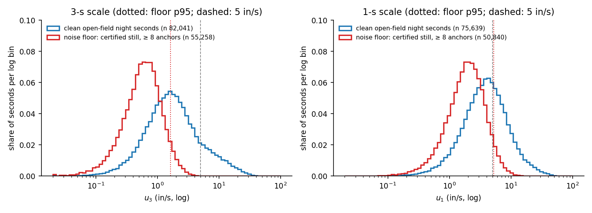
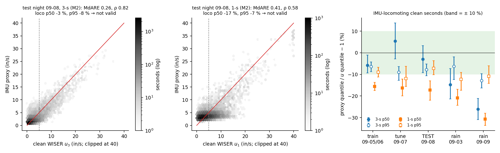
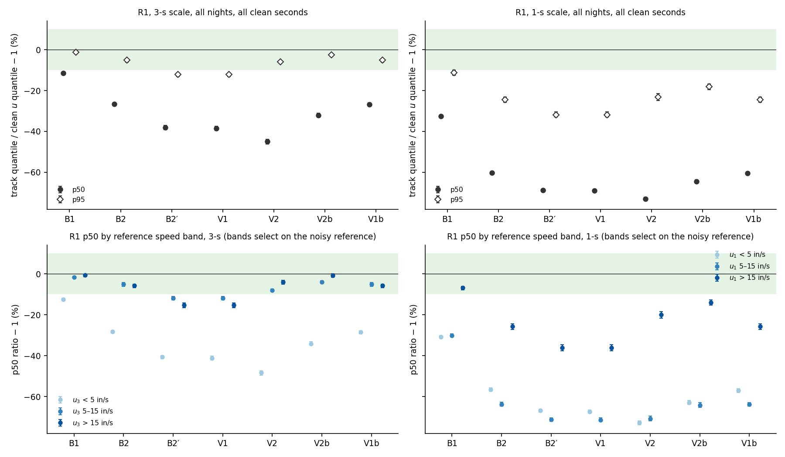

# WISER baseline — head-IMU speed reference independent of the smoother (cohort 2026c)

**Plan:** [`implementation_plan/2026-10-03-imu-speed-proxy.md`](../../../../implementation_plan/2026-10-03-imu-speed-proxy.md) (step B of A → B → C, approved by the user 2026-10-03, "干吧"; Amendment 1 written before any number). **Driver:** `wiser/scripts/analyze_imu_speed_proxy.py`. **Config:** `wiser/configs/imu_speed_proxy_2026c.json`. **Run:** `D:\Field2026_analysis_out\2026c\imu_speed_proxy_20261003_1210` (git f26b174+dirty). **Inputs:** failure-audit run `D:/Field2026_analysis_out/2026c/wiser_failure_audit_20261002_1511`, default-smoother run (V2b), V1b run, WISER fix caches, make_imu 50-Hz npz (features cached in `D:/Field2026_analysis_out/2026c/imu_speed_features`).

## Verdict

- **3-s scale: NOT VALID** (M2) — test night 09-08, clean seconds: MdARE 0.26 (≤ 0.25: fail), Spearman ρ 0.82 (≥ 0.7: pass) on 2,730 seconds with $u_3$ ≥ 5 in/s; IMU-locomoting p50 -2.9 % / p95 -7.8 % (± 10 %: pass) on 4,851 seconds.
- **1-s scale: NOT VALID** (M2) — test night 09-08, clean seconds: MdARE 0.41 (≤ 0.25: fail), Spearman ρ 0.58 (≥ 0.7: fail) on 5,432 seconds with $u_1$ ≥ 5 in/s; IMU-locomoting p50 -17.2 % / p95 -7.3 % (± 10 %: fail) on 4,352 seconds.
- **R1 (clean WISER reference, 3-s scale, all six nights): closest = B1 median-7**; **biased** (95 % CI of p50 or p95 entirely beyond ± 10 %): B1 median-7, B2 robust CV, B2′ (+drift, p), V1 ZUPT (audit), V2 IMU-q (audit), V2b IMU-q (B2 base), V1b B2 + guarded ZUPT.
- R1 at the 1-s scale: closest = B1 median-7; biased: B1 median-7, B2 robust CV, B2′ (+drift, p), V1 ZUPT (audit), V2 IMU-q (audit), V2b IMU-q (B2 base), V1b B2 + guarded ZUPT.
- **R2 not run** — the proxy is not valid at either scale, so it is not used to judge smoothers (pre-registered).
- **Least biased in speed:** B1 median-7 (R1 at the 3-s scale (proxy not valid at that scale -> no R2)). No default is changed in this step; a least-biased track other than the current default (V1b for the implanted animals, B2 elsewhere) is a proposal to the user.
- **Ephys deliverable:** not written (proxy not valid at either scale).

## Clean seconds and the noise floor

| night | role | seconds | IMU ok | fix conditions ok | medians outside houses | clean ($u_3$) | clean ($u_1$) | clean & IMU-locomoting | clean & $u_3$ ≥ 5 |
|---|---|---|---|---|---|---|---|---|---|
| 20260905 | train (calm) | 132,000 | 127,638 | 43,516 | 39,572 | **17,220** | 16,119 | 4,960 | 2,664 |
| 20260906 | train (calm) | 132,000 | 127,560 | 44,722 | 39,009 | **16,823** | 15,774 | 5,235 | 2,710 |
| 20260907 | tune (calm) | 132,000 | 128,058 | 26,821 | 39,549 | **10,149** | 8,989 | 3,046 | 1,610 |
| 20260908 | test (calm) | 132,000 | 128,984 | 38,726 | 46,495 | **17,460** | 15,779 | 4,851 | 2,730 |
| 20260903 | robustness (rain) | 132,000 | 129,179 | 25,157 | 35,935 | **9,715** | 9,082 | 2,156 | 980 |
| 20260909 | robustness (rain) | 132,000 | 128,361 | 18,946 | 52,518 | **10,674** | 9,896 | 3,029 | 1,970 |
| **all** | | 792,000 | 769,780 | 197,888 | 253,078 | **82,041** | 75,639 | 23,277 | 12,664 |

Per animal (all nights): SF07 16,080, SF08 18,705, SF09 18,363, SF10 17,854, SF12 11,039 clean seconds. Why seconds fail the fix conditions (a second can fail several; all nights): rate < 3 Hz 180,467, an anchor count < 8 488,651, an invalid fix 119,439, a masked fix 0, a jump 63,153.

**Noise floor** (the same estimators on certified still segments, ≥ 8 anchors, true speed 0):

| periods | scale | seconds | segments | mean | p50 | p90 | p95 | p99 | share ≥ 5 in/s |
|---|---|---|---|---|---|---|---|---|---|
| day calm | 3 s | 41,080 | 2,221 | 0.69 | 0.58 | 1.28 | 1.59 | 2.44 | 0.02 % |
| day calm | 1 s | 37,756 | 2,221 | 2.22 | 1.87 | 4.13 | 5.15 | 7.74 | 5.51 % |
| day rain | 3 s | 3,529 | 364 | 0.76 | 0.65 | 1.41 | 1.71 | 2.45 | 0.00 % |
| day rain | 1 s | 3,223 | 364 | 2.42 | 2.06 | 4.56 | 5.44 | 7.78 | 7.11 % |
| night calm | 3 s | 8,198 | 366 | 0.72 | 0.60 | 1.37 | 1.72 | 2.45 | 0.00 % |
| night calm | 1 s | 7,556 | 366 | 2.32 | 1.93 | 4.40 | 5.45 | 7.94 | 6.63 % |
| night rain | 3 s | 2,451 | 129 | 0.81 | 0.67 | 1.58 | 1.95 | 2.95 | 0.08 % |
| night rain | 1 s | 2,305 | 129 | 2.57 | 2.14 | 4.90 | 6.03 | 9.07 | 9.33 % |
| all all | 3 s | 55,258 | 3,080 | 0.70 | 0.59 | 1.31 | 1.64 | 2.48 | 0.02 % |
| all all | 1 s | 50,840 | 3,080 | 2.27 | 1.90 | 4.24 | 5.26 | 7.83 | 5.95 % |

## Models and the tuning night

| scale | n train | n tune | MAE tune M1 (in/s) | MAE tune M2 (in/s) | M2 best grid point | M1 coverage (tune) | MAE train M1 / M2 | chosen |
|---|---|---|---|---|---|---|---|---|
| 3 s | 34,043 | 10,149 | 1.095 | 0.754 | {'learning_rate': 0.1, 'max_depth': 5, 'min_samples_leaf': 200} | 0.9788 | 1.067 / 0.686 | **M2** |
| 1 s | 31,893 | 8,989 | 2.009 | 1.680 | {'learning_rate': 0.1, 'max_depth': 5, 'min_samples_leaf': 200} | 0.9961 | 1.926 / 1.540 | **M2** |

M1 coefficients (per animal; intercept, VeDBA mean [in/s per m/s²], stride-band power [in/s per (m/s²)²], stride peak frequency [in/s per Hz], |ω| mean [in/s per deg/s]):

| scale | animal | n train | intercept | vedba_mean | vpow | vpeak_hz | omega_mean |
|---|---|---|---|---|---|---|---|
| 3 s | SF07 | 6,709 | 0.1640 | 1.6386 | 0.1812 | -0.0655 | -0.0246 |
| 3 s | SF08 | 7,887 | 0.5957 | 1.1129 | 0.2162 | -0.0524 | -0.0146 |
| 3 s | SF09 | 7,102 | -1.1872 | 2.7610 | 0.2115 | 0.0865 | -0.0427 |
| 3 s | SF10 | 7,135 | -1.5106 | 1.9311 | 0.2185 | 0.1158 | -0.0224 |
| 3 s | SF12 | 4,460 | -0.1143 | 2.2935 | 0.1638 | -0.0843 | -0.0330 |
| 1 s | SF07 | 6,407 | 1.7800 | 1.3950 | 0.1815 | -0.0305 | -0.0170 |
| 1 s | SF08 | 7,420 | 2.6744 | 1.0611 | 0.1894 | -0.0561 | -0.0108 |
| 1 s | SF09 | 6,844 | 1.3039 | 2.2703 | 0.1916 | 0.0215 | -0.0302 |
| 1 s | SF10 | 6,840 | 1.4155 | 1.4593 | 0.2053 | 0.0433 | -0.0122 |
| 1 s | SF12 | 4,208 | 1.8155 | 1.7842 | 0.1934 | -0.0563 | -0.0208 |

M2 grid (tuning-night MAE on all clean tuning seconds, in/s): 3 s lr 0.05 depth 3 leaf 50 → 0.773; 3 s lr 0.05 depth 3 leaf 200 → 0.774; 3 s lr 0.05 depth 5 leaf 50 → 0.763; 3 s lr 0.05 depth 5 leaf 200 → 0.764; 3 s lr 0.1 depth 3 leaf 50 → 0.770; 3 s lr 0.1 depth 3 leaf 200 → 0.774; 3 s lr 0.1 depth 5 leaf 50 → 0.762; 3 s lr 0.1 depth 5 leaf 200 → 0.762; 1 s lr 0.05 depth 3 leaf 50 → 1.715; 1 s lr 0.05 depth 3 leaf 200 → 1.713; 1 s lr 0.05 depth 5 leaf 50 → 1.688; 1 s lr 0.05 depth 5 leaf 200 → 1.686; 1 s lr 0.1 depth 3 leaf 50 → 1.700; 1 s lr 0.1 depth 3 leaf 200 → 1.700; 1 s lr 0.1 depth 5 leaf 50 → 1.695; 1 s lr 0.1 depth 5 leaf 200 → 1.681.

## Validity (test night 09-08) and robustness

| nights | scale | model | n (u ≥ 5) | MdARE [CI] | Spearman ρ [CI] | n loco | loco p50 Δ [CI] | loco p95 Δ [CI] | valid by the rule |
|---|---|---|---|---|---|---|---|---|---|
| **TEST 09-08** | 3 s | M2 | 2,730 | 0.26 [0.25, 0.28] | 0.82 [0.79, 0.84] | 4,851 | -2.9 % [-9.3 %, +3.3 %] | -7.8 % [-10.6 %, -5.2 %] | no (decides) |
| **TEST 09-08** | 1 s | M2 | 5,432 | 0.41 [0.40, 0.42] | 0.58 [0.54, 0.61] | 4,352 | -17.2 % [-22.0 %, -13.1 %] | -7.3 % [-10.2 %, -3.6 %] | no (decides) |
| rain 09-03 | 3 s | M2 | 980 | 0.36 [0.33, 0.40] | 0.59 [0.53, 0.64] | 2,156 | -14.8 % [-21.3 %, -7.3 %] | -6.3 % [-12.4 %, -1.9 %] | no (reported) |
| rain 09-03 | 1 s | M2 | 3,321 | 0.46 [0.45, 0.47] | 0.32 [0.27, 0.37] | 2,022 | -20.8 % [-24.3 %, -16.9 %] | -12.3 % [-17.3 %, -9.1 %] | no (reported) |
| rain 09-09 | 3 s | M2 | 1,970 | 0.35 [0.33, 0.37] | 0.81 [0.79, 0.83] | 3,029 | -26.1 % [-30.9 %, -21.2 %] | -12.9 % [-16.4 %, -9.7 %] | no (reported) |
| rain 09-09 | 1 s | M2 | 4,129 | 0.45 [0.44, 0.47] | 0.54 [0.50, 0.58] | 2,783 | -30.7 % [-33.6 %, -28.0 %] | -10.9 % [-14.2 %, -6.0 %] | no (reported) |
| rain both | 3 s | M2 | 2,950 | 0.35 [0.34, 0.37] | 0.74 [0.72, 0.77] | 5,185 | -20.7 % [-23.8 %, -16.9 %] | -14.4 % [-18.0 %, -10.9 %] | no (reported) |
| rain both | 1 s | M2 | 7,450 | 0.46 [0.45, 0.47] | 0.45 [0.41, 0.49] | 4,805 | -26.6 % [-29.2 %, -24.2 %] | -13.7 % [-16.6 %, -10.0 %] | no (reported) |
| tune 09-07 (in-sample choice) | 3 s | M2 | 1,610 | 0.26 [0.24, 0.28] | 0.81 [0.78, 0.83] | 3,046 | +5.4 % [-2.9 %, +13.7 %] | -9.0 % [-12.8 %, -6.3 %] | no (reported) |
| tune 09-07 (in-sample choice) | 1 s | M2 | 3,526 | 0.44 [0.42, 0.46] | 0.52 [0.48, 0.56] | 2,716 | -16.3 % [-19.9 %, -12.2 %] | -11.9 % [-15.6 %, -6.3 %] | no (reported) |
| train 09-05/06 (in-sample) | 3 s | M2 | 5,374 | 0.25 [0.24, 0.26] | 0.78 [0.76, 0.80] | 10,195 | -5.8 % [-9.3 %, -1.1 %] | -6.3 % [-8.7 %, -4.3 %] | yes (reported) |
| train 09-05/06 (in-sample) | 1 s | M2 | 11,613 | 0.40 [0.39, 0.41] | 0.53 [0.51, 0.55] | 9,563 | -15.6 % [-17.5 %, -13.7 %] | -9.0 % [-11.3 %, -6.7 %] | no (reported) |

Test night per animal (reported): SF07 3 s MdARE 0.27, ρ 0.74, loco p50 +30 % / p95 -8 %; SF07 1 s MdARE 0.41, ρ 0.51, loco p50 +3 % / p95 -16 %; SF08 3 s MdARE 0.30, ρ 0.82, loco p50 -21 % / p95 -15 %; SF08 1 s MdARE 0.42, ρ 0.59, loco p50 -28 % / p95 +0 %; SF09 3 s MdARE 0.26, ρ 0.84, loco p50 -5 % / p95 -8 %; SF09 1 s MdARE 0.39, ρ 0.64, loco p50 -18 % / p95 -13 %; SF10 3 s MdARE 0.24, ρ 0.82, loco p50 -7 % / p95 -5 %; SF10 1 s MdARE 0.39, ρ 0.59, loco p50 -22 % / p95 -3 %; SF12 3 s MdARE 0.25, ρ 0.81, loco p50 -6 % / p95 -5 %; SF12 1 s MdARE 0.45, ρ 0.43, loco p50 -14 % / p95 -4 %.

## R1 — every track against the clean WISER reference

On clean seconds (open field, ≥ 8 anchors, no jumps, IMU-ok), each track's speed by the same median estimator vs $u$. `raw` is the reference itself (identity check: Δ = 0 by construction). Point estimate [95 % CI], paired 10-min block bootstrap.

**3-s scale, all nights** — 82,041 clean seconds, 1040 blocks; reference p50 1.68 / p95 11.09 in/s.

| track | p50 (in/s) | p50 Δ [CI] | p95 (in/s) | p95 Δ [CI] | MAE vs u (in/s) [CI] | biased |
|---|---|---|---|---|---|---|
| raw fixes | 1.68 | +0.0 % [+0.0 %, +0.0 %] | 11.09 | +0.0 % [+0.0 %, +0.0 %] | 0.00 [0.00, 0.00] | — |
| B1 median-7 | 1.49 | -11.5 % [-12.2 %, -10.9 %] | 10.96 | -1.2 % [-1.7 %, -0.8 %] | 0.23 [0.23, 0.23] | **yes** |
| B2 robust CV | 1.23 | -26.6 % [-27.3 %, -25.9 %] | 10.52 | -5.2 % [-6.0 %, -4.7 %] | 0.50 [0.50, 0.51] | **yes** |
| B2′ (+drift, p) | 1.04 | -38.2 % [-39.2 %, -37.1 %] | 9.74 | -12.2 % [-13.2 %, -11.4 %] | 0.68 [0.66, 0.69] | **yes** |
| V1 ZUPT (audit) | 1.03 | -38.5 % [-39.7 %, -37.4 %] | 9.74 | -12.2 % [-13.2 %, -11.4 %] | 0.69 [0.68, 0.71] | **yes** |
| V2 IMU-q (audit) | 0.92 | -45.0 % [-46.3 %, -43.8 %] | 10.44 | -5.9 % [-6.8 %, -5.5 %] | 0.65 [0.64, 0.65] | **yes** |
| V2b IMU-q (B2 base) | 1.14 | -32.1 % [-33.0 %, -31.1 %] | 10.81 | -2.5 % [-3.3 %, -2.0 %] | 0.50 [0.49, 0.50] | **yes** |
| V1b B2 + guarded ZUPT | 1.23 | -26.7 % [-27.5 %, -25.9 %] | 10.52 | -5.2 % [-6.0 %, -4.7 %] | 0.51 [0.50, 0.52] | **yes** |

**3-s scale, calm nights** — 61,652 clean seconds, 695 blocks; reference p50 1.66 / p95 11.48 in/s.

| track | p50 (in/s) | p50 Δ [CI] | p95 (in/s) | p95 Δ [CI] | MAE vs u (in/s) [CI] | biased |
|---|---|---|---|---|---|---|
| raw fixes | 1.66 | +0.0 % [+0.0 %, +0.0 %] | 11.48 | +0.0 % [+0.0 %, +0.0 %] | 0.00 [0.00, 0.00] | — |
| B1 median-7 | 1.47 | -11.5 % [-12.2 %, -10.9 %] | 11.35 | -1.1 % [-1.7 %, -0.6 %] | 0.22 [0.22, 0.23] | **yes** |
| B2 robust CV | 1.23 | -26.3 % [-27.1 %, -25.4 %] | 10.81 | -5.8 % [-6.5 %, -4.7 %] | 0.50 [0.49, 0.51] | **yes** |
| B2′ (+drift, p) | 1.03 | -37.9 % [-39.1 %, -36.7 %] | 10.03 | -12.6 % [-13.7 %, -11.4 %] | 0.67 [0.66, 0.69] | **yes** |
| V1 ZUPT (audit) | 1.03 | -38.2 % [-39.5 %, -36.9 %] | 10.04 | -12.6 % [-13.7 %, -11.4 %] | 0.68 [0.67, 0.70] | **yes** |
| V2 IMU-q (audit) | 0.92 | -44.8 % [-46.3 %, -43.1 %] | 10.77 | -6.2 % [-7.1 %, -5.2 %] | 0.63 [0.62, 0.64] | **yes** |
| V2b IMU-q (B2 base) | 1.14 | -31.7 % [-32.8 %, -30.5 %] | 11.15 | -2.8 % [-3.3 %, -1.7 %] | 0.49 [0.48, 0.49] | **yes** |
| V1b B2 + guarded ZUPT | 1.22 | -26.5 % [-27.3 %, -25.4 %] | 10.81 | -5.8 % [-6.5 %, -4.7 %] | 0.51 [0.50, 0.52] | **yes** |

**3-s scale, rain nights** — 20,389 clean seconds, 345 blocks; reference p50 1.72 / p95 10.11 in/s.

| track | p50 (in/s) | p50 Δ [CI] | p95 (in/s) | p95 Δ [CI] | MAE vs u (in/s) [CI] | biased |
|---|---|---|---|---|---|---|
| raw fixes | 1.72 | +0.0 % [+0.0 %, +0.0 %] | 10.11 | +0.0 % [+0.0 %, +0.0 %] | 0.00 [0.00, 0.00] | — |
| B1 median-7 | 1.52 | -11.4 % [-12.7 %, -10.2 %] | 9.99 | -1.2 % [-2.8 %, -0.6 %] | 0.25 [0.24, 0.26] | **yes** |
| B2 robust CV | 1.25 | -27.5 % [-28.9 %, -25.6 %] | 9.62 | -4.8 % [-7.1 %, -3.9 %] | 0.52 [0.51, 0.54] | **yes** |
| B2′ (+drift, p) | 1.05 | -39.0 % [-41.0 %, -36.9 %] | 8.86 | -12.4 % [-14.1 %, -10.7 %] | 0.69 [0.67, 0.72] | **yes** |
| V1 ZUPT (audit) | 1.04 | -39.4 % [-41.5 %, -37.2 %] | 8.86 | -12.4 % [-14.1 %, -10.7 %] | 0.72 [0.70, 0.74] | **yes** |
| V2 IMU-q (audit) | 0.93 | -45.7 % [-47.9 %, -43.5 %] | 9.46 | -6.4 % [-8.1 %, -5.2 %] | 0.69 [0.68, 0.71] | **yes** |
| V2b IMU-q (B2 base) | 1.15 | -33.3 % [-34.9 %, -31.5 %] | 9.82 | -2.8 % [-4.4 %, -1.7 %] | 0.53 [0.52, 0.55] | **yes** |
| V1b B2 + guarded ZUPT | 1.24 | -27.6 % [-29.3 %, -25.9 %] | 9.62 | -4.8 % [-7.1 %, -3.9 %] | 0.53 [0.52, 0.55] | **yes** |

**1-s scale, all nights** — 75,639 clean seconds, 1040 blocks; reference p50 3.86 / p95 14.96 in/s.

| track | p50 (in/s) | p50 Δ [CI] | p95 (in/s) | p95 Δ [CI] | MAE vs u (in/s) [CI] | biased |
|---|---|---|---|---|---|---|
| raw fixes | 3.86 | +0.0 % [+0.0 %, +0.0 %] | 14.96 | +0.0 % [+0.0 %, +0.0 %] | 0.00 [0.00, 0.00] | — |
| B1 median-7 | 2.60 | -32.6 % [-33.0 %, -32.1 %] | 13.29 | -11.2 % [-12.4 %, -9.9 %] | 1.15 [1.13, 1.16] | **yes** |
| B2 robust CV | 1.53 | -60.3 % [-60.9 %, -59.6 %] | 11.31 | -24.4 % [-25.6 %, -23.1 %] | 2.14 [2.11, 2.17] | **yes** |
| B2′ (+drift, p) | 1.20 | -68.9 % [-69.6 %, -68.3 %] | 10.18 | -31.9 % [-33.0 %, -30.5 %] | 2.42 [2.39, 2.46] | **yes** |
| V1 ZUPT (audit) | 1.19 | -69.1 % [-69.9 %, -68.4 %] | 10.18 | -31.9 % [-33.0 %, -30.5 %] | 2.45 [2.41, 2.48] | **yes** |
| V2 IMU-q (audit) | 1.04 | -73.1 % [-74.0 %, -72.2 %] | 11.49 | -23.2 % [-24.8 %, -21.6 %] | 2.38 [2.35, 2.41] | **yes** |
| V2b IMU-q (B2 base) | 1.37 | -64.6 % [-65.4 %, -63.8 %] | 12.27 | -18.0 % [-19.5 %, -16.8 %] | 2.10 [2.07, 2.13] | **yes** |
| V1b B2 + guarded ZUPT | 1.53 | -60.5 % [-61.2 %, -59.8 %] | 11.31 | -24.4 % [-25.6 %, -23.1 %] | 2.16 [2.13, 2.19] | **yes** |

**1-s scale, calm nights** — 56,661 clean seconds, 695 blocks; reference p50 3.79 / p95 15.03 in/s.

| track | p50 (in/s) | p50 Δ [CI] | p95 (in/s) | p95 Δ [CI] | MAE vs u (in/s) [CI] | biased |
|---|---|---|---|---|---|---|
| raw fixes | 3.79 | +0.0 % [+0.0 %, +0.0 %] | 15.03 | +0.0 % [+0.0 %, +0.0 %] | 0.00 [0.00, 0.00] | — |
| B1 median-7 | 2.57 | -32.2 % [-32.8 %, -31.5 %] | 13.58 | -9.6 % [-11.4 %, -8.6 %] | 1.12 [1.10, 1.14] | **yes** |
| B2 robust CV | 1.52 | -59.7 % [-60.5 %, -59.0 %] | 11.65 | -22.5 % [-23.9 %, -20.7 %] | 2.10 [2.07, 2.14] | **yes** |
| B2′ (+drift, p) | 1.19 | -68.5 % [-69.3 %, -67.7 %] | 10.48 | -30.2 % [-31.7 %, -28.7 %] | 2.37 [2.33, 2.41] | **yes** |
| V1 ZUPT (audit) | 1.19 | -68.7 % [-69.4 %, -67.8 %] | 10.48 | -30.2 % [-31.7 %, -28.7 %] | 2.39 [2.35, 2.43] | **yes** |
| V2 IMU-q (audit) | 1.03 | -72.7 % [-73.8 %, -71.4 %] | 11.87 | -21.0 % [-22.9 %, -19.3 %] | 2.32 [2.28, 2.35] | **yes** |
| V2b IMU-q (B2 base) | 1.36 | -64.0 % [-64.9 %, -63.1 %] | 12.61 | -16.1 % [-17.5 %, -14.6 %] | 2.05 [2.02, 2.08] | **yes** |
| V1b B2 + guarded ZUPT | 1.52 | -59.8 % [-60.7 %, -59.1 %] | 11.65 | -22.5 % [-23.9 %, -20.7 %] | 2.11 [2.08, 2.15] | **yes** |

**1-s scale, rain nights** — 18,978 clean seconds, 345 blocks; reference p50 4.06 / p95 14.67 in/s.

| track | p50 (in/s) | p50 Δ [CI] | p95 (in/s) | p95 Δ [CI] | MAE vs u (in/s) [CI] | biased |
|---|---|---|---|---|---|---|
| raw fixes | 4.06 | +0.0 % [+0.0 %, +0.0 %] | 14.67 | +0.0 % [+0.0 %, +0.0 %] | 0.00 [0.00, 0.00] | — |
| B1 median-7 | 2.71 | -33.2 % [-34.3 %, -32.3 %] | 12.53 | -14.6 % [-17.0 %, -12.2 %] | 1.24 [1.21, 1.28] | **yes** |
| B2 robust CV | 1.56 | -61.5 % [-63.0 %, -60.4 %] | 10.22 | -30.3 % [-33.0 %, -27.5 %] | 2.27 [2.21, 2.33] | **yes** |
| B2′ (+drift, p) | 1.22 | -70.0 % [-71.2 %, -68.8 %] | 9.25 | -36.9 % [-39.7 %, -34.5 %] | 2.57 [2.51, 2.64] | **yes** |
| V1 ZUPT (audit) | 1.21 | -70.2 % [-71.6 %, -69.0 %] | 9.25 | -36.9 % [-39.7 %, -34.5 %] | 2.62 [2.55, 2.67] | **yes** |
| V2 IMU-q (audit) | 1.06 | -74.0 % [-75.7 %, -72.5 %] | 10.20 | -30.5 % [-33.6 %, -26.7 %] | 2.57 [2.52, 2.64] | **yes** |
| V2b IMU-q (B2 base) | 1.38 | -66.1 % [-67.6 %, -64.5 %] | 10.97 | -25.2 % [-28.3 %, -21.8 %] | 2.27 [2.22, 2.32] | **yes** |
| V1b B2 + guarded ZUPT | 1.55 | -61.8 % [-63.3 %, -60.5 %] | 10.22 | -30.3 % [-33.0 %, -27.5 %] | 2.30 [2.24, 2.35] | **yes** |

**By reference speed band** (all nights; p50 Δ / p95 Δ / MAE; band selection on the noisy reference biases ratios toward 'slower' in the top band and 'faster' in the bottom band for tracks that do not share the reference's noise; noise removal pushes every smoother 'slower' in the bottom band):

| 3-s | < 5 in/s | 5–15 in/s | > 15 in/s |
|---|---|---|---|
| raw fixes | +0 % [+0 %, +0 %] / +0 % / 0.00 (n 69,377) | +0 % [+0 %, +0 %] / +0 % / 0.00 (n 10,487) | +0 % [+0 %, +0 %] / +0 % / 0.00 (n 2,177) |
| B1 median-7 | -13 % [-13 %, -12 %] / -5 % / 0.24 (n 69,377) | -2 % [-2 %, -1 %] / -1 % / 0.20 (n 10,487) | -1 % [-1 %, -0 %] / -1 % / 0.08 (n 2,177) |
| B2 robust CV | -28 % [-29 %, -28 %] / -7 % / 0.46 (n 69,377) | -5 % [-6 %, -4 %] / -4 % / 0.88 (n 10,487) | -6 % [-7 %, -5 %] / -8 % / 1.60 (n 2,177) |
| B2′ (+drift, p) | -41 % [-42 %, -40 %] / -8 % / 0.59 (n 69,377) | -12 % [-13 %, -11 %] / -10 % / 1.52 (n 10,487) | -15 % [-17 %, -14 %] / -19 % / 3.53 (n 2,177) |
| V1 ZUPT (audit) | -41 % [-42 %, -40 %] / -8 % / 0.61 (n 69,377) | -12 % [-13 %, -11 %] / -10 % / 1.52 (n 10,487) | -15 % [-17 %, -14 %] / -19 % / 3.53 (n 2,177) |
| V2 IMU-q (audit) | -48 % [-49 %, -47 %] / -13 % / 0.61 (n 69,377) | -8 % [-9 %, -7 %] / -4 % / 0.90 (n 10,487) | -4 % [-5 %, -3 %] / -4 % / 1.10 (n 2,177) |
| V2b IMU-q (B2 base) | -34 % [-35 %, -33 %] / -10 % / 0.48 (n 69,377) | -4 % [-5 %, -3 %] / -2 % / 0.63 (n 10,487) | -1 % [-2 %, +0 %] / -1 % / 0.70 (n 2,177) |
| V1b B2 + guarded ZUPT | -28 % [-29 %, -28 %] / -7 % / 0.46 (n 69,377) | -5 % [-6 %, -4 %] / -4 % / 0.88 (n 10,487) | -6 % [-7 %, -5 %] / -8 % / 1.60 (n 2,177) |

| 1-s | < 5 in/s | 5–15 in/s | > 15 in/s |
|---|---|---|---|
| raw fixes | +0 % [+0 %, +0 %] / +0 % / 0.00 (n 47,618) | +0 % [+0 %, +0 %] / +0 % / 0.00 (n 24,272) | +0 % [+0 %, +0 %] / +0 % / 0.00 (n 3,749) |
| B1 median-7 | -31 % [-31 %, -30 %] / -3 % / 0.90 (n 47,618) | -30 % [-31 %, -29 %] / -11 % / 2.18 (n 24,272) | -7 % [-8 %, -6 %] / -2 % / 0.81 (n 3,749) |
| B2 robust CV | -57 % [-57 %, -56 %] / -9 % / 1.43 (n 47,618) | -64 % [-65 %, -63 %] / -18 % / 4.45 (n 24,272) | -26 % [-27 %, -24 %] / -23 % / 6.54 (n 3,749) |
| B2′ (+drift, p) | -67 % [-68 %, -66 %] / -9 % / 1.63 (n 47,618) | -71 % [-72 %, -70 %] / -25 % / 4.88 (n 24,272) | -36 % [-38 %, -35 %] / -33 % / 8.71 (n 3,749) |
| V1 ZUPT (audit) | -67 % [-68 %, -66 %] / -9 % / 1.66 (n 47,618) | -71 % [-72 %, -70 %] / -25 % / 4.89 (n 24,272) | -36 % [-38 %, -35 %] / -33 % / 8.71 (n 3,749) |
| V2 IMU-q (audit) | -73 % [-74 %, -72 %] / -22 % / 1.68 (n 47,618) | -71 % [-72 %, -69 %] / -19 % / 4.80 (n 24,272) | -20 % [-22 %, -18 %] / -15 % / 4.99 (n 3,749) |
| V2b IMU-q (B2 base) | -63 % [-64 %, -62 %] / -18 % / 1.49 (n 47,618) | -64 % [-65 %, -63 %] / -16 % / 4.38 (n 24,272) | -14 % [-15 %, -13 %] / -9 % / 3.72 (n 3,749) |
| V1b B2 + guarded ZUPT | -57 % [-58 %, -56 %] / -9 % / 1.45 (n 47,618) | -64 % [-65 %, -63 %] / -18 % / 4.46 (n 24,272) | -26 % [-27 %, -24 %] / -23 % / 6.54 (n 3,749) |

## R2 — every track against the IMU proxy

Not run: the proxy failed the pre-registered validity rule at both scales, so it is reported as not valid and is **not** used to judge smoothers.

## Reading (pre-registered)

- R1, 3-s: order by max(|Δp50|, |Δp95|) = B1 < B2 < V1b < V2b < B2′ < V1 < V2; closest **B1 median-7** (11.5 %); biased: B1 median-7, B2 robust CV, B2′ (+drift, p), V1 ZUPT (audit), V2 IMU-q (audit), V2b IMU-q (B2 base), V1b B2 + guarded ZUPT.
- R1, 1-s: order by max(|Δp50|, |Δp95|) = B1 < B2 < V1b < V2b < B2′ < V1 < V2; closest **B1 median-7** (32.6 %); biased: B1 median-7, B2 robust CV, B2′ (+drift, p), V1 ZUPT (audit), V2 IMU-q (audit), V2b IMU-q (B2 base), V1b B2 + guarded ZUPT.
- **Least biased in speed: B1 median-7** — R1 at the 3-s scale (proxy not valid at that scale -> no R2).
- No default is changed in this step (plan). The current defaults: V1b for the implanted animals where the IMU QC passes, B2 elsewhere (V1b = B2 in motion, step A).

## Note made after the results (2026-10-03; reading aid only, no verdict changed)

- **Why every smoothed track is 'biased' in the primary cell.** The cell is decided by p50, and on clean seconds the reference p50 is 1.68 in/s at 3 s — about the noise floor's p95 (1.64 in/s): 49 % of the clean seconds are at or below the floor p95 and 85 % below 5 in/s (most clean open-field seconds are slow). There $u_3$ is largely the fixes' own noise, which every smoother removes by design, so a negative p50 Δ mixes noise removal with under-following; the p50 cell cannot separate them. At 1 s the reference p50 (3.86 in/s) is below the floor p95 (5.26 in/s), so the 1-s cells are dominated by noise. The pre-registered labels stand as computed.
- **Where the reference is above its floor** — the p95 of all clean seconds and the 5–15 / > 15 in/s bands (band ratios carry selection regression for tracks that do not share the reference's noise; at 3 s the floor p50 is ≈ 0.6 in/s, so the effect is small at > 15 in/s and large at 1 s):

| track | 3-s p95 Δ (all clean) | 3-s 5–15 p50 Δ | 3-s > 15 p50 Δ | 3-s > 15 p95 Δ | 1-s p95 Δ (all clean) | 1-s > 15 p50 Δ | 1-s > 15 p95 Δ |
|---|---|---|---|---|---|---|---|
| B1 median-7 | -1.2 % | -1.6 % | -0.6 % | -0.7 % | -11.2 % | -6.8 % | -1.9 % |
| B2 robust CV | -5.2 % | -5.1 % | -5.8 % | -8.0 % | -24.4 % | -25.6 % | -22.7 % |
| B2′ (+drift, p) | -12.2 % | -11.8 % | -15.2 % | -18.5 % | -31.9 % | -36.0 % | -33.1 % |
| V1 ZUPT (audit) | -12.2 % | -11.8 % | -15.3 % | -18.5 % | -31.9 % | -36.0 % | -33.1 % |
| V2 IMU-q (audit) | -5.9 % | -8.0 % | -3.9 % | -4.3 % | -23.2 % | -19.9 % | -14.9 % |
| V2b IMU-q (B2 base) | -2.5 % | -3.9 % | -0.8 % | -1.4 % | -18.0 % | -14.1 % | -9.0 % |
| V1b B2 + guarded ZUPT | -5.2 % | -5.1 % | -5.8 % | -8.0 % | -24.4 % | -25.6 % | -22.7 % |

  Read this way: B2 and V1b (identical in motion) run 5 % slow at the 3-s p95 and 8 % slow at the p95 of the > 15 in/s band, and 26 % slow at the 1-s p50 above 15 in/s (part of the 1-s figure is selection regression on the noisy 1-s reference) — consistent with the constant-velocity q (3 in²/s³) under-following fast bursts, as the NIS of 8–10 in runs suggested. V2b (IMU-switched q on B2) follows fast movement best among the Kalman tracks (-1.4 % / -14.1 %); B2′ and V1 (drift state) are the slowest (-18.5 % at the 3-s > 15 p95).
- **B1 is closest partly by construction:** it is a running median of the raw fixes, like the reference, so it shares the reference's noise and jumps (MAE vs $u_3$ 0.23 in/s, vs ≈ 0.50 for B2). B1 was eliminated in the default-smoother step (S1–S4: jumps, ≈ 107 in/min of fake path in calm stillness). The pre-registered reading names it least biased in speed; that is reported, and it is not a recommendation to use B1.
- **The 3-s proxy misses one condition:** MdARE 0.262 against ≤ 0.25 (CI 0.249–0.279); ρ and the locomoting quantiles pass. The point estimate decides (pre-registered), so the proxy is not valid and is not used for R2 or ephys. On the rain nights it is clearly worse (MdARE ≈ 0.35, locomoting p50 −15 to −26 %).

## Checks

- Audit `imu_seconds` reproduced from the npz on all 30 animal-nights: ok agreement ≥ 100.000 %, still ≥ 100.000 %, state ≥ 100.000 %; max |ΔVeDBA₁ₛ| 3.55e-15 m/s², max |ΔSBF| 1.11e-16.
- Reference from the float64 fix cache vs the audit's float32 raw track on clean seconds: max |Δu₃| 2.57e-05, max |Δu₁| 7.48e-05 in/s. Track files matched the fix cache fix by fix (t_ms) for all tracks.
- Feature cache: {'written': 30}.
- Selftest (`--selftest`, synthetic): clean filter = an independent loop implementation and excludes every planted defect; $u_3$ recovers the planted walking speeds within the floor; M1 recovers planted coefficients; features recover a planted stride frequency / power; the validity rule passes a good and fails two bad proxies; R1 flags a ×0.85 speed-damped track.

## Caveats

- The clean filter selects good conditions (open field, ≥ 8 anchors): R1 says nothing about speed under poor anchors, in the houses or in heavy rain. The noise floor comes from still segments in the houses.
- The proxy is calibrated on open-field clean seconds; where it is applied in the houses / rain (R2, deliverable) its validity is assumed, not shown (more in-place activity there).
- Head speed ≠ body speed: head scanning adds path; the 3-s scale partly averages it out. The IMU-locomoting class was itself fitted against WISER speed. Median-window estimators smooth the fastest bursts at both scales, for the reference and the tracks alike.
- The WISER frame is an unverified offset frame; speeds are frame-invariant (rotation/offset) but not scale-verified.

## Amendments

Amendment 1 of the plan (operational details) was written before any number of this step; the models were frozen (fit stage, 12:11) before any test-night or rain-night number was computed (evaluate stage, 12:12). Note 2 (after the results): the reading-aid section above and the figure layout; no definition, threshold, verdict or label changed. Both are listed in the plan.

## Definitions

All positions are in the WISER native **inch** frame (unverified offset origin); speeds in **in/s**. Times are field-PC
Unix seconds; WISER fix times are aligned to the IMU clock, $t_i = t_i^{\mathrm{fix}} - \tau^*$ ($\tau^*$ = 0.20 / 0.15 / 0.10
/ 0.20 / 0.15 s for SF07 / 08 / 09 / 10 / 12). $\mathbf z_i$ = raw fix $i$ (float64 from the fix cache), $A_i$ = its
`anchors_used`. A **second** $s$ is the interval $[s, s+1)$ of the audit's `imu_seconds`; its centre is $c = s + 0.5$
(Amendment 1.1).

### Window median ($\mathbf m_h(g)$)
$$\mathbf m_h(g) = \operatorname{median}_{\text{coord}}\{\mathbf z_i : t_i \in [g-h, g+h)\},\quad \text{defined iff } \#\{i\} \ge 3$$
**Text:** coordinate-wise median of the raw fixes in a window of length $2h$ centred on $g$. Units: in. $h = 0.5$ s for the
3-s scale, $h = 0.375$ s for the 1-s scale. The median removes most single-fix outliers without a motion model.

### Clean WISER speed ($u_3$, $u_1$)
$$u_3(s) = \frac{\lVert \mathbf m_{0.5}(c+1.5) - \mathbf m_{0.5}(c-1.5)\rVert}{3\ \mathrm{s}},\qquad
u_1(s) = \frac{\lVert \mathbf m_{0.375}(c+0.5) - \mathbf m_{0.375}(c-0.5)\rVert}{1\ \mathrm{s}}$$
**Text:** displacement of the window medians over 3 s (1 s) divided by the baseline: a nearly model-free head speed.
Units: in/s; range $[0, \infty)$. It is the *target* only on clean seconds. Its noise is set by the per-axis fix scatter
(≈ 1.6–3.7 in at 8–9 anchors) divided by $\sqrt{n}$ and by the baseline, so $u_1$ is noisier than $u_3$.

### Clean second
Second $s$ is clean iff, with span $\mathcal S = [c-2, c+2]$ s: every fix in $\mathcal S$ has $A_i \ge 8$, `valid` true and
none of the masks `m_handling`, `m_silence`, `m_tag_validity`, `m_adc_lane`; no **jump** touches $\mathcal S$ (a consecutive
raw-fix pair $(i, i+1)$ with $\lVert\mathbf z_{i+1}-\mathbf z_i\rVert > 30$ in and $t_{i+1}-t_i \le 0.35$ s, at least one of
the two fixes in $\mathcal S$); $\#\{i : t_i\in\mathcal S\} \ge 12$ (fix rate ≥ 3 Hz); both medians $\mathbf m_{0.5}(c\pm1.5)$
exist and lie outside `house_1` and `house_2` grown by 14 in on every side; and the audit's per-second `ok` of $s$ is true
(IMU QC, handling ± 5 min, all-tag silences ± 2 min, tag validity, ADC lane). $u_1$ uses the same clean seconds and needs
its own two medians. **Thresholds:** 8 anchors = the per-axis static SD ≈ 1.6–3.7 in regime; 30 in / 0.35 s = the audit's
jump definition; 14 in = 2 × the 7-in jitter floor (house buffer used by every WISER zone rule).

### Noise floor ($F_3$, $F_1$)
$$F_k = \{u_k(s) : s \text{ a floor second}\}$$
A floor second has its span $\mathcal S$ inside a certified still segment (the audit's primary, scored segments ≥ 30 s,
trimmed by 1 s) and meets every clean-second condition except the house one. **Text:** the distribution of the reference
when the true head speed is 0 (head IMU certified still), at ≥ 8 anchors. Units: in/s. Reported as p50 / p90 / p95 / p99;
values of $u_k$ below the floor's p95 cannot be told from stillness. Caveat: the still segments are in the houses.

### Valid 50-Hz IMU sample, QC share ($q_w$)
Valid = finite, not saturated / frozen / invalid / unreliable, no frozen-rule run, outside handling ± 5 min, all-tag
silences ± 2 min, the ADC lane and the tag window (the audit's `sample_valid`). $q_w(s) = n_{\mathrm{valid}} / (50\,w)$ for
the window $W_w(s)$: $W_1 = [s, s+1)$, $W_3 = [s-1, s+2)$. Range $[0, 1]$.

### IMU features (per window $W_w$, valid samples only)
- **VeDBA mean / p90** $\overline{\mathrm{VeDBA}}_w$, $\mathrm{VeDBA}_{w,90}$: mean and 90th percentile of make_imu's VeDBA
  (dynamic body acceleration magnitude). m/s². High = vigorous head movement.
- **Horizontal dynamic acceleration RMS** $H_w = \sqrt{\operatorname{mean}_{n\in W_w}(\tilde a_{x,n}^2 + \tilde a_{y,n}^2)}$, $\tilde a$ =
  earth-frame linear acceleration after a zero-phase order-4 Butterworth band-pass 0.5–8 Hz. m/s².
- **Stride-band power** $P_w = \sum_{k: f_k\in[2,8]\,\mathrm{Hz}} P_k$, with $P_k = 2\lvert X_k\rvert^2/(N\sum_n w_n^2)$ the one-sided
  Hann periodogram of the demeaned vertical earth-frame linear acceleration over the $N = 50w$ samples. (m/s²)².
  High = strong rhythmic vertical head motion (stepping).
- **Stride peak frequency** $f^{\ast}_w = \arg\max_{f_k\in[2,8]} P_k$. Hz (bins of $1/w$ Hz). Step frequency rises with speed.
- **Stride-band share** $\rho_w = P_w / \sum_{f_k\in[1,20]} P_k$. Range $[0,1]$; high = the vertical motion is mostly stepping.
- **$|\omega|$ mean, $|$turn rate$|$ mean**: mean head angular speed and mean absolute yaw rate (make_imu). deg/s.
- **Pitch SD**: SD of make_imu pitch. deg. High = head bobbing / rearing.
Time-domain features need $q_w \ge 0.5$, spectral ones an ungapped window with ≥ 90 % valid samples, else missing.

### Models
**M1** (per animal $a$): $\hat u = \beta_{a,0} + \beta_{a,1}\overline{\mathrm{VeDBA}}_w + \beta_{a,2}P_w + \beta_{a,3}f^{\ast}_w + \beta_{a,4}\overline{|\omega|}_w$,
ordinary least squares on the clean training seconds ($w = 3$ for $u_3$, $w = 1$ for $u_1$). **M2**: scikit-learn
`HistGradientBoostingRegressor` (absolute-error loss) on all 20 features + animal one-hot, hyper-parameters from the grid
learning rate {0.05, 0.1} × max depth {3, 5} × min leaf {50, 200} chosen by the tuning-night MAE. Both clipped at 0.
**Choice:** the model with the lower tuning-night $\mathrm{MAE} = \operatorname{median}_s\lvert\hat u(s) - u(s)\rvert$ (clean
tuning seconds where both predict), per scale. Train = nights 09-05, 09-06; tune = 09-07; test = 09-08.

### Validity rule (pre-registered; test night, clean seconds)
$$\mathrm{MdARE} = \operatorname{median}_{s: u\ge 5}\frac{\lvert\hat u(s) - u(s)\rvert}{u(s)} \le 0.25,\qquad
\rho_S = \operatorname{Spearman}(\hat u, u)\big|_{u\ge5} \ge 0.7,$$
$$\left\lvert \frac{Q_{50}(\hat u)}{Q_{50}(u)} - 1\right\rvert \le 0.10 \ \text{and}\ \left\lvert \frac{Q_{95}(\hat u)}{Q_{95}(u)} - 1\right\rvert \le 0.10
\ \text{on clean IMU-locomoting seconds},$$
$Q_q$ = $q$-th percentile, IMU-locomoting = the pilot's state 3 (VeDBA$_{1s}$ ≥ 3.93 m/s², 4–7 Hz stride-band fraction ≥ 0.10,
not still). **Text:** all three → "valid at the 3-s scale" ($u = u_3$); the same rule with $u_1$ → "valid at the 1-s scale".
MdARE is the typical relative error of the proxy for moving seconds (0 = perfect); $\rho_S$ its rank agreement (1 =
perfect order); the quantile conditions demand an unbiased speed distribution while locomoting. Point estimates decide.

### Track speed and R1 bias
For a track $\mathbf p_i$ (positions at the fix times) the speeds $v_3(s)$, $v_1(s)$ use the same medians as $u_3$, $u_1$
(on $\mathbf p_i$ instead of $\mathbf z_i$). On a set $\mathcal C$ of clean seconds:
$$d_{q} = \frac{Q_q\{v(s)\}_{s\in\mathcal C}}{Q_q\{u(s)\}_{s\in\mathcal C}} - 1\ (q = 50, 95),\qquad \mathrm{MAE} = \operatorname{median}_{s\in\mathcal C}\lvert v(s) - u(s)\rvert .$$
**Text:** $d_q < 0$ = the track's speed distribution is slower than the clean reference (under-follows), $> 0$ = faster (adds
noise or overshoot). Units: fraction (reported in %); MAE in in/s. Bands select seconds by the reference speed ($u < 5$,
$5 \le u \le 15$, $u > 15$ in/s); because the band is chosen on the noisy reference, band-wise ratios contain selection
regression (a track that is right on average but does not share the reference's noise still looks slower in the top band and faster in the bottom band).
**Reading:** "closest" = smallest $\max(\lvert d_{50}\rvert, \lvert d_{95}\rvert)$ among the smoothed tracks (raw *is* the
reference on clean seconds, $d_q \equiv 0$); **biased** = the 95 % CI of $d_{50}$ or $d_{95}$ lies entirely beyond ± 10 %.

### R2 (only at a valid scale)
The same ratios with the IMU proxy $\hat u$ as the reference, on all IMU-QC-ok non-still seconds of the six nights (houses,
low anchors, rain included) and on the IMU-locomoting subset, where every track's speed and the proxy are defined.

### Block bootstrap
Blocks $b$ = (animal, night, 10-min block from 21:00). Each replicate draws $K$ blocks with replacement ($K$ = number of
blocks); paired comparisons use the same draw for the track and the reference. Quantiles inside R1/R2 replicates come from
per-block histograms on log-spaced edges (relative bin width ≈ 0.28 %); validity CIs resample the seconds of whole blocks.
CI = 2.5–97.5 % of 1000 replicates (seed in the config).

