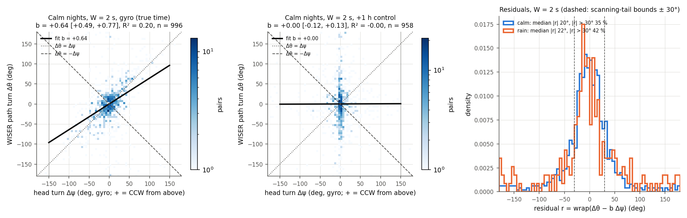
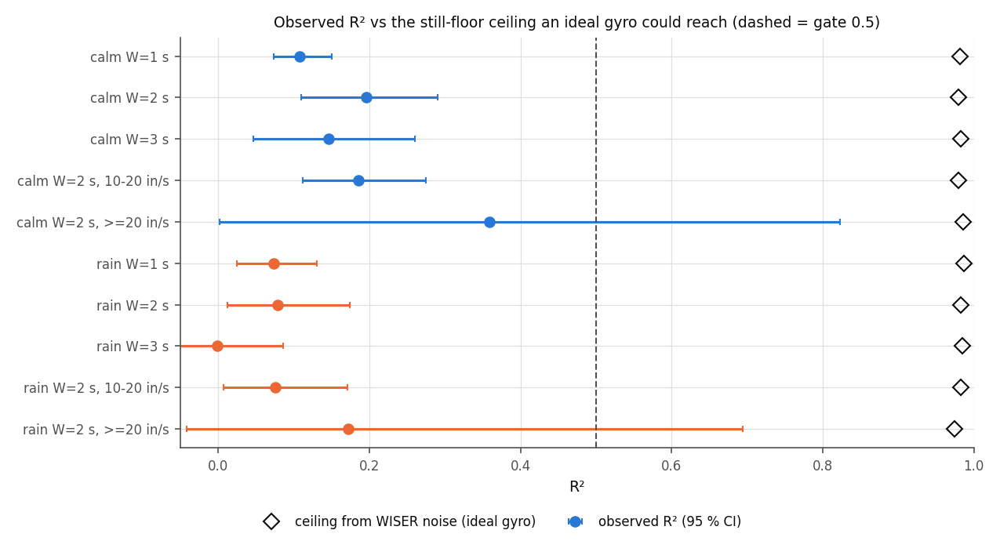
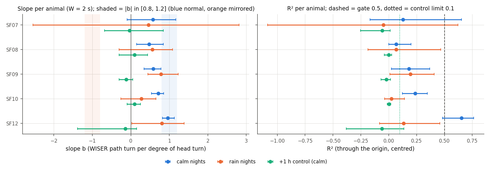
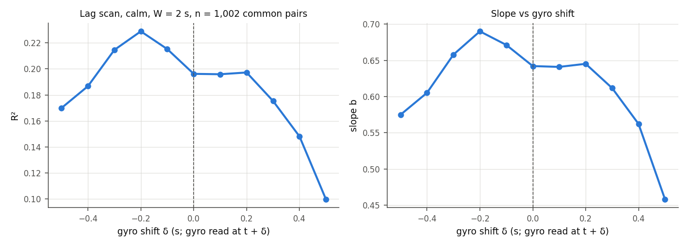

# WISER baseline 2026c — Phase 0 of turn-aided WISER: head gyro turn vs WISER heading change

- **Status:** measurement report, 2026-10-04. Plan `implementation_plan/2026-10-04-imu-turn-vs-wiser-heading.md` (approved by the user 2026-10-04, "做"; committed 5281fc6 before any result; operational details in its Amendment 1, written before any number). Driver `wiser/scripts/analyze_imu_turn_vs_heading.py`, config `wiser/configs/imu_turn_vs_heading_2026c.json` (verdict in `decision`), run `D:\Field2026_analysis_out\2026c\imu_turn_vs_heading_20261004_1010`, git `363df84+dirty`.
- **What this is:** whether the head gyro's *relative* turn (no absolute heading needed) follows the WISER path heading change during locomotion, so that it could aid a smoother (V7). **No behavioural claim.** Frame: WISER native inches, unverified offset origin; only turn *differences* are used, so the frame origin and the IMU-to-WISER heading offset (unobservable, V6) do not enter.
- **Regime context (regime-aware-wiser-tracking):** clean seconds only (≥ 8 anchors, open field, no jumps, ≥ 3 Hz, IMU QC-ok), speed ≥ 10 in/s (locomotion); agreement in the houses, at slow walking and in turns in place is not measured by the fit. Raw-median headings carry WISER jitter (attenuates R², conservative). Rain nights (09-03, 09-09) are reported, not gated.

## Verdict

| Gate quantity (calm 09-05…09-08, W = 2 s, raw-median heading) | value [95 % CI] | rule | met |
|---|---|---|---|
| slope b (through the origin) | +0.642 [+0.485, +0.767] | \|b\| ∈ [0.8, 1.2] | no |
| R² (centred) | 0.196 [0.109, 0.291] | ≥ 0.5 | no |
| +1 h control R² | -0.001 [-0.009, 0.005] (b +0.004) | < 0.1 (else INVALID) | yes |
| pairs in the fit | 996 (291 ten-minute blocks, 20 animal-nights; 9 with \|Δψ\| > 150° excluded) | | |

**FAIL.** Head yaw does not track the WISER path turn closely enough during locomotion (pre-registered rule). Per the plan, head turns stay a head-behaviour signal only; no turn-rate-aided smoother (V7) is built.
Intercept fit (check): b₁ +0.643 [+0.485, +0.768], intercept a₁ -1.60°, R²₁ 0.197 [0.110, 0.292] → the same rule gives **FAIL** (agrees).
Circular correlation ρ_c 0.594 [0.527, 0.650]; turn-sign agreement for 30° ≤ |Δψ| ≤ 150° 82.8 [77.7, 86.9] % (n 355); scanning tail |r| > 30° 34.8 [29.4, 39.4] %; median |r| 19.7 [17.9, 22.0]°, p90 70.7 [61.7, 84.0]°.
WISER-noise ceiling for R² (ideal gyro): 0.980 (σ_d 1.50 in; median per-end σ_θ 5.3°).
**Convention:** b > 0: WISER heading increases counter-clockwise like the gyro (right-handed WISER plan view). Per animal (calm): SF07 + (CI spans 0), SF08 +, SF09 +, SF10 +, SF12 +.

## Reading

- Gate (calm, W = 2 s): b +0.64 [+0.49, +0.77], R² 0.20 [0.11, 0.29] → **FAIL** (slope out of range, R² < 0.5). W = 1 s: b +0.71, R² 0.11; W = 3 s: b +0.50, R² 0.15; rain W = 2 s: b +0.55, R² 0.08.
- +1 h control: b +0.004, R² -0.001 — the pipeline does not manufacture agreement (control valid).
- The plan's noise ceiling (WISER noise as measured on certified-still seconds, σ_d 1.50 in) would allow R² ≈ 0.98; the observed R² is 0.20. **Post hoc (declared, no verdict uses it):** the same kind of pairs with the V3-track heading reach R² 0.49 (median |r| 11.6° vs 19.7°). Still-floor noise could not produce that gain, so the raw-median heading noise *during locomotion* is well above the still floor and the ceiling is optimistic. Both the raw-median and the V3 heading also fall short in slope (b +0.64 / +0.72), and noise in Δθ does not bias b. The shortfall is consistent with part of the head-turn variance not being path turn (scanning, head–body decoupling, the head leading the path; see the lag scan). The window kernels also differ (θ: displacement between two 1-s medians; ψ̄: 1-s mean).
- Sign per animal (calm): b > 0 on 5/5 animals, CI excluding 0 on 4/5; turn-sign agreement under the pooled convention has its CI above 50 % on 5/5 animals. All agree with the pooled convention (b > 0: WISER heading increases counter-clockwise like the gyro (right-handed WISER plan view)). This answers the per-animal handedness question V6 left open (SF07 'mirrored' on a noise-level LLR): one relation for all animals, the normal (right-handed) one, given make_imu's gyro sign convention.
- Turn-sign agreement for clear head turns (30–150°): 82.8 % (chance 50 %); scanning tail |r| > 30°: 34.8 % of pairs.
- Turns in place that WISER misses (gyro ≥ 90° in 3 s, every available u1 < 5.26 in/s): calm 27.4 per IMU-ok hour (open field 35.6, house 18.6), rain 20.1; 14 % of the calm turn events with WISER coverage happen without WISER speed above its noise floor.
- Lag scan: R² peaks at δ = -0.2 s (R² 0.229 vs 0.196 at 0; τ* applied). The gyro read earlier matches better, i.e. the WISER path turn lags the head turn. τ* was fitted on speed, so this is either a heading-specific lag such as the head turning before the body, or a residual clock offset (not separable here). It is reported, not acted on; even at the peak the gate is not met.
- V3-track heading (calm, W = 2 s; reported, not gated): b +0.72 [+0.58, +0.83], R² 0.49 [0.30, 0.66], sign agreement 89.6 % → the gate's bars would not be met with it either (|b| < 0.8, R² < 0.5).
- Per animal (calm, reported only; the pooled gate decides): the bars are met by SF12 (b +0.96, R² 0.65, 61 pairs); not by the other 4.
- Consequence (plan): head turns stay a head-behaviour signal only; V3 remains the default implanted-animal track, B2 the baseline.

Classification (regime-aware-wiser-tracking): a **measurement** result about the head IMU and WISER (no behavioural content). The turns-in-place counts measure what a WISER speed rule cannot see, not a behaviour rate.

## 1. Gate fit and +1 h control

Left: calm W = 2 s pairs (2-D histogram, log colour), the fitted line and the ± identity lines; vertical lines = the ± 150° fit limit. Middle: the same pairs against the gyro read 1 h later. Right: residual distributions (calm and rain) with the ± 30° scanning-tail bounds.

## 2. Separations W = 1, 2, 3 s, calm and rain (raw-median heading)

| set | W (s) | pairs (fit / all) | b [CI] | R² [CI] | b₁ | a₁ (°) | R²₁ | ρ_c | median \|r\| (°) | p90 \|r\| (°) | tail \|r\| > 30° (%) | sign agreement (%) | R² ceiling |
|---|---|---|---|---|---|---|---|---|---|---|---|---|---|
| calm | 1 | 2,142 / 2,143 | +0.714 [+0.602, +0.826] | 0.108 [0.073, 0.150] | +0.713 | -1.21 | 0.108 | 0.493 | 18.0 | 83.4 | 30.9 | 80.0 | 0.982 |
| calm | 2 | 996 / 1,005 | +0.642 [+0.485, +0.767] | 0.196 [0.109, 0.291] | +0.643 | -1.60 | 0.197 | 0.594 | 19.7 | 70.7 | 34.8 | 82.8 | 0.980 |
| calm | 3 | 576 / 580 | +0.505 [+0.300, +0.661] | 0.146 [0.047, 0.260] | +0.508 | -2.15 | 0.147 | 0.566 | 23.8 | 92.9 | 43.1 | 79.1 | 0.983 |
| rain | 1 | 522 / 523 | +0.773 [+0.481, +1.030] | 0.073 [0.025, 0.130] | +0.772 | -1.01 | 0.074 | 0.418 | 24.1 | 155.7 | 43.2 | 83.3 | 0.987 |
| rain | 2 | 227 / 229 | +0.548 [+0.278, +0.763] | 0.078 [0.012, 0.174] | +0.550 | -2.41 | 0.080 | 0.386 | 22.4 | 145.2 | 42.4 | 75.0 | 0.983 |
| rain | 3 | 102 / 103 | -0.033 [-0.454, +0.451] | -0.001 [-0.052, 0.086] | -0.039 | -3.32 | 0.001 | 0.281 | 31.1 | 146.9 | 50.5 | 61.0 | 0.985 |
| all | 1 | 2,664 / 2,666 | +0.725 [+0.616, +0.830] | 0.097 [0.068, 0.130] | +0.725 | -1.17 | 0.098 | 0.478 | 19.0 | 112.6 | 33.2 | 80.6 | 0.983 |
| all | 2 | 1,223 / 1,234 | +0.627 [+0.478, +0.743] | 0.166 [0.096, 0.238] | +0.628 | -1.76 | 0.166 | 0.561 | 20.1 | 80.2 | 36.3 | 81.5 | 0.981 |
| all | 3 | 678 / 683 | +0.424 [+0.247, +0.599] | 0.096 [0.030, 0.197] | +0.426 | -1.87 | 0.097 | 0.525 | 24.7 | 104.1 | 44.9 | 76.4 | 0.983 |

## 3. Per animal (W = 2 s) — the sign of b is the frame handedness per animal

| animal | set | pairs (fit) | b [CI] | sign | R² [CI] | ρ_c | sign agreement (%) | tail \|r\| > 30° (%) | +1 h control b / R² (calm) |
|---|---|---|---|---|---|---|---|---|---|
| SF07 | calm | 83 | +0.573 [-0.097, +1.166] | + (normal), CI spans 0 | 0.127 [-0.167, 0.654] | 0.671 | 82.1 [65.0, 95.5] | 56.5 | -0.038 / -0.059 |
| SF07 | rain | 13 | +0.463 [-2.544, +2.810] | + (normal), CI spans 0 | -0.048 [-1.086, 0.621] | 0.379 | 66.7 [0.0, 100.0] | 53.8 |  |
| SF08 | calm | 145 | +0.475 [+0.147, +0.846] | + (normal) | 0.066 [-0.001, 0.199] | 0.569 | 80.4 [71.1, 89.5] | 44.2 | +0.098 / -0.000 |
| SF08 | rain | 46 | +0.560 [-0.303, +1.081] | + (normal), CI spans 0 | 0.066 [-0.185, 0.465] | 0.585 | 83.3 [50.0, 100.0] | 28.3 |  |
| SF09 | calm | 346 | +0.583 [+0.347, +0.786] | + (normal) | 0.182 [0.023, 0.369] | 0.605 | 88.7 [81.8, 94.7] | 26.0 | -0.121 / -0.020 |
| SF09 | rain | 45 | +0.785 [+0.444, +1.235] | + (normal) | 0.194 [0.012, 0.407] | 0.478 | 68.8 [43.7, 90.9] | 52.2 |  |
| SF10 | calm | 361 | +0.715 [+0.536, +0.851] | + (normal) | 0.237 [0.123, 0.346] | 0.524 | 77.5 [67.5, 85.7] | 36.3 | +0.094 / 0.003 |
| SF10 | rain | 94 | +0.275 [-0.261, +0.652] | + (normal), CI spans 0 | 0.023 [-0.036, 0.140] | 0.235 | 71.4 [52.4, 88.9] | 37.9 |  |
| SF12 | calm | 61 | +0.960 [+0.820, +1.132] | + (normal) | 0.654 [0.483, 0.763] | 0.795 | 92.3 [82.1, 100.0] | 24.6 | -0.140 / -0.061 |
| SF12 | rain | 29 | +0.805 [+0.027, +1.386] | + (normal) | 0.132 [-0.082, 0.459] | 0.499 | 84.6 [57.1, 100.0] | 58.6 |  |

Sign agreement uses the pooled convention σ for every animal, so a mirrored animal would show < 50 %.

## 4. Speed bands (W = 2 s; band = the slower end speed)

| set | heading | band (in/s) | pairs (fit) | b [CI] | R² [CI] | median \|r\| (°) | tail (%) | median σ_θ per end (°) | RMS σ_Δθ (°) | R² ceiling |
|---|---|---|---|---|---|---|---|---|---|---|
| calm | raw | 10-20 | 870 | +0.642 [+0.508, +0.760] | 0.185 [0.112, 0.274] | 22.0 | 37.7 | 5.7 | 8.4 | 0.979 |
| calm | raw | >=20 | 126 | +0.635 [+0.116, +0.943] | 0.359 [0.002, 0.823] | 12.5 | 14.2 | 3.3 | 4.7 | 0.986 |
| calm | v3 | 10-20 | 664 | +0.739 [+0.619, +0.825] | 0.514 [0.344, 0.661] | 12.1 | 14.1 | — | — | — |
| calm | v3 | >=20 | 100 | +0.602 [-0.089, +0.948] | 0.361 [-0.004, 0.913] | 8.7 | 9.0 | — | — | — |
| rain | raw | 10-20 | 194 | +0.546 [+0.239, +0.763] | 0.075 [0.007, 0.171] | 28.9 | 48.5 | 6.6 | 9.5 | 0.983 |
| rain | raw | >=20 | 33 | +0.565 [+0.243, +0.766] | 0.172 [-0.042, 0.694] | 10.0 | 6.1 | 3.6 | 5.1 | 0.975 |
| rain | v3 | 10-20 | 109 | +0.621 [+0.370, +0.862] | 0.389 [0.136, 0.623] | 12.2 | 18.2 | — | — | — |
| rain | v3 | >=20 | 24 | +0.463 [+0.285, +0.691] | 0.496 [0.243, 0.643] | 4.3 | 0.0 | — | — | — |

## 5. V3-track heading instead of raw medians

| set | W (s) | pairs (fit / all) | b [CI] | R² [CI] | b₁ | R²₁ | ρ_c | median \|r\| (°) | tail (%) | sign agreement (%) |
|---|---|---|---|---|---|---|---|---|---|---|
| calm | 1 | 1,950 / 1,951 | +0.512 [+0.458, +0.570] | 0.425 [0.361, 0.488] | +0.512 | 0.425 | 0.638 | 8.4 | 6.4 | 86.3 |
| calm | 2 | 764 / 768 | +0.720 [+0.577, +0.826] | 0.492 [0.299, 0.659] | +0.719 | 0.493 | 0.790 | 11.6 | 13.9 | 89.6 |
| calm | 3 | 417 / 421 | +0.753 [+0.577, +0.902] | 0.508 [0.281, 0.732] | +0.753 | 0.508 | 0.805 | 14.5 | 17.3 | 89.6 |
| rain | 1 | 385 / 386 | +0.459 [+0.350, +0.552] | 0.338 [0.178, 0.472] | +0.460 | 0.345 | 0.552 | 9.0 | 5.2 | 83.1 |
| rain | 2 | 133 / 134 | +0.614 [+0.374, +0.828] | 0.392 [0.166, 0.616] | +0.612 | 0.393 | 0.651 | 10.8 | 15.7 | 88.2 |
| rain | 3 | 53 / 53 | +0.799 [+0.399, +1.097] | 0.498 [0.077, 0.782] | +0.795 | 0.500 | 0.738 | 14.8 | 13.2 | 100.0 |

V3 uses the head IMU (ZUPT in still runs, q × 10 on IMU-locomoting steps) but not the gyro's turn, so it is not circular here; its heading is smoother than the raw medians' (no WISER-noise ceiling is computed for it).

## 6. Turn-sign agreement and the left / straight / right confusion table (gate fit set)

Convention σ = +1 (sign of the pooled calm slope). Rows = gyro (Δψ), columns = WISER (σΔθ); left ≥ 15°, right ≤ −15°, straight otherwise; counts and row shares.

| gyro \ WISER | left | straight | right | n |
|---|---|---|---|---|
| left | 185 (62 %) | 64 (21 %) | 50 (17 %) | 299 |
| straight | 102 (24 %) | 205 (48 %) | 122 (28 %) | 429 |
| right | 34 (13 %) | 57 (21 %) | 177 (66 %) | 268 |

Turn-sign agreement for 30° ≤ |Δψ| ≤ 150° (calm, W = 2 s): 82.8 [77.7, 86.9] % of 355 pairs; rain: 75.0 [64.5, 85.0] %.

## 7. Scanning tail

Share of pairs with |r| > 30° (head turned without the path turning, or the reverse), with the subset's own slope:

| subset | tail (%) [CI] | median \|r\| (°) | p90 \|r\| (°) |
|---|---|---|---|
| calm, W = 1 s | 30.9 [28.1, 33.3] | 18.0 [16.6, 19.3] | 83.4 [70.1, 110.8] |
| calm, W = 2 s | 34.8 [29.4, 39.4] | 19.7 [17.9, 22.0] | 70.7 [61.7, 84.0] |
| calm, W = 3 s | 43.1 [36.9, 48.5] | 23.8 [20.3, 28.4] | 92.9 [73.1, 114.8] |
| rain, W = 1 s | 43.2 [38.7, 49.6] | 24.1 [20.5, 29.6] | 155.7 [133.1, 166.3] |
| rain, W = 2 s | 42.4 [34.4, 52.1] | 22.4 [16.8, 32.0] | 145.2 [89.4, 156.9] |
| rain, W = 3 s | 50.5 [37.1, 63.0] | 31.1 [17.6, 48.0] | 146.9 [99.7, 161.5] |

## 8. What WISER misses: gyro turns ≥ 90° within 3 s while u1 < 5.26 in/s

Coverage rule (Amendment 2): u1 on at least half of the event's seconds; 'missed' = every available u1 below the floor p95.

| set | zone | IMU-ok hours | turn events | missed by WISER | WISER moving | no WISER | events / h | **missed / h** | missed / (missed + moving) |
|---|---|---|---|---|---|---|---|---|---|
| calm | field | 74.5 | 27,946 | 2,650 | 16,694 | 8,602 | 375.3 | **35.6** | 14 % |
| calm | house | 67.1 | 12,086 | 1,248 | 7,181 | 3,657 | 180.0 | **18.6** | 15 % |
| calm | unknown | 0.7 | 53 | 0 | 0 | 53 | 76.8 | **0.0** | — % |
| calm | all | 142.3 | 40,085 | 3,898 | 23,875 | 12,312 | 281.7 | **27.4** | 14 % |
| rain | field | 40.4 | 14,068 | 1,063 | 8,751 | 4,254 | 348.5 | **26.3** | 11 % |
| rain | house | 30.8 | 4,762 | 378 | 2,891 | 1,493 | 154.8 | **12.3** | 12 % |
| rain | unknown | 0.4 | 54 | 0 | 0 | 54 | 129.8 | **0.0** | — % |
| rain | all | 71.5 | 18,884 | 1,441 | 11,642 | 5,801 | 264.0 | **20.1** | 11 % |
| all | field | 114.8 | 42,014 | 3,713 | 25,445 | 12,856 | 365.9 | **32.3** | 13 % |
| all | house | 97.9 | 16,848 | 1,626 | 10,072 | 5,150 | 172.1 | **16.6** | 14 % |
| all | unknown | 1.1 | 107 | 0 | 0 | 107 | 96.7 | **0.0** | — % |
| all | all | 213.8 | 58,969 | 5,339 | 35,517 | 18,113 | 275.8 | **25.0** | 13 % |

**Events are not independent turns.** Event windows last 3.4 s (median; missed events 3.2 s). 52 % of all events start before the previous event's window ends (38 % with the same sign, i.e. one turning bout split by a dip below 90° or a QC-failed sample; the rest are back-and-forth sweeps, which count one event per direction). Among missed events, 29 % overlap the previous missed event. The rates are events per hour under the pre-registered rule, not counts of separate behaviours.

Per animal (all zones):

| animal | set | IMU-ok hours | turn events | missed (field / house) | missed / h |
|---|---|---|---|---|---|
| SF07 | calm | 28.5 | 6,968 | 893 (500 / 393) | 31.3 |
| SF07 | rain | 14.3 | 3,954 | 386 (254 / 132) | 27.0 |
| SF08 | calm | 28.6 | 7,168 | 867 (677 / 190) | 30.3 |
| SF08 | rain | 14.2 | 3,088 | 284 (234 / 50) | 20.0 |
| SF09 | calm | 28.3 | 8,467 | 794 (540 / 254) | 28.1 |
| SF09 | rain | 14.3 | 3,498 | 271 (202 / 69) | 18.9 |
| SF10 | calm | 28.1 | 9,983 | 806 (530 / 276) | 28.7 |
| SF10 | rain | 14.2 | 4,452 | 318 (230 / 88) | 22.4 |
| SF12 | calm | 28.9 | 7,499 | 538 (403 / 135) | 18.6 |
| SF12 | rain | 14.5 | 3,892 | 182 (143 / 39) | 12.6 |

Zone = the median raw fix of the event window (house ROIs + 14 in); denominators: zone of an IMU-ok second = the median raw fix of [s − 1, s + 2) (Amendment 3); 'unknown' = fewer than 3 fixes. The house zone has fewer anchors and more WISER noise, so its u1 crosses 5.26 in/s more often (fewer events can qualify as missed there).

## 9. Lag check (gyro read at t + δ; calm, W = 2 s, one common pair set)

| δ (s) | -0.5 | -0.4 | -0.3 | -0.2 | -0.1 | +0.0 | +0.1 | +0.2 | +0.3 | +0.4 | +0.5 |
|---|---|---|---|---|---|---|---|---|---|---|---|
| R² | 0.170 | 0.187 | 0.215 | 0.229 | 0.215 | 0.196 | 0.196 | 0.197 | 0.175 | 0.148 | 0.100 |
| b | +0.575 | +0.605 | +0.658 | +0.690 | +0.671 | +0.642 | +0.641 | +0.645 | +0.612 | +0.562 | +0.458 |

Peak R² at δ = -0.2 s (n = 1,002 common pairs; τ* already applied to the fix times).

## 10. Expected heading noise (the ceiling an ideal gyro could reach)

| floor source | seconds | p50 \|d\| (in/s) | p95 \|d\| (in/s) | σ_d (in, Rayleigh median) | σ_d (in, RMS) |
|---|---|---|---|---|---|
| 1-s medians at h ± 0.5 on step-B floor seconds, calm nights | 8,099 | 1.77 | 4.90 | 1.50 | 1.80 |
| 1-s medians at h ± 0.5 on step-B floor seconds, rain nights | 2,439 | 1.92 | 5.54 | 1.63 | 2.05 |
| 1-s medians at h ± 0.5 on step-B floor seconds, all nights | 10,538 | 1.81 | 5.04 | 1.54 | 1.86 |
| step B's u1 floor (0.75-s medians, all periods; reference only) | — | 1.90 | 5.26 | 1.61 | — |

Per pair end σ_θ = σ_d / ‖d‖ (at 10 in/s: 8.6°, at 20 in/s: 4.3° calm). The ceilings are in §2 and §4. **Caveat (post hoc, declared):** the floor is measured on a still head; the V3-heading result (§5) shows that the raw-median heading noise during locomotion is larger, so these ceilings are upper bounds under the still-noise model, not the attainable R².

## 11. Data and coverage

| animal | night | set | clean s | IMU-ok s | IMU valid 50 Hz (h) | raw headings | pairs W = 1 / 2 / 3 | floor s | turn events |
|---|---|---|---|---|---|---|---|---|---|
| SF07 | 20260903 | rain | 2,012 | 25,810 | 7.20 | 108 | 16 / 7 / 1 | 210 | 1,740 |
| SF08 | 20260903 | rain | 2,230 | 26,027 | 7.24 | 73 | 9 / 3 / 2 | 502 | 1,095 |
| SF09 | 20260903 | rain | 1,884 | 25,854 | 7.20 | 142 | 22 / 5 / 3 | 390 | 1,338 |
| SF10 | 20260903 | rain | 2,152 | 25,448 | 7.11 | 252 | 58 / 22 / 11 | 232 | 1,797 |
| SF12 | 20260903 | rain | 1,437 | 26,040 | 7.25 | 137 | 26 / 12 / 5 | 436 | 1,613 |
| SF07 | 20260905 | calm | 3,757 | 25,618 | 7.16 | 289 | 52 / 24 / 16 | 216 | 1,840 |
| SF08 | 20260905 | calm | 3,767 | 25,950 | 7.23 | 242 | 45 / 26 / 7 | 347 | 1,539 |
| SF09 | 20260905 | calm | 3,526 | 25,546 | 7.14 | 551 | 165 / 74 / 40 | 682 | 2,171 |
| SF10 | 20260905 | calm | 3,780 | 24,547 | 6.84 | 714 | 227 / 115 / 60 | 353 | 2,129 |
| SF12 | 20260905 | calm | 2,390 | 25,977 | 7.24 | 220 | 66 / 28 / 12 | 687 | 1,610 |
| SF07 | 20260906 | calm | 3,117 | 25,449 | 7.11 | 276 | 55 / 22 / 11 | 691 | 1,507 |
| SF08 | 20260906 | calm | 4,225 | 25,811 | 7.20 | 335 | 88 / 33 / 13 | 764 | 1,580 |
| SF09 | 20260906 | calm | 3,803 | 24,963 | 6.99 | 606 | 222 / 123 / 82 | 388 | 2,166 |
| SF10 | 20260906 | calm | 3,563 | 25,351 | 7.08 | 633 | 180 / 93 / 50 | 468 | 2,466 |
| SF12 | 20260906 | calm | 2,115 | 25,986 | 7.24 | 212 | 49 / 17 / 8 | 456 | 1,855 |
| SF07 | 20260907 | calm | 1,955 | 25,756 | 7.18 | 163 | 34 / 12 / 5 | 357 | 1,680 |
| SF08 | 20260907 | calm | 2,551 | 25,455 | 7.11 | 226 | 56 / 24 / 13 | 182 | 1,817 |
| SF09 | 20260907 | calm | 2,490 | 25,521 | 7.13 | 328 | 102 / 51 / 39 | 327 | 1,763 |
| SF10 | 20260907 | calm | 2,123 | 25,427 | 7.10 | 376 | 119 / 54 / 24 | 357 | 2,429 |
| SF12 | 20260907 | calm | 1,030 | 25,899 | 7.22 | 109 | 25 / 9 / 8 | 98 | 1,860 |
| SF07 | 20260908 | calm | 2,712 | 25,766 | 7.17 | 241 | 59 / 27 / 13 | 278 | 1,941 |
| SF08 | 20260908 | calm | 4,008 | 25,804 | 7.20 | 463 | 141 / 64 / 40 | 339 | 2,232 |
| SF09 | 20260908 | calm | 4,229 | 25,679 | 7.17 | 600 | 213 / 98 / 65 | 439 | 2,367 |
| SF10 | 20260908 | calm | 3,824 | 25,658 | 7.16 | 631 | 222 / 104 / 65 | 226 | 2,959 |
| SF12 | 20260908 | calm | 2,687 | 26,077 | 7.26 | 157 | 23 / 7 / 9 | 444 | 2,174 |
| SF07 | 20260909 | rain | 2,527 | 25,726 | 7.18 | 119 | 24 / 6 / 3 | 106 | 2,214 |
| SF08 | 20260909 | rain | 1,924 | 25,141 | 7.04 | 320 | 94 / 43 / 23 | 22 | 1,993 |
| SF09 | 20260909 | rain | 2,431 | 25,770 | 7.19 | 338 | 83 / 41 / 14 | 228 | 2,160 |
| SF10 | 20260909 | rain | 2,412 | 25,671 | 7.16 | 473 | 164 / 73 / 35 | 230 | 2,655 |
| SF12 | 20260909 | rain | 1,380 | 26,053 | 7.25 | 148 | 27 / 17 / 6 | 83 | 2,279 |

## Definitions

All positions are WISER native **inches** (unverified offset origin; nothing here is placed in the paddock); angles in
degrees; times are field-PC time (WISER fix times shifted by the per-animal clock lag $\tau^*$ of the smoothing pilot).
Symbols: $t_i$, $\mathbf z_i$ = aligned time and raw position of fix $i$; $h$ = a heading centre and $c$ = a pair centre,
both on the 0.5-s grid of whole field-PC seconds from 21:00; $W$ = pair separation (s); $\omega_k$ = make_imu `turn_dps`
of 50-Hz sample $k$ at time $u_k$.

### 1-s position median $\mathbf m(t)$
$$\mathbf m(t)=\operatorname{med}_{\text{coordinate-wise}}\{\mathbf z_i:\ t_i\in[t-0.5,\ t+0.5)\},\qquad\text{defined if}\ \ge 3\ \text{fixes}$$
**Text:** median raw position in a 1-s window (in); smoother-independent.

### WISER heading $\theta(h)$ and 1-s speed $v(h)$
$$\mathbf d(h)=\mathbf m(h+0.5)-\mathbf m(h-0.5),\qquad v(h)=\lVert\mathbf d(h)\rVert/1\ \mathrm s,\qquad \theta(h)=\operatorname{atan2}(d_y,\ d_x)$$
**Text:** direction of travel from the median position of $[h-1,h)$ to that of $[h,h+1)$ (deg, + = from WISER $+x$ toward
$+y$). Defined when $v(h)\ge 10$ in/s and every second overlapping $[h-1,h+1)$ is a step-B clean second. **V3 heading**
$\theta_{V3}$: the same with $\mathbf z_i$ replaced by the V3 track at the fix times.

### Locomotion threshold (10 in/s)
Value **10 in/s** on $v(h)$, from the plan (marked operational): ≈ 5 × the clean-WISER 1-s noise floor p50 (1.90 in/s) and
≈ 2 × its p95 (5.26 in/s), so a heading is not dominated by jitter. Selects locomotion; slow walking is excluded by construction.

### Clean second (step B)
A field-PC second $[s,s+1)$ whose fixes in $[s-1.5,\ s+2.5]$ all have ≥ 8 anchors, are valid and unmasked (handling,
all-tag silences, tag validity, ADC lane), contain no jump (> 30 in within ≤ 0.35 s) and number ≥ 12 (≥ 3 Hz), whose two
u3 medians lie outside the house ROIs + 14 in, and whose IMU second is QC-ok (`analyze_imu_speed_proxy.reference`).

### Gyro heading $\psi$ and its 1-s mean $\bar\psi$
$$\psi(u_k)=\sum_{j\le k}\omega_j\,q_j\,\Delta,\qquad \bar\psi(h)=\frac1{|K_h|}\sum_{k\in K_h}\psi(u_k),\qquad K_h=\{k:\ u_k\in[h-0.5,\ h+0.5)\}$$
$\Delta$ = 0.02 s; $q_j\in\{0,1\}$ = the failure audit's sample QC (finite, not saturated / frozen / invalid / unreliable,
frozen rule, handling ± 5 min, all-tag silences ± 2 min, ADC lane, tag window). **Text:** integrated head turn about
the vertical (deg, + = counter-clockwise seen from above), unwrapped. Only differences enter, so the unobservable
IMU-to-WISER heading offset cancels; the gyro bias drift (≈ 2 °/min) adds ≤ 0.1° over 3 s.

### Pair quantities $\Delta\theta$, $\Delta\psi$
$$\Delta\theta(c,W)=\operatorname{wrap}\!\big(\theta(c+\tfrac W2)-\theta(c-\tfrac W2)\big),\qquad \Delta\psi(c,W)=\bar\psi(c+\tfrac W2)-\bar\psi(c-\tfrac W2),\qquad \operatorname{wrap}(x)=((x+180)\bmod 360)-180$$
**Text:** change of the travel direction (WISER) and of the head yaw (gyro) between two 1-s windows $W$ s apart (deg). A
pair needs both headings defined and every 50-Hz sample of $[c-\frac W2-0.5,\ c+\frac W2+0.5)$ QC-ok with no gap.

### Slope $b$ and $R^2$ (gate fit, through the origin); fit with intercept ($b_1$, $a_1$, $R^2_1$)
$$b=\frac{\sum\Delta\psi\,\Delta\theta}{\sum\Delta\psi^2},\qquad R^2=1-\frac{\sum(\Delta\theta-b\,\Delta\psi)^2}{\sum(\Delta\theta-\overline{\Delta\theta})^2}$$
$$b_1=\frac{\sum(\Delta\psi-\overline{\Delta\psi})(\Delta\theta-\overline{\Delta\theta})}{\sum(\Delta\psi-\overline{\Delta\psi})^2},\qquad a_1=\overline{\Delta\theta}-b_1\overline{\Delta\psi},\qquad R^2_1=\operatorname{corr}(\Delta\psi,\Delta\theta)^2$$
over the pairs with $|\Delta\psi|\le150°$ (wrap ambiguity beyond). **Text:** $b$ = degrees of WISER path turn per degree
of head turn (gyro = regressor, the less noisy one); $b\approx+1$ same sense and scale, $b\approx-1$ mirrored WISER plan
view, $b\approx0$ unrelated. $R^2$ = share of the variance of $\Delta\theta$ explained by $b\,\Delta\psi$ (≤ 1; < 0 possible
for a fit through the origin); $R^2\le R^2_1$ always.

### Residual $r$, median |r|, p90 |r|, scanning tail
$$r=\operatorname{wrap}\!\big(\Delta\theta-b\,\operatorname{wrap}(\Delta\psi)\big),\qquad \text{tail}=\frac{\#\{|r|>30°\}}{\#\{\text{pairs}\}}$$
**Text:** the path turn not explained by the head turn (deg), over all pairs of the subset (incl. $|\Delta\psi|>150°$);
|r| > 30° = the head turned without the path turning (scanning) or the path turned without the head.

### Circular correlation $\rho_c$
$$\rho_c=\frac{\sum\sin(\alpha-\bar\alpha)\sin(\beta-\bar\beta)}{\sqrt{\sum\sin^2(\alpha-\bar\alpha)\,\sum\sin^2(\beta-\bar\beta)}},\qquad \alpha=\Delta\theta,\ \beta=\Delta\psi$$
$\bar\alpha,\bar\beta$ = circular means. **Text:** Jammalamadaka–SenGupta correlation of two angles, range [−1, 1]; a check
independent of the linear fit (fit set).

### Turn-sign agreement $A$ and confusion table
$$A=\frac{\#\{\operatorname{sgn}\Delta\theta=\sigma\operatorname{sgn}\Delta\psi,\ 30°\le|\Delta\psi|\le150°\}}{\#\{30°\le|\Delta\psi|\le150°\}},\qquad \sigma=\operatorname{sgn}b_{\text{calm},W=2}$$
**Text:** share of clear head turns whose path turn has the same sense after the convention set by the pooled slope;
0.5 = chance, 1 = always. Confusion classes (fit set): left $\ge 15°$, right $\le -15°$, straight otherwise — on $\Delta\psi$
for the gyro and on $\sigma\Delta\theta$ for WISER.

### Expected heading noise $\sigma_\theta$ and the $R^2$ ceiling $R^2_{\max}$
$$\sigma_d=\frac{\operatorname{med}\lVert\mathbf d\rVert_{\text{still}}}{\sqrt{2\ln 2}},\qquad \sigma_\theta(h)=\frac{\sigma_d}{\lVert\mathbf d(h)\rVert},\qquad R^2_{\max}=1-\frac{\overline{\sigma_\theta^2(c-\frac W2)+\sigma_\theta^2(c+\frac W2)}}{\operatorname{Var}(\Delta\theta)}$$
$\lVert\mathbf d\rVert_{\text{still}}$ = the same 1-s displacement on step-B floor seconds (certified still by the head IMU,
fixes clean), per set. **Text:** $\sigma_d$ = per-coordinate SD of the displacement noise (in; Rayleigh median), $\sigma_\theta$ =
the heading noise it causes (rad, shown in deg), $R^2_{\max}$ = the $R^2$ a gyro that measured the body heading exactly
could reach given WISER noise alone (fit set). Independent ends assumed (approximate at W = 1, where both headings share
$\mathbf m(c)$). $R^2$ far below $R^2_{\max}$ means the shortfall is head–path mismatch, not WISER noise.

### Speed band
A pair's band = its slower end speed $\min\{v(c-\frac W2),\ v(c+\frac W2)\}$: [10, 20) or ≥ 20 in/s.

### +1 h control
$\Delta\psi_{+1h}(c,W)=\bar\psi(c+\frac W2+3600)-\bar\psi(c-\frac W2+3600)$ with the sample QC at the shifted times,
fitted exactly as $\Delta\psi$. **Text:** keeps the statistics of both signals but breaks their alignment; expected
$b\approx0$, $R^2\approx0$; $R^2_{+1h}\ge 0.1$ declares the analysis invalid (pipeline artefact).

### Lag scan
$\Delta\psi_\delta$ = $\Delta\psi$ with the gyro read at $t+\delta$, $\delta\in\{-0.5,-0.4,\dots,+0.5\}$ s, on one common pair
set (calm, W = 2 s, QC-ok at all shifts); point estimates of $b$ and $R^2$. **Text:** a residual clock lag after $\tau^*$
would move the $R^2$ peak away from 0.

### Turns in place that WISER misses
$$\text{candidate}(t):\ |\psi(t+3)-\psi(t)|\ge 90°\ \text{and}\ [t,t+3)\ \text{QC-ok},\qquad t\in\{t_0,\ t_0+0.1,\ \dots\}$$
$\psi$ linearly interpolated between samples. A turn event = a run of consecutive same-sign candidates; window
$[t_{\text{first}},\ t_{\text{last}}+3]$. WISER coverage = $u_1$ exists on $\ge\lceil n/2\rceil$ of the $n$ seconds
overlapping the window (Amendment 2); with coverage, **missed by WISER** = every available $u_1<5.26$ in/s, "WISER moving" =
some available $u_1\ge5.26$; without coverage, "no WISER". $u_1$ = step B's 1-s speed (0.75-s raw medians at
$s+0.5\pm0.5$); 5.26 in/s = its all-period noise-floor p95. Zone = the median raw fix of the window vs the house ROIs
+ 14 in. Rate = events / IMU-ok hours of the stratum (audit per-second `ok`; zone of a second = the median raw fix of
$[s-1,\ s+2)$, the shortest event window, Amendment 3; 'unknown' with < 3 fixes).
**Text:** head turns ≥ 90° within 3 s during which a WISER speed rule would call the animal stationary (events per hour).

### Bootstrap CI
Blocks = 10 min from 21:00 per (animal, night); 1000 resamples of the blocks with replacement (seed 20261004); every
statistic is recomputed per resample (residual quantiles with the resample's $b$); CI = 2.5–97.5 %. Point estimates
decide; CIs are reported.

### Gate (pre-registered)
Calm nights (09-05 … 09-08), W = 2 s, raw-median heading, fit through the origin: $|b|\in[0.8,\ 1.2]$ and $R^2\ge0.5$ →
**PASS** (head yaw is a usable body-turn signal during locomotion), otherwise **FAIL**; $R^2_{+1h}\ge0.1$ → **INVALID**.
Values from the plan, fixed before any result: a unit gain within ± 20 % and at least half of the path-turn variance explained.

## Amendments and decisions

- **Amendment 1 (before any number):** operational resolutions in the plan (scope; grid; clean-second support of a heading; sample-level IMU QC over the pair span; the gate uses the through-origin fit with a centred R², the intercept fit beside it; residual statistics over all pairs with wrapped Δψ; sign agreement over 30–150° with the pooled convention; bootstrap; speed band by the slower end; σ_d from the plan's own estimator on floor seconds; +1 h control from t + 3600 s; lag scan on one common pair set; turns-in-place event rule; V3 heading; point estimates decide).
- **Amendment 2 (after a single-job smoke test, before any pooled number):** step B's u1 is missing on ~35 % of seconds (< 3 fixes in 0.75 s), so 'no WISER' if any second lacks u1 left the turns-in-place quantity nearly uncountable; an event now needs u1 on at least half of its seconds, and 'missed' = every available u1 < 5.26 in/s.
- **Amendment 3 (after the pooled results of the first full run `imu_turn_vs_heading_20261004_1007`; no gate quantity changes):** (i) times in the bulk CSVs are stored as integer ms (they had been rounded to 5–6 significant digits; nothing computed changed); (ii) the zone of an IMU-ok second in the turns-in-place denominators is the median raw fix of [s − 1, s + 2) instead of [s, s + 1), matching the shortest event window (first-run calm missed/h: field 46.1, house 24.3, all 27.4; rain all 20.1); (iii) the declared post-hoc caveat on the noise ceiling (§10).

## Caveats

- Clean seconds are open-field and ≥ 8 anchors: agreement in the houses is not measured; slow walking (< 10 in/s) is excluded by construction.
- The gyro measures the **head**; head yaw includes scanning, and the 1-s mean removes only part of it. The tag is on the head, so WISER's path is the head's path too; the comparison is between the head's travel direction and its yaw.
- The gyro sign convention (+ = counter-clockwise from above) rests on make_imu's assumption about the undocumented CE64 IMU chip (right-hand-rule rates on the accelerometer axes; calibration pilot §M4). A sign of b therefore fixes the *relation* between WISER and the gyro; absolute left/right needs one video event with a known turn direction.
- The M4 test of the calibration pilot (Spearman ρ 0.17–0.32) used 2-s windows of 1-s medians without the clean-second filter and the 10-in/s heading rule; it is not the same estimator and is not superseded by this step.

## Outputs and rerun

- Bulk `D:\Field2026_analysis_out\2026c\imu_turn_vs_heading_20261004_1010`: `tables/` (pairs.csv.gz = every pair with Δθ raw / V3, Δψ, +1 h and lag-shifted Δψ; fits.csv; bootstrap_ci.csv; sign_agreement.csv; confusion_gate.csv; lag_scan.csv; in_place_turns.csv.gz (every event), in_place_rates*.csv, imu_ok_seconds_by_zone.csv; floor_displacements.csv.gz, heading_noise_floor.csv; periods_info.csv), `summary.json`, `input_provenance.json`, `log.txt`, `figures/`.
- Pointer `results/2026c/wiser_baseline/reports/run_manifest_imu_turn_vs_heading_2026c.json`; config `decision` block.
- Rerun: `python wiser/scripts/analyze_imu_turn_vs_heading.py --cohort 2026c --workers 6`; re-aggregate: `python wiser/scripts/analyze_imu_turn_vs_heading.py --report-only <run_dir>`; self-test: `python wiser/scripts/analyze_imu_turn_vs_heading.py --selftest`.
