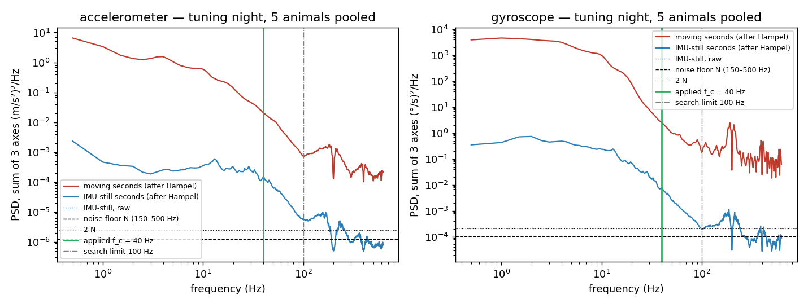
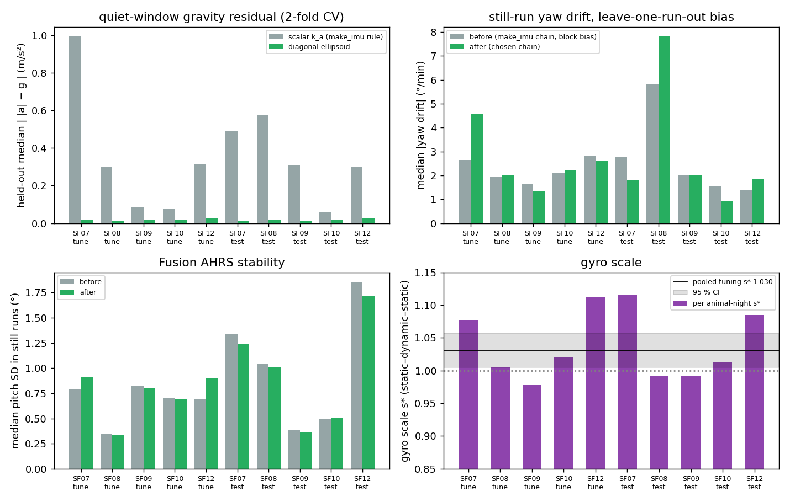
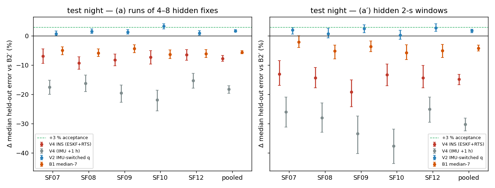
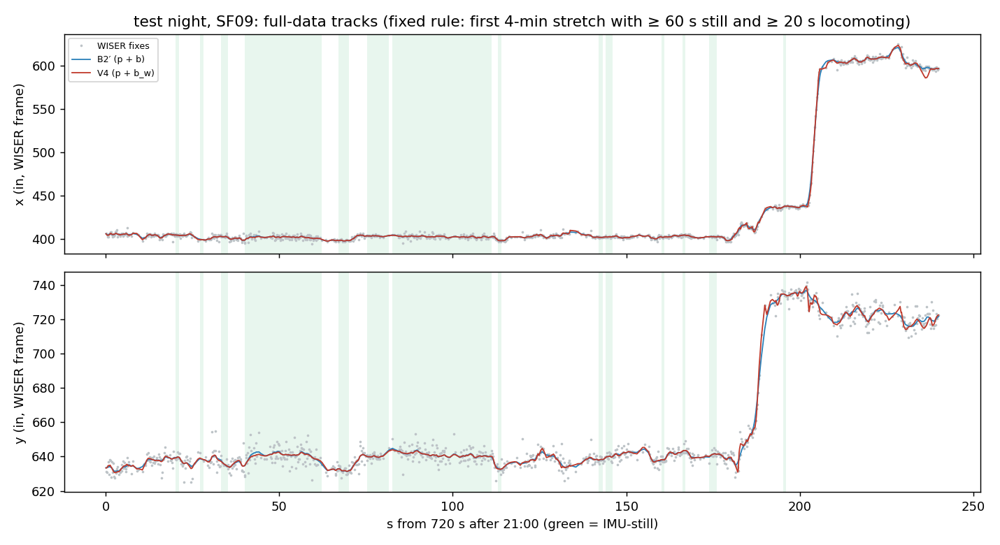
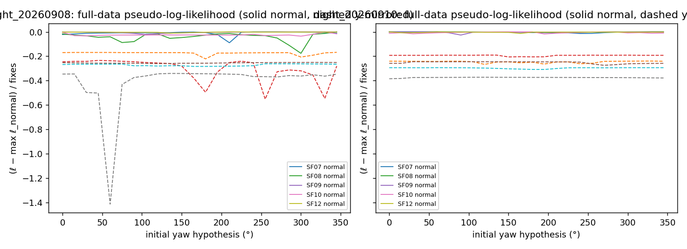

# Head-IMU inertial fusion with WISER (V4) — `wiser_baseline` (2026c)

- **What this is:** a *measurement* report. Question: does a 6-axis inertial fusion of the head IMU (same rigid headstage as the WISER tag; user, 2026-09-29) with WISER fixes — an error-state Kalman filter driven by the accelerometer and gyroscope, corrected by WISER, + RTS smoother — predict held-out WISER fixes better than the best position-only smoother B2′? First, the IMU processing itself is measured and improved (user: "if the IMU processing is poor it cannot improve WISER"). **No behavioural claim.**
- **Nights:** tuning 2026-09-08 21:00:00 → 2026-09-09 04:20:00 (every choice made here); test 2026-09-10 21:00:00 → 2026-09-11 04:20:00 (named in the smoothing pilot's plan). Field-PC local time (EDT).
- **Animals and tags (shortid):** SF07 = 12409, SF08 = 12386, SF09 = 12407, SF10 = 12395, SF12 = 12377.
- **Frame status:** WISER native inches, unverified offset origin; the handedness test below concerns only the mirror sense of the WISER axes relative to the IMU; nothing places a position in the paddock.
- **Plan:** [`implementation_plan/2026-09-29-wiser-ins-fusion.md`](../../../../implementation_plan/2026-09-29-wiser-ins-fusion.md) (approved by the user 2026-09-29; amendments of 2026-09-30 fixed on the tuning night before the full run — §3, §9).
- **Run:** `python wiser/scripts/build_imu_wiser_cache.py --cohort 2026c` (Phase A) then `python wiser/scripts/analyze_wiser_ins_fusion.py --cohort 2026c` (Phases B–C); bulk `D:\Field2026_analysis_out\2026c\wiser_ins_fusion_20260930_0016`; pointer `run_manifest_ins_fusion_2026c.json`. Git `d051fa8+dirty`; runtime Phases B–C 25.3 min (Phase A 2.5 min); numba True.

## 0. Verdicts

| Method | scheme | animals with Δ ≥ 3 % & CI > 0 | +1 h control: no gain | pooled Δ on moving fixes | **Verdict** |
|---|---|---|---|---|---|
| V4 INS | (a) | 0/5 | 5/5 | -9.1 % | FAIL |
| V4 INS | (a′) | 0/5 | 5/5 | -17.6 % | FAIL |

**Overall V4 verdict (pre-registered acceptance): FAIL.**

Pooled test-night held-out error (in), hidden fixes with ≥ 7 anchors, Δ vs B2′ (95 % block-bootstrap CI):

| Method | (a) median | (a) RMSE | (a) Δ median vs B2′ | (a′) median | (a′) RMSE | (a′) Δ median vs B2′ |
|---|---|---|---|---|---|---|
| B1 median-7 | 4.15 | 7.65 | -5.6 % [-6.1 %, -5.0 %] | 4.37 | 9.29 | -4.1 % [-5.1 %, -3.2 %] |
| B2 robust CV | 3.97 | 6.51 | -1.0 % [-1.2 %, -0.7 %] | 4.22 | 7.31 | -0.6 % [-1.0 %, -0.3 %] |
| B2′ + drift | 3.93 | 6.46 | (reference) | 4.19 | 7.26 | (reference) |
| V1 ZUPT | 3.91 | 6.44 | +0.5 % [+0.4 %, +0.7 %] | 4.17 | 7.25 | +0.6 % [+0.4 %, +0.9 %] |
| V2 IMU-switched q | 3.86 | 6.23 | +1.7 % [+1.3 %, +2.1 %] | 4.12 | 6.99 | +1.8 % [+1.1 %, +2.3 %] |
| V4 INS (ESKF+RTS) | 4.23 | 61.47 | -7.7 % [-8.6 %, -6.7 %] | 4.82 | 56.50 | -14.8 % [-16.6 %, -13.1 %] |
| V4 (IMU +1 h) | 4.65 | 53.80 | -18.2 % [-19.5 %, -17.0 %] | 5.46 | 85.26 | -30.2 % [-32.4 %, -28.0 %] |

Reproduction check: B1/B2/B2′/V1/V2 pooled (a) medians match the smoothing pilot's bulk summary (B1 4.149, B2 3.969, B2p 3.929, V1 3.909, V2 3.862; largest difference 1.1e-05 in — floating-point order in the parallel smoother — and identical scored counts), i.e. the same tracks, hidden sets and scored set.

**Reading.**

1. **IMU processing improved where it matters for inertial navigation.** Accelerometer: the diagonal ellipsoid lowers the held-out quiet-window gravity residual from 0.299 to 0.016 m/s² (tuning-night medians; 5/5 animals better → ellipsoid); fitted offsets reach 1.31 m/s² (≈ 7.6° of tilt), which a scalar k_a cannot remove. Gyro: bias rule = running (LOO still-run drift 2.33 → 2.26 °/min, block → running); scale s* = 1.030 [1.005, 1.058] from 52 static–dynamic–static pairs → applied. Low-pass: head-motion power stays above 2× the noise floor up to the 100-Hz search limit for both sensors, so the rule lands on the 40-Hz clip (f_c acc 40 Hz, gyro 40 Hz); single-sample spikes are rare. Details §2.
2. **V4 vs B2′ on the test night:** pooled Δ -7.7 % [-8.6 %, -6.7 %] on (a) and -14.8 % [-16.6 %, -13.1 %] on (a′). By IMU state (a): still +2.8 % [+1.7 %, +3.8 %], moving -9.1 % [-10.1 %, -8.0 %], locomoting +1.2 % [-0.6 %, +3.1 %]. Animals passing the per-animal bar: (a) 0/5, (a′) 0/5.
3. **+1 h control:** pooled Δ -18.2 % [-19.5 %, -17.0 %] (a), -30.2 % [-32.4 %, -28.0 %] (a′); control no-gain in 5/5 and 5/5 animals. The aligned IMU is better than the shifted one everywhere, so the IMU carries head-motion information — but not enough, integrated this way, to beat B2′.
4. **Where V4 fails — in-place head movement and divergence tails.** 'Moving' = active (IMU-moving, not locomoting: grooming, rearing, head scanning in place) + locomoting. V4 ties B2′ while locomoting and loses while active (table §4b). Its errors are heavy-tailed: 0.86 % of scored hidden fixes are off by > 100 in (B2′ 0.004 %; V4 max 2,404 in), hence RMSE 61.5 vs 6.5 in. These are inertial divergences inside hidden runs — attitude lost during violent head motion (the tilt-reset guard fired 155–275 times per night) turning gravity into a spurious horizontal acceleration that no fix corrects until the run ends. The filter is also overconfident (NIS ≈ 15, §6).
5. **Handedness (reported, not used to choose the frame):** LLR normal − mirrored > 0 in 5/5 animals on the test night (median 25602 nats, 0.245 per fix) and 5/5 on the tuning night (median 25990): the IMU-driven filter explains the WISER track better in the WISER frame as given than in its mirror image on every animal-night, i.e. the evidence favours a right-handed WISER frame (x, y, z-up) — the same sign as the calibration pilot's M4 (rho > 0 on all five), now with a likelihood ratio instead of a turn correlation. Null check (post hoc, declared): with the +1 h-shifted IMU the same LLR is 5/10 positive, per fix -0.014 … 0.097 (median -0.001) against 0.168 … 0.373 with the aligned IMU. Caveat: V4 is not a consistent model of these data (NIS ≈ 15), so the LLR is evidence from a misspecified filter; it stays a measurement result until one video event confirms the turn sense.
6. **Consistency:** test-night NIS mean 15.39 (median over animals; χ²₂ expects 2) and 54.8 % of fixes above 5.99 (expects 5 %); held-out z² mean (a) 250.71. The filter is overconfident (innovations larger than its own covariance predicts).

Classification (regime-aware-wiser-tracking): every result here is a **measurement** result. The held-out target is a WISER fix (head position + WISER's slow drift + white noise), so a gain means better prediction of WISER — necessary, not sufficient, for better head position.

## 1. Data, caches and what they hold

| Night | Animal | fixes in window | IMU samples (100 Hz) | IMU-still samples | saturated samples | IMU start (s after 21:00) |
|---|---|---|---|---|---|---|
| tuning | SF07 | 103,339 | 2,652,059 | 394,010 | 1,871 | -60.0 |
| tuning | SF08 | 103,350 | 2,652,054 | 206,205 | 3,023 | -60.0 |
| tuning | SF09 | 103,612 | 2,652,070 | 437,713 | 3,423 | -60.0 |
| tuning | SF10 | 103,864 | 2,652,062 | 356,309 | 3,929 | -60.0 |
| tuning | SF12 | 104,813 | 2,652,054 | 321,108 | 1,000 | -60.0 |
| test | SF07 | 104,163 | 2,652,062 | 354,410 | 1,685 | -60.0 |
| test | SF08 | 103,959 | 2,629,406 | 232,804 | 2,994 | 166.5 |
| test | SF09 | 104,546 | 2,652,069 | 526,815 | 1,569 | -60.0 |
| test | SF10 | 104,888 | 2,652,064 | 307,806 | 2,855 | -60.0 |
| test | SF12 | 105,524 | 2,614,111 | 322,007 | 2,022 | 319.5 |

Hidden fixes with no V4 prediction (before the IMU start: SF08/SF12 test night) filled with B2′: {'tuning': 0, 'test': 570}; they are not scored (IMU not QC-ok).

**Caches (built once; any later analysis can start from them without reading raw data):**

| Cache | Path | One file = | Content | Size |
|---|---|---|---|---|
| A1 raw IMU | `D:\Field2026_analysis_out\2026c\imu_raw_cache\<SFxx>\<session>__<start>_<end>.npz` (+ `index_2026c.csv`) | animal-night, 20:50 → 05:30 (clipped to the session) | `six` int16 (n, 6) raw analogin lanes 1–6 (acc x/y/z, gyro x/y/z, **sensor frame**, counts) at 1250 Hz; `k0` first frame in the session, `amp0` = 16 k0; `sat` bool (n, 6) per lane (\|raw\| ≥ 32700); `frozen` bool (n) (all six lanes repeat ≥ 0.5 s); `fit_json` the verbatim `pc_time_fit.json`; `meta_json` (animal, MAC, session dir, start_local, windows, sha256 of the first 64 MiB of `analogin.dat`, size, mtime, git). Time of frame j: `build_imu_wiser_cache.cache_unix_ms()` = local midnight + `make_imu.pc_time_ms(amp0 + 16 j, fit)` | 10 files, 701 MB |
| A2 WISER | `D:\Field2026_analysis_out\2026c\wiser_fix_cache\night_<YYYYMMDD>\<SFxx>.csv.gz` (+ `index_2026c.csv`) | animal-night, night ± 10 min | deduplicated fixes (max anchors, then min reportid): reportid, shortid, t_ms (Unix ms, field-PC clock), x, y (in), anchors_used, anchors_list, n_list, dup_n, library `valid`, `speed_inps_smooth`, masks m_handling, m_silence (± 2 min), m_tag_validity, m_adc_lane (own logger) | 10 files, 39 MB |
| A3 100-Hz IMU | `D:\Field2026_analysis_out\2026c\imu100_cache\<SFxx>\night_<YYYYMMDD>.npz` | animal-night, same window as A1 | `t_unix_ms` (IMU clock, τ* **not** applied); `acc` float32 (n, 3) m/s² and `gyr` float32 (n, 3) °/s in the **head frame** (Hampel → 40-Hz zero-phase Butterworth-4 → resample_poly 2/25; ellipsoid accelerometer calibration; gyro bias (running) removed, scale 1.030); flags `sat_acc`, `sat_gyr` (dilated), `frozen`, `spikes` (uint8, Hampel replacements in the sample's support), `quiet`; `calib_json` (all parameters incl. 1-min bias nodes), `meta_json` | 10 files, 791 MB |
| C fusion | `D:\Field2026_analysis_out\2026c\wiser_ins_fusion_20260930_0016\fusion\night_<YYYYMMDD>\<SFxx>\v4_full.npz`, `v4_heldout.npz`; `persecond\`; `csv\` | animal-night | full-data V4 at every fix: smoothed `p`, `v`, `bw`, `zhat`, predictive `var`, attitude `q` (w, x, y, z), `ba`, `bg`, forward innovations `nu`, `S` (xx, xy, yy), `nis` (pass 0), IRLS weights `w`, `ll`, `yaw0`, parameter vector `par`; held-out: hidden masks (a)/(a′) + V4 and V4 +1 h predictions and variances + chosen yaws; per-second IMU tables (true and +1 h); `csv/yaw_hypotheses.csv` (every hypothesis ℓ, normal + mirrored), `heldout_errors_*.csv.gz` (every method, every scored fix), `bootstrap_comparisons_*.csv`, `imu_quality.csv`, `imu_saturation_lanes.csv`, `imu_spikes_lanes.csv`, `nis_consistency.csv`, `handedness.csv`, `plausibility_test.csv`, `tuning_grid_stage*.csv`; `phase_b\psd_*.npz` | 60 files, 311 MB |

## Definitions

Units: WISER positions in **inches** in the WISER native frame (unverified offset origin, no georeference); IMU
acceleration m/s² (filter: in/s², 1 m = 39.37 in), angular rate °/s (filter: rad/s). Times: field-PC clock (WISER
`timestamp`; IMU Unix ms from `pc_time_fit.json`). Head frame H: x nose, y left, z up (`make_imu.S`); world frame N:
x, y = the WISER axes, z up (right-handed if WISER is; tested by the mirrored run). $g$ = 9.81 m/s². Symbols: $k$ = IMU
sample (100 Hz after Phase B), $j$ = WISER fix, $A_j$ = `anchors_used`, $\mathbf z_j$ = fix (in), $s$ = second.
Definitions reused unchanged from the smoothing pilot (duplicate rule, aligned time $t^{al}=t-\tau^*$, IMU-still second,
QC mask, locomotion class, per-anchor noise $\sigma_{ax}(A)$, B1/B2/B2′/V1/V2, held-out schemes (a)/(a′), scored set,
$\Delta$, block bootstrap, acceptance logic) are restated briefly here; the full text is in the pilot report.

### Phase B — IMU quality and smoothing

**Hampel spike filter** (per lane, 1250 Hz, raw counts $x$): with $m_i=\mathrm{med}(x_{i-3..i+3})$,
$\mathrm{MAD}_i=\mathrm{med}|x_{i-3..i+3}-m_i|$, $\sigma_\ell=\max(2,\ 1.4826\,\mathrm{med}_i|x_{i+1}-x_i|/\sqrt2)$,
$$ x_i\leftarrow m_i\quad\text{if}\quad |x_i-m_i|>6\,\max(1.4826\,\mathrm{MAD}_i,\ \sigma_\ell),\ \text{sample not saturated.} $$
**Text:** replaces isolated samples that jump more than 6 local robust SDs (floored at the lane's global noise SD, so
pure noise is not flagged); counts reported per hour of still / moving time.

**PSD and noise floor.** One-sided Welch-type PSD $P(f)=\frac{2}{f_s\sum w^2}\langle|\mathrm{FFT}(w\cdot x)|^2\rangle$ over
2-s Hann segments ($f_s$ = 1250 Hz, 0.5-Hz bins) lying entirely in IMU-still (resp. QC-ok moving) seconds, ≤ 4000
segments per class; summed over the 3 axes of a sensor. Noise floor $N=\mathrm{med}_{150\le f\le500\,\mathrm{Hz}}P_{still}(f)$.
**Text:** the sensor's high-band white level ((m/s²)²/Hz or (°/s)²/Hz).

**Low-pass cutoff** $f_c=\mathrm{clip}\big(\min\{f\ge5:\ \tilde P_{mov}(f')\le2N\ \forall f'\in[f,100]\},\ 5,\ 40\big)$ Hz,
$\tilde P$ = 2-Hz moving average. **Text:** where head-motion power meets the noise floor (tuning night, animals pooled);
40 Hz keeps the 100-Hz output alias-free. Filter: 4th-order Butterworth, zero phase, then `resample_poly(2, 25)`.

**Saturation flag at 100 Hz:** sample $k$ is `sat_acc` (`sat_gyr`) if any raw frame in $[12.5k-6,\,12.5k+6]$ of an acc
(gyro) lane has $|x|\ge32700$, dilated by $\lceil 2/f_c\cdot100\rceil$ samples (the filter's support). Never interpolated.

**Quasi-static window** (0.5 s at 100 Hz): median $|\boldsymbol\omega|<10$ °/s and every per-axis acc SD < 0.15 m/s²,
no flagged sample; $\bar{\mathbf a}_w$ = its mean acceleration.

**Accelerometer calibration.** Scalar: $k_a=g/\mathrm{med}_w|\bar{\mathbf a}_w|$. Ellipsoid: $\mathbf a_{cal}=D(\mathbf a-\mathbf o)$,
$D=\mathrm{diag}(d_1,d_2,d_3)$,
$$ (\hat D,\hat{\mathbf o})=\arg\min\ \sum_w\rho_H\!\Big(\tfrac{|D(\bar{\mathbf a}_w-\mathbf o)|-g}{0.1}\Big)+\sum_i\Big(\tfrac{d_i-1}{0.05}\Big)^2+\sum_i\Big(\tfrac{o_i}{0.5}\Big)^2 $$
($\rho_H$ = Huber loss, scale 1). **Held-out gravity residual** $=\mathrm{med}_{w\in\text{test fold}}\big||\mathbf a_{cal}(\bar{\mathbf a}_w)|-g\big|$
(m/s²), 2 folds = alternating 10-min blocks. **Orientation coverage** = eigenvalues of $\mathrm{Cov}(\bar{\mathbf a}_w/|\bar{\mathbf a}_w|)$.
**Text:** how far the calibrated |a| of a head at rest is from g on windows not used to fit (0 = perfect); the ellipsoid
adds per-axis offsets/scales; the priors keep poorly excited axes near identity.

**Gyro bias.** Quiet 1-s windows (make_imu: median $|\boldsymbol\omega|<10$ °/s and $|k_a\,\mathrm{med}|\mathbf a|-g|<0.05g$) give
per-window medians $\mathbf b_s$. *Block* (make_imu): median of $\mathbf b_s$ per 10-min block (≥ 30 windows) at block centres,
linear interpolation. *Running*: median of $\mathbf b_s$ within ±300 s (≥ 20 windows, else ±900 s, else all), linear
interpolation. **Leave-one-run-out yaw drift** of a still run $R$ (≥ 60 s):
$$ \dot\psi_R=\frac{1}{T_R}\Big|\sum_{k\in R}(\boldsymbol\omega_k-\hat{\mathbf b}_{-R})\cdot\hat{\mathbf u}_R\,\Delta t\Big| $$
$\hat{\mathbf b}_{-R}$ = bias at the run midpoint estimated without the run's windows (running: median within ±300 s of the
midpoint), $\hat{\mathbf u}_R$ = the run's mean gravity direction. **Text:** apparent yaw rotation (°/s, reported °/min)
of a head that does not move — the residual bias error an honest (held-out) bias estimate leaves.

**Gyro scale (static–dynamic–static).** Pairs of consecutive quasi-static intervals (≥ 0.5 s, centred 0.5-s windows),
0.2–3 s apart, tilt change ≥ 20°; $\mathbf u_1,\mathbf u_2$ = mean gravity directions of the last / first 0.5 s;
$$ e_p(s)=\angle\big(R_{12}(s)^\top\mathbf u_1,\ \mathbf u_2\big),\quad R_{12}(s)=\prod_k\mathrm{Exp}(s\,\boldsymbol\omega_k\Delta t),\qquad s^*=\arg\min_{s\in[0.8,1.4]}\sum_p e_p(s)^2 $$
95 % CI: 1000 bootstrap resamples of pairs. **Rule:** apply $s^*$ if the CI excludes 1 and $|s^*-1|>2\,\%$.
**Text:** the gyro gain that best predicts how gravity turned between two rests; immune to linear acceleration (endpoints
static), blind to rotation about the vertical.

**Kinematic consistency.** With 5-Hz low-passed signals, $\mathbf u=\mathbf a/|\mathbf a|$:
$\dot{\mathbf u}=\mathbf u\times\boldsymbol\omega$ for a pure rotation. Slope $b=\sum\mathbf x\cdot\mathbf y/\sum|\mathbf x|^2$ and
Pearson $r$ of $\mathbf y=\dot{\mathbf u}$ on $\mathbf x=\mathbf u\times\boldsymbol\omega$ (components stacked), samples with
20 ≤ |ω| ≤ 300 °/s, $||\mathbf a|-g|<0.1g$, ≥ 0.2 s from a flagged sample, night window. **Acc–gyro latency** = the lag
$\ell$ (10-ms steps, parabolic peak) maximising $r$ of $\dot{\mathbf u}(t)$ vs $\mathbf u(t)\times\boldsymbol\omega(t+\ell)$ (+ = gyro
lags). **Text:** $r$ near 1 and $b$ near 1 when acc and gyro agree; linear acceleration of the head inflates $b$, so it is
a secondary check only.

**Still-period noise:** $\sigma_\omega$ ($\sigma_f$) = RMS of the 100-Hz gyro (acc) about its per-second mean inside
IMU-still seconds (tuning night, median over animals; floors 0.5 °/s, 0.05 m/s²). **Gyro still noise density**
$\sigma_{g,still}=\sqrt{N_{gyr}/(3\cdot2)}$ (rad/s/√Hz), $N_{gyr}$ = the gyro noise floor.

**Angular acceleration:** $|\dot{\boldsymbol\omega}|$ by central differences at 100 Hz on QC-ok moving, unflagged samples;
percentiles (°/s²). **Fusion stability** (make_imu `fuse`, unchanged): median over still runs ≥ 60 s of the pitch SD
(°); share of samples in Fusion recovery; median angle between Fusion's gravity and the quasi-static acc direction.

### Phase C — V4 error-state Kalman filter + RTS smoother

**Nominal state** $\mathbf p\in\mathbb R^2$ (in), $\mathbf v\in\mathbb R^2$ (in/s), $q$ (head→world), $\mathbf b_a$ (in/s², head),
$\mathbf b_g$ (rad/s, head), $\mathbf b_w\in\mathbb R^2$ (in, WISER drift). **Propagation** per IMU sample ($\Delta t$ ≈ 0.01 s):
$$ \mathbf f=R(q)(\mathbf a_k-\mathbf b_a),\quad \mathbf p\leftarrow\mathbf p+\mathbf v\Delta t+\tfrac12\mathbf f_{xy}\Delta t^2,\quad \mathbf v\leftarrow\mathbf v+\mathbf f_{xy}\Delta t,\quad q\leftarrow q\otimes\mathrm{Exp}((\boldsymbol\omega_k-\mathbf b_g)\Delta t),\quad \mathbf b_w\leftarrow e^{-\Delta t/T_b}\mathbf b_w $$
(the vertical channel is discarded: z fixed; lever arm IMU↔tag ignored). **Error state** $\delta\mathbf x=(\delta\mathbf p,\delta\mathbf v,\delta\boldsymbol\theta,\delta\mathbf b_a,\delta\mathbf b_g,\delta\mathbf b_w)$
(15), global attitude error $R_{true}=\mathrm{Exp}(\delta\boldsymbol\theta)R$:
$\dot{\delta\mathbf v}=-([\mathbf f]_\times\delta\boldsymbol\theta)_{xy}-(R\,\delta\mathbf b_a)_{xy}$, $\dot{\delta\boldsymbol\theta}=-R\,\delta\mathbf b_g$;
$\Phi=I+F\Delta+F^2\Delta^2/2+F^3\Delta^3/6$ (Δ = 0.02 s and every epoch). Process noise: velocity $\sigma_a^2\Delta$
(position/velocity blocks $\sigma_a^2[\Delta^3/3,\Delta^2/2;\Delta^2/2,\Delta]$), attitude $\sigma_g^2\Delta$ ($\sigma_{g,still}^2\Delta$ in IMU-still
samples), $\sigma_{ba}^2\Delta$, $\sigma_{bg}^2\Delta$, drift $\sigma_b^2(1-e^{-2\Delta/T_b})$; saturated samples $\sigma_{a,sat}$ = 20 m/s²/√Hz,
$\sigma_{g,sat}$ = 1 rad/s/√Hz.

**Updates** (Kalman, error injected and reset after each): (i) **WISER** fix at $t^{al}_j$: $\mathbf z_j=\mathbf p+\mathbf b_w+\boldsymbol\varepsilon$,
$R_j=\mathrm{diag}(\sigma^2_{w,x},\sigma^2_{w,y})$, $\sigma^2_{w}=\max(\sigma^2_{ax}(A_j)-\sigma_b^2,\ \sigma^2_{ax}(A_j)/4)\times k_R^{[\text{fix not IMU-still}]}$;
pass 0: soft gate $R\leftarrow R\,d^2/13.8$ if $d^2=\boldsymbol\nu^\top S^{-1}\boldsymbol\nu>13.8$; passes 1–2: $R/w_j$ with Huber
$w_j=\min(1,2.5/m_j)$, $m_j^2=\sum_{ax}(z_{j,ax}-\hat z^s_{j,ax})^2/\sigma^2_{w,ax}$ from the smoothed track. (ii) At 10 Hz in IMU-still
samples: **ZUPT** $0=\mathbf v+\epsilon$ ($\sigma_v$), **ZARU** $\boldsymbol\omega_k=\mathbf b_g+\epsilon$ ($\sigma_\omega$), **gravity**
$\mathbf a_k=R^\top g\hat{\mathbf z}+\mathbf b_a+\epsilon$ ($\sigma_f$; $H_\theta=R^\top[g\hat{\mathbf z}]_\times$) when $||\mathbf a_k|-g|<0.1g$.
(iii) **Dynamic gravity** (amendment): at 10 Hz outside still samples when $||\mathbf a_k|-g|<0.1g$ and $|\boldsymbol\omega_k|<100$ °/s,
the same update with $\sigma_{fd}$ and a soft χ²₃ gate (16.27). (iv) **Tilt-reset guard** (amendment): with
$\bar{\mathbf a}$ = 1-s exponential mean of $\mathbf a_k$, if $||\bar{\mathbf a}|-g|<0.05g$ and $\angle(R^\top\hat{\mathbf z},\bar{\mathbf a})>30°$, the
tilt is re-initialised from $\bar{\mathbf a}$ (yaw kept), attitude covariance reset (tilt 3°, yaw 30°); counted.

**RTS smoother** (error-state form over every epoch $e$): $C_e=P^+_e\Phi_{e+1}^\top(P^-_{e+1})^{-1}$,
$\delta\mathbf x^s_e=C_e(\delta\mathbf x^s_{e+1}+\delta\mathbf x^{upd}_{e+1})$, $\mathbf x^s_e=\hat{\mathbf x}^+_e\oplus\delta\mathbf x^s_e$,
$P^s_e=P^+_e+C_e(P^s_{e+1}-P^-_{e+1})C_e^\top$. Held-out prediction $\hat{\mathbf z}_j=\mathbf p^s_j+\mathbf b^s_{w,j}$, predictive
variance per axis $P^s_{pp}+P^s_{ww}+2P^s_{pw}$.

**Initial-yaw hypotheses and pseudo-log-likelihood.** 24 initial yaws $\psi_0\in\{0°,15°,…,345°\}$ ($\sigma_{\psi_0}$ = 10°),
tilt from the first 2 s of acc; for each, the forward filter's
$$ \ell(\psi_0)=-\tfrac12\sum_{j\ \text{visible}}\big(d^2_j+\ln\det S_j+2\ln2\pi\big) $$
(pass 0, $S_j$ after the soft gate). V4 uses $\arg\max\ell$. **Handedness LLR** $=\max_{\psi_0}\ell_{normal}-\max_{\psi_0}\ell_{mirrored}$,
mirrored = WISER $y\to-y$. **Text:** > 0 means the IMU's right-handed rotations explain the WISER track better in the
WISER frame as given than in its mirror image; in nats over the night (also per fix). It does not choose the frame.

**NIS** $d^2_j$ (pass 0, before the gate) — χ²₂ if the filter is consistent: mean 2, 5 % above 5.99. **Held-out $z^2$**
$=\sum_{ax}(z_{j,ax}-\hat z_{j,ax})^2/(\mathrm{var}^s_{j,ax}+\sigma^2_{w,ax})$ on scored hidden fixes — also χ²₂ if calibrated.

**+1 h control.** V4 rerun with every IMU input (acc, gyro, flags, still classes, the $k_R$ flag) taken from $t+3600$ s
(A3 covers it); its own yaw selection. **Text:** keeps the IMU's statistics, breaks its link to the head.

**Held-out schemes, scored set, Δ, bootstrap, acceptance** (smoothing pilot, unchanged): (a) runs of 4–8 hidden fixes
separated by 1–47 visible (≈ 20 % hidden), (a′) every fix in a random 10 % of 2-s windows; seeds = the pilot's. Scored =
hidden, $A\ge7$, IMU and +1 h IMU QC-ok. $e_j=\|\mathbf z_j-\hat{\mathbf z}_j\|$;
$\Delta_M=1-\mathrm{med}(e_M)/\mathrm{med}(e_{B2'})$ (+ = better than B2′), 95 % CI from 1000 paired bootstrap draws of 5-min
blocks (stratified by animal when pooled). **Acceptance:** on (a) or (a′), (i) $\Delta\ge3\,\%$ with CI lower bound > 0 in
≥ 4/5 animals, (ii) the +1 h control's CI lower bound ≤ 0 in ≥ 4/5, (iii) pooled Δ on moving fixes ≥ −2 %; ACCEPTED =
(i)∧(ii)∧(iii); INCONCLUSIVE = (i) in exactly 3 animals, or (i)∧¬(ii); else FAIL.

**Track plausibility** (pilot's `track_metrics`, full data): speed $v(t)=|\hat{\mathbf p}(t+0.5)-\hat{\mathbf p}(t-0.5)|$/1 s and
acceleration on a 0.25-s grid, path length per hour on the 1-s grid; V4 also reports its velocity state $|\mathbf v^s|$.

## 2. IMU quality and smoothing (Phase B)

### 2.1 Saturation and spikes

Head-frame names: sensor lane 1/2/3 = acc x/y/z → head up / −nose / −left; lane 4/5/6 = gyro x/y/z → head **yaw axis (z)** / −roll axis / −pitch axis (`make_imu.S`).

| Night | Animal | lane 1 samples (longest ms) | lane 2 samples (longest ms) | lane 3 samples (longest ms) | lane 4 samples (longest ms) | lane 5 samples (longest ms) | lane 6 samples (longest ms) | seconds with any saturation |
|---|---|---|---|---|---|---|---|---|
| night_20260908 | SF07 | 12 (9.6) | 12 (4.8) | 12 (4.8) | 2427 (15.2) | 25 (20.0) | 0 (0.0) | 143 |
| night_20260908 | SF08 | 188 (10.4) | 35 (5.6) | 0 (0.0) | 4423 (24.8) | 20 (11.2) | 6 (4.8) | 219 |
| night_20260908 | SF09 | 35 (5.6) | 17 (5.6) | 6 (4.8) | 4833 (46.4) | 26 (10.4) | 0 (0.0) | 256 |
| night_20260908 | SF10 | 31 (5.6) | 231 (9.6) | 7 (5.6) | 7283 (34.4) | 6 (4.8) | 0 (0.0) | 271 |
| night_20260908 | SF12 | 55 (9.6) | 13 (5.6) | 13 (5.6) | 1072 (19.2) | 0 (0.0) | 50 (40.0) | 84 |
| night_20260910 | SF07 | 29 (9.6) | 11 (4.8) | 0 (0.0) | 2029 (15.2) | 13 (10.4) | 0 (0.0) | 130 |
| night_20260910 | SF08 | 155 (9.6) | 110 (5.6) | 0 (0.0) | 4750 (15.2) | 0 (0.0) | 0 (0.0) | 239 |
| night_20260910 | SF09 | 19 (10.4) | 12 (4.8) | 0 (0.0) | 2362 (44.8) | 25 (20.0) | 0 (0.0) | 141 |
| night_20260910 | SF10 | 0 (0.0) | 94 (5.6) | 6 (4.8) | 5633 (20.0) | 0 (0.0) | 0 (0.0) | 201 |
| night_20260910 | SF12 | 110 (8.8) | 80 (5.6) | 41 (5.6) | 4223 (24.8) | 6 (4.8) | 0 (0.0) | 218 |

Hampel replacements per hour (still / moving time), lanes 1–6:

| Night | Animal | lane 1 | lane 2 | lane 3 | lane 4 | lane 5 | lane 6 |
|---|---|---|---|---|---|---|---|
| night_20260908 | SF07 | 17.4 / 13.2 | 13.7 / 14.6 | 19.2 / 19.7 | 5.5 / 8.8 | 0.0 / 5.7 | 1.8 / 5.2 |
| night_20260908 | SF08 | 20.8 / 11.9 | 27.7 / 16.8 | 10.4 / 23.7 | 5.2 / 8.6 | 1.7 / 5.2 | 1.7 / 4.9 |
| night_20260908 | SF09 | 25.3 / 10.7 | 13.9 / 17.9 | 26.2 / 16.9 | 5.7 / 8.2 | 2.5 / 7.2 | 0.0 / 6.8 |
| night_20260908 | SF10 | 27.3 / 17.7 | 14.1 / 50.2 | 26.2 / 25.1 | 0.0 / 36.2 | 3.0 / 23.5 | 4.0 / 36.3 |
| night_20260908 | SF12 | 14.6 / 12.6 | 13.4 / 14.5 | 24.6 / 15.1 | 2.2 / 7.4 | 1.1 / 6.6 | 1.1 / 4.6 |
| night_20260910 | SF07 | 18.3 / 15.8 | 9.1 / 12.8 | 26.4 / 21.4 | 1.0 / 6.4 | 0.0 / 6.0 | 2.0 / 5.3 |
| night_20260910 | SF08 | 20.1 / 16.7 | 30.9 / 18.0 | 13.9 / 18.9 | 6.2 / 8.4 | 1.5 / 6.7 | 1.5 / 5.5 |
| night_20260910 | SF09 | 20.5 / 13.3 | 15.7 / 13.8 | 17.8 / 20.0 | 0.0 / 8.9 | 3.4 / 6.5 | 4.8 / 6.1 |
| night_20260910 | SF10 | 21.0 / 15.3 | 25.7 / 18.3 | 19.8 / 19.7 | 4.7 / 7.2 | 0.0 / 7.7 | 2.3 / 8.0 |
| night_20260910 | SF12 | 17.9 / 17.8 | 22.4 / 14.8 | 17.9 / 20.4 | 3.4 / 8.5 | 1.1 / 4.8 | 2.2 / 7.2 |

### 2.2 Noise floor and low-pass cutoff (tuning night)

| Sensor | noise floor N (3 axes) | P_moving/N at 5 / 20 / 40 Hz | f_c raw (pooled) | per-animal f_c raw | applied f_c |
|---|---|---|---|---|---|
| acc | 1.22e-06 (m/s²)²/Hz | 984514 / 119384 / 17523 | 100.0 Hz | SF07 100, SF08 100, SF09 100, SF10 100, SF12 100 | **40 Hz** |
| gyr | 1.02e-04 (°/s)²/Hz | 24685574 / 851349 / 26005 | 100.0 Hz | SF07 100, SF08 100, SF09 100, SF10 100, SF12 100 | **40 Hz** |

The still-period PSD is not white below ~100 Hz (it falls by ~2–3 decades from 40 to 200 Hz — the IMU's internal anti-alias filter and/or real micro-motion), so the pre-registered floor (150–500 Hz) sits below the in-band noise. Head-motion power exceeds even the in-band still level by 2–3 decades at 40 Hz, so under either definition the cutoff is bounded by the 40-Hz clip, not by the noise. The user's point ("a head cannot turn that fast") holds for large rotations, but small head vibrations carry power well above the noise to ≥ 40 Hz; they integrate to negligible angle and displacement, so the choice between 20 and 40 Hz is immaterial for navigation.

### 2.3–2.6 Calibration and before/after validation

| Night | Animal | QS windows | coverage λ_min | gravity resid. CV scalar → ellipsoid (m/s²) | ellipsoid D | ellipsoid o (m/s²) | yaw drift before → after (°/min, median / p90) | kinematic r before → after | kinematic slope before → after | acc–gyro latency (ms) | SDS pairs, s* | Fusion pitch SD still before → after (°) | Fusion recovery share before → after | |α| p99.99 before → after (°/s²) |
|---|---|---|---|---|---|---|---|---|---|---|---|---|---|---|
| night_20260908 | SF07 | 7,268 | 0.072 | 0.997 → 0.015 | [0.9978, 1.0005, 0.9819] | [-0.0918, -1.026, -1.1721] | 2.66 / 5.09 → 4.57 / 8.45 | 0.709 → 0.758 | 1.298 → 1.293 | 12.1 | 7, 1.077 | 0.789 → 0.909 | 0.0132 → 0.0131 | 125,273 → 124,565 |
| night_20260908 | SF08 | 4,141 | 0.063 | 0.299 → 0.011 | [0.995, 0.9991, 1.0012] | [-0.2054, -0.7036, 0.0955] | 1.95 / 5.79 → 2.01 / 5.08 | 0.778 → 0.778 | 1.228 → 1.218 | 9.1 | 5, 1.005 | 0.350 → 0.333 | 0.0171 → 0.0192 | 76,280 → 75,910 |
| night_20260908 | SF09 | 8,873 | 0.069 | 0.086 → 0.016 | [0.9899, 0.9952, 0.9806] | [-0.4536, -0.41, -0.1444] | 1.65 / 5.04 → 1.34 / 3.83 | 0.759 → 0.755 | 1.273 → 1.229 | 11.7 | 20, 0.978 | 0.828 → 0.806 | 0.0401 → 0.0242 | 141,615 → 140,891 |
| night_20260908 | SF10 | 6,947 | 0.017 | 0.079 → 0.016 | [0.9933, 0.9894, 1.0129] | [0.0962, -0.2547, -0.088] | 2.11 / 4.05 → 2.22 / 4.19 | 0.740 → 0.739 | 1.295 → 1.231 | 9.5 | 2, 1.020 | 0.699 → 0.693 | 0.0233 → 0.0252 | 72,457 → 72,293 |
| night_20260908 | SF12 | 6,449 | 0.086 | 0.314 → 0.029 | [0.992, 0.9942, 0.9787] | [0.3172, -0.7753, -1.3058] | 2.81 / 5.76 → 2.60 / 7.66 | 0.760 → 0.774 | 1.393 → 1.197 | 12.5 | 18, 1.113 | 0.692 → 0.904 | 0.0083 → 0.0081 | 128,545 → 128,243 |
| night_20260910 | SF07 | 7,069 | 0.100 | 0.489 → 0.014 | [0.9849, 0.9972, 0.9801] | [-0.1156, -0.9973, -1.1801] | 2.77 / 4.85 → 1.81 / 5.21 | 0.754 → 0.766 | 1.388 → 1.241 | 11.1 | 12, 1.115 | 1.340 → 1.244 | 0.0126 → 0.0134 | 120,893 → 120,496 |
| night_20260910 | SF08 | 4,651 | 0.040 | 0.578 → 0.019 | [0.9847, 0.9969, 0.9881] | [-0.1749, -0.7013, -0.0189] | 5.84 / 8.15 → 7.83 / 24.03 | 0.776 → 0.772 | 1.238 → 1.193 | 8.9 | 4, 0.993 | 1.038 → 1.014 | 0.0173 → 0.0190 | 93,720 → 93,334 |
| night_20260910 | SF09 | 10,693 | 0.083 | 0.308 → 0.010 | [0.9941, 1.0001, 0.9927] | [-0.4711, -0.411, -0.0763] | 2.00 / 6.26 → 1.99 / 6.57 | 0.771 → 0.767 | 1.247 → 1.218 | 10.5 | 17, 0.993 | 0.385 → 0.368 | 0.0100 → 0.0142 | 141,095 → 140,544 |
| night_20260910 | SF10 | 6,098 | 0.030 | 0.056 → 0.018 | [0.9917, 0.9913, 1.0085] | [0.0481, -0.4115, -0.0222] | 1.56 / 5.41 → 0.92 / 3.78 | 0.752 → 0.755 | 1.205 → 1.187 | 9.9 | 6, 1.012 | 0.493 → 0.502 | 0.0178 → 0.0207 | 77,429 → 76,942 |
| night_20260910 | SF12 | 6,307 | 0.058 | 0.303 → 0.025 | [0.9891, 0.9971, 0.9912] | [0.4197, -0.5662, -1.0353] | 1.38 / 5.36 → 1.87 / 3.49 | 0.716 → 0.765 | 1.201 → 1.192 | 12.1 | 13, 1.085 | 1.858 → 1.720 | 0.0203 → 0.0166 | 126,593 → 126,364 |

**Decisions (tuning night):** accelerometer **ellipsoid** (5/5 animals better held-out; each night then self-calibrated on its own quasi-static windows); gyro bias **running** (pooled LOO drift block 2.331 vs running 2.264 °/min); gyro scale s* 1.0300 [1.0050, 1.0575] (52 pairs; per animal SF07 1.077, SF08 1.005, SF09 0.978, SF10 1.020, SF12 1.113; make_imu chain 1.028) → **s = 1.030**; cutoffs 40/40 Hz. Still-period noise: σ_ω 1.206 °/s (used 1.242), σ_f 0.052 m/s² (used 0.052), σ_g,still 7.40e-05 rad/s/√Hz.

**How to read the kinematic columns.** r ≈ 0.75 and slope 1.1–1.5 barely move with calibration: the check is dominated by the head's linear acceleration (its slope grows with the analysis bandwidth; §3), so it is not a gyro-scale test. The static–dynamic–static s* is the clean one. The latency column is the lag (gyro relative to accelerometer) that maximises the kinematic r; it is measured, reported and **not applied** (a one-sample shift changed the tuning-night V4 error by < 0.1 %).

## 3. Tuning (tuning night only) and the development amendments

**Development runs (SF09, tuning night, before the full run; no test-night V4 result existed):** with the design as first registered, V4 lost to B2′ on moving fixes (4.77 vs 4.34 in, NIS mean 14.5). Its tilt followed the make_imu Fusion tilt within ~3.5° most of the night but was lost completely (90–175°) for 20–25 min twice, because tilt was corrected only in IMU-still seconds. Adding a dynamic gravity update and a tilt-reset guard removed those episodes (angle to Fusion p90 7°) but V4 stayed ~5 % worse than B2′ (still fixes ~4 % better, moving ~6 % worse). More process noise made it worse (σ_a 1 → 6.1 in, 3 → 7.9 in), a residual WISER lag of −0.2…+0.45 s changed little, a one-sample gyro shift changed < 0.1 %, and the NIS of moving fixes was 2.3× that of still fixes. A filter-free check (make_imu's Fusion earth-frame acceleration integrated over 1/2/4 s) gave |Δv| 10–25× WISER's, growing linearly with the window: an acceleration error of ~0.25 m/s² sustained over seconds. The amendments (plan §Amendments) were fixed from this and the grid extended; they are deviations from the brief (§9).

Initial yaw per animal (default config, scheme (a) visible fixes): SF07 30°, SF08 135°, SF09 330°, SF10 105°, SF12 180°.

Stage 1 (best 6 of 24; pooled median held-out error (a), in):

| σ_a (m/s²/√Hz) | σ_g (rad/s/√Hz) | σ_fd (m/s²) | median | RMSE |
|---|---|---|---|---|
| 0.03 | 0.01 | 1.5 | 4.383 | 85.654 |
| 0.03 | 0.01 | 0.5 | 4.385 | 68.559 |
| 0.01 | 0.01 | 0.5 | 4.388 | 81.847 |
| 0.01 | 0.01 | 1.5 | 4.390 | 99.332 |
| 0.1 | 0.01 | 0.5 | 4.407 | 22.570 |
| 0.1 | 0.01 | 1.5 | 4.416 | 30.475 |

Stage 2 (best 6 of 18):

| σ_v (in/s) | T_b (s) | σ_b (in) | k_R | median | RMSE |
|---|---|---|---|---|---|
| 0.5 | 15.0 | 2.5 | 1.0 | 4.383 | 85.654 |
| 0.1 | 15.0 | 2.5 | 1.0 | 4.384 | 85.673 |
| 2.0 | 15.0 | 2.5 | 1.0 | 4.386 | 85.405 |
| 0.5 | 15.0 | 2.5 | 2.0 | 4.389 | 91.918 |
| 0.1 | 15.0 | 2.5 | 2.0 | 4.390 | 91.477 |
| 2.0 | 15.0 | 2.5 | 2.0 | 4.391 | 92.302 |

The objective (pooled median) ignores the tails: the best-median configs have RMSE 70–100 in, while σ_a = 0.1 keeps RMSE near 23–30 in at a ~0.5 % worse median (grid CSVs). No setting on the tuning night brought V4's median near B2′'s.

**Tuned V4:** σ_a 0.03, σ_g 0.01, σ_fd 1.5, σ_v 0.5, T_b 15.0, σ_b 2.5, k_R 1.0 → pooled median (a) 4.383 in on the tuning night (B2′ 4.055 in). Edge hits: none.

Tuning-night Δ vs B2′ (pooled, same statistics as the test): B1 median-7 (a) -5.2 % [-5.8 %, -4.5 %]; B2 robust CV (a) -0.9 % [-1.2 %, -0.5 %]; V2 IMU-switched q (a) +1.3 % [+1.1 %, +1.8 %]; V4 INS (ESKF+RTS) (a) -8.1 % [-9.0 %, -7.1 %]; V4 (IMU +1 h) (a) -19.7 % [-21.0 %, -18.3 %].

## 4. Test night — held-out results

**(a) runs of 4–8 hidden fixes** — median error (in) per animal and Δ vs B2′ [95 % CI]:

| Animal | scored | B1 | B2′ | V2 | V4 | V4 +1 h | Δ B1 | Δ V2 | Δ V4 | Δ V4 +1 h |
|---|---|---|---|---|---|---|---|---|---|---|
| SF07 | 19,428 | 3.94 | 3.76 | 3.73 | 4.02 | 4.41 | -4.9 % [-6.4 %, -3.7 %] | +0.8 % [+0.0 %, +1.8 %] | -6.9 % [-9.4 %, -4.4 %] | -17.4 % [-20.0 %, -15.1 %] |
| SF08 | 19,532 | 4.15 | 3.92 | 3.86 | 4.29 | 4.56 | -5.8 % [-7.0 %, -4.4 %] | +1.6 % [+0.9 %, +2.4 %] | -9.3 % [-11.4 %, -7.1 %] | -16.2 % [-19.0 %, -13.4 %] |
| SF09 | 19,617 | 3.93 | 3.77 | 3.72 | 4.08 | 4.51 | -4.3 % [-5.7 %, -3.0 %] | +1.3 % [+0.6 %, +2.2 %] | -8.2 % [-10.2 %, -6.2 %] | -19.5 % [-22.6 %, -16.8 %] |
| SF10 | 19,542 | 4.33 | 4.07 | 3.93 | 4.36 | 4.96 | -6.3 % [-7.7 %, -4.7 %] | +3.4 % [+2.4 %, +4.2 %] | -7.2 % [-9.6 %, -5.0 %] | -21.8 % [-25.7 %, -18.6 %] |
| SF12 | 18,818 | 4.42 | 4.17 | 4.13 | 4.44 | 4.81 | -6.1 % [-7.4 %, -4.7 %] | +1.0 % [+0.3 %, +1.8 %] | -6.5 % [-8.3 %, -4.6 %] | -15.3 % [-17.8 %, -12.7 %] |
| pooled | 96,937 | 4.15 | 3.93 | 3.86 | 4.23 | 4.65 | -5.6 % [-6.1 %, -5.0 %] | +1.7 % [+1.3 %, +2.1 %] | -7.7 % [-8.6 %, -6.7 %] | -18.2 % [-19.5 %, -17.0 %] |

By IMU state (pooled; Δ vs B2′ [CI]):

| Subset | n | B2′ median (in) | Δ B1 | Δ V2 | Δ V4 | Δ V4 +1 h |
|---|---|---|---|---|---|---|
| still | 12,636 | 2.79 | -2.1 % [-3.4 %, -0.9 %] | +3.2 % [+2.4 %, +4.0 %] | +2.8 % [+1.7 %, +3.8 %] | -26.2 % [-29.8 %, -22.8 %] |
| moving | 84,301 | 4.14 | -6.1 % [-6.7 %, -5.6 %] | +1.8 % [+1.4 %, +2.2 %] | -9.1 % [-10.1 %, -8.0 %] | -16.8 % [-18.0 %, -15.5 %] |
| loco | 21,978 | 5.47 | -13.0 % [-14.7 %, -11.3 %] | +2.7 % [+1.8 %, +3.7 %] | +1.2 % [-0.6 %, +3.1 %] | -10.5 % [-12.3 %, -9.2 %] |

RMSE-based Δ vs B2′ (pooled): B1 median-7 -18.5 % [-20.4 %, -16.6 %]; B2 robust CV -0.9 % [-1.0 %, -0.7 %]; V2 IMU-switched q +3.5 % [+3.0 %, +4.1 %]; V4 INS (ESKF+RTS) -852.2 % [-984.5 %, -720.0 %]; V4 (IMU +1 h) -733.5 % [-860.6 %, -606.0 %].

**(a′) hidden 2-s windows** — median error (in) per animal and Δ vs B2′ [95 % CI]:

| Animal | scored | B1 | B2′ | V2 | V4 | V4 +1 h | Δ B1 | Δ V2 | Δ V4 | Δ V4 +1 h |
|---|---|---|---|---|---|---|---|---|---|---|
| SF07 | 9,475 | 4.17 | 4.09 | 4.00 | 4.62 | 5.15 | -2.1 % [-4.0 %, +0.0 %] | +2.0 % [+0.7 %, +2.9 %] | -13.0 % [-16.9 %, -8.4 %] | -26.0 % [-31.1 %, -20.9 %] |
| SF08 | 9,763 | 4.42 | 4.20 | 4.17 | 4.80 | 5.37 | -5.1 % [-7.8 %, -3.1 %] | +0.8 % [-0.7 %, +2.6 %] | -14.3 % [-17.7 %, -10.8 %] | -27.9 % [-32.9 %, -22.9 %] |
| SF09 | 9,765 | 4.08 | 3.93 | 3.83 | 4.69 | 5.25 | -3.6 % [-5.4 %, -1.7 %] | +2.6 % [+1.1 %, +3.9 %] | -19.2 % [-24.1 %, -15.0 %] | -33.4 % [-40.1 %, -27.3 %] |
| SF10 | 9,848 | 4.62 | 4.37 | 4.36 | 4.95 | 6.01 | -5.7 % [-8.0 %, -3.0 %] | +0.3 % [-1.1 %, +2.0 %] | -13.3 % [-17.1 %, -9.6 %] | -37.6 % [-43.7 %, -31.9 %] |
| SF12 | 9,418 | 4.65 | 4.43 | 4.31 | 5.06 | 5.54 | -5.0 % [-7.4 %, -2.9 %] | +2.8 % [+1.6 %, +4.2 %] | -14.3 % [-17.7 %, -10.1 %] | -25.1 % [-29.5 %, -20.9 %] |
| pooled | 48,269 | 4.37 | 4.19 | 4.12 | 4.82 | 5.46 | -4.1 % [-5.1 %, -3.2 %] | +1.8 % [+1.1 %, +2.3 %] | -14.8 % [-16.6 %, -13.1 %] | -30.2 % [-32.4 %, -28.0 %] |

By IMU state (pooled; Δ vs B2′ [CI]):

| Subset | n | B2′ median (in) | Δ B1 | Δ V2 | Δ V4 | Δ V4 +1 h |
|---|---|---|---|---|---|---|
| still | 6,149 | 2.79 | -0.0 % [-1.8 %, +1.8 %] | +4.6 % [+3.4 %, +5.8 %] | +3.4 % [+1.6 %, +5.0 %] | -44.9 % [-52.2 %, -38.0 %] |
| moving | 42,120 | 4.43 | -5.4 % [-6.5 %, -4.4 %] | +1.0 % [+0.4 %, +1.6 %] | -17.6 % [-19.4 %, -15.6 %] | -28.2 % [-30.6 %, -25.9 %] |
| loco | 11,213 | 6.15 | -14.9 % [-17.4 %, -12.1 %] | +0.2 % [-1.3 %, +2.1 %] | -2.1 % [-5.4 %, +1.1 %] | -19.8 % [-23.0 %, -16.5 %] |

RMSE-based Δ vs B2′ (pooled): B1 median-7 -27.9 % [-32.4 %, -23.8 %]; B2 robust CV -0.7 % [-0.9 %, -0.4 %]; V2 IMU-switched q +3.8 % [+2.7 %, +5.0 %]; V4 INS (ESKF+RTS) -677.9 % [-841.3 %, -506.9 %]; V4 (IMU +1 h) -1073.7 % [-1399.7 %, -707.8 %].

V4 vs B2 (no drift term), pooled (a): -6.6 % [-7.6 %, -5.7 %].

### 4b. Error tails by IMU state (test night, pooled; active = IMU-moving but not locomoting)

| Scheme | state | n | B2′ median | V4 median | Δ V4 (median) | B2′ > 24 in | V4 > 24 in | V4 > 100 in | V4 max (in) | V4 +1 h > 24 in |
|---|---|---|---|---|---|---|---|---|---|---|
| (a) | still | 12,636 | 2.79 | 2.71 | +2.8 % | 0.03 % | 0.27 % | 0.10 % | 749 | 1.35 % |
| (a) | locomoting | 21,978 | 5.47 | 5.40 | +1.2 % | 1.23 % | 2.04 % | 0.58 % | 2,194 | 3.00 % |
| (a) | active | 62,323 | 3.76 | 4.23 | -12.6 % | 0.21 % | 2.16 % | 1.12 % | 2,404 | 2.11 % |
| (a′) | still | 6,149 | 2.79 | 2.70 | +3.4 % | 0.05 % | 0.16 % | 0.03 % | 167 | 2.29 % |
| (a′) | locomoting | 11,213 | 6.15 | 6.28 | -2.1 % | 2.97 % | 3.35 % | 0.71 % | 1,451 | 6.06 % |
| (a′) | active | 30,907 | 4.01 | 4.87 | -21.4 % | 0.30 % | 2.70 % | 1.15 % | 1,428 | 3.07 % |

## 5. Heading hypotheses and handedness

| Night | Animal | ML initial yaw (°) | ML yaw, mirrored (°) | ℓ normal | ℓ mirrored | **LLR normal − mirrored** | LLR per fix | tilt resets (full data, pass 0) |
|---|---|---|---|---|---|---|---|---|
| night_20260908 | SF07 | 255 | 345 | -794,927 | -812,299 | **+17,372** | +0.1681 | 198 |
| night_20260908 | SF08 | 345 | 45 | -920,609 | -944,846 | **+24,237** | +0.2345 | 223 |
| night_20260908 | SF09 | 300 | 315 | -899,713 | -925,703 | **+25,990** | +0.2508 | 176 |
| night_20260908 | SF10 | 330 | 135 | -962,322 | -997,777 | **+35,455** | +0.3414 | 223 |
| night_20260908 | SF12 | 210 | 270 | -896,862 | -924,348 | **+27,486** | +0.2622 | 275 |
| night_20260910 | SF07 | 45 | 330 | -839,032 | -863,991 | **+24,959** | +0.2396 | 183 |
| night_20260910 | SF08 | 345 | 120 | -873,500 | -893,207 | **+19,707** | +0.1908 | 182 |
| night_20260910 | SF09 | 60 | 30 | -860,694 | -886,296 | **+25,602** | +0.2449 | 199 |
| night_20260910 | SF10 | 150 | 120 | -918,406 | -957,485 | **+39,080** | +0.3726 | 187 |
| night_20260910 | SF12 | 60 | 60 | -877,325 | -907,959 | **+30,634** | +0.2938 | 155 |

**Null check (post hoc, declared): the same full-data hypothesis runs with the +1 h-shifted IMU** (`csv/handedness_shift_null.csv`):

| Night | Animal | LLR normal − mirrored (+1 h IMU) | per fix | aligned-IMU LLR per fix |
|---|---|---|---|---|
| night_20260908 | SF07 | -1,420 | -0.0137 | +0.1681 |
| night_20260908 | SF08 | -1,091 | -0.0106 | +0.2345 |
| night_20260908 | SF09 | +651 | +0.0063 | +0.2508 |
| night_20260908 | SF10 | +745 | +0.0072 | +0.3414 |
| night_20260908 | SF12 | -525 | -0.0050 | +0.2622 |
| night_20260910 | SF07 | +301 | +0.0029 | +0.2396 |
| night_20260910 | SF08 | +303 | +0.0029 | +0.1908 |
| night_20260910 | SF09 | -1,174 | -0.0112 | +0.2449 |
| night_20260910 | SF10 | -652 | -0.0062 | +0.3726 |
| night_20260910 | SF12 | +10,236 | +0.0970 | +0.2938 |

Local maxima per hypothesis curve (24 yaws, circular): 1–7 (median 4); spread of ℓ across yaws in the normal frame 0.0041–0.1762 nats per fix. The LLR is a pseudo-likelihood ratio (soft-gated innovations), large because it sums ~10⁵ fixes; the per-fix value is the more comparable number.

## 6. Consistency and track smoothness

| Night | Animal | fixes | NIS mean | NIS median | share NIS > 5.99 | NIS mean (≥ 7 anchors) | share IRLS w < 1 | held-out z² mean (a) / (a′) | share z² > 5.99 (a) |
|---|---|---|---|---|---|---|---|---|---|
| night_20260908 | SF07 | 103,339 | 13.03 | 6.11 | 50.6 % | 12.86 | 41.7 % | 225.80 / 344.80 | 53.6 % |
| night_20260908 | SF08 | 103,350 | 17.98 | 7.80 | 57.3 % | 18.03 | 49.4 % | 337.50 / 289.29 | 60.9 % |
| night_20260908 | SF09 | 103,612 | 17.14 | 7.44 | 56.1 % | 17.13 | 47.2 % | 248.05 / 226.11 | 58.3 % |
| night_20260908 | SF10 | 103,864 | 18.71 | 8.76 | 60.2 % | 18.83 | 52.0 % | 379.58 / 347.26 | 64.8 % |
| night_20260908 | SF12 | 104,813 | 15.65 | 7.58 | 56.5 % | 15.77 | 48.4 % | 276.20 / 325.63 | 60.6 % |
| night_20260910 | SF07 | 104,163 | 14.46 | 6.85 | 53.9 % | 14.41 | 45.0 % | 142.89 / 292.82 | 56.4 % |
| night_20260910 | SF08 | 103,305 | 15.89 | 7.11 | 54.8 % | 15.93 | 46.4 % | 202.78 / 123.44 | 58.2 % |
| night_20260910 | SF09 | 104,546 | 15.39 | 6.99 | 54.3 % | 15.42 | 45.5 % | 303.69 / 249.55 | 57.8 % |
| night_20260910 | SF10 | 104,888 | 16.57 | 7.88 | 57.8 % | 16.66 | 48.4 % | 315.60 / 271.39 | 60.5 % |
| night_20260910 | SF12 | 104,261 | 15.03 | 7.18 | 55.1 % | 15.50 | 46.3 % | 250.71 / 117.13 | 60.3 % |

χ²₂ expects mean 2, median 1.39 and 5 % above 5.99.

Track plausibility (test night, full data):

| Animal | method | v p50 | v p95 | v p99 (in/s) | a p99 (in/s²) | path (in/h) | beyond wall > 15 in | v during IMU-still p50 / p95 | V4 velocity state p50 / p95 / p99 |
|---|---|---|---|---|---|---|---|---|---|
| SF07 | raw | 4.61 | 16.5 | 29.2 | 139 | 16,972 | 0.277 % | 3.37 / 12.31 |  |
| SF07 | B2p_p | 0.92 | 7.1 | 14.9 | 7 | 5,009 | 0.000 % | 0.44 / 1.34 |  |
| SF07 | V4_p | 1.88 | 12.7 | 46.9 | 86 | 14,885 | 1.628 % | 0.03 / 0.36 | 2.60 / 14.95 / 55.82 |
| SF08 | raw | 4.87 | 17.8 | 32.3 | 148 | 18,210 | 0.835 % | 2.81 / 10.31 |  |
| SF08 | B2p_p | 0.99 | 8.5 | 18.6 | 7 | 5,715 | 0.135 % | 0.36 / 1.16 |  |
| SF08 | V4_p | 2.06 | 13.4 | 50.2 | 76 | 14,998 | 2.429 % | 0.03 / 0.24 | 2.82 / 16.22 / 59.05 |
| SF09 | raw | 4.57 | 16.5 | 30.6 | 135 | 17,043 | 0.582 % | 3.26 / 9.77 |  |
| SF09 | B2p_p | 0.87 | 8.1 | 17.6 | 7 | 5,295 | 0.136 % | 0.41 / 1.09 |  |
| SF09 | V4_p | 1.86 | 14.0 | 57.0 | 94 | 14,826 | 3.960 % | 0.03 / 0.47 | 2.48 / 16.99 / 65.62 |
| SF10 | raw | 5.00 | 19.8 | 34.1 | 133 | 19,099 | 0.518 % | 2.77 / 8.44 |  |
| SF10 | B2p_p | 1.09 | 11.9 | 22.8 | 8 | 7,521 | 0.026 % | 0.35 / 0.97 |  |
| SF10 | V4_p | 2.22 | 18.8 | 53.4 | 97 | 17,431 | 1.641 % | 0.03 / 0.14 | 3.00 / 22.42 / 64.88 |
| SF12 | raw | 5.18 | 18.0 | 33.0 | 144 | 19,008 | 0.504 % | 3.76 / 13.01 |  |
| SF12 | B2p_p | 1.04 | 9.8 | 20.2 | 8 | 6,233 | 0.000 % | 0.43 / 1.46 |  |
| SF12 | V4_p | 2.09 | 14.9 | 57.7 | 93 | 15,895 | 2.025 % | 0.03 / 0.38 | 2.79 / 17.48 / 68.15 |

Path length and speed depend on the smoothing scale (Noonan et al. 2019); none of these is 'the true distance'.

## 8. Caveats

- **One test night, five animals, regime B** (2026-09-10/11); regime A and the post-09-11 population are not covered.
- **The held-out target is a WISER fix**, which includes WISER's own slow drift and whatever smoothing the WISER engine applies internally. If WISER positions are internally low-passed/delayed, a smooth position-only model can predict them better than an accurate head trajectory; the INS predicts the head, not WISER's filter. Static references (smoothing pilot §6) are the only test against a constant truth.
- **Lever arm ignored:** the tag and the IMU are a few cm apart on the headstage; head rotations move the tag relative to the IMU by up to ~2× that distance.
- **2-D, z fixed:** the head's vertical motion (bobbing, rearing) is not modelled; tilt errors couple it and gravity into the horizontal channel.
- **Saturation:** the head-yaw gyro (lane 4) clips at 2000 °/s in hundreds of short bursts per night; those samples get inflated process noise, and the attitude is re-anchored by the gravity updates and the tilt-reset guard.
- **Per-anchor noise** comes from IMU-still bouts (smoothing pilot); k_R allows a larger white variance for moving fixes.
- **The pseudo-likelihood** uses soft-gated innovations and assumes the tuned noise model; the LLR magnitude is not a calibrated probability.
- **Tuning:** the grids and the amendments were chosen on the tuning night; development used one animal (SF09) of the tuning night.
- **V4 is misspecified on these data** (NIS mean ≈ 15, ~55 % of fixes above the 95 % χ² bound, IRLS down-weights ~45 %): its covariances are too small and its tracks show divergence excursions (1.6–4 % of full-data fixes > 15 in beyond the wall ridge vs ≤ 0.14 % for B2′; §6). The FAIL is a statement about this filter with this IMU processing, not a proof that no inertial fusion can help. Candidate reasons, untested here: attitude errors during violent head motion (saturated yaw gyro, 100-Hz propagation of > 1000 °/s rotations, 40-Hz low-pass), the IMU↔tag lever arm, WISER's internal smoothing, and the vertical channel being discarded.
- **What would be needed next** (not run): a divergence detector that hands a segment to B2′ when the INS and the fixes disagree, propagation at 1250 Hz through fast rotations, the lever arm as a state, and a direct test against a static truth (fixed tag on a moving mount) rather than held-out WISER fixes.

## 9. Deviations from the brief and the plan

- **A1 window extended** to 05:30 (night + 1 h 10 min) so the +1 h control needs no second raw read.
- **A2 as csv.gz**, not parquet (pyarrow is not installed).
- **Hampel floor:** the local 7-sample MAD is floored at the lane's global noise SD (self-test showed ~3 × 10⁻³ false flags on pure noise otherwise); changed before any real-data run.
- **ZARU and the still-period gravity update** added to the filter (plan, before coding); **gyro process noise in still samples** = the measured noise density (plan, before coding).
- **Amendments of 2026-09-30 (tuning night only, before any test-night V4 result):** dynamic gravity update, tilt-reset guard, grid extended with σ_fd, σ_a = 0.01 and the moving-fix factor k_R; default σ_a for the tuning-night yaw selection 0.1.
- **Yaw selection for the tuning grid** done once per animal with the default config (runtime).
- **Acc–gyro latency** measured, not applied (no effect on the tuning night).
- **Low-pass cutoff** set by the 40-Hz clip (the registered rule never found the noise floor below 100 Hz).
- **Control criterion** read as in the smoothing pilot: 'no significant gain' = CI lower bound ≤ 0 in ≥ 4 of 5 animals; the moving-fix condition pooled.
- **Post hoc (declared, no verdict uses it):** the handedness null with the +1 h-shifted IMU (§5) and the error-tail table (§4b) were added after the test-night result.
