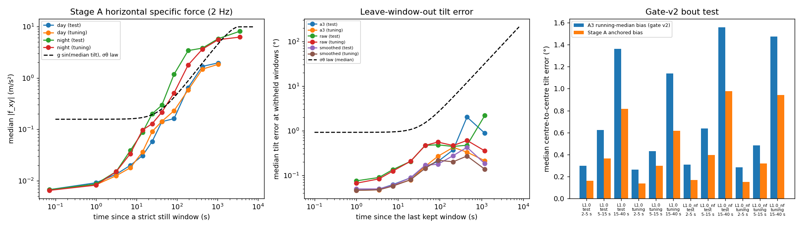
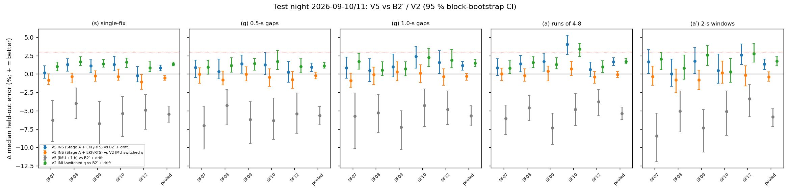
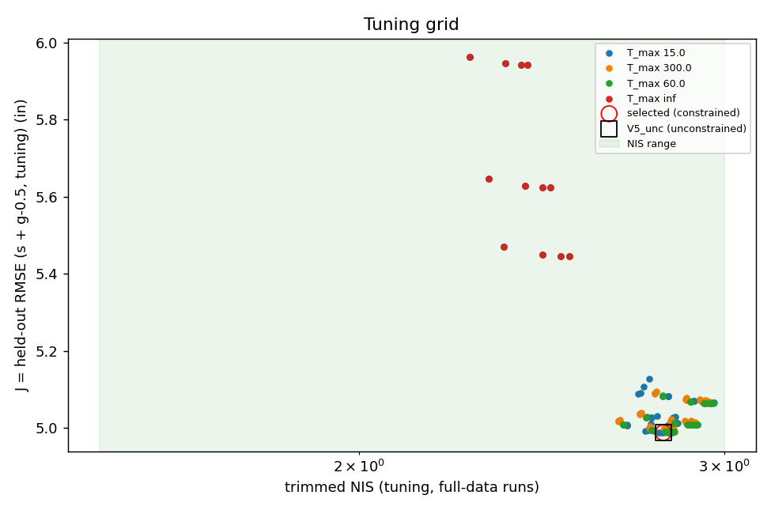
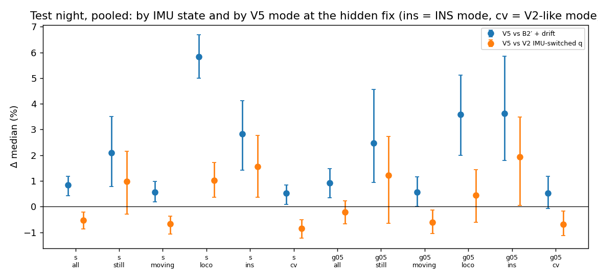
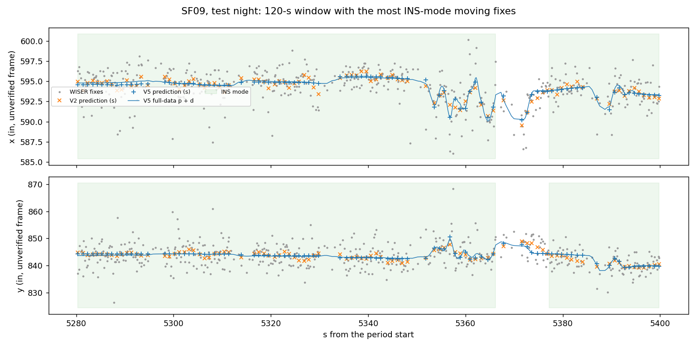

# Head-IMU inertial fusion with WISER, V5 (cohort 2026c): Stage-A attitude outside the filter + 16-Hz EKF/RTS — **FAIL**

- **Status:** pre-registered in [`implementation_plan/2026-10-01-wiser-ins-fusion-v5.md`](../../../../implementation_plan/2026-10-01-wiser-ins-fusion-v5.md) (user approval 2026-10-01 "start v5"; seven amendments written in §11 after tuning-only development runs, before any test period was read). Stage-A decisions frozen at 2026-10-01T13:27:58-04:00, Stage-B tuning frozen at 2026-10-01T14:01:58-04:00 (`tuned_frozen.json`) before the test periods were read; the verdict is evaluated once on the test night 2026-09-10/11.
- **Follows:** attitude gate v2 ([change log](../../../../change_log/2026-10-01-imu-attitude-gate-v2.md)), V4 audit ([change log](../../../../change_log/2026-09-29-wiser-ins-fusion.md)), smoothing pilot ([change log](../../../../change_log/2026-09-29-wiser-imu-smoothing-pilot.md)).
- **Run:** `python wiser/scripts/analyze_wiser_ins_fusion_v5.py --cohort 2026c`; bulk `D:\Field2026_analysis_out\2026c\wiser_ins_fusion_v5_20261001_1325`; config `wiser/configs/wiser_ins_fusion_v5_2026c.json` (`tuned`/`fitted` written by this run); git `32f4292+dirty`; runtime 55.1 min. Stage-A cache `D:/Field2026_analysis_out/2026c/attitude16_cache` (+ README). Pointer `run_manifest_ins_fusion_v5_2026c.json`.
- **Classification (regime-aware WISER):** measurement results only, on the unverified inch frame; held-out fixes contain WISER's own drift — a gain means better prediction of WISER, necessary but not sufficient for better head position.

## 1. Headline

1. **Verdict (pre-registered, test night): FAIL.** (s) single-fix: pooled Δ vs B2′ +0.8 % [+0.4 %, +1.2 %], vs V2 -0.5 % [-0.9 %, -0.2 %]; animals eligible (Δ ≥ 3 % vs both) with p ≤ 0.025: 0/5; scheme p 1.000 (Holm threshold 0.0125) → primary fail; control no-gain 5/5; pooled moving Δ vs B2′ +0.6 %, vs V2 -0.7 % | (g) 0.5-s gaps: pooled Δ vs B2′ +0.9 % [+0.3 %, +1.5 %], vs V2 -0.2 % [-0.7 %, +0.2 %]; animals eligible (Δ ≥ 3 % vs both) with p ≤ 0.025: 0/5; scheme p 1.000 (Holm threshold 0.0250) → primary fail; control no-gain 5/5; pooled moving Δ vs B2′ +0.6 %, vs V2 -0.6 %.
2. **Stage A (IMU only) works where it is anchored, and only there.** Bias rule `smoothed` (tuning LWO medians: raw 0.087°, smoothed 0.051°, A3 reference 0.051°). Gate-v2 bout test on the test periods (L1.0 set): A3 bias 0.30° / 0.62° (gate v2: 0.30° / 0.62°), Stage-A anchored bias 0.16° / 0.36°; 15–40 s: 1.36° → 0.82°. LWO tilt error at withheld test windows: median 0.054°. But strict windows are rare at night: median time since a strict window on the test night 2598 s (per-animal medians), and beyond ≈ 60 s the 2-Hz |f_xy| is dominated by gravity leakage (test night median 5.76 m/s² at ≥ 300 s vs 0.007 inside windows; σθ law: g·sin(1.1774 σθ(300 s)) = 1.38 m/s²).
3. **No usable yaw signal.** The ψ regression (visible fixes, IMU within 60 s of a strict window) gives resultants 0.004–0.150 (median 0.062; 1 = consistent direction) on 903 pairs per animal-period (median); handedness votes on the tuning periods {'normal': 6, 'mirrored': 4, 'none': 0} → frame normal.
4. **Tuning** (tuning night + day): σ_res 8.0 in/s², τ_b 2.0 s, T_max 15.0 s, κ_cv 10.0, σ_v 0.1 in/s, σ_vr 4.0 in/s → J 4.988 in, trimmed NIS 2.80 (constraint [1.5, 3.0] met). Unconstrained J-minimiser (V5_unc): J 4.988 in at NIS 2.80. Grid-edge flags: tau_b, t_max, kappa_cv, sig_v. The NIS constraint was not binding: 161 of 161 configurations had trimmed NIS in range (all 2.26–2.97), so the constrained and unconstrained choices coincide (V5_unc = V5); the 30 best configurations differ in J by < 0.011 in.
5. **Where V5 differs from V2 (test night, V5 vs V2, (s) / (g-0.5 s)):** INS-mode fixes +1.5 % / +1.9 % (n 11,565 / 5,684), CV-mode fixes -0.8 % / -0.7 %; IMU-still fixes +1.0 % / +1.2 %, moving fixes -0.7 % / -0.6 %. V5 vs its own +1 h control (amendment 8): +6.0 % [+4.9 %, +7.0 %] / +6.2 % [+5.1 %, +7.4 %] — but the shifted IMU is actively harmful (V5 + 1 h vs V2 -6.9 % / -6.9 %: a misaligned acceleration input in INS mode), so this contrast measures the damage a wrong IMU does, not information the right IMU adds.
6. **Consistency on the test night:** trimmed NIS 3.09 (animals 3.00–3.26), fraction > 13.82 7.7 %; held-out z² mean on (s) 5.40; INS mode on 11.2 % of fixes (median animal).
7. **Test day (secondary, mostly sleep; INS mode on 88 % of fixes):** V5 vs B2′ (s) +2.7 % [+2.2 %, +3.0 %], (g-0.5 s) +4.0 % [+3.5 %, +4.6 %]; vs V2 +1.3 % [+0.9 %, +1.7 %] / +2.2 % [+1.8 %, +2.8 %] — real but below the 3 % threshold in every animal (the same rule would read FAIL); the +1 h control also beats B2′ (+1.0 % / +2.2 %, V5's non-inertial parts), V5 vs its control +1.6 % / +1.9 %; the gain is on IMU-still fixes (vs V2 +1.7 %) and not on moving ones (-1.0 %).

## 2. Definitions

All positions in the WISER native **inch** frame (UNVERIFIED offset origin, handedness a candidate); IMU in the head frame
(x nose, y left, z up) and a Stage-A world frame (z up, yaw arbitrary). $g$ = 9.81 m/s² = 386.1 in/s².

**Strict still window $W_i=[s_i,e_i)$** (gate v2, unchanged; **no WISER veto** here): consecutive 0.1-s blocks whose
accelerometer directions stay within 0.3° of the window mean, $\big||\bar{\mathbf a}_W|-g\big|<0.03g$, every sample
$|\boldsymbol\omega^{A3}|<3$ °/s, all samples valid, ≥ 1.0 s. Centre $c_i$, duration $d_i$, gravity direction
$\hat{\mathbf g}_{W_i}=\sum_W\mathbf a/|\sum_W\mathbf a|$. **Text:** the head is still (no rotation beyond ≈ 0.6°, no
acceleration) for at least 1 s.

**ZARU estimate** $\hat{\mathbf b}_i=\frac{1}{|W_i|}\sum_{k\in W_i}\mathbf w_k$ (°/s; $\mathbf w$ = reconstructed gyro before
bias removal). **Anchor smoother** (per head axis): $b_{i+1}=b_i+\eta_i$, $\eta_i\sim\mathcal N(0,q_b(c_{i+1}-c_i))$;
$\hat b_i=b_i+\epsilon_i$, $\epsilon_i\sim\mathcal N(0,\sigma_r^2/d_i^2+\sigma_w^2/d_i)$; Huber-robust Kalman filter + RTS,
$(q_b,\sigma_r,\sigma_w)$ by maximum innovation likelihood on the tuning windows. **Bias function**
$\mathbf b(t)=$ linear interpolation of the anchors $\tilde{\mathbf b}_i$ between window centres, flat outside. **Text:** the gyro
bias is re-estimated at every strict window, short windows weighted down (their ZARU carries residual micro-rotation).

**Stage-A attitude** $q_k$: $q_{k+1}=q_k\otimes\mathrm{Exp}(\boldsymbol\omega_k\Delta t)$, $\boldsymbol\omega_k=s_a(\mathbf w_k-\mathbf b(t_k))$
($s_a$ = per-animal gyro scale), tilt set from $\hat{\mathbf g}_{W}$ at window centres; closure
$\boldsymbol\delta_{i+1}$ = horizontal world-frame rotation with $\mathrm{Exp}(\boldsymbol\delta_{i+1})R(q^f_{c_{i+1}})\hat{\mathbf g}_{W_{i+1}}=\mathbf e_z$,
applied as $q_k=\mathrm{Exp}(\alpha_k\boldsymbol\delta_{i+1})\otimes q^f_k$, $\alpha_k=(k-c_i)/(c_{i+1}-c_i)$. **Closure angle**
$|\boldsymbol\delta_{i+1}|$ = centre-to-centre tilt error with the anchored bias.

**Horizontal specific force** $\mathbf f_{xy}=[R(q)\mathbf a-g\mathbf e_z]_{xy}$, zero-phase Butterworth-4 low-pass 2 Hz, 16 Hz
(m/s²; in/s² in Stage B). **Time since a strict window** $t_{since}$ (s) = time since the end of the last window (0 inside).
**σθ law** (gate v2, chain records vs clock time) $\sigma_\theta(t)=\sqrt{0.78^2+(0.0227\,t)^2}$° (per-axis SD; median tilt
angle $1.1774\,\sigma_\theta$); **p90 law** $\sqrt{3.07^2+(0.0921\,t)^2}$°.

**Leave-window-out (LWO) tilt error** at a withheld window $j$ (odd-numbered windows withheld from anchors and closures):
$e_j=\angle\big(R(q_{c_j})^\top\mathbf e_z,\ \hat{\mathbf g}_{W_j}\big)$ (°). **Bout test** (gate v2): centre-to-centre propagation
error $e=\angle(\mathbf g_{c_{i+1}},\hat{\mathbf g}_{W_{i+1}})$ over gate-v2 bouts (active, no saturation; 2–5 s and 5–15 s),
with the A3 running-median bias (gate v2) or Stage A's anchored bias.

**Stage-B model** (state $\mathbf x=[\mathbf p,\mathbf v,\mathbf b,\psi,\mathbf d]$): INS mode ($\mathbf f_{xy}$ ok and $t_{since}\le T_{max}$):
$\dot{\mathbf p}=\mathbf v$, $\dot{\mathbf v}=R(\psi)\mathbf f_{xy}-\mathbf b+\mathbf w$, $\mathbf w$ white with PSD $\sigma_{res}^2\Delta_{16}$;
CV mode: $\dot{\mathbf v}=\mathbf w$ with PSD $\kappa_{cv}\,q\,m_c$ ($q$ = 1 in²/s³, $m$ = V2's state multipliers);
$\mathbf b$: Gauss–Markov, time constant $\tau_b$, stationary SD $g\sin\sigma_\theta(t_{since})$; $\psi$: random walk,
$\dot{\mathrm{Var}}(\psi)=\max(0.0309\ \mathrm{deg^2/s},2k^2t_{since})$; $\mathbf d$: AR(1) with the measured
$(\sigma_d,T_d)$. WISER update $\mathbf z=\mathbf p+\mathbf d+\boldsymbol\varepsilon$, $\boldsymbol\varepsilon\sim\mathcal N(0,\mathrm{diag}\,\sigma^2_{w}(A))$;
pass 0 χ² gate $d^2>13.82$ inflates $R$; passes 1–2 Huber ($k$ = 2.5). Soft ZUPT $0=\mathbf v+\boldsymbol\epsilon$ ($\sigma_v$ in IMU-still
seconds, $\sigma_{vr}$ in rhythmic samples). EKF + RTS (extended Kalman smoother). **Prediction**
$\hat{\mathbf z}_h=\mathbf p^s_h+\mathbf d^s_h$. **Text:** the IMU supplies the acceleration where its attitude is recent;
elsewhere V5 is a V2-like smoother.

**Rhythmic body-stationary sample**: ok ∧ not IMU-still ∧ pilot state ≠ locomoting ∧ [shake-train span ∨
($B_{hi}\ge B_{lo}$ ∧ $B_{hi}+B_{lo}\ge(20\ ^\circ/\mathrm s)^2$)], $B_{hi}$ = |ω| band power 8–12 + 12–20 Hz, $B_{lo}$ = 2–4 + 4–8 Hz.

**Measured WISER noise** (tuning, still runs ≥ 20 s): nugget $\sigma^2_{w}(A)=\tfrac12(1.4826\,\mathrm{MAD}(\Delta))^2$ over
consecutive same-anchor fixes ≤ 0.5 s apart; robust variogram $\gamma(\tau)=\tfrac12(1.4826\,\mathrm{MAD}(z(t+\tau)-z(t)))^2$ of
9-anchor fixes, fit $\gamma(\tau)=n+\sigma_d^2(1-e^{-\tau/T_d})$; drift kept iff $\sigma_d^2\ge0.10(n+\sigma_d^2)$ in one axis
and $1\le T_d\le120$ s.

**ψ regression**: pairs of visible fixes 0.4–0.75 s apart with the IMU span ok and $t_{since}\le60$ s; $\Delta v_W$ = B2
velocity change, $\Delta v_I=\int\mathbf f_{xy}dt$ (complex), $|\Delta v_I|\ge8$ in/s; $c=\Delta v_W\overline{\Delta v_I}$;
$\hat\psi=\arg\sum c$, resultant $\bar R=|\sum c|/\sum|c|$ (0 = no consistent direction, 1 = perfect), standard error
$1/(\bar R\sqrt{2n_{eff}})$, $n_{eff}=(\sum|c|)^2/\sum|c|^2$.

**Held-out schemes:** (s) every 5th fix hidden alone; (g) all fixes in a random 10 % of 0.5-s / 1.0-s windows; (a) runs of
4–8 fixes (20 %); (a′) a random 10 % of 2-s windows (pilot). **Scored fix:** hidden ∧ anchors ≥ 7 ∧ IMU-QC-ok ∧
shifted-IMU-QC-ok. **Held-out error** $e=\lVert\mathbf z_h-\hat{\mathbf z}_h\rVert$ (in). **Δ** $=1-\mathrm{med}(e_M)/\mathrm{med}(e_{ref})$
(+ = method better); 95 % CI from 1000 paired 5-min-block bootstrap replicates (stratified by animal when pooled);
one-sided $p=(1+\#\{\Delta^*\le0\})/1001$. **Holm** over (s) and (g-0.5 s): animal eligible iff Δ ≥ 3 % vs B2′ and V2;
$p_a=\max(p_{B2'},p_{V2})$; scheme statistic = 4th-smallest $p_a$; first scheme at 0.0125, second at 0.025.
**Control**: V5 with every IMU input from t + 3600 s (days: circular within the window); passes iff its CI lower bound vs
B2′ is ≤ 0 in ≥ 4/5 animals. **Moving fixes**: IMU-QC-ok and not IMU-still (pilot).

**NIS** $d^2=\boldsymbol\nu^\top S^{-1}\boldsymbol\nu$ of forward pass-0 innovations (visible fixes, anchors ≥ 7, full-data run);
**trimmed NIS** = mean over $d^2\le13.82$ (≈ 1.99 if consistent). **Held-out $z^2$** $=(\mathbf z_h-\hat{\mathbf z}_h)^\top(P^s_{p+d}+R)^{-1}(\mathbf z_h-\hat{\mathbf z}_h)$
(χ²₂ ⇒ mean 2). **Handedness LLR** = forward pass-0 log-likelihood of the visible fixes, normal − mirrored WISER y (per fix).
**Plausibility** (pilot `track_metrics`): speed / acceleration percentiles on a 0.25-s grid, path length per hour, wall excursions.

## 3. Data, regime context, Stage A

| period | role | analysis window (field-PC local) |
|---|---|---|
| `night_20260908` | tuning | 2026-09-08 21:00:00 → 2026-09-09 04:20:00 |
| `day_20260908` | tuning | 2026-09-08 08:00:00 → 2026-09-08 18:30:00 |
| `night_20260910` | test | 2026-09-10 21:00:00 → 2026-09-11 04:20:00 |
| `day_20260911` | test | 2026-09-11 10:00:00 → 2026-09-11 17:30:00 |

Regime context (gate-v2 report §3, field record): construction near the paddock from 09-08 ~07:50 (tuning day disturbed); SF08/SF12 test-night IMU from 21:02:45 / 21:05:18; no handling round, ADC window or implant loss inside the windows. Nights use the smoothing pilot's per-second IMU tables (make_imu npz); days use cache-equivalent tables (SF12's 09-11 session has no make_imu npz).

**Stage-A decisions (tuning only):** gyro scales SF07 0.962, SF08 0.951, SF09 0.995, SF10 1.001, SF12 1.000; bias smoother (ML, tuning windows): x: q_b 3.14e-06 (°/s)²/s, σ_r 0.124 °/s·s, σ_w 0.0000 °/s·√s; y: q_b 3.29e-06 (°/s)²/s, σ_r 0.147 °/s·s, σ_w 0.0000 °/s·√s; z: q_b 2.05e-06 (°/s)²/s, σ_r 0.160 °/s·s, σ_w 0.0000 °/s·√s; rule `smoothed`.

| animal | period | strict windows | still min | quiet tilt check (°) | t_since p50 / p75 / p90 (s) |
|---|---|---|---|---|---|
| SF07 | night_20260908 | 434 | 28.7 | 0.234 | 2262 / 3971 / 5834 |
| SF08 | night_20260908 | 265 | 21.3 | 0.181 | 5520 / 8820 / 10800 |
| SF09 | night_20260908 | 723 | 44.1 | 0.173 | 1974 / 3624 / 4991 |
| SF10 | night_20260908 | 334 | 27.9 | 0.181 | 2326 / 4026 / 5452 |
| SF12 | night_20260908 | 405 | 30.8 | 0.222 | 2167 / 3967 / 5429 |
| SF07 | day_20260908 | 4081 | 412.3 | 0.151 | 0 / 3 / 75 |
| SF08 | day_20260908 | 4523 | 387.1 | 0.156 | 0 / 4 / 53 |
| SF09 | day_20260908 | 3884 | 469.8 | 0.154 | 0 / 0 / 13 |
| SF10 | day_20260908 | 4381 | 434.2 | 0.153 | 0 / 1 / 21 |
| SF12 | day_20260908 | 4334 | 445.7 | 0.148 | 0 / 1 / 19 |
| SF07 | night_20260910 | 562 | 31.8 | 0.187 | 3116 / 5316 / 7051 |
| SF08 | night_20260910 | 399 | 20.9 | 0.209 | 3484 / 6398 / 8366 |
| SF09 | night_20260910 | 728 | 66.8 | 0.197 | 1713 / 3377 / 4923 |
| SF10 | night_20260910 | 434 | 36.5 | 0.227 | 2598 / 4965 / 6945 |
| SF12 | night_20260910 | 383 | 22.4 | 0.214 | 2332 / 4931 / 8418 |
| SF07 | day_20260911 | 3361 | 289.7 | 0.154 | 0 / 4 / 60 |
| SF08 | day_20260911 | 3059 | 337.4 | 0.140 | 0 / 1 / 17 |
| SF09 | day_20260911 | 3552 | 287.8 | 0.144 | 0 / 3 / 19 |
| SF10 | day_20260911 | 3387 | 312.9 | 0.143 | 0 / 2 / 38 |
| SF12 | day_20260911 | 3198 | 328.7 | 0.151 | 0 / 1 / 11 |

**Horizontal specific force vs time since a strict window** (median over animals of the per-animal median |f_xy|, m/s²; share of samples):

| t_since (s) | night_20260908 | day_20260908 | night_20260910 | day_20260911 |
|---|---|---|---|---|
| 0–0.01 | 0.007 (7 %) | 0.007 (67 %) | 0.007 (8 %) | 0.007 (66 %) |
| 0.01–2 | 0.008 (1 %) | 0.008 (9 %) | 0.009 (1 %) | 0.009 (9 %) |
| 2–5 | 0.015 (1 %) | 0.013 (5 %) | 0.015 (1 %) | 0.013 (6 %) |
| 5–10 | 0.034 (1 %) | 0.018 (4 %) | 0.039 (1 %) | 0.020 (4 %) |
| 10–20 | 0.097 (1 %) | 0.036 (3 %) | 0.088 (1 %) | 0.031 (4 %) |
| 20–30 | 0.129 (1 %) | 0.091 (2 %) | 0.201 (1 %) | 0.058 (2 %) |
| 30–60 | 0.216 (1 %) | 0.143 (3 %) | 0.295 (1 %) | 0.141 (3 %) |
| 60–120 | 0.508 (2 %) | 0.230 (3 %) | 1.172 (2 %) | 0.162 (2 %) |
| 120–300 | 1.788 (3 %) | 0.583 (2 %) | 3.394 (3 %) | 0.649 (2 %) |
| 300–600 | 3.609 (5 %) | 1.477 (2 %) | 3.785 (4 %) | 1.673 (1 %) |
| 600–1800 | 5.512 (17 %) | 1.831 (1 %) | 5.763 (16 %) | 1.954 (1 %) |
| 1800–∞ | 6.207 (60 %) | — (0 %) | 8.066 (60 %) | — (0 %) |

σθ law prediction of the leakage $g\sin(1.1774\sigma_\theta)$: 60 s 0.32 m/s², 300 s 1.38, 1800 s 7.30.

**Validation A2 — leave-window-out tilt error (median °, windows inside the analysis windows):**

| role | rule | (0.0, 2.0] | (2.0, 5.0] | (5.0, 10.0] | (10.0, 30.0] | (30.0, 60.0] | (60.0, 120.0] | (120.0, 300.0] | (300.0, 600.0] | (600.0, 1000000000.0] | all (n) |
|---|---|---|---|---|---|---|---|---|---|---|---|
| test | a3 | 0.049 | 0.049 | 0.062 | 0.088 | 0.156 | 0.204 | 0.371 | 2.019 | 0.878 | 0.054 (9205) |
| test | raw | 0.075 | 0.089 | 0.134 | 0.205 | 0.470 | 0.481 | 0.443 | 0.472 | 2.192 | 0.096 (9205) |
| test | smoothed | 0.049 | 0.049 | 0.060 | 0.088 | 0.169 | 0.177 | 0.276 | 0.424 | 0.183 | 0.054 (9205) |
| tuning | a3 | 0.046 | 0.047 | 0.058 | 0.079 | 0.159 | 0.266 | 0.423 | 0.330 | 0.212 | 0.051 (11461) |
| tuning | raw | 0.066 | 0.083 | 0.124 | 0.207 | 0.467 | 0.555 | 0.464 | 0.604 | 0.352 | 0.087 (11461) |
| tuning | smoothed | 0.046 | 0.047 | 0.057 | 0.080 | 0.143 | 0.217 | 0.201 | 0.270 | 0.137 | 0.051 (11461) |

**Validation A1 — gate-v2 bout test (active, no saturation, median °):**

| role | set | bin | n | A3 bias (gate v2) | Stage A anchored | other rule |
|---|---|---|---|---|---|---|
| test | L1.0 | 15-40 s | 605 | 1.362 | 0.817 | 2.243 |
| test | L1.0 | 2-5 s | 812 | 0.298 | 0.161 | 0.417 |
| test | L1.0 | 40-90 s | 238 | 2.555 | 1.538 | 4.592 |
| test | L1.0 | 5-15 s | 930 | 0.624 | 0.365 | 1.012 |
| test | L1.0_nf | 15-40 s | 383 | 1.558 | 0.978 | 3.208 |
| test | L1.0_nf | 2-5 s | 1179 | 0.309 | 0.167 | 0.432 |
| test | L1.0_nf | 40-90 s | 117 | 3.957 | 3.113 | 8.431 |
| test | L1.0_nf | 5-15 s | 968 | 0.637 | 0.397 | 1.246 |
| tuning | L1.0 | 15-40 s | 556 | 1.139 | 0.618 | 1.945 |
| tuning | L1.0 | 2-5 s | 864 | 0.264 | 0.138 | 0.357 |
| tuning | L1.0 | 40-90 s | 288 | 2.261 | 1.232 | 4.220 |
| tuning | L1.0 | 5-15 s | 929 | 0.433 | 0.297 | 0.869 |
| tuning | L1.0_nf | 15-40 s | 394 | 1.473 | 0.942 | 2.724 |
| tuning | L1.0_nf | 2-5 s | 1341 | 0.283 | 0.150 | 0.387 |
| tuning | L1.0_nf | 40-90 s | 130 | 3.148 | 2.663 | 6.817 |
| tuning | L1.0_nf | 5-15 s | 994 | 0.482 | 0.321 | 1.112 |

## 4. Measured WISER noise model (tuning, never tuned)

| kind | drift state | σ_d x / y (in) | T_d (s) | slow share x / y | white SD at 9 / 8 / 7 anchors, x (in) | y (in) |
|---|---|---|---|---|---|---|
| night | not kept | 0.42 / 0.53 | 10.5 | 0.097 / 0.047 | 1.41 / 1.76 / 2.41 | 2.51 / 3.00 / 3.37 |
| day | kept | 0.46 / 0.72 | 22.8 | 0.103 / 0.088 | 1.32 / 1.64 / 1.91 | 2.26 / 2.72 / 3.05 |

Variogram (9-anchor fixes in still runs, in²): night: 0.25 s 1.57/5.32, 0.5 s 1.66/5.55, 1 s 1.72/5.77, 2 s 1.71/5.75, 5 s 1.74/5.79, 10 s 1.77/5.87, 20 s 1.80/5.87, 30 s 1.84/5.94; day: 0.25 s 1.77/5.13, 0.5 s 1.86/5.35, 1 s 1.86/5.36, 2 s 1.88/5.44, 5 s 1.88/5.47, 10 s 1.93/5.52, 20 s 1.93/5.60, 30 s 2.01/5.73. For comparison B2′ uses σ_b = 2.5 in (T_b 15 s) with white = max(σ² − σ_b², σ²/4) (pilot).

## 5. Yaw offset ψ — regression and handedness

| animal | period | pairs | n_eff | resultant R̄ (normal) | R̄ (mirrored) | ψ whole (°) | SE (°) | nodes with a local estimate |
|---|---|---|---|---|---|---|---|---|
| SF07 | night_20260908 | 971 | 599 | 0.004 | 0.005 | 145 | 433 | 10.2 % |
| SF08 | night_20260908 | 578 | 299 | 0.049 | 0.015 | -78 | 48 | 5.4 % |
| SF09 | night_20260908 | 924 | 469 | 0.021 | 0.048 | 4 | 90 | 7.2 % |
| SF10 | night_20260908 | 617 | 137 | 0.150 | 0.081 | 138 | 23 | 7.9 % |
| SF12 | night_20260908 | 1068 | 225 | 0.070 | 0.047 | 15 | 39 | 10.4 % |
| SF07 | day_20260908 | 2347 | 1397 | 0.107 | 0.028 | -154 | 10 | 20.0 % |
| SF08 | day_20260908 | 4380 | 2690 | 0.056 | 0.051 | -99 | 14 | 35.2 % |
| SF09 | day_20260908 | 735 | 460 | 0.015 | 0.065 | 89 | 124 | 9.0 % |
| SF10 | day_20260908 | 1193 | 709 | 0.063 | 0.066 | 53 | 24 | 10.8 % |
| SF12 | day_20260908 | 882 | 551 | 0.091 | 0.044 | 88 | 19 | 10.5 % |
| SF07 | night_20260910 | 786 | 411 | 0.065 | 0.065 | 174 | 31 | 8.0 % |
| SF08 | night_20260910 | 931 | 523 | 0.094 | 0.067 | 174 | 19 | 9.2 % |
| SF09 | night_20260910 | 1006 | 278 | 0.048 | 0.070 | 169 | 51 | 9.8 % |
| SF10 | night_20260910 | 700 | 311 | 0.024 | 0.012 | -177 | 96 | 6.4 % |
| SF12 | night_20260910 | 430 | 249 | 0.015 | 0.052 | 144 | 166 | 5.9 % |
| SF07 | day_20260911 | 1118 | 671 | 0.112 | 0.067 | -160 | 14 | 14.5 % |
| SF08 | day_20260911 | 1674 | 586 | 0.088 | 0.026 | 139 | 19 | 29.1 % |
| SF09 | day_20260911 | 211 | 154 | 0.024 | 0.085 | -123 | 139 | 5.8 % |
| SF10 | day_20260911 | 183 | 133 | 0.061 | 0.037 | 90 | 57 | 4.5 % |
| SF12 | day_20260911 | 615 | 350 | 0.085 | 0.045 | 60 | 25 | 10.4 % |

+1 h-shifted IMU (scheme s visible fixes): R̄ median 0.042 — the null level. Handedness (tuning votes): {'normal': 6, 'mirrored': 4, 'none': 0} → normal.

Handedness LLR on the test periods (forward pass 0, per fix, + = normal frame fits better): night SF07 -0.0001, night SF08 +0.0011, night SF09 +0.0005, night SF10 -0.0001, night SF12 +0.0001, day_2 SF07 +0.0017, day_2 SF08 +0.0017, day_2 SF09 +0.0005, day_2 SF10 -0.0001, day_2 SF12 +0.0036.

## 6. Tuning (tuning night + tuning day only)

Objective J = pooled held-out RMSE over the scored fixes of (s) and (g-0.5 s), both tuning periods; constraint trimmed NIS ∈ [1.5, 3.0]. 161 configurations evaluated. Best ten by J among those meeting the constraint (or all if none):

| sig_res | tau_b | t_max | kappa_cv | sig_v | sig_vr | J | nis | nis_untrimmed | frac_gt_13.82 |
|---|---|---|---|---|---|---|---|---|---|
| 8.0 | 2.0 | 15.0 | 10.0 | 0.25 | 4.0 | 4.9876 | 2.7974 | 4.4107 | 0.0636 |
| 5.6 | 2.0 | 15.0 | 10.0 | 0.1 | 4.0 | 4.9877 | 2.8154 | 4.4511 | 0.0644 |
| 8.0 | 2.0 | 15.0 | 10.0 | 0.1 | 4.0 | 4.9882 | 2.8037 | 4.4251 | 0.0639 |
| 4.0 | 2.0 | 15.0 | 10.0 | 0.25 | inf | 4.9891 | 2.8232 | 4.4422 | 0.0646 |
| 4.0 | 5.0 | 15.0 | 10.0 | 0.25 | inf | 4.9892 | 2.8303 | 4.4601 | 0.0649 |
| 11.2 | 2.0 | 15.0 | 10.0 | 0.1 | 4.0 | 4.9893 | 2.7889 | 4.3892 | 0.0632 |
| 4.0 | 10.0 | 15.0 | 10.0 | 0.25 | inf | 4.9896 | 2.8358 | 4.4760 | 0.0653 |
| 8.0 | 5.0 | 15.0 | 10.0 | 0.25 | inf | 4.9898 | 2.8117 | 4.4160 | 0.0641 |
| 8.0 | 10.0 | 15.0 | 10.0 | 0.25 | inf | 4.9898 | 2.8152 | 4.4261 | 0.0644 |
| 4.0 | 5.0 | 60.0 | 10.0 | 0.25 | inf | 4.9900 | 2.8331 | 4.4653 | 0.0651 |

NIS range of all configurations: 2.26–2.97; configurations meeting the constraint: 161 of 161. Selected: {'sig_res': 8.0, 'tau_b': 2.0, 't_max': 15.0, 'sig_v': 0.1, 'sig_vr': 4.0, 'kappa_cv': 10.0} (J 4.9882, NIS 2.80); V5_unc: {'sig_res': 8.0, 'tau_b': 2.0, 't_max': 15.0, 'sig_v': 0.1, 'sig_vr': 4.0, 'kappa_cv': 10.0} (J 4.9882, NIS 2.80).

## 7. Test night 2026-09-10/11 (primary)

Pooled held-out error (median / RMSE / fraction > 24 in, in) and Δ vs B2′ and vs V2 (95 % CI):

| method | (s) single-fix | (g) 0.5-s gaps | (g) 1.0-s gaps | (a) runs of 4-8 | (a′) 2-s windows |
|---|---|---|---|---|---|
| B1 median-7 | 3.65 / 6.07 / 0.35% vs B2′ -4.4 % [-4.9 %, -4.0 %] | 3.88 / 6.70 / 0.64% vs B2′ -5.0 % [-5.7 %, -4.3 %] | 4.05 / 7.43 / 1.11% vs B2′ -5.3 % [-6.0 %, -4.4 %] | 4.15 / 7.65 / 1.30% vs B2′ -5.6 % [-6.2 %, -4.9 %] | 4.37 / 9.29 / 2.51% vs B2′ -4.1 % [-5.1 %, -3.2 %] |
| B2 robust CV | 3.56 / 5.82 / 0.23% vs B2′ -1.9 % [-2.2 %, -1.5 %] | 3.74 / 6.12 / 0.35% vs B2′ -1.2 % [-1.6 %, -0.7 %] | 3.87 / 6.40 / 0.39% vs B2′ -0.6 % [-1.0 %, -0.2 %] | 3.97 / 6.51 / 0.44% vs B2′ -1.0 % [-1.2 %, -0.7 %] | 4.22 / 7.31 / 0.92% vs B2′ -0.6 % [-1.0 %, -0.2 %] |
| B2′ + drift | 3.50 / 5.74 / 0.22% | 3.70 / 6.06 / 0.33% | 3.85 / 6.34 / 0.37% | 3.93 / 6.46 / 0.41% | 4.19 / 7.26 / 0.89% |
| V1 ZUPT | 3.49 / 5.74 / 0.22% vs B2′ +0.2 % [+0.1 %, +0.3 %] | 3.69 / 6.05 / 0.34% vs B2′ +0.1 % [+0.1 %, +0.4 %] | 3.83 / 6.33 / 0.36% vs B2′ +0.5 % [+0.2 %, +0.7 %] | 3.91 / 6.44 / 0.42% vs B2′ +0.5 % [+0.3 %, +0.7 %] | 4.17 / 7.25 / 0.88% vs B2′ +0.6 % [+0.4 %, +0.9 %] |
| V2 IMU-switched q | 3.45 / 5.63 / 0.18% vs B2′ +1.4 % [+1.1 %, +1.6 %] | 3.66 / 5.89 / 0.25% vs B2′ +1.1 % [+0.8 %, +1.6 %] | 3.79 / 6.13 / 0.25% vs B2′ +1.5 % [+1.0 %, +2.0 %] | 3.86 / 6.23 / 0.31% vs B2′ +1.7 % [+1.4 %, +2.1 %] | 4.12 / 6.99 / 0.65% vs B2′ +1.8 % [+1.1 %, +2.3 %] |
| V5 INS (Stage A + EKF/RTS) | 3.47 / 5.61 / 0.18% vs B2′ +0.8 % [+0.4 %, +1.2 %] vs V2 -0.5 % [-0.9 %, -0.2 %] | 3.66 / 5.86 / 0.25% vs B2′ +0.9 % [+0.3 %, +1.5 %] vs V2 -0.2 % [-0.7 %, +0.2 %] | 3.80 / 6.13 / 0.24% vs B2′ +1.2 % [+0.5 %, +1.7 %] vs V2 -0.3 % [-0.9 %, +0.1 %] | 3.86 / 6.21 / 0.30% vs B2′ +1.7 % [+1.2 %, +2.2 %] vs V2 -0.1 % [-0.5 %, +0.3 %] | 4.14 / 6.94 / 0.57% vs B2′ +1.4 % [+0.6 %, +2.0 %] vs V2 -0.4 % [-1.0 %, +0.3 %] |
| V5 (IMU +1 h) | 3.69 / 10.65 / 1.66% vs B2′ -5.5 % [-6.6 %, -4.4 %] vs V2 -6.9 % [-8.0 %, -5.9 %] | 3.91 / 10.08 / 1.63% vs B2′ -5.7 % [-6.9 %, -4.4 %] vs V2 -6.9 % [-8.3 %, -5.7 %] | 4.07 / 10.43 / 1.83% vs B2′ -5.7 % [-7.1 %, -4.3 %] vs V2 -7.3 % [-8.8 %, -5.9 %] | 4.14 / 11.33 / 1.98% vs B2′ -5.4 % [-6.2 %, -4.5 %] vs V2 -7.2 % [-8.3 %, -6.2 %] | 4.44 / 11.97 / 2.55% vs B2′ -5.8 % [-7.1 %, -4.7 %] vs V2 -7.7 % [-9.0 %, -6.5 %] |
| V5, p90 σθ law | 3.47 / 5.61 / 0.18% vs B2′ +0.7 % [+0.4 %, +1.1 %] vs V2 -0.6 % [-0.9 %, -0.3 %] | 3.67 / 5.86 / 0.25% vs B2′ +0.9 % [+0.3 %, +1.5 %] vs V2 -0.3 % [-0.7 %, +0.2 %] | 3.80 / 6.13 / 0.24% vs B2′ +1.1 % [+0.5 %, +1.7 %] vs V2 -0.4 % [-0.8 %, +0.1 %] | 3.87 / 6.21 / 0.30% vs B2′ +1.6 % [+1.1 %, +2.2 %] vs V2 -0.1 % [-0.5 %, +0.3 %] | 4.15 / 6.95 / 0.57% vs B2′ +1.2 % [+0.4 %, +1.9 %] vs V2 -0.6 % [-1.2 %, +0.1 %] |
| V5_unc | 3.47 / 5.61 / 0.18% vs B2′ +0.8 % [+0.4 %, +1.2 %] vs V2 -0.5 % [-0.8 %, -0.2 %] | 3.66 / 5.86 / 0.25% vs B2′ +0.9 % [+0.4 %, +1.5 %] vs V2 -0.2 % [-0.7 %, +0.3 %] | 3.80 / 6.13 / 0.24% vs B2′ +1.2 % [+0.5 %, +1.8 %] vs V2 -0.3 % [-0.8 %, +0.1 %] | 3.86 / 6.21 / 0.30% vs B2′ +1.7 % [+1.2 %, +2.1 %] vs V2 -0.1 % [-0.5 %, +0.3 %] | 4.14 / 6.94 / 0.57% vs B2′ +1.4 % [+0.6 %, +2.1 %] vs V2 -0.4 % [-1.0 %, +0.2 %] |

Per animal, primary schemes (Δ of V5; control = V5 IMU + 1 h vs B2′):

| animal | scheme | n | V5 vs B2′ | p | V5 vs V2 | p | control vs B2′ | V2 vs B2′ |
|---|---|---|---|---|---|---|---|---|
| SF07 | s | 19588 | +0.2 % [-0.6 %, +1.1 %] | 0.244 | -0.9 % [-1.4 %, +0.0 %] | 0.970 | -6.3 % [-9.2 %, -3.6 %] | +1.0 % [+0.4 %, +1.6 %] |
| SF08 | s | 19147 | +1.3 % [+0.4 %, +2.1 %] | 0.002 | -0.4 % [-1.2 %, +0.1 %] | 0.945 | -4.0 % [-6.1 %, -1.9 %] | +1.7 % [+1.2 %, +2.3 %] |
| SF09 | s | 19867 | +1.1 % [+0.2 %, +2.0 %] | 0.009 | -0.3 % [-1.0 %, +0.4 %] | 0.827 | -6.7 % [-9.6 %, -3.7 %] | +1.4 % [+0.9 %, +2.0 %] |
| SF10 | s | 19643 | +1.3 % [+0.5 %, +2.4 %] | 0.005 | -0.3 % [-0.9 %, +0.7 %] | 0.611 | -5.4 % [-8.5 %, -3.0 %] | +1.6 % [+0.9 %, +2.2 %] |
| SF12 | s | 18792 | -0.2 % [-1.1 %, +1.0 %] | 0.580 | -1.1 % [-2.1 %, -0.1 %] | 0.980 | -4.9 % [-7.5 %, -2.8 %] | +0.9 % [+0.3 %, +1.7 %] |
| pooled | s | 97037 | +0.8 % [+0.4 %, +1.2 %] | 0.001 | -0.5 % [-0.9 %, -0.2 %] | 1.000 | -5.5 % [-6.6 %, -4.4 %] | +1.4 % [+1.1 %, +1.6 %] |
| SF07 | g05 | 9710 | +0.9 % [-0.5 %, +1.9 %] | 0.147 | -0.0 % [-1.3 %, +0.8 %] | 0.603 | -7.0 % [-10.2 %, -4.5 %] | +0.9 % [-0.0 %, +1.8 %] |
| SF08 | g05 | 9483 | +0.4 % [-0.7 %, +2.0 %] | 0.176 | -0.8 % [-1.5 %, +0.4 %] | 0.895 | -4.3 % [-6.9 %, -2.1 %] | +1.2 % [+0.3 %, +2.2 %] |
| SF09 | g05 | 9838 | +1.4 % [+0.1 %, +2.6 %] | 0.019 | -0.0 % [-1.0 %, +1.0 %] | 0.466 | -6.2 % [-9.4 %, -3.8 %] | +1.4 % [+0.5 %, +2.1 %] |
| SF10 | g05 | 9690 | +1.2 % [-0.1 %, +2.9 %] | 0.031 | -0.5 % [-1.7 %, +0.7 %] | 0.782 | -6.3 % [-8.9 %, -3.3 %] | +1.7 % [+0.6 %, +3.2 %] |
| SF12 | g05 | 9241 | +0.3 % [-1.1 %, +1.7 %] | 0.278 | -0.8 % [-2.0 %, +0.4 %] | 0.905 | -5.4 % [-8.1 %, -2.6 %] | +1.0 % [+0.2 %, +2.0 %] |
| pooled | g05 | 47962 | +0.9 % [+0.3 %, +1.5 %] | 0.002 | -0.2 % [-0.7 %, +0.2 %] | 0.824 | -5.7 % [-6.9 %, -4.4 %] | +1.1 % [+0.8 %, +1.6 %] |
| SF07 | g10 | 9724 | +0.8 % [-0.6 %, +2.3 %] | 0.122 | -0.9 % [-1.8 %, +0.1 %] | 0.949 | -5.7 % [-10.1 %, -2.6 %] | +1.7 % [+0.7 %, +2.8 %] |
| SF08 | g10 | 9021 | +0.5 % [-1.0 %, +2.1 %] | 0.273 | -0.1 % [-1.4 %, +0.9 %] | 0.624 | -5.3 % [-8.0 %, -2.8 %] | +0.5 % [-0.2 %, +1.7 %] |
| SF09 | g10 | 10316 | +1.0 % [-0.4 %, +2.7 %] | 0.079 | +0.3 % [-0.9 %, +1.7 %] | 0.307 | -7.2 % [-10.3 %, -5.0 %] | +0.7 % [-0.3 %, +1.7 %] |
| SF10 | g10 | 9614 | +2.4 % [+0.8 %, +3.7 %] | 0.001 | +0.1 % [-1.2 %, +1.3 %] | 0.428 | -4.3 % [-7.1 %, -2.0 %] | +2.3 % [+1.0 %, +3.5 %] |
| SF12 | g10 | 9393 | +1.6 % [+0.0 %, +3.2 %] | 0.023 | -0.4 % [-1.5 %, +0.7 %] | 0.773 | -4.8 % [-6.9 %, -2.3 %] | +1.9 % [+0.8 %, +3.3 %] |
| pooled | g10 | 48068 | +1.2 % [+0.5 %, +1.7 %] | 0.001 | -0.3 % [-0.9 %, +0.1 %] | 0.939 | -5.7 % [-7.1 %, -4.3 %] | +1.5 % [+1.0 %, +2.0 %] |
| SF07 | a | 19428 | +0.8 % [-0.2 %, +2.1 %] | 0.057 | +0.0 % [-0.9 %, +0.8 %] | 0.524 | -6.0 % [-8.2 %, -4.2 %] | +0.8 % [+0.1 %, +1.8 %] |
| SF08 | a | 19532 | +1.4 % [+0.3 %, +2.5 %] | 0.005 | -0.2 % [-1.0 %, +0.7 %] | 0.637 | -4.6 % [-6.3 %, -2.9 %] | +1.6 % [+0.9 %, +2.4 %] |
| SF09 | a | 19617 | +1.7 % [+0.4 %, +2.7 %] | 0.009 | +0.4 % [-0.9 %, +1.1 %] | 0.348 | -7.3 % [-9.6 %, -5.3 %] | +1.3 % [+0.7 %, +2.2 %] |
| SF10 | a | 19542 | +4.1 % [+2.7 %, +5.3 %] | 0.001 | +0.7 % [-0.2 %, +1.7 %] | 0.060 | -4.8 % [-7.0 %, -2.6 %] | +3.4 % [+2.4 %, +4.2 %] |
| SF12 | a | 18818 | +0.6 % [-0.4 %, +1.6 %] | 0.119 | -0.4 % [-1.3 %, +0.3 %] | 0.881 | -3.8 % [-5.7 %, -2.1 %] | +1.0 % [+0.2 %, +1.8 %] |
| pooled | a | 96937 | +1.7 % [+1.2 %, +2.2 %] | 0.001 | -0.1 % [-0.5 %, +0.3 %] | 0.652 | -5.4 % [-6.2 %, -4.5 %] | +1.7 % [+1.4 %, +2.1 %] |
| SF07 | a2 | 9475 | +1.7 % [+0.1 %, +3.3 %] | 0.019 | -0.4 % [-1.5 %, +1.0 %] | 0.625 | -8.4 % [-11.9 %, -5.3 %] | +2.0 % [+0.6 %, +2.9 %] |
| SF08 | a2 | 9763 | +0.0 % [-1.7 %, +2.0 %] | 0.446 | -0.8 % [-2.5 %, +0.7 %] | 0.842 | -5.0 % [-7.9 %, -2.3 %] | +0.8 % [-0.7 %, +2.6 %] |
| SF09 | a2 | 9765 | +1.8 % [+0.1 %, +3.6 %] | 0.020 | -0.8 % [-2.1 %, +0.5 %] | 0.886 | -7.3 % [-10.6 %, -4.8 %] | +2.6 % [+1.2 %, +3.8 %] |
| SF10 | a2 | 9848 | +0.5 % [-1.3 %, +2.7 %] | 0.238 | +0.2 % [-1.3 %, +1.8 %] | 0.364 | -5.1 % [-8.3 %, -2.3 %] | +0.3 % [-1.1 %, +2.1 %] |
| SF12 | a2 | 9418 | +2.6 % [+1.3 %, +4.1 %] | 0.004 | -0.2 % [-1.6 %, +1.1 %] | 0.635 | -3.4 % [-5.8 %, -1.4 %] | +2.8 % [+1.6 %, +4.1 %] |
| pooled | a2 | 48269 | +1.4 % [+0.6 %, +2.0 %] | 0.001 | -0.4 % [-1.0 %, +0.3 %] | 0.881 | -5.8 % [-7.1 %, -4.7 %] | +1.8 % [+1.1 %, +2.3 %] |

By subset (pooled, V5 vs B2′ / V5 vs V2):

| scheme | all | still | moving | loco | INS mode | CV mode |
|---|---|---|---|---|---|---|
| s | +0.8 % / -0.5 % (n 97037) | +2.1 % / +1.0 % (n 12844) | +0.6 % / -0.7 % (n 84193) | +5.8 % / +1.0 % (n 22174) | +2.8 % / +1.5 % (n 11565) | +0.5 % / -0.8 % (n 85472) |
| g05 | +0.9 % / -0.2 % (n 47962) | +2.5 % / +1.2 % (n 6320) | +0.6 % / -0.6 % (n 41642) | +3.6 % / +0.4 % (n 11088) | +3.6 % / +1.9 % (n 5684) | +0.5 % / -0.7 % (n 42278) |
| g10 | +1.2 % / -0.3 % (n 48068) | +2.6 % / +0.3 % (n 6486) | +1.0 % / -0.4 % (n 41582) | +3.3 % / -0.2 % (n 10936) | +2.3 % / +0.3 % (n 6013) | +1.1 % / -0.3 % (n 42055) |
| a | +1.7 % / -0.1 % (n 96937) | +4.8 % / +1.6 % (n 12636) | +1.3 % / -0.5 % (n 84301) | +3.3 % / +0.5 % (n 21978) | +4.5 % / +1.6 % (n 11412) | +1.3 % / -0.4 % (n 85525) |
| a2 | +1.4 % / -0.4 % (n 48269) | +6.6 % / +2.0 % (n 6149) | +0.7 % / -0.3 % (n 42120) | +0.4 % / +0.2 % (n 11213) | +6.5 % / +2.1 % (n 5661) | +0.7 % / -0.2 % (n 42608) |

Rule applied (verdict): **FAIL**; Holm order ['s', 'g05']; s: p per animal SF07 1.000, SF08 1.000, SF09 1.000, SF10 1.000, SF12 1.000, scheme p 1.000; g05: p per animal SF07 1.000, SF08 1.000, SF09 1.000, SF10 1.000, SF12 1.000, scheme p 1.000.

| animal | trimmed NIS | NIS mean | frac > 5.99 | frac > 13.82 | held-out z² mean (s) / (g05) | frac z² > 5.99 (s) | INS nodes | LLR/fix |
|---|---|---|---|---|---|---|---|---|
| SF07 | 3.02 | 4.72 | 0.214 | 0.067 | 5.34 / 5.24 | 0.229 | 0.118 | -0.0001 |
| SF08 | 3.09 | 5.33 | 0.234 | 0.082 | 5.78 / 5.68 | 0.247 | 0.078 | +0.0011 |
| SF09 | 3.00 | 4.77 | 0.218 | 0.071 | 5.65 / 6.45 | 0.226 | 0.200 | +0.0005 |
| SF10 | 3.18 | 5.01 | 0.236 | 0.077 | 5.39 / 5.43 | 0.250 | 0.112 | -0.0001 |
| SF12 | 3.26 | 5.26 | 0.249 | 0.083 | 5.40 / 5.86 | 0.261 | 0.085 | +0.0001 |

Plausibility of the full-data position tracks (median over animals): B2p_p: v p50/p95/p99 1.0/8.5/18.6 in/s, a p99 7 in/s², path 5715 in/h, wall-out 0.026 %; V2_p: v p50/p95/p99 0.8/8.8/22.5 in/s, a p99 18 in/s², path 5704 in/h, wall-out 0.037 %; V5_p: v p50/p95/p99 1.4/10.0/25.2 in/s, a p99 29 in/s², path 7420 in/h, wall-out 0.053 %; raw: v p50/p95/p99 4.9/17.8/32.3 in/s, a p99 139 in/s², path 18210 in/h, wall-out 0.518 %.

Tails (pooled, scheme s): B2p max 267.2 in, > 100 in 0.003 %; V2 max 272.2 in, > 100 in 0.003 %; V5 max 273.5 in, > 100 in 0.003 %; V5_shift max 335.0 in, > 100 in 0.138 %.

## 8. Test day 2026-09-11 (secondary)

Pooled held-out error (median / RMSE / fraction > 24 in, in) and Δ vs B2′ and vs V2 (95 % CI):

| method | (s) single-fix | (g) 0.5-s gaps | (g) 1.0-s gaps | (a) runs of 4-8 | (a′) 2-s windows |
|---|---|---|---|---|---|
| B1 median-7 | 2.63 / 4.13 / 0.02% vs B2′ -3.8 % [-4.3 %, -3.4 %] | 2.68 / 4.15 / 0.03% vs B2′ -3.5 % [-4.0 %, -2.9 %] | 2.68 / 4.20 / 0.03% vs B2′ -2.8 % [-3.4 %, -2.2 %] | 2.69 / 4.27 / 0.03% vs B2′ -1.5 % [-2.0 %, -1.0 %] | 2.71 / 4.27 / 0.03% vs B2′ +0.2 % [-0.5 %, +0.9 %] |
| B2 robust CV | 2.52 / 3.93 / 0.02% vs B2′ +0.4 % [+0.2 %, +0.7 %] | 2.57 / 3.95 / 0.02% vs B2′ +0.5 % [+0.1 %, +0.9 %] | 2.59 / 4.01 / 0.02% vs B2′ +0.7 % [+0.3 %, +1.1 %] | 2.63 / 4.08 / 0.02% vs B2′ +0.8 % [+0.4 %, +1.0 %] | 2.70 / 4.19 / 0.03% vs B2′ +0.6 % [+0.2 %, +1.0 %] |
| B2′ + drift | 2.53 / 3.95 / 0.02% | 2.59 / 3.98 / 0.02% | 2.61 / 4.05 / 0.02% | 2.65 / 4.11 / 0.02% | 2.71 / 4.23 / 0.03% |
| V1 ZUPT | 2.50 / 3.91 / 0.02% vs B2′ +1.4 % [+1.1 %, +1.5 %] | 2.54 / 3.92 / 0.02% vs B2′ +1.8 % [+1.5 %, +2.1 %] | 2.54 / 3.95 / 0.02% vs B2′ +2.6 % [+2.3 %, +3.0 %] | 2.57 / 4.01 / 0.02% vs B2′ +3.2 % [+2.8 %, +3.4 %] | 2.59 / 4.09 / 0.03% vs B2′ +4.4 % [+4.0 %, +4.8 %] |
| V2 IMU-switched q | 2.50 / 3.91 / 0.01% vs B2′ +1.4 % [+1.2 %, +1.6 %] | 2.54 / 3.92 / 0.01% vs B2′ +1.8 % [+1.5 %, +2.1 %] | 2.54 / 3.95 / 0.01% vs B2′ +2.7 % [+2.4 %, +3.0 %] | 2.57 / 4.00 / 0.01% vs B2′ +3.1 % [+2.8 %, +3.4 %] | 2.59 / 4.04 / 0.02% vs B2′ +4.4 % [+4.0 %, +4.8 %] |
| V5 INS (Stage A + EKF/RTS) | 2.46 / 3.86 / 0.02% vs B2′ +2.7 % [+2.2 %, +3.0 %] vs V2 +1.3 % [+0.9 %, +1.7 %] | 2.48 / 3.86 / 0.01% vs B2′ +4.0 % [+3.5 %, +4.6 %] vs V2 +2.2 % [+1.8 %, +2.8 %] | 2.48 / 3.88 / 0.01% vs B2′ +5.0 % [+4.3 %, +5.6 %] vs V2 +2.4 % [+1.8 %, +2.8 %] | 2.51 / 3.94 / 0.01% vs B2′ +5.5 % [+4.9 %, +5.9 %] vs V2 +2.4 % [+2.0 %, +2.9 %] | 2.53 / 3.98 / 0.03% vs B2′ +6.8 % [+6.1 %, +7.6 %] vs V2 +2.6 % [+2.0 %, +3.1 %] |
| V5 (IMU +1 h) | 2.50 / 4.21 / 0.06% vs B2′ +1.0 % [+0.6 %, +1.5 %] vs V2 -0.3 % [-0.8 %, +0.1 %] | 2.53 / 4.31 / 0.08% vs B2′ +2.2 % [+1.5 %, +2.9 %] vs V2 +0.3 % [-0.3 %, +1.1 %] | 2.53 / 4.20 / 0.06% vs B2′ +3.1 % [+2.4 %, +3.9 %] vs V2 +0.5 % [-0.3 %, +1.2 %] | 2.54 / 4.26 / 0.05% vs B2′ +4.2 % [+3.6 %, +4.7 %] vs V2 +1.1 % [+0.6 %, +1.6 %] | 2.57 / 4.36 / 0.07% vs B2′ +5.1 % [+4.4 %, +5.9 %] vs V2 +0.8 % [+0.1 %, +1.5 %] |
| V5, p90 σθ law | 2.46 / 3.87 / 0.02% vs B2′ +2.7 % [+2.2 %, +3.0 %] vs V2 +1.3 % [+0.9 %, +1.7 %] | 2.49 / 3.87 / 0.02% vs B2′ +3.8 % [+3.2 %, +4.3 %] vs V2 +2.0 % [+1.5 %, +2.6 %] | 2.49 / 3.90 / 0.01% vs B2′ +4.6 % [+4.0 %, +5.2 %] vs V2 +2.0 % [+1.4 %, +2.6 %] | 2.52 / 3.96 / 0.02% vs B2′ +5.0 % [+4.5 %, +5.5 %] vs V2 +1.9 % [+1.6 %, +2.4 %] | 2.54 / 4.05 / 0.04% vs B2′ +6.4 % [+5.7 %, +7.1 %] vs V2 +2.1 % [+1.5 %, +2.7 %] |
| V5_unc | 2.46 / 3.86 / 0.02% vs B2′ +2.7 % [+2.2 %, +3.0 %] vs V2 +1.3 % [+0.9 %, +1.7 %] | 2.48 / 3.86 / 0.01% vs B2′ +4.0 % [+3.5 %, +4.6 %] vs V2 +2.2 % [+1.8 %, +2.8 %] | 2.48 / 3.88 / 0.01% vs B2′ +5.0 % [+4.3 %, +5.5 %] vs V2 +2.4 % [+1.8 %, +2.9 %] | 2.51 / 3.94 / 0.01% vs B2′ +5.5 % [+4.9 %, +5.9 %] vs V2 +2.4 % [+2.0 %, +2.8 %] | 2.53 / 3.98 / 0.03% vs B2′ +6.8 % [+6.1 %, +7.6 %] vs V2 +2.6 % [+2.0 %, +3.2 %] |

Per animal, primary schemes (Δ of V5; control = V5 IMU + 1 h vs B2′):

| animal | scheme | n | V5 vs B2′ | p | V5 vs V2 | p | control vs B2′ | V2 vs B2′ |
|---|---|---|---|---|---|---|---|---|
| SF07 | s | 19626 | +2.6 % [+1.7 %, +3.3 %] | 0.001 | +1.3 % [+0.3 %, +1.9 %] | 0.002 | +0.9 % [+0.0 %, +1.9 %] | +1.4 % [+0.9 %, +1.9 %] |
| SF08 | s | 19950 | +2.2 % [+1.5 %, +3.4 %] | 0.001 | +1.1 % [+0.3 %, +2.0 %] | 0.005 | +0.6 % [-0.2 %, +1.7 %] | +1.1 % [+0.8 %, +1.9 %] |
| SF09 | s | 20139 | +1.9 % [+1.0 %, +3.0 %] | 0.001 | +0.7 % [-0.2 %, +1.8 %] | 0.062 | +1.4 % [+0.4 %, +2.4 %] | +1.2 % [+0.8 %, +1.7 %] |
| SF10 | s | 20556 | +3.4 % [+2.6 %, +4.2 %] | 0.001 | +2.2 % [+1.3 %, +2.9 %] | 0.001 | +1.1 % [-0.6 %, +2.3 %] | +1.3 % [+0.9 %, +1.7 %] |
| SF12 | s | 20254 | +2.7 % [+1.9 %, +3.8 %] | 0.001 | +1.7 % [+0.7 %, +2.5 %] | 0.001 | +0.8 % [-0.3 %, +2.2 %] | +1.1 % [+0.8 %, +1.8 %] |
| pooled | s | 100525 | +2.7 % [+2.2 %, +3.0 %] | 0.001 | +1.3 % [+0.9 %, +1.7 %] | 0.001 | +1.0 % [+0.6 %, +1.5 %] | +1.4 % [+1.2 %, +1.6 %] |
| SF07 | g05 | 9952 | +3.7 % [+2.5 %, +5.2 %] | 0.001 | +2.1 % [+1.0 %, +3.6 %] | 0.002 | +2.0 % [+0.6 %, +3.7 %] | +1.7 % [+1.0 %, +2.3 %] |
| SF08 | g05 | 9954 | +4.5 % [+2.8 %, +5.7 %] | 0.001 | +2.3 % [+0.9 %, +3.5 %] | 0.001 | +2.5 % [+0.8 %, +4.1 %] | +2.2 % [+1.4 %, +2.9 %] |
| SF09 | g05 | 9944 | +3.3 % [+2.1 %, +4.7 %] | 0.001 | +1.2 % [+0.2 %, +2.7 %] | 0.012 | +2.5 % [+1.2 %, +4.2 %] | +2.1 % [+1.0 %, +2.7 %] |
| SF10 | g05 | 10216 | +3.8 % [+2.7 %, +4.9 %] | 0.001 | +1.8 % [+0.9 %, +2.9 %] | 0.001 | +1.9 % [-0.0 %, +3.4 %] | +2.0 % [+1.3 %, +2.6 %] |
| SF12 | g05 | 10216 | +4.1 % [+2.9 %, +5.4 %] | 0.001 | +2.6 % [+1.6 %, +3.6 %] | 0.001 | +1.6 % [+0.4 %, +3.0 %] | +1.5 % [+0.9 %, +2.3 %] |
| pooled | g05 | 50282 | +4.0 % [+3.5 %, +4.6 %] | 0.001 | +2.2 % [+1.8 %, +2.8 %] | 0.001 | +2.2 % [+1.5 %, +2.9 %] | +1.8 % [+1.5 %, +2.1 %] |
| SF07 | g10 | 9378 | +4.7 % [+3.3 %, +6.2 %] | 0.001 | +2.3 % [+0.9 %, +3.7 %] | 0.001 | +2.2 % [+0.6 %, +3.6 %] | +2.5 % [+1.5 %, +3.2 %] |
| SF08 | g10 | 9634 | +4.3 % [+2.7 %, +5.8 %] | 0.001 | +1.5 % [+0.2 %, +2.8 %] | 0.012 | +3.0 % [+1.2 %, +4.5 %] | +2.8 % [+2.0 %, +3.5 %] |
| SF09 | g10 | 10015 | +3.8 % [+2.6 %, +5.5 %] | 0.001 | +1.3 % [+0.2 %, +2.9 %] | 0.014 | +3.1 % [+1.8 %, +4.8 %] | +2.5 % [+1.8 %, +3.3 %] |
| SF10 | g10 | 10616 | +6.2 % [+5.1 %, +7.4 %] | 0.001 | +3.5 % [+2.5 %, +4.5 %] | 0.001 | +3.7 % [+2.1 %, +5.6 %] | +2.7 % [+2.1 %, +3.6 %] |
| SF12 | g10 | 9975 | +5.0 % [+3.8 %, +6.5 %] | 0.001 | +2.6 % [+1.6 %, +4.0 %] | 0.001 | +3.0 % [+1.6 %, +4.5 %] | +2.4 % [+1.7 %, +3.3 %] |
| pooled | g10 | 49618 | +5.0 % [+4.3 %, +5.6 %] | 0.001 | +2.4 % [+1.8 %, +2.8 %] | 0.001 | +3.1 % [+2.4 %, +3.9 %] | +2.7 % [+2.4 %, +3.0 %] |
| SF07 | a | 19541 | +5.3 % [+4.0 %, +6.3 %] | 0.001 | +2.4 % [+1.2 %, +3.4 %] | 0.001 | +4.1 % [+2.8 %, +5.0 %] | +2.9 % [+2.3 %, +3.5 %] |
| SF08 | a | 19942 | +5.2 % [+4.2 %, +6.2 %] | 0.001 | +2.7 % [+1.7 %, +3.5 %] | 0.001 | +3.9 % [+2.5 %, +5.0 %] | +2.6 % [+2.1 %, +3.3 %] |
| SF09 | a | 20225 | +4.5 % [+3.5 %, +5.4 %] | 0.001 | +1.3 % [+0.2 %, +2.1 %] | 0.009 | +3.9 % [+2.8 %, +5.1 %] | +3.2 % [+2.8 %, +3.9 %] |
| SF10 | a | 20370 | +6.0 % [+4.8 %, +7.1 %] | 0.001 | +3.0 % [+2.0 %, +3.9 %] | 0.001 | +4.4 % [+3.1 %, +5.5 %] | +3.1 % [+2.5 %, +3.6 %] |
| SF12 | a | 19778 | +6.2 % [+5.2 %, +7.3 %] | 0.001 | +3.4 % [+2.5 %, +4.3 %] | 0.001 | +4.7 % [+3.4 %, +5.8 %] | +2.8 % [+2.4 %, +3.6 %] |
| pooled | a | 99856 | +5.5 % [+4.9 %, +5.9 %] | 0.001 | +2.4 % [+2.0 %, +2.9 %] | 0.001 | +4.2 % [+3.6 %, +4.7 %] | +3.1 % [+2.8 %, +3.4 %] |
| SF07 | a2 | 9421 | +6.6 % [+5.0 %, +8.5 %] | 0.001 | +2.1 % [+0.9 %, +3.8 %] | 0.001 | +4.8 % [+2.9 %, +6.3 %] | +4.6 % [+3.4 %, +5.5 %] |
| SF08 | a2 | 9940 | +6.9 % [+5.5 %, +8.5 %] | 0.001 | +2.2 % [+1.1 %, +3.8 %] | 0.001 | +4.9 % [+3.2 %, +6.5 %] | +4.8 % [+3.6 %, +5.6 %] |
| SF09 | a2 | 9671 | +6.9 % [+4.8 %, +8.6 %] | 0.001 | +2.9 % [+1.2 %, +4.1 %] | 0.001 | +6.2 % [+4.4 %, +8.2 %] | +4.1 % [+3.1 %, +5.1 %] |
| SF10 | a2 | 10096 | +7.3 % [+5.6 %, +8.8 %] | 0.001 | +2.6 % [+1.4 %, +3.9 %] | 0.001 | +4.9 % [+3.4 %, +6.8 %] | +4.8 % [+3.8 %, +5.6 %] |
| SF12 | a2 | 10133 | +6.2 % [+4.5 %, +7.9 %] | 0.001 | +2.7 % [+1.4 %, +4.2 %] | 0.001 | +4.8 % [+3.0 %, +6.6 %] | +3.6 % [+2.8 %, +4.4 %] |
| pooled | a2 | 49261 | +6.8 % [+6.1 %, +7.6 %] | 0.001 | +2.6 % [+2.0 %, +3.1 %] | 0.001 | +5.1 % [+4.4 %, +5.9 %] | +4.4 % [+4.0 %, +4.8 %] |

By subset (pooled, V5 vs B2′ / V5 vs V2):

| scheme | all | still | moving | loco | INS mode | CV mode |
|---|---|---|---|---|---|---|
| s | +2.7 % / +1.3 % (n 100525) | +3.1 % / +1.7 % (n 89491) | -0.8 % / -1.0 % (n 11034) | -2.4 % / -0.2 % (n 755) | +3.1 % / +1.6 % (n 88185) | +0.3 % / -0.3 % (n 12340) |
| g05 | +4.0 % / +2.2 % (n 50282) | +4.4 % / +2.6 % (n 44686) | +0.6 % / -0.2 % (n 5596) | -3.5 % / -1.7 % (n 428) | +4.4 % / +2.5 % (n 44021) | +1.6 % / +0.1 % (n 6261) |
| g10 | +5.0 % / +2.4 % (n 49618) | +5.5 % / +2.6 % (n 44496) | +0.8 % / +0.0 % (n 5122) | -4.5 % / -1.4 % (n 303) | +5.3 % / +2.5 % (n 43696) | +1.7 % / +0.2 % (n 5922) |
| a | +5.5 % / +2.4 % (n 99856) | +6.0 % / +2.8 % (n 88972) | +0.4 % / -1.3 % (n 10884) | -5.1 % / -1.1 % (n 724) | +5.8 % / +2.7 % (n 87597) | +2.2 % / -0.3 % (n 12259) |
| a2 | +6.8 % / +2.6 % (n 49261) | +7.5 % / +3.2 % (n 44011) | -0.9 % / -2.3 % (n 5250) | -14.2 % / -3.7 % (n 381) | +7.3 % / +3.0 % (n 43392) | +4.6 % / +0.5 % (n 5869) |

Rule applied (information only): **FAIL**; Holm order ['s', 'g05']; s: p per animal SF07 1.000, SF08 1.000, SF09 1.000, SF10 1.000, SF12 1.000, scheme p 1.000; g05: p per animal SF07 1.000, SF08 1.000, SF09 1.000, SF10 1.000, SF12 1.000, scheme p 1.000.

| animal | trimmed NIS | NIS mean | frac > 5.99 | frac > 13.82 | held-out z² mean (s) / (g05) | frac z² > 5.99 (s) | INS nodes | LLR/fix |
|---|---|---|---|---|---|---|---|---|
| SF07 | 2.40 | 3.17 | 0.136 | 0.036 | 3.30 / 3.23 | 0.139 | 0.830 | +0.0017 |
| SF08 | 2.52 | 3.45 | 0.151 | 0.043 | 3.60 / 3.51 | 0.154 | 0.895 | +0.0017 |
| SF09 | 2.52 | 3.38 | 0.146 | 0.040 | 3.47 / 3.44 | 0.151 | 0.881 | +0.0005 |
| SF10 | 2.49 | 3.26 | 0.142 | 0.037 | 3.36 / 3.33 | 0.147 | 0.863 | -0.0001 |
| SF12 | 2.19 | 2.96 | 0.119 | 0.035 | 3.00 / 3.04 | 0.124 | 0.918 | +0.0036 |

Plausibility of the full-data position tracks (median over animals): B2p_p: v p50/p95/p99 0.4/1.3/2.2 in/s, a p99 2 in/s², path 1393 in/h, wall-out 0.000 %; V2_p: v p50/p95/p99 0.1/0.5/1.4 in/s, a p99 1 in/s², path 382 in/h, wall-out 0.000 %; V5_p: v p50/p95/p99 0.0/1.3/3.4 in/s, a p99 6 in/s², path 564 in/h, wall-out 0.000 %; raw: v p50/p95/p99 3.1/10.7/19.3 in/s, a p99 129 in/s², path 11399 in/h, wall-out 0.002 %.

Tails (pooled, scheme s): B2p max 84.5 in, > 100 in 0.000 %; V2 max 84.3 in, > 100 in 0.000 %; V5 max 84.1 in, > 100 in 0.000 %; V5_shift max 163.7 in, > 100 in 0.004 %.

## 9a. Tuning night 2026-09-08/09 (in-sample for V5's scalars)

Pooled held-out error (median / RMSE / fraction > 24 in, in) and Δ vs B2′ and vs V2 (95 % CI):

| method | (s) single-fix | (g) 0.5-s gaps | (g) 1.0-s gaps | (a) runs of 4-8 | (a′) 2-s windows |
|---|---|---|---|---|---|
| B1 median-7 | 3.75 / 6.19 / 0.41% vs B2′ -4.2 % [-4.7 %, -3.8 %] | 3.95 / 6.74 / 0.67% vs B2′ -4.7 % [-5.5 %, -4.0 %] | 4.19 / 7.62 / 1.22% vs B2′ -4.8 % [-5.6 %, -4.1 %] | 4.26 / 8.08 / 1.62% vs B2′ -5.2 % [-5.9 %, -4.5 %] | 4.63 / 10.09 / 3.05% vs B2′ -5.7 % [-6.8 %, -4.8 %] |
| B2 robust CV | 3.66 / 5.94 / 0.31% vs B2′ -1.9 % [-2.3 %, -1.6 %] | 3.83 / 6.16 / 0.36% vs B2′ -1.3 % [-1.7 %, -0.9 %] | 4.04 / 6.59 / 0.52% vs B2′ -0.9 % [-1.4 %, -0.5 %] | 4.09 / 6.78 / 0.56% vs B2′ -0.9 % [-1.2 %, -0.5 %] | 4.42 / 7.54 / 0.95% vs B2′ -0.9 % [-1.3 %, -0.5 %] |
| B2′ + drift | 3.60 / 5.86 / 0.30% | 3.78 / 6.08 / 0.34% | 4.00 / 6.53 / 0.47% | 4.05 / 6.72 / 0.54% | 4.38 / 7.49 / 0.93% |
| V1 ZUPT | 3.59 / 5.86 / 0.30% vs B2′ +0.2 % [+0.1 %, +0.3 %] | 3.77 / 6.07 / 0.34% vs B2′ +0.3 % [+0.1 %, +0.4 %] | 3.99 / 6.52 / 0.47% vs B2′ +0.2 % [+0.1 %, +0.4 %] | 4.04 / 6.71 / 0.53% vs B2′ +0.3 % [+0.3 %, +0.5 %] | 4.35 / 7.48 / 0.93% vs B2′ +0.7 % [+0.4 %, +0.9 %] |
| V2 IMU-switched q | 3.55 / 5.74 / 0.27% vs B2′ +1.3 % [+1.0 %, +1.5 %] | 3.71 / 5.92 / 0.28% vs B2′ +1.7 % [+1.2 %, +2.0 %] | 3.94 / 6.32 / 0.36% vs B2′ +1.5 % [+1.0 %, +1.9 %] | 4.00 / 6.50 / 0.42% vs B2′ +1.3 % [+1.1 %, +1.8 %] | 4.31 / 7.07 / 0.58% vs B2′ +1.6 % [+1.0 %, +2.2 %] |
| V5 INS (Stage A + EKF/RTS) | 3.56 / 5.73 / 0.26% vs B2′ +0.9 % [+0.4 %, +1.3 %] vs V2 -0.4 % [-0.8 %, -0.1 %] | 3.73 / 5.90 / 0.28% vs B2′ +1.4 % [+0.7 %, +1.9 %] vs V2 -0.3 % [-0.8 %, +0.2 %] | 3.94 / 6.32 / 0.34% vs B2′ +1.6 % [+1.0 %, +2.3 %] vs V2 +0.1 % [-0.4 %, +0.7 %] | 4.00 / 6.47 / 0.39% vs B2′ +1.3 % [+0.8 %, +1.8 %] vs V2 -0.0 % [-0.5 %, +0.3 %] | 4.34 / 7.07 / 0.58% vs B2′ +1.0 % [+0.1 %, +1.7 %] vs V2 -0.7 % [-1.3 %, -0.0 %] |
| V5 (IMU +1 h) | 3.85 / 11.21 / 2.66% vs B2′ -7.0 % [-8.6 %, -5.6 %] vs V2 -8.4 % [-9.9 %, -6.9 %] | 4.05 / 11.02 / 2.61% vs B2′ -7.2 % [-8.8 %, -5.9 %] vs V2 -9.0 % [-10.8 %, -7.5 %] | 4.26 / 11.45 / 2.74% vs B2′ -6.5 % [-8.2 %, -5.1 %] vs V2 -8.1 % [-9.8 %, -6.7 %] | 4.35 / 12.52 / 3.22% vs B2′ -7.3 % [-8.6 %, -6.0 %] vs V2 -8.7 % [-10.3 %, -7.5 %] | 4.76 / 13.48 / 3.76% vs B2′ -8.7 % [-10.5 %, -7.1 %] vs V2 -10.5 % [-12.2 %, -8.9 %] |
| V5, p90 σθ law | 3.56 / 5.73 / 0.26% vs B2′ +0.9 % [+0.4 %, +1.2 %] vs V2 -0.5 % [-0.8 %, -0.1 %] | 3.73 / 5.91 / 0.28% vs B2′ +1.3 % [+0.8 %, +1.9 %] vs V2 -0.4 % [-0.9 %, +0.1 %] | 3.94 / 6.32 / 0.34% vs B2′ +1.6 % [+0.9 %, +2.2 %] vs V2 +0.1 % [-0.5 %, +0.6 %] | 4.00 / 6.48 / 0.38% vs B2′ +1.3 % [+0.8 %, +1.7 %] vs V2 -0.1 % [-0.6 %, +0.2 %] | 4.34 / 7.08 / 0.58% vs B2′ +0.9 % [-0.0 %, +1.7 %] vs V2 -0.7 % [-1.4 %, -0.2 %] |
| V5_unc | 3.56 / 5.73 / 0.26% vs B2′ +0.9 % [+0.4 %, +1.2 %] vs V2 -0.4 % [-0.8 %, -0.2 %] | 3.73 / 5.90 / 0.28% vs B2′ +1.4 % [+0.7 %, +1.8 %] vs V2 -0.3 % [-0.8 %, +0.2 %] | 3.94 / 6.32 / 0.34% vs B2′ +1.6 % [+1.0 %, +2.2 %] vs V2 +0.1 % [-0.4 %, +0.7 %] | 4.00 / 6.47 / 0.39% vs B2′ +1.3 % [+0.8 %, +1.8 %] vs V2 -0.0 % [-0.5 %, +0.3 %] | 4.34 / 7.07 / 0.58% vs B2′ +1.0 % [+0.1 %, +1.7 %] vs V2 -0.7 % [-1.3 %, -0.1 %] |

Per animal, primary schemes (Δ of V5; control = V5 IMU + 1 h vs B2′):

| animal | scheme | n | V5 vs B2′ | p | V5 vs V2 | p | control vs B2′ | V2 vs B2′ |
|---|---|---|---|---|---|---|---|---|
| SF07 | s | 19414 | -0.7 % [-1.5 %, +0.3 %] | 0.917 | -1.5 % [-2.0 %, -0.8 %] | 1.000 | -8.0 % [-12.0 %, -5.1 %] | +0.8 % [+0.2 %, +1.4 %] |
| SF08 | s | 19215 | +1.1 % [+0.1 %, +2.0 %] | 0.014 | -0.4 % [-1.2 %, +0.5 %] | 0.755 | -4.2 % [-7.0 %, -2.3 %] | +1.4 % [+0.7 %, +1.9 %] |
| SF09 | s | 19192 | +2.1 % [+1.0 %, +3.0 %] | 0.001 | +0.4 % [-0.6 %, +0.9 %] | 0.267 | -7.4 % [-11.5 %, -4.8 %] | +1.7 % [+1.1 %, +2.5 %] |
| SF10 | s | 19041 | +1.0 % [+0.0 %, +1.9 %] | 0.020 | -1.0 % [-1.5 %, +0.0 %] | 0.972 | -9.9 % [-15.4 %, -5.4 %] | +2.0 % [+1.0 %, +2.4 %] |
| SF12 | s | 19647 | +0.2 % [-0.6 %, +1.1 %] | 0.278 | -0.5 % [-1.1 %, +0.3 %] | 0.912 | -5.7 % [-9.2 %, -3.3 %] | +0.7 % [+0.0 %, +1.4 %] |
| pooled | s | 96509 | +0.9 % [+0.4 %, +1.3 %] | 0.001 | -0.4 % [-0.8 %, -0.1 %] | 0.998 | -7.0 % [-8.6 %, -5.6 %] | +1.3 % [+1.0 %, +1.5 %] |
| SF07 | g05 | 9423 | +1.1 % [-0.4 %, +2.3 %] | 0.065 | +0.2 % [-1.0 %, +1.2 %] | 0.408 | -6.5 % [-11.1 %, -3.6 %] | +0.8 % [+0.1 %, +1.8 %] |
| SF08 | g05 | 9425 | +0.7 % [-0.6 %, +2.2 %] | 0.111 | -0.5 % [-1.7 %, +0.9 %] | 0.733 | -6.0 % [-8.5 %, -3.6 %] | +1.2 % [+0.2 %, +2.4 %] |
| SF09 | g05 | 9438 | +2.3 % [+1.1 %, +3.4 %] | 0.002 | +0.2 % [-0.9 %, +1.1 %] | 0.356 | -7.1 % [-11.1 %, -4.8 %] | +2.1 % [+1.2 %, +3.2 %] |
| SF10 | g05 | 9532 | +1.8 % [+0.6 %, +3.5 %] | 0.005 | -0.4 % [-1.3 %, +1.0 %] | 0.591 | -9.4 % [-14.0 %, -5.2 %] | +2.2 % [+1.1 %, +3.1 %] |
| SF12 | g05 | 10080 | +0.4 % [-0.7 %, +1.7 %] | 0.195 | -0.8 % [-1.6 %, +0.4 %] | 0.865 | -5.9 % [-9.9 %, -3.2 %] | +1.2 % [+0.3 %, +1.9 %] |
| pooled | g05 | 47898 | +1.4 % [+0.7 %, +1.9 %] | 0.001 | -0.3 % [-0.8 %, +0.2 %] | 0.891 | -7.2 % [-8.8 %, -5.9 %] | +1.7 % [+1.2 %, +2.0 %] |
| SF07 | g10 | 9736 | +0.1 % [-1.3 %, +1.6 %] | 0.425 | -0.9 % [-2.1 %, +0.5 %] | 0.900 | -7.1 % [-10.7 %, -3.7 %] | +1.0 % [+0.2 %, +2.1 %] |
| SF08 | g10 | 9885 | +1.8 % [+0.3 %, +3.1 %] | 0.010 | +0.1 % [-1.2 %, +1.2 %] | 0.541 | -4.2 % [-7.1 %, -1.7 %] | +1.7 % [+0.6 %, +2.9 %] |
| SF09 | g10 | 9673 | +3.2 % [+1.4 %, +4.3 %] | 0.001 | +1.0 % [-0.5 %, +1.9 %] | 0.125 | -6.2 % [-10.3 %, -3.4 %] | +2.3 % [+1.2 %, +3.1 %] |
| SF10 | g10 | 9557 | +2.1 % [+0.6 %, +4.0 %] | 0.003 | +0.3 % [-1.3 %, +1.6 %] | 0.417 | -10.4 % [-16.1 %, -6.6 %] | +1.8 % [+1.0 %, +3.2 %] |
| SF12 | g10 | 9849 | +0.9 % [-0.5 %, +2.3 %] | 0.110 | -0.1 % [-1.3 %, +1.0 %] | 0.557 | -5.2 % [-7.7 %, -3.0 %] | +0.9 % [-0.0 %, +1.9 %] |
| pooled | g10 | 48700 | +1.6 % [+1.0 %, +2.3 %] | 0.001 | +0.1 % [-0.4 %, +0.7 %] | 0.328 | -6.5 % [-8.2 %, -5.1 %] | +1.5 % [+1.0 %, +1.9 %] |
| SF07 | a | 19199 | +0.4 % [-0.6 %, +1.6 %] | 0.176 | -0.6 % [-1.4 %, +0.4 %] | 0.852 | -7.3 % [-10.9 %, -4.7 %] | +1.0 % [-0.0 %, +2.0 %] |
| SF08 | a | 19149 | +1.2 % [+0.4 %, +2.4 %] | 0.007 | -0.2 % [-0.9 %, +0.7 %] | 0.633 | -4.0 % [-6.5 %, -2.2 %] | +1.4 % [+0.7 %, +2.4 %] |
| SF09 | a | 19364 | +2.4 % [+1.4 %, +3.5 %] | 0.001 | +0.1 % [-0.7 %, +1.1 %] | 0.295 | -7.9 % [-10.8 %, -5.5 %] | +2.2 % [+1.6 %, +2.9 %] |
| SF10 | a | 19057 | +1.5 % [+0.4 %, +2.7 %] | 0.007 | -0.5 % [-1.1 %, +0.8 %] | 0.616 | -11.2 % [-16.7 %, -6.8 %] | +1.9 % [+0.8 %, +2.5 %] |
| SF12 | a | 19707 | +0.4 % [-0.8 %, +1.8 %] | 0.208 | -0.8 % [-1.7 %, +0.5 %] | 0.856 | -6.3 % [-9.5 %, -3.7 %] | +1.2 % [+0.4 %, +2.0 %] |
| pooled | a | 96476 | +1.3 % [+0.8 %, +1.8 %] | 0.001 | -0.0 % [-0.5 %, +0.3 %] | 0.731 | -7.3 % [-8.6 %, -6.0 %] | +1.3 % [+1.1 %, +1.8 %] |
| SF07 | a2 | 10217 | +1.7 % [-0.1 %, +3.7 %] | 0.037 | -0.3 % [-1.5 %, +1.3 %] | 0.547 | -9.2 % [-13.2 %, -5.8 %] | +1.9 % [+0.4 %, +3.3 %] |
| SF08 | a2 | 9706 | +1.5 % [-0.1 %, +3.3 %] | 0.032 | -1.4 % [-2.7 %, +0.2 %] | 0.952 | -5.8 % [-9.1 %, -3.3 %] | +2.9 % [+1.7 %, +3.9 %] |
| SF09 | a2 | 9520 | +1.9 % [+0.3 %, +4.0 %] | 0.012 | +0.1 % [-1.1 %, +1.7 %] | 0.352 | -9.1 % [-13.3 %, -5.8 %] | +1.8 % [+0.4 %, +3.4 %] |
| SF10 | a2 | 9745 | -0.4 % [-2.8 %, +1.6 %] | 0.698 | -0.5 % [-2.1 %, +0.7 %] | 0.805 | -13.7 % [-19.0 %, -8.7 %] | +0.1 % [-1.6 %, +1.9 %] |
| SF12 | a2 | 9730 | -0.8 % [-2.4 %, +1.1 %] | 0.800 | -0.8 % [-2.1 %, +0.4 %] | 0.895 | -7.2 % [-10.5 %, -4.2 %] | -0.0 % [-1.3 %, +1.5 %] |
| pooled | a2 | 48918 | +1.0 % [+0.1 %, +1.7 %] | 0.011 | -0.7 % [-1.3 %, -0.0 %] | 0.981 | -8.7 % [-10.5 %, -7.1 %] | +1.6 % [+1.0 %, +2.2 %] |

By subset (pooled, V5 vs B2′ / V5 vs V2):

| scheme | all | still | moving | loco | INS mode | CV mode |
|---|---|---|---|---|---|---|
| s | +0.9 % / -0.4 % (n 96509) | +1.8 % / +0.5 % (n 12738) | +0.7 % / -0.6 % (n 83771) | +5.6 % / +0.9 % (n 23285) | +2.3 % / +1.0 % (n 10038) | +0.7 % / -0.6 % (n 86471) |
| g05 | +1.4 % / -0.3 % (n 47898) | +3.0 % / +1.2 % (n 6243) | +0.9 % / -1.1 % (n 41655) | +6.5 % / +1.1 % (n 11517) | +3.1 % / +1.7 % (n 4903) | +0.9 % / -0.9 % (n 42995) |
| g10 | +1.6 % / +0.1 % (n 48700) | +5.0 % / +2.9 % (n 6354) | +1.2 % / -0.3 % (n 42346) | +3.3 % / +0.5 % (n 11665) | +5.7 % / +3.6 % (n 4915) | +1.0 % / -0.4 % (n 43785) |
| a | +1.3 % / -0.0 % (n 96476) | +4.8 % / +1.5 % (n 12713) | +0.8 % / -0.5 % (n 83763) | +2.2 % / -0.7 % (n 22933) | +5.4 % / +2.3 % (n 9926) | +0.9 % / -0.5 % (n 86550) |
| a2 | +1.0 % / -0.7 % (n 48918) | +7.4 % / +3.0 % (n 6263) | +0.1 % / -0.9 % (n 42655) | +0.4 % / -0.5 % (n 12184) | +7.1 % / +2.6 % (n 5053) | +0.3 % / -0.9 % (n 43865) |

Rule applied (information only): **FAIL**; Holm order ['s', 'g05']; s: p per animal SF07 1.000, SF08 1.000, SF09 1.000, SF10 1.000, SF12 1.000, scheme p 1.000; g05: p per animal SF07 1.000, SF08 1.000, SF09 1.000, SF10 1.000, SF12 1.000, scheme p 1.000.

| animal | trimmed NIS | NIS mean | frac > 5.99 | frac > 13.82 | held-out z² mean (s) / (g05) | frac z² > 5.99 (s) | INS nodes | LLR/fix |
|---|---|---|---|---|---|---|---|---|
| SF07 | 2.78 | 4.11 | 0.184 | 0.053 | 4.30 / 4.17 | 0.194 | 0.101 | -0.0002 |
| SF08 | 3.26 | 5.94 | 0.262 | 0.098 | 6.30 / 6.57 | 0.274 | 0.065 | +0.0004 |
| SF09 | 3.12 | 5.31 | 0.238 | 0.084 | 5.70 / 5.74 | 0.245 | 0.147 | -0.0001 |
| SF10 | 3.40 | 5.88 | 0.274 | 0.099 | 6.41 / 6.14 | 0.293 | 0.107 | +0.0001 |
| SF12 | 3.29 | 5.16 | 0.254 | 0.085 | 5.47 / 5.71 | 0.265 | 0.093 | -0.0001 |

Plausibility of the full-data position tracks (median over animals): B2p_p: v p50/p95/p99 1.1/9.5/19.4 in/s, a p99 8 in/s², path 6348 in/h, wall-out 0.024 %; V2_p: v p50/p95/p99 0.8/10.5/23.9 in/s, a p99 19 in/s², path 6355 in/h, wall-out 0.006 %; V5_p: v p50/p95/p99 1.5/11.8/27.0 in/s, a p99 29 in/s², path 8196 in/h, wall-out 0.040 %; raw: v p50/p95/p99 5.1/19.4/34.3 in/s, a p99 151 in/s², path 19297 in/h, wall-out 0.650 %.

Tails (pooled, scheme s): B2p max 108.2 in, > 100 in 0.001 %; V2 max 107.9 in, > 100 in 0.001 %; V5 max 106.5 in, > 100 in 0.001 %; V5_shift max 245.3 in, > 100 in 0.198 %.

## 9b. Tuning day 2026-09-08 (in-sample)

Pooled held-out error (median / RMSE / fraction > 24 in, in) and Δ vs B2′ and vs V2 (95 % CI):

| method | (s) single-fix | (g) 0.5-s gaps | (g) 1.0-s gaps | (a) runs of 4-8 | (a′) 2-s windows |
|---|---|---|---|---|---|
| B1 median-7 | 2.76 / 4.67 / 0.10% vs B2′ -4.2 % [-4.5 %, -3.8 %] | 2.81 / 4.69 / 0.09% vs B2′ -3.4 % [-4.0 %, -3.0 %] | 2.82 / 4.62 / 0.09% vs B2′ -1.8 % [-2.4 %, -1.2 %] | 2.83 / 4.69 / 0.11% vs B2′ -1.6 % [-1.9 %, -1.1 %] | 2.85 / 4.79 / 0.09% vs B2′ -0.1 % [-0.6 %, +0.6 %] |
| B2 robust CV | 2.65 / 4.43 / 0.07% vs B2′ +0.0 % [-0.2 %, +0.3 %] | 2.70 / 4.46 / 0.06% vs B2′ +0.6 % [+0.2 %, +0.9 %] | 2.74 / 4.39 / 0.08% vs B2′ +1.0 % [+0.6 %, +1.2 %] | 2.77 / 4.48 / 0.08% vs B2′ +0.6 % [+0.4 %, +0.8 %] | 2.83 / 4.65 / 0.08% vs B2′ +0.4 % [+0.1 %, +0.8 %] |
| B2′ + drift | 2.65 / 4.46 / 0.08% | 2.71 / 4.49 / 0.07% | 2.77 / 4.43 / 0.09% | 2.79 / 4.51 / 0.09% | 2.85 / 4.68 / 0.09% |
| V1 ZUPT | 2.62 / 4.41 / 0.08% vs B2′ +1.2 % [+1.1 %, +1.4 %] | 2.66 / 4.43 / 0.06% vs B2′ +1.9 % [+1.7 %, +2.1 %] | 2.68 / 4.34 / 0.08% vs B2′ +3.0 % [+2.7 %, +3.3 %] | 2.70 / 4.40 / 0.08% vs B2′ +3.3 % [+3.1 %, +3.5 %] | 2.71 / 4.52 / 0.08% vs B2′ +4.8 % [+4.5 %, +5.2 %] |
| V2 IMU-switched q | 2.62 / 4.41 / 0.08% vs B2′ +1.2 % [+1.0 %, +1.4 %] | 2.66 / 4.43 / 0.07% vs B2′ +2.0 % [+1.7 %, +2.2 %] | 2.68 / 4.35 / 0.08% vs B2′ +3.1 % [+2.7 %, +3.3 %] | 2.70 / 4.41 / 0.09% vs B2′ +3.2 % [+3.0 %, +3.4 %] | 2.71 / 4.53 / 0.08% vs B2′ +4.7 % [+4.4 %, +5.1 %] |
| V5 INS (Stage A + EKF/RTS) | 2.58 / 4.35 / 0.07% vs B2′ +2.8 % [+2.4 %, +3.1 %] vs V2 +1.6 % [+1.3 %, +1.9 %] | 2.61 / 4.36 / 0.06% vs B2′ +3.9 % [+3.4 %, +4.4 %] vs V2 +1.9 % [+1.5 %, +2.3 %] | 2.61 / 4.28 / 0.07% vs B2′ +5.7 % [+5.2 %, +6.2 %] vs V2 +2.7 % [+2.3 %, +3.2 %] | 2.62 / 4.35 / 0.08% vs B2′ +5.9 % [+5.5 %, +6.3 %] vs V2 +2.8 % [+2.4 %, +3.1 %] | 2.64 / 4.48 / 0.08% vs B2′ +7.4 % [+6.8 %, +8.0 %] vs V2 +2.8 % [+2.3 %, +3.3 %] |
| V5 (IMU +1 h) | 2.62 / 4.41 / 0.07% vs B2′ +1.3 % [+0.9 %, +1.8 %] vs V2 +0.1 % [-0.3 %, +0.6 %] | 2.64 / 4.41 / 0.06% vs B2′ +2.6 % [+2.1 %, +3.2 %] vs V2 +0.6 % [+0.1 %, +1.1 %] | 2.65 / 4.32 / 0.07% vs B2′ +4.3 % [+3.7 %, +4.8 %] vs V2 +1.3 % [+0.8 %, +1.8 %] | 2.66 / 4.37 / 0.08% vs B2′ +4.5 % [+4.1 %, +5.0 %] vs V2 +1.3 % [+0.9 %, +1.8 %] | 2.68 / 4.49 / 0.07% vs B2′ +5.9 % [+5.3 %, +6.6 %] vs V2 +1.3 % [+0.7 %, +1.8 %] |
| V5, p90 σθ law | 2.59 / 4.36 / 0.07% vs B2′ +2.5 % [+2.2 %, +2.9 %] vs V2 +1.3 % [+1.0 %, +1.6 %] | 2.61 / 4.38 / 0.06% vs B2′ +3.7 % [+3.2 %, +4.1 %] vs V2 +1.7 % [+1.3 %, +2.2 %] | 2.62 / 4.30 / 0.07% vs B2′ +5.2 % [+4.7 %, +5.7 %] vs V2 +2.2 % [+1.8 %, +2.8 %] | 2.63 / 4.39 / 0.09% vs B2′ +5.6 % [+5.2 %, +5.9 %] vs V2 +2.4 % [+2.1 %, +2.8 %] | 2.65 / 4.54 / 0.10% vs B2′ +6.9 % [+6.3 %, +7.6 %] vs V2 +2.3 % [+1.8 %, +2.9 %] |
| V5_unc | 2.58 / 4.35 / 0.07% vs B2′ +2.8 % [+2.4 %, +3.1 %] vs V2 +1.6 % [+1.3 %, +1.9 %] | 2.61 / 4.36 / 0.06% vs B2′ +3.9 % [+3.4 %, +4.3 %] vs V2 +1.9 % [+1.5 %, +2.4 %] | 2.61 / 4.28 / 0.07% vs B2′ +5.7 % [+5.2 %, +6.2 %] vs V2 +2.7 % [+2.3 %, +3.2 %] | 2.62 / 4.35 / 0.08% vs B2′ +5.9 % [+5.5 %, +6.3 %] vs V2 +2.8 % [+2.4 %, +3.1 %] | 2.64 / 4.48 / 0.08% vs B2′ +7.4 % [+6.8 %, +8.0 %] vs V2 +2.8 % [+2.3 %, +3.3 %] |

Per animal, primary schemes (Δ of V5; control = V5 IMU + 1 h vs B2′):

| animal | scheme | n | V5 vs B2′ | p | V5 vs V2 | p | control vs B2′ | V2 vs B2′ |
|---|---|---|---|---|---|---|---|---|
| SF07 | s | 28384 | +2.9 % [+2.2 %, +3.5 %] | 0.001 | +1.6 % [+1.0 %, +2.2 %] | 0.001 | +1.3 % [+0.3 %, +2.0 %] | +1.3 % [+1.0 %, +1.7 %] |
| SF08 | s | 27256 | +1.9 % [+1.0 %, +2.8 %] | 0.001 | +0.6 % [-0.2 %, +1.6 %] | 0.065 | +0.2 % [-0.7 %, +1.4 %] | +1.3 % [+0.7 %, +1.7 %] |
| SF09 | s | 28144 | +3.0 % [+2.2 %, +3.8 %] | 0.001 | +1.8 % [+1.1 %, +2.5 %] | 0.001 | +1.8 % [+1.0 %, +2.6 %] | +1.1 % [+0.8 %, +1.6 %] |
| SF10 | s | 28609 | +2.8 % [+1.9 %, +3.4 %] | 0.001 | +1.6 % [+0.8 %, +2.1 %] | 0.001 | +1.1 % [+0.0 %, +1.9 %] | +1.2 % [+0.8 %, +1.6 %] |
| SF12 | s | 27719 | +3.8 % [+3.0 %, +4.6 %] | 0.001 | +2.3 % [+1.6 %, +3.2 %] | 0.001 | +2.5 % [+1.7 %, +3.4 %] | +1.5 % [+1.0 %, +1.8 %] |
| pooled | s | 140112 | +2.8 % [+2.4 %, +3.1 %] | 0.001 | +1.6 % [+1.3 %, +1.9 %] | 0.001 | +1.3 % [+0.9 %, +1.8 %] | +1.2 % [+1.0 %, +1.4 %] |
| SF07 | g05 | 14400 | +3.9 % [+3.0 %, +5.1 %] | 0.001 | +1.8 % [+0.9 %, +3.0 %] | 0.001 | +2.5 % [+0.9 %, +3.7 %] | +2.1 % [+1.5 %, +2.6 %] |
| SF08 | g05 | 13779 | +3.2 % [+2.0 %, +4.7 %] | 0.001 | +1.2 % [+0.1 %, +2.5 %] | 0.017 | +2.1 % [+0.8 %, +3.5 %] | +2.1 % [+1.4 %, +2.8 %] |
| SF09 | g05 | 13988 | +3.3 % [+2.2 %, +4.3 %] | 0.001 | +1.9 % [+1.0 %, +2.9 %] | 0.001 | +2.1 % [+0.9 %, +3.4 %] | +1.4 % [+0.7 %, +1.9 %] |
| SF10 | g05 | 14172 | +4.4 % [+3.3 %, +5.6 %] | 0.001 | +2.3 % [+1.2 %, +3.2 %] | 0.001 | +2.9 % [+1.6 %, +4.2 %] | +2.1 % [+1.6 %, +2.7 %] |
| SF12 | g05 | 14011 | +4.0 % [+2.9 %, +5.0 %] | 0.001 | +1.8 % [+0.7 %, +2.8 %] | 0.001 | +2.8 % [+1.5 %, +4.0 %] | +2.3 % [+1.7 %, +2.8 %] |
| pooled | g05 | 70350 | +3.9 % [+3.4 %, +4.4 %] | 0.001 | +1.9 % [+1.5 %, +2.3 %] | 0.001 | +2.6 % [+2.1 %, +3.2 %] | +2.0 % [+1.7 %, +2.2 %] |
| SF07 | g10 | 14346 | +5.5 % [+4.4 %, +6.5 %] | 0.001 | +2.8 % [+1.7 %, +3.7 %] | 0.001 | +3.9 % [+2.6 %, +5.0 %] | +2.8 % [+2.0 %, +3.5 %] |
| SF08 | g10 | 13421 | +4.5 % [+3.2 %, +5.8 %] | 0.001 | +1.9 % [+0.9 %, +3.1 %] | 0.001 | +3.1 % [+1.1 %, +4.2 %] | +2.6 % [+1.9 %, +3.4 %] |
| SF09 | g10 | 13871 | +5.9 % [+4.7 %, +7.3 %] | 0.001 | +2.8 % [+1.6 %, +3.9 %] | 0.001 | +4.9 % [+3.3 %, +6.1 %] | +3.2 % [+2.7 %, +4.1 %] |
| SF10 | g10 | 14632 | +5.2 % [+4.2 %, +6.4 %] | 0.001 | +2.7 % [+1.8 %, +3.9 %] | 0.001 | +4.0 % [+2.9 %, +5.2 %] | +2.6 % [+1.8 %, +3.2 %] |
| SF12 | g10 | 14057 | +5.6 % [+4.6 %, +6.8 %] | 0.001 | +2.7 % [+1.5 %, +3.6 %] | 0.001 | +4.3 % [+3.3 %, +5.7 %] | +3.0 % [+2.5 %, +3.9 %] |
| pooled | g10 | 70327 | +5.7 % [+5.2 %, +6.2 %] | 0.001 | +2.7 % [+2.3 %, +3.2 %] | 0.001 | +4.3 % [+3.7 %, +4.8 %] | +3.1 % [+2.7 %, +3.3 %] |
| SF07 | a | 28030 | +5.2 % [+4.4 %, +6.0 %] | 0.001 | +2.0 % [+1.3 %, +2.9 %] | 0.001 | +3.8 % [+3.0 %, +4.8 %] | +3.2 % [+2.7 %, +3.7 %] |
| SF08 | a | 27312 | +5.5 % [+4.2 %, +6.6 %] | 0.001 | +2.2 % [+1.2 %, +3.1 %] | 0.001 | +4.2 % [+3.0 %, +5.3 %] | +3.4 % [+2.7 %, +3.9 %] |
| SF09 | a | 28327 | +6.1 % [+5.3 %, +6.9 %] | 0.001 | +3.0 % [+2.2 %, +3.6 %] | 0.001 | +5.0 % [+4.0 %, +6.0 %] | +3.2 % [+2.8 %, +3.8 %] |
| SF10 | a | 28503 | +6.5 % [+5.5 %, +7.2 %] | 0.001 | +3.3 % [+2.5 %, +4.1 %] | 0.001 | +4.7 % [+3.8 %, +5.7 %] | +3.3 % [+2.7 %, +3.7 %] |
| SF12 | a | 27846 | +6.0 % [+5.0 %, +7.1 %] | 0.001 | +3.0 % [+2.1 %, +3.8 %] | 0.001 | +4.9 % [+3.8 %, +6.1 %] | +3.1 % [+2.6 %, +3.7 %] |
| pooled | a | 140018 | +5.9 % [+5.5 %, +6.3 %] | 0.001 | +2.8 % [+2.4 %, +3.1 %] | 0.001 | +4.5 % [+4.1 %, +5.0 %] | +3.2 % [+3.0 %, +3.4 %] |
| SF07 | a2 | 14652 | +8.9 % [+7.6 %, +10.0 %] | 0.001 | +4.7 % [+3.5 %, +5.6 %] | 0.001 | +7.5 % [+6.0 %, +8.8 %] | +4.4 % [+3.7 %, +5.3 %] |
| SF08 | a2 | 13773 | +6.7 % [+5.4 %, +8.0 %] | 0.001 | +2.1 % [+1.0 %, +3.2 %] | 0.002 | +5.8 % [+4.2 %, +7.3 %] | +4.7 % [+3.7 %, +5.6 %] |
| SF09 | a2 | 14293 | +8.0 % [+6.7 %, +9.5 %] | 0.001 | +3.6 % [+2.6 %, +4.7 %] | 0.001 | +6.2 % [+4.9 %, +7.5 %] | +4.6 % [+3.9 %, +5.5 %] |
| SF10 | a2 | 14352 | +6.7 % [+5.3 %, +8.0 %] | 0.001 | +2.4 % [+1.3 %, +3.4 %] | 0.001 | +4.5 % [+2.7 %, +5.9 %] | +4.4 % [+3.5 %, +5.0 %] |
| SF12 | a2 | 13934 | +7.8 % [+6.4 %, +9.1 %] | 0.001 | +2.5 % [+1.5 %, +3.7 %] | 0.001 | +6.8 % [+5.3 %, +8.2 %] | +5.5 % [+4.5 %, +6.1 %] |
| pooled | a2 | 71004 | +7.4 % [+6.8 %, +8.0 %] | 0.001 | +2.8 % [+2.3 %, +3.3 %] | 0.001 | +5.9 % [+5.3 %, +6.6 %] | +4.7 % [+4.4 %, +5.1 %] |

By subset (pooled, V5 vs B2′ / V5 vs V2):

| scheme | all | still | moving | loco | INS mode | CV mode |
|---|---|---|---|---|---|---|
| s | +2.8 % / +1.6 % (n 140112) | +3.4 % / +2.0 % (n 123658) | -1.0 % / -0.8 % (n 16454) | +0.9 % / +2.9 % (n 1314) | +3.2 % / +1.9 % (n 121314) | -0.2 % / -0.8 % (n 18798) |
| g05 | +3.9 % / +1.9 % (n 70350) | +4.2 % / +2.2 % (n 62079) | -1.2 % / -1.3 % (n 8271) | -4.8 % / -2.5 % (n 714) | +4.2 % / +2.2 % (n 60721) | +0.4 % / -0.5 % (n 9629) |
| g10 | +5.7 % / +2.7 % (n 70327) | +6.2 % / +3.2 % (n 62118) | -0.5 % / -0.9 % (n 8209) | -9.0 % / -4.5 % (n 680) | +6.3 % / +3.4 % (n 60987) | +0.9 % / -0.2 % (n 9340) |
| a | +5.9 % / +2.8 % (n 140018) | +6.5 % / +3.2 % (n 123439) | -1.3 % / -1.8 % (n 16579) | -5.7 % / -2.8 % (n 1295) | +6.3 % / +3.0 % (n 121264) | +1.9 % / +0.4 % (n 18754) |
| a2 | +7.4 % / +2.8 % (n 71004) | +8.5 % / +3.7 % (n 62680) | -1.9 % / -3.2 % (n 8324) | -19.3 % / -7.5 % (n 667) | +8.2 % / +3.4 % (n 61273) | +1.1 % / -1.7 % (n 9731) |

Rule applied (information only): **FAIL**; Holm order ['s', 'g05']; s: p per animal SF07 1.000, SF08 1.000, SF09 1.000, SF10 1.000, SF12 1.000, scheme p 1.000; g05: p per animal SF07 1.000, SF08 1.000, SF09 1.000, SF10 1.000, SF12 1.000, scheme p 1.000.

| animal | trimmed NIS | NIS mean | frac > 5.99 | frac > 13.82 | held-out z² mean (s) / (g05) | frac z² > 5.99 (s) | INS nodes | LLR/fix |
|---|---|---|---|---|---|---|---|---|
| SF07 | 2.39 | 3.55 | 0.140 | 0.043 | 3.49 / 3.58 | 0.146 | 0.825 | +0.0010 |
| SF08 | 3.04 | 4.61 | 0.219 | 0.070 | 5.27 / 4.85 | 0.226 | 0.831 | +0.0007 |
| SF09 | 2.52 | 4.18 | 0.159 | 0.051 | 4.82 / 4.97 | 0.167 | 0.906 | +0.0002 |
| SF10 | 2.41 | 3.38 | 0.143 | 0.043 | 3.51 / 3.53 | 0.149 | 0.882 | +0.0011 |
| SF12 | 2.44 | 3.36 | 0.147 | 0.042 | 3.46 / 3.57 | 0.150 | 0.889 | +0.0006 |

Plausibility of the full-data position tracks (median over animals): B2p_p: v p50/p95/p99 0.4/1.3/2.2 in/s, a p99 2 in/s², path 1381 in/h, wall-out 0.000 %; V2_p: v p50/p95/p99 0.0/0.6/1.5 in/s, a p99 1 in/s², path 384 in/h, wall-out 0.000 %; V5_p: v p50/p95/p99 0.0/1.5/3.5 in/s, a p99 6 in/s², path 654 in/h, wall-out 0.000 %; raw: v p50/p95/p99 3.2/11.0/21.1 in/s, a p99 142 in/s², path 11919 in/h, wall-out 0.001 %.

Tails (pooled, scheme s): B2p max 201.7 in, > 100 in 0.002 %; V2 max 201.5 in, > 100 in 0.002 %; V5 max 201.2 in, > 100 in 0.002 %; V5_shift max 201.3 in, > 100 in 0.002 %.

## 10. What limits V5 (interpretation of the measurements above)

- The fixes of V4's audit are in place: attitude outside the filter, no dynamic gravity pull, no tilt resets, gate-v2 gyro scales, the bias re-anchored at every strict window, 2-Hz low-pass before integration, measured WISER noise, NIS-constrained tuning, single-fix and short-gap schemes.
- Stage A is accurate near strict windows (LWO and bout tests), but strict windows are stillness: at night they are minutes to hours apart while the animal is active, and the unaided tilt then drifts to tens of degrees (the |f_xy| table), far beyond the gate-v2 clock-time law, which was fitted on ≤ 10-min chains dominated by day records.
- Where the attitude is good the head barely translates; where the head translates the attitude is poor. Consistently, the yaw regression finds no consistent direction between IMU and WISER velocity changes, so ψ — and with it the direction of any inertial acceleration — is unobservable, and the INS mode can at best leave V2-like smoothing intact.
- Tuning confirmed it: the selected $T_{max}$ = 15.0 s (grid minimum) uses the inertial acceleration only within 15.0 s of a strict window — 11 % of test-night fixes (median animal), 88 % on the test day — and the CV fallback at κ_cv = 10.0 (grid maximum) is ten times V2's process noise, chosen by the RMSE objective.
- Inside INS mode V5 beats V2 by ≈ 1.5–2 % on the test night, but 92 % of those fixes are IMU-still (strict windows are stillness) and only 0.3 % of locomoting / 1.1 % of moving fixes fall in INS mode: the IMU helps by certifying that the head is not accelerating — the information V1/V2 already use — not by bridging motion. The small locomotion difference vs V2 ((s) +1.0 % [+0.4 %, +1.7 %], (g-0.5 s) +0.4 % [-0.6 %, +1.4 %]) arises in CV mode (κ_cv), not from inertial data.
- The measured WISER noise model (night: no drift state kept — slow share 9.7 % / 4.7 % below the 10 % rule — so the white variance is the robust total static variance; day: a 0.46/0.72-in drift kept) is honest but gives up the 'flexible low-frequency term' that B2′'s σ_b = 2.5 in provides; together with κ_cv this is why V5 in CV mode is ≈ 0.5–0.8 % worse than V2 on held-out medians (by-mode table).
- The verdict would not change with a looser reading: no animal reaches Δ ≥ 3 % against V2 on (s) or (g-0.5 s), night or day (largest +2.6 %); over all schemes and both test periods the largest per-animal Δ vs V2 is +3.5 % (SF10, day_20260911, g10).

## 11. Caveats, deviations, verification

- One test night (regime B) and one test day; five animals; WISER frame unverified; held-out targets include WISER's own drift.
- Day per-second IMU tables are cache-equivalent (not make_imu), the day control is a circular +1 h shift; SF12's 09-11 session is field-flagged for its neural connector only.
- The σθ law is used as specified (real-time, t since the last window); the run shows it understates night errors beyond ≈ 1 min (report §3).
- **Deviations:** plan §11 amendments 1–7 (written before any test period was read): ML-fitted anchor smoother evidence; ψ regression restricted to usable pairs within 60 s of a strict window with a proper standard error; ψ process noise following the clock-time law; κ_cv added to the tuned scalars (on the SF09 development night the NIS constraint was only reachable by a degenerate configuration; pooled over all tuning animal-periods it turned out not to be binding); V5_unc secondary; handedness tie rule; V5 vs V5 (+1 h) secondary (amendment 8). Ties in the tuning stages were resolved by the registered rule (larger σ_res, then smaller T_max, then grid order); the tied configurations differ in J by < 0.001 in. Days: cache-equivalent per-second tables and circular control (plan §1/§4).
- **Verification:** `--selftest` (synthetic) — see the change log; Stage-A selection and Stage-B tuning frozen before the test periods were read (log + `stage_a_decisions.json`, `tuned_frozen.json`); the pilot baselines are recomputed with the pilot's code and tuned values (B2′ (a) test-night pooled median 3.929 in; pilot 3.93); no raw file, existing cache or existing script was modified; the WISER fixes come from the A2 cache; no images were opened; not committed.
