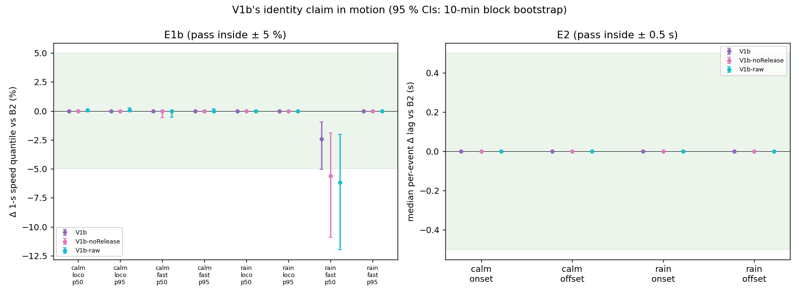
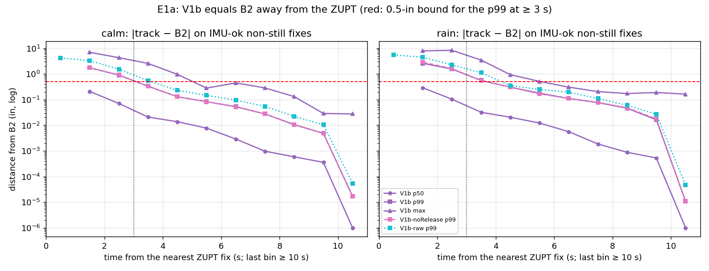
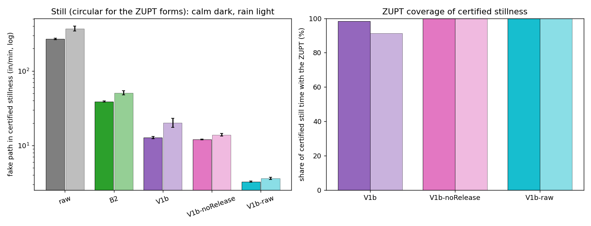
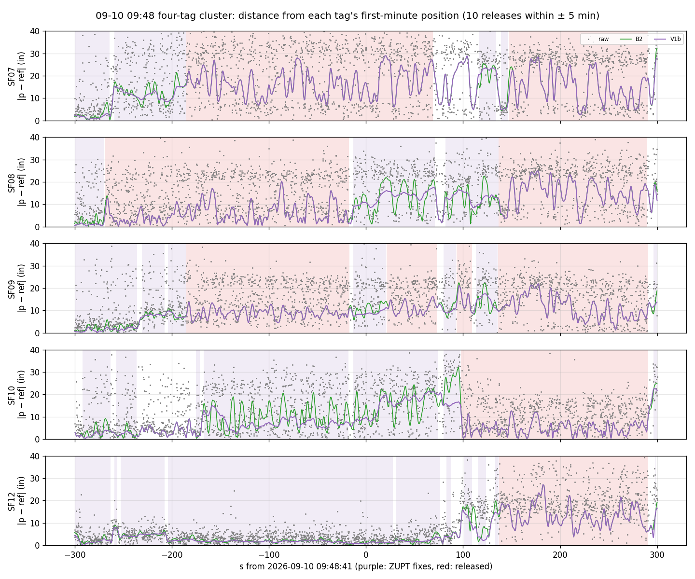
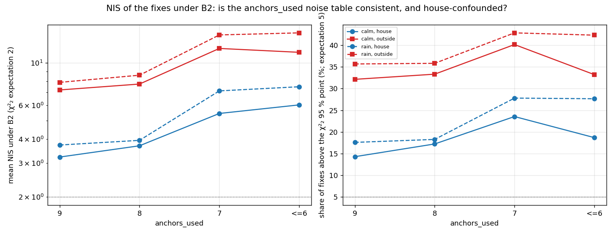

# V1b — B2 + a guarded head-IMU zero-velocity constraint (cohort 2026c)

**Step A of A → B → C** — approved by the user 2026-10-03 ("干吧"). Plan [`implementation_plan/2026-10-03-wiser-v1b-zupt.md`](../../../../implementation_plan/2026-10-03-wiser-v1b-zupt.md) (written before any V1b number; 5 amendments at its end, all made before any pooled V1b number); driver `wiser/scripts/analyze_wiser_v1b.py` (`--selftest` ALL PASS); config `wiser/configs/wiser_v1b_2026c.json` (verdict in its `decision` block); bulk `D:\Field2026_analysis_out\2026c\wiser_v1b_20261003_1124`; inputs = the failure audit run `D:/Field2026_analysis_out/2026c/wiser_failure_audit_20261002_1511` and the WISER fix caches (reused, not recomputed); git `44ce779+dirty`. Measurement report: no behavioural claim; WISER inch frame unverified (only distances and speeds used).

## Executive summary

1. **Verdict: V1b passes E1–E3 → V1b becomes the default WISER track for the implanted animals** (SF07–SF12 wherever the IMU QC passes; elsewhere it is B2 by construction); **B2 remains the universal baseline** (tags without an IMU, e.g. the five females released 09-11, and every IMU-failed stretch).
2. **E1a (position = B2 ≥ 3 s from any ZUPT fix):** p99 of |V1b − B2| = 0.020 in calm [0.018, 0.021] and 0.019 in rain [0.014, 0.025] (bound 0.5 in; max 2.59 | 3.51 in; 96 % | 97 % of the IMU-ok non-still fixes are ≥ 3 s from a ZUPT fix) → pass. The difference is local: p99 0.33 | 0.56 in at 3–4 s from a ZUPT fix, ≤ 0.18 in from 5 s on.
3. **E1b (1-s speed p50 / p95 vs B2, bound ± 5 %):** calm loco -0.00 % / +0.00 %; calm WISER-fast -0.02 % / +0.00 %; rain loco -0.03 % / -0.02 %; rain WISER-fast -2.44 % / +0.00 % → pass.
4. **E2 (median per-event lag change vs B2, bound ± 0.5 s):** calm onset 0.00 s [0.00, 0.00] (n 298); calm offset 0.00 s [0.00, 0.00] (n 275); rain onset 0.00 s [0.00, 0.00] (n 106); rain offset 0.00 s [0.00, 0.00] (n 110) → pass. The median hides a minority of shifted events (calm onset 16 % changed (mean 0.35 s); calm offset 19 % changed (mean -1.23 s); rain onset 25 % changed (mean 0.82 s); rain offset 29 % changed (mean -2.11 s)): onsets later, offsets earlier, about half of the changed offsets where B2's 3-in/s crossing lay inside the IMU-still run (E2 detail).
5. **E3 (jumps):** 0 in the certified ≥ 30-s segments, 0 over the analysis masks → pass.
6. **Still (circular — the IMU stillness drives the ZUPT and certifies the segments):** fake path B2 38.9 | 50.8 → V1b 12.8 | 20.0 in/min (calm | rain); per-fix RMS 1.60 | 2.65 → 1.25 | 2.29 in — σ_ZUPT = 1 in/s is a soft constraint: V1b removes 67 % | 61 % of B2's fake path (V1b-raw, σ 0.25 Gaussian: 3.3 | 3.6 in/min), and its Huber weight is < 1 at only 0.000 % | 0.004 % of the ZUPT fixes. **ZUPT coverage** of certified still time 98.3 % | 91.3 % (noRelease 99.9 % | 99.8 %; V1b-raw 100.0 % | 100.0 %).
7. **Releases:** 155 in total (108 inside certified segments — a cost: the head was certified still — and 47 outside); inside ≥ 30-s segments 0.536 | 2.126 per certified still-hour (calm | rain); the 09-10 09:48 cluster: 10 release(s) within ± 5 min (SF07, SF08, SF09, SF10, SF12).
8. **S3 (rain ≥ 12-in excursions, reported):** raw 6, B2 7, V1b 7 (noRelease 7, V1b-raw 4); V1b − B2 rate 0.000/still-h [0.000, 0.000].
9. **NIS under B2 (χ²₂ expectation 2):** calm all fixes mean 4.83 (20.8 % above the 95 % point); at 9 anchors house 3.23 vs outside 7.22 (rain 3.73 vs 7.90); mostly a motion effect — at 9 anchors, IMU-still house 2.38 vs outside 2.60, locomoting 8.02 vs 10.57 (calm): the anchors_used table is roughly consistent for a still tag and too small in motion (the constant-velocity q is stiff for runs), with a smaller residual house/outside gap at equal state (§6).
10. **Sensitivities (never the decision):** V1b-noRelease fails E1 (worst E1b -5.6 % at rain WISER-fast p50); V1b-raw fails E1 (worst E1b -6.2 % at rain WISER-fast p50).

## Pre-registered acceptance (E1–E3)

Point estimates decide; 95 % CIs from the 10-min block bootstrap are reported. All periods of the audit (calm-dry days 09-05/07/08 08:00–18:00 and nights 09-05…09-08 21:00–04:20; rain nights 09-03, 09-09 and day 09-10), SF07, SF08, SF09, SF10, SF12.

| claim | criterion | V1b | V1b-noRelease | V1b-raw |
|---|---|---|---|---|
| E1a calm | p99 \|track − B2\| ≤ 0.5 in, IMU-ok non-still mask fixes ≥ 3 s from a ZUPT fix | 0.020 [0.018, 0.021] ✓ | 0.020 [0.018, 0.021] ✓ | 0.035 [0.032, 0.038] ✓ |
| E1a rain | p99 \|track − B2\| ≤ 0.5 in, IMU-ok non-still mask fixes ≥ 3 s from a ZUPT fix | 0.019 [0.014, 0.025] ✓ | 0.019 [0.014, 0.025] ✓ | 0.032 [0.026, 0.038] ✓ |
| E1b calm IMU-locomoting | 1-s speed p50; p95 within ± 5 % of B2 | -0.00 % [+0.0 %, +0.0 %]; +0.00 % [+0.0 %, +0.0 %] ✓ | -0.00 % [+0.0 %, +0.0 %]; +0.00 % [+0.0 %, +0.0 %] ✓ | +0.05 % [+0.0 %, +0.0 %]; +0.05 % [+0.0 %, +0.3 %] ✓ |
| E1b calm WISER ≥ 10 in/s | 1-s speed p50; p95 within ± 5 % of B2 | -0.02 % [+0.0 %, +0.0 %]; +0.00 % [+0.0 %, +0.0 %] ✓ | -0.03 % [-0.6 %, +0.0 %]; +0.00 % [+0.0 %, +0.0 %] ✓ | -0.03 % [-0.6 %, +0.0 %]; +0.00 % [+0.0 %, +0.2 %] ✓ |
| E1b rain IMU-locomoting | 1-s speed p50; p95 within ± 5 % of B2 | -0.03 % [+0.0 %, +0.0 %]; -0.02 % [+0.0 %, +0.0 %] ✓ | -0.03 % [+0.0 %, +0.0 %]; -0.02 % [+0.0 %, +0.0 %] ✓ | +0.00 % [+0.0 %, +0.0 %]; -0.02 % [+0.0 %, +0.0 %] ✓ |
| E1b rain WISER ≥ 10 in/s | 1-s speed p50; p95 within ± 5 % of B2 | -2.44 % [-5.0 %, -0.9 %]; +0.00 % [+0.0 %, +0.0 %] ✓ | -5.62 % [-10.9 %, -1.9 %]; +0.00 % [+0.0 %, +0.0 %] ✗ | -6.19 % [-12.0 %, -2.0 %]; +0.00 % [+0.0 %, +0.0 %] ✗ |
| E2 calm onset | median per-event Δ lag within ± 0.5 s | 0.00 s [0.00, 0.00] ✓ | 0.00 s [0.00, 0.00] ✓ | 0.00 s [0.00, 0.00] ✓ |
| E2 calm offset | median per-event Δ lag within ± 0.5 s | 0.00 s [0.00, 0.00] ✓ | 0.00 s [0.00, 0.00] ✓ | 0.00 s [0.00, 0.00] ✓ |
| E2 rain onset | median per-event Δ lag within ± 0.5 s | 0.00 s [0.00, 0.00] ✓ | 0.00 s [0.00, 0.00] ✓ | 0.00 s [0.00, 0.00] ✓ |
| E2 rain offset | median per-event Δ lag within ± 0.5 s | 0.00 s [0.00, 0.00] ✓ | 0.00 s [0.00, 0.00] ✓ | 0.00 s [0.00, 0.00] ✓ |
| E3 | 0 jumps: certified ≥ 30-s segments / analysis masks | 0 / 0 ✓ | 0 / 0 ✓ | 0 / 0 ✓ |
| **outcome** | E1 ∧ E2 ∧ E3 | **PASS** — decides | **FAIL (E1)** — sensitivity | **FAIL (E1)** — sensitivity |

**Decision (pre-registered).** V1b passes E1–E3: V1b is the default WISER track for the implanted animals (IMU-QC-ok stretches; B2 elsewhere by construction), B2 the universal baseline.

**E1b reading.** The only visible speed change is at the median of the rain WISER-fast seconds (-2.44 %). 10 % | 19 % of the WISER-fast seconds (calm | rain) are IMU-still (WISER's library speed says ≥ 10 in/s while the head IMU says still); without them the change is +0.00 % / +0.00 % (calm) and -0.02 % / +0.00 % (rain), so the change comes from the ZUPT acting where the IMU says still, not from motion. The release keeps it inside the bound: without it (V1b-noRelease) the same quantile is -5.62 %.

**E1 profile** — |track − B2| on IMU-ok non-still analysis-mask fixes by time from the nearest ZUPT fix of the same track (in; p50 / p99 / max):

| time from ZUPT fix | n calm | V1b calm | V1b rain | V1b-noRelease calm (p99) | V1b-raw calm (p99) |
|---|---|---|---|---|---|
| 0–1 s | 0 | – / – / – | – / – / – | – | 4.261 |
| 1–2 s | 41,640 | 0.210 / 1.762 / 7.08 | 0.293 / 2.638 / 8.01 | 1.768 | 3.316 |
| 2–3 s | 33,382 | 0.071 / 0.908 / 4.35 | 0.104 / 1.563 / 8.44 | 0.920 | 1.538 |
| 3–4 s | 18,295 | 0.021 / 0.333 / 2.59 | 0.032 / 0.563 / 3.51 | 0.339 | 0.547 |
| 4–5 s | 15,570 | 0.014 / 0.130 / 0.97 | 0.021 / 0.308 / 0.94 | 0.130 | 0.231 |
| 5–6 s | 11,110 | 0.008 / 0.084 / 0.28 | 0.012 / 0.179 / 0.52 | 0.083 | 0.147 |
| 6–7 s | 11,015 | 0.003 / 0.053 / 0.45 | 0.006 / 0.111 / 0.31 | 0.053 | 0.096 |
| 7–8 s | 8,031 | 0.001 / 0.028 / 0.29 | 0.002 / 0.077 / 0.21 | 0.028 | 0.055 |
| 8–9 s | 7,403 | 0.001 / 0.011 / 0.13 | 0.001 / 0.046 / 0.17 | 0.011 | 0.022 |
| 9–10 s | 7,352 | 0.000 / 0.005 / 0.03 | 0.001 / 0.016 / 0.19 | 0.005 | 0.010 |
| ≥ 10 s | 1,760,163 | 0.000 / 0.000 / 0.03 | 0.000 / 0.000 / 0.16 | 0.000 | 0.000 |

**Reading.** The V1b − B2 difference is confined to the seconds next to a ZUPT interval and decays like the smoother's impulse response; E1a pools every IMU-ok non-still fix ≥ 3 s away, most of which are ≥ 10 s from any ZUPT fix, so its p99 is small. The 3–4-s bin alone has a p99 of 0.33 | 0.56 in (calm | rain); V1b-raw's differences are larger at every distance.

**E2 detail** (all periods; median lag of B2 and V1b, events defined for one track only):

| set | kind | events | B2 median lag (n) | V1b median lag (n) | paired | B2-only / V1b-only defined | paired events changed (later / earlier) | of which B2 crossed inside the still run | median Δ of the changed | mean Δ |
|---|---|---|---|---|---|---|---|---|---|---|
| calm | onset | 488 | 7.00 s (303) | 7.75 s (300) | 298 | 5 / 2 | 49 = 16.4 % (36 / 13) | 14 | 0.25 s | 0.35 s |
| calm | offset | 428 | -9.75 s (283) | -11.62 s (278) | 275 | 8 / 3 | 51 = 18.5 % (7 / 44) | 26 | -0.75 s | -1.23 s |
| rain | onset | 170 | 7.50 s (117) | 7.50 s (106) | 106 | 11 / 0 | 26 = 24.5 % (20 / 6) | 8 | 0.25 s | 0.82 s |
| rain | offset | 164 | -9.62 s (120) | -11.25 s (110) | 110 | 10 / 0 | 32 = 29.1 % (8 / 24) | 17 | -0.62 s | -2.11 s |

**Reading.** Most events are unchanged (the ZUPT is eroded 1 s inside the still run and the onset/offset speed crossing usually lies outside it), so the pre-registered median Δ is 0 everywhere. The changed minority moves in the expected direction — onsets later, offsets earlier — mostly by a few 0.25-s grid steps, with a tail that pulls the mean to −1 to −2 s at offsets; about half of the changed offsets are events where B2's 3-in/s crossing lay inside the IMU-still run (B2's jitter read as movement), which V1b suppresses. The marginal medians (B2 vs V1b columns) also differ because the defined-event sets differ.

## 1. Inputs and reproduction

| check | result |
|---|---|
| new kernel without ZUPT vs the pilot's B2 kernel (float64, every fix) | max 0.00e+00 in |
| B2 rebuilt here vs the audit's saved B2 (float32) | max 4.31e-05 in ≥ 60 s from the window edges, 4.31e-05 in over every fix |
| fixes = the audit's (fix cache rows, anchors, float32 raw) | rows all match; anchors all match; raw max 3.1e-05 in; segment fix counts 0 mismatching |
| still metrics of raw / B2 vs the audit's saved rows (8,320 segment × method rows) | max \|Δ\| RMS 0.00000 in, 10-s drift 0.0000 in, fake path 0.0000 in/min, events 0, jumps 0 |
| S5 events vs the default-smoother run | calm onset 488 (488); calm offset 428 (428); rain onset 170 (170); rain offset 164 (164) |
| B2 S5 median lag vs the default-smoother run | calm onset 7.00 (7.00) s; calm offset -9.75 (-9.75) s; rain onset 7.50 (7.50) s; rain offset -9.62 (-9.62) s |
| B2 1-s speed p50 / p95 vs the default-smoother run | calm loco 3.019 / 19.115 (3.019 / 19.115; n 88,875 (88,875)); calm wfast 8.562 / 25.338 (8.562 / 25.338; n 35,353 (35,353)); rain loco 3.174 / 18.361 (3.174 / 18.361; n 41,469 (41,469)); rain wfast 4.647 / 21.751 (4.647 / 21.751; n 24,183 (24,183)) |
| B2 S1 median held-out error (moving) vs the default-smoother run | calm (a) 4.3358 (4.3358) in; calm (s) 3.8633 (3.8633) in; rain (a) 4.9102 (4.9102) in; rain (s) 4.4089 (4.4089) in |
| B2 calm / rain fake path vs the default-smoother run | calm 38.90 (38.90) in/min; rain 50.82 (50.82) in/min |
| ZUPT fixes among window fixes (calm / rain) | V1b 43.6 % / 27.2 %; noRelease 44.2 % / 29.3 %; V1b-raw 46.2 % / 30.8 %; released 0.58 % / 2.14 % |
| Huber weight of the ZUPT (V1b, final pass) | < 1 at 0.00 % / 0.00 % of the ZUPT fixes; 1st percentile 1.000 / 1.000 |

## 2. Still metrics on the certified ≥ 30-s segments (reported; CIRCULAR for the ZUPT forms)

The IMU stillness that drives the ZUPT also certifies these segments: the ZUPT rows show what the constraint removes, not independent accuracy. Truth = the segment's median raw fix (drift is a lower bound). CIs: 10-min block bootstrap.

| set | method | still h | fake path in/min [CI] | fake speed p95 (in/s) | per-fix RMS (in) [CI] | p99 | 10-s drift med / p90 | 60-s drift med / p90 | ≥ 12-in events (/h) | jumps |
|---|---|---|---|---|---|---|---|---|---|---|
| calm | raw fixes | 74.6 | 268.2 [261.6, 275.4] | 11.70 | 5.57 [5.40, 5.74] | 18.3 | 1.50 / 3.81 | 0.60 / 1.83 | 3 (0.040) | 4108 |
| calm | B2 robust CV | 74.6 | 38.9 [38.2, 39.7] | 1.48 | 1.60 [1.54, 1.67] | 5.2 | 1.41 / 3.45 | 0.72 / 2.17 | 1 (0.013) | 0 |
| calm | V1b (guarded ZUPT) *(circular)* | 74.6 | 12.8 [12.4, 13.2] | 0.47 | 1.25 [1.18, 1.34] | 4.3 | 1.14 / 2.94 | 0.70 / 2.09 | 1 (0.013) | 0 |
| calm | V1b-noRelease *(circular)* | 74.6 | 12.0 [11.8, 12.2] | 0.45 | 1.21 [1.15, 1.28] | 4.1 | 1.14 / 2.92 | 0.70 / 2.11 | 1 (0.013) | 0 |
| calm | V1b-raw (original proposal) *(circular)* | 74.6 | 3.3 [3.2, 3.3] | 0.13 | 1.07 [1.00, 1.14] | 3.7 | 0.92 / 2.53 | 0.68 / 2.10 | 1 (0.013) | 0 |
| rain | raw fixes | 22.6 | 370.6 [343.3, 399.5] | 19.38 | 7.74 [7.18, 8.32] | 27.4 | 2.05 / 6.62 | 0.97 / 3.58 | 6 (0.266) | 4303 |
| rain | B2 robust CV | 22.6 | 50.8 [47.6, 54.3] | 2.14 | 2.65 [2.33, 3.00] | 10.8 | 1.91 / 5.50 | 1.17 / 4.49 | 7 (0.310) | 0 |
| rain | V1b (guarded ZUPT) *(circular)* | 22.6 | 20.0 [17.4, 23.1] | 0.99 | 2.29 [1.92, 2.65] | 9.9 | 1.57 / 4.73 | 1.11 / 4.38 | 7 (0.310) | 0 |
| rain | V1b-noRelease *(circular)* | 22.6 | 13.9 [13.3, 14.4] | 0.54 | 2.09 [1.77, 2.41] | 8.7 | 1.56 / 4.41 | 1.11 / 3.97 | 7 (0.310) | 0 |
| rain | V1b-raw (original proposal) *(circular)* | 22.6 | 3.6 [3.5, 3.7] | 0.15 | 1.91 [1.59, 2.22] | 8.3 | 1.29 / 3.88 | 1.08 / 3.92 | 4 (0.177) | 0 |

Day vs night (fake path in/min · per-fix RMS in · ≥ 12-in events · jumps):

| method | calm day | calm night | rain day | rain night |
|---|---|---|---|---|
| raw fixes | 270.2 · 5.60 · 3 · 3731 (64.3 h) | 255.9 · 5.36 · 0 · 377 (10.3 h) | 371.9 · 7.84 · 5 · 3530 (17.5 h) | 365.9 · 7.38 · 1 · 773 (5.0 h) |
| B2 robust CV | 38.9 · 1.61 · 1 · 0 (64.3 h) | 39.1 · 1.56 · 0 · 0 (10.3 h) | 50.7 · 2.73 · 7 · 0 (17.5 h) | 51.3 · 2.35 · 0 · 0 (5.0 h) |
| V1b (guarded ZUPT) | 12.8 · 1.26 · 1 · 0 (64.3 h) | 12.5 · 1.18 · 0 · 0 (10.3 h) | 20.6 · 2.38 · 7 · 0 (17.5 h) | 18.1 · 1.92 · 0 · 0 (5.0 h) |
| V1b-noRelease | 12.0 · 1.22 · 1 · 0 (64.3 h) | 12.1 · 1.14 · 0 · 0 (10.3 h) | 13.8 · 2.17 · 7 · 0 (17.5 h) | 14.3 · 1.79 · 0 · 0 (5.0 h) |
| V1b-raw (original proposal) | 3.3 · 1.08 · 1 · 0 (64.3 h) | 3.3 · 0.99 · 0 · 0 (10.3 h) | 3.6 · 1.98 · 4 · 0 (17.5 h) | 3.7 · 1.63 · 0 · 0 (5.0 h) |

**ZUPT coverage** (share of certified ≥ 30-s still time inside a ZUPT interval after the guards; fix share in parentheses):

| set | kind | still h | V1b | V1b-noRelease | V1b-raw | released h (V1b) |
|---|---|---|---|---|---|---|
| calm | all | 74.6 | 98.3 % (98.1 %) | 99.9 % (99.8 %) | 100.0 % (100.0 %) | 1.165 |
| calm | day | 64.3 | 98.2 % (97.9 %) | 99.9 % (99.8 %) | 100.0 % (100.0 %) | 1.091 |
| calm | night | 10.3 | 99.1 % (99.1 %) | 99.8 % (99.8 %) | 100.0 % (100.0 %) | 0.075 |
| rain | all | 22.6 | 91.3 % (92.1 %) | 99.8 % (99.8 %) | 100.0 % (100.0 %) | 1.929 |
| rain | day | 17.5 | 91.0 % (92.1 %) | 99.9 % (99.8 %) | 100.0 % (100.0 %) | 1.560 |
| rain | night | 5.0 | 92.4 % (92.1 %) | 99.7 % (99.6 %) | 100.0 % (100.0 %) | 0.369 |

The erosion removes 2 s per still run and runs < 3 s give no ZUPT, so V1b covers less of the certified time than V1b-raw by construction.

## 3. Release accounting

| set | releases | inside certified segments (≥ 30 s) | outside | per certified still-hour (≥ 30 s) | per hour of ZUPT interval | released time (h; inside certified) | in a house | median max offset (in) |
|---|---|---|---|---|---|---|---|---|
| calm | 70 | 50 (40) | 20 | 0.536 | 0.550 | 1.775 (1.266) | 100 % | 16.3 |
| rain | 85 | 58 (48) | 27 | 2.126 | 2.383 | 2.653 (2.119) | 92 % | 18.1 |
| all | 155 | 108 (88) | 47 | 0.905 | 0.951 | 4.428 (3.385) | 95 % | 16.9 |

A release inside a certified segment is a cost (the head was certified still, so the track followed WISER drift); outside, the release may have caught a real movement during IMU-still seconds or a WISER drift — the data here cannot tell which.

**09-10 09:48 four-tag cluster** (releases with the release time within ± 5 min of 2026-09-10 09:48:41):

| animal | release | ZUPT interval | stretch | max offset (in) | inside certified | house | anchors (median) |
|---|---|---|---|---|---|---|---|
| SF08 | 09:44:11 | 09:43:23 → 09:48:24 (301 s) | 5.5 s | 22.2 | yes (≥ 30 s) | yes | 6 |
| SF07 | 09:45:35 | 09:44:22 → 09:49:50 (328 s) | 6.0 s | 18.3 | yes (≥ 30 s) | yes | 6 |
| SF09 | 09:45:35 | 09:45:17 → 09:48:24 (187 s) | 5.0 s | 20.4 | no | yes | 6 |
| SF09 | 09:49:01 | 09:48:27 → 09:49:56 (89 s) | 6.2 s | 13.8 | yes (≥ 30 s) | yes | 5 |
| SF09 | 09:50:14 | 09:50:01 → 09:50:31 (30 s) | 15.0 s | 22.5 | yes | yes | 5 |
| SF10 | 09:50:18 | 09:50:01 → 09:53:32 (211 s) | 159.0 s | 30.0 | no | yes | 7 |
| SF09 | 09:50:57 | 09:50:34 → 09:53:32 (178 s) | 11.2 s | 22.2 | yes (≥ 30 s) | yes | 6 |
| SF08 | 09:50:57 | 09:50:03 → 09:53:31 (208 s) | 10.0 s | 15.3 | no | yes | 7 |
| SF12 | 09:50:57 | 09:50:54 → 09:53:32 (158 s) | 10.5 s | 20.6 | yes (≥ 30 s) | yes | 7 |
| SF07 | 09:51:07 | 09:51:00 → 09:53:31 (151 s) | 6.2 s | 22.1 | yes (≥ 30 s) | yes | 6 |

## 4. False-stillness probe

Pilot-still seconds (QC-ok ∧ 1-s still, analysis mask) that overlap no certified window or segment, vs comparison groups. D5 = B2 displacement over the 5 s centred on the second (in).

| set | group | seconds | share of pilot-still | D5 p50 / p90 / p99 | D5 > 6 in | D5 ≥ 12 in | with V1b ZUPT | noRelease | V1b-raw |
|---|---|---|---|---|---|---|---|---|---|
| calm | pilot-still, outside every certified window/segment | 93,573 | 19.6 % | 1.52 / 4.25 / 8.9 | 4.1 % | 0.27 % | 83.3 % | 84.4 % | 100.0 % |
| calm | pilot-still, inside a certified window/segment | 384,947 | 80.4 % | 1.25 / 3.06 / 6.6 | 1.4 % | 0.09 % | 97.1 % | 98.5 % | 100.0 % |
| calm | IMU-locomoting | 116,991 | – | 11.42 / 57.19 / 115.8 | 67.1 % | 48.83 % | 0.0 % | 0.0 % | 0.0 % |
| calm | IMU-active | 368,537 | – | 3.69 / 12.65 / 42.5 | 28.1 % | 10.69 % | 0.0 % | 0.0 % | 0.0 % |
| rain | pilot-still, outside every certified window/segment | 22,849 | 17.0 % | 2.16 / 5.91 / 12.9 | 9.6 % | 1.34 % | 75.3 % | 79.5 % | 100.0 % |
| rain | pilot-still, inside a certified window/segment | 111,750 | 83.0 % | 1.59 / 4.32 / 11.6 | 5.0 % | 0.92 % | 90.9 % | 98.6 % | 100.0 % |
| rain | IMU-locomoting | 54,499 | – | 12.09 / 56.53 / 116.2 | 70.5 % | 50.21 % | 0.0 % | 0.0 % | 0.0 % |
| rain | IMU-active | 178,459 | – | 4.20 / 14.14 / 41.5 | 33.8 % | 12.68 % | 0.0 % | 0.0 % | 0.0 % |
| all | pilot-still, outside every certified window/segment | 116,422 | 19.0 % | 1.62 / 4.61 / 10.0 | 5.2 % | 0.48 % | 81.8 % | 83.4 % | 100.0 % |
| all | pilot-still, inside a certified window/segment | 496,697 | 81.0 % | 1.31 / 3.33 / 8.0 | 2.2 % | 0.27 % | 95.7 % | 98.6 % | 100.0 % |
| all | IMU-locomoting | 171,490 | – | 11.65 / 56.95 / 116.0 | 68.2 % | 49.27 % | 0.0 % | 0.0 % | 0.0 % |
| all | IMU-active | 546,996 | – | 3.84 / 13.19 / 42.2 | 29.9 % | 11.34 % | 0.0 % | 0.0 % | 0.0 % |

Outside certification the rule's 'still' seconds include true stillness that the strict rule does not certify (short or slightly tilted poses), so this is an upper bound on false stillness; the D5 tail shows how much real displacement those seconds can carry.

## 5. S1 (held-out fixes) and S3 (rain excursions) — identity checks, reported

| set | scheme | subset | n | B2 median (in) | V1b median | D = 1 − med(V1b)/med(B2) [CI] | ZUPT share of scored fixes |
|---|---|---|---|---|---|---|---|
| calm | (a) | moving | 367,951 | 4.3358 | 4.3322 | +0.08 % [+0.00 %, +0.12 %] | 0.0 % |
| calm | (a) | still | 349,950 | 2.7557 | 2.6167 | +5.05 % | 94.6 % |
| calm | (a) | loco | 89,513 | 5.7204 | 5.7202 | +0.00 % | 0.0 % |
| calm | (a) | all | 717,901 | 3.4478 | 3.3585 | +2.59 % | 46.1 % |
| calm | (s) | moving | 368,051 | 3.8633 | 3.8624 | +0.02 % [+0.00 %, +0.13 %] | 0.0 % |
| calm | (s) | still | 350,153 | 2.6615 | 2.5926 | +2.59 % | 94.7 % |
| calm | (s) | loco | 89,514 | 4.8559 | 4.8560 | -0.00 % | 0.0 % |
| calm | (s) | all | 718,204 | 3.2071 | 3.1651 | +1.31 % | 46.2 % |
| rain | (a) | moving | 172,803 | 4.9102 | 4.9067 | +0.07 % [+0.00 %, +0.10 %] | 0.0 % |
| rain | (a) | still | 93,110 | 3.3310 | 3.1700 | +4.83 % | 90.1 % |
| rain | (a) | loco | 40,848 | 6.1998 | 6.1993 | +0.01 % | 0.0 % |
| rain | (a) | all | 265,913 | 4.2792 | 4.2054 | +1.72 % | 31.6 % |
| rain | (s) | moving | 173,556 | 4.4089 | 4.4093 | -0.01 % [-0.11 %, +0.00 %] | 0.0 % |
| rain | (s) | still | 93,238 | 3.2082 | 3.1389 | +2.16 % | 90.1 % |
| rain | (s) | loco | 41,087 | 5.3918 | 5.3918 | -0.00 % | 0.0 % |
| rain | (s) | all | 266,794 | 3.9416 | 3.9136 | +0.71 % | 31.5 % |

S3 — ≥ 12-in excursions (crazy-drift events) in the primary ≥ 30-s segments; rate differences per still-hour [95 % CI]:

| method | calm events | rain events | rain − raw | rain − B2 |
|---|---|---|---|---|
| raw fixes | 3 (0.040/h) | 6 (0.266/h) | 0.000 [0.000, 0.000] | -0.044 [-0.347, 0.214] |
| B2 robust CV | 1 (0.013/h) | 7 (0.310/h) | 0.044 [-0.214, 0.347] | 0.000 [0.000, 0.000] |
| V1b (guarded ZUPT) | 1 (0.013/h) | 7 (0.310/h) | 0.044 [-0.214, 0.347] | 0.000 [0.000, 0.000] |
| V1b-noRelease | 1 (0.013/h) | 7 (0.310/h) | 0.044 [-0.214, 0.347] | 0.000 [0.000, 0.000] |
| V1b-raw (original proposal) | 1 (0.013/h) | 4 (0.177/h) | -0.089 [-0.353, 0.190] | -0.133 [-0.355, 0.000] |

## 6. NIS diagnostic (Fable audit, point 4)

Normalised innovation squared of each fix under B2 (final forward pass, nominal anchors_used noise); consistent model: mean 2, median 1.39, 5 % above 5.99. Analysis-mask window fixes.

| set | anchors | zone | n | mean | median | > 95 % point | V1b mean |
|---|---|---|---|---|---|---|---|
| calm | 9 | house | 1,692,490 | 3.23 | 1.52 | 14.3 % | 3.38 |
| calm | 9 | outside | 815,761 | 7.22 | 3.19 | 32.1 % | 7.22 |
| calm | 8 | house | 664,020 | 3.69 | 1.73 | 17.2 % | 3.91 |
| calm | 8 | outside | 207,067 | 7.75 | 3.31 | 33.3 % | 7.75 |
| calm | 7 | house | 229,492 | 5.44 | 2.09 | 23.5 % | 5.87 |
| calm | 7 | outside | 51,675 | 11.87 | 4.10 | 40.1 % | 11.91 |
| calm | <=6 | house | 168,212 | 6.03 | 1.59 | 18.7 % | 6.32 |
| calm | <=6 | outside | 34,736 | 11.33 | 2.95 | 33.2 % | 11.34 |
| rain | 9 | house | 428,106 | 3.73 | 1.80 | 17.6 % | 3.86 |
| rain | 9 | outside | 333,591 | 7.90 | 3.66 | 35.7 % | 7.92 |
| rain | 8 | house | 385,401 | 3.94 | 1.78 | 18.3 % | 4.12 |
| rain | 8 | outside | 180,509 | 8.61 | 3.60 | 35.8 % | 8.65 |
| rain | 7 | house | 167,758 | 7.14 | 2.36 | 27.8 % | 7.79 |
| rain | 7 | outside | 55,987 | 13.96 | 4.51 | 42.8 % | 14.39 |
| rain | <=6 | house | 105,119 | 7.50 | 2.19 | 27.6 % | 7.89 |
| rain | <=6 | outside | 26,206 | 14.31 | 4.28 | 42.3 % | 14.40 |

By IMU state (B2; anchors 9 only; mean NIS (n)):

| zone | still calm | still rain | active calm | active rain | locomoting calm | locomoting rain | QC failed calm | QC failed rain |
|---|---|---|---|---|---|---|---|---|
| house | 2.38 (1,105,747) | 3.03 (148,200) | 4.16 (478,091) | 4.78 (138,744) | 8.02 (90,896) | 7.87 (22,757) | 6.46 (17,756) | 2.58 (118,405) |
| outside | 2.60 (21,686) | 4.65 (14,718) | 5.62 (513,013) | 6.74 (211,270) | 10.57 (247,884) | 10.79 (97,466) | 9.87 (33,178) | 9.13 (10,137) |

**Reading.** The noise table is roughly consistent for a still tag (mean ≈ 2.4–2.6 at 9 anchors in calm) and increasingly too optimistic as the head moves (active ≈ 4–6, locomoting ≈ 8–11): the innovation then also contains the motion the constant-velocity model did not predict, so the excess is a motion-model effect as much as a noise-table one. At equal IMU state the outside fixes are still somewhat worse than the house fixes; most of the house/outside gap in the anchors × zone table is the larger share of motion outside. Rain raises every stratum; 3–4 anchors are the worst.

By exact anchors_used (B2, calm | rain; mean NIS, n):

| anchors_used | calm | rain |
|---|---|---|
| 3 | 18.69 (10,826) | 21.92 (4,810) |
| 4 | 11.92 (21,934) | 11.85 (12,162) |
| 5 | 4.16 (46,355) | 5.77 (27,969) |
| 6 | 6.07 (123,833) | 8.71 (86,384) |
| 7 | 6.62 (281,167) | 8.84 (223,745) |
| 8 | 4.66 (871,087) | 5.43 (565,910) |
| 9 | 4.52 (2,508,251) | 5.56 (761,697) |

## Do not do

- Do not read the still-period gains of V1b as evidence that the IMU makes WISER more accurate: the IMU stillness that drives the ZUPT also certifies the test segments.
- Do not read E1 as accuracy in motion: it tests that V1b equals B2 there; B2 is not the truth (step B builds an independent speed reference).
- Do not run V1b on tags without a head IMU (the five females released 09-11) or through IMU-failed stretches as if it were different from B2 there: it is B2 by construction.
- Do not promote V1b-noRelease or V1b-raw from this report: sensitivities only; a passing variant is a proposal to the user.
- Do not treat a release as proof that the rat moved: inside certified stillness a release followed WISER drift.
- Do not generalise the still numbers to the open field (most certified stillness is inside the houses) or to other cohorts without re-running.
- Do not place positions in the paddock: distances are in the unverified WISER inch frame.
- Do not use the anchors_used noise table as calibrated where the NIS says otherwise (§6).

## Definitions

All positions are WISER **inches in the unverified offset frame**; only distances and speeds (frame-invariant) are used.
Times are field-PC local (EDT). $k$ indexes the fixes of one tag; $\mathbf z_k$ = raw fix (in); $\hat{\mathbf p}^{(m)}_k$ =
method $m$'s position at fix $k$; $t_k=t_k^{\text{WISER}}-\tau^*$ = fix time aligned on the IMU clock ($\tau^*$ =
0.20 / 0.15 / 0.10 / 0.20 / 0.15 s for SF07 / 08 / 09 / 10 / 12); $s$ = an integer field-PC second.

### B2 (reference and base)
Per axis a constant-velocity state $\mathbf x_k=(p_k,v_k)$, $\mathbf x_k=F_k\mathbf x_{k-1}+\boldsymbol\eta_k$,
$F_k=\begin{pmatrix}1&\Delta t_k\\0&1\end{pmatrix}$, $\mathrm{Cov}(\boldsymbol\eta_k)=q\begin{pmatrix}\Delta t^3/3&\Delta t^2/2\\\Delta t^2/2&\Delta t\end{pmatrix}$,
$q$ = 3 in²/s³; fix $z_k=p_k+\varepsilon_k$, $\varepsilon_k\sim\mathcal N(0,\sigma^2_{\mathrm{ax}}(A_k)/w_k)$ with $A_k$ = `anchors_used`
and $\sigma_{\mathrm{ax}}$ the smoothing pilot's robust per-anchor SD. Pass 0: forward Kalman filter with a soft χ² gate
(the fix variance is inflated by $d^2/13.82$ when the 2-D innovation $d^2$ exceeds the χ²₂ 0.999 point) + RTS smoother;
passes 1–2: Huber weights $w_k=\min(1,\,2.5/m_k)$, $m_k=\big(\sum_a (z_{k,a}-\hat p_{k,a})^2/\sigma^2_a(A_k)\big)^{1/2}$ from the smoothed
residuals. **Text:** the default WISER smoother of 2026c (default-smoother step).

### V1b
B2 plus, at every fix $k$ inside a ZUPT interval, the pseudo-measurements $0=v_{k,a}+\epsilon_{k,a}$ ($a=x,y$),
$\epsilon\sim\mathcal N(0,\sigma_Z^2/w^Z_k)$, $\sigma_Z$ = 1.0 in/s, applied after the fix update in the same forward pass.
Huber weight in the same IRLS passes as the fixes (pass 0: $w^Z_k=1$):
$$ w^Z_k=\min\!\Big(1,\ \frac{2.5}{m^Z_k}\Big),\qquad m^Z_k=\frac{\lVert\hat{\mathbf v}_k\rVert}{\sigma_Z} $$
with $\hat{\mathbf v}_k$ the smoothed velocity of the previous pass. **Text:** where the head IMU says still, B2 is told the
velocity is zero, but a velocity the fixes insist on (> 2.5 in/s) is listened to with a falling weight. Nothing else
changes; where the IMU is not usable there is no pseudo-measurement, so the same filter runs B2 dynamics (no splice).

### ZUPT intervals and membership
$\text{still}(s)$ = QC-ok ∧ $\overline{\text{VeDBA}}_{1s}<\theta_a$ ∧ $\overline{|\boldsymbol\omega|}_{1s}<10$ °/s (pilot rule).
A run $[s_a,s_b)$ of $n=s_b-s_a$ consecutive still seconds gives, if $n\ge3$, the interval $I=[s_a+1,\,s_b-1)$ ($n-2$ s);
runs with $n<3$ give none. Fix $k$ is a ZUPT fix of $I$ when $t_k\in I$. The ± 10-min margins have no IMU seconds → no ZUPT.

### Release
For an interval $I=[e_0,e_1)$: reference $\mathbf r=\operatorname{med}\{\mathbf z_k: t_k\in[e_0,e_0+5)\}$ (coordinate-wise; if
fewer than 10 fixes there, the first 10 fixes of $I$); centres $c\in\{e_0, e_0+0.25, \dots\}<e_1$;
$$ \mathbf m(c)=\operatorname{med}\{\mathbf z_k:\ t_k\in[c-2.5,\,c+2.5)\}\quad(\ge5\text{ fixes, else undefined}),\qquad
   D(c)=\lVert\mathbf m(c)-\mathbf r\rVert . $$
A stretch = a maximal run of consecutive centres with $D(c)\ge12$ in (an undefined centre ends it); the first stretch whose
span (last − first centre) exceeds 5 s releases $I$ from its first centre $c^\ast$: fixes with $t_k\ge c^\ast$ in $I$
get no ZUPT. **Text:** if raw WISER holds a ≥ 1-ft offset for more than 5 s inside a still run, the constraint lets the
track follow it (either the head moved despite the IMU, or WISER drifted — the release cannot tell which).

### Sensitivities
V1b-noRelease: V1b without the release. V1b-raw: a ZUPT at every fix whose aligned second is still (no erosion, no
minimum run), Gaussian $\sigma_Z$ = 0.25 in/s, no release (the original proposal). Neither can become the default here.

### E1 — identical to B2 in motion
Base set $\mathcal B$ = window fixes whose aligned second is in the analysis mask (window, no handling ± 5 min, no
all-tag silence ± 120 s, tag valid), IMU-QC-ok and not still. $\delta_k=\lVert\hat{\mathbf p}^{(V1b)}_k-\hat{\mathbf p}^{(B2)}_k\rVert$,
$\tau_k=\min_{j\in\mathcal Z}|t_k-t_j|$ with $\mathcal Z$ the V1b ZUPT fixes (after release).
**E1a:** $Q_{0.99}\{\delta_k: k\in\mathcal B,\ \tau_k\ge3\text{ s}\}\le0.5$ in, calm and rain separately.
**E1b:** with $v_m(s)=\lVert\tilde{\mathbf p}^{(m)}(s+1)-\tilde{\mathbf p}^{(m)}(s)\rVert/1$ s ($\tilde{\mathbf p}$ = linear interpolation
inside inter-fix gaps ≤ 1 s), $\Delta_q=Q_q[v_{V1b}]/Q_q[v_{B2}]-1$ for $q\in\{0.5,0.95\}$ on (i) IMU-locomoting seconds and
(ii) seconds whose WISER library 1-s median speed is ≥ 10 in/s inside the analysis mask (seconds where any track is undefined
dropped for all); pass if $|\Delta_q|\le0.05$ for both quantiles, subsets and sets. **Text:** V1b claims to be B2 wherever
the head is not still; E1 tests that identity (it does not test that B2 is right).

### E2 — transitions not shifted
Events (default-smoother S5): an IMU still run $[a,b)$ ≥ 10 s followed (onset) / preceded (offset) within 60 s by a
locomoting second $s_L$ (no still run or unusable second in between, ≥ 10 s from the window edges). With $v_m(g)$ the 1-s
centred speed on a 0.25-s grid:
$$ \lambda^{\text{on}}_m=\min\{g\in[b-5,\,s_L+20]:v_m(g)\ge3\}-b,\qquad \lambda^{\text{off}}_m=\max\{g\in[s_L-20,\,a+10]:v_m(g)\ge3\}+0.25-a $$
(s); $\Delta\lambda=\lambda_{V1b}-\lambda_{B2}$ per event (events where both are defined). Pass if the median $\Delta\lambda$ lies
within ± 0.5 s for onsets and offsets, calm and rain (all periods). **Text:** the constraint must not make the track start
later or stop earlier than B2.

### E3 — no jumps
Jump: consecutive fixes with $\lVert\hat{\mathbf p}_{k+1}-\hat{\mathbf p}_k\rVert>30$ in and $t_{k+1}-t_k\le0.35$ s. Pass if 0 in the
primary ≥ 30-s certified segments (calm and rain) and 0 over the analysis mask of every period (pair midpoint second).

### Still metrics (reported; circular for V1b)
On the failure audit's certified ≥ 30-s segments (gate-v2 strict on 09-08, S50 elsewhere; 1 s trimmed), truth
$\mathbf c_\sigma=\operatorname{med}_{k\in\sigma}\mathbf z_k$: per-fix $r_k=\lVert\hat{\mathbf p}_k-\mathbf c_\sigma\rVert$, RMS $=(\frac1N\sum r_k^2)^{1/2}$ and p99
of $r_k$ (in); rolling-median drift $d^{(L)}_\sigma=\max_c\lVert\operatorname{med}_{t_k\in[c-L/2,c+L/2)}\hat{\mathbf p}_k-\mathbf c_\sigma\rVert$
($L$ = 10 s, ≥ 10 fixes; 60 s, ≥ 60 fixes, segments ≥ 120 s; median and p90 over segments); ≥ 12-in excursion = ≥ 10
consecutive 1-s centres with the 10-s median ≥ 12 in from $\mathbf c_\sigma$; fake path
$\Pi=\sum_s\lVert\tilde{\mathbf p}(s+1)-\tilde{\mathbf p}(s)\rVert/(N_s/60)$ (in/min, pooled). **Circular:** the IMU stillness that drives
the ZUPT also certifies these segments, so they show what the constraint removes, not independent accuracy.

### ZUPT coverage
$$ \kappa=\frac{\sum_\sigma\big|\,\bigcup_I I^{\text{fin}}\cap[t^0_\sigma+1,\,t^1_\sigma-1)\big|}{\sum_\sigma D_\sigma} $$
with $I^{\text{fin}}=[e_0,\min(e_1,c^\ast))$ the ZUPT intervals after the release and $D_\sigma$ the trimmed durations of the
certified ≥ 30-s segments. **Text:** the share of certified still time that actually receives the constraint after the guards.

### Release accounting
A release is inside a certified segment when $c^\ast$ lies in a primary certified segment (≥ 10 s; the ≥ 30-s subset
reported); there the head is certified still, so the release followed WISER drift — a cost. Rate = releases inside ≥ 30-s
segments per certified still-hour.

### False-stillness probe
Pilot-still seconds (QC-ok ∧ still, analysis mask) that overlap no primary certified window (≥ 1 s) or segment (≥ 10 s).
WISER 5-s displacement $D_5(s)=\lVert\tilde{\mathbf p}^{(B2)}(s+3)-\tilde{\mathbf p}^{(B2)}(s-2)\rVert$ (5 s centred on the second);
compared with pilot-still seconds inside certification and with IMU-locomoting / active seconds. **Text:** how often the
1-s still class may be wrong, and how much of it the guards keep away from the ZUPT.

### S1 — held-out error (identity check)
The default-smoother masks and seeds: (a) runs of 4–8 hidden fixes separated by 1–47 visible ones, (s) every 5th fix;
B2 and V1b are rerun with the hidden fixes invisible (the release sees only visible fixes); $e_k=\lVert\mathbf z_k-\hat{\mathbf p}_{-}(t_k)\rVert$
on hidden window fixes with ≥ 7 anchors and the aligned second QC-ok; $D=1-\operatorname{med}e^{(V1b)}/\operatorname{med}e^{(B2)}$ on the
moving (not still) subset. Expected ≈ 0.

### NIS
For each visible fix, in the final forward pass of the smoother, with the predicted state and the nominal (unweighted)
anchors_used noise:
$$ \text{NIS}_k=\sum_{a\in\{x,y\}}\frac{(z_{k,a}-\hat p^{-}_{k,a})^2}{P^{-}_{k,aa}+\sigma^2_a(A_k)} $$
Under a consistent model $\text{NIS}_k\sim\chi^2_2$: mean 2, median 1.39, 5 % above 5.99. Strata: anchors_used {≤ 6, 7, 8, 9}
× zone (house = the B2 position inside a house ROI grown by 14 in; else outside) × IMU state of the aligned second.
**Text:** a mean above 2 means the noise table under-states the error there (or the motion model is too stiff); a strata
pattern by zone at equal anchors means the table is house-confounded.

### Block bootstrap
$\theta^{*(b)}=\theta(\{\text{10-min animal-period blocks drawn with replacement within the set}\})$, $b$ = 1..1000; CI =
2.5–97.5 % of $\theta^*$; paired comparisons use the same draw for both methods; quantiles inside the bootstrap use
histograms (0.001 in for the E1a distance, 0.05 in/s for speeds, 0.005 in for held-out errors); point estimates are exact.

## Caveats

- The pilot's B2 parameters were tuned on 2026-09-08/09, one of the calm audit nights.
- Still metrics are circular; certified stillness is ≥ 95 % inside the houses; truth is the segment's own WISER median (drift is a lower bound).
- B2 is not the truth in motion: E1 tests identity with B2, not correctness of either.
- E1 is decided on point estimates (pre-registered); the bootstrap CI of V1b reaches the ± 5 % bound at: rain WISER-fast p50 -2.44 % [-5.0 %, -0.9 %] (the IMU-still seconds inside the WISER-fast subset, see the E1b reading).
- The 1-s pilot still class has an unknown false-still rate; the erosion, the 3-s minimum run, the Huber weight and the release address it only partly (§4).
- S5 lags are defined only where the speed reaches 3 in/s; the paired medians use events where both tracks are defined.
- The rain set is three weather episodes; block CIs treat 10-min blocks as independent within a set.
- NIS uses the final forward pass with the nominal noise: Huber-down-weighted fixes still enter with their nominal variance, so outliers show up as large NIS by design.

## Files

Bulk `D:\Field2026_analysis_out\2026c\wiser_v1b_20261003_1124`: `tracks/<SFxx>_<period>.npz` (B2, V1b, V1b-noRelease, V1b-raw at every fix; ZUPT / noRelease / raw / released masks; ZUPT Huber weights; NIS under B2 and V1b; analysis mask, IMU state, zone; |track − B2| and time to the nearest ZUPT fix), `seconds/` (per-second speeds, library speed, certification and ZUPT flags, D5), `speeds/` (still fake speeds), `s1/` (held-out errors), `tables/` (e1a_position, e1_profile, e1b_speed, e2_events, e2_lags, e3_motion_jumps, e3_jumps_by_set, still_metrics, still_fixes, still_pooled, still_setkind, still_bootstrap, s3_excursions, zupt_coverage(_segments), releases(_summary, _cluster), false_still_probe, s1_heldout, nis, reproduction_tracks), `summary.json`, `input_provenance.json`, logs. Re-aggregate without recomputing: `python wiser/scripts/analyze_wiser_v1b.py --report-only <run_dir>`. Pointer: `results/2026c/wiser_baseline/reports/run_manifest_v1b_2026c.json`.
