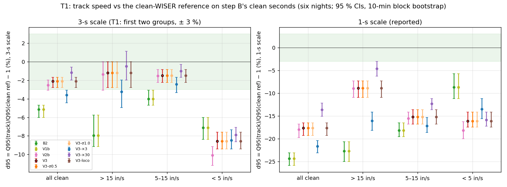
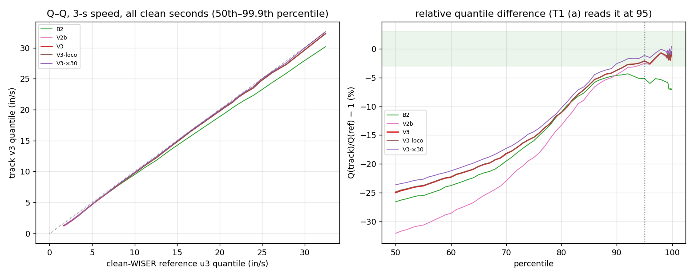
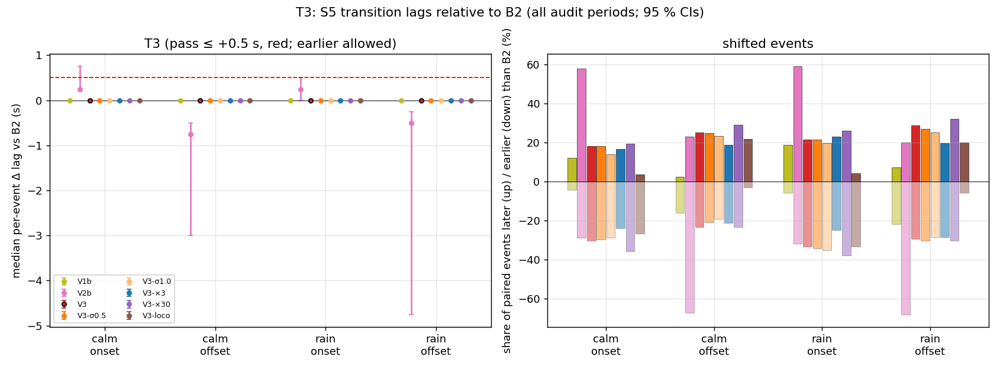
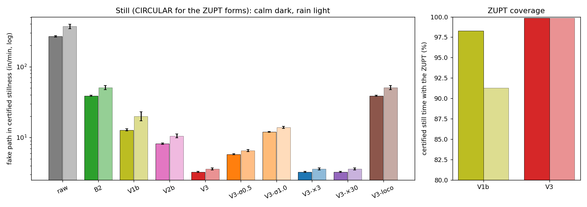
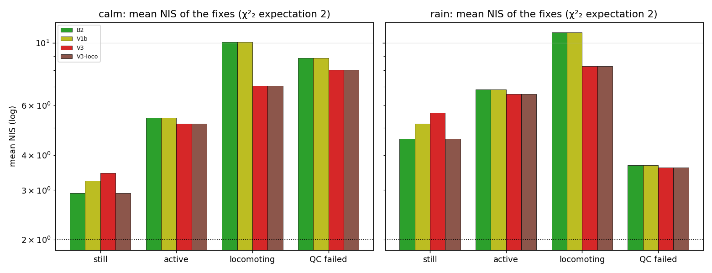

# V3 — B2 with a firm head-IMU ZUPT and locomotion-boosted process noise (cohort 2026c)

Approved by the user 2026-10-03 ("做"). Plan [`implementation_plan/2026-10-03-wiser-v3.md`](../../../../implementation_plan/2026-10-03-wiser-v3.md) (written and committed, 26a1cb8, before any V3 number; amendments at its end); driver `wiser/scripts/analyze_wiser_v3.py` (`--selftest` ALL PASS); config `wiser/configs/wiser_v3_2026c.json` (verdict in its `decision` block); bulk `D:\Field2026_analysis_out\2026c\wiser_v3_20261003_1425`; inputs = the failure audit run, the WISER fix caches, the default-smoother, V1b and step-B runs (reused, not recomputed); git `f061def+dirty`. Measurement report: no behavioural claim; WISER inch frame unverified (only distances and speeds used). Nothing was tuned in this step.

## Executive summary

1. **Verdict: V3 passes T1–T3 → V3 replaces V1b as the default WISER track for the implanted animals** (SF07–SF12 wherever the IMU QC passes; elsewhere it is B2 by construction); **B2 stays the universal baseline** (tags without an IMU, e.g. the five females released 09-11, and every IMU-failed stretch).
2. **T1 (3-s p95 speed vs the clean-WISER reference, bound ± 3 %):** (a) all clean seconds -2.1 % [-2.8 %, -1.7 %], (b) > 15 in/s band -1.2 % [-2.8 %, +0.0 %] (n 82,041 / 2,177 seconds) → pass. Context: B2 -5.2 % / -8.0 %, V1b -5.2 % / -8.0 %, V2b -2.5 % / -1.4 %.
3. **T2 (jumps):** 0 in the primary certified still segments (0 in the ≥ 30-s ones), 0 over the analysis masks → pass.
4. **T3 (median per-event lag change vs B2, bound ≤ +0.5 s):** calm onset 0.00 s [0.00, 0.00] (18 % later / 30 % earlier of 302); calm offset 0.00 s [0.00, 0.00] (25 % later / 23 % earlier of 279); rain onset 0.00 s [0.00, 0.00] (22 % later / 33 % earlier of 111); rain offset 0.00 s [0.00, 0.00] (29 % later / 30 % earlier of 115) → pass.
5. **Still (circular — the IMU stillness drives the ZUPT and certifies the segments):** fake path B2 38.9 | 50.8, V1b 12.8 | 20.0, **V3 3.3 | 3.6 in/min** (calm | rain); per-fix RMS B2 1.60 | 2.65 → V3 1.07 | 1.89 in; ZUPT coverage of certified still time 99.9 % | 99.8 % (V1b after its release 98.3 % | 91.3 %); the ZUPT Huber weight is < 1 at 0.0001 % | 0.0010 % of the ZUPT fixes (the firm ZUPT keeps the smoothed velocity below 2.5 σ_Z = 0.625 in/s, so the Huber guard almost never acts).
6. **In-place jitter check:** (i) on IMU-active fixes ≥ 3 s from any locomoting step or ZUPT fix (calm 57 % of the active fixes) |V3 − B2| p99 = 0.159 | 0.225 in (calm | rain); 1-s speed p50 / p95 vs B2 -0.1 % / +0.0 % (calm). (ii) on clean IMU-locomoting seconds below the floor (u3 < 1.64 in/s; n 5,404) V3's 1-s speed p50 / p95 is +62.1 % / +68.9 % relative to B2 (V3-loco +62.1 % / +68.9 %).
7. **NIS by IMU state (calm, mean; χ²₂ expectation 2):** B2 still 2.93 / active 5.42 / locomoting 10.09; V1b 3.23 / 5.42 / 10.09; **V3 3.45 / 5.18 / 7.05** (rain V3 5.66 / 6.58 / 8.27).
8. **S1 (held-out moving fixes, scheme (a)):** D(V3) = +1.0 % [+0.8 %, +1.3 %] calm, +0.4 % [+0.1 %, +0.7 %] rain (positive = closer than B2). **S3 (rain ≥ 12-in excursions):** raw 6, B2 7, V1b 7, V3 4.
9. **Sensitivities (never the decision):** V3-σ0.5 passes (T1 -2.1 % / -1.2 %); V3-σ1.0 passes (T1 -2.1 % / -1.2 %); V3-×3 fails T1 (T1 -3.6 % / -3.2 %); V3-×30 passes (T1 -1.1 % / -0.5 %); V3-loco passes (T1 -2.1 % / -1.2 %) → proposal to the user only: V3-σ0.5, V3-σ1.0, V3-×30, V3-loco. Context tracks on T1–T3: B2 fail T1; V1b fail T1; V2b fail T2.

## Pre-registered acceptance (T1–T3)

Point estimates decide; 95 % CIs from the 10-min block bootstrap are reported. T1 on step B's clean seconds of the six nights (09-03, 09-05 … 09-09; 21:00–04:20); T2 and T3 over every audit period (calm-dry days 09-05/07/08 08:00–18:00 and nights 09-05…09-08; rain nights 09-03, 09-09 and day 09-10), SF07, SF08, SF09, SF10, SF12.

| criterion | bound | V3 | V3-σ0.5 | V3-σ1.0 | V3-×3 | V3-×30 | V3-loco | B2 | V1b | V2b |
|---|---|---|---|---|---|---|---|---|---|---|
| T1a 3-s p95, all clean | ± 3 % | -2.1 % [-2.8 %, -1.7 %] ✓ | -2.1 % [-2.8 %, -1.7 %] ✓ | -2.1 % [-2.8 %, -1.7 %] ✓ | -3.6 % [-4.4 %, -3.1 %] ✗ | -1.1 % [-2.0 %, -0.6 %] ✓ | -2.1 % [-2.8 %, -1.7 %] ✓ | -5.2 % [-6.0 %, -4.7 %] ✗ | -5.2 % [-6.0 %, -4.7 %] ✗ | -2.5 % [-3.1 %, -2.0 %] ✓ |
| T1b 3-s p95, > 15 in/s | ± 3 % | -1.2 % [-2.8 %, +0.0 %] ✓ | -1.2 % [-2.8 %, +0.0 %] ✓ | -1.2 % [-2.8 %, +0.0 %] ✓ | -3.2 % [-5.0 %, -2.0 %] ✗ | -0.5 % [-2.0 %, +1.1 %] ✓ | -1.2 % [-2.8 %, +0.0 %] ✓ | -8.0 % [-9.2 %, -5.8 %] ✗ | -8.0 % [-9.2 %, -5.8 %] ✗ | -1.4 % [-3.1 %, +0.0 %] ✓ |
| T2 jumps: still segments / masks | 0 / 0 | 0 / 0 ✓ | 0 / 0 ✓ | 0 / 0 ✓ | 0 / 0 ✓ | 0 / 0 ✓ | 0 / 0 ✓ | 0 / 0 ✓ | 0 / 0 ✓ | 0 / 3 ✗ |
| T3 calm onset: median Δ lag (s) | ≤ +0.5 | 0.00 [0.00, 0.00] ✓ | 0.00 [0.00, 0.00] ✓ | 0.00 [0.00, 0.00] ✓ | 0.00 [0.00, 0.00] ✓ | 0.00 [0.00, 0.00] ✓ | 0.00 [0.00, 0.00] ✓ | 0.00 [0.00, 0.00] ✓ | 0.00 [0.00, 0.00] ✓ | 0.25 [0.25, 0.75] ✓ |
| T3 calm offset: median Δ lag (s) | ≤ +0.5 | 0.00 [0.00, 0.00] ✓ | 0.00 [0.00, 0.00] ✓ | 0.00 [0.00, 0.00] ✓ | 0.00 [0.00, 0.00] ✓ | 0.00 [0.00, 0.00] ✓ | 0.00 [0.00, 0.00] ✓ | 0.00 [0.00, 0.00] ✓ | 0.00 [0.00, 0.00] ✓ | -0.75 [-3.00, -0.50] ✓ |
| T3 rain onset: median Δ lag (s) | ≤ +0.5 | 0.00 [0.00, 0.00] ✓ | 0.00 [0.00, 0.00] ✓ | 0.00 [0.00, 0.00] ✓ | 0.00 [0.00, 0.00] ✓ | 0.00 [0.00, 0.00] ✓ | 0.00 [0.00, 0.00] ✓ | 0.00 [0.00, 0.00] ✓ | 0.00 [0.00, 0.00] ✓ | 0.25 [0.00, 0.50] ✓ |
| T3 rain offset: median Δ lag (s) | ≤ +0.5 | 0.00 [0.00, 0.00] ✓ | 0.00 [0.00, 0.00] ✓ | 0.00 [0.00, 0.00] ✓ | 0.00 [0.00, 0.00] ✓ | 0.00 [0.00, 0.00] ✓ | 0.00 [0.00, 0.00] ✓ | 0.00 [0.00, 0.00] ✓ | 0.00 [0.00, 0.00] ✓ | -0.50 [-4.75, -0.25] ✓ |
| **outcome** | T1 ∧ T2 ∧ T3 | **PASS** — decides | **PASS** — sensitivity | **PASS** — sensitivity | **FAIL (T1)** — sensitivity | **PASS** — sensitivity | **PASS** — sensitivity | **FAIL (T1)** — context | **FAIL (T1)** — context | **FAIL (T2)** — context |

**Decision (pre-registered).** V3 passes T1–T3: V3 replaces V1b as the default WISER track for the implanted animals (IMU-QC-ok stretches; B2 elsewhere by construction); B2 stays the universal baseline. Sensitivities that would pass (V3-σ0.5, V3-σ1.0, V3-×30, V3-loco) are a proposal to the user, not a default.

### T1 detail — clean-WISER reference (all six nights; d = Q(track)/Q(ref) − 1)

| scale | band | n | ref p50 / p95 (in/s) | V3 d50; d95 | V3-loco d50; d95 | B2 d50; d95 | V1b d50; d95 | V2b d50; d95 |
|---|---|---|---|---|---|---|---|---|
| 3 s | all | 82,041 | 1.68 / 11.09 | -25.0 %; -2.1 % | -24.9 %; -2.1 % | -26.6 %; -5.2 % | -26.7 %; -5.2 % | -32.1 %; -2.5 % |
| 3 s | < 5 | 69,377 | 1.40 / 4.02 | -26.8 %; -8.6 % | -26.4 %; -8.6 % | -28.1 %; -7.1 % | -28.5 %; -7.1 % | -34.1 %; -10.1 % |
| 3 s | 5–15 | 10,487 | 7.66 / 13.67 | -3.2 %; -1.5 % | -3.2 %; -1.5 % | -5.1 %; -4.0 % | -5.1 %; -4.0 % | -3.9 %; -1.5 % |
| 3 s | > 15 | 2,177 | 19.21 / 31.59 | -0.7 %; -1.2 % | -0.7 %; -1.2 % | -5.8 %; -8.0 % | -5.8 %; -8.0 % | -0.8 %; -1.4 % |
| 1 s | all | 75,639 | 3.86 / 14.96 | -57.4 %; -17.6 % | -57.3 %; -17.6 % | -60.3 %; -24.4 % | -60.5 %; -24.4 % | -64.6 %; -18.0 % |
| 1 s | < 5 | 47,618 | 2.59 / 4.68 | -55.0 %; -16.1 % | -54.7 %; -16.1 % | -56.6 %; -8.7 % | -57.0 %; -8.7 % | -62.8 %; -18.1 % |
| 1 s | 5–15 | 24,272 | 7.26 / 13.19 | -58.1 %; -15.2 % | -58.1 %; -15.2 % | -63.7 %; -18.2 % | -63.7 %; -18.2 % | -64.2 %; -15.5 % |
| 1 s | > 15 | 3,749 | 20.27 / 38.60 | -13.6 %; -8.9 % | -13.6 %; -8.9 % | -25.6 %; -22.7 % | -25.6 %; -22.7 % | -14.1 %; -9.0 % |

Calm vs rain nights (3-s scale, V3 d95 all / > 15 in/s; B2 in parentheses):

| set | n | V3 d95 all | V3 d95 > 15 | V3 d50 5–15 | MAE V3 (B2) in/s |
|---|---|---|---|---|---|
| all | 82,041 | -2.1 % (-5.2 %) | -1.2 % (-8.0 %) | -3.2 % (-5.1 %) | 0.45 (0.50) |
| calm | 61,652 | -2.5 % (-5.8 %) | -1.7 % (-8.8 %) | -2.4 % (-4.4 %) | 0.44 (0.50) |
| rain | 20,389 | -2.5 % (-4.8 %) | -1.5 % (-4.4 %) | -5.1 % (-7.7 %) | 0.48 (0.52) |

**Reading.** The × 10 lifts the upper tail: V3's 3-s p95 over all clean seconds is -2.9 % to -1.6 % per animal (B2 -6.6 % to -4.8 %) and above 15 in/s -4.9 % to -1.5 % (B2 -9.4 % to -6.7 %; the worst V3 animal is SF12 with n = 228 fast seconds); calm and rain nights agree. V3-loco gives the same T1 numbers as V3 (the ZUPT acts only in IMU-still seconds), and × 3 / × 30 bracket it (-3.2 % / -0.5 % above 15 in/s). Below the 90th percentile every smoothed track is slower than the reference (Q–Q figure): there the reference itself carries the fix scatter (floor p95 1.64 in/s), so a smoother that removes noise must read lower — the < 5 in/s band p95 is -8.6 % for V3 vs -7.1 % for B2 (the ZUPT also zeroes clean still seconds). At the 1-s scale (reported, noisier reference) V3 is -17.6 % / -8.9 % (all / > 15 in/s) vs B2 -24.4 % / -22.7 %.

Per animal (3-s scale, all six nights; V3 | B2):

| animal | n clean | d95 all | d95 > 15 (n) | d50 5–15 |
|---|---|---|---|---|
| SF07 | 16,080 | -2.8 % \| -6.6 % | -2.1 % \| -9.0 % (160) | -3.1 % \| -5.9 % |
| SF08 | 18,705 | -2.6 % \| -4.9 % | -2.0 % \| -6.7 % (352) | -2.4 % \| -5.6 % |
| SF09 | 18,363 | -2.9 % \| -5.9 % | -1.6 % \| -7.2 % (646) | -3.9 % \| -5.4 % |
| SF10 | 17,854 | -1.6 % \| -5.5 % | -1.5 % \| -7.3 % (791) | -4.1 % \| -4.9 % |
| SF12 | 11,039 | -2.3 % \| -4.8 % | -4.9 % \| -9.4 % (228) | -2.7 % \| -4.3 % |

### T3 detail (all periods)

| set | kind | events | B2 median lag (n) | V3 median lag (n) | paired | V3 Δ median [CI] | later / earlier (> +0.5 s) | mean Δ | V3-loco Δ | V1b Δ |
|---|---|---|---|---|---|---|---|---|---|---|
| calm | onset | 488 | 7.00 (303) | 6.12 (382) | 302 | 0.00 [0.00, 0.00] | 55 / 92 (19) | -0.82 | 0.00 | 0.00 |
| calm | offset | 428 | -9.75 (283) | -10.75 (341) | 279 | 0.00 [0.00, 0.00] | 70 / 65 (46) | -0.16 | 0.00 | 0.00 |
| rain | onset | 170 | 7.50 (117) | 6.75 (140) | 111 | 0.00 [0.00, 0.00] | 24 / 37 (12) | -0.42 | 0.00 | 0.00 |
| rain | offset | 164 | -9.62 (120) | -9.62 (138) | 115 | 0.00 [0.00, 0.00] | 33 / 34 (18) | -0.75 | 0.00 | 0.00 |

Night | day split of V3's median Δ (s): calm onset 0.00 | 0.00; calm offset 0.00 | 0.00; rain onset 0.00 | 0.00; rain offset 0.00 | 0.00.

**Reading.** The pre-registered median is 0 everywhere because most events are unchanged at the 0.25-s grid; the shifted minority goes both ways (calm onsets 55 later / 92 earlier, mean Δ -0.82 s; calm offsets 70 later / 65 earlier, mean Δ -0.16 s; 19 and 46 events more than 0.5 s later). V3-loco's median Δ is also 0, and V3 has more events with a defined lag than B2 (calm onsets 382 vs 303) because the × 10 lets the track cross 3 in/s in short bouts that B2 smooths below it.

## 1. Inputs and reproduction

| check | result |
|---|---|
| V3 kernel with multiplier 1 and no ZUPT vs the pilot's B2 kernel (float64, every fix) | max 0.00e+00 in |
| … vs the audit's saved B2 (float32) | max 4.31e-05 in ≥ 60 s from the window edges, 4.31e-05 in over every fix |
| V3 kernel with × 10 and no ZUPT (V3-loco) vs the pilot's kernel with multipliers (1, 1, 1, 10) | max 0.00e+00 in |
| V3 kernel with multiplier 1 + V1b's ZUPT mask (σ 1, Huber) vs the V1b kernel / vs V1b's saved track | max 0.00e+00 in / 4.31e-05 in (core), 4.31e-05 in (all) |
| V3's ZUPT mask = V1b's noRelease mask | all 50 animal-periods identical |
| fixes = the audit's (fix cache rows, anchors, float32 raw) | rows all match; anchors all match; raw max 3.1e-05 in; segment fix counts 0 mismatching; IMU state ≠ 0 where QC fails: 0 seconds |
| step-B R1 rows of raw / B2 / V1b / V2b reproduced by this driver's T1 code (96 rows: 2 scales × 3 sets × 4 bands) | max \|Δd50\| 0.001 pp, \|Δd95\| 0.000 pp (bound 0.1 pp) → pass; n seconds identical |
| per-second estimator vs step B's saved values (clean seconds; csv with 6 significant digits) | u3 from raw 5.0e-05, v3 B2 6.8e-05 (rebuilt float64 vs saved float32 B2), V1b 5.0e-05, V2b 5.0e-05 in/s; 10-min blocks identical |
| still metrics, raw/B2 vs audit (8,320 segment × method rows) | max \|Δ\| RMS 0.00000 in, 10-s drift 0.0000 in, fake path 0.0000 in/min, events 0, jumps 0, speed p95 0.0001 |
| still metrics, V1b vs V1b run (4,160 segment × method rows) | max \|Δ\| RMS 0.00001 in, 10-s drift 0.0000 in, fake path 0.0006 in/min, events 0, jumps 0, speed p95 0.0001 |
| still metrics, V2b vs default-smoother run (4,160 segment × method rows) | max \|Δ\| RMS 0.00001 in, 10-s drift 0.0000 in, fake path 0.0004 in/min, events 0, jumps 0, speed p95 0.0001 |
| S5 events vs the default-smoother run | calm onset 488 (488); calm offset 428 (428); rain onset 170 (170); rain offset 164 (164) |
| B2 / V2b S5 median lag vs the default-smoother run | calm onset 7.00 (7.00) / 7.75 (7.75) s; calm offset -9.75 (-9.75) / -14.75 (-14.75) s; rain onset 7.50 (7.50) / 8.50 (8.50) s; rain offset -9.62 (-9.62) / -13.62 (-13.62) s |
| B2 S1 median held-out error (moving) vs the default-smoother run | calm (a) 4.3358 (4.3358) in; calm (s) 3.8633 (3.8633) in; rain (a) 4.9102 (4.9102) in; rain (s) 4.4089 (4.4089) in |
| B2 calm / rain fake path vs the default-smoother run | calm 38.90 (38.90) in/min; rain 50.82 (50.82) in/min |
| NIS mean (B2 / V1b) vs the V1b run | B2 calm 4.834 (4.834); B2 rain 6.209 (6.209); V1b calm 4.981 (4.981); V1b rain 6.395 (6.395) |
| ZUPT fixes / locomoting steps among analysis-mask window fixes (calm / rain) | 46.5 % / 30.1 %; 11.9 % / 12.8 % |

## 2. Still metrics on the certified ≥ 30-s segments (reported; CIRCULAR for the ZUPT forms)

The IMU stillness that drives the ZUPT also certifies these segments: the ZUPT rows show what the constraint removes, not independent accuracy. Truth = the segment's median raw fix (drift is a lower bound). CIs: 10-min block bootstrap.

| set | method | still h | fake path in/min [CI] | fake speed p95 (in/s) | per-fix RMS (in) [CI] | p99 | 10-s drift med / p90 | 60-s drift med / p90 | ≥ 12-in events (/h) | jumps |
|---|---|---|---|---|---|---|---|---|---|---|
| calm | raw fixes | 74.6 | 268.2 [261.5, 275.4] | 11.70 | 5.57 [5.40, 5.74] | 18.3 | 1.50 / 3.81 | 0.60 / 1.83 | 3 (0.040) | 4108 |
| calm | B2 robust CV | 74.6 | 38.9 [38.2, 39.7] | 1.48 | 1.60 [1.53, 1.67] | 5.2 | 1.41 / 3.45 | 0.72 / 2.17 | 1 (0.013) | 0 |
| calm | V1b (B2 + guarded ZUPT) *(circular)* | 74.6 | 12.8 [12.4, 13.3] | 0.47 | 1.25 [1.17, 1.33] | 4.3 | 1.14 / 2.94 | 0.70 / 2.09 | 1 (0.013) | 0 |
| calm | V2b (IMU-switched q, spliced) *(circular)* | 74.6 | 8.2 [8.0, 8.4] | 0.32 | 1.21 [1.14, 1.27] | 4.2 | 1.17 / 2.96 | 0.71 / 2.14 | 1 (0.013) | 0 |
| calm | V3 (ZUPT 0.25 + loco ×10) *(circular)* | 74.6 | 3.3 [3.2, 3.3] | 0.13 | 1.07 [1.00, 1.13] | 3.7 | 0.91 / 2.53 | 0.68 / 2.10 | 1 (0.013) | 0 |
| calm | V3 σ_Z 0.5 *(circular)* | 74.6 | 5.8 [5.7, 5.9] | 0.22 | 1.11 [1.04, 1.18] | 3.9 | 1.00 / 2.66 | 0.69 / 2.09 | 1 (0.013) | 0 |
| calm | V3 σ_Z 1.0 *(circular)* | 74.6 | 12.0 [11.8, 12.2] | 0.45 | 1.21 [1.14, 1.27] | 4.1 | 1.14 / 2.92 | 0.70 / 2.11 | 1 (0.013) | 0 |
| calm | V3 loco ×3 *(circular)* | 74.6 | 3.3 [3.2, 3.3] | 0.13 | 1.07 [1.00, 1.13] | 3.7 | 0.91 / 2.53 | 0.68 / 2.10 | 1 (0.013) | 0 |
| calm | V3 loco ×30 *(circular)* | 74.6 | 3.3 [3.2, 3.3] | 0.13 | 1.07 [1.00, 1.13] | 3.7 | 0.91 / 2.53 | 0.68 / 2.10 | 1 (0.013) | 0 |
| calm | V3 loco-only (no ZUPT) | 74.6 | 38.9 [38.2, 39.7] | 1.48 | 1.60 [1.53, 1.67] | 5.2 | 1.41 / 3.45 | 0.72 / 2.17 | 1 (0.013) | 0 |
| rain | raw fixes | 22.6 | 370.6 [343.0, 397.6] | 19.38 | 7.74 [7.17, 8.30] | 27.4 | 2.05 / 6.62 | 0.97 / 3.58 | 6 (0.266) | 4303 |
| rain | B2 robust CV | 22.6 | 50.8 [47.6, 54.0] | 2.14 | 2.65 [2.31, 2.98] | 10.8 | 1.91 / 5.50 | 1.17 / 4.49 | 7 (0.310) | 0 |
| rain | V1b (B2 + guarded ZUPT) *(circular)* | 22.6 | 20.0 [17.3, 23.0] | 0.99 | 2.29 [1.91, 2.63] | 9.9 | 1.57 / 4.73 | 1.11 / 4.38 | 7 (0.310) | 0 |
| rain | V2b (IMU-switched q, spliced) *(circular)* | 22.6 | 10.5 [9.9, 11.2] | 0.45 | 2.13 [1.80, 2.44] | 8.9 | 1.60 / 4.67 | 1.13 / 4.02 | 8 (0.354) | 0 |
| rain | V3 (ZUPT 0.25 + loco ×10) *(circular)* | 22.6 | 3.6 [3.5, 3.7] | 0.15 | 1.89 [1.57, 2.17] | 8.3 | 1.29 / 3.94 | 1.08 / 3.94 | 4 (0.177) | 0 |
| rain | V3 σ_Z 0.5 *(circular)* | 22.6 | 6.5 [6.3, 6.8] | 0.26 | 1.97 [1.65, 2.28] | 8.6 | 1.40 / 4.14 | 1.07 / 3.88 | 5 (0.221) | 0 |
| rain | V3 σ_Z 1.0 *(circular)* | 22.6 | 13.9 [13.4, 14.4] | 0.54 | 2.09 [1.77, 2.39] | 8.7 | 1.56 / 4.41 | 1.11 / 3.97 | 7 (0.310) | 0 |
| rain | V3 loco ×3 *(circular)* | 22.6 | 3.6 [3.5, 3.7] | 0.15 | 1.89 [1.57, 2.17] | 8.3 | 1.29 / 3.94 | 1.08 / 3.94 | 4 (0.177) | 0 |
| rain | V3 loco ×30 *(circular)* | 22.6 | 3.6 [3.5, 3.7] | 0.15 | 1.89 [1.57, 2.17] | 8.3 | 1.29 / 3.94 | 1.08 / 3.94 | 4 (0.177) | 0 |
| rain | V3 loco-only (no ZUPT) | 22.6 | 50.8 [47.6, 54.0] | 2.14 | 2.65 [2.31, 2.98] | 10.8 | 1.91 / 5.50 | 1.17 / 4.49 | 7 (0.310) | 0 |

Day vs night (fake path in/min · per-fix RMS in · ≥ 12-in events · jumps):

| method | calm day | calm night | rain day | rain night |
|---|---|---|---|---|
| raw fixes | 270.2 · 5.60 · 3 · 3731 (64.3 h) | 255.9 · 5.36 · 0 · 377 (10.3 h) | 371.9 · 7.84 · 5 · 3530 (17.5 h) | 365.9 · 7.38 · 1 · 773 (5.0 h) |
| B2 robust CV | 38.9 · 1.61 · 1 · 0 (64.3 h) | 39.1 · 1.56 · 0 · 0 (10.3 h) | 50.7 · 2.73 · 7 · 0 (17.5 h) | 51.3 · 2.35 · 0 · 0 (5.0 h) |
| V1b (B2 + guarded ZUPT) | 12.8 · 1.26 · 1 · 0 (64.3 h) | 12.5 · 1.18 · 0 · 0 (10.3 h) | 20.6 · 2.38 · 7 · 0 (17.5 h) | 18.1 · 1.92 · 0 · 0 (5.0 h) |
| V2b (IMU-switched q, spliced) | 8.2 · 1.22 · 1 · 0 (64.3 h) | 8.2 · 1.14 · 0 · 0 (10.3 h) | 10.5 · 2.21 · 8 · 0 (17.5 h) | 10.8 · 1.81 · 0 · 0 (5.0 h) |
| V3 (ZUPT 0.25 + loco ×10) | 3.3 · 1.08 · 1 · 0 (64.3 h) | 3.3 · 0.99 · 0 · 0 (10.3 h) | 3.6 · 1.96 · 4 · 0 (17.5 h) | 3.7 · 1.63 · 0 · 0 (5.0 h) |
| V3 σ_Z 0.5 | 5.8 · 1.12 · 1 · 0 (64.3 h) | 5.9 · 1.04 · 0 · 0 (10.3 h) | 6.5 · 2.05 · 5 · 0 (17.5 h) | 6.7 · 1.68 · 0 · 0 (5.0 h) |
| V3 σ_Z 1.0 | 12.0 · 1.22 · 1 · 0 (64.3 h) | 12.1 · 1.14 · 0 · 0 (10.3 h) | 13.8 · 2.17 · 7 · 0 (17.5 h) | 14.3 · 1.79 · 0 · 0 (5.0 h) |
| V3 loco ×3 | 3.3 · 1.08 · 1 · 0 (64.3 h) | 3.3 · 0.99 · 0 · 0 (10.3 h) | 3.6 · 1.96 · 4 · 0 (17.5 h) | 3.7 · 1.63 · 0 · 0 (5.0 h) |
| V3 loco ×30 | 3.3 · 1.08 · 1 · 0 (64.3 h) | 3.3 · 0.99 · 0 · 0 (10.3 h) | 3.6 · 1.96 · 4 · 0 (17.5 h) | 3.7 · 1.63 · 0 · 0 (5.0 h) |
| V3 loco-only (no ZUPT) | 38.9 · 1.61 · 1 · 0 (64.3 h) | 39.1 · 1.56 · 0 · 0 (10.3 h) | 50.7 · 2.73 · 7 · 0 (17.5 h) | 51.3 · 2.35 · 0 · 0 (5.0 h) |

**ZUPT coverage** (share of certified ≥ 30-s still time inside a ZUPT interval; fix share in parentheses; V1b after its release from the V1b run):

| set | kind | still h | V3 | V1b | house share of still time |
|---|---|---|---|---|---|
| calm | all | 74.6 | 99.9 % (99.8 %) | 98.3 % | 99.0 % |
| calm | day | 64.3 | 99.9 % (99.8 %) | 98.2 % | 100.0 % |
| calm | night | 10.3 | 99.8 % (99.8 %) | 99.1 % | 93.1 % |
| rain | all | 22.6 | 99.8 % (99.8 %) | 91.3 % | 95.5 % |
| rain | day | 17.5 | 99.9 % (99.8 %) | 91.0 % | 99.8 % |
| rain | night | 5.0 | 99.7 % (99.6 %) | 92.4 % | 80.3 % |

## 3. In-place jitter check (reported)

(i) Where V3 should equal B2 — IMU-active fixes / seconds ≥ 3 s from any locomoting step or ZUPT fix of V3 (analysis mask):

| set | method | active fixes | share ≥ 3 s away | \|track − B2\| p50 / p95 / p99 [CI] / max (in) | 1-s speed p50; p95 vs B2 [CI] |
|---|---|---|---|---|---|
| calm | V3 | 1,452,136 | 56.8 % | 0.000 / 0.053 / 0.159 [0.153, 0.167] / 6.23 | -0.06 % [-0.3 %, +0.0 %]; +0.02 % [-0.3 %, +0.3 %] (n 150,938 s) |
| calm | V3-σ0.5 | 1,452,136 | 56.8 % | 0.000 / 0.052 / 0.155 [0.149, 0.163] / 6.23 | -0.05 % [-0.3 %, +0.0 %]; +0.03 % [-0.3 %, +0.3 %] (n 150,938 s) |
| calm | V3-σ1.0 | 1,452,136 | 56.8 % | 0.000 / 0.048 / 0.150 [0.144, 0.157] / 6.23 | -0.04 % [-0.3 %, +0.0 %]; +0.04 % [-0.3 %, +0.3 %] (n 150,938 s) |
| calm | V3-×3 | 1,452,136 | 56.8 % | 0.000 / 0.032 / 0.099 [0.095, 0.103] / 3.60 | -0.04 % [-0.3 %, +0.0 %]; -0.01 % [-0.3 %, +0.0 %] (n 150,938 s) |
| calm | V3-×30 | 1,452,136 | 56.8 % | 0.000 / 0.072 / 0.210 [0.203, 0.218] / 6.48 | -0.06 % [-0.3 %, +0.0 %]; +0.04 % [+0.0 %, +0.3 %] (n 150,938 s) |
| calm | V3-loco | 1,452,136 | 56.8 % | 0.000 / 0.042 / 0.140 [0.134, 0.146] / 6.23 | -0.02 % [-0.3 %, +0.0 %]; +0.06 % [+0.0 %, +0.3 %] (n 150,938 s) |
| calm | V1b | 1,452,136 | 56.8 % | 0.000 / 0.003 / 0.036 [0.034, 0.040] / 2.59 | -0.02 % [-0.3 %, +0.0 %]; -0.01 % [-0.3 %, +0.0 %] (n 150,938 s) |
| calm | V2b | 1,452,136 | 56.8 % | 0.369 / 1.113 / 1.740 [1.693, 1.800] / 9.48 | -27.08 % [-27.3 %, -26.7 %]; -25.65 % [-26.1 %, -25.2 %] (n 150,938 s) |
| rain | V3 | 703,978 | 55.4 % | 0.000 / 0.074 / 0.225 [0.209, 0.243] / 7.37 | +0.10 % [+0.0 %, +0.3 %]; +0.04 % [-0.3 %, +0.3 %] (n 71,111 s) |
| rain | V3-σ0.5 | 703,978 | 55.4 % | 0.000 / 0.073 / 0.221 [0.207, 0.238] / 7.37 | +0.10 % [+0.0 %, +0.3 %]; +0.05 % [-0.3 %, +0.3 %] (n 71,111 s) |
| rain | V3-σ1.0 | 703,978 | 55.4 % | 0.000 / 0.070 / 0.213 [0.199, 0.230] / 7.37 | +0.10 % [+0.0 %, +0.3 %]; +0.05 % [-0.3 %, +0.3 %] (n 71,111 s) |
| rain | V3-×3 | 703,978 | 55.4 % | 0.000 / 0.041 / 0.132 [0.122, 0.145] / 5.06 | +0.04 % [+0.0 %, +0.3 %]; +0.00 % [-0.3 %, +0.3 %] (n 71,111 s) |
| rain | V3-×30 | 703,978 | 55.4 % | 0.000 / 0.103 / 0.301 [0.281, 0.323] / 8.76 | +0.11 % [+0.0 %, +0.3 %]; +0.05 % [-0.3 %, +0.3 %] (n 71,111 s) |
| rain | V3-loco | 703,978 | 55.4 % | 0.000 / 0.063 / 0.200 [0.186, 0.215] / 7.37 | +0.11 % [+0.0 %, +0.3 %]; +0.10 % [+0.0 %, +0.3 %] (n 71,111 s) |
| rain | V1b | 703,978 | 55.4 % | 0.000 / 0.000 / 0.040 [0.034, 0.048] / 3.51 | -0.03 % [-0.3 %, +0.0 %]; -0.05 % [-0.3 %, +0.0 %] (n 71,111 s) |
| rain | V2b | 703,978 | 55.4 % | 0.410 / 1.270 / 2.033 [1.958, 2.119] / 9.81 | -27.41 % [-27.9 %, -26.9 %]; -25.19 % [-25.9 %, -24.6 %] (n 71,111 s) |

(ii) In-place activity — clean seconds the IMU calls locomoting while the clean-WISER 3-s speed is below the noise-floor p95 (1.637 in/s); each track's 1-s speed relative to B2's (p50; p95):

| set | speed | n | B2 p50 / p95 (in/s) | raw | V1b | V2b | V3 | V3-σ0.5 | V3-σ1.0 | V3-×3 | V3-×30 | V3-loco |
|---|---|---|---|---|---|---|---|---|---|---|---|---|
| all | S2 1-s speed | 5,404 | 1.10 / 2.45 | +354 %; +436 % | -0 %; -0 % | +58 %; +64 % | +62 %; +69 % | +62 %; +69 % | +62 %; +69 % | +21 %; +19 % | +119 %; +135 % | +62 %; +69 % |
| all | step-B 1-s speed v1 | 4,985 | 1.10 / 2.44 | +248 %; +298 % | +0 %; +0 % | +56 %; +63 % | +60 %; +68 % | +60 %; +68 % | +60 %; +68 % | +20 %; +20 % | +115 %; +129 % | +60 %; +68 % |
| calm | S2 1-s speed | 4,233 | 1.09 / 2.44 | +353 %; +420 % | +0 %; +0 % | +57 %; +64 % | +62 %; +66 % | +62 %; +66 % | +62 %; +66 % | +20 %; +18 % | +117 %; +131 % | +62 %; +66 % |
| calm | step-B 1-s speed v1 | 3,904 | 1.08 / 2.44 | +243 %; +286 % | +0 %; -0 % | +56 %; +62 % | +60 %; +65 % | +60 %; +65 % | +60 %; +65 % | +19 %; +19 % | +114 %; +124 % | +60 %; +65 % |
| rain | S2 1-s speed | 1,171 | 1.16 / 2.46 | +358 %; +500 % | +0 %; +0 % | +56 %; +71 % | +60 %; +75 % | +60 %; +75 % | +60 %; +75 % | +21 %; +23 % | +120 %; +152 % | +60 %; +75 % |
| rain | step-B 1-s speed v1 | 1,081 | 1.15 / 2.44 | +263 %; +338 % | -0 %; +0 % | +54 %; +69 % | +60 %; +76 % | +60 %; +76 % | +60 %; +76 % | +21 %; +25 % | +115 %; +145 % | +60 %; +76 % |

**Reading.** (i) Away from its changes V3 is B2 to within p99 0.16 in (calm; the residual is the smoother's impulse response decaying beyond 3 s; V1b's is smaller because its ZUPT is softer and it has no multiplier) and its 1-s speed equals B2's (|Δ| ≤ 0.1 %); V2b differs there by design (q × 0.3 in active seconds). (ii) Where the locomotion class is wrong (the head moves in place), the × 10 lets jitter through: V3's 1-s speed is +62 % / +69 % above B2's (p50 / p95; B2 1.10 / 2.45 in/s), about V2b's level (+58 % / +64 %); × 3 lets in +21 %, × 30 +119 %. Raw fixes are +354 % above B2 there, so V3 still removes most of the scatter, but path length or 1-s speed summed over in-place bouts will be larger under V3 than under B2/V1b.

## 4. NIS by IMU state (reported)

Normalised innovation squared of each fix in the final forward pass (nominal anchors_used noise; P⁻ includes the method's q); consistent model mean 2, 5 % above 5.99. Analysis-mask window fixes.

| set | IMU state | n | B2 mean (> 95 %) | V1b mean | V3 mean (> 95 %) | V3-loco mean |
|---|---|---|---|---|---|---|
| calm | still | 1,876,712 | 2.93 (11.5 %) | 3.23 | 3.45 (13.8 %) | 2.93 |
| calm | active | 1,452,136 | 5.42 (25.0 %) | 5.42 | 5.18 (24.0 %) | 5.18 |
| calm | locomoting | 461,825 | 10.09 (42.9 %) | 10.09 | 7.05 (34.2 %) | 7.05 |
| calm | QC failed | 72,780 | 8.85 (39.0 %) | 8.85 | 8.02 (37.4 %) | 8.02 |
| rain | still | 530,464 | 4.57 (17.9 %) | 5.16 | 5.66 (21.3 %) | 4.57 |
| rain | active | 703,978 | 6.85 (30.2 %) | 6.85 | 6.58 (29.3 %) | 6.58 |
| rain | locomoting | 214,977 | 10.90 (45.7 %) | 10.90 | 8.27 (38.1 %) | 8.27 |
| rain | QC failed | 233,258 | 3.68 (14.7 %) | 3.68 | 3.61 (14.5 %) | 3.61 |

At 9 anchors by zone (calm; mean NIS B2 → V3):

| zone | still | active | locomoting |
|---|---|---|---|
| house | 2.38 → 2.82 (n 1,105,747) | 4.16 → 4.02 (n 478,091) | 8.02 → 5.63 (n 90,896) |
| outside | 2.60 → 2.92 (n 21,686) | 5.62 → 5.22 (n 513,013) | 10.57 → 7.02 (n 247,884) |

**Reading.** The × 10 brings the locomoting NIS from 10.09 to 7.05 (calm; rain 10.90 → 8.27) — toward 2 but not to it — and lowers active and QC-failed fixes slightly (steps next to locomoting seconds); it pushes no stratum below 2. The firm ZUPT raises the still NIS (2.93 → 3.45 calm): with the velocity pinned, P⁻ is smaller, so WISER's own wander during stillness now shows up as innovation (V1b, σ 1, sits between). The anchors_used noise table therefore remains optimistic in motion even with × 10, and V3's predicted spread is too narrow in stillness.

## 5. S1 (held-out fixes), S3 (rain excursions), fallback share — reported

| set | scheme | subset | n | B2 median (in) | V3 median | D(V3) [CI] | V3-loco median | D(V3-loco) [CI] | ZUPT share |
|---|---|---|---|---|---|---|---|---|---|
| calm | (a) | moving | 367,951 | 4.3358 | 4.2909 | +1.04 % [+0.81 %, +1.26 %] | 4.2946 | +0.95 % [+0.80 %, +1.15 %] | 0.0 % |
| calm | (a) | loco | 89,513 | 5.7204 | 5.5564 | +2.87 % | 5.5560 | +2.87 % | 0.0 % |
| calm | (a) | still | 349,950 | 2.7557 | 2.6020 | +5.58 % | 2.7557 | +0.00 % | 95.8 % |
| calm | (a) | all | 717,901 | 3.4478 | 3.3355 | +3.26 % | 3.4340 | +0.40 % | 46.7 % |
| calm | (s) | moving | 368,051 | 3.8633 | 3.7898 | +1.90 % [+1.68 %, +2.08 %] | 3.7903 | +1.89 % [+1.68 %, +2.07 %] | 0.0 % |
| calm | (s) | loco | 89,514 | 4.8559 | 4.5487 | +6.33 % | 4.5488 | +6.32 % | 0.0 % |
| calm | (s) | still | 350,153 | 2.6615 | 2.5826 | +2.97 % | 2.6616 | -0.00 % | 95.7 % |
| calm | (s) | all | 718,204 | 3.2071 | 3.1312 | +2.37 % | 3.1760 | +0.97 % | 46.7 % |
| rain | (a) | moving | 172,803 | 4.9102 | 4.8897 | +0.42 % [+0.10 %, +0.70 %] | 4.8946 | +0.32 % [+0.00 %, +0.60 %] | 0.0 % |
| rain | (a) | loco | 40,848 | 6.1998 | 6.1446 | +0.89 % | 6.1446 | +0.89 % | 0.0 % |
| rain | (a) | still | 93,110 | 3.3310 | 3.1533 | +5.33 % | 3.3310 | -0.00 % | 95.0 % |
| rain | (a) | all | 265,913 | 4.2792 | 4.1913 | +2.06 % | 4.2733 | +0.14 % | 33.3 % |
| rain | (s) | moving | 173,556 | 4.4089 | 4.3519 | +1.29 % [+1.04 %, +1.55 %] | 4.3513 | +1.30 % [+1.12 %, +1.58 %] | 0.0 % |
| rain | (s) | loco | 41,087 | 5.3918 | 5.1499 | +4.49 % | 5.1499 | +4.49 % | 0.0 % |
| rain | (s) | still | 93,238 | 3.2082 | 3.1434 | +2.02 % | 3.2083 | -0.00 % | 95.3 % |
| rain | (s) | all | 266,794 | 3.9416 | 3.8815 | +1.52 % | 3.9124 | +0.74 % | 33.3 % |

S3 — ≥ 12-in excursions in the primary ≥ 30-s segments; rate differences per still-hour [95 % CI]:

| method | calm events | rain events | rain − raw | rain − B2 |
|---|---|---|---|---|
| raw fixes | 3 (0.040/h) | 6 (0.266/h) | 0.000 [0.000, 0.000] | -0.044 [-0.354, 0.224] |
| B2 robust CV | 1 (0.013/h) | 7 (0.310/h) | 0.044 [-0.224, 0.354] | 0.000 [0.000, 0.000] |
| V1b (B2 + guarded ZUPT) | 1 (0.013/h) | 7 (0.310/h) | 0.044 [-0.224, 0.354] | 0.000 [0.000, 0.000] |
| V2b (IMU-switched q, spliced) | 1 (0.013/h) | 8 (0.354/h) | 0.089 [-0.223, 0.455] | 0.044 [0.000, 0.136] |
| V3 (ZUPT 0.25 + loco ×10) | 1 (0.013/h) | 4 (0.177/h) | -0.089 [-0.338, 0.208] | -0.133 [-0.362, 0.000] |
| V3 σ_Z 0.5 | 1 (0.013/h) | 5 (0.221/h) | -0.044 [-0.336, 0.317] | -0.089 [-0.313, 0.090] |
| V3 σ_Z 1.0 | 1 (0.013/h) | 7 (0.310/h) | 0.044 [-0.224, 0.354] | 0.000 [0.000, 0.000] |
| V3 loco ×3 | 1 (0.013/h) | 4 (0.177/h) | -0.089 [-0.338, 0.208] | -0.133 [-0.362, 0.000] |
| V3 loco ×30 | 1 (0.013/h) | 4 (0.177/h) | -0.089 [-0.338, 0.208] | -0.133 [-0.362, 0.000] |
| V3 loco-only (no ZUPT) | 1 (0.013/h) | 7 (0.310/h) | 0.044 [-0.224, 0.354] | 0.000 [0.000, 0.000] |

Fallback share (analysis-mask window fixes whose aligned second is not IMU-QC-ok → V3 = B2 there):

| set | fixes | IMU-QC failed | with ZUPT | on a locomoting step |
|---|---|---|---|---|
| calm | 3,863,453 | 1.9 % | 46.5 % | 11.9 % |
| rain | 1,682,677 | 13.9 % | 30.1 % | 12.8 % |
| all | 5,546,130 | 5.5 % | 41.5 % | 12.2 % |

## Do not do

- Do not read the still-period gains of V3 as evidence that the IMU makes WISER more accurate: the IMU stillness that drives the ZUPT also certifies the test segments.
- Do not read T1 as accuracy under poor anchors or in the houses: the clean reference exists only on open-field seconds with ≥ 8 anchors.
- Do not run V3 on tags without a head IMU (the five females released 09-11) or through IMU-failed stretches as if it were different from B2 there: it is B2 by construction.
- Do not promote a sensitivity variant from this report: a passing variant is a proposal to the user.
- Do not generalise the still numbers to the open field (most certified stillness is inside the houses) or to other cohorts without re-running.
- Do not place positions in the paddock: distances are in the unverified WISER inch frame.

## Definitions

All positions are WISER **inches in the unverified offset frame**; only distances and speeds (frame-invariant) are used.
Times are field-PC local (EDT). $k$ indexes the fixes of one tag; $\mathbf z_k$ = raw fix (in, float64 from the fix
cache); $\hat{\mathbf p}^{(m)}_k$ = method $m$'s position at fix $k$; $t_k=t_k^{\text{WISER}}-\tau^*$ = fix time aligned on the
IMU clock ($\tau^*$ = 0.20 / 0.15 / 0.10 / 0.20 / 0.15 s for SF07 / 08 / 09 / 10 / 12); $s$ = an integer field-PC second
$[s, s+1)$ with IMU state $c(s)\in\{0\ \text{unusable},1\ \text{still},2\ \text{active},3\ \text{locomoting}\}$ (the audit's
`imu_seconds`; 0 wherever the IMU QC fails, outside the window and in the ± 10-min margins).

### B2 (baseline and base)
Per axis a constant-velocity state $\mathbf x_k=(p_k,v_k)$, $\mathbf x_k=F_k\mathbf x_{k-1}+\boldsymbol\eta_k$,
$F_k=\begin{pmatrix}1&\Delta t_k\\0&1\end{pmatrix}$, $\mathrm{Cov}(\boldsymbol\eta_k)=q_k\begin{pmatrix}\Delta t^3/3&\Delta t^2/2\\\Delta t^2/2&\Delta t\end{pmatrix}$
with $q_k=q$ = 3 in²/s³; fix $z_k=p_k+\varepsilon_k$, $\varepsilon_k\sim\mathcal N(0,\sigma^2_{\mathrm{ax}}(A_k)/w_k)$, $A_k$ = `anchors_used`,
$\sigma_{\mathrm{ax}}$ the smoothing pilot's robust per-anchor SD. Pass 0: forward Kalman filter with a soft χ² gate (fix
variance inflated by $d^2/13.82$ when the 2-D innovation $d^2$ exceeds the χ²₂ 0.999 point) + RTS smoother; passes 1–2:
Huber weights $w_k=\min(1,\,2.5/m_k)$, $m_k=\big(\sum_a (z_{k,a}-\hat p_{k,a})^2/\sigma^2_a(A_k)\big)^{1/2}$. **Text:** the
universal WISER baseline of 2026c (default-smoother step).

### V3 (the candidate)
B2 with two changes in the same filter:
$$ q_k=q\cdot\mu_k,\qquad \mu_k=\begin{cases}10 & c\big(\lfloor (t_{k-1}+t_k)/2\rfloor\big)=3\\ 1 & \text{otherwise}\end{cases} $$
(the step $(t_{k-1},t_k]$ whose midpoint second is IMU-QC-ok and locomoting gets 10 × the process noise; still, active,
QC-failed and margin steps keep B2's $q$; 10 = the pilot's tuned $m_{\text{loco}}$, unchanged), and, at every ZUPT fix $k$,
the pseudo-measurements $0=v_{k,a}+\epsilon_{k,a}$ ($a=x,y$), $\epsilon\sim\mathcal N(0,\sigma_Z^2/w^Z_k)$, $\sigma_Z$ = 0.25 in/s,
applied after the fix update in the same forward pass, with the Huber weight of V1b inside the IRLS passes (pass 0: $w^Z_k=1$)
$$ w^Z_k=\min\!\Big(1,\ \frac{2.5}{m^Z_k}\Big),\qquad m^Z_k=\frac{\lVert\hat{\mathbf v}_k\rVert}{\sigma_Z}. $$
No release. **Text:** where the head IMU says still, V3 is told firmly that the velocity is zero (a velocity the fixes
insist on beyond 2.5 σ_Z = 0.625 in/s is listened to with a falling weight); where it says locomoting, the motion model is
allowed 10 × the acceleration variance so the track can follow runs; everywhere else, and wherever the IMU is unusable,
V3 is B2 (no splice).

### ZUPT intervals and membership
A run $[s_a,s_b)$ of $n=s_b-s_a$ consecutive IMU-QC-ok still seconds gives, if $n\ge3$, the interval $I=[s_a+1,\,s_b-1)$
($n-2$ s); runs with $n<3$ give none. Fix $k$ is a ZUPT fix when $t_k\in I$ for some $I$. (Identical to V1b's
noRelease intervals.)

### Sensitivities and context tracks
V3-σ0.5 / V3-σ1.0: $\sigma_Z$ = 0.5 / 1.0 in/s; V3-×3 / V3-×30: $\mu_k$ = 3 / 30 on locomoting steps; V3-loco: the
multiplier without any ZUPT. Context (scored, not eligible): B2 (rebuilt here with $\mu\equiv1$, no ZUPT), V1b (the V1b
run's track: B2 + Huber ZUPT σ 1 in/s with a drift release), V2b (default-smoother run: $q_k=q\cdot(1,0.01,0.3,10)[c]$ on B2,
spliced to B2 at IMU-failed fixes).

### Clean second, window median, clean-WISER speed (step B, unchanged)
$\mathbf m_h(g)=\operatorname{median}_{\text{coord}}\{\mathbf z_k: t_k\in[g-h,g+h)\}$ (≥ 3 fixes); with $c=s+0.5$,
$$ u_3(s)=\frac{\lVert\mathbf m_{0.5}(c+1.5)-\mathbf m_{0.5}(c-1.5)\rVert}{3\ \text{s}},\qquad u_1(s)=\frac{\lVert\mathbf m_{0.375}(c+0.5)-\mathbf m_{0.375}(c-0.5)\rVert}{1\ \text{s}} $$
(in/s). Clean second: every fix in $[c-2,c+2]$ has ≥ 8 anchors, is valid and unmasked, no raw jump (> 30 in in ≤ 0.35 s)
touches the span, ≥ 12 fixes, both 3-s medians outside the house ROIs grown by 14 in, and the second is IMU-QC-ok.
**Text:** a nearly model-free head speed on open-field, well-anchored seconds; step B's saved clean seconds and $u_3,u_1$
are used as they are (six nights 09-03, 09-05 … 09-09).

### Track speed ($v_3$, $v_1$)
The same medians on the track: $v^{(m)}_3(s)=\lVert\mathbf m^{(m)}_{0.5}(c+1.5)-\mathbf m^{(m)}_{0.5}(c-1.5)\rVert/3$ with
$\mathbf m^{(m)}_h$ the window median of $\hat{\mathbf p}^{(m)}_k$ (and $v_1$ likewise). **Text:** the track's speed seen
through exactly the estimator the reference uses on the raw fixes (raw ≡ reference).

### T1 — fast motion followed (truth-referenced)
On the paired clean seconds $\mathcal C$ (every track's $v$ and the reference defined),
$$ d_{95}=\frac{Q_{95}\{v_3^{(m)}(s)\}_{s\in\mathcal C}}{Q_{95}\{u_3(s)\}_{s\in\mathcal C}}-1 $$
for (a) all of $\mathcal C$ and (b) $\mathcal C_{>15}=\{s\in\mathcal C: u_3(s)>15\ \text{in/s}\}$; **pass if $|d_{95}|\le$ 3 %
for both** (point estimates; six nights pooled). Also reported: $d_{50}$ on the 5–15 in/s band, the same at the 1-s scale
($v_1$, $u_1$, bands on $u_1$), per set and per animal, and $\mathrm{MAE}=\operatorname{median}_s|v-u|$. **Text:** $d<0$ = the
track's fast-speed distribution is slower than the clean reference (under-follows runs), $d>0$ = faster (adds noise or
overshoot). The > 15 band is chosen on the noisy reference (selection regression: a track without the reference's noise
looks slightly slow there).

### T2 — no jumps
Jump: consecutive fixes with $\lVert\hat{\mathbf p}_{k+1}-\hat{\mathbf p}_k\rVert>30$ in and $t_{k+1}-t_k\le0.35$ s. Pass if 0
inside every primary certified still segment (all lengths ≥ 10 s, 1 s trimmed; calm and rain; the ≥ 30-s subset also
reported) and 0 over the analysis mask of every audit period (pair midpoint second in the mask: window, no handling ± 5
min, no all-tag silence ± 120 s, tag valid).

### T3 — transitions not later than B2
Events (default-smoother S5): an IMU still run $[a,b)$ ≥ 10 s followed (onset) / preceded (offset) within 60 s by a
locomoting second $s_L$ (no still run or unusable second in between, ≥ 10 s from the window edges). With $v_m(g)$ the 1-s
centred speed on a 0.25-s grid,
$$ \lambda^{\text{on}}_m=\min\{g\in[b-5,\,s_L+20]:v_m(g)\ge3\}-b,\qquad \lambda^{\text{off}}_m=\max\{g\in[s_L-20,\,a+10]:v_m(g)\ge3\}+0.25-a $$
(s); $\Delta\lambda=\lambda_{V3}-\lambda_{B2}$ per event (events where both are defined). **Pass if
$\operatorname{median}\Delta\lambda\le+0.5$ s** for onsets and offsets, calm and rain (all periods; one-sided: earlier is
allowed). Shifted share = share of paired events with $\Delta\lambda\ne0$ (later: $>0$, earlier: $<0$). **Text:** onset
$\Delta\lambda>0$ = V3 starts moving later than B2; offset $\Delta\lambda>0$ = V3 keeps moving longer than B2.

### Still metrics (reported; circular for the ZUPT forms)
On the failure audit's primary certified ≥ 30-s segments (gate-v2 strict on 09-08, S50 elsewhere; 1 s trimmed), truth
$\mathbf c_\sigma=\operatorname{med}_{k\in\sigma}\mathbf z_k$: per-fix $r_k=\lVert\hat{\mathbf p}_k-\mathbf c_\sigma\rVert$, RMS
$=(\frac1N\sum r_k^2)^{1/2}$, p99 of $r_k$; drift $d^{(L)}_\sigma=\max_c\lVert\operatorname{med}_{t_k\in[c-L/2,c+L/2)}\hat{\mathbf p}_k-\mathbf c_\sigma\rVert$
($L$ = 10 s / 60 s); ≥ 12-in excursion = ≥ 10 consecutive 1-s centres with the 10-s median ≥ 12 in from $\mathbf c_\sigma$; fake path
$\Pi=\sum_s\lVert\tilde{\mathbf p}(s+1)-\tilde{\mathbf p}(s)\rVert/(N_s/60)$ (in/min, pooled; $\tilde{\mathbf p}$ = linear interpolation
inside gaps ≤ 1 s). **Circular:** the IMU stillness that drives the ZUPT also certifies these segments.

### ZUPT coverage
$\kappa=\sum_\sigma\big|\bigcup_I I\cap[t^0_\sigma+1,t^1_\sigma-1)\big|\,/\,\sum_\sigma D_\sigma$ over the certified ≥ 30-s segments
($D_\sigma$ = trimmed duration). **Text:** the share of certified still time that receives V3's constraint.

### In-place jitter check (reported)
$\delta_k=\min_{j\in\mathcal I}|t_k-t_j|$ with $\mathcal I$ = V3's ZUPT fixes and both end fixes of every locomoting step.
(i) IMU-active fixes ($c=2$, analysis mask) with $\delta_k\ge3$ s: $Q_{99}\lVert\hat{\mathbf p}^{(m)}_k-\hat{\mathbf p}^{(B2)}_k\rVert$;
IMU-active seconds whose centre is ≥ 3.5 s from $\mathcal I$: the 1-s speed $v^{S2}_m(s)=\lVert\tilde{\mathbf p}(s+1)-\tilde{\mathbf p}(s)\rVert$
p50 / p95 relative to B2's. (ii) clean seconds with $c(s)=3$ and $u_3(s)<F_{95}$ = 1.64 in/s (step B's noise-floor p95 on
certified stillness) — the IMU says locomoting but the head does not translate (in-place activity): $v^{S2}_m$ and $v_1$ p50 /
p95 relative to B2's. **Text:** (i) should be ≈ 0 (V3 = B2 away from its changes); (ii) is how much jitter the × 10 lets
through when the locomotion class is wrong.

### NIS
For each visible fix, in the final forward pass, with the predicted state and the nominal (unweighted) noise,
$\text{NIS}_k=\sum_a(z_{k,a}-\hat p^{-}_{k,a})^2/(P^{-}_{k,aa}+\sigma^2_a(A_k))$; consistent model: $\chi^2_2$ (mean 2, median
1.39, 5 % above 5.99). $P^{-}$ includes V3's $q_k$. Strata: IMU state of the aligned second × anchors_used {≤ 6, 7, 8, 9} ×
zone (B2 position inside a house ROI grown by 14 in). V1b's NIS is from V1b rebuilt by this kernel (its saved ZUPT mask).
**Text:** mean > 2 = the predicted spread is too small (noise table or motion model too optimistic); < 2 = too large.

### S1 — held-out fixes (reported)
The default-smoother masks and seeds ((a) runs of 4–8 hidden fixes, (s) every 5th fix); B2, V3 and V3-loco rerun with the
hidden fixes invisible; $e_k=\lVert\mathbf z_k-\hat{\mathbf p}_{-}(t_k)\rVert$ on hidden window fixes with ≥ 7 anchors, aligned second
QC-ok; $D=1-\operatorname{med}e^{(m)}/\operatorname{med}e^{(B2)}$ on the moving (QC-ok, not still) subset; positive = closer to the
held-out raw fixes than B2.

### S3 — rain excursions (reported)
Count of ≥ 12-in excursions in the rain set's primary ≥ 30-s segments (failure audit: raw 6, B2 7; V1b 7).

### Fallback share
Share of analysis-mask window fixes whose aligned second is not IMU-QC-ok (there V3 = B2 by construction).

### Block bootstrap
$\theta^{*(b)}=\theta(\{\text{10-min animal-period blocks drawn with replacement within the set}\})$, $b$ = 1..1000; CI = 2.5–97.5 %
of $\theta^*$; paired comparisons use the same draw for both series; quantiles inside replicates come from per-block
histograms (log-spaced edges, ≈ 0.28 % relative width, for speeds; 0.001 in for distances; 0.005 in for held-out errors);
point estimates are exact. Seed 20261008 (+ offset per table).

## Caveats

- T1's reference exists only on clean open-field seconds (≥ 8 anchors, no jumps) — speed under poor anchors and in the houses stays unreferenced.
- The > 15 in/s band is selected on the noisy reference (selection regression, small at 3 s); the 1-s scale is noisier.
- The locomotion class (TPR 0.75 / FPR 0.15) was fitted against WISER speed; × 10 was tuned on 09-08/09, one of the nights T1 uses; B2's q too.
- Still metrics are circular; ≥ 95 % of certified stillness is in the houses; truth is the segment's own WISER median.
- S5 lags are defined only where the speed reaches 3 in/s; the paired medians use events where both tracks are defined; the median hides the shifted minority (reported).
- The rain set is three weather episodes; block CIs treat 10-min blocks as independent within a set.
- NIS uses the final forward pass with the nominal noise: Huber-down-weighted fixes still enter with their nominal variance.
- Speed CIs come from per-block histograms with log-spaced bins (≈ 0.28 % relative width, step B's code): CI ends are quantised in steps of ≈ 0.28 %, and an end at exactly 0.0 % means the track and the reference fell in the same bin.
- S1 on the still subset favours the ZUPT forms by construction (the hidden still fixes scatter around a position the ZUPT holds); only the moving subset is an identity check.

## Files

Bulk `D:\Field2026_analysis_out\2026c\wiser_v3_20261003_1425`: `tracks/<SFxx>_<period>.npz` (B2, V3 and the five sensitivities at every fix; ZUPT mask, locomoting-step mask, influence mask and the time to it; ZUPT Huber weights; NIS of B2 / V1b (rebuilt) / V3 / V3-loco; analysis mask, IMU state, zone; |track − B2|), `seconds/` (S2 1-s speeds of every track; on the six nights also step B's clean flag, u3, u1 and every track's v3, v1), `speeds/` (still fake speeds), `s1/` (held-out errors), `tables/` (t1_speed, t1_by_animal, t1_repro_stepB, t2_still_jumps(_jobs), t2_mask_jumps(_jobs), t2_still_jump_list, t3_events, t3_lags, still_metrics, still_fixes, still_pooled, still_setkind, still_bootstrap, s3_excursions, zupt_coverage(_segments), jitter_active_position, jitter_active_speed, jitter_inplace_speed, nis, s1_heldout, fallback_share, fallback_jobs, reproduction_tracks), `summary.json`, `input_provenance.json`, logs. Re-aggregate without recomputing: `python wiser/scripts/analyze_wiser_v3.py --report-only <run_dir>`. Pointer: `results/2026c/wiser_baseline/reports/run_manifest_v3_2026c.json`.
