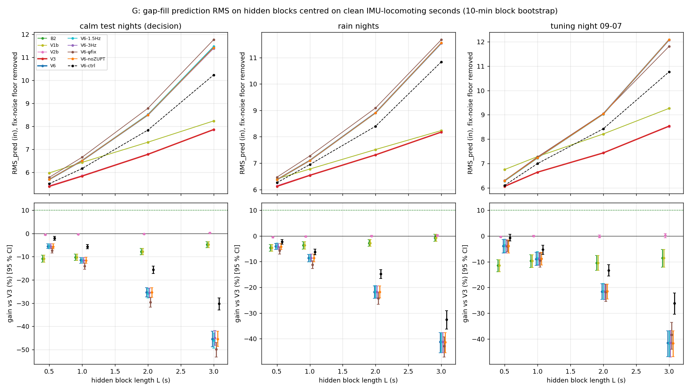
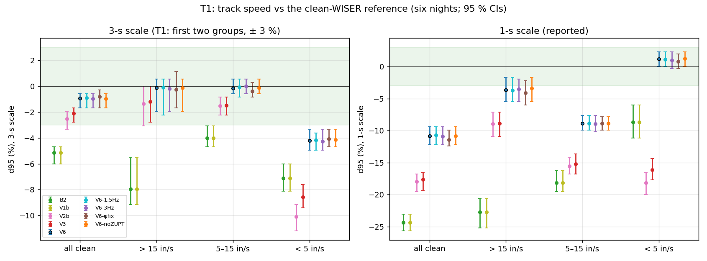
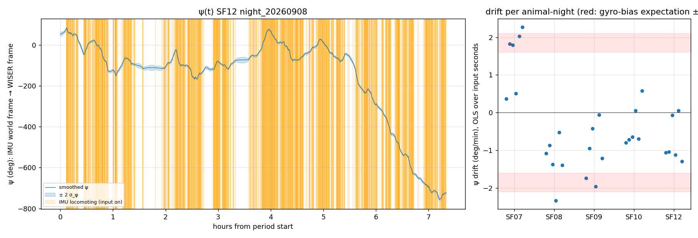
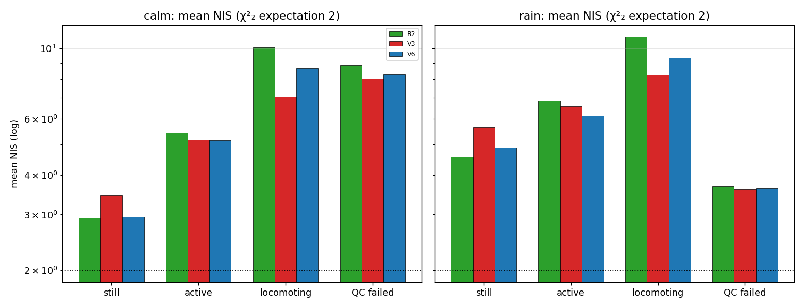

# V6 — short-horizon head-IMU / WISER fusion (cohort 2026c)

Approved by the user 2026-10-03 ("开始"). Plan [`implementation_plan/2026-10-03-wiser-v6-fusion.md`](../../../../implementation_plan/2026-10-03-wiser-v6-fusion.md) (committed e0252c8 before any V6 number; operational Amendment 1 written before any V6 number); driver `wiser/scripts/analyze_wiser_v6_fusion.py` (`--selftest` ALL PASS); config `wiser/configs/wiser_v6_fusion_2026c.json` (`tuned` from the tuning night 09-07 only, verdict in `decision`); bulk `D:\Field2026_analysis_out\2026c\wiser_v6_fusion_20261003_2206`; new cache `D:/Field2026_analysis_out/2026c/imu_acc16_cache`; git `e0252c8+dirty`. Measurement report: no behavioural claim; WISER inch frame unverified (only distances, speeds and a relative heading used).

## Executive summary

1. **Decision (pre-registered rule 2): close the inertial-position line; V3 stays.** Reason: the calm-test gain is not significantly above 0 (95 % CI lower bound <= 0) at both L = 0.5 s and 1 s. B2 stays the universal baseline.
2. **G — gap-fill gain of V6 over V3 (calm test nights 09-05/06/08 pooled; 95 % CI):** L = 0.5 s -5.6 % [-6.5 %, -4.4 %]; L = 1 s -11.5 % [-12.8 %, -10.3 %]; L = 2 s -25.3 % [-27.4 %, -23.3 %]; L = 3 s -45.4 % [-48.7 %, -42.1 %]. Rain nights: 0.5 s -4.1 % [-5.2 %, -2.9 %]; 1 s -8.6 % [-10.0 %, -7.2 %]; 2 s -21.8 % [-24.3 %, -19.4 %]; 3 s -41.2 % [-45.5 %, -37.6 %]. Tuning night 09-07: 0.5 s -3.8 % [-6.6 %, -1.4 %]; 1 s -8.9 % [-11.4 %, -6.4 %]; 2 s -21.5 % [-24.6 %, -18.6 %]; 3 s -41.6 % [-46.9 %, -36.8 %].
3. **RMS_pred (calm test):** V3 5.38 / 5.83 in at 0.5 / 1 s, V6 5.68 / 6.50, B2 5.97 / 6.43 (fix-noise floor 2.93 in subtracted in quadrature; n 13,610 / 27,185 hidden fixes, 5,569 blocks). Raw median error V3 4.26 / 4.60 in, V6 4.46 / 5.02 in.
4. **Negative control (+1 h input):** gain vs V3 0.5 s -2.1 % [-2.9 %, -1.3 %]; 1 s -5.6 % [-6.5 %, -4.7 %]; 2 s -15.6 % [-17.2 %, -14.1 %]; 3 s -30.3 % [-32.9 %, -27.8 %] → does not invalidate V6.
5. **T1 (3-s p95 vs clean WISER, ± 3 %):** -0.9 % [-1.7 %, -0.6 %] all, -0.1 % [-2.0 %, +0.6 %] > 15 in/s → pass (V3 -2.1 % / -1.2 %); 1-s scale (reported) V6 -10.8 % / -3.7 % vs V3 -17.6 % / -8.9 %. **T2:** 0 jumps in still segments, 0 over the masks → pass. **T3:** calm onset -3.75 s; calm offset 7.00 s; rain onset -4.50 s; rain offset 8.12 s → **FAIL**. **T4 (in-place, 1-s speed vs B2):** p50 2.73 vs 1.10 in/s, p95 6.54 vs 2.45 (+148 % / +167 %; V3 +62 % / +69 %) → **FAIL**.
6. **Tuned on 09-07 only:** q_a 70 in²/s³, τ_b 10 s (σ_b 4.5 in/s²), q_ψ 16 (°)²/min — grid edge(s) hit: q_a, tau_b, q_psi_deg2_per_min; handedness per animal (animals disagree or a fit failed): SF07 mirror (LLR -0), SF08 normal (LLR +1), SF09 normal (LLR +0), SF10 normal (LLR +13), SF12 normal (LLR +26).
7. **Heading by-product (nights):** ψ drift 0.99 °/min median |slope| (range -2.33 to 2.27; gyro-bias expectation 1.6–2.1 °/min), residual about the line 60.5° RMS; consecutive-bout |Δψ| median 1.3°; σ_ψ < 10° in 100 % of input seconds and 100 % of window seconds (medians over animal-nights).
8. **NIS (calm mean; still / active / locomoting):** B2 2.93 / 5.42 / 10.09; V3 3.45 / 5.18 / 7.05; **V6 2.95 / 5.15 / 8.68**. **Still (circular):** fake path V3 3.3 | 3.6, V6 19.1 | 21.9 in/min (calm | rain). **S3 (rain ≥ 12-in excursions):** raw 6, B2 7, V3 4, V6 8.
9. **Sensitivities (never the decision; calm-test gain at 0.5 / 1 s; T1–T4):** V6-1.5Hz -5.6 % [-6.5 %, -4.4 %] / -11.6 % [-12.9 %, -10.4 %], fails T3, T4; V6-3Hz -5.6 % [-6.6 %, -4.5 %] / -11.6 % [-12.9 %, -10.4 %], fails T3, T4; V6-ψfix -7.3 % [-8.4 %, -6.3 %] / -14.1 % [-15.4 %, -12.7 %], fails T3, T4; V6-noZUPT -5.6 % [-6.6 %, -4.5 %] / -11.6 % [-12.8 %, -10.3 %], fails T3, T4.

## Pre-registered decision

| criterion | bound | V6 | outcome |
|---|---|---|---|
| G gain vs V3, L = 0.5 s, calm test | ≥ 10 % with CI > 0 (rule 1); CI ≤ 0 at both → rule 2 | -5.6 % [-6.5 %, -4.4 %] | CI includes / below 0 |
| control gain, L = 0.5 s | < 50 % of V6's gain | -2.1 % [-2.9 %, -1.3 %] | ok |
| G gain vs V3, L = 1 s, calm test | ≥ 10 % with CI > 0 (rule 1); CI ≤ 0 at both → rule 2 | -11.5 % [-12.8 %, -10.3 %] | CI includes / below 0 |
| control gain, L = 1 s | < 50 % of V6's gain | -5.6 % [-6.5 %, -4.7 %] | ok |
| T1 3-s p95, all / > 15 in/s | ± 3 % | -0.9 % / -0.1 % | pass |
| T2 jumps still / masks | 0 / 0 | 0 / 0 | pass |
| T3 median Δ lag vs B2 | ≤ +0.5 s | calm onset -3.75, calm offset 7.00, rain onset -4.50, rain offset 8.12 | **FAIL** |
| T4 in-place 1-s speed p50 / p95 vs B2 | ≤ B2 | +148.3 % / +166.7 % | **FAIL** |
| **decision** | rule 1 / 2 / 3 | **rule 2** | **close the inertial-position line; V3 stays** |

## 1. G — gap-fill curves (all methods)

RMS_pred (in) with the fix-noise floor removed; gain vs V3 [95 % CI]. Same hidden blocks for every method at each L.

**Calm test nights 09-05, 09-06, 09-08 (decision)**

| method | L = 0.5 s: RMS_pred; gain vs V3; med e | L = 1 s: RMS_pred; gain vs V3; med e | L = 2 s: RMS_pred; gain vs V3; med e | L = 3 s: RMS_pred; gain vs V3; med e |
|---|---|---|---|---|
| B2 robust CV | 5.97; -10.9 % [-12.4 %, -9.4 %]; 4.60 | 6.43; -10.2 % [-11.7 %, -8.9 %]; 4.81 | 7.30; -7.8 % [-9.2 %, -6.5 %]; 5.21 | 8.23; -4.8 % [-6.1 %, -3.5 %]; 5.61 |
| V1b (B2 + guarded ZUPT) | 5.97; -10.9 % [-12.4 %, -9.4 %]; 4.60 | 6.43; -10.2 % [-11.7 %, -8.9 %]; 4.81 | 7.30; -7.8 % [-9.2 %, -6.5 %]; 5.21 | 8.23; -4.8 % [-6.1 %, -3.5 %]; 5.61 |
| V2b (IMU-switched q, spliced) | 5.41; -0.5 % [-0.7 %, -0.4 %]; 4.29 | 5.85; -0.4 % [-0.5 %, -0.2 %]; 4.62 | 6.79; -0.2 % [-0.4 %, -0.0 %]; 5.13 | 7.84; +0.2 % [-0.1 %, +0.4 %]; 5.66 |
| V3 (ZUPT 0.25 + loco ×10) | 5.38; +0.0 % [+0.0 %, +0.0 %]; 4.26 | 5.83; +0.0 % [+0.0 %, +0.0 %]; 4.60 | 6.78; +0.0 % [+0.0 %, +0.0 %]; 5.14 | 7.86; +0.0 % [+0.0 %, +0.0 %]; 5.67 |
| V6 (IMU-acceleration EKF) | 5.68; -5.6 % [-6.5 %, -4.4 %]; 4.46 | 6.50; -11.5 % [-12.8 %, -10.3 %]; 5.02 | 8.49; -25.3 % [-27.4 %, -23.3 %]; 6.25 | 11.42; -45.4 % [-48.7 %, -42.1 %]; 7.83 |
| V6 low-pass 1.5 Hz | 5.68; -5.6 % [-6.5 %, -4.4 %]; 4.46 | 6.51; -11.6 % [-12.9 %, -10.4 %]; 5.03 | 8.52; -25.7 % [-27.7 %, -23.7 %]; 6.25 | 11.48; -46.1 % [-49.4 %, -42.8 %]; 7.84 |
| V6 low-pass 3 Hz | 5.68; -5.6 % [-6.6 %, -4.5 %]; 4.47 | 6.51; -11.6 % [-12.9 %, -10.4 %]; 5.01 | 8.50; -25.4 % [-27.5 %, -23.4 %]; 6.25 | 11.39; -45.0 % [-48.2 %, -41.8 %]; 7.82 |
| V6 ψ frozen | 5.77; -7.3 % [-8.4 %, -6.3 %]; 4.50 | 6.65; -14.1 % [-15.4 %, -12.7 %]; 5.10 | 8.78; -29.6 % [-31.7 %, -27.6 %]; 6.38 | 11.77; -49.8 % [-53.1 %, -47.0 %]; 7.93 |
| V6 no ZUPT | 5.68; -5.6 % [-6.6 %, -4.5 %]; 4.47 | 6.50; -11.6 % [-12.8 %, -10.3 %]; 5.02 | 8.49; -25.4 % [-27.4 %, -23.4 %]; 6.26 | 11.42; -45.4 % [-48.7 %, -42.1 %]; 7.83 |
| V6 control (+1 h) | 5.50; -2.1 % [-2.9 %, -1.3 %]; 4.37 | 6.16; -5.6 % [-6.5 %, -4.7 %]; 4.85 | 7.83; -15.6 % [-17.2 %, -14.1 %]; 5.93 | 10.23; -30.3 % [-32.9 %, -27.8 %]; 7.15 |

n hidden fixes per L: 0.5 s 13,610, 1 s 27,185, 2 s 54,220, 3 s 81,457; blocks 5,569; floor √mean σ²_fix 2.93 in.

**Rain nights 09-03, 09-09 (reported)**

| method | L = 0.5 s: RMS_pred; gain vs V3; med e | L = 1 s: RMS_pred; gain vs V3; med e | L = 2 s: RMS_pred; gain vs V3; med e | L = 3 s: RMS_pred; gain vs V3; med e |
|---|---|---|---|---|
| B2 robust CV | 6.40; -4.6 % [-6.0 %, -3.4 %]; 5.02 | 6.78; -3.7 % [-5.1 %, -2.3 %]; 5.30 | 7.52; -2.8 % [-4.0 %, -1.5 %]; 5.69 | 8.24; -0.7 % [-2.2 %, +0.6 %]; 5.96 |
| V1b (B2 + guarded ZUPT) | 6.40; -4.6 % [-6.0 %, -3.4 %]; 5.02 | 6.78; -3.7 % [-5.1 %, -2.3 %]; 5.30 | 7.52; -2.8 % [-4.0 %, -1.5 %]; 5.69 | 8.24; -0.7 % [-2.2 %, +0.6 %]; 5.96 |
| V2b (IMU-switched q, spliced) | 6.15; -0.5 % [-0.7 %, -0.2 %]; 4.79 | 6.55; -0.2 % [-0.4 %, -0.0 %]; 5.12 | 7.32; -0.1 % [-0.4 %, +0.2 %]; 5.64 | 8.17; +0.1 % [-0.2 %, +0.5 %]; 6.08 |
| V3 (ZUPT 0.25 + loco ×10) | 6.12; +0.0 % [+0.0 %, +0.0 %]; 4.79 | 6.54; +0.0 % [+0.0 %, +0.0 %]; 5.14 | 7.31; +0.0 % [+0.0 %, +0.0 %]; 5.65 | 8.18; +0.0 % [+0.0 %, +0.0 %]; 6.09 |
| V6 (IMU-acceleration EKF) | 6.37; -4.1 % [-5.2 %, -2.9 %]; 4.94 | 7.10; -8.6 % [-10.0 %, -7.2 %]; 5.49 | 8.91; -21.8 % [-24.3 %, -19.4 %]; 6.74 | 11.55; -41.2 % [-45.5 %, -37.6 %]; 8.29 |
| V6 low-pass 1.5 Hz | 6.37; -4.0 % [-5.1 %, -2.8 %]; 4.92 | 7.10; -8.6 % [-10.0 %, -7.2 %]; 5.50 | 8.90; -21.7 % [-24.1 %, -19.3 %]; 6.75 | 11.55; -41.2 % [-45.5 %, -37.6 %]; 8.26 |
| V6 low-pass 3 Hz | 6.38; -4.2 % [-5.3 %, -3.0 %]; 4.94 | 7.10; -8.5 % [-10.0 %, -7.1 %]; 5.50 | 8.91; -21.8 % [-24.3 %, -19.5 %]; 6.75 | 11.55; -41.2 % [-45.5 %, -37.6 %]; 8.27 |
| V6 ψ frozen | 6.47; -5.7 % [-7.1 %, -4.4 %]; 5.00 | 7.27; -11.3 % [-12.8 %, -9.7 %]; 5.64 | 9.09; -24.3 % [-26.6 %, -21.9 %]; 6.83 | 11.68; -42.8 % [-47.0 %, -39.2 %]; 8.32 |
| V6 no ZUPT | 6.37; -4.2 % [-5.3 %, -2.9 %]; 4.94 | 7.10; -8.6 % [-10.0 %, -7.1 %]; 5.49 | 8.90; -21.7 % [-24.1 %, -19.5 %]; 6.75 | 11.56; -41.3 % [-45.5 %, -37.7 %]; 8.27 |
| V6 control (+1 h) | 6.26; -2.3 % [-3.1 %, -1.4 %]; 4.92 | 6.95; -6.2 % [-7.3 %, -5.1 %]; 5.51 | 8.40; -14.8 % [-16.6 %, -13.1 %]; 6.46 | 10.84; -32.6 % [-36.2 %, -29.1 %]; 7.84 |

n hidden fixes per L: 0.5 s 5,909, 1 s 11,884, 2 s 23,835, 3 s 35,727; blocks 2,444; floor √mean σ²_fix 3.00 in.

**Tuning night 09-07 (reported separately)**

| method | L = 0.5 s: RMS_pred; gain vs V3; med e | L = 1 s: RMS_pred; gain vs V3; med e | L = 2 s: RMS_pred; gain vs V3; med e | L = 3 s: RMS_pred; gain vs V3; med e |
|---|---|---|---|---|
| B2 robust CV | 6.75; -11.4 % [-13.9 %, -9.3 %]; 4.93 | 7.28; -9.7 % [-12.2 %, -7.4 %]; 5.28 | 8.21; -10.5 % [-13.4 %, -7.6 %]; 5.60 | 9.26; -8.6 % [-12.1 %, -5.3 %]; 6.05 |
| V1b (B2 + guarded ZUPT) | 6.75; -11.4 % [-13.9 %, -9.3 %]; 4.93 | 7.28; -9.7 % [-12.2 %, -7.4 %]; 5.28 | 8.21; -10.5 % [-13.4 %, -7.6 %]; 5.60 | 9.26; -8.6 % [-12.1 %, -5.3 %]; 6.05 |
| V2b (IMU-switched q, spliced) | 6.08; -0.4 % [-0.6 %, -0.1 %]; 4.57 | 6.64; -0.0 % [-0.3 %, +0.3 %]; 5.00 | 7.44; -0.1 % [-0.8 %, +0.4 %]; 5.52 | 8.51; +0.2 % [-0.7 %, +1.0 %]; 6.10 |
| V3 (ZUPT 0.25 + loco ×10) | 6.06; +0.0 % [+0.0 %, +0.0 %]; 4.53 | 6.64; +0.0 % [+0.0 %, +0.0 %]; 5.01 | 7.43; +0.0 % [+0.0 %, +0.0 %]; 5.50 | 8.53; +0.0 % [+0.0 %, +0.0 %]; 6.15 |
| V6 (IMU-acceleration EKF) | 6.29; -3.8 % [-6.6 %, -1.4 %]; 4.77 | 7.23; -8.9 % [-11.4 %, -6.4 %]; 5.40 | 9.03; -21.5 % [-24.6 %, -18.6 %]; 6.51 | 12.08; -41.6 % [-46.9 %, -36.8 %]; 8.35 |
| V6 low-pass 1.5 Hz | 6.28; -3.6 % [-6.4 %, -1.2 %]; 4.72 | 7.22; -8.7 % [-11.2 %, -6.1 %]; 5.42 | 9.03; -21.4 % [-24.6 %, -18.5 %]; 6.52 | 12.09; -41.7 % [-46.8 %, -36.9 %]; 8.36 |
| V6 low-pass 3 Hz | 6.29; -3.9 % [-6.6 %, -1.4 %]; 4.79 | 7.24; -9.0 % [-11.5 %, -6.5 %]; 5.42 | 9.04; -21.6 % [-24.7 %, -18.7 %]; 6.52 | 12.08; -41.6 % [-46.9 %, -36.7 %]; 8.35 |
| V6 ψ frozen | 6.30; -4.0 % [-6.1 %, -1.8 %]; 4.71 | 7.27; -9.5 % [-12.2 %, -6.7 %]; 5.34 | 9.05; -21.8 % [-25.5 %, -18.7 %]; 6.51 | 11.81; -38.4 % [-44.0 %, -33.6 %]; 8.30 |
| V6 no ZUPT | 6.29; -3.9 % [-6.6 %, -1.5 %]; 4.78 | 7.23; -8.9 % [-11.3 %, -6.3 %]; 5.42 | 9.03; -21.5 % [-24.5 %, -18.7 %]; 6.51 | 12.09; -41.6 % [-46.9 %, -36.9 %]; 8.37 |
| V6 control (+1 h) | 6.10; -0.7 % [-2.0 %, +0.7 %]; 4.68 | 6.99; -5.3 % [-7.2 %, -3.6 %]; 5.24 | 8.42; -13.3 % [-15.6 %, -11.2 %]; 6.24 | 10.77; -26.2 % [-30.3 %, -22.2 %]; 7.72 |

n hidden fixes per L: 0.5 s 3,067, 1 s 6,137, 2 s 12,337, 3 s 18,571; blocks 1,279; floor √mean σ²_fix 2.95 in.

**Where V6 − V3 crosses (calm test):** no crossing in 0.5–3 s (V6 − V3 RMS_pred: 0.5 s 0.30 in, 1 s 0.67 in, 2 s 1.72 in, 3 s 3.57 in).

Per animal (calm test; gain of V6 vs V3 [CI]):

| animal | L = 0.5 s | L = 1 s | L = 2 s | L = 3 s |
|---|---|---|---|---|
| SF07 | -11.9 % [-15.4 %, -8.5 %] | -24.0 % [-27.8 %, -20.4 %] | -46.7 % [-52.6 %, -41.8 %] | -86.0 % [-94.3 %, -78.0 %] |
| SF08 | -5.1 % [-7.5 %, -3.0 %] | -10.5 % [-13.5 %, -7.9 %] | -22.3 % [-26.7 %, -18.0 %] | -38.7 % [-43.8 %, -33.4 %] |
| SF09 | -5.9 % [-7.8 %, -4.1 %] | -11.4 % [-13.8 %, -9.0 %] | -25.9 % [-28.8 %, -22.3 %] | -42.1 % [-46.4 %, -37.5 %] |
| SF10 | -3.4 % [-5.4 %, -1.6 %] | -7.1 % [-8.9 %, -5.2 %] | -14.3 % [-17.0 %, -11.3 %] | -23.5 % [-27.5 %, -18.8 %] |
| SF12 | -3.1 % [-5.9 %, -0.4 %] | -9.0 % [-12.4 %, -5.7 %] | -26.3 % [-32.6 %, -20.4 %] | -55.1 % [-63.0 %, -47.0 %] |

Share of hidden calm-test fixes whose step had IMU input in the full-data V6: 0.5 s 98.8 %, 1 s 98.5 %, 2 s 98.1 %, 3 s 97.7 %.

**Post-hoc reading (added after the decision; not part of it).** Why V6 loses: (i) on IMU-ok locomoting seconds of the 30 animal-nights the 1-Hz IMU input has median magnitude 28.6 in/s² (animal-night range 17.4–48.4; at IMU-still seconds 1.0), while the V3 track's 1-Hz acceleration has 6.6 in/s²; a best rotation of the input explains R² = 0.001 of the track acceleration over a night and 0.053 (median; p90 0.157) within 120-s windows where the heading drift is negligible (mirrored: 0.023). The head's 0–2 Hz horizontal specific force during locomotion is therefore mostly not body translation (head sweeps and tilt leak during motion — the 0.25 m/s² prior was a whole-night median dominated by rest). (ii) Tuning ran to the loosest corner of the grid (q_a = 70, the largest; τ_b = 10 s, the slowest bias), i.e. toward ignoring the input. That q_a also acts at in-place seconds (where V3 keeps q = 3 unless it calls them locomoting) → T4. Over all IMU-still seconds V6's 1-s speed is ≥ 3 in/s about as often as B2's (0.90 % vs 0.85 %; V3 0.07 %), but not evenly: in still runs ≥ 10 s the share is 0-1 s from the run edge V6 8.6 % / B2 2.1 % / V3 0.7 %; 2-4 s from the run edge V6 0.1 % / B2 1.2 % / V3 0.0 %; 5-9 s from the run edge V6 0.1 % / B2 0.9 % / V3 0.0 %; >= 10 s from the run edge V6 0.0 % / B2 0.7 % / V3 0.0 %. Motion that V6 carries from the adjacent locomotion bout into the first and last seconds of a still run is what moves the S5 lags (T3: offsets later, onsets earlier); a plausible but untested mechanism is the slow bias state (τ_b 10 s) carrying the bout's input error across the transition, in both directions through the smoother. (iii) The +1 h control loses less than V6 because at the locomoting blocks the shifted input mostly comes from rest (small), whereas the real input there is large and misdirected: the content of the input hurts. Per-night values: `tables/posthoc_input_diagnostic.csv`, `tables/posthoc_still_second_speed.csv`, `tables/posthoc_still_edge_speed.csv`.

## 2. Tuning (09-07 only) and handedness

Handedness on the tuning night (full V3 track; Procrustes on the first 30 min of IMU-ok locomoting seconds):

| animal | n seconds | ψ0 normal (°) | ψ0 mirrored (°) | RSS mirror / normal | LLR (normal over mirror) | scale normal |
|---|---|---|---|---|---|---|
| SF07 | 144 | -99.9 | 69.0 | 0.998 | -0.3 | 0.018 |
| SF08 | 333 | -57.2 | 32.0 | 1.003 | 0.9 | 0.014 |
| SF09 | 254 | -112.1 | 88.6 | 1.002 | 0.5 | 0.049 |
| SF10 | 342 | 26.6 | -25.5 | 1.040 | 13.5 | 0.076 |
| SF12 | 288 | -12.9 | 1.6 | 1.094 | 25.8 | 0.097 |

Reported on every period with a fit (51 session fits): LLR > 0 (normal) in 38, median LLR 0.9, median RSS mirror / normal 1.004, median similarity scale 0.021 (IMU 1-Hz acceleration vs the V3 track's).

Tuning grid (pooled RMS_pred at L = 1 s, five animals; V3 = 6.640 in):

| q_a (in²/s³) | τ_b (s) | q_ψ ((°)²/min) | RMS_pred (in) | gain vs V3 |
|---|---|---|---|---|
| 4.375 | 1 | 1 | 8.209 | -23.6 % |
| 4.375 | 1 | 4 | 8.064 | -21.4 % |
| 4.375 | 1 | 16 | 8.034 | -21.0 % |
| 4.375 | 3 | 1 | 8.325 | -25.4 % |
| 4.375 | 3 | 4 | 8.459 | -27.4 % |
| 4.375 | 3 | 16 | 8.348 | -25.7 % |
| 4.375 | 10 | 1 | 8.934 | -34.5 % |
| 4.375 | 10 | 4 | 9.314 | -40.3 % |
| 4.375 | 10 | 16 | 8.902 | -34.1 % |
| 17.5 | 1 | 1 | 7.797 | -17.4 % |
| 17.5 | 1 | 4 | 7.731 | -16.4 % |
| 17.5 | 1 | 16 | 7.673 | -15.6 % |
| 17.5 | 3 | 1 | 7.836 | -18.0 % |
| 17.5 | 3 | 4 | 7.698 | -15.9 % |
| 17.5 | 3 | 16 | 7.898 | -19.0 % |
| 17.5 | 10 | 1 | 7.928 | -19.4 % |
| 17.5 | 10 | 4 | 7.899 | -19.0 % |
| 17.5 | 10 | 16 | 7.862 | -18.4 % |
| 70 | 1 | 1 | 7.350 | -10.7 % |
| 70 | 1 | 4 | 7.393 | -11.3 % |
| 70 | 1 | 16 | 7.340 | -10.5 % |
| 70 | 3 | 1 | 7.374 | -11.1 % |
| 70 | 3 | 4 | 7.323 | -10.3 % |
| 70 | 3 | 16 | 7.264 | -9.4 % |
| 70 | 10 | 1 | 7.350 | -10.7 % |
| 70 | 10 | 4 | 7.301 | -10.0 % |
| 70 | 10 | 16 | **7.232** | -8.9 % |

## 3. T1 — clean speed (six nights; as V3)

| scale | band | n | V6 d50; d95 | V3 d50; d95 | B2 d50; d95 | V6-3Hz d50; d95 | V6-noZUPT d50; d95 |
|---|---|---|---|---|---|---|---|
| 3 s | all | 82,041 | -11.2 %; -0.9 % | -25.0 %; -2.1 % | -26.6 %; -5.2 % | -11.1 %; -1.0 % | -10.9 %; -1.0 % |
| 3 s | < 5 | 69,377 | -12.4 %; -4.2 % | -26.8 %; -8.6 % | -28.1 %; -7.1 % | -12.5 %; -4.3 % | -11.8 %; -4.1 % |
| 3 s | 5–15 | 10,487 | -1.3 %; -0.2 % | -3.2 %; -1.5 % | -5.1 %; -4.0 % | -1.4 %; -0.0 % | -1.3 %; -0.1 % |
| 3 s | > 15 | 2,177 | +0.0 %; -0.1 % | -0.7 %; -1.2 % | -5.8 %; -8.0 % | +0.0 %; -0.2 % | +0.1 %; -0.1 % |
| 1 s | all | 75,639 | -28.9 %; -10.8 % | -57.4 %; -17.6 % | -60.3 %; -24.4 % | -28.9 %; -10.9 % | -28.3 %; -10.8 % |
| 1 s | < 5 | 47,618 | -26.6 %; +1.2 % | -55.0 %; -16.1 % | -56.6 %; -8.7 % | -26.8 %; +1.0 % | -25.3 %; +1.3 % |
| 1 s | 5–15 | 24,272 | -30.3 %; -8.9 % | -58.1 %; -15.2 % | -63.7 %; -18.2 % | -30.3 %; -8.9 % | -30.2 %; -8.9 % |
| 1 s | > 15 | 3,749 | -7.9 %; -3.7 % | -13.6 %; -8.9 % | -25.6 %; -22.7 % | -7.8 %; -3.5 % | -7.9 %; -3.4 % |

Without the tuning night (five test nights; reported check): all: V6 -1.0 % / +0.1 %, V3 -2.2 % / -0.8 %; calm: V6 -1.3 % / -0.3 %, V3 -2.3 % / -0.9 %; rain: V6 -1.4 % / -1.1 %, V3 -2.5 % / -1.5 % (3-s d95 all / > 15 in/s).

Per animal (3-s d95 all | > 15 in/s): SF07 V6 -1.9 % | -0.3 %; SF08 V6 -1.6 % | -1.2 %; SF09 V6 -1.5 % | +0.8 %; SF10 V6 -0.6 % | -0.5 %; SF12 V6 -0.1 % | -3.3 %.

## 4. T2 jumps, T3 transitions, T4 in-place jitter

| method | T2 still / mask jumps | T3 calm onset / offset (s) | T3 rain onset / offset (s) | T4 1-s speed p50; p95 vs B2 | T1–T4 |
|---|---|---|---|---|---|
| V6 (IMU-acceleration EKF) | 0 / 0 | -3.75 / 7.00 | -4.50 / 8.12 | +148.3 %; +166.7 % | fail T3, T4 |
| V6 low-pass 1.5 Hz | 0 / 0 | -3.75 / 7.00 | -4.50 / 8.12 | +147.9 %; +166.3 % | fail T3, T4 |
| V6 low-pass 3 Hz | 0 / 0 | -3.75 / 7.00 | -4.50 / 8.12 | +148.3 %; +167.5 % | fail T3, T4 |
| V6 ψ frozen | 0 / 0 | -3.75 / 7.00 | -5.00 / 8.12 | +146.4 %; +165.9 % | fail T3, T4 |
| V6 no ZUPT | 0 / 0 | -6.25 / 12.75 | -8.75 / 14.62 | +148.2 %; +166.9 % | fail T3, T4 |
| V3 (ZUPT 0.25 + loco ×10) | 0 / 0 | 0.00 / 0.00 | 0.00 / 0.00 | +62.1 %; +68.9 % | fail T4 |
| V1b (B2 + guarded ZUPT) | 0 / 0 | 0.00 / 0.00 | 0.00 / 0.00 | -0.0 %; -0.0 % | fail T1 |
| V2b (IMU-switched q, spliced) | 0 / 3 | 0.25 / -0.75 | 0.25 / -0.50 | +57.9 %; +64.0 % | fail T2, T4 |
| B2 robust CV | 0 / 0 | 0.00 / 0.00 | 0.00 / 0.00 | +0.0 %; +0.0 % | fail T1 |

T3 shifted minority (calm, V6 vs B2): onsets 25 later / 243 earlier of 303 (mean Δ -8.15 s); offsets 225 later / 32 earlier of 283 (mean Δ 9.76 s).

T4 set: n 5,404 clean seconds (IMU input on in 98.5 % of them); B2 p50 / p95 1.10 / 2.45 in/s; V6 2.73 / 6.54; V3 1.78 / 4.14; raw 4.99 / 13.13.

## 5. Heading by-product (no claim)

| animal | period | session | input s | drift (°/min) | resid RMS (°) | ψ range (°) | bouts | bout \|Δψ\| med / p90 (°) | bout rate med (°/min) | σ_ψ < 10° (input / window) |
|---|---|---|---|---|---|---|---|---|---|---|
| SF07 | day_20260905 | 0 | 0 | – | – | – | – | – / – | – | – / 0 % |
| SF07 | day_20260905 | 1 | 11,538 | 0.01 | 8.6 | 53 | 2 | 0.5 / 0.5 | 4.53 | 97 % / 97 % |
| SF07 | day_20260905 | 3 | 14,130 | 0.51 | 13.2 | 141 | 27 | 0.9 / 13.3 | 1.55 | 100 % / 100 % |
| SF08 | day_20260905 | 0 | 25,805 | 0.36 | 15.4 | 186 | 39 | 1.7 / 19.0 | 2.65 | 94 % / 94 % |
| SF08 | day_20260905 | 2 | 0 | – | – | – | – | – / – | – | – / 0 % |
| SF09 | day_20260905 | 0 | 25,849 | -0.07 | 7.7 | 46 | 11 | 0.7 / 7.4 | 1.46 | 71 % / 71 % |
| SF09 | day_20260905 | 2 | 0 | – | – | – | – | – / – | – | – / 0 % |
| SF10 | day_20260905 | 1 | 25,827 | 0.00 | 23.4 | 86 | 23 | 3.6 / 37.7 | 1.64 | 81 % / 81 % |
| SF12 | day_20260905 | 1 | 25,724 | -0.03 | 27.3 | 151 | 31 | 4.1 / 31.0 | 2.10 | 90 % / 90 % |
| SF12 | day_20260905 | 4 | 0 | – | – | – | – | – / – | – | – / 0 % |
| SF07 | day_20260907 | 3 | 26,837 | 0.12 | 7.1 | 64 | 18 | 0.8 / 12.0 | 1.26 | 75 % / 75 % |
| SF08 | day_20260907 | 0 | 26,921 | 0.35 | 24.2 | 170 | 21 | 2.1 / 19.0 | 2.20 | 86 % / 86 % |
| SF09 | day_20260907 | 2 | 26,939 | -0.06 | 20.0 | 85 | 10 | 1.4 / 20.7 | 1.42 | 76 % / 76 % |
| SF10 | day_20260907 | 0 | 26,869 | -0.27 | 26.4 | 175 | 53 | 1.6 / 9.6 | 3.72 | 76 % / 76 % |
| SF12 | day_20260907 | 2 | 26,790 | -0.52 | 28.0 | 254 | 72 | 2.7 / 14.8 | 5.18 | 98 % / 98 % |
| SF07 | day_20260908 | 0 | 35,967 | 0.27 | 25.1 | 216 | 57 | 1.0 / 19.0 | 2.50 | 85 % / 85 % |
| SF08 | day_20260908 | 0 | 36,000 | -0.07 | 28.8 | 125 | 37 | 0.7 / 13.0 | 1.05 | 73 % / 73 % |
| SF09 | day_20260908 | 0 | 36,000 | 0.06 | 27.3 | 93 | 15 | 2.5 / 25.5 | 0.42 | 50 % / 50 % |
| SF10 | day_20260908 | 0 | 35,998 | 0.40 | 17.4 | 252 | 24 | 0.9 / 37.5 | 1.62 | 48 % / 48 % |
| SF12 | day_20260908 | 0 | 35,985 | 0.14 | 31.7 | 138 | 29 | 1.8 / 20.1 | 1.88 | 88 % / 88 % |
| SF07 | day_20260910 | 0 | 21,628 | 0.17 | 13.8 | 103 | 26 | 1.8 / 9.1 | 1.55 | 88 % / 88 % |
| SF08 | day_20260910 | 0 | 21,695 | 0.07 | 17.7 | 72 | 14 | 1.3 / 30.8 | 1.30 | 64 % / 64 % |
| SF09 | day_20260910 | 0 | 22,008 | -0.13 | 22.7 | 100 | 31 | 0.8 / 15.2 | 0.88 | 54 % / 54 % |
| SF10 | day_20260910 | 1 | 22,252 | 0.10 | 5.2 | 58 | 18 | 1.1 / 14.4 | 0.81 | 55 % / 55 % |
| SF12 | day_20260910 | 0 | 22,424 | 0.27 | 24.7 | 138 | 48 | 1.0 / 7.8 | 1.71 | 99 % / 99 % |
| SF07 | night_20260903 | 0 | 25,626 | 2.03 | 55.4 | 853 | 466 | 1.3 / 7.2 | 3.39 | 100 % / 100 % |
| SF08 | night_20260903 | 0 | 25,918 | -0.53 | 36.3 | 304 | 217 | 1.4 / 9.8 | 2.27 | 98 % / 98 % |
| SF09 | night_20260903 | 0 | 25,691 | -0.06 | 23.5 | 100 | 418 | 1.0 / 5.1 | 2.75 | 100 % / 100 % |
| SF10 | night_20260903 | 0 | 25,168 | -0.69 | 40.4 | 378 | 562 | 1.0 / 5.1 | 3.52 | 91 % / 91 % |
| SF12 | night_20260903 | 0 | 25,929 | 0.06 | 65.5 | 311 | 389 | 1.8 / 6.9 | 5.49 | 100 % / 100 % |
| SF07 | night_20260905 | 0 | 25,378 | 0.37 | 59.0 | 377 | 746 | 1.0 / 4.2 | 4.38 | 100 % / 100 % |
| SF08 | night_20260905 | 0 | 25,819 | -1.08 | 39.2 | 459 | 360 | 1.2 / 7.0 | 2.72 | 100 % / 100 % |
| SF09 | night_20260905 | 0 | 25,301 | -1.74 | 74.7 | 713 | 697 | 1.4 / 6.1 | 5.16 | 100 % / 100 % |
| SF10 | night_20260905 | 0 | 24,318 | -0.80 | 61.5 | 475 | 856 | 1.3 / 4.7 | 6.11 | 96 % / 96 % |
| SF12 | night_20260905 | 0 | 25,853 | -1.06 | 69.6 | 493 | 517 | 1.7 / 7.3 | 6.35 | 100 % / 100 % |
| SF07 | night_20260906 | 0 | 25,162 | 1.82 | 54.7 | 682 | 649 | 0.9 / 4.4 | 4.00 | 100 % / 100 % |
| SF08 | night_20260906 | 0 | 25,636 | -0.87 | 36.8 | 403 | 429 | 1.4 / 7.4 | 3.77 | 100 % / 100 % |
| SF09 | night_20260906 | 0 | 24,545 | -0.95 | 64.0 | 514 | 820 | 1.1 / 4.2 | 4.42 | 100 % / 100 % |
| SF10 | night_20260906 | 0 | 25,048 | -0.72 | 87.4 | 420 | 1,012 | 1.3 / 4.9 | 6.15 | 100 % / 100 % |
| SF12 | night_20260906 | 0 | 25,855 | -1.04 | 70.9 | 548 | 725 | 1.4 / 5.5 | 6.16 | 100 % / 100 % |
| SF07 | night_20260907 | 0 | 25,560 | 1.79 | 59.0 | 655 | 865 | 0.9 / 3.7 | 4.43 | 100 % / 100 % |
| SF08 | night_20260907 | 0 | 25,177 | -1.37 | 53.3 | 705 | 525 | 1.5 / 6.8 | 3.87 | 100 % / 100 % |
| SF09 | night_20260907 | 0 | 25,269 | -0.42 | 58.6 | 340 | 710 | 1.1 / 5.1 | 4.70 | 100 % / 100 % |
| SF10 | night_20260907 | 0 | 25,153 | -0.65 | 69.9 | 395 | 890 | 1.3 / 5.3 | 6.05 | 99 % / 99 % |
| SF12 | night_20260907 | 0 | 25,746 | -0.07 | 59.4 | 266 | 688 | 1.5 / 6.1 | 6.39 | 100 % / 100 % |
| SF07 | night_20260908 | 0 | 25,566 | 0.51 | 55.4 | 345 | 782 | 1.1 / 4.6 | 4.69 | 100 % / 100 % |
| SF08 | night_20260908 | 0 | 25,622 | -2.33 | 74.1 | 1,102 | 653 | 1.5 / 7.1 | 4.60 | 100 % / 100 % |
| SF09 | night_20260908 | 0 | 25,468 | -1.96 | 102.9 | 919 | 775 | 1.4 / 5.8 | 5.57 | 100 % / 100 % |
| SF10 | night_20260908 | 0 | 25,443 | 0.05 | 79.3 | 369 | 1,024 | 1.6 / 5.6 | 7.36 | 100 % / 100 % |
| SF12 | night_20260908 | 0 | 25,963 | -1.12 | 154.7 | 839 | 689 | 1.6 / 8.3 | 6.33 | 100 % / 100 % |
| SF07 | night_20260909 | 0 | 25,528 | 2.27 | 33.6 | 980 | 965 | 1.1 / 4.3 | 4.55 | 100 % / 100 % |
| SF08 | night_20260909 | 0 | 24,782 | -1.40 | 126.8 | 662 | 848 | 1.3 / 5.5 | 4.86 | 100 % / 100 % |
| SF09 | night_20260909 | 0 | 25,585 | -1.21 | 52.4 | 477 | 674 | 1.1 / 5.0 | 3.94 | 100 % / 100 % |
| SF10 | night_20260909 | 0 | 25,459 | 0.57 | 84.2 | 499 | 1,195 | 1.3 / 4.5 | 6.84 | 100 % / 100 % |
| SF12 | night_20260909 | 0 | 25,941 | -1.29 | 116.2 | 707 | 830 | 1.7 / 6.5 | 6.60 | 100 % / 100 % |

**Reading.** On the nights the smoothed ψ is not a clean linear drift: OLS slopes -2.33 to 2.27 °/min (median |slope| 0.99; expectation from the gyro bias 1.6–2.1 °/min) with 60° RMS (median) about the line and night ranges of 100–1,102°, while the filter's σ_ψ stays below 10° nearly all the time — the σ_ψ is inconsistent (overconfident) because the input that is supposed to pin ψ explains almost none of the track's acceleration (post-hoc reading in section 1). So ψ is not observable in the sense the plan needed, and V6 gives no plausible head-direction signal for ephys (no claim either way about the head direction itself).

## 6. NIS, still metrics (circular), S1, S3, fallback

| set | IMU state | n | B2 mean (> 95 %) | V3 mean (> 95 %) | V6 mean (> 95 %) |
|---|---|---|---|---|---|
| calm | still | 1,876,712 | 2.93 (11.5 %) | 3.45 (13.8 %) | 2.95 (11.6 %) |
| calm | active | 1,452,136 | 5.42 (25.0 %) | 5.18 (24.0 %) | 5.15 (24.7 %) |
| calm | locomoting | 461,825 | 10.09 (42.9 %) | 7.05 (34.2 %) | 8.68 (42.4 %) |
| calm | QC failed | 72,780 | 8.85 (39.0 %) | 8.02 (37.4 %) | 8.30 (39.0 %) |
| rain | still | 530,464 | 4.57 (17.9 %) | 5.66 (21.3 %) | 4.87 (18.4 %) |
| rain | active | 703,978 | 6.85 (30.2 %) | 6.58 (29.3 %) | 6.14 (29.3 %) |
| rain | locomoting | 214,977 | 10.90 (45.7 %) | 8.27 (38.1 %) | 9.36 (44.6 %) |
| rain | QC failed | 233,258 | 3.68 (14.7 %) | 3.61 (14.5 %) | 3.63 (14.7 %) |

At 9 anchors by zone (calm; mean NIS B2 → V3 → V6):

| zone | still | active | locomoting |
|---|---|---|---|
| house | 2.38 → 2.82 → 2.37 | 4.16 → 4.02 → 4.14 | 8.02 → 5.63 → 8.23 |
| outside | 2.60 → 2.92 → 2.52 | 5.62 → 5.22 → 5.37 | 10.57 → 7.02 → 8.48 |

Still metrics on the certified ≥ 30-s segments (circular for the ZUPT forms; truth = the segment's median raw fix):

| set | method | fake path in/min [CI] | per-fix RMS (in) | 10-s drift med | ≥ 12-in events | jumps |
|---|---|---|---|---|---|---|
| calm | raw fixes | 268.2 [260.9, 275.9] | 5.57 | 1.50 | 3 | 4108 |
| calm | B2 robust CV | 38.9 [38.2, 39.7] | 1.60 | 1.41 | 1 | 0 |
| calm | V1b (B2 + guarded ZUPT) | 12.8 [12.4, 13.2] | 1.25 | 1.14 | 1 | 0 |
| calm | V2b (IMU-switched q, spliced) | 8.2 [8.0, 8.4] | 1.21 | 1.17 | 1 | 0 |
| calm | V3 (ZUPT 0.25 + loco ×10) | 3.3 [3.2, 3.3] | 1.07 | 0.91 | 1 | 0 |
| calm | V6 (IMU-acceleration EKF) | 19.1 [18.7, 19.4] | 1.34 | 1.22 | 1 | 0 |
| calm | V6 low-pass 1.5 Hz | 19.1 [18.7, 19.4] | 1.34 | 1.22 | 1 | 0 |
| calm | V6 low-pass 3 Hz | 19.1 [18.7, 19.4] | 1.34 | 1.22 | 1 | 0 |
| calm | V6 ψ frozen | 19.1 [18.7, 19.4] | 1.34 | 1.22 | 1 | 0 |
| calm | V6 no ZUPT | 99.1 [97.0, 101.3] | 2.11 | 1.51 | 1 | 0 |
| rain | raw fixes | 370.6 [342.6, 401.1] | 7.74 | 2.05 | 6 | 4303 |
| rain | B2 robust CV | 50.8 [47.6, 54.3] | 2.65 | 1.91 | 7 | 0 |
| rain | V1b (B2 + guarded ZUPT) | 20.0 [17.3, 23.1] | 2.29 | 1.57 | 7 | 0 |
| rain | V2b (IMU-switched q, spliced) | 10.5 [9.9, 11.2] | 2.13 | 1.60 | 8 | 0 |
| rain | V3 (ZUPT 0.25 + loco ×10) | 3.6 [3.5, 3.7] | 1.89 | 1.29 | 4 | 0 |
| rain | V6 (IMU-acceleration EKF) | 21.9 [21.0, 22.9] | 2.23 | 1.68 | 8 | 0 |
| rain | V6 low-pass 1.5 Hz | 21.9 [21.0, 22.9] | 2.23 | 1.68 | 8 | 0 |
| rain | V6 low-pass 3 Hz | 21.9 [21.0, 22.9] | 2.23 | 1.68 | 8 | 0 |
| rain | V6 ψ frozen | 21.9 [21.0, 22.8] | 2.23 | 1.68 | 8 | 0 |
| rain | V6 no ZUPT | 133.3 [124.4, 143.0] | 3.37 | 2.06 | 3 | 0 |

S1 held-out fixes (moving subset, scheme (a) / (s); D = 1 − med e / med e(B2)):

| set | scheme | n | B2 median (in) | D(V3) [CI] | D(V6) [CI] |
|---|---|---|---|---|---|
| calm | (a) | 367,951 | 4.336 | +1.0 % [+0.8 %, +1.3 %] | -14.4 % [-15.0 %, -13.8 %] |
| calm | (s) | 368,051 | 3.863 | +1.9 % [+1.7 %, +2.1 %] | -0.3 % [-0.5 %, +0.0 %] |
| rain | (a) | 172,803 | 4.910 | +0.4 % [+0.1 %, +0.6 %] | -14.7 % [-15.5 %, -14.0 %] |
| rain | (s) | 173,556 | 4.409 | +1.3 % [+1.0 %, +1.6 %] | -0.9 % [-1.3 %, -0.4 %] |

S3 (≥ 12-in excursions in the rain set's certified segments): raw 6, B2 7, V1b 7, V2b 8, V3 4, V6 8, V6-1.5Hz 8, V6-3Hz 8, V6-ψfix 8, V6-noZUPT 3.

IMU input share (V6) — analysis-mask window fixes whose step had input, all grid steps with input, QC-ok 16-Hz window samples:

| set | kind | fixes | fix input share | step input share | 16-Hz QC-ok share | sessions without a ψ fit | control: shifted sample missing |
|---|---|---|---|---|---|---|---|
| calm | all | 3,863,453 | 96.9 % | 86.3 % | 90.0 % | 4 | 3.9 % |
| calm | night | 2,080,897 | 96.4 % | 92.2 % | 96.5 % | 0 | 3.9 % |
| calm | day | 1,782,556 | 97.5 % | 80.4 % | 83.6 % | 4 | – |
| rain | all | 1,682,677 | 85.8 % | 80.5 % | 82.5 % | 0 | 2.5 % |
| rain | night | 1,040,772 | 97.0 % | 92.8 % | 97.1 % | 0 | 2.5 % |
| rain | day | 641,905 | 67.6 % | 61.5 % | 61.1 % | 0 | – |
| all | all | 5,546,130 | 93.5 % | 84.6 % | 87.8 % | 4 | 3.4 % |
| all | night | 3,121,669 | 96.6 % | 92.4 % | 96.7 % | 0 | 3.4 % |
| all | day | 2,424,461 | 89.6 % | 75.8 % | 78.0 % | 4 | – |

## 7. Reproduction checks

| check | result |
|---|---|
| V6 kernel without input, q = 3, no ZUPT vs B2 (V3 kernel), every fix | max 2.86e-06 in, median over the 50 jobs 1.5e-12 in; 1 job(s) above the selftest's 1e-6 bound (synthetic: 2e-12), all on multi-session days (floating point after long fix gaps) |
| V6 kernel without input, q = 3 × V3's multipliers + V3's ZUPT vs V3 | max 2.86e-06 in |
| V3 rebuilt vs the V3 run's saved track (float32) | max 4.31e-05 in ≥ 60 s from the edges, 4.31e-05 in everywhere; ZUPT mask identical |
| B2 rebuilt vs the audit's saved B2 | max 4.31e-05 in (core) |
| T1 rows of raw / B2 / V1b / V2b / V3 vs the V3 run (120 rows) | max \|Δd50\| 0.000 pp, \|Δd95\| 0.000 pp → pass; n identical |
| T4 in-place set vs the V3 run | n 5,404 (5,404); B2 p50 / p95 1.100 / 2.450 (1.100 / 2.450); V3 1.783 / 4.140 (1.783 / 4.140) in/s |
| still metrics, raw/B2 vs audit (8,320 rows) | max \|Δ\| RMS 0.00000 in, fake path 0.0000 in/min, events 0, jumps 0 |
| still metrics, V3/V1b/V2b vs V3 run (12,480 rows) | max \|Δ\| RMS 0.00000 in, fake path 0.0000 in/min, events 0, jumps 0 |
| fixes = the audit's | anchors all match; raw max 3.1e-05 in; 50 jobs |

## Do not do

- Do not read G as accuracy under poor anchors or in the houses: the hidden blocks sit on clean open-field seconds (≥ 8 anchors).
- Do not read ψ as an absolute head direction: it is the offset between two arbitrary frames, valid only while σ_ψ is small; no head-direction claim is made.
- Do not run V6 on tags without a head IMU or through IMU-failed stretches as if it differed from B2 there: it is B2's model by construction.
- Do not promote a sensitivity or tune on a test night after reading this report; any follow-up is a proposal to the user.
- Do not place positions in the paddock: distances are in the unverified WISER inch frame.

## Definitions

All positions are WISER **inches in the unverified offset frame**; only distances, speeds and accelerations (frame-invariant
up to the rotation ψ) are used. Times are field-PC local (EDT). $k$ indexes the fixes of one tag; $\mathbf z_k$ = raw fix
(in, float64 from the fix cache); $t_k=t^{\text{WISER}}_k-\tau^*$ = fix time aligned on the IMU clock ($\tau^*$ = 0.20 / 0.15 /
0.10 / 0.20 / 0.15 s for SF07 / 08 / 09 / 10 / 12); $A_k$ = `anchors_used`; $\sigma^2_a(A)$ = the smoothing pilot's robust
per-axis fix variance for $A$ anchors (B2 table); $s$ = an integer field-PC second with the audit's IMU state
$c(s)\in\{0\ \text{unusable},1\ \text{still},2\ \text{active},3\ \text{locomoting}\}$.

### Input acceleration ($\mathbf a$)
$$ \mathbf a(t)=39.37\cdot\mathrm{LP}_{f_c}\big[(a^{E}_x,a^{E}_y)\big](t),\qquad f_c=2\ \text{Hz} $$
where $a^{E}$ = make_imu `lin_acc_earth_ms2` (Fusion AHRS earth frame NWU, gravity removed, m/s²), $\mathrm{LP}_{f_c}$ = zero-phase
Butterworth order 4 (`sosfiltfilt`) on each contiguous run of valid 50-Hz samples, sampled on the 16-Hz grid by linear
interpolation. **Text:** the head's slow horizontal acceleration in the IMU's own world frame (in/s²; heading arbitrary and
drifting). A 16-Hz sample is **QC-ok** if it lies ≥ 0.5 s inside a run and its second has the audit's `ok`; sensitivities use
$f_c$ = 1.5 / 3 Hz.

### V6 state, dynamics and measurements
$\mathbf x=(\mathbf p,\mathbf v,\mathbf b,\psi)$: position (in), velocity (in/s), IMU-frame acceleration bias (in/s²), heading
offset ψ (rad) from the IMU world frame to the WISER frame. With $R(\psi)=\begin{pmatrix}\cos\psi&-\sin\psi\\ \sin\psi&\cos\psi\end{pmatrix}$,
$M=\mathrm{diag}(1,\pm1)$ (handedness) and the step input $\mathbf u=M\mathbf a(t_{\text{mid}})-\mathbf b$ held over each grid
step $\Delta t$:
$$ \mathbf p'=\mathbf p+\mathbf v\Delta t+\tfrac12\Delta t^2R(\psi)\mathbf u,\quad \mathbf v'=\mathbf v+\Delta tR(\psi)\mathbf u,\quad
\mathbf b'=\varphi\mathbf b,\ \varphi=e^{-\Delta t/\tau_b},\quad \psi'=\psi $$
plus noise: per axis $q\begin{pmatrix}\Delta t^3/3&\Delta t^2/2\\\Delta t^2/2&\Delta t\end{pmatrix}$ on $(p,v)$ with $q=q_a$ on input
steps and $q$ = 3 in²/s³ on fallback steps, $\sigma_b^2(1-\varphi^2)$ on each $b$, $q_\psi\Delta t$ on ψ. Fallback step (no
QC-ok input, margins, a session's first step, a session without a ψ fit): $\mathbf u$ term absent (b and ψ propagate by their
own models). Fixes: $\mathbf z_k=\mathbf p(t_k)+\boldsymbol\varepsilon_k$, $\varepsilon_{k,a}\sim\mathcal N(0,\sigma_a^2(A_k)/w_k)$ —
B2's soft χ² gate in pass 0 ($R$ inflated by $d^2/13.82$ when $d^2=\boldsymbol\nu^\top S^{-1}\boldsymbol\nu>13.82$) and Huber weights
$w_k=\min(1,2.5/m_k)$ in passes 1–2. ZUPT: $0=v_{k,a}+\epsilon$, $\epsilon\sim\mathcal N(0,0.25^2/w^Z_k)$ at fixes in V3's ZUPT
intervals (IMU-still runs ≥ 3 s eroded by 1 s), Huber $w^Z_k=\min(1,2.5\,\sigma_Z/\lVert\hat{\mathbf v}_k\rVert)$. EKF (Jacobians at
the filtered state) + extended RTS smoother; outputs = smoothed $\hat{\mathbf p}(t_k)$. **Text:** where the IMU is usable the
track's velocity is driven by the rotated, bias-corrected head acceleration and corrected by the fixes; elsewhere V6 is B2's
constant-velocity smoother in the same filter.

### Initial ψ (Procrustes) and handedness
With complex accelerations $A_i=a_{x,i}+\mathrm i\,a_{y,i}$ (IMU input low-passed at 1 Hz) and $D_i$ = the V3 track's second
derivative (linear interpolation onto the 16-Hz grid, gaps ≤ 1 s, Butterworth-4 1 Hz, central second difference × 16²) over
the 16-Hz points of the session's IMU-ok locomoting seconds in its first 30 min with such seconds (≥ 60 seconds):
$$ \hat\psi_0=\arg\sum_i\overline{A_i}D_i\ \ (\text{normal}),\qquad \hat\psi_0=\arg\sum_iA_iD_i\ \ (\text{mirrored}),\qquad
\mathrm{RSS}=\sum_i|D_i|^2-\frac{|\sum_i\overline{A'_i}D_i|^2}{\sum_i|A_i|^2} $$
$$ \mathrm{LLR}=n_s\ln\frac{\mathrm{RSS}_{\text{mirror}}}{\mathrm{RSS}_{\text{normal}}} $$
($n_s$ = distinct seconds). **Text:** ψ0 is the rotation that best maps the IMU acceleration onto the track's acceleration;
LLR > 0 favours the normal (right-handed) relation. Initial σ_ψ0 = 20°.

### Gap-fill (G) — primary
Centres $c=s+0.5$ of step-B clean seconds with $c(s)=3$, seeded greedy selection ≥ 13 s apart (so the 3-s blocks are ≥ 10 s apart),
the same centres for every $L\in\{0.5,1,2,3\}$ s; hidden fixes $\mathcal H_L=\{k:t_k\in[c-L/2,c+L/2)\}$; every method rerun once per
$L$ with $\mathcal H_L$ invisible; $e_k=\lVert\hat{\mathbf p}_{-\mathcal H}(t_k)-\mathbf z_k\rVert$,
$$ \mathrm{RMS}_{\text{pred}}=\sqrt{\max\Big(0,\ \overline{e^2}-\overline{\sigma^2_{\text{fix}}}\Big)},\qquad \sigma^2_{\text{fix},k}=\sigma^2_x(A_k)+\sigma^2_y(A_k),
\qquad \text{gain}=1-\frac{\mathrm{RMS}_{\text{pred}}(\text{V6})}{\mathrm{RMS}_{\text{pred}}(\text{V3})} $$
(means over all hidden fixes of the set). **Text:** how far each method's prediction lands from where the WISER fix was, with
the fix's own (still-measured) noise removed; gain > 0 = V6 predicts the hidden positions better than V3. The raw median $e$
is reported too. CI: paired bootstrap of 10-min (animal, period, block) blocks, 1000 draws, 2.5–97.5 %.

### Negative control
V6 with the same animal's input shifted by +3600 s (value at $t+1$ h used at $t$; V6's own availability mask, ZUPT and fallback;
zero input where the shifted sample is not QC-ok; ψ0 refitted on the shifted input). **Invalid** if, at L = 0.5 or 1 s where
gain(V6) > 0, gain(control) ≥ 0.5·gain(V6). **Text:** a gain that a time-scrambled input also produces does not come from the
IMU's information (it would come from the filter structure or tuning).

### T1 — clean speed (as V3)
$d_{95}=Q_{95}\{v^{(m)}_3\}/Q_{95}\{u_3\}-1$ on the paired clean seconds of the six nights, (a) all, (b) $u_3>15$ in/s; pass if both
$|d_{95}|\le3$ %. $u_3$ = clean-WISER 3-s speed (window medians of raw fixes 3 s apart / 3 s), $v^{(m)}_3$ = the same estimator on
the track. **Text:** fast motion is followed neither slower nor faster than the model-free reference.

### T2 — no jumps
$\lVert\hat{\mathbf p}_{k+1}-\hat{\mathbf p}_k\rVert>30$ in with $t_{k+1}-t_k\le0.35$ s; pass if 0 in every primary certified still
segment and 0 over every audit period's analysis mask.

### T3 — transitions not later than B2
S5 events (still run ≥ 10 s ending (onset) / starting (offset) within 60 s of a locomoting second); lag = first (onset) / last
(offset) 0.25-s grid time with the 1-s centred speed ≥ 3 in/s, relative to the still run's end / start; pass if
$\operatorname{median}(\lambda_{V6}-\lambda_{B2})\le+0.5$ s for onsets and offsets, calm and rain.

### T4 — in-place jitter
On V3's in-place set (clean seconds with $c(s)=3$ and $u_3<F_{95}$ = 1.64 in/s, step B's noise-floor p95 on certified stillness),
the S2 1-s speed $v^{S2}_m(s)=\lVert\tilde{\mathbf p}(s+1)-\tilde{\mathbf p}(s)\rVert$ ($\tilde{\mathbf p}$ = linear interpolation of the
fix-time track); pass if p50 and p95 of V6 ≤ those of B2 (point estimates). **Text:** where the IMU says locomoting but the head
does not translate, V6 must not create speed.

### NIS
$\text{NIS}_k=\boldsymbol\nu_k^\top S_k^{-1}\boldsymbol\nu_k$, $\boldsymbol\nu_k=\mathbf z_k-\hat{\mathbf p}^-_k$, $S_k=P^-_{pp,k}+\mathrm{diag}(\sigma^2_x(A_k),\sigma^2_y(A_k))$
in the final forward pass with the nominal noise; consistent: χ²₂ (mean 2).

### Heading by-product
Per animal-night (per IMU session): smoothed ψ̂ and σ_ψ at the integer seconds; drift = OLS slope of ψ̂ (deg) on time (min) over
input seconds (≥ 600 needed); bout Δψ = difference of the mean ψ̂ between consecutive IMU-locomoting bouts (≥ 3 s, input on);
observable fraction = share of seconds with σ_ψ < 10°. **Text:** whether ψ is pinned down by the data (σ_ψ) and whether its drift
looks like gyro-bias drift (1.6–2.1 °/min expected from the attitude steps).

### Still metrics, S1, S3, block bootstrap
As in the V3 report: on the failure audit's primary certified ≥ 30-s segments (circular for the ZUPT forms), truth = the
segment's median raw fix; fake path $\Pi$ (in/min), per-fix RMS, ≥ 12-in excursions (S3 counts them in the rain set); S1 =
the default-smoother held-out masks ((a) runs of 4–8 fixes, (s) every 5th) with $D=1-\operatorname{med}e^{(m)}/\operatorname{med}e^{(B2)}$
on moving fixes. Block bootstrap: 10-min animal-period blocks with replacement within a set, 1000 draws, paired, percentile CIs.

## Caveats

- The hidden-fix target carries WISER noise; the floor uses the still-measured anchor table, which understates the noise in motion (NIS 7–10), so every gain is diluted toward 0 (conservative).
- Head ≠ body: the 2-Hz low-pass removes head bob but not slow head sweeps; the Fusion AHRS tilt degrades in shake trains, where the QC fails and V6 falls back.
- ψ0 is fitted over a 30-min window although ψ drifts; the EKF corrects it within the first bouts, but early-night blocks may be served by a worse ψ.
- T1 pools all six nights as V3 did (including the tuning night; the five-test-night values are reported). B2's q and V3's × 10 were tuned on 09-08/09.
- Still metrics are circular for the ZUPT forms; the rain set is three weather episodes; block CIs treat 10-min blocks as independent.

## Files

Bulk `D:\Field2026_analysis_out\2026c\wiser_v6_fusion_20261003_2206`: `tracks/<SFxx>_<period>.npz` (B2, V3, V6, sensitivities, control on nights at every fix; ZUPT and input masks; NIS; per-second ψ, σ_ψ, b, input flag, session), `gapfill/` (hidden-fix errors of every method per L), `seconds/`, `speeds/`, `s1/`, `tables/` (gapfill, gapfill_by_animal, tuning_grid(_by_animal), handedness_tuning, psi0_fits, psi_diagnostics, t1_speed, t1_speed_without_tuning_night, t1_by_animal, t1_repro_V3run, t2_*, t3_*, t4_inplace_speed, nis, still_*, s1_heldout, s3_excursions, fallback_*, reproduction_tracks, cache_build), `summary.json`, `input_provenance.json`, logs. New cache `D:/Field2026_analysis_out/2026c/imu_acc16_cache` (+ README). Re-aggregate: `python wiser/scripts/analyze_wiser_v6_fusion.py --report-only <run_dir>`. Pointer: `results/2026c/wiser_baseline/reports/run_manifest_v6_fusion_2026c.json`.
